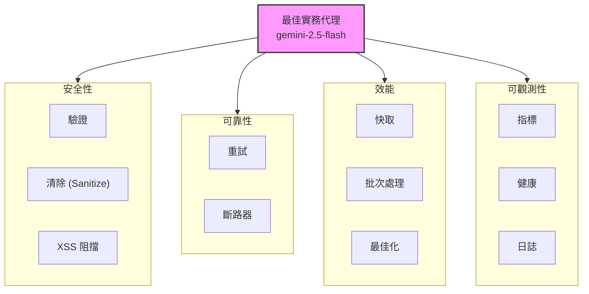
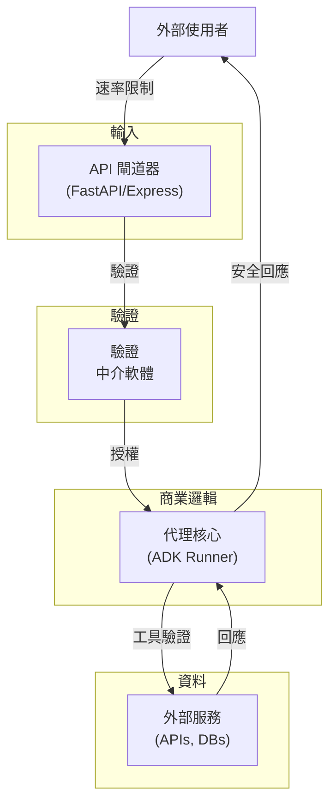
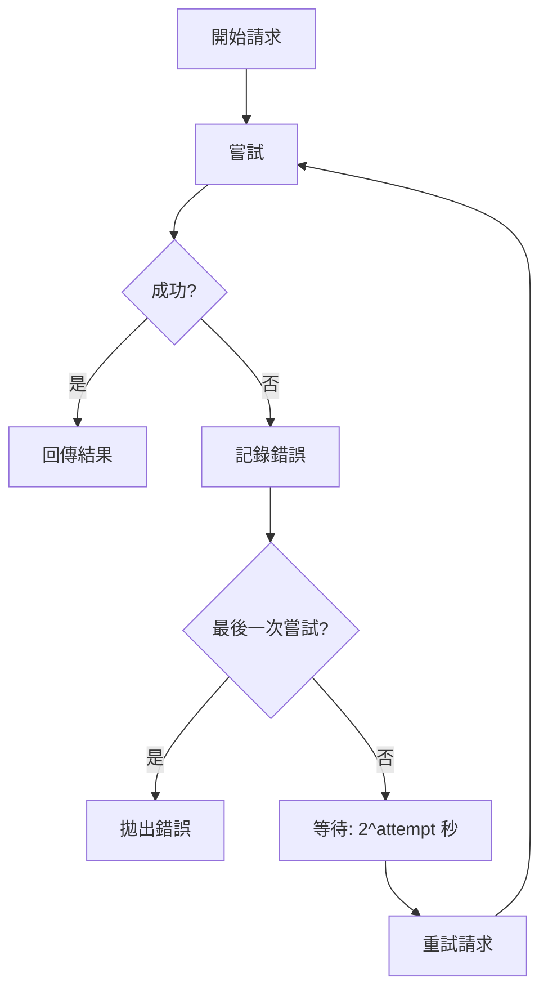
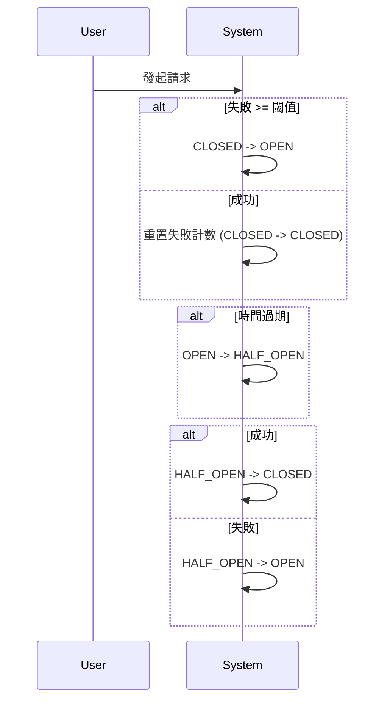
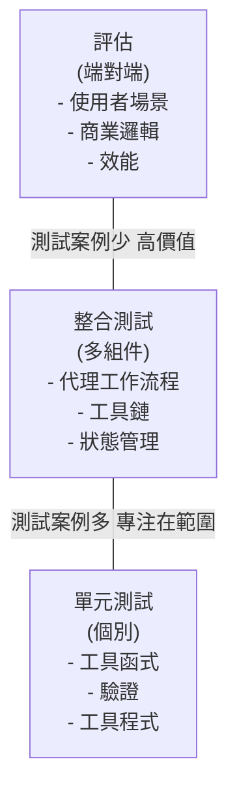
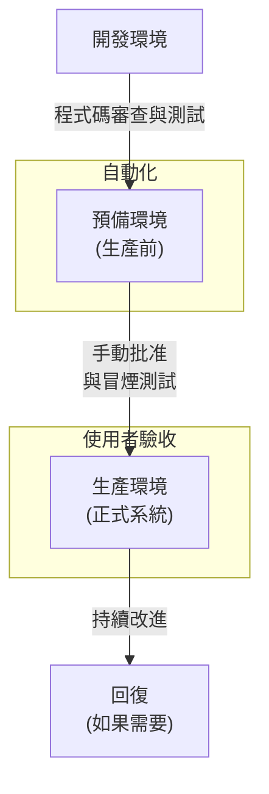

# 教學 25：最佳實務 - 生產級代理開發 (Tutorial 25: Best Practices - Production-Ready Agent Development)

**目標**: 掌握生產級模式、架構決策、最佳化策略、安全性最佳實務，以及建構強大代理系統的綜合指南。

**先決條件**:

- 所有先前的教學 (01-24)
- 建構代理的經驗
- 生產系統的理解

**您將學到**:

- 架構決策框架
- 效能最佳化策略
- 安全性與合規性最佳實務
- 錯誤處理與韌性模式
- 成本最佳化技術
- 測試與品質保證
- 生產部署檢查清單
- 常見陷阱與解決方案

**完成時間**: 60-75 分鐘

---

## 實作範例 (Working Implementation)

儲存庫中提供了此教學的完整、經過測試的實作：

 **[查看教學 25 (best-practices-agent) 實作 →](../../../python/agents/best-practices-agent/)**

**參考 GitHub 儲存庫**: [Tutorial 25 Implementation](https://github.com/raphaelmansuy/adk_training/tree/main/tutorial_implementation/tutorial25)

實作包含：

- ✅ **最佳實務代理 (Best Practices Agent)** 使用 `gemini-2.5-flash` 模型
- ✅ **7 個生產工具**: 驗證、重試、斷路器、快取、批次處理、健康檢查、指標
- ✅ **85+ 個綜合測試** 涵蓋所有功能
- ✅ **Makefile** 包含設定、開發、測試、演示指令
- ✅ **完整的 README** 包含使用範例與生產部署

快速開始：

```bash
cd tutorial_implementation/tutorial25
make setup
export GOOGLE_API_KEY=your_key
make dev
```

---

## 架構概觀 (Architecture Overview)

**best_practices_agent** 展示了企業級模式：



### 核心組件 (Core Components)

**安全性與驗證 (Security & Validation)** (`validate_input_tool`)
- 基於 Pydantic 的驗證與型別檢查
- 使用 `EmailStr` 進行電子郵件格式驗證
- SQL 注入與 XSS 模式偵測
- 文字長度限制與優先級驗證

**可靠性與韌性 (Reliability & Resilience)**
- **重試邏輯** (`retry_with_backoff_tool`): 指數退避 (1s, 2s, 4s)
- **斷路器** (`circuit_breaker_call_tool`): 防止連鎖故障

**效能最佳化 (Performance Optimization)**
- **快取系統** (`cache_operation_tool`): 基於 TTL 的快取與命中/未命中追蹤
- **批次處理** (`batch_process_tool`): 高效的批次操作

**可觀測性與監控 (Observability & Monitoring)**
- **健康檢查** (`health_check_tool`): 系統狀態監控
- **指標收集** (`get_metrics_tool`): 效能統計

### 3. 工具設計 (Tool Design)

**原則**:

```python
# ✅ 做：小型、專注的工具
def get_order_status(order_id: str) -> str:
    """取得特定訂單的狀態。"""
    # 單一職責
    return fetch_order_status(order_id)


# ❌ 不做：大型、多用途的工具
def handle_order_operations(
    operation: str,
    order_id: str,
    amount: float,
    reason: str,
    ...
) -> str:
    """處理所有訂單操作。"""
    # 太多職責
    if operation == 'status':
        return get_status(order_id)
    elif operation == 'cancel':
        return cancel_order(order_id, reason)
    # ... 還有更多操作
```

---

## 效能最佳化 (Performance Optimization)

### 1. 提示工程 (Prompt Engineering)

```python
# ✅ 好：清晰、結構化的指令
instruction = """
您是一名客戶服務代理。請遵循以下流程：

1. 專業地向客戶問候
2. 瞭解他們的問題
3. 使用工具收集資訊
4. 提供清晰且準確的回應
5. 詢問是否需要其他幫助

指導方針：
- 保持禮貌與專業
- 使用簡單的語言
- 在回應前驗證資訊
""".strip()


# ❌ 壞：模糊、冗長的指令
instruction = """
您幫助客戶，應該要友善，在需要時使用工具，並試著回答他們的問題，如果覺得有幫助，或許也可以問他們問題...
""".strip()
```

### 2. 上下文視窗管理 (Context Window Management)

```python
from google.adk.agents import Session

# ✅ 好：定期清除舊的上下文
session = Session()

for i, query in enumerate(queries):
    if i % 10 == 0:
        # 每 10 個查詢清除一次 session
        session = Session()

    result = runner.run(query, agent=agent, session=session)


# ✅ 好：總結長對話
if len(session.state.get('history', [])) > 20:
    summary = summarize_conversation(session)
    session.state['history'] = [summary]
```

### 3. 快取策略 (Caching Strategies)

```python
from functools import lru_cache
import time

# ✅ 快取昂貴的操作
@lru_cache(maxsize=1000)
def get_product_info(product_id: str) -> dict:
    """取得產品資訊 (已快取)。"""
    # 昂貴的資料庫查詢
    return fetch_from_database(product_id)


# ✅ 基於時間的快取無效化
class CachedDataStore:
    def __init__(self, ttl_seconds: int = 300):
        self.cache = {}
        self.ttl = ttl_seconds

    def get(self, key: str):
        if key in self.cache:
            value, timestamp = self.cache[key]
            if time.time() - timestamp < self.ttl:
                return value
            del self.cache[key]
        return None

    def set(self, key: str, value):
        self.cache[key] = (value, time.time())
```

### 4. 平行處理 (Parallel Processing)

```python
import asyncio
from google.genai import types

# ✅ 好：平行處理獨立的查詢
async def batch_process(queries: list[str], agent: Agent):
    """平行處理多個查詢。"""

    runner = InMemoryRunner(agent=agent, app_name='batch_app')

    # 為批次處理建立 session
    session = await runner.session_service.create_session(
        app_name='batch_app',
        user_id='batch_user'
    )

    async def process_single_query(query: str) -> str:
        """處理單一查詢並提取回應。"""
        new_message = types.Content(
            role='user',
            parts=[types.Part(text=query)]
        )

        responses = []
        async for event in runner.run_async(
            user_id='batch_user',
            session_id=session.id,
            new_message=new_message
        ):
            if event.content and event.content.parts:
                responses.append(event.content.parts[0].text)

        return responses[-1] if responses else ""

    tasks = [process_single_query(query) for query in queries]
    results = await asyncio.gather(*tasks)
    return results


# ❌ 壞：順序處理 (較慢但較簡單)
async def sequential_process(queries: list[str], agent: Agent):
    """順序處理查詢。"""

    runner = InMemoryRunner(agent=agent, app_name='sequential_app')
    session = await runner.session_service.create_session(
        app_name='sequential_app',
        user_id='seq_user'
    )

    results = []
    for query in queries:
        new_message = types.Content(
            role='user',
            parts=[types.Part(text=query)]
        )

        async for event in runner.run_async(
            user_id='seq_user',
            session_id=session.id,
            new_message=new_message
        ):
            if event.content and event.content.parts:
                results.append(event.content.parts[0].text)
                break  # 取第一個回應

    return results
```

---

## 安全性最佳實務 (Security Best Practices)

**縱深防禦 - 安全層級 (Defense in Depth - Security Layers):**



**各層級的安全性控制 (Security Controls by Layer):**
- **網路**: 速率限制、IP 過濾
- **應用程式**: 輸入驗證、身分驗證
- **商業邏輯**: 授權、工具安全性
- **資料**: 消毒、加密

### 1. 輸入驗證 (Input Validation)

```python
from pydantic import BaseModel, validator, Field

class QueryRequest(BaseModel):
    """已驗證的查詢請求。"""

    query: str = Field(..., min_length=1, max_length=10000)
    user_id: str = Field(..., regex=r'^[A-Za-z0-9_-]+$')

    @validator('query')
    def validate_query(cls, v):
        """驗證查詢內容。"""

        # 阻擋 SQL 注入嘗試
        dangerous_patterns = ['DROP TABLE', 'DELETE FROM', '; --']
        v_upper = v.upper()

        for pattern in dangerous_patterns:
            if pattern in v_upper:
                raise ValueError(f"Potentially dangerous pattern detected")

        return v

    @validator('user_id')
    def validate_user_id(cls, v):
        """驗證使用者 ID 格式。"""

        if len(v) > 100:
            raise ValueError("User ID too long")

        return v


# 使用方式
try:
    request = QueryRequest(
        query="What is AI?",
        user_id="user_12345"
    )
except ValueError as e:
    print(f"Invalid request: {e}")
```

### 2. 驗證與授權 (Authentication & Authorization)

```python
from fastapi import FastAPI, Depends, HTTPException, Security
from fastapi.security import HTTPBearer, HTTPAuthorizationCredentials

app = FastAPI()
security = HTTPBearer()


async def verify_token(
    credentials: HTTPAuthorizationCredentials = Security(security)
) -> str:
    """驗證身分驗證權杖。"""

    token = credentials.credentials

    # 驗證權杖 (例如：JWT 驗證)
    user_id = verify_jwt_token(token)

    if not user_id:
        raise HTTPException(status_code=401, detail="Invalid token")

    return user_id


@app.post("/invoke")
async def invoke_agent(
    request: QueryRequest,
    user_id: str = Depends(verify_token)
):
    """帶有身分驗證的代理調用。"""

    # 檢查授權
    if not user_has_permission(user_id, 'invoke_agent'):
        raise HTTPException(status_code=403, detail="Forbidden")

    # 處理請求
    result = await runner.run_async(request.query, agent=agent)

    return {"response": result.content.parts[0].text}
```

### 3. 秘密管理 (Secrets Management)

```python
from google.cloud import secretmanager
import os

class SecretsManager:
    """集中式秘密管理。"""

    def __init__(self):
        self.client = secretmanager.SecretManagerServiceClient()
        self.project_id = os.environ['GOOGLE_CLOUD_PROJECT']

    def get_secret(self, secret_id: str) -> str:
        """檢索秘密值。"""

        name = f"projects/{self.project_id}/secrets/{secret_id}/versions/latest"
        response = self.client.access_secret_version(request={"name": name})
        return response.payload.data.decode('UTF-8')


# 使用方式
secrets = SecretsManager()
api_key = secrets.get_secret('openai-api-key')

# ❌ 絕不硬編碼秘密
# api_key = "sk-proj-abc123..."  # 不要這樣做
```

### 4. 速率限制 (Rate Limiting)

```python
from fastapi import Request, HTTPException
import time
from collections import defaultdict

class RateLimiter:
    """權杖桶速率限制器。"""

    def __init__(self, requests_per_minute: int = 60):
        self.rate = requests_per_minute / 60.0  # 每秒請求數
        self.buckets = defaultdict(lambda: {'tokens': requests_per_minute, 'last_update': time.time()})
        self.capacity = requests_per_minute

    def is_allowed(self, client_id: str) -> bool:
        """檢查是否允許請求。"""

        bucket = self.buckets[client_id]
        now = time.time()

        # 根據經過的時間增加權杖
        elapsed = now - bucket['last_update']
        bucket['tokens'] = min(
            self.capacity,
            bucket['tokens'] + elapsed * self.rate
        )
        bucket['last_update'] = now

        # 檢查我們是否有權杖
        if bucket['tokens'] >= 1:
            bucket['tokens'] -= 1
            return True

        return False


rate_limiter = RateLimiter(requests_per_minute=100)


@app.middleware("http")
async def rate_limit_middleware(request: Request, call_next):
    """速率限制中介軟體。"""

    client_id = request.client.host

    if not rate_limiter.is_allowed(client_id):
        raise HTTPException(status_code=429, detail="Rate limit exceeded")

    response = await call_next(request)
    return response
```

---

## 錯誤處理與韌性 (Error Handling & Resilience)

### 1. 綜合錯誤處理 (Comprehensive Error Handling)

```python
from typing import Optional
import logging

logger = logging.getLogger(__name__)


async def robust_agent_invocation(
    query: str,
    agent: Agent,
    max_retries: int = 3
) -> Optional[str]:
    """帶有錯誤處理與重試的代理調用。"""

    runner = InMemoryRunner(agent=agent, app_name='robust_app')
    session = await runner.session_service.create_session(
        app_name='robust_app',
        user_id='retry_user'
    )

    for attempt in range(max_retries):
        try:
            new_message = types.Content(
                role='user',
                parts=[types.Part(text=query)]
            )

            responses = []
            async for event in runner.run_async(
                user_id='retry_user',
                session_id=session.id,
                new_message=new_message
            ):
                if event.content and event.content.parts:
                    responses.append(event.content.parts[0].text)

            return responses[-1] if responses else None

        except TimeoutError:
            logger.warning(f"Timeout on attempt {attempt + 1}")
            if attempt == max_retries - 1:
                raise
            await asyncio.sleep(2 ** attempt)  # 指數退避

        except ValueError as e:
            logger.error(f"Invalid input: {e}")
            raise  # 驗證錯誤不重試

        except Exception as e:
            logger.error(f"Unexpected error on attempt {attempt + 1}: {e}")
            if attempt == max_retries - 1:
                raise
            await asyncio.sleep(2 ** attempt)

    return None
```

**帶有指數退避的重試邏輯 (Retry Logic with Exponential Backoff):**



**退避排程 (Backoff Schedule):**
- 嘗試 1: 等待 1 秒 (2^0)
- 嘗試 2: 等待 2 秒 (2^1)
- 嘗試 3: 等待 4 秒 (2^2)

### 2. 斷路器模式 (Circuit Breaker Pattern)

```python
import time
from enum import Enum

class CircuitState(Enum):
    CLOSED = "closed"
    OPEN = "open"
    HALF_OPEN = "half_open"


class CircuitBreaker:
    """外部依賴的斷路器。"""

    def __init__(
        self,
        failure_threshold: int = 5,
        timeout_seconds: int = 60
    ):
        self.failure_threshold = failure_threshold
        self.timeout = timeout_seconds
        self.failures = 0
        self.last_failure_time = None
        self.state = CircuitState.CLOSED

    def call(self, func, *args, **kwargs):
        """使用斷路器執行函式。"""

        if self.state == CircuitState.OPEN:
            if time.time() - self.last_failure_time > self.timeout:
                self.state = CircuitState.HALF_OPEN
            else:
                raise Exception("Circuit breaker is OPEN")

        try:
            result = func(*args, **kwargs)

            if self.state == CircuitState.HALF_OPEN:
                self.state = CircuitState.CLOSED
                self.failures = 0

            return result

        except Exception as e:
            self.failures += 1
            self.last_failure_time = time.time()

            if self.failures >= self.failure_threshold:
                self.state = CircuitState.OPEN

            raise


# 使用方式
external_api_breaker = CircuitBreaker(failure_threshold=3, timeout_seconds=30)

def call_external_api():
    """使用斷路器呼叫外部 API。"""
    return external_api_breaker.call(make_api_request)
```

**斷路器狀態機 (Circuit Breaker State Machine):**



**狀態轉換 (State Transitions):**
- **CLOSED**: 正常運作，請求通過
- **OPEN**: 服務失敗，請求被阻擋
- **HALF_OPEN**: 測試服務是否已恢復

### 3. 優雅降級 (Graceful Degradation)

```python
async def get_product_recommendation(
    user_id_param: str,
    agent: Agent,
    fallback_to_popular: bool = True
) -> list[str]:
    """取得個人化推薦，並提供備援方案。"""

    runner = InMemoryRunner(agent=agent, app_name='recommendation_app')
    session = await runner.session_service.create_session(
        app_name='recommendation_app',
        user_id='rec_user'
    )

    try:
        # 嘗試個人化推薦
        query = f"Recommend products for user {user_id_param}"
        new_message = types.Content(
            role='user',
            parts=[types.Part(text=query)]
        )

        responses = []
        async for event in runner.run_async(
            user_id='rec_user',
            session_id=session.id,
            new_message=new_message
        ):
            if event.content and event.content.parts:
                responses.append(event.content.parts[0].text)
                break

        recommendations = parse_recommendations(responses[0] if responses else "")
        if recommendations:
            return recommendations

    except TimeoutError:
        logger.warning("Recommendation timeout, using fallback")

    except Exception as e:
        logger.error(f"Recommendation error: {e}")

    # 備援至熱門產品
    if fallback_to_popular:
        return get_popular_products()

    return []
```

---

## 成本最佳化 (Cost Optimization)

### 1. 模型層級選擇 (Model Tier Selection)

```python
# ✅ 對簡單任務使用較便宜的模型
simple_classifier = Agent(
    model='gemini-2.5-flash-lite',  # 最便宜的 2.5 模型
    instruction="Classify customer sentiment: positive, negative, or neutral"
)

# ✅ 對標準任務使用中等模型
standard_agent = Agent(
    model='gemini-2.5-flash',  # 平衡效能/成本
    instruction="Answer customer questions and provide support"
)

# ✅ 僅在需要時使用昂貴模型
complex_analyzer = Agent(
    model='gemini-2.5-pro',  # 最昂貴的 2.5 模型
    instruction="Perform deep financial analysis and complex reasoning"
)


# ✅ 針對 2.5 模型的動態模型選擇
def get_agent_for_query(query: str) -> Agent:
    """根據查詢複雜度選擇適當的代理。"""

    complexity = estimate_complexity(query)

    if complexity == 'simple':
        return Agent(model='gemini-2.5-flash-lite')
    elif complexity == 'moderate':
        return Agent(model='gemini-2.5-flash')
    else:
        return Agent(model='gemini-2.5-pro')
```

### 2. 權杖使用最佳化 (Token Usage Optimization)

```python
# ✅ 好：簡潔的指令
instruction = "Summarize user feedback in 2-3 sentences."

# ❌ 壞：冗長的指令
instruction = """
Please carefully read the user feedback provided below and
create a comprehensive summary that captures all the key points
and important details while being concise but thorough and
making sure not to miss any critical information...
"""


# ✅ 好：限制輸出權杖
agent.generate_content_config = types.GenerateContentConfig(
    max_output_tokens=256  # 限制短回應
)

# ❌ 壞：無限制權杖
agent.generate_content_config = types.GenerateContentConfig(
    max_output_tokens=8192  # 可能產生不必要的長回應
)
```

### 3. 快取與重複使用 (Caching & Reuse)

```python
# ✅ 快取代理實例
_agent_cache = {}

def get_agent(model: str, instruction: str) -> Agent:
    """取得快取的代理實例。"""

    cache_key = f"{model}:{hash(instruction)}"

    if cache_key not in _agent_cache:
        _agent_cache[cache_key] = Agent(
            model=model,
            instruction=instruction
        )

    return _agent_cache[cache_key]


# ✅ 批次處理相似查詢
async def batch_classify(texts: list[str], classifier: Agent) -> list[str]:
    """為了成本效益的批次分類。"""

    runner = InMemoryRunner(agent=classifier, app_name='batch_classify_app')
    session = await runner.session_service.create_session(
        app_name='batch_classify_app',
        user_id='batch_classify_user'
    )

    # 處理單一查詢而非多個
    combined_query = "\n".join([
        f"{i+1}. {text}" for i, text in enumerate(texts)
    ])

    prompt = f"Classify sentiment for each item:\n\n{combined_query}"
    new_message = types.Content(
        role='user',
        parts=[types.Part(text=prompt)]
    )

    responses = []
    async for event in runner.run_async(
        user_id='batch_classify_user',
        session_id=session.id,
        new_message=new_message
    ):
        if event.content and event.content.parts:
            responses.append(event.content.parts[0].text)

    return parse_batch_results(responses[0] if responses else "")
```

---

## 測試與品質保證 (Testing & Quality Assurance)

**代理系統的測試金字塔 (Testing Pyramid for Agent Systems):**



**測試覆蓋策略 (Test Coverage Strategy):**
- **單元測試 (Unit Tests)**: 70-80% 覆蓋率 (快速、隔離)
- **整合測試 (Integration Tests)**: 20-30% 覆蓋率 (工作流程、互動)
- **評估測試 (Evaluation Tests)**: 5-10% 覆蓋率 (端對端場景)

### 1. 單元測試 (Unit Tests)

```python
import pytest
from unittest.mock import Mock, AsyncMock

@pytest.mark.asyncio
async def test_agent_basic_query():
    """測試基本代理查詢。"""

    agent = Agent(
        model='gemini-2.5-flash',
        instruction="Answer concisely"
    )

    runner = InMemoryRunner(agent=agent, app_name='test_app')
    session = await runner.session_service.create_session(
        app_name='test_app',
        user_id='test_user'
    )

    new_message = types.Content(
        role='user',
        parts=[types.Part(text="What is 2+2?")]
    )

    responses = []
    async for event in runner.run_async(
        user_id='test_user',
        session_id=session.id,
        new_message=new_message
    ):
        if event.content and event.content.parts:
            responses.append(event.content.parts[0].text)

    assert '4' in responses[0]


@pytest.mark.asyncio
async def test_tool_invocation():
    """測試工具是否被正確呼叫。"""

    mock_tool = Mock()
    mock_tool.return_value = "Order status: shipped"

    agent = Agent(
        model='gemini-2.5-flash',
        tools=[FunctionTool(mock_tool)]
    )

    runner = InMemoryRunner(agent=agent, app_name='test_tool_app')
    session = await runner.session_service.create_session(
        app_name='test_tool_app',
        user_id='test_user'
    )

    new_message = types.Content(
        role='user',
        parts=[types.Part(text="Check order ORD-123")]
    )

    async for event in runner.run_async(
        user_id='test_user',
        session_id=session.id,
        new_message=new_message
    ):
        pass  # 僅執行至完成

    # 驗證工具已被呼叫
    assert mock_tool.called
```

### 2. 整合測試 (Integration Tests)

```python
@pytest.mark.asyncio
async def test_multi_agent_workflow():
    """測試完整的多代理工作流程。"""

    order_agent = Agent(model='gemini-2.5-flash', name='order')
    billing_agent = Agent(model='gemini-2.5-flash', name='billing')

    coordinator = Agent(
        model='gemini-2.5-flash',
        name='coordinator',
        agents=[order_agent, billing_agent]
    )

    runner = InMemoryRunner(agent=coordinator, app_name='test_multi_app')
    session = await runner.session_service.create_session(
        app_name='test_multi_app',
        user_id='test_user'
    )

    new_message = types.Content(
        role='user',
        parts=[types.Part(text="Check my order and billing status")]
    )

    responses = []
    async for event in runner.run_async(
        user_id='test_user',
        session_id=session.id,
        new_message=new_message
    ):
        if event.content and event.content.parts:
            responses.append(event.content.parts[0].text)

    response = " ".join(responses).lower()

    # 驗證兩個代理都有貢獻
    assert 'order' in response or 'billing' in response
```

### 3. 評估框架 (Evaluation Framework)

```python
from google.adk.evaluation import evaluate

# 定義測試案例
test_cases = [
    {
        'query': 'What is AI?',
        'expected_keywords': ['artificial', 'intelligence', 'computer']
    },
    {
        'query': 'Calculate 15% of 200',
        'expected_keywords': ['30']
    }
]


async def run_evaluation(agent: Agent):
    """執行綜合評估。"""

    runner = InMemoryRunner(agent=agent, app_name='eval_app')
    session = await runner.session_service.create_session(
        app_name='eval_app',
        user_id='eval_user'
    )

    results = []

    for test in test_cases:
        new_message = types.Content(
            role='user',
            parts=[types.Part(text=test['query'])]
        )

        responses = []
        async for event in runner.run_async(
            user_id='eval_user',
            session_id=session.id,
            new_message=new_message
        ):
            if event.content and event.content.parts:
                responses.append(event.content.parts[0].text)

        response = responses[0].lower() if responses else ""

        score = sum(1 for kw in test['expected_keywords'] if kw in response)
        max_score = len(test['expected_keywords'])

        results.append({
            'query': test['query'],
            'score': score / max_score,
            'response': response
        })

    avg_score = sum(r['score'] for r in results) / len(results)

    print(f"Average Score: {avg_score * 100:.1f}%")

    return results
```

---

## 生產部署檢查清單 (Production Deployment Checklist)

**分階段部署流程 (Staged Deployment Pipeline):**



### 部署前 (Pre-Deployment)

- [ ] 所有測試通過 (單元、整合、評估)
- [ ] 安全性審查完成
- [ ] 效能基準符合 SLA
- [ ] 錯誤處理已測試
- [ ] 速率限制已設定
- [ ] 監控與警報設定
- [ ] 秘密儲存在 Secret Manager
- [ ] 文件已更新

### 部署 (Deployment)

- [ ] 分階段推出 (開發 → 預備 → 生產)
- [ ] 健康檢查已設定
- [ ] 自動擴展已啟用
- [ ] 備份與還原已測試
- [ ] 回復計畫已記錄
- [ ] 待命輪值已排程

### 部署後 (Post-Deployment)

- [ ] 監控異常指標
- [ ] 審查錯誤日誌
- [ ] 收集使用者回饋
- [ ] 根據 SLI/SLO 進行測量
- [ ] 記錄經驗教訓
- [ ] 規劃最佳化迭代

---

## 常見陷阱與解決方案 (Common Pitfalls & Solutions)

### 陷阱 1：過於複雜的指令

**問題**: 冗長、雜亂的指令會混淆模型。

**解決方案**:

```python
# ❌ 壞
instruction = "您需要幫助使用者解決問題，並且要友善..."

# ✅ 好
instruction = """
角色：客戶支援助理
任務：回答問題、解決問題
語氣：專業、有幫助
""".strip()
```

### 陷阱 2：無錯誤處理

**問題**: 發生第一個錯誤時崩潰。

**解決方案**:

```python
# ✅ 綜合錯誤處理
```python
try:
    new_message = types.Content(role='user', parts=[types.Part(text=query)])
    async for event in runner.run_async(
        user_id='user_id',
        session_id=session.id,
        new_message=new_message
    ):
        if event.content and event.content.parts:
            response = event.content.parts[0].text
except TimeoutError:
    # 處理逾時
    response = "請求逾時，請再試一次"
except ValueError as e:
    # 處理驗證錯誤
    response = f"無效的輸入: {e}"
except Exception as e:
    logger.error(f"發生未預期的錯誤: {e}")
    response = "發生錯誤，請稍後再試"
```
    # 優雅降級
```
### 陷阱 3：忽略上下文限制

**問題**: 超過上下文視窗導致失敗。

**解決方案**:

```python
# ✅ 管理上下文大小
def trim_history(history: list, max_length: int = 10) -> list:
    """僅保留最近的歷史記錄。"""
    if len(history) > max_length:
        return history[-max_length:]
    return history
```

### 陷阱 4：無監控

**問題**: 無法看見生產行為。

**解決方案**:

```python
# ✅ 綜合監控 - 正確方法
from google.adk.runners import InMemoryRunner
from google.adk.plugins import BasePlugin

# 向 Runner 註冊插件 (而非 RunConfig)
runner = InMemoryRunner(
    agent=agent,
    app_name='monitored_app',
    plugins=[metrics_plugin, alerting_plugin]
)

# 若要進行雲端追蹤，請使用部署時的 CLI 旗標：
# adk deploy cloud_run --trace_to_cloud
# 或者針對 Agent Engine:
# from google.adk.apps.agent_engine_utils import AdkApp
# app = AdkApp(agent=agent, enable_tracing=True)
```

---

## 總結 (Summary)

您已完成完整的 ADK 培訓系列！

**所有 25 個教學的關鍵重點**:

**基礎 (01-05)**:

- ✅ 代理基礎與模型整合
- ✅ 功能工具與 OpenAPI 整合
- ✅ 順序、平行與迴圈工作流程

**進階功能 (06-10)**:

- ✅ 多代理系統與協調
- ✅ 多輪對話與狀態管理
- ✅ 回呼、護欄、評估框架

**生產能力 (11-18)**:

- ✅ 內建工具 (搜尋、接地、程式碼執行)
- ✅ 規劃器與思考模式
- ✅ 串流 (SSE 與雙向)
- ✅ MCP 整合、A2A 協定
- ✅ 事件與綜合可觀測性

**設定與部署 (19-25)**:

- ✅ 成品與檔案管理
- ✅ YAML 設定
- ✅ 多模態與影像生成
- ✅ 模型選擇最佳化
- ✅ 生產部署策略
- ✅ 進階可觀測性與監控
- ✅ 最佳實務與生產模式

**最終生產檢查清單**:

- [ ] 架構已設計並記錄
- [ ] 模型選擇已最佳化
- [ ] 安全性已實作 (驗證、驗證、秘密)
- [ ] 錯誤處理與韌性模式
- [ ] 效能已最佳化 (快取、批次處理)
- [ ] 成本最佳化策略已應用
- [ ] 綜合測試 (單元、整合、評估)
- [ ] 監控與警報已設定
- [ ] 部署自動化已設定
- [ ] 文件完整
- [ ] 團隊已培訓
- [ ] 待命程序已記錄

**資源**:

- [ADK Documentation](https://google.github.io/adk-docs/)
- [Gemini API Documentation](https://ai.google.dev/docs)
- [Vertex AI Documentation](https://cloud.google.com/vertex-ai/docs)
- [ADK GitHub Repository](https://github.com/google/adk)

---
## 程式碼實現 (Code Implementation)

- best-practices-agent：[程式碼連結](../../../python/agents/best-practices-agent/)