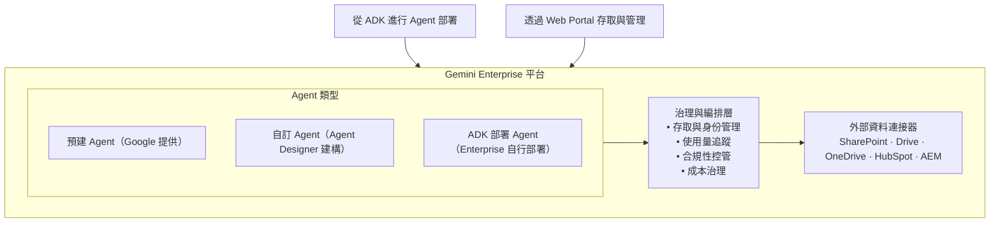
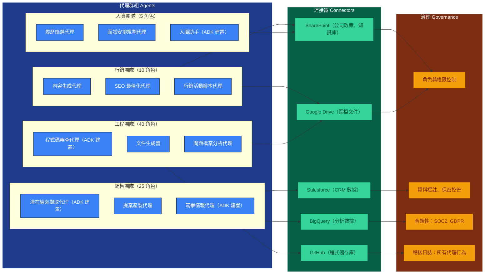

# 教學 26：Gemini Enterprise - 企業級代理管理

ℹ️ 產品更名

**注意**：Google AgentSpace 已於 2024 年底更名為 **Gemini Enterprise**。本教學使用目前的產品名稱和定價（已於 2025 年 10 月驗證）。
---


**目標**：使用 Google Cloud 的 **Gemini Enterprise** 平台（前身為 AgentSpace）在企業規模下部署和管理 AI 代理。

**先決條件**：

- 教學 01 (Hello World Agent)
- 教學 02 (Function Tools)
- 教學 06 (Agents & Orchestration)
- 已啟用計費功能的 Google Cloud 帳戶

**您將學到**：

- 了解 Gemini Enterprise 架構
- 透過 Vertex AI Agent Builder 將 ADK 代理部署到 Gemini Enterprise
- 使用 Google 預建代理（創意生成、深度研究、NotebookLM）
- 使用 Agent Designer（無程式碼建構器）建立自訂代理
- 透過治理和編排大規模管理代理
- 整合企業資料來源（SharePoint、Drive、OneDrive、Salesforce）
- Gemini Enterprise 定價和授權（商業版 21 美元，企業標準版 30 美元，Plus 自訂）
- 企業代理管理的最佳實務

---

## 什麼是 Gemini Enterprise？

**Gemini Enterprise**（前身為 Google AgentSpace）是 Google Cloud 的**用於大規模管理 AI 代理的企業平台**。

**官方網站**：[cloud.google.com/gemini-enterprise](https://cloud.google.com/gemini-enterprise)

**歷史註記**：此產品最初以 "Google AgentSpace" 推出，並於 2024 年底更名為 "Gemini Enterprise"，以與 Google 統一的 Gemini AI 品牌保持一致。

**與 ADK 的關係**：

- **ADK (Agent Development Kit)**：用於在本地*建構*代理的框架
- **Gemini Enterprise**：用於大規模*部署和管理*代理的平台
- 思考模式：**ADK = 開發 (Development)** | **Gemini Enterprise = 營運 (Operations)**



**為什麼使用 Gemini Enterprise？**

| 需求 | Gemini Enterprise 解決方案 |
| ------------------------------- | ----------------------------------------------- |
| 將 ADK 代理部署到生產環境 | 具備自動擴展功能的託管主機 |
| 管理多個代理 | 具有探索和分享功能的代理程式庫 (Agent Gallery) |
| 控制代理存取 | 角色型存取控制 (RBAC) |
| 監控代理使用情況 | 內建的可觀測性和分析 |
| 連接到企業資料 | 預建連接器（SharePoint、Drive 等） |
| 確保合規性 | 治理政策和稽核日誌 |
| 低程式碼代理建立 | 適合非開發人員的 Agent Designer |
| 快速開始 | 預建 Google 代理（創意生成等） |

---

## 1. 預建 Google 代理

Gemini Enterprise 包含由 Google 建構的**生產就緒代理**：

### 創意生成代理 (Idea Generation Agent)

**功能**：根據提示和上下文生成創意想法。

**使用案例**：

- 行銷活動
- 產品腦力激盪
- 內容創作
- 策略規劃

**範例**：

```
使用者：「為我們新的永續產品線產生 5 個行銷活動創意」

代理：
1. 「綠色未來挑戰」- 鼓勵用戶分享永續發展成果的社群媒體活動
2. 「碳倒數計時」- 顯示更換產品對環境影響的互動式計算器
3. 「生態戰士計畫」- 具有永續發展獎勵的忠誠度計畫
4. 「自然回歸」- 顯示環境復育的擴增實境體驗
5. 「永續故事」- 專題介紹客戶永續發展歷程的影片系列
```

### 深度研究代理 (Deep Research Agent)

**功能**：透過搜尋、分析和綜合資訊進行全面研究。

**使用案例**：

- 市場研究
- 競爭分析
- 盡職調查
- 文獻回顧
- 技術調查

**資料來源**：

- Google 搜尋
- 已連接的企業文件
- 公共資料集
- 新聞文章
- 研究論文

**範例**：

```
使用者：「研究電動車電池技術的新興趨勢」

代理：
[報告] 研究報告：電動車電池技術趨勢 (2025)

主要發現：
1. 固態電池：續航里程提升 50%，2026 年商業化
2. 磷酸鐵鋰 (LFP)：自 2023 年以來成本降低 30%
3. 矽陽極：能量密度增加 20-40%
4. 乾電極塗層：製造成本降低 15%
5. 電池即服務模式興起

市場領導者：
- QuantumScape (固態)
- CATL (LFP 創新)
- Panasonic (矽陽極)
- Tesla (4680 電池)

來源：[15 筆來自研究論文、產業報告、新聞的引用]
```

### NotebookLM Enterprise

**功能**：用於研究、筆記和知識綜合的 AI 驅動筆記本。

**特色**：

- 文件上傳與分析
- 與文件進行互動式問答
- 自動摘要
- 引用追蹤
- 協作工作區

**使用案例**：

- 法律文件審查
- 研究論文分析
- 會議記錄與行動項目
- 知識庫建立

**範例工作流程**：

1. 上傳 10 份技術白皮書
2. 詢問：「這些論文中常見的安全漏洞有哪些？」
3. NotebookLM 分析所有文件
4. 提供帶有引用的綜合答案
5. 產生摘要報告

---

## 2. 為什麼使用 Gemini Enterprise？

| 功能 | 原因 |
| ------------------------ | -------------------------------------------------------------------------------------------------------------- |
| **無基礎設施** | 零 Kubernetes/擴展擔憂 - 隨插即用 |
| **企業就緒** | 內建身份驗證、稽核日誌、SOC2/HIPAA 合規性 |
| **預建代理** | 經過測試的 Google 代理程式庫（例如：深度研究、NotebookLM、創意生成），可立即使用 |
| **Agent Designer** | 無程式碼建構器，讓使用者透過 GUI 建立代理 |
| **資料連接器** | 一鍵整合 Drive、Gmail、Salesforce、SharePoint、Adobe Experience Manager、ServiceNow 和 SAP |
| **統一治理** | 集中控制所有代理（自訂 + Google 的）、權限、機密、資料存取 |
| **按量付費代理** | 僅支付推理成本；無服務模型的虛擬機器成本 |

---

## 3. 代理程式庫 (Agent Gallery)

**Agent Gallery** 是 Gemini Enterprise 用於**探索和分享代理的市集**。

### 特色

**對於使用者**：

- 瀏覽可用的代理
- 按類別搜尋（行銷、工程、銷售、人資）
- 查看代理評分和評論
- 部署前試用代理
- 一鍵安裝

**對於創作者**：

- 發布代理到公司程式庫
- 追蹤使用指標
- 接收回饋
- 更新代理而不破壞部署
- 貨幣化（企業層級）

### 範例類別

**行銷**：

- 內容生成器
- SEO 最佳化器
- 活動規劃器
- 社群媒體排程器
- 品牌聲音分析器

**銷售**：

- 潛在客戶資格篩選器
- 提案撰寫器
- 競爭情報
- CRM 助手
- 電郵起草器

**工程**：

- 程式碼審查器
- 文件生成器
- 錯誤分析器
- 測試案例建立器
- 架構顧問

**人資**：

- 履歷篩選器
- 面試安排器
- 入職助手
- 政策解說器
- 績效評估幫手

### 使用程式庫代理

```python
# 概念範例 - 實際 API 使用 Vertex AI Agent Builder
from google.cloud import aiplatform
from google.cloud.aiplatform import AgentBuilderClient

# 初始化 Vertex AI
aiplatform.init(project='your-project', location='us-central1')

# 從程式庫列出可用的代理
client = AgentBuilderClient()
agents = client.list_agents(parent='projects/your-project/locations/us-central1')
for agent in agents:
    print(f"{agent.display_name}: {agent.description}")

# 部署自訂 ADK 代理（使用 adk deploy 指令，或透過程式）
# adk deploy agent_engine --agent-path ./my_agent --project your-project

# 透過 Agent Builder API 查詢已部署的代理
agent_name = 'projects/your-project/locations/us-central1/agents/agent-abc123'
response = client.query_agent(
    agent=agent_name,
    query_input="Generate blog post outline about AI in healthcare" # 產生關於醫療保健 AI 的部落格文章大綱
)
print(response.response_text)
```

---

## 4. 將 ADK 代理部署到 Gemini Enterprise

**使用 ADK 本地建構 → 部署到 Gemini Enterprise 進行生產**

### 部署流程

**步驟 1：使用 ADK 建構代理**（本地開發）

```python
# agent.py
from google.adk.agents import Agent
from google.adk.tools import FunctionTool

def analyze_sales_data(quarter: str, region: str) -> dict:
    """分析特定季度和地區的銷售業績。"""
    # 您的商業邏輯
    return {
        'revenue': 1250000,
        'growth': '+15%',
        'top_products': ['Product A', 'Product B']
    }

sales_agent = Agent(
    model='gemini-2.5-flash',
    name='sales_analyst',
    description='分析銷售數據並提供洞察',
    instruction="""
    你是一位銷售數據分析師。
    提供清晰、可操作的見解。
    強調趨勢和機會。
    """.strip(),
    tools=[FunctionTool(analyze_sales_data)]
)
```

**步驟 2：本地測試**

```python
from google.adk.agents import Runner

runner = Runner()
result = await runner.run_async(
    "What were our Q4 sales in the North region?", # 我們第四季在北部地區的銷售額是多少？
    agent=sales_agent
)
print(result.content.parts[0].text)
```

**步驟 3：打包以進行部署**

```bash
# 建立部署套件
adk package \
  --agent agent.py:sales_agent \
  --requirements requirements.txt \
  --output sales-agent-v1.zip
```

**步驟 4：部署到 Gemini Enterprise**

```bash
# 透過 ADK CLI (Vertex AI Agent Engine) 部署
adk deploy agent_engine \
  --agent-path ./my_agent \
  --project your-project \
  --region us-central1 \
  --display-name "Sales Analyst Agent"

# 或打包並手動部署
gcloud ai agent-builder agents create \
  --project=your-project \
  --region=us-central1 \
  --display-name="Sales Analyst Agent" \
  --description="Q4 sales analysis"

# 輸出：
# Deployed: sales-analyst-prod (agent-abc123)
# URL: https://console.cloud.google.com/gen-app-builder/agents/agent-abc123
```

**步驟 5：設定生產設定**

```yaml
# agentspace.yaml
name: sales-analyst-prod
version: 1.0.0
scaling:
  min_instances: 1
  max_instances: 10
  target_concurrency: 5
monitoring:
  alerts:
    - metric: error_rate
      threshold: 5%
      notification: ops-team@company.com
    - metric: latency_p95
      threshold: 2s
      notification: ops-team@company.com
governance:
  data_residency: us
  compliance: [SOC2, GDPR]
  audit_logging: true
connectors:
  - type: bigquery
    dataset: sales_data
    permissions: read
```

**步驟 6：在 Gemini Enterprise Console 中監控**

- 即時使用指標 (Cloud Console → Gen App Builder → Agents)
- 錯誤率與日誌 (Cloud Logging 整合)
- 成本追蹤 (BigQuery 計費匯出)
- 使用者回饋 (內建評分系統)
- 效能趨勢 (Cloud Monitoring 儀表板)

---

## 5. 資料連接器

Gemini Enterprise 為企業資料來源提供**預建連接器**。

### 可用的連接器

| 連接器 | 描述 | 使用案例 |
| ---------------- | ------------------------------ | ---------------------------------- |
| **Google Drive** | 存取 Drive 檔案和資料夾 | 文件搜尋、內容分析 |
| **SharePoint** | 連接到 SharePoint 網站 | 知識庫、政策文件 |
| **OneDrive** | 存取 OneDrive 商業版 | 個人檔案、團隊文件 |
| **HubSpot** | CRM 和行銷數據 | 潛在客戶管理、客戶洞察 |
| **Salesforce** | 銷售和 CRM 數據 | 機會分析、預測 |
| **Adobe AEM** | 數位資產管理 | 內容探索、資產元數據 |
| **BigQuery** | 資料倉儲查詢 | 分析、報告、洞察 |
| **Looker** | 商業智慧 | 儀表板數據、指標 |

### 設定連接器

**範例：SharePoint 連接器**

```yaml
# connector-config.yaml
connectors:
  - name: company-sharepoint
    type: sharepoint
    config:
      site_url: https://company.sharepoint.com/sites/knowledge-base
      authentication:
        type: oauth2
        client_id: ${SHAREPOINT_CLIENT_ID}
        client_secret: ${SHAREPOINT_CLIENT_SECRET}
      permissions:
        - read:documents
        - read:lists
    filters:
      - include: /Documents/**
      - exclude: /Documents/Archive/**
      - file_types: [.docx, .pdf, .xlsx]
    indexing:
      enabled: true
      schedule: daily
      incremental: true
```

**在代理中使用連接器**

```python
from google.adk.agents import Agent
from google.adk.tools import url_context

policy_agent = Agent(
    model='gemini-2.5-flash',
    name='policy_assistant',
    instruction="""
    你協助員工了解公司政策。
    回答時務必引用具體的政策文件。
    如果政策未涵蓋該問題，請清楚說明。
    """.strip(),
    tools=[
        url_context(
            name='company_policies',
            connector='company-sharepoint',
            path='/Documents/Policies/'
        )
    ]
)

# AgentSpace 自動處理：
# - 驗證到 SharePoint
# - 文件索引
# - 搜尋和檢索
# - 權限執行
```

---

## 6. 治理與編排

用於大規模管理代理的**企業級控制**。

### 存取控制

**角色型存取控制 (RBAC)**：

```yaml
# access-control.yaml
agents:
  - id: sales-analyst
    permissions:
      - role: sales-team
        access: [use, view_metrics]
      - role: sales-managers
        access: [use, view_metrics, edit_config]
      - role: admins
        access: [all]

  - id: hr-assistant
    permissions:
      - role: hr-team
        access: [use, view_metrics, edit_config]
      - role: employees
        access: [use]
      - role: contractors
        access: [] # 無權限
```

**資料存取控制**：

```yaml
data_governance:
  pii_handling:
    mode: strict
    allowed_fields: [name, email, department]
    redacted_fields: [ssn, salary, medical_info]

  data_residency:
    primary: us-central1
    replicas: [europe-west1]
    prohibited_regions: [asia-pacific]

  retention:
    conversations: 90_days
    logs: 1_year
    audit_trail: 7_years
```

### 使用監控

**內建指標**：

- 每日/每小時查詢數
- 平均回應時間
- 錯誤率
- Token 使用量
- 每次查詢成本
- 使用者滿意度分數

**自訂儀表板**：

```python
# 概念範例
from google.cloud.agentspace import monitoring

# 建立自訂儀表板
dashboard = monitoring.Dashboard('Sales Agent Analytics')

dashboard.add_widget(
    monitoring.TimeSeriesChart(
        metric='agent_queries',
        agent_id='sales-analyst',
        aggregation='sum',
        group_by='user_department'
    )
)

dashboard.add_widget(
    monitoring.ScoreCard(
        metric='average_satisfaction',
        agent_id='sales-analyst',
        threshold_good=4.0,
        threshold_warning=3.0
    )
)
```

### 成本管理

**預算控制**：

```yaml
budgets:
  - agent: sales-analyst
    monthly_limit: $500
    alerts:
      - threshold: 80%
        action: notify_owner
      - threshold: 100%
        action: pause_agent

  - team: marketing-team
    monthly_limit: $2000
    alerts:
      - threshold: 90%
        action: notify_manager
```

**成本最佳化**：

- 模型選擇（2.5-flash 用於常規，2.5-pro 用於複雜任務）
- 快取頻繁存取的資料
- 儘可能批次處理查詢
- 設定每次查詢的 token 限制
- 根據需求自動擴展

---

## 7. 定價與方案

**Gemini Enterprise 定價**（2025 年 10 月驗證）：

### Gemini Business

**價格**：**每席位每月 21 美元**

**適合對象**：小型企業和組織內的團隊

**包含內容**：

- 存取預建 Google 代理（創意生成、深度研究、NotebookLM）
- Agent Designer（無程式碼代理建構器）
- Agent Gallery 存取權
- 具有更高配額的 Gemini 聊天
- 資料連接器（Google Workspace, Microsoft 365）
- 每席位 25 GiB 儲存和資料索引（共用）
- 最多 300 個席位
- 社群支援

### Gemini Enterprise Standard

**價格**：**每席位每月 30 美元**

**適合對象**：需要企業級 IT 控制的大型組織

**包含 Business 的所有內容，加上**：

- Gemini Code Assist Standard（AI 程式碼編寫代理）
- 自帶 ADK 建構的代理或第三方代理
- 進階安全功能（VPC 服務控制、CMEK）
- 合規性支援（SOC2、GDPR、HIPAA、FedRAMP High）
- 用於資料駐留的主權資料邊界
- 每席位 75 GiB 儲存（共用）
- 無限席位
- 進階治理和稽核日誌

### Gemini Enterprise Plus

**價格**：**聯繫銷售人員取得自訂報價**

**適合對象**：具有複雜需求的企業

**包含 Standard 的所有內容，加上**：

- 進階支援 SLA
- 自訂資料駐留選項
- 專屬客戶團隊
- 自訂整合
- 可享大量折扣

**基於使用量的成本**（所有版本，授權費之外）：

- **模型推理**：與 Vertex AI 定價相同
  - gemini-2.5-flash: ~$0.075/1M 輸入 tokens
  - gemini-2.5-pro: ~$1.25/1M 輸入 tokens
- **儲存**：$0.023/GB/月（超出包含配額部分）
- **資料輸出**：標準雲端定價

**計算範例**：

**情境**：50 人的行銷團隊使用 Gemini Business

```text
基本授權：            50 席位 × $21    = $1,050/月
                                        ────────────
每月固定成本：                          $1,050

估計使用量：
- 10,000 次查詢/月
- 平均 500 tokens/查詢（輸入 + 輸出）
- 使用 gemini-2.5-flash

模型成本：10,000 × 500 × $0.075/1M  =    $0.38/月

每月總成本：~$1,050
每席位成本：$1,050 / 50 = $21/席位/月（僅基本授權）
```

**與先前定價的比較**：這取代了 2024 年稍早宣布的舊版 AgentSpace 定價（當時起價為每席位 25 美元）。目前驗證的定價（2025 年 10 月）Business 版起價為每席位 21 美元。

---

## 8. 真實範例：多團隊代理系統

**情境**：為整間公司部署代理生態系統。

### 架構



### 實作

**1. 部署自訂 ADK 代理**

```python
# lead_qualifier.py (使用 ADK 建構)
from google.adk.agents import Agent
from google.adk.tools import FunctionTool
from google.adk.models import GoogleGenAI

def check_company_size(company_name: str) -> dict:
    """從資料庫查詢公司規模。"""
    # 與公司資料庫整合
    return {'employees': 250, 'revenue': '50M'}

def score_lead(company_size: int, industry: str, budget: str) -> int:
    """將潛在客戶評分 0-100。"""
    # 潛在客戶評分邏輯
    score = 0
    if company_size > 100: score += 30
    if industry in ['technology', 'finance']: score += 30
    if budget == 'enterprise': score += 40
    return score

lead_qualifier = Agent(
    model='gemini-2.5-flash',
    name='lead_qualifier',
    description='自動資格篩選銷售潛在客戶',
    instruction="""
    你根據公司簡介資格篩選銷售潛在客戶。

    資格篩選標準：
    - 公司規模 > 100 名員工
    - 產業：科技、金融、醫療保健
    - 預算：企業層級

    提供：
    1. 潛在客戶分數 (0-100)
    2. 關鍵資格因素
    3. 建議的後續步驟
    4. 潛在異議
    """.strip(),
    tools=[
        FunctionTool(check_company_size),
        FunctionTool(score_lead)
    ]
)

# 部署到 AgentSpace
if __name__ == '__main__':
    from google.adk.deployment import deploy_to_agentspace

    deploy_to_agentspace(
        agent=lead_qualifier,
        project='company-agentspace',
        region='us-central1',
        permissions=['sales-team@company.com'],
        connectors=['salesforce-crm']
    )
```

**2. 設定資料連接器**

```yaml
# agentspace-connectors.yaml
connectors:
  - name: salesforce-crm
    type: salesforce
    config:
      instance_url: https://company.my.salesforce.com
      authentication:
        type: oauth2
        client_id: ${SALESFORCE_CLIENT_ID}
        client_secret: ${SALESFORCE_CLIENT_SECRET}
      objects:
        - Lead
        - Opportunity
        - Account
        - Contact

  - name: company-sharepoint
    type: sharepoint
    config:
      site_url: https://company.sharepoint.com
      authentication:
        type: oauth2
      paths:
        - /Policies/**
        - /ProductDocs/**

  - name: engineering-github
    type: github
    config:
      organization: company-org
      authentication:
        type: personal_access_token
        token: ${GITHUB_TOKEN}
      repositories:
        - main-product
        - api-backend
        - mobile-app
```

**3. 設定治理政策**

```yaml
# governance.yaml
global_policies:
  data_residency: us-central1
  compliance: [SOC2, GDPR, HIPAA]
  audit_logging: all_interactions
  pii_protection: enabled

team_permissions:
  - team: marketing-team@company.com
    agents: [content-generator, seo-optimizer, campaign-planner]
    data_access: [sharepoint:marketing/**, drive:marketing/**]

  - team: sales-team@company.com
    agents: [lead-qualifier, proposal-writer, competitive-intel]
    data_access: [salesforce:*, sharepoint:sales/**]

  - team: engineering-team@company.com
    agents: [code-reviewer, doc-generator, bug-analyzer]
    data_access: [github:*, bigquery:analytics_db]

  - team: hr-team@company.com
    agents: [resume-screener, interview-scheduler, onboarding-assistant]
    data_access: [sharepoint:hr/**, drive:hr/**]
    pii_access: [name, email, phone, resume]

budgets:
  - team: marketing-team
    monthly_limit: $500
  - team: sales-team
    monthly_limit: $1500
  - team: engineering-team
    monthly_limit: $2000
  - team: hr-team
    monthly_limit: $300
```

**4. 系統範圍監控**

```python
# monitoring_dashboard.py
from google.cloud.agentspace import monitoring

# 建立高階主管儀表板
exec_dashboard = monitoring.Dashboard('Company Agent Metrics')

# 新增小工具
exec_dashboard.add_widget(
    monitoring.MetricCard('Total Queries Today', metric='total_queries')
)

exec_dashboard.add_widget(
    monitoring.BarChart(
        title='Queries by Team',
        metric='queries',
        group_by='team',
        time_range='today'
    )
)

exec_dashboard.add_widget(
    monitoring.LineChart(
        title='Cost Trend',
        metric='total_cost',
        time_range='30_days',
        group_by='team'
    )
)

exec_dashboard.add_widget(
    monitoring.Table(
        title='Most Used Agents',
        columns=['agent_name', 'queries', 'avg_satisfaction', 'cost'],
        sort_by='queries',
        limit=10
    )
)

# 發布儀表板
exec_dashboard.publish(viewers=['executives@company.com'])
```

---

## 9. 最佳實務

### 開發工作流程

**✅ 建議 (DO)**：

1. **使用 ADK 本地建構** → 徹底測試 → 部署到 AgentSpace
2. **對代理進行版本控制** (v1.0, v1.1 等) 以具備復原能力
3. 在生產部署前**使用預備環境 (staging environment)**
4. 每次部署後**監控指標**
5. 持續**收集使用者回饋**
6. 在 Agent Gallery 中**記錄代理功能**

**❌ 避免 (DON'T)**：

1. 直接將未經測試的代理部署到生產環境
2. 給予所有代理存取所有資料的權限
3. 忽略成本監控
4. 跳過治理設定
5. 硬編碼憑證
6. 部署時沒有復原計畫

### 安全性

**代理存取**：

- 對資料連接器使用最小權限原則
- 定期稽核代理權限
- 輪換 API 金鑰和憑證
- 啟用 AgentSpace 存取的 MFA
- 監控異常查詢模式

**資料保護**：

- 對敏感欄位啟用 PII 編輯
- 設定資料駐留要求
- 實作資料保留政策
- 啟用稽核日誌以符合合規性
- 定期進行安全性審查

### 成本最佳化

**模型選擇**：

```python
# 對於常規查詢使用 2.5-flash
routine_agent = Agent(model='gemini-2.5-flash')  # 較便宜

# 僅對複雜推理使用 2.5-pro
complex_agent = Agent(model='gemini-2.5-pro')    # 較昂貴
```

**快取**：

- 快取頻繁存取的文件
- 使用連接器索引以加快搜尋速度
- 對常見查詢實作回應快取

**查詢最佳化**：

- 設定最大 token 限制
- 使用簡潔的指令
- 儘可能批次處理相似查詢
- 不需要時停用串流

### 監控與警報

**追蹤的關鍵指標**：

1. **使用量**：每日查詢數、尖峰時段
2. **效能**：平均回應時間、錯誤率
3. **成本**：各團隊每日/每月花費
4. **品質**：使用者滿意度、任務完成率
5. **錯誤**：失敗查詢、逾時率

**警報設定**：

```yaml
alerts:
  - name: High Error Rate (高錯誤率)
    condition: error_rate > 5%
    notification: ops-team@company.com
    severity: warning

  - name: Budget Exceeded (超出預算)
    condition: monthly_cost > budget_limit
    notification: finance-team@company.com
    severity: critical

  - name: Slow Response (回應緩慢)
    condition: p95_latency > 3s
    notification: eng-team@company.com
    severity: warning
```

---

## 總結

您已學習如何使用 Google AgentSpace 在企業規模下部署和管理代理：

**重點摘要**：

- ✅ **AgentSpace** 是 Google Cloud 的代理營運企業平台
- ✅ **ADK 本地建構代理** → **AgentSpace 部署**到生產環境
- ✅ 可用 **預建代理**（創意生成、深度研究、NotebookLM）
- ✅ **Agent Designer** 用於低程式碼代理建立
- ✅ **Agent Gallery** 用於探索和分享代理
- ✅ **資料連接器** 用於 SharePoint、Drive、Salesforce 等
- ✅ **治理與編排** 用於企業控制
- ✅ **定價**：每席位每月 25 美元 + 基於使用量的模型成本
- ✅ 使用 `adk package` 和 `gcloud agentspace deploy` 部署 ADK 代理
- ✅ 透過 Cloud Console 使用內建儀表板和自訂指標進行監控

**何時使用 Gemini Enterprise**：

| 使用案例 | Gemini Enterprise? |
| ------------------------------- | --------------------------------------------------- |
| 原型設計新代理 | ❌ 在本地使用 ADK |
| 生產部署 | ✅ 部署到 Gemini Enterprise |
| 個人專案 | ❌ 本地執行或 Cloud Run |
| 50 人以上企業 | ✅ 具有治理功能的 Gemini Enterprise |
| 需要預建代理 | ✅ 使用 Gallery 代理（深度研究、NotebookLM） |
| 具有複雜邏輯的自訂代理 | [流程] 使用 ADK 建構 → 部署到 Gemini Enterprise |
| 管理多個團隊 | ✅ 具有 RBAC 的 Gemini Enterprise |
| 需要企業資料連接器 | ✅ SharePoint、Drive、Salesforce 連接器 |

**生產部署檢查清單**：

- [ ] 代理在本地 ADK 環境中經過徹底測試
- [ ] 代理已版本化 (v1.0.0, v1.1.0 等)
- [ ] 資料連接器已設定適當權限
- [ ] 治理政策已定義 (RBAC, 資料駐留)
- [ ] 每個團隊/代理已設定預算限制
- [ ] 監控和警報已設定
- [ ] 敏感資料已啟用 PII 保護
- [ ] 稽核日誌已啟用以符合合規性
- [ ] 復原計畫已記錄
- [ ] 使用者文件已發布到 Agent Gallery
- [ ] 在生產前已測試預備環境
- [ ] 成本估算已審查並批准

**資源**：

- [Google AgentSpace](https://cloud.google.com/products/agentspace?hl=en)
- [AgentSpace 文件](https://cloud.google.com/agentspace/docs)
- [定價計算機](https://cloud.google.com/products/calculator)
- [ADK 部署指南](https://google.github.io/adk-docs/deployment/)
- [資料連接器](https://cloud.google.com/agentspace/docs/connectors)

---

## 程式碼實現 (Code Implementation)

- enterprise-agent：[程式碼連結](../../../python/agents/enterprise-agent)