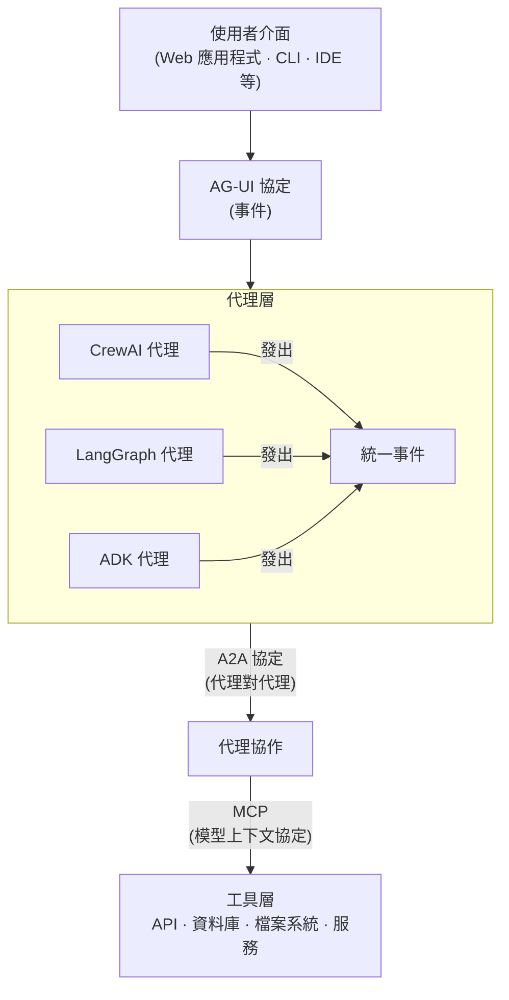

# 教學 27：第三方框架工具整合 (Tutorial 27: Third-Party Framework Tools Integration)

**目標**：將 LangChain 和 CrewAI 框架中的工具整合到 ADK 代理中

**先決條件**：

- 教學 01 (Hello World Agent)
- 教學 02 (Function Tools)
- 基本的 Python 套件管理

**您將學到**：

- ✅ 如何為 LangChain 工具使用 `LangchainTool` 包裝器
- ✅ 如何透過自訂函式包裝器整合 CrewAI 工具
- ✅ 正確的匯入路徑 (`google.adk.tools.langchain_tool`)
- ✅ 多框架代理開發 (LangChain + CrewAI)
- ✅ 工具選擇與編排
- ✅ 基本功能無需 API 金鑰

**來源**：[ADK 第三方工具文件](https://google.github.io/adk-docs/tools/third-party-tools/)

**狀態**：✅ **可運作的實作 (WORKING IMPLEMENTATION)** - 展示的所有工具均無需 API 金鑰

---

## 為什麼要整合第三方工具？ (Why Integrate Third-Party Tools?)

**問題**：從頭開始建構每個工具既耗時又限制功能。

**解決方案**：利用成熟 AI 框架中現有的工具生態系統，同時保持 ADK 的代理編排能力。

**您將獲得**：

- **LangChain**：透過 `LangchainTool` 包裝器使用 100 多種工具（搜尋、API、資料庫等）
- **CrewAI**：透過自訂函式包裝器使用 20 多種工具（網頁爬取、檔案操作等）
- **多框架代理**：在單一代理中結合來自不同框架的工具
- **無需 API 金鑰**：從可立即使用的公共 API 和工具開始
- **可擴充性**：根據需要新增基於 API 金鑰的工具以增強功能

**整合方法**：

| 方法 | 層級 | 使用案例 | 實作 |
| :--- | :--- | :--- | :--- |
| **LangchainTool** | 個別工具 | "我需要在我的 ADK 代理中使用維基百科搜尋" | ✅ 已運作 |
| **CrewAI Functions**| 個別工具 | "我需要在我的 ADK 代理中使用檔案系統工具" | ✅ 已運作 |
| **AG-UI Protocol** | 框架層級 | "我希望 LangGraph 代理能與 ADK 代理對話" | 📝 未來計畫 |

---

## 運作實作概覽 (Working Implementation Overview)

本教學包含一個 **完整的、可運作的實作**，展示：

- 來自 2 個框架 (LangChain + CrewAI) 的 **4 個整合工具**
- **無需 API 金鑰** - 設定後立即運作
- **綜合測試** - 25 個測試涵蓋所有功能
- **生產就緒程式碼** - 適當的錯誤處理和文件

**展示的工具**：
1. **Wikipedia Search** (LangChain) - 百科全書知識
2. **Web Search** (LangChain) - 透過 DuckDuckGo 獲取當前資訊
3. **Directory Reading** (CrewAI) - 檔案系統探索
4. **File Reading** (CrewAI) - 內容分析

**快速開始**：
```bash
cd tutorial_implementation/tutorial27
make setup
export GOOGLE_API_KEY=your_key_here
make dev
# 從下拉式選單中選擇 'third_party_agent'
```

**範例查詢**：
- "什麼是量子計算？" (Wikipedia)
- "今年最新的 AI 發展" (Web search)
- "顯示專案結構給我看" (Directory read)
- "讀取 README 檔案" (File read)

---

## 1. 運作實作：多框架代理 (Working Implementation: Multi-Framework Agent)

本教學包含一個 **完整的、可運作的實作**，展示整合 **來自 2 個框架的 4 個工具**：

- **LangChain 工具**：Wikipedia 搜尋、DuckDuckGo 網頁搜尋
- **CrewAI 工具**：目錄讀取、檔案讀取
- **無需 API 金鑰** - 所有工具立即運作
- **25 個綜合測試** - 完整的測試覆蓋率
- **生產就緒程式碼** - 適當的錯誤處理和文件

### 快速開始 (Quick Start)

```bash
cd tutorial_implementation/tutorial27
make setup
export GOOGLE_API_KEY=your_key_here
make dev
# 從下拉式選單中選擇 'third_party_agent'
```

### 代理架構 (Agent Architecture)

```python
from google.adk.agents import Agent
from google.adk.tools.langchain_tool import LangchainTool
from langchain_community.tools import WikipediaQueryRun, DuckDuckGoSearchRun
from langchain_community.utilities import WikipediaAPIWrapper

# 自訂 CrewAI 工具包裝器 (不需要 CrewaiTool 包裝器)
def create_directory_read_tool():
    tool = DirectoryReadTool()
    def directory_read(directory_path: str) -> dict:
        try:
            result = tool.run(directory_path=directory_path)
            return {
                'status': 'success',
                'report': f'成功讀取目錄：{directory_path}',
                'data': result
            }
        except Exception as e:
            return {
                'status': 'error',
                'error': str(e),
                'report': f'讀取目錄失敗：{directory_path}'
            }
    return directory_read

# 建立工具
wiki_tool = LangchainTool(
    tool=WikipediaQueryRun(
        api_wrapper=WikipediaAPIWrapper(
            top_k_results=3,
            doc_content_chars_max=4000
        )
    )
)

web_search_tool = LangchainTool(tool=DuckDuckGoSearchRun())

# 建立包含來自 2 個框架的 4 個工具的代理
root_agent = Agent(
    name="third_party_agent",
    model="gemini-2.0-flash",
    description="具有 LangChain 和 CrewAI 工具的多框架代理",
    tools=[
        wiki_tool,
        web_search_tool,
        create_directory_read_tool(),
        create_file_read_tool()
    ],
    output_key="research_response"
)
```

### 範例查詢 (Example Queries)

- **Wikipedia 研究**："什麼是量子計算？"
- **網頁搜尋**："今年最新的 AI 發展"
- **目錄探索**："顯示專案結構給我看"
- **檔案分析**："讀取 README 檔案"

**LangChain** 擁有 **100 多種預建工具**，可用於搜尋、API、資料庫等。

**來源**：`google/adk/tools/langchain_tool.py`

### 安裝 (Installation)

```bash
pip install google-adk[langchain]
# 或手動安裝：
pip install langchain langchain-community
```

### 使用 LangchainTool 包裝器 (Using LangchainTool Wrapper)

**模式**：

```python
from google.adk.tools.langchain_tool import LangchainTool  # ✅ 正確路徑
from langchain_community.tools import [YourLangChainTool]

# 包裝 LangChain 工具
adk_tool = LangchainTool(tool=your_langchain_tool_instance)

# 在 ADK 代理中使用
agent = Agent(tools=[adk_tool])
```

### 範例 1：Tavily 搜尋 (網頁搜尋) (Example 1: Tavily Search (Web Search))

**Tavily** 是一個針對 LLM 最佳化的強大搜尋 API。

```python
"""
將 LangChain 的 Tavily 搜尋整合到 ADK 代理中。
"""
import asyncio
import os
from google.adk.agents import Agent
from google.adk.runners import InMemoryRunner
from google.adk.tools.langchain_tool import LangchainTool
from langchain_community.tools.tavily_search import TavilySearchResults
from google.genai import types

# 環境設定
os.environ['GOOGLE_GENAI_USE_VERTEXAI'] = '1'
os.environ['GOOGLE_CLOUD_PROJECT'] = 'your-project'
os.environ['GOOGLE_CLOUD_LOCATION'] = 'us-central1'
os.environ['TAVILY_API_KEY'] = 'your-tavily-key'  # 從 tavily.com 取得


async def main():
    """使用 LangChain Tavily 搜尋的代理。"""

    # 建立 LangChain 工具
    tavily_tool = TavilySearchResults(
        max_results=5,
        search_depth="advanced",
        include_answer=True,
        include_raw_content=False
    )

    # 使用 LangchainTool 包裝
    tavily_adk = LangchainTool(tool=tavily_tool)

    # 建立 ADK 代理
    agent = Agent(
        model='gemini-2.5-flash',
        name='research_agent',
        description='具備 Tavily 網頁搜尋能力的代理',
        instruction="""
        你是一個可以存取即時網頁搜尋的研究助理。
        回答問題時，務必搜尋最新資訊。
        引用你的來源。
        """.strip(),
        tools=[tavily_adk]
        )

        # 建立執行器與會話
        runner = InMemoryRunner(agent=agent, app_name='tavily_search_app')
        session = await runner.session_service.create_sessio(
            app_name='tavily_search_app',
            user_id='research_user'
        )

        # 執行查詢
        query = "量子計算的最新發展是什麼？ (2025)"
        new_message = types.Content(
            role='user',
            parts=[types.Part(text=query)]
        )

        async for event in runner.run_async(
            user_id='research_user',
            session_id=session.id,
            new_message=new_message
        ):
        if event.content and event.content.parts:
            print(event.content.parts[0].text)


    if __name__ == '__main__':
        asyncio.run(main())
```

**輸出範例**：
```
根據最近的網頁搜尋結果：

**量子計算最新發展 (2025)**：

1. **IBM Quantum System Three** (2025 年 1 月)
    - 1,000+ 量子位元處理器
    - 錯誤校正突破：99.9% 閘極保真度
    - 來源：https://www.ibm.com/quantum

2. **Google 的 Willow 晶片** (2024 年 12 月)
    - 量子錯誤校正里程碑
    - 隨著量子位元擴展，指數級減少錯誤
    - 來源：https://blog.google/technology/research/google-willow-quantum-chip/

3. **Amazon Braket 可用性** (2025 年第一季)
    - 量子計算現已在 10 個 AWS 區域提供
    - 與 SageMaker 整合，用於混合古典-量子機器學習
    - 來源：https://aws.amazon.com/braket/

[其他發展...]

來源：
- IBM Quantum Blog
- Google Research Blog
- Nature Quantum Information
- ArXiv 預印本
```

### 範例 2：維基百科工具 (Example 2: Wikipedia Tool)

```python
from google.adk.tools.langchain_tool import LangchainTool
from langchain_community.tools import WikipediaQueryRun
from langchain_community.utilities import WikipediaAPIWrapper

# 建立 Wikipedia 工具
wikipedia = WikipediaQueryRun(
    api_wrapper=WikipediaAPIWrapper(
    top_k_results=3,
    doc_content_chars_max=4000
    )
)

# 為 ADK 包裝
wiki_tool = LangchainTool(tool=wikipedia)

# 在代理中使用
agent = Agent(
    model='gemini-2.5-flash',
    instruction='你可以存取維基百科以獲取事實資訊。',
    tools=[wiki_tool]
)
```

### 範例 3：Python REPL 工具 (Example 3: Python REPL Tool)

```python
from google.adk.tools.langchain_tool import LangchainTool
from langchain_experimental.tools import PythonREPLTool

# 建立 Python 執行工具
python_repl = PythonREPLTool()

# 為 ADK 包裝
repl_tool = LangchainTool(tool=python_repl)

# 在代理中使用
code_agent = Agent(
    model='gemini-2.5-pro',  # 使用 pro 版本進行程式碼生成
    instruction="""
    你可以執行 Python 程式碼來解決問題。
    在執行程式碼前，務必先解釋你的程式碼。
    優雅地處理錯誤。
    """.strip(),
    tools=[repl_tool]
)


# 範例查詢
# "使用 Python 計算前 10 個費波那契數"
```

### 可用的 LangChain 工具 (100+) (Available LangChain Tools (100+))

**搜尋與研究**：

- `TavilySearchResults` - 針對 AI 最佳化的網頁搜尋
- `DuckDuckGoSearchResults` - 專注隱私的搜尋
- `GoogleSearchResults` - Google 搜尋 API
- `WikipediaQueryRun` - 維基百科文章
- `ArxivQueryRun` - 研究論文

**API 與服務**：

- `OpenWeatherMapQueryRun` - 天氣資料
- `WolframAlphaQueryRun` - 計算知識
- `YouTubeSearchTool` - YouTube 影片搜尋
- `GmailToolkit` - 電子郵件操作
- `SlackToolkit` - Slack 整合

**資料庫**：

- `SQLDatabaseToolkit` - SQL 查詢執行
- `JSONToolkit` - JSON 資料操作
- `CSVLoader` - CSV 檔案處理

**程式碼與開發**：

- `PythonREPLTool` - 執行 Python 程式碼
- `TerminalTool` - 執行 Shell 指令
- `FileManagementToolkit` - 檔案操作

**查看完整清單**：https://python.langchain.com/docs/integrations/tools/

---

## 2. CrewAI 工具整合 (CrewAI Tools Integration)

**CrewAI** 提供 **20 多種專門工具** 供代理操作。

**來源**：`google/adk/tools/crewai_tool.py`

### 安裝 (Installation)

```bash
pip install google-adk[crewai]
# 或手動安裝：
pip install crewai crewai-tools
```

### 使用 CrewaiTool 包裝器 (Using CrewaiTool Wrapper)

**⚠️ 重要**：CrewAI 工具 **必須** 提供 `name` 和 `description` 參數！

**模式**：

```python
from google.adk.tools.crewai_tool import CrewaiTool  # ✅ 正確路徑
from crewai_tools import [YourCrewAITool]

# 包裝 CrewAI 工具 - 必須提供名稱和描述
adk_tool = CrewaiTool(
    tool=your_crewai_tool_instance,
    name='tool_name',          # 必要！
    description='What the tool does'  # 必要！
)

# 在 ADK 代理中使用
agent = Agent(tools=[adk_tool])
```

### 範例 1：Serper 搜尋 (Google 搜尋) (Example 1: Serper Search (Google Search))

```python
"""
將 CrewAI 的 Serper 搜尋整合到 ADK 代理中。
"""
import asyncio
import os
from google.adk.agents import Agent
from google.adk.runners import InMemoryRunner
from google.adk.tools.crewai_tool import CrewaiTool
from crewai_tools import SerperDevTool
from google.genai import types

# 環境設定
os.environ['GOOGLE_GENAI_USE_VERTEXAI'] = '1'
os.environ['GOOGLE_CLOUD_PROJECT'] = 'your-project'
os.environ['GOOGLE_CLOUD_LOCATION'] = 'us-central1'
os.environ['SERPER_API_KEY'] = 'your-serper-key'  # 從 serper.dev 取得


async def main():
    """使用 CrewAI Serper 搜尋的代理。"""

    # 建立 CrewAI 工具
    serper_tool = SerperDevTool()

    # 使用 CrewaiTool 包裝 - 名稱和描述為必要！
    serper_adk = CrewaiTool(
        tool=serper_tool,
        name='serper_search',
        description='搜尋 Google 以獲取任何主題的當前資訊'
    )

    # 建立 ADK 代理
    agent = Agent(
        model='gemini-2.5-flash',
        name='search_agent',
        description='透過 Serper 進行 Google 搜尋的代理',
        instruction="""
你有權限使用 Google 搜尋。
回答時，請搜尋最新資訊。
務必引用來源 URL。
        """.strip(),
        tools=[serper_adk]
    )

    # 建立執行器與會話
    runner = InMemoryRunner(agent=agent, app_name='serper_search_app')
    session = await runner.session_service.create_session(
        app_name='serper_search_app',
        user_id='search_user'
    )

    # 執行查詢
    query = "比特幣目前的價格是多少？"
    new_message = types.Content(
        role='user',
        parts=[types.Part(text=query)]
    )

    async for event in runner.run_async(
        user_id='search_user',
        session_id=session.id,
        new_message=new_message
    ):
        if event.content and event.content.parts:
            print(event.content.parts[0].text)


if __name__ == '__main__':
    asyncio.run(main())
```

### 範例 2：網站爬取 (Example 2: Website Scraping)

```python
from google.adk.tools.crewai_tool import CrewaiTool
from crewai_tools import ScrapeWebsiteTool

# 建立爬取工具
scraper = ScrapeWebsiteTool()

# 為 ADK 包裝，附帶名稱和描述
scraper_adk = CrewaiTool(
    tool=scraper,
    name='scrape_website',
    description='從任何網站 URL 提取內容'
)

# 在代理中使用
agent = Agent(
    model='gemini-2.5-flash',
    instruction='你可以爬取網站以提取資訊。',
    tools=[scraper_adk]
)

# 範例查詢
# "爬取 https://example.com/pricing 並摘要方案"
```

### 範例 3：檔案操作 (Example 3: File Operations)

```python
from google.adk.tools.crewai_tool import CrewaiTool  # ✅ 正確路徑
from crewai_tools import FileReadTool, DirectorySearchTool

# 檔案讀取工具
file_read = FileReadTool()
file_read_adk = CrewaiTool(
    tool=file_read,
    name='read_file',
    description='讀取文字檔案的內容'
)

# 目錄搜尋工具
dir_search = DirectorySearchTool(directory='./data')
dir_search_adk = CrewaiTool(
    tool=dir_search,
    name='search_directory',
    description='在 data 目錄中搜尋檔案'
)

# 在代理中使用
agent = Agent(
    model='gemini-2.5-flash',
    instruction='你可以讀取檔案和搜尋目錄。',
    tools=[file_read_adk, dir_search_adk]
)
```

### 可用的 CrewAI 工具 (20+) (Available CrewAI Tools (20+))

**搜尋與網路**：

- `SerperDevTool` - Google 搜尋
- `ScrapeWebsiteTool` - 網站爬取
- `WebsiteSearchTool` - 網站內搜尋
- `SeleniumScrapingTool` - 支援 JavaScript 的爬取

**檔案操作**：

- `FileReadTool` - 讀取檔案內容
- `FileWriteTool` - 寫入檔案
- `DirectoryReadTool` - 列出目錄內容
- `DirectorySearchTool` - 在目錄中搜尋檔案

**資料與 API**：

- `JSONSearchTool` - 搜尋 JSON 資料
- `XMLSearchTool` - 解析 XML
- `CSVSearchTool` - 查詢 CSV 檔案
- `PDFSearchTool` - 從 PDF 擷取

**開發**：

- `CodeDocsSearchTool` - 搜尋程式碼文件
- `GithubSearchTool` - 搜尋 GitHub 儲存庫
- `CodeInterpreterTool` - 執行程式碼

**查看完整清單**：https://docs.crewai.com/tools/

---

## 3. AG-UI 協定整合 (AG-UI Protocol Integration)

**AG-UI 協定** 實現了 ADK 與其他 AI 框架之間的 **框架層級整合**。

**來源**：`research/ag-ui/` 目錄

### 什麼是 AG-UI？ (What is AG-UI?)

**AG-UI (Agent-UI Protocol)** 是一個用於代理與人類互動的 **開放、基於事件的標準**。

**架構**：



### AG-UI 事件類型 (AG-UI Event Types)

**16 種核心事件類型** 標準化了代理與 UI 的通訊：

**執行管理**：

- `RUN_STARTED` - 代理執行開始
- `RUN_FINISHED` - 代理執行完成
- `RUN_FAILED` - 代理執行錯誤

**訊息**：

- `TEXT_MESSAGE_CONTENT` - 來自代理的文字輸出
- `IMAGE_CONTENT` - 影像生成/處理
- `FILE_CONTENT` - 檔案操作

**工具執行**：

- `TOOL_CALL_START` - 工具調用開始
- `TOOL_CALL_RESULT` - 工具回傳結果
- `TOOL_CALL_FAILED` - 工具執行錯誤

**思考**：

- `THINKING_START` - 代理推理開始
- `THINKING_CONTENT` - 推理步驟
- `THINKING_END` - 推理完成

**Artifacts**：

- `ARTIFACT_CREATED` - 生成新 Artifact
- `ARTIFACT_UPDATED` - Artifact 修改
- `ARTIFACT_DELETED` - Artifact 移除

**使用者輸入**：

- `USER_INPUT_REQUESTED` - 代理請求輸入

### 支援的框架 (Supported Frameworks)

**AG-UI 相容框架**：

- ✅ **Google ADK** (原生支援)
- ✅ **LangGraph** (透過轉接器)
- ✅ **CrewAI** (透過轉接器)
- ✅ **LangChain** (透過轉接器)
- ✅ **Mastra** (原生支援)
- ✅ **Pydantic AI** (透過轉接器)
- ✅ **LlamaIndex** (透過轉接器)
- ✅ **AG2** (前身為 AutoGen，透過轉接器)

### 範例：透過 AG-UI 整合 LangGraph + ADK (Example: LangGraph + ADK via AG-UI)

```python
"""
使用 AG-UI 協定的多框架代理。
ADK 代理可以與 LangGraph 代理無縫通訊。
"""
import asyncio
from google.adk.agents import Agent as ADKAgent
from google.adk.runners import InMemoryRunner
from google.adk.tools import FunctionTool
from google.genai import types

# LangGraph 設定 (概念性 - 實際 API 可能有所不同)
from langgraph import StateGraph, Agent as LangGraphAgent

# 定義 ADK 代理
def adk_process_data(data: str) -> str:
    """使用 ADK 代理邏輯處理資料。"""
    return f"ADK processed: {data.upper()}"

adk_agent = ADKAgent(
    model='gemini-2.5-flash',
    name='adk_processor',
    tools=[FunctionTool(adk_process_data)]
)

# 定義 LangGraph 代理
langgraph_agent = LangGraphAgent(
    model='gpt-4o',
    name='langgraph_analyzer'
)

# AG-UI 協定啟用通訊
async def multi_framework_workflow():
    """
    AG-UI 協定允許 ADK 和 LangGraph 代理協作。
    兩者都發出任何 UI 都可以使用的標準化事件。
    """

    # 使用者查詢首先進入 LangGraph 代理
    lg_result = await langgraph_agent.run("Analyze this: Hello World")

    # LangGraph 結果進入 ADK 代理
    # AG-UI 協定自動處理事件轉換
    runner = InMemoryRunner(agent=adk_agent, app_name='multi_framework_app')
    session = await runner.session_service.create_session(
        app_name='multi_framework_app',
        user_id='workflow_user'
    )

    query = f"Process the analysis: {lg_result}"
    new_message = types.Content(
        role='user',
        parts=[types.Part(text=query)]
    )

    responses = []
    async for event in runner.run_async(
        user_id='workflow_user',
        session_id=session.id,
        new_message=new_message
    ):
        if event.content and event.content.parts:
            responses.append(event.content.parts[0].text)

    return responses[-1] if responses else None

# 所有事件 (來自兩個代理) 都符合 AG-UI 標準
# 任何相容 AG-UI 的 UI 都可以視覺化此工作流程
```

### AG-UI 協定的優點 (Benefits of AG-UI Protocol)

**對開發者**：

- ✅ 使用任何框架中的最佳工具
- ✅ 切換框架無需更改 UI
- ✅ 混合 ADK 代理與 LangGraph/CrewAI 代理
- ✅ 標準化的事件處理

**對使用者**：

- ✅ 跨框架的一致 UI 體驗
- ✅ 更好的可觀測性 (標準化事件)
- ✅ 與框架無關的前端

**對組織**：

- ✅ 避免框架鎖定
- ✅ 重用 UI 投資
- ✅ 更容易的代理遷移

---

## 4. 選擇整合方法 (Choosing Integration Approach)

### 決策矩陣 (Decision Matrix)

| 情境 | 使用 LangchainTool | 使用 CrewaiTool | 使用 AG-UI Protocol |
| :--- | :--- | :--- | :--- |
| 需要一個特定工具 (例如 Tavily 搜尋) | ✅ 是 | ❌ 否 | ❌ 大材小用 |
| 已經在使用 LangChain 生態系統 | ✅ 是 | ❌ 否 | 🤔 可能 |
| 需要 CrewAI 的專門工具 | ❌ 否 | ✅ 是 | ❌ 大材小用 |
| 建構多框架系統 | ❌ 否 | ❌ 否 | ✅ 是 |
| 想要與框架無關的 UI | ❌ 否 | ❌ 否 | ✅ 是 |
| 需要代理對代理通訊 | 🤔 可能 | 🤔 可能 | ✅ 理想 |
| 快速原型設計 | ✅ 快 | ✅ 快 | ❌ 複雜 |
| 企業生產環境 | 🤔 可能 | 🤔 可能 | ✅ 是 |

### 最佳實務 (Best Practices)

**✅ 建議 (DO)**：

1. **從簡單開始**：對個別工具使用 LangchainTool/CrewaiTool
2. **僅新增需要的依賴**：不要為了一個工具安裝整個框架
3. **徹底測試**：第三方工具可能有不同的錯誤處理
4. **記錄 API 金鑰**：註記哪些工具需要什麼憑證
5. **處理工具失敗**：在 try-except 中包裝呼叫
6. **使用 AG-UI**：用於複雜的多框架系統

**❌ 避免 (DON'T)**：

1. 不必要地混合工具層級和協定層級的整合
2. 忘記為 CrewaiTool 提供 `name` 和 `description`
3. 假設工具行為與 ADK 模式相符
4. 忽略依賴衝突
5. 為簡單任務使用重量級工具
6. 為單一框架專案過度設計 AG-UI

---

## 5. 真實範例：具備多種工具的研究代理 (Real-World Example: Research Agent with Multiple Tools)

**情境**：使用來自多個來源的工具建構一個綜合研究代理。

```python
"""
進階研究代理結合：
- LangChain 的 Tavily 搜尋 (網頁搜尋)
- LangChain 的 Wikipedia (百科全書知識)
- LangChain 的 Arxiv (研究論文)
- CrewAI 的 Serper (Google 搜尋備份)
- CrewAI 的 ScrapeWebsite (詳細頁面分析)
- 原生 ADK 工具 (檔案操作)
"""
import asyncio
import os
from google.adk.agents import Agent
from google.adk.runners import InMemoryRunner
from google.adk.tools import FunctionTool
from google.adk.tools.langchain_tool import LangchainTool
from google.adk.tools.crewai_tool import CrewaiTool
from google.genai import types

# LangChain tools
from langchain_community.tools.tavily_search import TavilySearchResults
from langchain_community.tools import WikipediaQueryRun, ArxivQueryRun
from langchain_community.utilities import WikipediaAPIWrapper

# CrewAI tools
from crewai_tools import SerperDevTool, ScrapeWebsiteTool

# 環境設定
os.environ['GOOGLE_GENAI_USE_VERTEXAI'] = '1'
os.environ['GOOGLE_CLOUD_PROJECT'] = 'your-project'
os.environ['GOOGLE_CLOUD_LOCATION'] = 'us-central1'
os.environ['TAVILY_API_KEY'] = 'your-tavily-key'
os.environ['SERPER_API_KEY'] = 'your-serper-key'


# 原生 ADK 工具
def save_research_report(title: str, content: str) -> str:
    """將研究結果儲存到檔案。"""
    filename = f"research_{title.replace(' ', '_')}.md"
    with open(filename, 'w') as f:
        f.write(f"# {title}\n\n{content}")
    return f"報告已儲存至 {filename}"


async def main():
    """綜合研究代理。"""

    # LangChain tools
    tavily = LangchainTool(
        tool=TavilySearchResults(max_results=5, search_depth="advanced")
    )

    wikipedia = LangchainTool(
        tool=WikipediaQueryRun(
            api_wrapper=WikipediaAPIWrapper(
                top_k_results=2,
                doc_content_chars_max=3000
            )
        )
    )

    arxiv = LangchainTool(
        tool=ArxivQueryRun(
            top_k_results=3
        )
    )

    # CrewAI tools (name and description REQUIRED!)
    serper = CrewaiTool(
        tool=SerperDevTool(),
        name='google_search',
        description='搜尋 Google 以獲取當前資訊 (Tavily 的備份)'
    )

    scraper = CrewaiTool(
        tool=ScrapeWebsiteTool(),
        name='scrape_website',
        description='從特定 URL 提取詳細內容'
    )

    # Native ADK tool
    save_report = FunctionTool(save_research_report)

    # Create research agent with all tools
    research_agent = Agent(
        model='gemini-2.5-pro',  # 使用 Pro 進行複雜的研究任務
        name='research_specialist',
        description='具有多種搜尋能力的進階研究代理',
        instruction="""
        你是一位專業的研究分析師，可以存取多個資訊來源：

        **搜尋工具**：
        - Tavily：主要網頁搜尋 (即時，為 AI 最佳化)
        - Google (Serper)：備用搜尋，以實現全面覆蓋
        - Wikipedia：百科全書知識和背景
        - Arxiv：科學論文和研究

        **分析工具**：
        - Website Scraper：深入分析特定頁面
        - Report Generator：將研究結果儲存到檔案

        **研究流程**：
        1. 從 Tavily 開始獲取當前資訊
        2. 使用 Wikipedia 獲取背景/上下文
        3. 檢查 Arxiv 以獲取學術研究
        4. 如果需要更多搜尋覆蓋範圍，請使用 Serper
        5. 爬取關鍵網站以進行詳細分析
        6. 將研究結果綜合成長篇報告
        7. 將報告儲存到檔案

        **品質標準**：
        - 引用所有來源的 URL
        - 交叉引用多個來源
        - 注意發布日期 (時效性很重要！)
        - 區分事實與觀點
        - 承認資訊差距
        - 提供平衡的觀點
        """.strip(),
        tools=[tavily, wikipedia, arxiv, serper, scraper, save_report]
    )

    # 執行綜合研究查詢
    runner = InMemoryRunner(agent=research_agent, app_name='research_app')

    # 建立會話
    session = await runner.session_service.create_session(
        app_name='research_app',
        user_id='researcher_001'
    )

    query = """
    研究自動駕駛汽車技術的現狀：
    1. 最新的行業發展 (2025)
    2. 剩餘的關鍵技術挑戰
    3. 監管環境
    4. 學術研究突破
    5. 主要參與者及其方法

    提供一份綜合報告並將其儲存到檔案。
    """.strip()

    print("\n" + "="*60)
    print("進階研究代理")
    print("="*60 + "\n")
    print(f"查詢: {query}\n")
    print("研究中... (可能需要 30-60 秒)\n")

    # 使用正確的 API 執行
    new_message = types.Content(
        role='user',
        parts=[types.Part(text=query)]
    )

    async for event in runner.run_async(
        user_id='researcher_001',
        session_id=session.id,
        new_message=new_message
    ):
        if event.content and event.content.parts:
            print(event.content.parts[0].text)

    print("\n" + "="*60 + "\n")


if __name__ == '__main__':
    asyncio.run(main())
```

**預期輸出流程 (Expected Output Flow)**：

```
進階研究代理
============================================================

查詢: 研究自動駕駛汽車技術的現狀...

研究中... (可能需要 30-60 秒)

[工具: tavily_search]
搜尋 "autonomous vehicle technology 2025 latest developments"...

[工具: wikipedia_search]
查詢 "Autonomous vehicle"...

[工具: arxiv_search]
搜尋關於 "autonomous driving neural networks" 的論文...

[工具: google_search]
額外搜尋: "self-driving cars regulations 2025"...

[工具: scrape_website]
從 https://www.tesla.com/AI 提取詳細資訊...

[工具: save_research_report]
將報告儲存到 research_autonomous_vehicles.md...

# 綜合報告：自動駕駛汽車技術 (2025)

## 執行摘要
[綜合所有來源的研究結果]

## 1. 最新行業發展
- **Waymo** (Alphabet): 在舊金山、鳳凰城、洛杉磯營運無人計程車服務
  來源: https://waymo.com [Tavily, 2025 年 1 月]
- **Tesla FSD v13**: 神經網路改進，純視覺方案
  來源: https://www.tesla.com/AI [爬取, 2025 年 1 月]
[...]

## 2. 技術挑戰
根據最近的研究論文 (Arxiv)：
- 邊緣案例處理：99.9% → 99.99% 的安全差距
- 惡劣天氣下的感測器融合
- 不確定性下的即時決策
[引用: 3 篇 Arxiv 論文]

## 3. 監管環境
[Wikipedia 背景 + Serper 當前新聞]

## 4. 學術研究突破
- MIT：從人類示範中進行端到端學習 (Arxiv:2024.12345)
- Stanford：多代理協調協議 (Arxiv:2024.67890)
[...]

## 5. 主要參與者
[比較分析]

## 結論
[綜合與未來展望]

============================================================

報告已儲存至: research_autonomous_vehicles.md
```

---

## 6. 疑難排解 (Troubleshooting)

### LangChain 整合問題 (LangChain Integration Issues)

**錯誤："ModuleNotFoundError: No module named 'langchain_community'"**

```bash
pip install langchain-community
```

**錯誤："Tool execution failed"**

檢查環境變數：

```python
import os
print(os.environ.get('TAVILY_API_KEY'))  # 應該不是 None
```

**錯誤："Rate limit exceeded"**

大多數搜尋 API 都有速率限制。新增延遲：

```python
import time
time.sleep(1)  # 兩次搜尋之間
```

### CrewAI 整合問題 (CrewAI Integration Issues)

**錯誤："CrewaiTool missing required arguments"**

**修復**：始終提供 `name` 和 `description`：

```python
# ❌ 錯誤
tool = CrewaiTool(tool=serper_tool)

# ✅ 正確
tool = CrewaiTool(
    tool=serper_tool,
    name='serper_search',
    description='Search Google for information'
)
```

**錯誤："Tool not found in CrewAI"**

確保套件正確：

```bash
pip install crewai-tools  # 不只是 'crewai'
```

### 依賴衝突 (Dependency Conflicts)

**問題**：LangChain 和 CrewAI 可能有衝突的依賴。

**解決方案**：使用虛擬環境：

```bash
# 建立隔離環境
python -m venv adk_env
source adk_env/bin/activate  # 或在 Windows 上 `adk_env\Scripts\activate`

# 僅安裝您需要的
pip install google-adk
pip install langchain-community  # 僅在使用 LangChain 工具時
pip install crewai-tools        # 僅在使用 CrewAI 工具時
```

---

## 摘要 (Summary)

您已學會如何將 LangChain、CrewAI 和其他框架的工具整合到 ADK 代理中：

**重點摘要**：

- ✅ **LangchainTool** 包裝器提供對 100 多種 LangChain 工具的存取
- ✅ **CrewaiTool** 包裝器提供對 20 多種 CrewAI 工具的存取
- ✅ CrewAI 工具 **需要** `name` 和 `description` 參數
- ✅ **AG-UI Protocol** 啟用框架層級整合
- ✅ 對簡單案例選擇工具層級整合，對複雜系統選擇協定層級整合
- ✅ 熱門工具：Tavily (網頁搜尋), Serper (Google 搜尋), Wikipedia, Arxiv
- ✅ 可以在單一代理中結合來自多個框架的工具
- ✅ 始終優雅地處理第三方工具錯誤
- ✅ API 金鑰所需的環境變數 (TAVILY_API_KEY, SERPER_API_KEY, etc.)

**何時使用**：

| 工具 | 適用於 |
| :--- | :--- |
| **Tavily (LangChain)** | 針對 AI 最佳化的即時網頁搜尋 |
| **Serper (CrewAI)** | Google 搜尋、新聞、圖片 |
| **Wikipedia (LangChain)** | 背景知識、定義 |
| **Arxiv (LangChain)** | 學術論文、研究 |
| **ScrapeWebsite (CrewAI)** | 詳細頁面分析 |
| **PythonREPL (LangChain)** | 程式碼執行 |
| **AG-UI Protocol** | 多框架代理系統 |

**生產檢核清單**：

- [ ] 僅安裝需要的依賴 (langchain/crewai)
- [ ] 為 API 金鑰配置環境變數
- [ ] 為所有 CrewaiTool 實例提供 `name` 和 `description`
- [ ] 工具失敗的錯誤處理
- [ ] 考慮搜尋 API 的速率限制
- [ ] 使用虛擬環境以避免衝突
- [ ] 在結合之前單獨測試工具
- [ ] 審查 API 金鑰成本 (Tavily, Serper, etc.)
- [ ] 工具無法使用時的備援策略
- [ ] 為團隊記錄哪些工具需要什麼金鑰

**資源**：

- [Third-Party Tools Documentation](https://google.github.io/adk-docs/tools/third-party-tools/)
- [LangChain Tools](https://python.langchain.com/docs/integrations/tools/)
- [CrewAI Tools](https://docs.crewai.com/tools/)
- [AG-UI Protocol Specification](https://github.com/google/adk/tree/main/research/ag-ui)
- [Tavily API](https://tavily.com/)
- [Serper API](https://serper.dev/)

---

**恭喜！** 您現在可以在 ADK 代理中利用 100 多種來自 LangChain 和 CrewAI 的工具，並了解何時使用工具層級與協定層級整合。

## 程式碼實現 (Code Implementation)

- third-party-agent：[程式碼連結](../../../python/agents/third-party-agent/)
