# 教學 29：UI 整合與 AG-UI 協議簡介 (Tutorial 29: Introduction to UI Integration & AG-UI Protocol)

ℹ️ 驗證 RUNNER API 使用方式
**正確的 Runner API** (已在原始碼中驗證)：
- ✅ 正確：`from google.adk.runners import InMemoryRunner`
- ✅ 正確：`runner = InMemoryRunner(agent=agent, app_name='app')`
- ✅ 正確：建立 session，然後使用 `async for event in runner.run_async(...)`

**應避免的常見錯誤**：
- ❌ 錯誤：`from google.adk.agents import Runner` - 在 v1.16+ 中不存在
- ❌ 錯誤：`runner = Runner()` - 請使用 InMemoryRunner
- ❌ 錯誤：`await runner.run_async(query, agent=agent)` - 請使用 async iteration

**來源**：`/research/adk-python/src/google/adk/runners.py`

**預計閱讀時間**：35-45 分鐘
**難易度**：中級
**先決條件**：教學 1-3 (ADK 基礎)、教學 14 (串流與 SSE)

---

## 目錄 (Table of Contents)

1. [總覽](#overview)
2. [ADK UI 整合概況](#the-adk-ui-integration-landscape)
3. [了解 AG-UI 協議](#understanding-the-ag-ui-protocol)
4. [整合方法](#integration-approaches)
5. [快速入門：您的第一個 AG-UI 整合](#quick-start-your-first-ag-ui-integration)
6. [決策框架](#decision-framework)
7. [架構模式](#architecture-patterns)
8. [最佳實踐](#best-practices)
9. [後續步驟](#next-steps)

---

## 總覽 (Overview)

### 您將學到什麼 (What You'll Learn)

在本教學中，您將掌握將 Google ADK 代理與使用者介面整合的基礎知識。您將了解：

- **UI 整合概況** - 不同的方法及其適用時機
- **AG-UI 協議** - 官方的代理與 UI 通訊協議
- **整合模式** - React/Next.js、Streamlit、Slack 和事件驅動架構
- **決策框架** - 如何為您的使用案例選擇正確的方法
- **架構模式** - 可用於生產的部署策略

### UI 整合為何重要 (Why UI Integration Matters)

雖然 ADK 代理本身功能強大，但將其連接到使用者介面可以釋放其全部潛力：

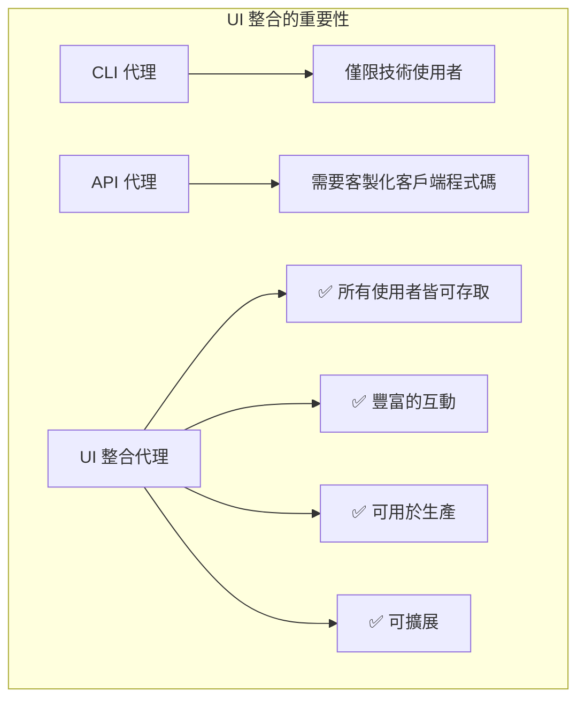

**真實世界使用案例**：

- **客戶支援聊天機器人** - 用於客戶服務的網頁聊天介面
- **資料分析儀表板** - 用於商業智慧的互動式機器學習/人工智慧工具
- **團隊協作機器人** - 用於企業工作流程的 Slack/Teams 機器人
- **文件處理系統** - 用於文件管線的事件驅動 UI

---

## ADK UI 整合概況 (The ADK UI Integration Landscape)

### 整合選項總覽 (Overview of Integration Options)

Google ADK 支援多種 UI 整合路徑，每種都針對不同的使用案例進行了最佳化：

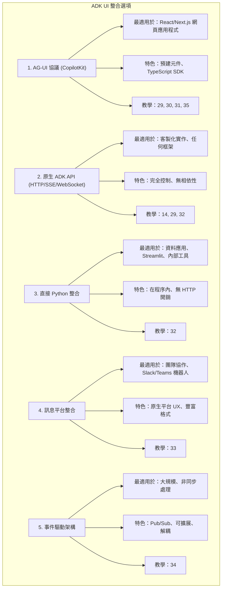

### 比較矩陣 (Comparison Matrix)

| 方法 (Approach) | 最適用於 (Best For) | 複雜度 (Complexity) | 可擴展性 (Scalability) | 上線時間 (Time to Production) |
| ------------------ | ----------------- | ---------- | ----------- | ------------------ |
| **AG-UI 協議** | 現代網頁應用 | 低 | 高 | ⚡ 快 (小時) |
| **原生 API** | 客製化框架 | 中 | 高 | 🔨 中等 (天) |
| **直接 Python** | 資料應用 | 低 | 中 | ⚡ 快 (小時) |
| **Slack/Teams** | 團隊工具 | 低 | 高 | ⚡ 快 (小時) |
| **Pub/Sub** | 事件驅動 | 高 | 非常高 | 🔨 複雜 (週) |

---

## 了解 AG-UI 協議 (Understanding the AG-UI Protocol)

### 什麼是 AG-UI？

**AG-UI (Agent-Generative UI)** 是一個用於代理與使用者互動的開放協議，由 **Google ADK 和 CopilotKit 官方合作** 開發。它為 AI 代理與網頁 UI 的通訊提供了一種標準化方式。

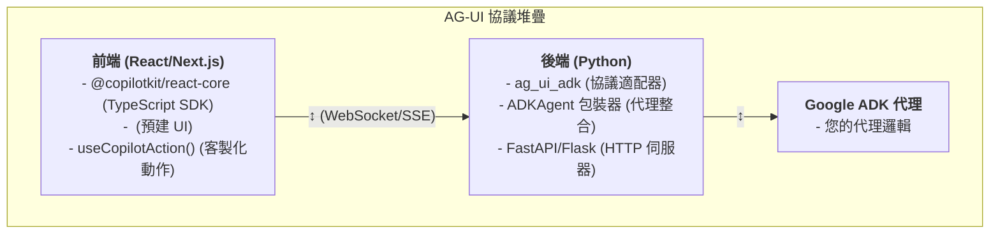

### 主要特色 (Key Features)

**1. 基於事件的通訊 (Event-Based Communication)**

AG-UI 使用事件進行代理與 UI 的通訊：

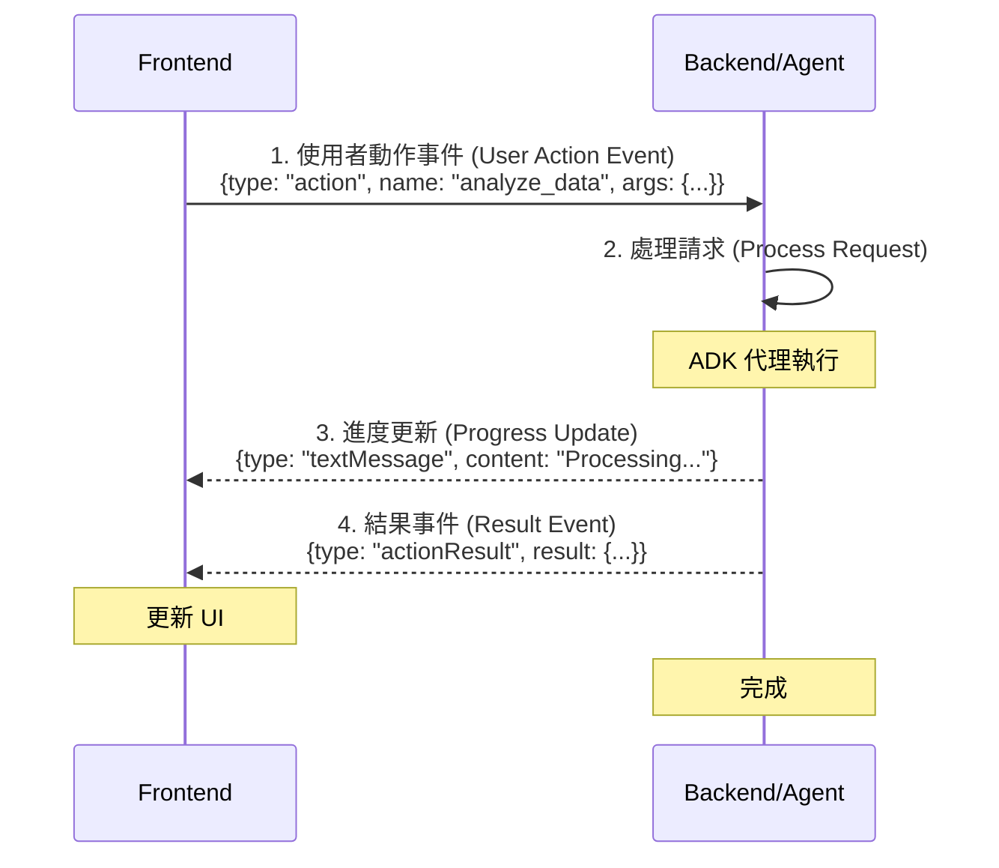

事件訊息範例：

```typescript
// 前端發送動作請求
{
  "type": "action",
  "name": "analyze_data",
  "arguments": { "dataset": "sales_2024.csv" }
}

// 代理發送進度更新
{
  "type": "textMessage",
  "content": "正在分析銷售數據..."
}

// 代理發送結果
{
  "type": "actionResult",
  "actionName": "analyze_data",
  "result": { "revenue": 1500000, "growth": 0.15 }
}
```

**2. 預建的 React 元件 (Pre-Built React Components)**

```tsx
import { CopilotChat } from "@copilotkit/react-ui";

// 零設定的嵌入式聊天 UI
<CopilotChat />;
```

**3. 生成式 UI (Generative UI)**

代理可以渲染客製化的 React 元件：

```python
# 代理回傳結構化資料
return {
    "component": "DataVisualization",
    "props": {
        "chartType": "bar",
        "data": sales_data
    }
}
```

**4. 可用於生產的中介軟體 (Production-Ready Middleware)**

```python
from ag_ui_adk import ADKAgent
from google.adk.agents import Agent

# 建立 ADK 代理並進行包裝
adk_agent = Agent(
    name="customer_support",
    model="gemini-2.0-flash-exp"
)
agent = ADKAgent(adk_agent=adk_agent, app_name="customer_support")
```

### 為何選擇 AG-UI 協議？ (Why AG-UI Protocol?)

**✅ 優點 (Advantages)**：

- **官方支援** - 與 Google ADK 團隊合作
- **預建元件** - `<CopilotChat>`, `<CopilotTextarea>`
- **TypeScript SDK** - 型別安全的 React 整合
- **廣泛範例** - 可用於生產的程式碼
- **活躍社群** - Discord、GitHub 討論
- **全面測試** - 271 項測試通過

**⚠️ 考量 (Considerations)**：

- 額外的相依性 (CopilotKit 套件)
- TypeScript 優先的生態系統 (但 JS 也能運作)
- 事件轉換的開銷 (極小，約 5 毫秒)

---

## 整合方法 (Integration Approaches)

### 方法 1：AG-UI 協議 (建議用於網頁應用) (Approach 1: AG-UI Protocol (Recommended for Web Apps))

**適用時機 (When to Use)**：

- 開發 React/Next.js 網頁應用程式
- 需要預建的 UI 元件
- 希望有 TypeScript 的型別安全
- 偏好官方且文件齊全的模式

**架構 (Architecture)**：

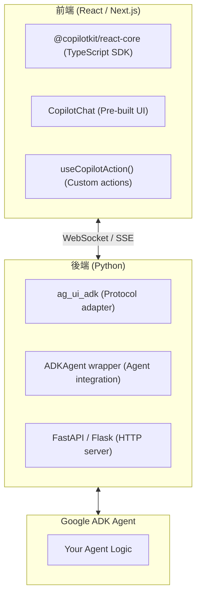

**完整的訊息流程 (Complete Message Flow)**：

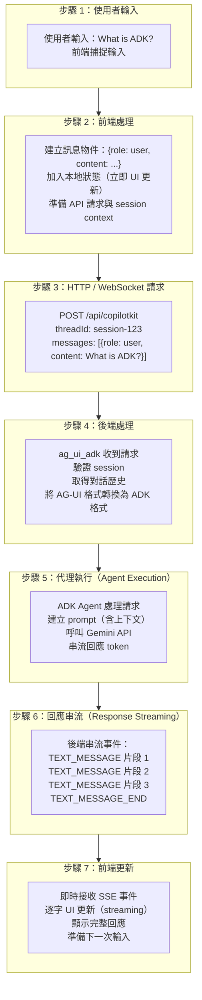

**快速範例 (Quick Example)**：

```typescript
// 前端 (Next.js)
import { CopilotKit } from "@copilotkit/react-core";
import { CopilotChat } from "@copilotkit/react-ui";

export default function Home() {
  return (
    <CopilotKit runtimeUrl="/api/copilotkit">
      <CopilotChat
        instructions="您是一位樂於助人的客戶支援代理。"
      />
    </CopilotKit>
  );
}
```

```python
# 後端 (Python)
from fastapi import FastAPI
from ag_ui_adk import ADKAgent, add_adk_fastapi_endpoint
from google.adk.agents import Agent

app = FastAPI()

adk_agent = Agent(name="support", model="gemini-2.0-flash-exp")
agent = ADKAgent(
    adk_agent=adk_agent,
    app_name="support_app",
    user_id="user",
    use_in_memory_services=True
)

add_adk_fastapi_endpoint(app, agent, path="/api/copilotkit")
```

**涵蓋於**：教學 30 (Next.js)、教學 31 (Vite)、教學 35 (進階)

---

### 方法 2：原生 ADK API (Approach 2: Native ADK API)

**適用時機 (When to Use)**：

- 開發客製化 UI 框架 (Vue, Svelte, Angular)
- 需要完全控制傳輸層
- 希望最小化相依性
- 開發行動應用 (React Native, Flutter)

**架構 (Architecture)**：

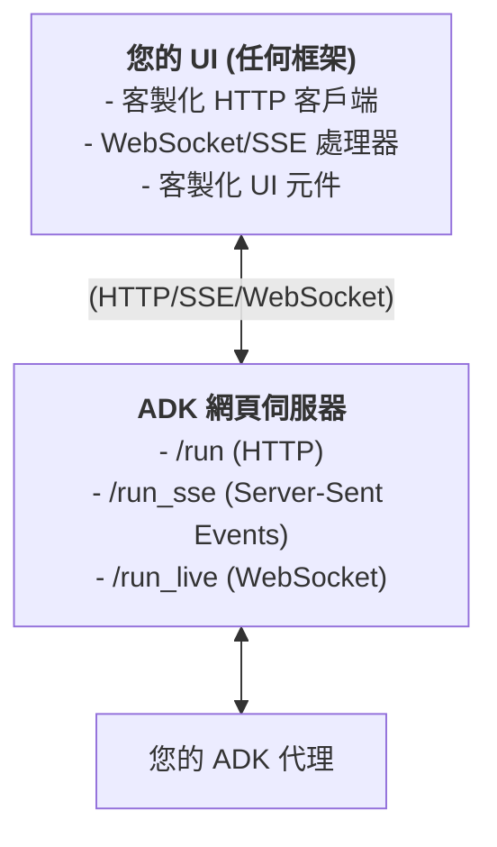

**快速範例 (Quick Example)**：

```typescript
// 前端 (任何框架)
const response = await fetch("http://localhost:8000/run", {
  method: "POST",
  headers: { "Content-Type": "application/json" },
  body: JSON.stringify({
    session_id: "user-123",
    user_content: [{ text: "什麼是 ADK？" }],
  }),
});

const result = await response.json();
console.log(result.agent_content);
```

```python
# 後端 (Python)
from google.adk.agents import Agent

# 建立 ADK 代理
agent = Agent(
    model='gemini-2.0-flash-exp',
    name='my_agent',
    instruction='您是一位提供清晰簡潔答案的樂於助人的助理。'
)

# 對於網頁伺服器部署，使用：adk web agent.py
# 或與 FastAPI/Flask 整合以用於客製化 HTTP 端點
```

**涵蓋於**：教學 14 (串流與 SSE)、教學 29 (本教學)

---

### 方法 3：直接 Python 整合 (Approach 3: Direct Python Integration)

**適用時機 (When to Use)**：

- 使用 Streamlit 開發資料應用
- 內部工具與儀表板
- 機器學習/人工智慧工作流程
- 純 Python 技術堆疊

**架構 (Architecture)**：

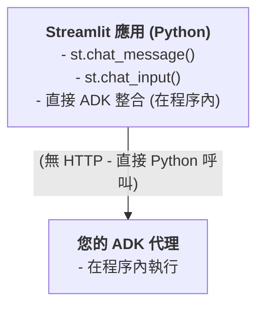

**快速範例 (Quick Example)**：

```python
import streamlit as st
import asyncio
from google.adk.agents import Agent
from google.adk.runners import InMemoryRunner
from google.genai import types

# 初始化代理
agent = Agent(
    model='gemini-2.0-flash-exp',
    name='data_analyst',
    instruction='您是一位專業的資料分析師，幫助使用者理解他們的數據。'
)

# 初始化 runner
runner = InMemoryRunner(agent=agent, app_name='streamlit_app')

async def get_response(prompt: str, session_id: str):
    """使用正確的非同步模式獲取代理回應。"""
    # 建立會話
    session = await runner.session_service.create_session(
        app_name='streamlit_app',
        user_id='user1'
    )

    # 使用非同步迭代執行查詢
    new_message = types.Content(
        role='user',
        parts=[types.Part(text=prompt)]
    )

    response_text = ""
    async for event in runner.run_async(
        user_id='user1',
        session_id=session.id,
        new_message=new_message
    ):
        if event.content and event.content.parts:
            response_text += event.content.parts[0].text

    return response_text

# Streamlit UI
if prompt := st.chat_input("詢問我關於您的數據"):
    st.chat_message("user").write(prompt)

    # 獲取回應
    response = asyncio.run(get_response(prompt, 'session1'))
    st.chat_message("assistant").write(response)
```

**涵蓋於**：教學 32 (Streamlit)

---

### 方法 4：訊息平台整合 (Approach 4: Messaging Platform Integration)

**適用時機 (When to Use)**：

- 開發團隊協作工具
- Slack/Microsoft Teams 機器人
- 企業內部工具
- 需要原生平台 UX

**架構 (Architecture)**：

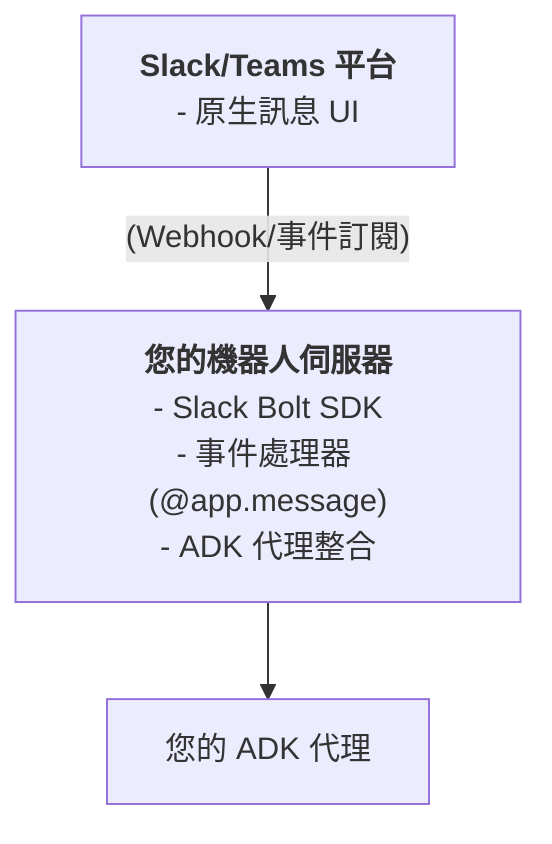

**快速範例 (Quick Example)**：

```python
from slack_bolt import App
from google.adk.agents import Agent
from google.adk.runners import InMemoryRunner
from google.genai import types
import asyncio

app = App(token="xoxb-...")

# 在啟動時初始化代理一次
agent = Agent(
    model='gemini-2.0-flash-exp',
    name='support_agent',
    instruction='您是一位樂於助人的 Slack 支援機器人，協助團隊成員解決問題。'
)

# 初始化 runner
runner = InMemoryRunner(agent=agent, app_name='slack_bot')

async def get_agent_response(user_id: str, channel_id: str, text: str):
    """使用正確的非同步模式獲取代理回應。"""
    # 建立會話
    session = await runner.session_service.create_session(
        app_name='slack_bot',
        user_id=user_id
    )

    # 使用非同步迭代執行查詢
    new_message = types.Content(
        role='user',
        parts=[types.Part(text=text)]
    )

    response_text = ""
    async for event in runner.run_async(
        user_id=user_id,
        session_id=session.id,
        new_message=new_message
    ):
        if event.content and event.content.parts:
            response_text += event.content.parts[0].text

    return response_text

@app.message("")
def handle_message(message, say):
    # 獲取代理回應
    response = asyncio.run(get_agent_response(
        message['user'],
        message['channel'],
        message['text']
    ))

    # 在 Slack 對話串中回覆
    say(response, thread_ts=message['ts'])

app.start(port=3000)
```

**涵蓋於**：教學 33 (Slack)

---

### 方法 5：事件驅動架構 (Approach 5: Event-Driven Architecture)

**適用時機 (When to Use)**：

- 大規模系統 (數百萬事件)
- 非同步處理
- 多個訂閱者 (fan-out)
- 解耦架構

**架構 (Architecture)**：

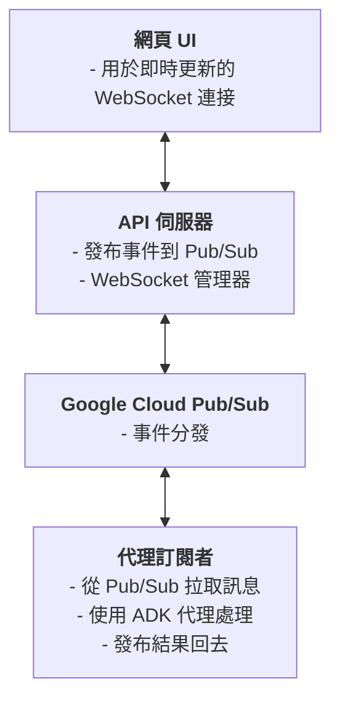

**快速範例 (Quick Example)**：

```python
from google.cloud import pubsub_v1
from google import genai

# 發布者
publisher = pubsub_v1.PublisherClient()
topic_path = publisher.topic_path('my-project', 'agent-requests')

# 發布事件
publisher.publish(topic_path, data=b'處理文件 X')

# 在啟動時初始化代理一次 (在回呼函式之外)
from google.adk.agents import Agent
from google.adk.runners import InMemoryRunner
from google.genai import types
import asyncio

agent = Agent(
    model='gemini-2.0-flash-exp',
    name='doc_processor',
    instruction='您處理文件並提取關鍵資訊。'
)

# 初始化 runner
runner = InMemoryRunner(agent=agent, app_name='pubsub_processor')

async def process_message(message_text: str, message_id: str):
    """使用正確的非同步模式處理訊息。"""
    # 建立會話
    session = await runner.session_service.create_session(
        app_name='pubsub_processor',
        user_id='system'
    )

    # 使用非同步迭代執行查詢
    new_message = types.Content(
        role='user',
        parts=[types.Part(text=message_text)]
    )

    async for event in runner.run_async(
        user_id='system',
        session_id=session.id,
        new_message=new_message
    ):
        if event.content and event.content.parts:
            # 處理事件 (例如，發布結果)
            print(event.content.parts[0].text)

# 訂閱者
subscriber = pubsub_v1.SubscriberClient()
subscription_path = subscriber.subscription_path('my-project', 'agent-sub')

def callback(message):
    # 處理訊息
    asyncio.run(process_message(message.data.decode(), message.message_id))

    # 確認
    message.ack()

subscriber.subscribe(subscription_path, callback=callback)
```

**涵蓋於**：教學 34 (Pub/Sub)

---

## 快速入門：您的第一個 AG-UI 整合 (Quick Start: Your First AG-UI Integration)

讓我們在 **10 分鐘內** 建立一個簡單的 ADK 代理與 AG-UI 整合！

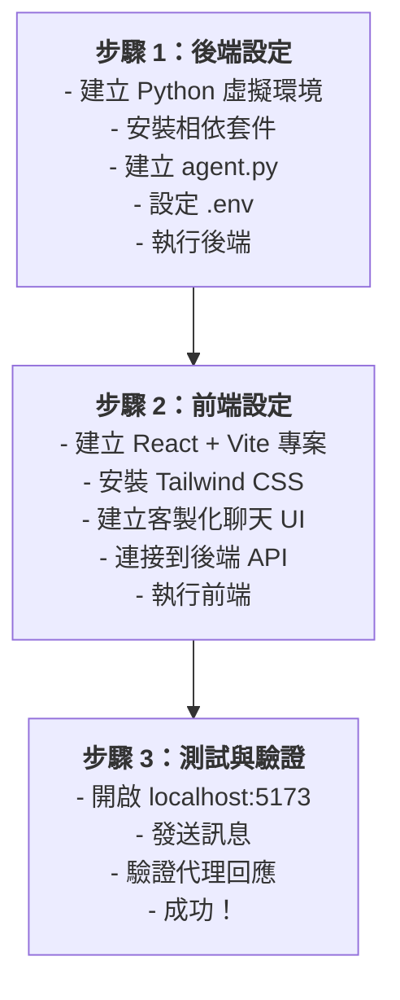

### 先決條件 (Prerequisites)

```bash
# Python 3.9+
python --version

# Node.js 18+
node --version

# Google AI API 金鑰
export GOOGLE_GENAI_API_KEY="your-api-key"
```

### 步驟 1：建立後端 (Python) (Step 1: Create Backend (Python))

```bash
# 建立專案
mkdir adk-quickstart && cd adk-quickstart
mkdir agent && cd agent

# 建立虛擬環境
python -m venv venv
source venv/bin/activate  # 在 Windows 上：venv\Scripts\activate

# 安裝相依套件
pip install google-genai fastapi uvicorn ag-ui-adk python-dotenv
```

建立 `agent/agent.py`：

```python
"""Simple ADK agent with AG-UI integration."""

import os
from dotenv import load_dotenv
from fastapi import FastAPI
from fastapi.middleware.cors import CORSMiddleware
from ag_ui_adk import ADKAgent, add_adk_fastapi_endpoint
from google.adk.agents import Agent
import uvicorn

# 載入環境變數
load_dotenv()

# 建立 ADK 代理
adk_agent = Agent(
    name="quickstart_agent",
    model="gemini-2.0-flash-exp",
    instruction="""
    您是由 Google ADK 驅動的樂於助人的人工智慧助理。

    您的角色：
    - 清晰簡潔地回答問題
    - 保持友善和專業
    - 提供準確的資訊
    - 如果您不知道某件事，請直接說明

    準則：
    - 除非要求提供更多細節，否則回應保持在 3 段以下
    - 使用 markdown 格式以提高可讀性"""
)

# 使用 ADKAgent 中介軟體進行包裝
agent = ADKAgent(
    adk_agent=adk_agent,
    app_name="quickstart_demo",
    user_id="demo_user",
    session_timeout_seconds=3600,
    use_in_memory_services=True
)

# 匯出以供測試
root_agent = adk_agent

# 初始化 FastAPI
app = FastAPI(title="ADK Quickstart API")

# 為前端啟用 CORS
app.add_middleware(
    CORSMiddleware,
    allow_origins=["http://localhost:5173"],
    allow_credentials=True,
    allow_methods=["*"],
    allow_headers=["*"],
)

# 新增 ADK 端點
add_adk_fastapi_endpoint(app, agent, path="/api/copilotkit")

# 健康檢查端點
@app.get("/health")
def health_check():
    return {"status": "healthy", "agent": "quickstart_agent"}

if __name__ == "__main__":
    uvicorn.run(app, host="0.0.0.0", port=8000, reload=True)
```

建立 `agent/.env.example`：

```bash
# Google AI API 金鑰 (必要)
# 在此取得您的免費金鑰：https://aistudio.google.com/app/apikey
GOOGLE_API_KEY=your_api_key_here

# 選用設定
PORT=8000
HOST=0.0.0.0
```

**設定並執行後端**：

```bash
# 複製環境範本
cp .env.example .env

# 編輯 .env 並加入您的 API 金鑰
# 然後執行後端
python agent.py
```

### 步驟 2：建立前端 (React + Vite) (Step 2: Create Frontend (React + Vite))

```bash
# 在新終端機中，從專案根目錄開始
cd ..
npm create vite@latest frontend -- --template react-ts
cd frontend

# 安裝相依套件 (用於造型的 Tailwind CSS)
npm install
npm install tailwindcss postcss autoprefixer
npx tailwindcss init -p
```

建立 `frontend/tailwind.config.js`：

```javascript
/** @type {import('tailwindcss').Config} */
export default {
  content: [
    "./index.html",
    "./src/**/*.{js,ts,jsx,tsx}",
  ],
  theme: {
    extend: {},
  },
  plugins: [],
}
```

更新 `frontend/src/App.css`：

```css
@tailwind base;
@tailwind components;
@tailwind utilities;
```

更新 `frontend/src/App.tsx` (簡化的客製化 UI，未使用 CopilotKit 元件)：

```typescript
import { useState } from "react";
import "./App.css";

interface Message {
  role: "user" | "assistant";
  content: string;
}

function App() {
  const [messages, setMessages] = useState<Message[]>([
    {
      role: "assistant",
      content: "嗨！我由 Google ADK 驅動。有什麼可以幫助您的嗎？",
    },
  ]);
  const [input, setInput] = useState("");
  const [isLoading, setIsLoading] = useState(false);

  const sendMessage = async (e: React.FormEvent) => {
    e.preventDefault();
    if (!input.trim() || isLoading) return;

    const userMessage: Message = { role: "user", content: input };
    setMessages((prev) => [...prev, userMessage]);
    setInput("");
    setIsLoading(true);

    try {
      const response = await fetch("http://localhost:8000/api/copilotkit", {
        method: "POST",
        headers: { "Content-Type": "application/json" },
        body: JSON.stringify({
          threadId: "quickstart-thread",
          runId: `run-${Date.now()}`,
          messages: [...messages, userMessage].map((m, i) => ({
            id: `msg-${i}`,
            role: m.role,
            content: m.content,
          })),
        }),
      });

      if (!response.ok) throw new Error(`HTTP ${response.status}`);

      // 處理串流回應
      const reader = response.body?.getReader();
      const decoder = new TextDecoder();
      let fullContent = "";

      if (reader) {
        while (true) {
          const { done, value } = await reader.read();
          if (done) break;

          const chunk = decoder.decode(value);
          const lines = chunk.split("\n");

          for (const line of lines) {
            if (line.startsWith("data: ")) {
              try {
                const jsonData = JSON.parse(line.slice(6));
                if (jsonData.type === "TEXT_MESSAGE_CONTENT") {
                  fullContent += jsonData.delta;
                  setMessages((prev) => {
                    const newMessages = [...prev];
                    const lastMsg = newMessages[newMessages.length - 1];
                    if (lastMsg?.role === "assistant") {
                      lastMsg.content = fullContent;
                    } else {
                      newMessages.push({ role: "assistant", content: fullContent });
                    }
                    return newMessages;
                  });
                }
              } catch (e) {
                // 忽略無效的 JSON
              }
            }
          }
        }
      }
    } catch (error) {
      console.error("錯誤:", error);
      setMessages((prev) => [
        ...prev,
        { role: "assistant", content: "錯誤：無法取得回應" },
      ]);
    } finally {
      setIsLoading(false);
    }
  };

  return (
    <div className="flex flex-col h-screen bg-gray-50">
      {/* 頁首 */}
      <header className="bg-white border-b shadow-sm">
        <div className="max-w-4xl mx-auto px-6 py-4">
          <h1 className="text-xl font-bold">ADK 快速入門</h1>
          <p className="text-sm text-gray-600">Gemini 2.0 Flash</p>
        </div>
      </header>

      {/* 聊天訊息 */}
      <main className="flex-1 overflow-y-auto">
        <div className="max-w-4xl mx-auto px-6 py-8">
          {messages.map((message, index) => (
            <div key={index} className="mb-6">
              <div className={`${message.role === "user" ? "text-blue-600" : "text-gray-900"}`}>
                <strong>{message.role === "user" ? "您" : "助理"}:</strong>
                <p>{message.content}</p>
              </div>
            </div>
          ))}
          {isLoading && <div className="text-gray-500">正在思考...</div>}
        </div>
      </main>

      {/* 輸入表單 */}
      <footer className="bg-white border-t shadow-lg">
        <div className="max-w-4xl mx-auto px-6 py-4">
          <form onSubmit={sendMessage} className="flex gap-3">
            <input
              type="text"
              value={input}
              onChange={(e) => setInput(e.target.value)}
              placeholder="輸入您的訊息..."
              disabled={isLoading}
              className="flex-1 px-4 py-2 border rounded-lg"
            />
            <button
              type="submit"
              disabled={isLoading || !input.trim()}
              className="px-6 py-2 bg-blue-600 text-white rounded-lg"
            >
              傳送
            </button>
          </form>
        </div>
      </footer>
    </div>
  );
}

export default App;
```

**執行前端**：

```bash
npm run dev
```

### 步驟 3：測試 (Step 3: Test It)

1.  在您的瀏覽器中開啟 [http://localhost:5173](http://localhost:5173)
2.  您會看到一個聊天介面
3.  輸入：「什麼是 Google ADK？」
4.  代理會使用 Gemini 回應！

**🎉 恭喜！您剛剛建立了您的第一個 ADK UI 整合！**

### 步驟 4：探索完整的實作 (Step 4: Explore the Complete Implementation)

完整的、具有生產就緒功能的實作可在以下位置取得：

```bash
cd tutorial_implementation/tutorial29
```

**完整實作中包含的內容**：

- ✅ 增強的後端，具有 CopilotKit 相容性的中介軟體
- ✅ 生產就緒的前端，具有 Tailwind CSS 造型
- ✅ 全面的測試套件 (15+ 測試)
- ✅ 具有 `make` 指令的開發工作流程
- ✅ 環境設定和錯誤處理
- ✅ 健康檢查和監控端點

**快速指令**：

```bash
# 設定並執行
make setup          # 安裝所有相依套件
make dev            # 啟動後端 + 前端

# 測試
make test           # 執行測試套件
make demo           # 顯示範例提示
```

---

## 決策框架 (Decision Framework)

### 選擇正確的方法 (Choosing the Right Approach)

使用此決策樹來選擇最佳的整合方法：

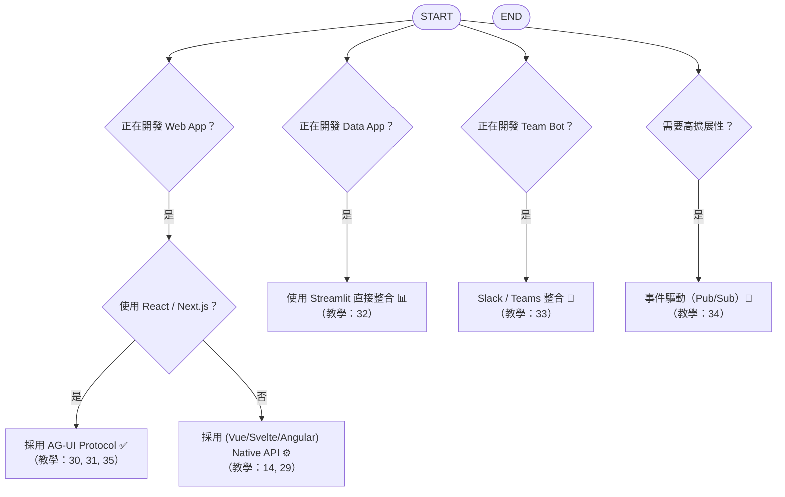

### 詳細比較 (Detailed Comparison)

#### AG-UI 協議 vs 原生 API (AG-UI Protocol vs Native API)

| 因素 (Factor) | AG-UI 協議 (AG-UI Protocol) | 原生 API (Native API) |
| ---------------------- | ------------------------------ | ----------------- |
| **設定時間** | ⚡ 10 分鐘 | 🔨 1-2 小時 |
| **UI 元件** | ✅ 預建 (`<CopilotChat>`) | ❌ 自己建立 |
| **TypeScript 支援** | ✅ 完全型別安全 | ⚠️ 手動型別 |
| **框架** | 僅限 React/Next.js | 任何框架 |
| **相依性** | CopilotKit + ag_ui_adk | 無 (僅 ADK) |
| **文件** | ✅ 廣泛 | ✅ 良好 |
| **生產就緒** | ✅ 是 (271 測試) | ✅ 是 |
| **客製化** | 🔶 中等 (主題、屬性) | ✅ 完全控制 |

**建議**：對於 React/Next.js 應用，請使用 **AG-UI 協議**。對於其他框架或需要完全控制時，請使用 **原生 API**。

---

#### 網頁 vs Python vs 訊息 (Web vs Python vs Messaging)

| 使用案例 (Use Case) | 最佳方法 (Best Approach) | 原因 (Why?) |
| ------------------------ | --------------- | ------------------------------------ |
| **面向客戶的 SaaS** | AG-UI (Next.js) | 生產就緒、可擴展、優良的使用者體驗 |
| **內部資料工具** | Streamlit | 開發快速、純 Python、內建 UI |
| **團隊協作** | Slack/Teams | 原生 UX、無需客製化 UI |
| **文件處理** | Pub/Sub | 非同步、可擴展、解耦 |
| **行動應用** | 原生 API | 框架無關 |

---

## 架構模式 (Architecture Patterns)

### 模式 1：單體式 (快速入門) (Pattern 1: Monolith (Quick Start))

**最適用於**：原型、MVP、小型團隊

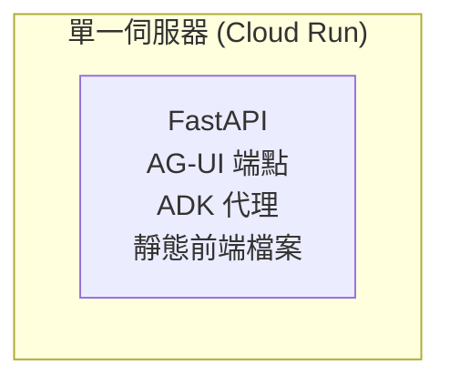

**優點**：部署簡單、成本低
**缺點**：擴展性有限

---

### 模式 2：前後端分離 (建議) (Pattern 2: Separated Frontend/Backend (Recommended))

**最適用於**：生產應用、擴展團隊

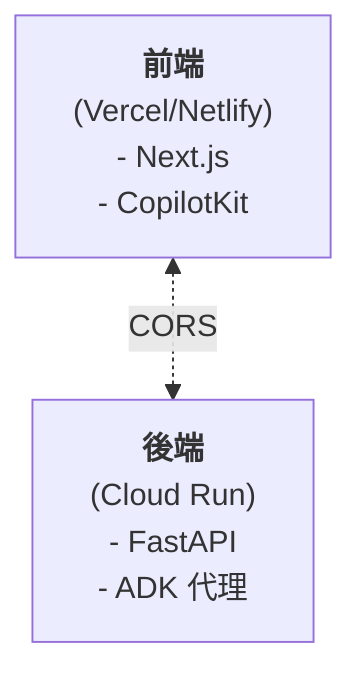

**優點**：獨立擴展、前端使用 CDN
**缺點**：需要 CORS 設定

---

### 模式 3：微服務 (企業級) (Pattern 3: Microservices (Enterprise))

**最適用於**：大型團隊、大規模擴展

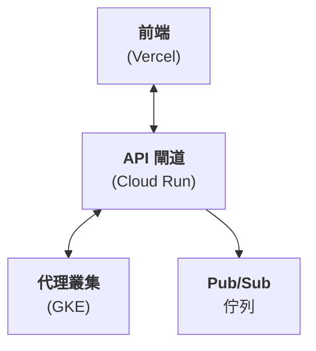

**優點**：無限擴展、故障隔離
**缺點**：基礎設施複雜

---

## 最佳實踐 (Best Practices)

### 1. 會話管理 (Session Management)

**始終持久化代理狀態以維持對話連續性**：

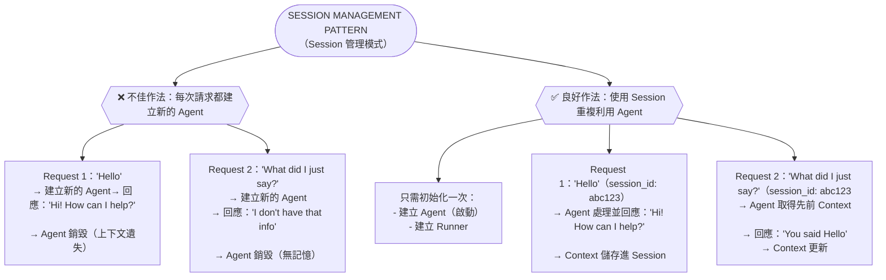

實作範例：

```python
from google.adk.agents import Agent
from google.adk.runners import InMemoryRunner
from google.genai import types
import asyncio

# ❌ 不良：每個請求都建立新代理 (遺失上下文)
@app.post("/chat")
async def chat_bad(message: str):
    agent = Agent(
        model='gemini-2.0-flash-exp',
        name='support_agent',
        instruction='您是一位樂於助人的支援代理'
    )
    runner = InMemoryRunner(agent=agent, app_name='support')
    session = await runner.session_service.create_session(
        app_name='support', user_id='user1'
    )

    new_message = types.Content(role='user', parts=[types.Part(text=message)])
    response_text = ""
    async for event in runner.run_async(
        user_id='user1',
        session_id=session.id,
        new_message=new_message
    ):
        if event.content and event.content.parts:
            response_text += event.content.parts[0].text

    return response_text

# ✅ 良好：初始化代理和 runner 一次，並在對話中重複使用
agent = Agent(
    model='gemini-2.0-flash-exp',
    name='support_agent',
    instruction='您是一位具有對話記憶的樂於助人的支援代理'
)
runner = InMemoryRunner(agent=agent, app_name='support')

@app.post("/chat")
async def chat(user_id: str, session_id: str, message: str):
    # 建立或取得會話
    session = await runner.session_service.create_session(
        app_name='support',
        user_id=user_id
    )

    # Runner 使用 session_id 管理對話歷史
    new_message = types.Content(role='user', parts=[types.Part(text=message)])
    response_text = ""
    async for event in runner.run_async(
        user_id=user_id,
        session_id=session.id,
        new_message=new_message
    ):
        if event.content and event.content.parts:
            response_text += event.content.parts[0].text

    return response_text
```

---

### 2. 錯誤處理 (Error Handling)

**優雅地處理代理失敗**：

```python
from fastapi import HTTPException

@app.post("/chat")
async def chat(message: str):
    try:
        response = await agent.send_message(message)
        return {"response": response.text}
    except Exception as e:
        # 記錄錯誤以供偵錯
        logger.error(f"代理錯誤: {e}")

        # 向使用者回傳友善的錯誤訊息
        raise HTTPException(
            status_code=500,
            detail="處理該請求時遇到問題。請再試一次。"
        )
```

---

### 3. 速率限制 (Rate Limiting)

**保護您的 API 免於濫用**：

```python
from slowapi import Limiter
from slowapi.util import get_remote_address

limiter = Limiter(key_func=get_remote_address)
app.state.limiter = limiter

@app.post("/chat")
@limiter.limit("10/minute")  # 每分鐘 10 個請求
async def chat(request: Request, message: str):
    # ... 代理邏輯
    pass
```

---

### 4. 串流以改善 UX (Streaming for Better UX)

**為長時間執行的代理串流回應**：

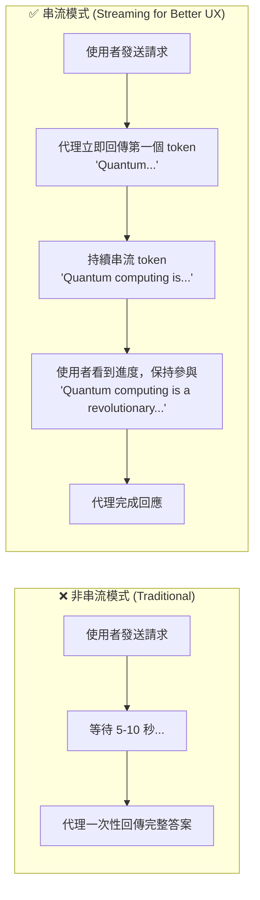
**優點**：
-   即時回饋 (減少感知延遲)
-   使用者保持參與 (看到進度)
-   如果無關，可以提早取消
-   更好的行動體驗

實作範例：

```typescript
// 前端：串流回應
const { messages, sendMessage, isLoading } = useCopilotChat({
  stream: true, // 啟用串流
});

// 使用者在代理思考時看到部分回應
```

```python
# 後端：啟用串流
agent = ADKAgent(
    name="streaming_agent",
    model="gemini-2.0-flash-exp",
    stream=True  # 回傳部分回應
)
```

---

### 5. 監控與可觀測性 (Monitoring & Observability)

**追蹤代理效能**：

```python
from opentelemetry import trace
from opentelemetry.exporter.cloud_trace import CloudTraceSpanExporter

# 設定追蹤
tracer = trace.get_tracer(__name__)

@app.post("/chat")
async def chat(message: str):
    with tracer.start_as_current_span("agent_chat"):
        span = trace.get_current_span()
        span.set_attribute("message_length", len(message))

        response = await agent.send_message(message)

        span.set_attribute("response_length", len(response.text))
        return response
```

---

### 額外資源 (Additional Resources)

**官方文件**：

- [Google ADK 文件](https://google.github.io/adk-docs/)
- [AG-UI 協議文件](https://docs.copilotkit.ai)
- [CopilotKit GitHub](https://github.com/CopilotKit/CopilotKit)

**範例程式碼**：

- [ADK 範例儲存庫](https://github.com/google/adk-samples)
- [gemini-fullstack 範例](https://github.com/google/adk-samples/tree/main/gemini-fullstack)

**社群**：

- [CopilotKit Discord](https://discord.gg/copilotkit)
- [Google AI 社群](https://discuss.ai.google.dev)

---

## 總結 (Summary)

### 重點摘要 (Key Takeaways)

✅ **多種整合選項**：AG-UI 協議、原生 API、直接 Python、訊息、Pub/Sub
✅ **AG-UI 協議**：官方、生產就緒的 React/Next.js 解決方案
✅ **決策框架**：根據框架、規模和使用案例選擇
✅ **快速入門**：10 分鐘內開始運作
✅ **最佳實踐**：會話管理、錯誤處理、串流、監控

---

## 程式碼實現 (Code Implementation)
- ui-integration：[程式碼連結](../../../python/agents/ui-integration/)
