# 教學 30：Next.js ADK 整合 - React 聊天介面 (Tutorial 30: Next.js ADK Integration - React Chat Interfaces)

**預估閱讀時間**：65-75 分鐘
**難度等級**：中級
**先決條件**：教學 29 (UI 整合簡介)、教學 1-3 (ADK 基礎)、基本的 Next.js 知識

---

## 目錄

1. [概覽](#overview)
2. [先決條件與設定](#prerequisites--setup)
3. [快速開始 (10 分鐘)](#quick-start-10-minutes)
4. [了解架構](#understanding-the-architecture)
5. [建構客戶支援 Agent](#building-a-customer-support-agent)
6. [進階功能](#advanced-features)
7. [生產環境部署](#production-deployment)
8. [疑難排解](#troubleshooting)
9. [下一步](#next-steps)

---

## 概覽 (Overview)

### 您將建構什麼

在本教學中，您將使用以下技術建構一個**生產級的客戶支援聊天機器人**：

- **Next.js 15** (App Router)
- **CopilotKit** (AG-UI 協定)
- **Google ADK** (Agent 後端)
- **Gemini 2.0 Flash** (LLM)

**最終成果**：

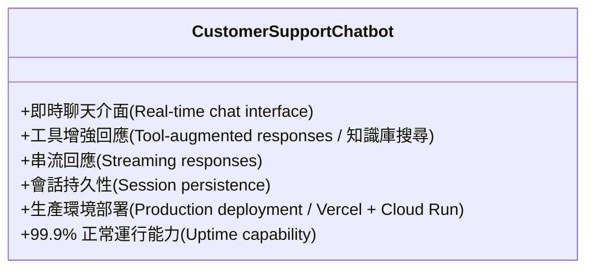

### 為什麼選擇 Next.js 15 + ADK？

| 功能 | 優點 |
| :--- | :--- |
| **Next.js 15 App Router** | 伺服器元件 (Server Components)、串流、最佳化路由 |
| **CopilotKit/AG-UI** | 預建的聊天 UI、型別安全的整合 |
| **Google ADK** | 強大的 Agent 框架，支援工具呼叫 |
| **Gemini 2.0 Flash** | 快速、具成本效益、最先進的 LLM |
| **Vercel + Cloud Run** | 可擴展的全球部署 |

---

## 先決條件與設定 (Prerequisites & Setup)

### 系統需求

```bash
# Node.js 18.17 或更高版本
node --version  # 應 >= 18.17

# Python 3.9 或更高版本
python --version  # 應 >= 3.9

# npm/pnpm/yarn
npm --version  # 任何版本
```

### API 金鑰

**1. Google AI API Key**

從 [Google AI Studio](https://makersuite.google.com/app/apikey) 獲取您的金鑰：

```bash
export GOOGLE_API_KEY="your_gemini_api_key_here"
```

**2. (選用) Vercel 帳戶**

用於部署：[註冊 Vercel](https://vercel.com)

---

## 快速開始 (Quick Start)

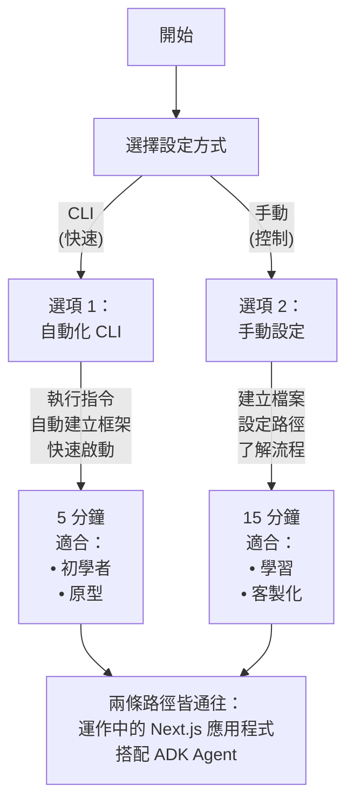

### 選項 1：使用 CopilotKit CLI (推薦)

最快的入門方式：

```bash
# 使用 ADK 範本建立新專案
npx copilotkit@latest create -f adk

# 依照提示操作：
# ✓ Project name: customer-support-bot
# ✓ Include ADK agent: Yes
# ✓ Include frontend: Yes (Next.js)

cd customer-support-bot

# 安裝依賴項 (包含 Python agent 依賴)
npm install

# 設定 API 金鑰
export GOOGLE_API_KEY="your_api_key"
# 或建立 agent/.env：
echo "GOOGLE_API_KEY=your_api_key" > agent/.env

# 同時執行前端與 agent！
npm run dev
```

**開啟 http://localhost:3000** - 您的 Agent 已上線！ 🎉

**發生了什麼事？**

- ✅ 建立了使用 App Router 的 Next.js 15 應用程式
- ✅ 安裝了 CopilotKit 前端套件
- ✅ 在 `agent/` 目錄中建立了 Python ADK agent
- ✅ 設定了雙向通訊 (AG-UI 協定)
- ✅ 為前端和後端設定了熱重載 (Hot reloading)

---

### 選項 2：手動設定 (完全控制)

想了解每個細節？從頭開始建構：

**步驟 1：建立 Next.js 應用程式**

```bash
npx create-next-app@latest customer-support-bot
# ✓ TypeScript: Yes
# ✓ ESLint: Yes
# ✓ Tailwind CSS: Yes
# ✓ App Router: Yes
# ✓ import alias: No

cd customer-support-bot
```

**步驟 2：安裝 CopilotKit**

```bash
npm install @copilotkit/react-core @copilotkit/react-ui
```

**步驟 3：設定專案**

複製教學實作並安裝依賴項：

```bash
# 複製並導航至教學目錄
cd tutorial_implementation/tutorial30

# 安裝所有依賴項 (後端 + 前端)
make setup

# 設定 API 金鑰
cp agent/.env.example agent/.env
# 編輯 agent/.env 並加入您的 GOOGLE_API_KEY
```

**替代的手動設定：**

```bash
# 後端設定
pip install -r requirements.txt
pip install -e .

# 前端設定
cd nextjs_frontend
npm install
cd ..
```

**步驟 4：建立 Agent**

建立 `agent/agent.py`：

```python
"""整合 AG-UI 的客戶支援 ADK Agent"""

import os
from typing import Dict, Any
from dotenv import load_dotenv
from fastapi import FastAPI
from fastapi.middleware.cors import CORSMiddleware
import uvicorn

# AG-UI ADK 整合匯入
from ag_ui_adk import ADKAgent, add_adk_fastapi_endpoint

# Google ADK 匯入
from google.adk.agents import Agent

# 載入環境變數
load_dotenv()

# 定義知識庫搜尋工具
def search_knowledge_base(query: str) -> str:
  """
  搜尋知識庫以獲取相關資訊。

  Args:
    query: 用於尋找相關文章的搜尋查詢。

  Returns:
    包含文章標題和內容的格式化字串。
  """
  # 模擬知識庫 - 請替換為真實資料庫/向量儲存
  knowledge_base = {
    "refund policy": {
      "title": "退款政策",
      "content": "我們提供購買後 30 天內的全額退款。" +
            "請聯繫 support@company.com 以啟動退款流程。"
    },
    "shipping": {
      "title": "運送資訊",
      "content": "標準運送需要 5-7 個工作日。" +
            "快遞運送（2-3 天）需額外支付 15 美元。"
    },
    "warranty": {
      "title": "保固範圍",
      "content": "所有產品均包含 1 年保固，涵蓋製造缺陷。可提供延長保固。"
    },
    "account": {
      "title": "帳戶管理",
      "content": "在 /account/reset 重設密碼。在 /account/billing 更新帳單資訊。隨時取消訂閱。"
    }
  }

  # 簡單的關鍵字比對 - 生產環境請使用向量搜尋
  query_lower = query.lower()
  for key, article in knowledge_base.items():
    if key in query_lower:
      return f"**{article['title']}**\n\n{article['content']}"

  # 預設回應
  return ("**一般支援**\n\n"
      "請聯繫我們的支援團隊 support@company.com "
      "或致電 1-800-SUPPORT 以獲得個人化協助。")


def lookup_order_status(order_id: str) -> str:
  """
  查詢客戶訂單狀態。

  Args:
    order_id: 要查詢的訂單 ID。

  Returns:
    訂單狀態資訊。
  """
  # 模擬訂單資料庫 - 請替換為真實資料庫
  orders = {
    "ORD-12345": "已出貨 - 明天送達",
    "ORD-67890": "處理中 - 2-3 天內出貨",
    "ORD-11111": "已於 2024 年 1 月 15 日送達"
  }

  if order_id.upper() in orders:
    return f"訂單 {order_id}: {orders[order_id.upper()]}"
  return f"找不到訂單 {order_id}。請檢查訂單 ID 後再試一次。"


def create_support_ticket(issue_description: str, priority: str = "normal") -> str:
  """
  為複雜問題建立支援工單。

  Args:
    issue_description: 客戶問題的描述。
    priority: 優先級別 (low, normal, high, urgent)。

  Returns:
    包含工單 ID 的確認訊息。
  """
  import uuid
  ticket_id = f"TICKET-{uuid.uuid4().hex[:8].upper()}"

  return (f"支援工單已成功建立！\n\n"
      f"**工單 ID:** {ticket_id}\n"
      f"**優先級:** {priority}\n"
      f"**問題:** {issue_description}\n\n"
      f"我們的支援團隊將在 24 小時內與您聯繫。")


def get_product_details(product_id: str) -> Dict[str, Any]:
  """
  從資料庫獲取產品詳情。

  回傳可顯示給使用者的產品資訊。
  前端將處理將其渲染為 ProductCard 元件。

  Args:
    product_id: 要查詢的產品 ID (格式: PROD-XXX)。

  Returns:
    包含狀態、報告和產品詳情的字典。
  """
  # 模擬產品資料庫 - 生產環境請替換為真實資料庫
  products = {
    "PROD-001": {
      "name": "Widget Pro",
      "price": 99.99,
      "image": "https://placehold.co/400x400/6366f1/fff.png",
      "rating": 4.5,
      "inStock": True,
    },
    "PROD-002": {
      "name": "Gadget Plus",
      "price": 149.99,
      "image": "https://placehold.co/400x400/8b5cf6/fff.png",
      "rating": 4.8,
      "inStock": True,
    },
    "PROD-003": {
      "name": "Premium Kit",
      "price": 299.99,
      "image": "https://placehold.co/400x400/ec4899/fff.png",
      "rating": 4.9,
      "inStock": False,
    },
  }

  product_id_upper = product_id.upper()

  if product_id_upper in products:
    product = products[product_id_upper]
    return {
      "status": "success",
      "report": f"這是 {product['name']} 的詳細資訊。"
            "我會為您將它顯示為產品卡片。",
      "product": product,
    }
  else:
    return {
      "status": "error",
      "report": f"找不到產品 {product_id}",
      "error": "請檢查產品 ID 後再試一次。",
    }


# 建立具有工具的 ADK agent
adk_agent = Agent(
  name="customer_support_agent",
  model="gemini-2.0-flash-exp",
  instruction="""你是一家電子商務公司的熱心客戶支援代理。

  你的職責：
  - 清晰簡潔地回答客戶問題
  - 在需要時使用 search_knowledge_base() 搜尋知識庫
  - 當客戶詢問訂單時，使用 lookup_order_status() 查詢訂單狀態
  - 為複雜問題使用 create_support_ticket() 建立支援工單
  - 當客戶詢問產品時，使用 get_product_details() 獲取產品詳情
  - 富有同理心且專業
  - 在適當時將複雜問題升級給人工支援
  - 絕不捏造資訊 - 如果不確定，就直接說

  重要 - 進階功能：

  1. **產品資訊 (生成式 UI)**:
    - 當使用者詢問產品時，遵循以下兩步驟流程：
    a) 首先呼叫 get_product_details(product_id) 以獲取產品資料
    b) 然後使用產品詳情呼叫 render_product_card(name, price, image, rating, inStock)
    - 範例：「給我看產品 PROD-001」
    → 呼叫 get_product_details("PROD-001")
    → 從結果中提取產品資料
    → 呼叫 render_product_card(name="Widget Pro", price=99.99, image="...", rating=4.5, inStock=True)
    - 前端將渲染一個精美的互動式 ProductCard 元件
    - 重要：不要在你的回應中包含 JSON 資料。只需簡單地說：
    「這是 [產品名稱] 的產品資訊」或「我已在上方顯示產品卡片。」
    - 讓視覺化卡片自己說話 - 不要以文字格式重複資料

  2. **退款 (人機協作)**:
    - 當使用者要求退款時，呼叫 process_refund(order_id, amount, reason)
    - 這是一個需要使用者核准的前端動作
    - 將會出現一個核准對話框，要求使用者確認或取消
    - 對話框顯示：訂單 ID、金額和原因
    - 在繼續之前等待使用者的決定
    - 如果核准：確認「退款處理成功」
    - 如果取消：確認「使用者已取消退款」
    - 重要：在呼叫此動作之前，你必須收集所有三個參數 (order_id, amount, reason)

  指南：
  - 熱情地問候客戶
  - 針對每種類型的查詢使用適當的工具
  - 回答後提供後續步驟
  - 除非要求更多細節，否則將回應保持在 3 段以內
  - 使用友善但專業的語氣
  - 使用 markdown 格式化回應以提高可讀性""",
  tools=[
    search_knowledge_base,
    lookup_order_status,
    create_support_ticket,
    get_product_details,
    # 注意：process_refund 僅作為前端動作提供 (非後端工具)
    # 這確保在處理之前顯示 HITL 核准對話框
  ],
)

# 使用 AG-UI 中介軟體包裝 ADK agent
agent = ADKAgent(
  adk_agent=adk_agent,
  app_name="customer_support_app",
  user_id="demo_user",
  session_timeout_seconds=3600,
  use_in_memory_services=True,
)

# 建立 FastAPI 應用程式
app = FastAPI(title="Customer Support Agent API")

# 為前端新增 CORS 中介軟體
app.add_middleware(
  CORSMiddleware,
  allow_origins=["http://localhost:3000", "http://localhost:5173"],
  allow_credentials=True,
  allow_methods=["*"],
  allow_headers=["*"],
)

# 新增 CopilotKit 的 ADK 端點
add_adk_fastapi_endpoint(app, agent, path="/api/copilotkit")

# 健康檢查端點
@app.get("/health")
def health_check():
  """健康檢查端點。"""
  return {"status": "healthy", "agent": "customer_support_agent"}

# 執行方式：uvicorn agent:app --reload --port 8000
if __name__ == "__main__":
  port = int(os.getenv("PORT", "8000"))
  uvicorn.run(
    "agent:app",
    host="0.0.0.0",
    port=port,
    reload=True
  )
```
```

**建立 `agent/.env`**：

```bash
GOOGLE_API_KEY=your_gemini_api_key_here
```

**步驟 5：建立前端**

首先，建立一個主題切換元件。建立 `components/ThemeToggle.tsx`：

```typescript
"use client";

import { useEffect, useState } from "react";

export function ThemeToggle() {
  const [theme, setTheme] = useState<"light" | "dark">("light");

  useEffect(() => {
    // Check system preference and localStorage on mount
    // (在掛載時檢查系統偏好設定和 localStorage)
    const savedTheme = localStorage.getItem("theme") as "light" | "dark" | null;
    const systemTheme = window.matchMedia("(prefers-color-scheme: dark)")
      .matches
      ? "dark"
      : "light";
    const initialTheme = savedTheme || systemTheme;

    setTheme(initialTheme);
    document.documentElement.classList.toggle("dark", initialTheme === "dark");
  }, []);

  const toggleTheme = () => {
    const newTheme = theme === "light" ? "dark" : "light";
    setTheme(newTheme);
    localStorage.setItem("theme", newTheme);
    document.documentElement.classList.toggle("dark", newTheme === "dark");
  };

  return (
    <button
      onClick={toggleTheme}
      className="flex items-center justify-center w-9 h-9 rounded-lg border border-border bg-background hover:bg-accent transition-colors"
      aria-label="Toggle theme"
    >
      {/* SVG icons for sun/moon ... */}
      {theme === "light" ? (
        <svg
          className="w-5 h-5 text-foreground"
          fill="none"
          stroke="currentColor"
          viewBox="0 0 24 24"
        >
          <path
            strokeLinecap="round"
            strokeLinejoin="round"
            strokeWidth={2}
            d="M20.354 15.354A9 9 0 018.646 3.646 9.003 9.003 0 0012 21a9.003 9.003 0 008.354-5.646z"
          />
        </svg>
      ) : (
        <svg
          className="w-5 h-5 text-foreground"
          fill="none"
          stroke="currentColor"
          viewBox="0 0 24 24"
        >
          <path
            strokeLinecap="round"
            strokeLinejoin="round"
            strokeWidth={2}
            d="M12 3v1m0 16v1m9-9h-1M4 12H3m15.364 6.364l-.707-.707M6.343 6.343l-.707-.707m12.728 0l-.707.707M6.343 17.657l-.707.707M16 12a4 4 0 11-8 0 4 4 0 018 0z"
          />
        </svg>
      )}
    </button>
  );
}
```

更新 `app/globals.css` 加入極簡、乾淨的樣式：
```css
@import "tailwindcss";

@layer base {
  :root {
    --background: 0 0% 100%;
    --foreground: 222.2 84% 4.9%;
    --card: 0 0% 100%;
    --card-foreground: 222.2 84% 4.9%;
    --popover: 0 0% 100%;
    --popover-foreground: 222.2 84% 4.9%;
    --primary: 221.2 83.2% 53.3%;
    --primary-foreground: 210 40% 98%;
    --secondary: 210 40% 96.1%;
    --secondary-foreground: 222.2 47.4% 11.2%;
    --muted: 210 40% 96.1%;
    --muted-foreground: 215.4 16.3% 46.9%;
    --accent: 210 40% 96.1%;
    --accent-foreground: 222.2 47.4% 11.2%;
    --destructive: 0 84.2% 60.2%;
    --destructive-foreground: 210 40% 98%;
    --border: 214.3 31.8% 91.4%;
    --input: 214.3 31.8% 91.4%;
    --ring: 221.2 83.2% 53.3%;
    --radius: 0.5rem;
  }

  .dark {
    --background: 222.2 84% 4.9%;
    --foreground: 210 40% 98%;
    --card: 222.2 84% 4.9%;
    --card-foreground: 210 40% 98%;
    --popover: 222.2 84% 4.9%;
    --popover-foreground: 210 40% 98%;
    --primary: 217.2 91.2% 59.8%;
    --primary-foreground: 222.2 47.4% 11.2%;
    --secondary: 217.2 32.6% 17.5%;
    --secondary-foreground: 210 40% 98%;
    --muted: 217.2 32.6% 17.5%;
    --muted-foreground: 215 20.2% 65.1%;
    --accent: 217.2 32.6% 17.5%;
    --accent-foreground: 210 40% 98%;
    --destructive: 0 62.8% 30.6%;
    --destructive-foreground: 210 40% 98%;
    --border: 217.2 32.6% 17.5%;
    --input: 217.2 32.6% 17.5%;
    --ring: 224.3 76.3% 48%;
  }
}

@layer base {
  * {
    border-color: hsl(var(--border));
  }

  body {
    background: hsl(var(--background));
    color: hsl(var(--foreground));
    font-feature-settings: "rlig" 1, "calt" 1;
  }
}
```

更新 `app/layout.tsx`：

```typescript
import type { Metadata } from "next";
import { Inter } from "next/font/google";
import "./globals.css";

const inter = Inter({ subsets: ["latin"] });

export const metadata: Metadata = {
  title: "Customer Support Chat",
  description: "AI-powered customer support powered by Google ADK",
};

export default function RootLayout({
  children,
}: Readonly<{
  children: React.ReactNode;
}>) {
  return (
    <html lang="en">
      <body className={inter.className}>{children}</body>
    </html>
  );
}
```

建立 `app/page.tsx`：

```typescript
"use client";

import { useState, useEffect } from "react";
import {
  CopilotKit,
  useCopilotReadable,
  useCopilotAction,
} from "@copilotkit/react-core";
import { CopilotChat } from "@copilotkit/react-ui";
import "@copilotkit/react-ui/styles.css";
import { ThemeToggle } from "@/components/ThemeToggle";
import { ProductCard } from "@/components/ProductCard";

/**
 * ChatInterface component with advanced features:
 * (ChatInterface 元件具備以下進階功能：)
 * 1. Generative UI - Product cards rendered from agent responses (從 Agent 回應渲染產品卡片)
 * 2. Human-in-the-Loop - User approval for refunds (退款的使用者核准)
 * 3. Shared State - User context accessible to agent (Agent 可存取的使用者上下文)
 */
function ChatInterface() {
  // Feature 3: Shared State - User context that agent can read
  // (功能 3：共享狀態 - Agent 可讀取的使用者上下文)
  const [userData] = useState({
    name: "John Doe",
    email: "john@example.com",
    accountType: "Premium",
    orders: ["ORD-12345", "ORD-67890"],
    memberSince: "2023-01-15",
  });

  // Feature 1: Generative UI - State to hold product data for rendering
  // (功能 1：生成式 UI - 保存產品資料以進行渲染的狀態)
  const [currentProduct, setCurrentProduct] = useState<{
    name: string;
    price: number;
    image: string;
    rating: number;
    inStock: boolean;
  } | null>(null);

  // Make user data readable by agent
  // (讓 Agent 可讀取使用者資料)
  useCopilotReadable({
    description: "Current user's account information and order history",
    value: userData,
  });

  // Feature 1: Generative UI - Frontend action that agent can call to render product cards
  // (功能 1：生成式 UI - Agent 可呼叫的前端動作以渲染產品卡片)
  useCopilotAction({
    name: "render_product_card",
    available: "remote",
    description:
      "Render a product card in the chat interface with product details",
    parameters: [
      {
        name: "name",
        type: "string",
        description: "Product name",
        required: true,
      },
      // ... 其他參數
      {
        name: "price",
        type: "number",
        description: "Product price in USD",
        required: true,
      },
      {
        name: "image",
        type: "string",
        description: "Product image URL",
        required: true,
      },
      {
        name: "rating",
        type: "number",
        description: "Product rating (0-5)",
        required: true,
      },
      {
        name: "inStock",
        type: "boolean",
        description: "Product availability",
        required: true,
      },
    ],
    handler: async ({ name, price, image, rating, inStock }) => {
      // Update state to show the product card
      // (更新狀態以顯示產品卡片)
      setCurrentProduct({ name, price, image, rating, inStock });

      return `Product card displayed successfully for ${name}`;
    },
    render: ({ args, status }) => {
      if (status !== "complete") {
        return (
          <div className="p-4 border rounded-lg animate-pulse bg-card">
            <div className="h-48 bg-muted rounded mb-4"></div>
            <div className="h-4 bg-muted rounded w-3/4 mb-2"></div>
            <div className="h-4 bg-muted rounded w-1/2"></div>
          </div>
        );
      }

      return (
        <div className="my-4">
          <ProductCard
            name={args.name}
            price={args.price}
            image={args.image}
            rating={args.rating}
            inStock={args.inStock}
          />
        </div>
      );
    },
  });

  // Feature 2: Human-in-the-Loop - Refund approval
  // (功能 2：人機協作 - 退款核准)
  const [refundRequest, setRefundRequest] = useState<{
    order_id: string;
    amount: number;
    reason: string;
  } | null>(null);

  // Frontend-only action that shows approval dialog
  // (僅限前端的動作，顯示核准對話框)
  useCopilotAction({
    name: "process_refund",
    available: "remote",
    description: "Process a refund after user approval",
    parameters: [
      // ... 參數定義
      {
        name: "order_id",
        type: "string",
        description: "Order ID to refund",
        required: true,
      },
      {
        name: "amount",
        type: "number",
        description: "Refund amount",
        required: true,
      },
      {
        name: "reason",
        type: "string",
        description: "Refund reason",
        required: true,
      },
    ],
    handler: async ({ order_id, amount, reason }) => {
      setRefundRequest({ order_id, amount, reason });

      // Return a promise that resolves when user approves/cancels
      // (回傳一個 promise，當使用者核准/取消時解析)
      return new Promise((resolve) => {
        (window as any).__refundPromiseResolve = resolve;
      });
    },
    render: ({ args, status }) => {
      if (status !== "complete") {
        return (
          <div className="p-5 border-2 border-yellow-300 dark:border-yellow-700 rounded-xl ...">
            {/* ... 渲染等待核准的 UI ... */}
             <div className="flex items-center gap-3">
              <div className="w-10 h-10 bg-yellow-500 rounded-full flex items-center justify-center animate-pulse">
                {/* icon */}
              </div>
              <div>
                <h4 className="font-bold text-lg text-yellow-900 dark:text-yellow-100">
                  Awaiting Your Approval
                </h4>
                <p className="text-sm text-yellow-700 dark:text-yellow-300">
                  Please review the modal dialog above
                </p>
              </div>
            </div>
          </div>
        );
      }

      return (
        <div className="p-4 border-2 border-green-300 dark:border-green-700 rounded-lg ...">
           {/* ... 渲染決策記錄的 UI ... */}
           <div>
            <p className="font-semibold text-green-900 dark:text-green-100">
              Decision Recorded
            </p>
            <p className="text-sm text-green-700 dark:text-green-300">
              Processing your choice...
            </p>
          </div>
        </div>
      );
    },
  });

  // Render approval dialog when refundRequest is set
  // (當 refundRequest 設定時渲染核准對話框)
  const handleRefundApproval = async (approved: boolean) => {
    const resolve = (window as any).__refundPromiseResolve;
    if (resolve && refundRequest) {
      if (approved) {
        resolve({
          approved: true,
          message: `Refund processed successfully for order ${refundRequest.order_id}`,
        });
      } else {
        resolve({
          approved: false,
          message: "Refund cancelled by user",
        });
      }
    }

    setRefundRequest(null);
    delete (window as any).__refundPromiseResolve;
  };

  // Keyboard support for modal
  // (對話框的鍵盤支援)
  useEffect(() => {
    const handleKeyDown = (e: KeyboardEvent) => {
      if (refundRequest) {
        if (e.key === "Escape") {
          e.preventDefault();
          handleRefundApproval(false);
        } else if (e.key === "Enter" && !e.shiftKey) {
          e.preventDefault();
          handleRefundApproval(true);
        }
      }
    };

    window.addEventListener("keydown", handleKeyDown);
    return () => window.removeEventListener("keydown", handleKeyDown);
  }, [refundRequest]);

  return (
    <div className="flex flex-col min-h-screen">
      {/* HITL Approval Dialog (人機協作核准對話框) */}
      {refundRequest && (
        <div
          className="fixed inset-0 bg-black/80 flex items-center justify-center z-50 p-4"
          onClick={(e) => {
            if (e.target === e.currentTarget) {
              handleRefundApproval(false);
            }
          }}
        >
          {/* ... Modal Content ... */}
           <div className="bg-white dark:bg-gray-900 border border-gray-200 dark:border-gray-700 rounded-2xl p-8 max-w-md w-full shadow-2xl">
            {/* ... Modal Header, Details, Buttons ... */}
             <div className="flex gap-4">
              <button
                onClick={() => handleRefundApproval(false)}
                className="..."
              >
                Cancel
              </button>
              <button
                onClick={() => handleRefundApproval(true)}
                className="..."
              >
                Approve Refund
              </button>
            </div>
          </div>
        </div>
      )}

      {/* Header */}
      <header className="border-b">
        {/* ... Header Content ... */}
         <div className="container mx-auto px-4 py-4">
          <div className="flex items-center justify-between">
             {/* ... User Info ... */}
            <div className="flex items-center gap-3">
              <ThemeToggle />
            </div>
          </div>
        </div>
      </header>

      {/* Main Content */}
      <main className="flex-1">
        <div className="container mx-auto px-4 py-6 h-[600px]">
          <div className="h-full border rounded-lg bg-card">
            <CopilotChat
              instructions="You are a friendly and professional customer support agent. Be helpful, empathetic, and provide clear, actionable solutions. You have access to the user's account information."
              labels={{
                title: "Support Chat",
                initial:
                  "👋 Hi! I'm your AI support assistant.\n\n" +
                  "**Try these example prompts:**\n\n" +
                  // ... prompts ...
                  "💡 *Scroll down to see interactive demos of all features!*",
              }}
              className="h-full"
            />
          </div>
        </div>
      </main>
    </div>
  );
}

export default function Home() {
  return (
    <div className="min-h-screen bg-background">
      <CopilotKit runtimeUrl="/api/copilotkit" agent="customer_support_agent">
        <ChatInterface />
      </CopilotKit>
    </div>
  );
}
```

**步驟 6：執行一切**

```bash
# 同時啟動後端與前端伺服器
make dev

# 或分開執行：
# Terminal 1: Backend
make dev-backend

# Terminal 2: Frontend
make dev-frontend
```

**開啟 http://localhost:3000** - 您的自訂支援 Agent 已上線！ 🚀

---

## 了解架構 (Understanding the Architecture)

### 元件圖 (Component Diagram)

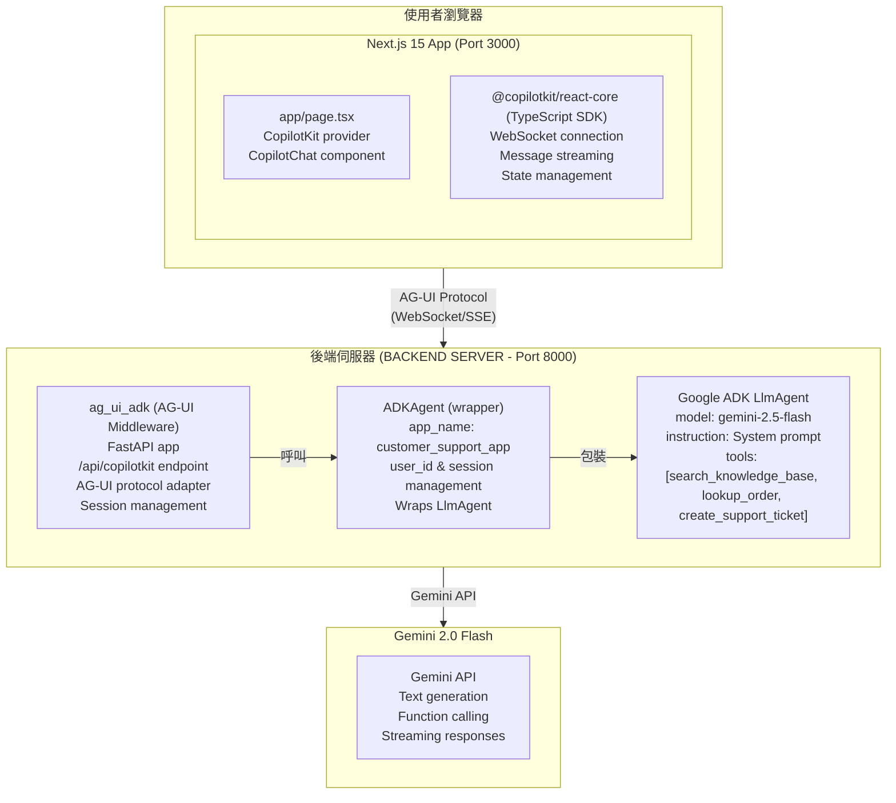

### 請求流程 (Request Flow)

**1. 使用者發送訊息**："退款政策是什麼？"

**2. 前端** (`<CopilotChat>`)：

```typescript
// 透過 WebSocket 發送訊息
{
  type: "textMessage",
  content: "What's your refund policy?",
  sessionId: "user-123"
}
```

**3. AG-UI 中介軟體** (ag_ui_adk)：

```python
# ADKAgent 包裝您的 LlmAgent
# 將 AG-UI 協定翻譯為 ADK 格式
# 管理具有超時的會話
# 處理工具執行
# add_adk_fastapi_endpoint() 建立 /api/copilotkit 端點
```

**4. ADK Agent**：

```python
# Agent 處理訊息
# 決定呼叫 search_knowledge_base 工具
# 使用 query="refund policy" 執行工具
# 根據知識庫結果產生回應
```

**5. Gemini 2.0 Flash**：

```text
System：你是一位客戶支援代理...
User：你們的退款政策是什麼？
Fuction Call：search_knowledge_base(query="refund policy")
Function Result：{"title": "退款政策", "content": "我們提供..."}
Agent："我們的退款政策是...
```

**6. 回應串流返回**：

```typescript
// 前端接收區塊 (chunks)
{
  type: "textMessageChunk",
  content: "Our refund policy"
}
{
  type: "textMessageChunk",
  content: " is very customer-friendly..."
}
```

**7. 使用者看到回應**即時逐步渲染！

---

### 了解 AG-UI 協定

**AG-UI** (Agent-User Interaction Protocol) 是一個開放、輕量級、基於事件的協定，標準化了 AI Agent 如何連接到使用者面對的應用程式。

#### 什麼是 AG-UI？

AG-UI 與生態系統中的其他 Agent 協定互補：

- **MCP** (Model Context Protocol) - 賦予 Agent 工具
- **A2A** (Agent2Agent) - 允許 Agent 與其他 Agent 通訊
- **AG-UI** - 將 Agent 帶入使用者面對的應用程式

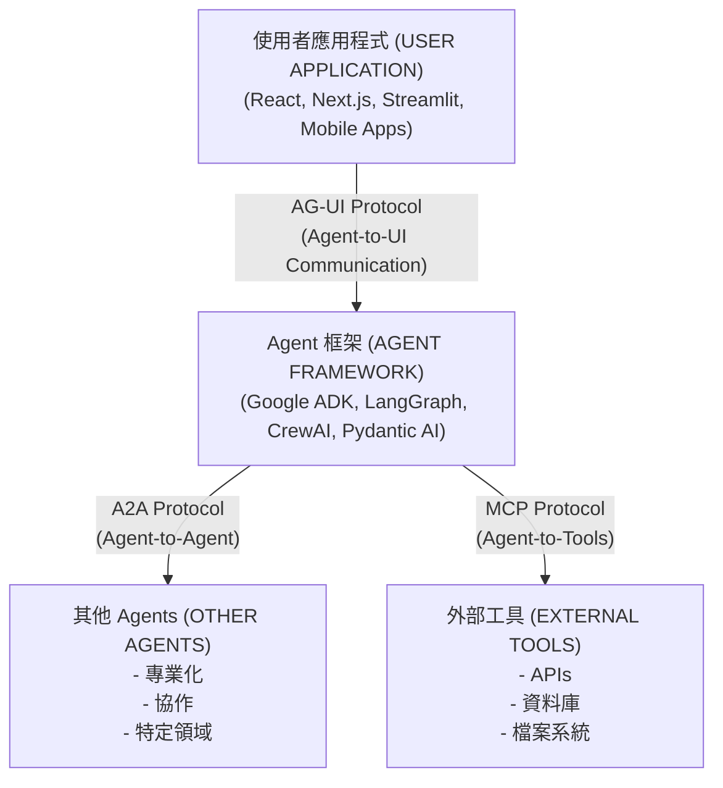

#### 關鍵功能

- 💬 **即時通訊**：透過 WebSocket/SSE 的串流回應
- 🔄 **雙向狀態**：同步 Agent 與前端之間的狀態
- 🧩 **生成式 UI**：從 Agent 回應渲染自訂 React 元件
- 🧠 **上下文豐富**：即時與 Agent 分享應用程式狀態
- 🛠️ **前端工具**：從 Agent 工作流程執行前端動作
- 🧑‍💻 **人機協作 (Human-in-the-Loop)**：內建敏感動作的核准流程

#### 運作方式

1. **Agent 後端**發出與 AG-UI 的約 16 種標準事件類型相容的事件
2. **中介軟體層**在 Agent 框架 (ADK) 與前端之間進行翻譯
3. **前端 SDK** 接收事件並即時更新 UI
4. **傳輸無關性**：適用於 WebSocket、SSE 或 Webhooks

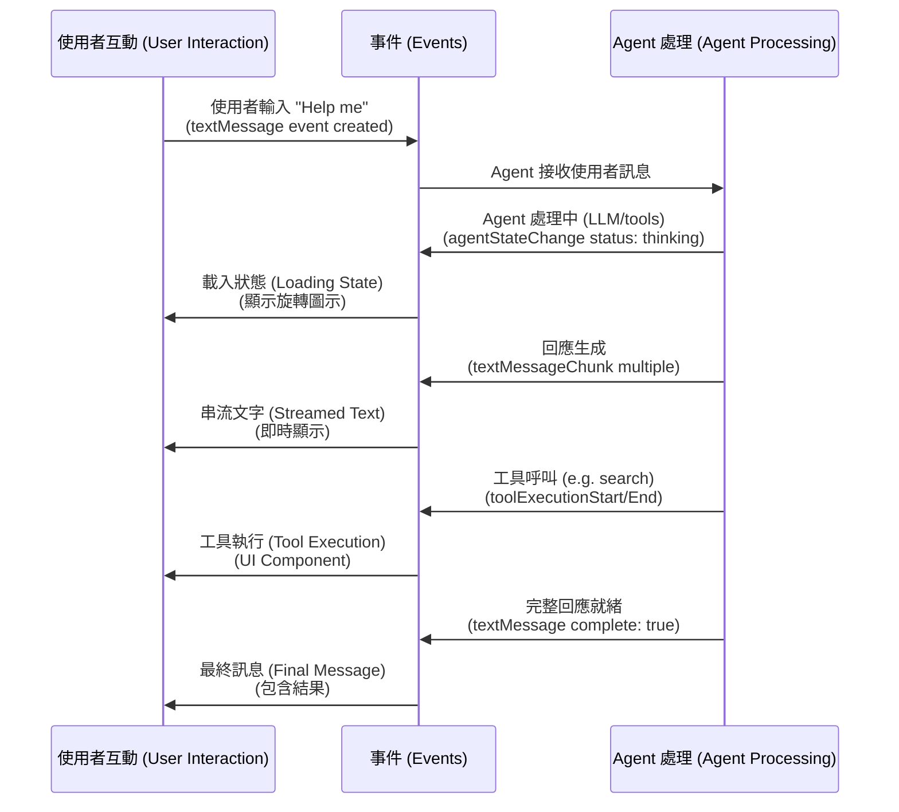

#### 框架支援

AG-UI 支援超過 15 種 Agent 框架，並已建立官方合作夥伴關係：

| 框架 | 狀態 | 類型 |
| :--- | :--- | :--- |
| **Google ADK** | ✅ 已支援 | 合作夥伴 |
| **LangGraph** | ✅ 已支援 | 合作夥伴 |
| **CrewAI** | ✅ 已支援 | 合作夥伴 |
| **Pydantic AI** | ✅ 已支援 | 第一方 |
| **Mastra** | ✅ 已支援 | 第一方 |
| **LlamaIndex** | ✅ 已支援 | 第一方 |
| **AG2** | ✅ 已支援 | 第一方 |
| **Vercel AI SDK** | 🛠️ 進行中 | 社群 |
| **OpenAI Agent SDK** | 🛠️ 進行中 | 社群 |

[查看所有支援的框架 →](https://docs.ag-ui.com/introduction#supported-frameworks)

#### 授權

- **AG-UI Protocol**: [MIT License](https://github.com/ag-ui-protocol/ag-ui/blob/main/LICENSE) - 開源，可免費商用
- **CopilotKit**: [MIT License](https://github.com/CopilotKit/CopilotKit/blob/main/LICENSE) - 開源，可免費商用
- **Google ADK**: [Apache 2.0 License](https://github.com/google/adk-python/blob/main/LICENSE) - 開源，可免費商用

本教學中的所有元件均為**完全開源**，並採用適合商業應用的寬鬆授權。

#### 了解更多

- [AG-UI 官方文件](https://ag-ui.com/)
- [AG-UI GitHub 儲存庫](https://github.com/ag-ui-protocol/ag-ui)
- [AG-UI Dojo (互動式範例)](https://dojo.ag-ui.com/)
- [CopilotKit 文件](https://docs.copilotkit.ai/)

---

## 建構客戶支援 Agent (Building a Customer Support Agent)

### 增強 Agent

讓我們為支援 Agent 新增更多真實的功能。

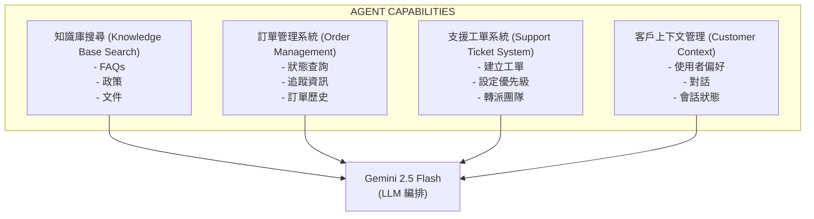

#### 功能 1：訂單狀態查詢

更新 `agent/agent.py`：

```python
def lookup_order_status(order_id: str) -> Dict[str, str]:
    """
    Look up the status of an order.
    (查詢訂單狀態)

    Args:
        order_id: The order ID to look up (format: ORD-XXXXX)

    Returns:
        Dict with order status details (包含訂單狀態詳情的字典)
    """
    # 模擬訂單資料庫 - 請替換為真實資料庫
    orders = {
        "ORD-12345": {
            "status": "Shipped",
            "tracking": "1Z999AA10123456784",
            "estimated_delivery": "2025-10-12",
            "items": "2x Widget Pro, 1x Gadget Plus"
        },
        "ORD-67890": {
            "status": "Processing",
            "tracking": None,
            "estimated_delivery": "2025-10-15",
            "items": "1x Premium Kit"
        }
    }

    order_id_upper = order_id.upper()

    if order_id_upper in orders:
        return orders[order_id_upper]
    else:
        return {
            "status": "Not Found",
            "message": f"Order {order_id} not found. Please check the order ID and try again."
        }

# 新增至 Agent 工具 - 注意：用於測試目的，顯示函數引用
# 在實際實作中，工具會被新增至 Agent 建構函數
from google.adk.agents import Agent

agent = Agent(
    model="gemini-2.0-flash-exp",
    name="customer_support_agent",
    instruction="""...""",  # 與先前相同
    tools=[lookup_order_status]  # 直接新增函數
)

# 若使用 genai.Tool 進行測試：
# Tool(
#     function_declarations=[
#         # ... search_knowledge_base (與先前相同)
#         FunctionDeclaration(
#             name="lookup_order_status",
#             description="Look up the status and tracking information for a customer order",
#             parameters={ ... }
#         )
#     ]
# )

# 更新執行階段工具
app = create_copilotkit_runtime(
    agent=agent,
    tools={
        "search_knowledge_base": search_knowledge_base,
        "lookup_order_status": lookup_order_status
    }
)
```

**測試它**：

使用者：「我的訂單 ORD-12345 狀態為何？」

Agent：「您的訂單 ORD-12345 已出貨！詳情如下：

- 狀態：已出貨
- 追蹤號碼：1Z999AA10123456784
- 預計送達日期：2025 年 10 月 12 日
- 商品：2x Widget Pro, 1x Gadget Plus

您可以使用上方的追蹤號碼來追蹤您的包裹。還有什麼我可以協助您的嗎？」

---

#### 功能 2：建立支援工單

新增升級功能：

```python
import uuid
from datetime import datetime

def create_support_ticket(
    issue_type: str,
    description: str,
    priority: str = "normal"
) -> Dict[str, str]:
    """
    Create a support ticket for issues that need human attention.
    (為需要人工關注的問題建立支援工單)

    Args:
        issue_type: Type of issue (billing, technical, account, other) (問題類型)
        description: Detailed description of the issue (詳細問題描述)
        priority: Priority level (low, normal, high, urgent) (優先級別)

    Returns:
        Dict with ticket ID and estimated response time (包含工單 ID 和預估回應時間的字典)
    """
    ticket_id = f"TKT-{uuid.uuid4().hex[:8].upper()}"

    # 模擬工單建立 - 請替換為真實工單系統 API
    response_times = {
        "urgent": "1-2 hours",
        "high": "4-6 hours",
        "normal": "12-24 hours",
        "low": "24-48 hours"
    }

    return {
        "ticket_id": ticket_id,
        "status": "Created",
        "priority": priority,
        "estimated_response": response_times.get(priority, "24 hours"),
        "created_at": datetime.now().isoformat(),
        "message": f"Ticket {ticket_id} created successfully. Our support team will reach out within {response_times.get(priority)}."
    }

# 新增至工具
# FunctionDeclaration( ... )

# 更新執行階段
app = create_copilotkit_runtime(
    agent=agent,
    tools={
        "search_knowledge_base": search_knowledge_base,
        "lookup_order_status": lookup_order_status,
        "create_support_ticket": create_support_ticket
    }
)
```

**測試它**：

User：「我的產品使用 2 個月後就壞了，而且保固似乎不包含這個問題」

Agent：「我了解這一定很令人沮喪。讓我為您建立一張支援工單，讓我們的專家團隊審查您的保固範圍。

_建立工單 TKT-A1B2C3D4_

我已經為您建立了高優先級的工單 TKT-A1B2C3D4。我們的專業支援團隊將在 4-6 小時內與您聯繫，審查您的案件和保固詳情。

在等待期間，您是否嘗試過：

- 檢查是否有可用的韌體更新
- 執行恢復原廠設定（如果適用）

在您等待的同時，還有什麼我可以協助您的嗎？」

---

### 新增個性與上下文

讓您的 Agent 更具吸引力：

```python
from google.adk.agents import Agent

agent = Agent(
  model="gemini-2.0-flash-exp",
  name="customer_support_agent",
  instruction="""你是 Jamie，TechCo 的一位友善且知識淵博的客戶支援代理，這是一家銷售電子產品和裝置的電子商務公司。

  您的個性：
  - 溫暖且富有同理心，但保持專業
  - 對受挫的客戶有耐心且能理解
  - 熱衷於協助解決問題
  - 偶爾使用適當的表情符號以示友善 😊
  - 記住對話中的上下文

  您的職責：
  1. 使用知識庫回答產品和政策問題
  2. 當客戶提供訂單 ID 時查詢訂單狀態
  3. 為複雜問題建立支援工單
  4. 立即上報緊急問題
  5. 絕不捏造資訊 - 如果不確定，請檢查知識庫或建立工單

  指南：
  - 熱情地問候回頭客
  - 以同理心體諒挫折感
  - 提供積極主動的解決方案
  - 以「還有什麼我可以協助您的嗎？」結束
  - 保持回應簡潔但完整
  - 使用項目符號以求清晰

  公司價值觀：
  - 客戶滿意是我們的首要任務
  - 我們為我們的產品提供支援
  - 所有溝通保持透明

  記住：您代表 TechCo 對卓越客戶服務的承諾！""",
  tools=[...],  # 與先前相同的工具
  tool_config={"function_calling_config": {"mode": "AUTO"}}
)
```

---

## 進階功能 (Advanced Features)

💡 完整的實作可用

所有三個進階功能均已在 `tutorial_implementation/tutorial30/nextjs_frontend/app/page.tsx` 的工作範例中**完全實作**。

**立即嘗試：**

```bash
cd tutorial_implementation/tutorial30
make dev
# 開啟 http://localhost:3001
```

- 🎨 **生成式 UI (Generative UI)**："Show me product PROD-001" → 渲染精美的產品卡片
- 🔐 **人機協作 (Human-in-the-Loop)**："I want a refund for ORD-12345" → 出現核准模態框
- 👤 **共享狀態 (Shared State)**："What's my account status?" → Agent 知道你是 John Doe
:::

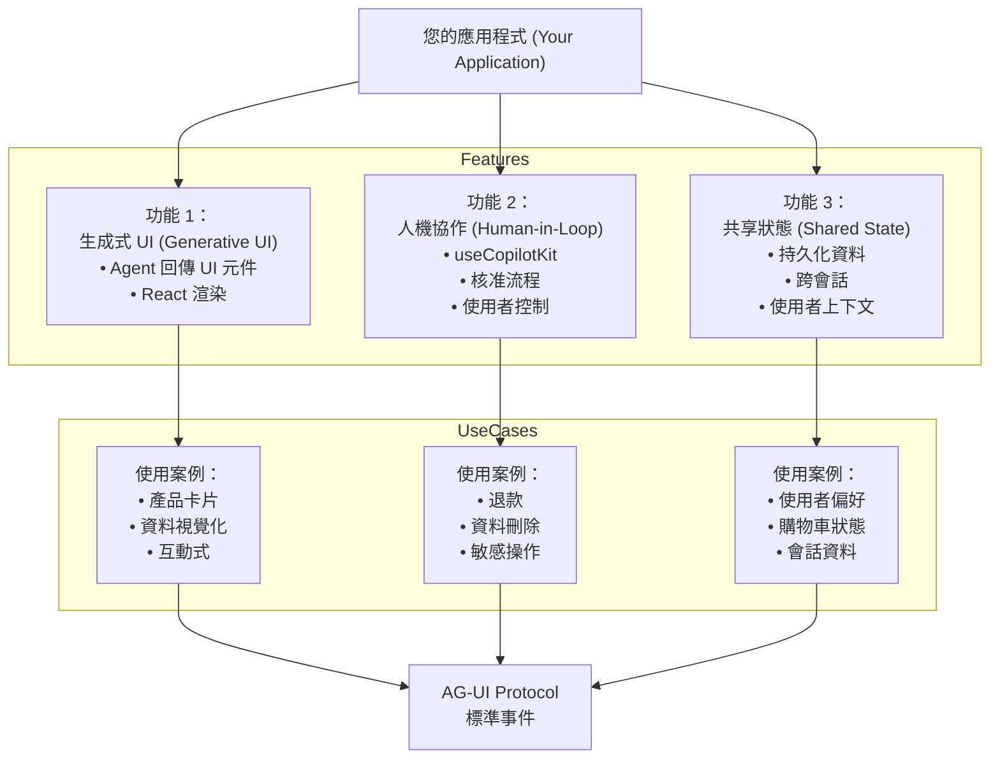

### 功能 1：生成式 UI (Generative UI)

💡success 已在教學 30 中完全實作

運作中的生成式 UI 實作渲染了精美的產品卡片：

- ✅ **ProductCard 元件** 具有響應式設計
- ✅ **useCopilotAction** 註冊與適當的渲染函數
- ✅ **動態內容** 包含產品圖片、價格、評分
- ✅ **深色模式支援** 使用 Tailwind 類別

**嘗試它：**

```bash
cd tutorial_implementation/tutorial30
make dev
# 聊天："Show me product PROD-001"
# 精美的產品卡片內嵌渲染！🎨
```

**實作：** `nextjs_frontend/app/page.tsx` (第 45-89 行)，`components/ProductCard.tsx`
:::

從 Agent 回應直接渲染自訂 React 元件。

**前端實作** (`app/page.tsx`)：

```typescript
"use client";
import { useCopilotAction } from "@copilotkit/react-core";
import { ProductCard } from "@/components/ProductCard";

function ChatInterface() {
  // State to store product data when agent calls action
  // (當 Agent 呼叫動作時儲存產品資料的狀態)
  const [currentProduct, setCurrentProduct] = useState<any>(null);

  // Register action that agent can call to render product cards
  // (註冊 Agent 可呼叫以渲染產品卡片的動作)
  useCopilotAction({
    name: "render_product_card",
    available: "remote", // Agent calls this from backend (Agent 從後端呼叫此動作)
    description: "Render a product card UI component",
    parameters: [
      { name: "product_id", type: "string", description: "Product ID" },
      { name: "name", type: "string", description: "Product name" },
      { name: "price", type: "number", description: "Product price" },
      { name: "image", type: "string", description: "Image URL" },
      { name: "rating", type: "number", description: "Rating 0-5" },
      { name: "in_stock", type: "boolean", description: "Stock status" },
    ],
    handler: async ({ product_id, name, price, image, rating, in_stock }) => {
      // Store product data to trigger render
      // (儲存產品資料以觸發渲染)
      setCurrentProduct({ product_id, name, price, image, rating, in_stock });

      return `Product card rendered for ${name}`;
    },
    // Render function shows the UI in chat
    // (渲染函數在聊天中顯示 UI)
    render: ({ status, result }) => (
      <div className="my-4 animate-fade-in">
        {status === "executing" && (
          <div className="flex items-center gap-2">
            <div className="w-5 h-5 border-2 border-blue-500 border-t-transparent rounded-full animate-spin" />
            <span>Loading product...</span>
          </div>
        )}
        {status === "complete" && currentProduct && (
          <ProductCard {...currentProduct} />
        )}
      </div>
    ),
  });

  return <CopilotChat />;
}
```

**產品元件** (`components/ProductCard.tsx`)：

```typescript
import Image from "next/image";

interface ProductCardProps {
  name: string;
  price: number;
  image: string;
  rating: number;
  in_stock: boolean;
}

export function ProductCard({
  name,
  price,
  image,
  rating,
  in_stock,
}: ProductCardProps) {
  return (
    <div className="border border-gray-200 dark:border-gray-700 rounded-xl p-5 bg-white dark:bg-gray-800 shadow-lg max-w-sm">
      <div className="relative w-full h-48 mb-4 rounded-lg overflow-hidden">
        <Image src={image} alt={name} fill className="object-cover" />
      </div>

      <h3 className="font-bold text-xl mb-2">{name}</h3>
      {/* ... Price, Rating, Stock status ... */}
    </div>
  );
}
```

**後端 Agent** (`agent/agent.py`)：

```python
# Agent 使用該動作但未定義它
# 該動作僅限前端，就像 process_refund 一樣

# 當使用者詢問產品時，Agent 呼叫：
# get_product_details(product_id) 以獲取資料
# 然後 render_product_card(name, price, image, rating, inStock) 以顯示

# 精美的 ProductCard 元件出現在聊天中！🎨
```

**運作原理：**

1. 使用者："Show me product PROD-001"
2. Agent 呼叫 `get_product_details("PROD-001")` 以獲取產品資料
3. Agent 從回應中提取產品詳情
4. Agent 呼叫 `render_product_card(name, price, image, rating, inStock)`
5. 前端處理常式接收資料，儲存在 `currentProduct` 狀態中
6. 渲染函數在聊天中內嵌顯示 `<ProductCard>` 元件
7. 使用者看到包含圖片、價格、評分的互動式產品卡片

現在當 Agent 提到產品時，精美的卡片將內嵌渲染！🎨

---

### 功能 2：人機協作 (Human-in-the-Loop, HITL)

運作中的 HITL 實作包含：

- ✅ **專業模態對話框** 具有堅實的設計
- ✅ **鍵盤快速鍵** (ESC 取消，Enter 核准)
- ✅ **基於 Promise 的流程** 阻擋 Agent 直到使用者決定
- ✅ **點擊外部關閉** 功能
- ✅ **完整的深色模式支援**

**觀看它的實際運作：**

```bash
cd tutorial_implementation/tutorial30
make dev
# 聊天："I want a refund for ORD-12345"
# 提供：金額 "100"，原因 "Items arrived broken"
# 精美的核准模態框出現！🎉
```

**實作細節：**

- 前端：`nextjs_frontend/app/page.tsx` (第 99-279 行)
- 後端：Agent 在工具列表中**不**包含 `process_refund` (僅限前端動作)
- 模式：`available: "remote"` + Promise + React state + modal overlay
:::

讓使用者使用專業的核准模態框核准敏感動作：

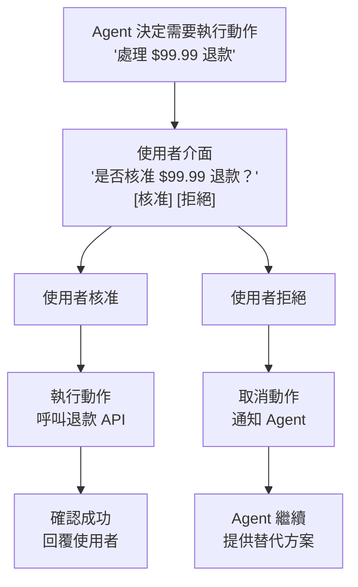

**關鍵實作模式：**

HITL 實作使用 **僅限前端動作 (frontend-only action)** 模式：

1. **後端** (`agent/agent.py`)：在工具列表中**不**包含 `process_refund`
2. **前端** (`app/page.tsx`)：使用 `available: "remote"` 實作 `process_refund`
3. **流程**：Agent 呼叫動作 → 前端處理常式 → 顯示模態框 → 使用者決定 → Promise 解析 → Agent 繼續

**前端實作** (專業模態框)：

```typescript
"use client";
import { useState, useEffect } from "react";
import { useCopilotAction } from "@copilotkit/react-core";

function ChatInterface() {
  // State to manage the approval dialog
  // (管理核准對話框的狀態)
  const [refundRequest, setRefundRequest] = useState<{
    order_id: string;
    amount: number;
    reason: string;
  } | null>(null);

  // Frontend-only action that agent can call
  // (Agent 可呼叫的僅限前端動作)
  useCopilotAction({
    name: "process_refund",
    available: "remote", // Frontend-only, not a backend tool (僅限前端，非後端工具)
    description: "Process a refund after user approval",
    parameters: [ ... ],
    handler: async ({ order_id, amount, reason }) => {
      console.log("🔍 HITL handler called with:", { order_id, amount, reason });

      // Store the refund request to show in the dialog
      // (儲存退款請求以顯示在對話框中)
      setRefundRequest({ order_id, amount, reason });

      // Return a promise that resolves when user approves/cancels
      // (回傳一個 promise，當使用者核准/取消時解析)
      return new Promise((resolve) => {
        // We'll resolve this in the dialog buttons
        (window as any).__refundPromiseResolve = resolve;
      });
    },
    render: ({ args, status }) => {
       // ... 渲染邏輯 ...
    },
  });

  // Render approval dialog when refundRequest is set
  // (當 refundRequest 設定時渲染核准對話框)
  const handleRefundApproval = async (approved: boolean) => {
    // ... 處理核准邏輯 ...
  };

  // ... 鍵盤支援與渲染 ...
}
```

**為什麼此模式有效：**

1. **無後端工具衝突**：後端沒有 `process_refund`，所以 Agent 無法繞過核准
2. **Promise 阻擋 Agent**：Agent 等待 Promise 解析後才繼續
3. **專業 UX**：具有適當樣式、動畫和鍵盤快速鍵的模態框
4. **型別安全**：TypeScript 確保正確的參數
5. **無障礙**：鍵盤導航、ARIA 標籤、高對比度

**使用者體驗：**

User：「我想要為訂單 ORD-12345 申請退款」
Agent：「我可以協助處理。請問退款金額與原因是什麼？」
User：「100 元，商品送達時已損壞」
→ **精美的模態框出現** 包含所有詳情
→ 使用者可以核准 (Enter) 或取消 (ESC)
→ Agent 接收決定並做出相應回應

---

### 功能 3：共享狀態 (Shared State)

共享狀態與 `useCopilotReadable` 無縫協作：

- ✅ **使用者上下文** 自動提供給 Agent
- ✅ **即時同步** 當狀態改變時
- ✅ **無需手動傳遞** 資料

**嘗試它：**

```bash
cd tutorial_implementation/tutorial30
make dev
# 聊天："What's my account status?"
# Agent 知道你是 John Doe 且擁有 Premium 帳戶！👤
```

**實作：** `nextjs_frontend/app/page.tsx` (第 18-26, 40-43 行)

使用 `useCopilotReadable` 自動將應用程式狀態與 Agent 同步：

```typescript
"use client";
import { useCopilotReadable } from "@copilotkit/react-core";
import { useState } from "react";

export default function Home() {
  // Application state (could come from auth, database, etc.)
  // (應用程式狀態，可來自 auth、資料庫等)
  const [userData, setUserData] = useState({
    name: "John Doe",
    email: "john@example.com",
    accountType: "Premium",
    orders: ["ORD-12345", "ORD-67890"],
  });

  // Make state readable by agent - that's it!
  // (讓 Agent 可讀取狀態 - 就這樣！)
  useCopilotReadable({
    description: "Current user's account information and order history",
    value: userData,
  });

  return (
    <CopilotKit runtimeUrl="http://localhost:8000/copilotkit">
      <CopilotChat />
      {/* Agent automatically knows user context without manual passing! */}
      {/* (Agent 自動知道使用者上下文，無需手動傳遞！) */}
    </CopilotKit>
  );
}
```

**運作原理：**

1. **定義狀態**：建立包含使用者/應用程式資料的 React 狀態
2. **使其可讀**：呼叫 `useCopilotReadable` 並提供描述和值
3. **Agent 存取**：Agent 在每個請求中自動接收上下文

**範例互動：**

```text
User: "What's my account status?"

Agent Response: "Hi John! You have a Premium account with email
john@example.com. I see you have 2 orders: ORD-12345 and ORD-67890.
Would you like to check on any of them?"
```

**Agent 在你未明確告知的情況下就知道所有這些資訊！** 🎯

---

## 生產環境部署 (Production Deployment)

### 架構概覽

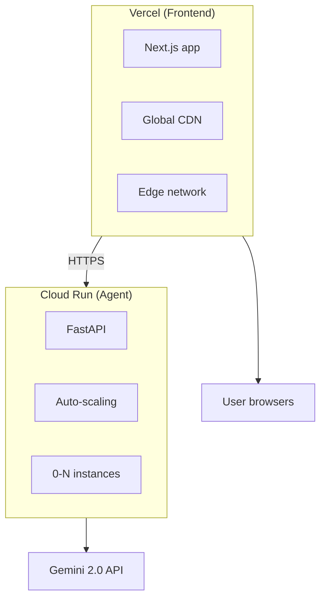

### 步驟 1：將 Agent 部署至 Cloud Run
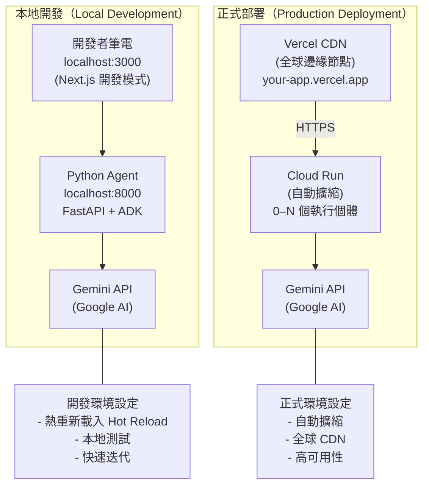

**建立 `agent/Dockerfile`**：

```dockerfile
FROM python:3.11-slim

WORKDIR /app

# Install dependencies (安裝依賴項)
COPY requirements.txt .
RUN pip install --no-cache-dir -r requirements.txt

# Copy agent code (複製 Agent 程式碼)
COPY agent.py .
COPY .env .

# Expose port (暴露埠號)
EXPOSE 8000

# Run agent (執行 Agent)
CMD ["uvicorn", "agent:app", "--host", "0.0.0.0", "--port", "8000"]
```

**部署至 Cloud Run**：

```bash
# 建置並部署
gcloud run deploy customer-support-agent \
  --source=./agent \
  --region=us-central1 \
  --allow-unauthenticated \
  --set-env-vars="GOOGLE_API_KEY=your_api_key"

# 輸出：
# Service URL: https://customer-support-agent-abc123.run.app
```

---

### 步驟 2：將前端部署至 Vercel

**更新 `app/page.tsx`** 加入生產環境 URL：

```typescript
const AGENT_URL = process.env.NEXT_PUBLIC_AGENT_URL || "http://localhost:8000";

export default function Home() {
  return (
    <CopilotKit runtimeUrl={`${AGENT_URL}/copilotkit`}>
      <CopilotChat />
    </CopilotKit>
  );
}
```

**部署**：

```bash
# 安裝 Vercel CLI
npm i -g vercel

# 部署
vercel

# 設定環境變數
vercel env add NEXT_PUBLIC_AGENT_URL production
# 輸入：https://customer-support-agent-abc123.run.app

# 再次部署並使用環境變數
vercel --prod
```

**您的應用程式已上線！** 🚀

URL: `https://customer-support-bot.vercel.app`

---

### 步驟 3：生產環境最佳實踐

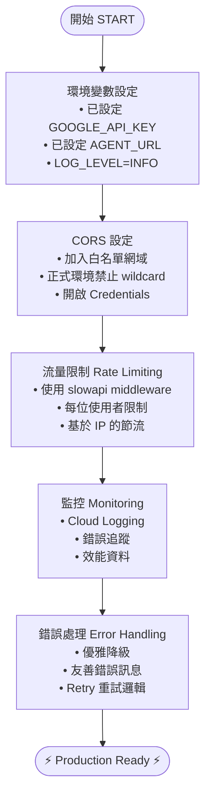


**1. 環境變數**

```bash
# Vercel (Frontend)
NEXT_PUBLIC_AGENT_URL=https://agent.run.app

# Cloud Run (Agent)
GOOGLE_API_KEY=xxx
ENVIRONMENT=production
LOG_LEVEL=INFO
```

**2. CORS 設定**

```python
# agent/agent.py
from fastapi.middleware.cors import CORSMiddleware

app.add_middleware(
    CORSMiddleware,
    allow_origins=[
        "https://customer-support-bot.vercel.app",
        "https://*.vercel.app",  # 預覽部署
    ],
    allow_credentials=True,
    allow_methods=["*"],
    allow_headers=["*"],
)
```

**3. 速率限制**

```python
from slowapi import Limiter
from slowapi.util import get_remote_address

limiter = Limiter(key_func=get_remote_address)

@app.post("/copilotkit")
@limiter.limit("100/hour")  # 每個 IP 每小時 100 次請求
async def copilotkit_endpoint(...):
    ...
```

**4. 監控**

```python
from opentelemetry import trace
from opentelemetry.exporter.cloud_trace import CloudTraceSpanExporter

# 設定 Google Cloud Trace
tracer = trace.get_tracer(__name__)

@app.post("/copilotkit")
async def copilotkit_endpoint(...):
    with tracer.start_as_current_span("copilotkit_request"):
        # ... 處理請求
        pass
```

**5. 錯誤處理**

```python
from fastapi import HTTPException, status

@app.exception_handler(Exception)
async def global_exception_handler(request, exc):
    logger.error(f"Unhandled error: {exc}", exc_info=True)
    return JSONResponse(
        status_code=status.HTTP_500_INTERNAL_SERVER_ERROR,
        content={"message": "Internal server error"}
    )
```

---

## 疑難排解 (Troubleshooting)

### 常見問題

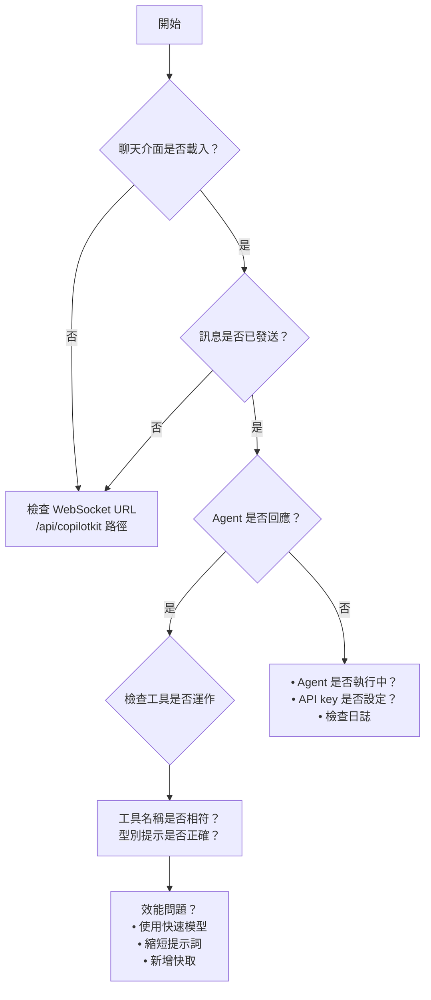

**問題 1：WebSocket 連線失敗**

**情境**：
- 聊天無法載入
- 控制台錯誤："WebSocket connection failed"

**解決方案**：

```typescript
// 檢查 runtimeUrl 是否正確
<CopilotKit runtimeUrl="http://localhost:8000/copilotkit">  // ✅ 正確
<CopilotKit runtimeUrl="http://localhost:8000">  // ❌ 缺少 /copilotkit
```

---

**問題 2：Agent 無回應**

**情境**：
- 訊息已發送但無回應
- 載入旋轉圖示一直顯示

**解決方案**：

```bash
# 檢查 Agent 是否執行中
curl http://localhost:8000/health

# 檢查日誌
# 在 Agent 終端機中查看錯誤

# 驗證 API 金鑰
echo $GOOGLE_API_KEY  # 應顯示您的金鑰
```

---

**問題 3：生產環境中的 CORS 錯誤**

**情境**：
- 本地運作正常，生產環境失敗
- 瀏覽器控制台："CORS policy blocked"

**解決方案**：

```python
# agent/agent.py - 新增您的生產環境網域
app.add_middleware(
    CORSMiddleware,
    allow_origins=[
        "https://your-app.vercel.app",  # 新增此行！
        "http://localhost:3000",  # 保留供本地開發
    ],
    allow_credentials=True,
    allow_methods=["*"],
    allow_headers=["*"],
)
```

---

**問題 4：工具無法運作**

**情境**：
- Agent 不呼叫函數
- 回應很空泛

**解決方案**：

```python
# 驗證工具註冊
app = create_copilotkit_runtime(
    agent=agent,
    tools={
        "search_knowledge_base": search_knowledge_base,  # ✅ 必須與 FunctionDeclaration 名稱相符
        "searchKnowledgeBase": search_knowledge_base,    # ❌ 名稱錯誤
    }
)

# 檢查函數簽章
def search_knowledge_base(query: str) -> Dict[str, str]:  # ✅ 回傳型別提示
def search_knowledge_base(query):  # ❌ 缺少型別提示
```

---

**問題 5：回應緩慢**

**情境**：
- Agent 需要 10 秒以上才能回應
- 使用者抱怨延遲

**解決方案**：

```python
from google.adk.agents import Agent

# 使用快速模型並最佳化指令
agent = Agent(
    model="gemini-2.0-flash-exp",  # ✅ 快速模型
    # model="gemini-2.0-pro-exp",  # ❌ 較慢，僅在需要時使用
    name="customer_support_agent",
    instruction="Be concise. Answer in 2-3 sentences max."  # ✅ 越短越好
)

# ❌ 避免：非常長的指令會減慢回應
# instruction="You are an extremely detailed agent..." (5 段落)

# 為知識庫使用快取
from functools import lru_cache

@lru_cache(maxsize=128)
def search_knowledge_base(query: str):
    # 快取重複的查詢
    ...
```

---

## 下一步 (Next Steps)

### 您已掌握 Next.js + ADK！ 🎉

您現在知道如何：

✅ 建構生產級 Next.js 15 + ADK 應用程式
✅ 整合 CopilotKit/AG-UI 協定
✅ 建立自訂工具與 Agent
✅ 新增生成式 UI 與 HITL
✅ 部署至 Vercel + Cloud Run
✅ 監控與疑難排解

### 額外資源

- [CopilotKit 文件](https://docs.copilotkit.ai/adk)
- [Next.js 15 文件](https://nextjs.org/docs)
- [ADK 文件](https://google.github.io/adk-docs/)
- [範例：gemini-fullstack](https://github.com/google/adk-samples/tree/main/gemini-fullstack)

## 程式碼實現 (Code Implementation)

- customer-support：[程式碼連結](../../../python/agents/customer-support/)
