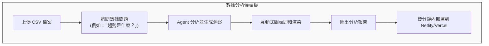
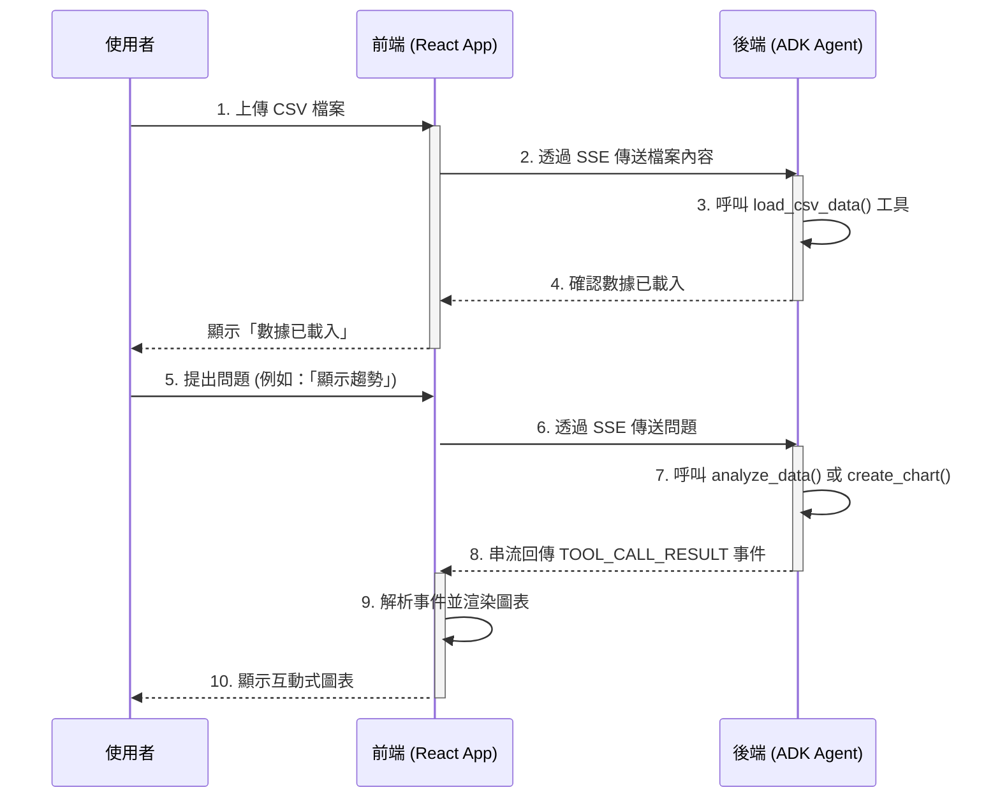
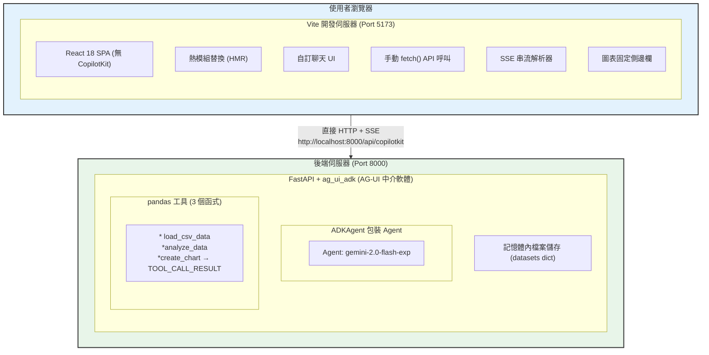
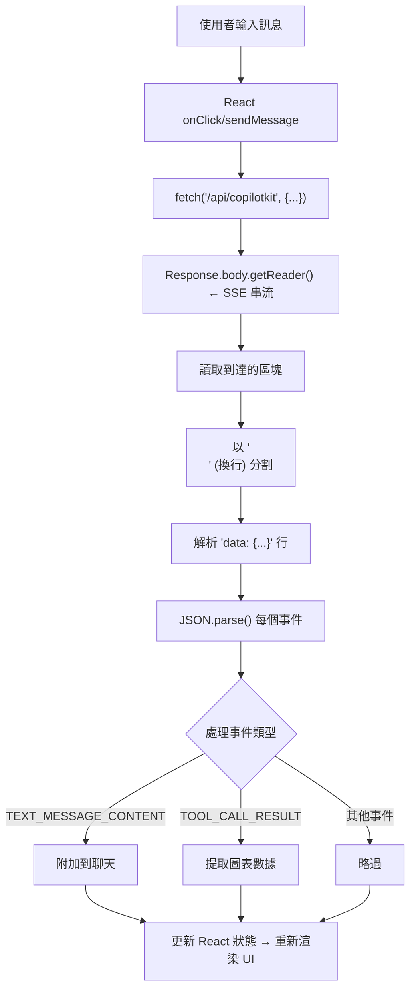
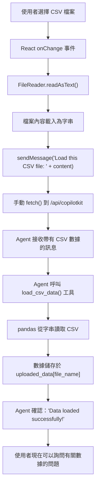
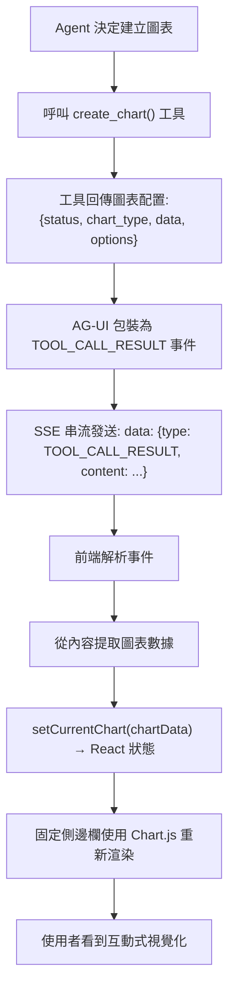
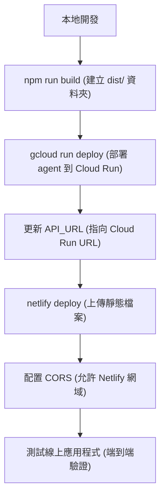
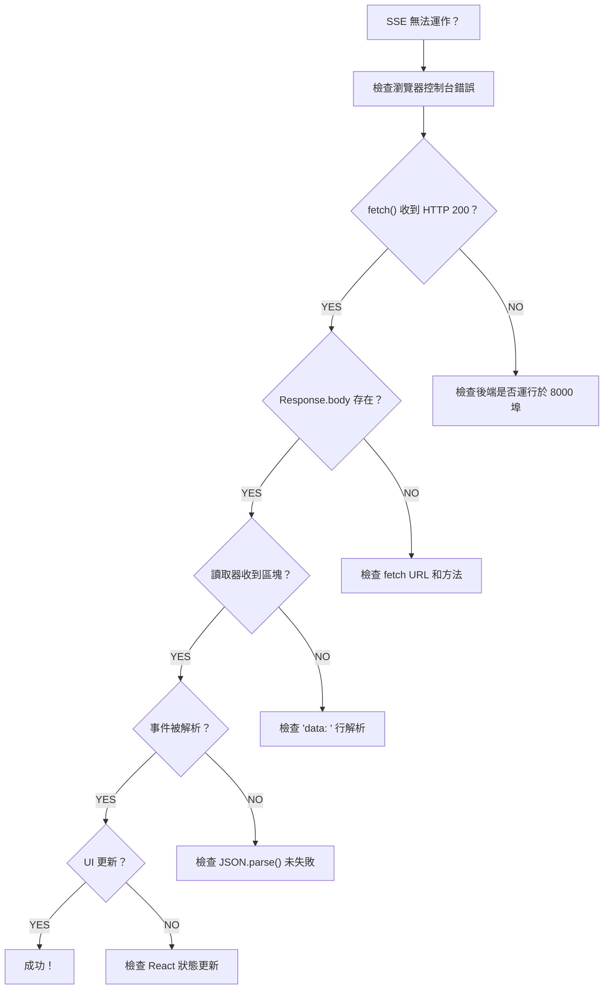

# 教學 31：React Vite ADK 整合 - 使用 AG-UI 協定的自訂 UI (React Vite ADK Integration - Custom UI with AG-UI Protocol)

**預估閱讀時間**：60-70 分鐘
**難度等級**：中級
**先備知識**：教學 29 (UI 整合簡介)、教學 30 (Next.js + ADK)、React 基礎知識

---

## 目錄

1. [概述](#overview)
2. [為什麼選擇 Vite 進行 ADK 整合？](#why-vite-for-adk-integration)
3. [快速開始 (5 分鐘)](#quick-start-5-minutes)
4. [建構數據分析儀表板](#building-a-data-analysis-dashboard)
5. [進階功能](#advanced-features)
6. [生產環境部署](#production-deployment)
7. [Vite vs Next.js 比較](#vite-vs-nextjs-comparison)
8. [故障排除](#troubleshooting)
9. [下一步](#next-steps)
10. [程式碼實現 (Code Implementation)](#code-implementation)

---

## 概述 (Overview)

### 你將建立什麼 (What You'll Build)

在本教學中，你將使用以下技術建立一個 **即時數據分析儀表板**：

- **React 18** (使用 Vite) + **TypeScript**
- **自訂 UI** (不使用 CopilotKit - 手動 SSE 串流)
- **AG-UI 協定** (ag_ui_adk 中介軟體)
- **Google ADK** (具備 pandas 工具的 Agent 後端)
- **Gemini 2.0 Flash Exp** (LLM)
- **Chart.js** + **react-chartjs-2** (互動式視覺化)
- **react-markdown** (具有語法高亮顯示的豐富文字渲染)

### 最終成果 (Final Result)



### 資料流程架構 (Data Flow Architecture)



### 教學目標 (Tutorial Goals)

✅ 不使用 CopilotKit 建構自訂 React 前端

✅ 使用 fetch() API 實作 SSE 串流

✅ 解析並處理 AG-UI 協定事件

✅ 建立具備 pandas 工具的數據分析 agent

✅ 從 TOOL_CALL_RESULT 事件渲染圖表

✅ 建立固定側邊欄 UI 模式以獲得更好的 UX

✅ 處理檔案上傳和 CSV 處理

✅ 部署到生產環境 (Netlify + Cloud Run)

---

## 為什麼選擇 Vite 進行 ADK 整合？ (Why Vite for ADK Integration?)

### Vite 優勢 (Vite Advantages)

| 功能 | 好處 |
| :--- | :--- |
| **⚡ 即時伺服器啟動** | 次秒級冷啟動 vs Next.js `3-5s` |
| **🔥 極速 HMR** | 更新時間 <50ms，無需頁面重新整理 |
| **📦 最佳化建置** | 更小的 bundle 大小 (Next.js 的 50-70%) |
| **🎯 簡單配置** | 單一 vite.config.js vs Next.js 複雜性 |
| **🚀 快速 CI/CD** | 2x-5x 更快的建置時間 |

### 何時選擇 Vite (When to Choose Vite)

當你需要以下情況時**選擇 Vite**：

- 🏃 快速原型設計和開發
- 📱 單頁應用程式 (SPAs)
- 🎨 互動式儀表板和工具
- 💰 較小的 bundle 大小
- ⚙️ 簡單部署 (靜態託管)

當你需要以下情況時**選擇 Next.js**：

- 🔍 SEO 最佳化 (伺服器端渲染)
- 📄 使用 App Router 的多頁路由
- 🌐 Edge functions 和中介軟體
- 📊 複雜的伺服器端邏輯
- 🏢 企業級功能 (ISR 等)

### 端到端數據流 (End-to-End Data Flow)




### SSE 串流工作流程 (SSE Streaming Workflow)



**與 Next.js 的主要區別**：

- Vite 使用 **代理配置 (proxy configuration)** 而不是 API 路由
- 後端分開運作 (與 Next.js 模式相同)
- 前端是純 SPA (無伺服器端渲染)

---

## 快速開始 (5 分鐘) (Quick Start (5 Minutes))

### 步驟 1：建立 Vite 專案 (Create Vite Project)

```bash
# 建立 Vite + React + TypeScript 專案
npm create vite@latest data-dashboard -- --template react-ts

cd data-dashboard

# 安裝視覺化和 markdown 函式庫
npm install chart.js react-chartjs-2
npm install react-markdown remark-gfm rehype-highlight rehype-raw
npm install highlight.js

npm install
```

### 步驟 2：配置 Vite (簡單配置) (Configure Vite (Simple Config))

更新 `vite.config.ts`：

```typescript
import { defineConfig } from "vite";
import react from "@vitejs/plugin-react";

// https://vitejs.dev/config/
export default defineConfig({
  plugins: [react()],
  server: {
    port: 5173,
    // 無需代理 - 直接連線到後端
    // 注意：原文範例可能有誤，這裡如果不需要代理，通常不需要 server.proxy 配置。
    // 但如果想避免 CORS 問題，可以配置代理：
    // proxy: {
    //   "/api": {
    //     target: "http://localhost:8000",
    //     changeOrigin: true,
    //     rewrite: (path) => path.replace(/^\/api/, ""),
    //   },
    // },
  },
});
```

**這做了什麼**：

- 請求 `http://localhost:5173/api/copilotkit` → `http://localhost:8000/copilotkit` (如果有配置代理)
- 在開發期間避免 CORS 問題
- 清晰的關注點分離

### 步驟 3：建立數據分析 Agent (Create Data Analysis Agent)

建立 `agent/agent.py`：

```python
"""
具備 pandas 工具的數據分析 ADK agent。
Data analysis ADK agent with pandas tools.
"""

import os
import io
import json
import pandas as pd
from typing import Dict, List, Any, Optional
from dotenv import load_dotenv
from fastapi import FastAPI
from fastapi.middleware.cors import CORSMiddleware
import uvicorn

# AG-UI ADK 整合匯入
from ag_ui_adk import ADKAgent, add_adk_fastapi_endpoint

# Google ADK 匯入
from google.adk.agents import Agent

load_dotenv()

# 記憶體內數據儲存 (生產環境請使用 Redis/DB)
uploaded_data = {}

def load_csv_data(file_name: str, csv_content: str) -> Dict[str, Any]:
    """
    載入 CSV 數據到記憶體進行分析。
    Load CSV data into memory for analysis.

    Args:
        file_name: CSV 檔案名稱
        csv_content: CSV 檔案內容字串

    Returns:
        包含數據集資訊和預覽的字典
    """
    try:
        # 解析 CSV
        df = pd.read_csv(io.StringIO(csv_content))

        # 儲存到記憶體
        uploaded_data[file_name] = df

        # 回傳摘要
        return {
            "status": "success",
            "file_name": file_name,
            "rows": len(df),
            "columns": list(df.columns),
            "preview": df.head(5).to_dict(orient='records'),
            "dtypes": df.dtypes.astype(str).to_dict()
        }
    except Exception as e:
        return {
            "status": "error",
            "error": str(e)
        }

def analyze_data(
    file_name: str,
    analysis_type: str,
    columns: List[str] = None
) -> Dict[str, Any]:
    """
    對已載入的數據集執行分析。
    Perform analysis on loaded dataset.

    Args:
        file_name: 要分析的數據集名稱
        analysis_type: 分析類型 (summary, correlation, trend)
        columns: 可選的欄位列表

    Returns:
        包含分析結果的字典
    """
    if file_name not in uploaded_data:
        return {"status": "error", "error": f"Dataset {file_name} not found"}

    df = uploaded_data[file_name]

    if columns:
        df = df[columns]

    results = {
        "status": "success",
        "file_name": file_name,
        "analysis_type": analysis_type
    }

    if analysis_type == "summary":
        results["data"] = {
            "describe": df.describe().to_dict(),
            "missing": df.isnull().sum().to_dict(),
            "unique": df.nunique().to_dict()
        }

    elif analysis_type == "correlation":
        # 僅數值欄位
        numeric_df = df.select_dtypes(include=['number'])
        results["data"] = numeric_df.corr().to_dict()

    elif analysis_type == "trend":
        # 時間序列分析
        if len(df) > 0:
            numeric_df = df.select_dtypes(include=['number'])
            results["data"] = {
                "mean": numeric_df.mean().to_dict(),
                "trend": "upward" if numeric_df.iloc[-1].sum() > numeric_df.iloc[0].sum() else "downward"
            }

    return results

def create_chart(
    file_name: str,
    chart_type: str,
    x_column: str,
    y_column: str
) -> Dict[str, Any]:
    """
    產生視覺化圖表數據。
    Generate chart data for visualization.

    Args:
        file_name: 數據集名稱
        chart_type: 圖表類型 (line, bar, scatter)
        x_column: X 軸欄位
        y_column: Y 軸欄位

    Returns:
        包含圖表配置的字典
    """
    if file_name not in uploaded_data:
        return {"status": "error", "error": f"Dataset {file_name} not found"}

    df = uploaded_data[file_name]

    if x_column not in df.columns or y_column not in df.columns:
        return {"status": "error", "error": "Invalid columns"}

    # 準備圖表數據
    chart_data = {
        "status": "success",
        "chart_type": chart_type,
        "data": {
            "labels": df[x_column].tolist(),
            "values": df[y_column].tolist()
        },
        "options": {
            "x_label": x_column,
            "y_label": y_column,
            "title": f"{y_column} vs {x_column}"
        }
    }

    return chart_data

# 使用新的 API 建立 ADK agent
adk_agent = Agent(
    name="data_analyst",
    model="gemini-2.5-flash",  # 或 "gemini-2.0-flash-exp"
    instruction="""你是一位數據分析專家助理。

    你的能力：
    - 使用 load_csv_data() 載入並分析 CSV 數據集
    - 使用 analyze_data() 執行統計分析
    - 產生洞察和趨勢
    - 使用 create_chart() 建立視覺化圖表

    準則：
    - 如果尚未載入數據，請務必先載入
    - 使用 markdown 格式清楚解釋你的分析
    - 建議相關的視覺化圖表
    - 用 **粗體** 文字強調關鍵洞察
    - 適當使用統計術語

    分析數據時：
    1. 先了解數據集結構
    2. 執行適當的分析 (摘要、相關性或趨勢)
    3. 如果有幫助，產生視覺化圖表
    4. 提供可執行的洞察

    解釋要簡潔但徹底。""",
    tools=[load_csv_data, analyze_data, create_chart]
)

# 使用 AG-UI 中介軟體包裝 ADK agent
agent = ADKAgent(
    adk_agent=adk_agent,
    app_name="data_analysis_app",
    user_id="demo_user",
    session_timeout_seconds=3600,
    use_in_memory_services=True
)

# 建立 FastAPI 應用程式
app = FastAPI(title="Data Analysis Agent API")

# 為前端新增 CORS 中介軟體
app.add_middleware(
    CORSMiddleware,
    allow_origins=["http://localhost:5173", "http://localhost:3000"],
    allow_credentials=True,
    allow_methods=["*"],
    allow_headers=["*"],
)

# 為 CopilotKit 新增 ADK 端點
add_adk_fastapi_endpoint(app, agent, path="/api/copilotkit")

# 健康檢查端點
@app.get("/health")
def health_check():
    """健康檢查端點。"""
    return {
        "status": "healthy",
        "agent": "data_analyst",
        "datasets_loaded": list(uploaded_data.keys())
    }

# 執行指令: uvicorn agent:app --reload --port 8000
if __name__ == "__main__":
    port = int(os.getenv("PORT", "8000"))
    uvicorn.run(
        "agent:app",
        host="0.0.0.0",
        port=port,
        reload=True
    )
```

建立 `agent/requirements.txt`：

```text
google-genai>=1.15.0
fastapi>=0.115.0
uvicorn[standard]>=0.30.0
ag_ui_adk>=0.1.0
python-dotenv>=1.0.0
pandas>=2.0.0
```

建立 `agent/.env`：

```bash
GOOGLE_API_KEY=your_gemini_api_key_here
```

### 步驟 4：建立自訂 React 前端 (Create Custom React Frontend)

### 檔案上傳與處理工作流程 (File Upload and Processing Workflow)



使用自訂 SSE 串流更新 `src/App.tsx`：

```typescript
import { useState } from 'react'
import ReactMarkdown from 'react-markdown'
import { Line, Bar, Scatter } from 'react-chartjs-2'
import './App.css'

interface Message {
  role: 'user' | 'assistant'
  content: string
}

interface ChartData {
  chart_type: 'line' | 'bar' | 'scatter'
  data: {
    labels: string[]
    values: number[]
  }
  options: {
    title: string
    x_label: string
    y_label: string
  }
}

function App() {
  const [messages, setMessages] = useState<Message[]>([])
  const [input, setInput] = useState('')
  const [isLoading, setIsLoading] = useState(false)
  const [currentChart, setCurrentChart] = useState<ChartData | null>(null)

  const handleFileUpload = async (event: React.ChangeEvent<HTMLInputElement>) => {
    const file = event.target.files?.[0]
    if (!file) return

    const reader = new FileReader()
    reader.onload = async (e) => {
      const content = e.target?.result as string

      // 透過手動 SSE 串流傳送檔案給 agent
      // Send file to agent via manual SSE streaming
      await sendMessage(`Load this CSV file named "${file.name}":\n\n${content}`)
    }
    reader.readAsText(file)
  }

  const sendMessage = async (messageContent: string) => {
    const userMessage: Message = { role: 'user', content: messageContent }
    setMessages(prev => [...prev, userMessage])
    setInput('')
    setIsLoading(true)

    try {
      // 帶有 SSE 的手動 fetch 到 AG-UI 端點
      // Manual fetch to AG-UI endpoint with SSE
      const response = await fetch('http://localhost:8000/api/copilotkit', {
        method: 'POST',
        headers: { 'Content-Type': 'application/json' },
        body: JSON.stringify({
          messages: [...messages, userMessage],
          agent: 'data_analyst'
        })
      })

      const reader = response.body?.getReader()
      const decoder = new TextDecoder()
      let assistantMessage = ''

      while (true) {
        const { done, value } = await reader!.read()
        if (done) break

        const chunk = decoder.decode(value)
        const lines = chunk.split('\n')

        for (const line of lines) {
          if (line.startsWith('data: ')) {
            const jsonStr = line.slice(6)
            try {
              const jsonData = JSON.parse(jsonStr)

              // 處理不同的 AG-UI 事件類型
              // Handle different AG-UI event types
              if (jsonData.type === 'TEXT_MESSAGE_CONTENT') {
                assistantMessage += jsonData.content
                setMessages(prev => [
                  ...prev.slice(0, -1),
                  { role: 'assistant', content: assistantMessage }
                ])
              } else if (jsonData.type === 'TOOL_CALL_RESULT') {
                // 從工具結果中提取圖表數據
                // Extract chart data from tool result
                const resultContent = typeof jsonData.content === 'string'
                  ? JSON.parse(jsonData.content)
                  : jsonData.content

                if (resultContent && resultContent.chart_type) {
                  setCurrentChart(resultContent)
                }
              }
            } catch (e) {
              // 略過無效的 JSON
              // Skip invalid JSON
            }
          }
        }
      }
    } catch (error) {
      console.error('Error:', error)
      setMessages(prev => [
        ...prev,
        { role: 'assistant', content: 'Error: Could not get response from server.' }
      ])
    } finally {
      setIsLoading(false)
    }
  }

  return (
    <div className="app-container">
      <div className="dashboard">
        <header className="header">
          <h1>📊 Data Analysis Dashboard</h1>
          <p>Upload CSV data and ask questions to get insights</p>
        </header>

        {/* 檔案上傳 */}
        <div className="upload-section">
          <label htmlFor="file-upload" className="upload-button">
            📁 Drop CSV files here or browse
          </label>
          <input
            id="file-upload"
            type="file"
            accept=".csv"
            onChange={handleFileUpload}
            style={{ display: 'none' }}
          />
        </div>

        {/* 自訂聊天介面 */}
        <div className="chat-container">
          {messages.map((msg, i) => (
            <div key={i} className={`message ${msg.role}`}>
              <ReactMarkdown>{msg.content}</ReactMarkdown>
            </div>
          ))}
          {isLoading && <div className="loading">Thinking...</div>}
        </div>

        {/* 輸入 */}
        <div className="input-container">
          <input
            value={input}
            onChange={(e) => setInput(e.target.value)}
            onKeyPress={(e) => e.key === 'Enter' && sendMessage(input)}
            placeholder="Ask about your data..."
            disabled={isLoading}
          />
          <button onClick={() => sendMessage(input)} disabled={isLoading}>
            Send
          </button>
        </div>
      </div>

      {/* 用於圖表的固定側邊欄 */}
      {currentChart && (
        <aside className="chart-sidebar">
          <button onClick={() => setCurrentChart(null)}>✕</button>
          {currentChart.chart_type === 'line' && (
            <Line data={/* format chart data */} />
          )}
          {currentChart.chart_type === 'bar' && (
            <Bar data={/* format chart data */} />
          )}
          {currentChart.chart_type === 'scatter' && (
            <Scatter data={/* format chart data */} />
          )}
        </aside>
      )}
    </div>
  )
}

export default App
```

更新 `src/App.css`：

```css
.app-container {
  min-height: 100vh;
  background: linear-gradient(135deg, #667eea 0%, #764ba2 100%);
  padding: 2rem;
}

.dashboard {
  max-width: 1200px;
  margin: 0 auto;
}

.header {
  text-align: center;
  color: white;
  margin-bottom: 2rem;
}

.header h1 {
  font-size: 3rem;
  margin-bottom: 0.5rem;
}

.header p {
  font-size: 1.2rem;
  opacity: 0.9;
}

.upload-section {
  background: white;
  padding: 2rem;
  border-radius: 12px;
  margin-bottom: 2rem;
  text-align: center;
  box-shadow: 0 10px 30px rgba(0, 0, 0, 0.2);
}

.upload-button {
  display: inline-block;
  padding: 1rem 2rem;
  background: #667eea;
  color: white;
  border-radius: 8px;
  cursor: pointer;
  font-weight: 600;
  transition: all 0.3s ease;
}

.upload-button:hover {
  background: #764ba2;
  transform: translateY(-2px);
  box-shadow: 0 5px 15px rgba(0, 0, 0, 0.3);
}

.file-name {
  margin-left: 1rem;
  color: #28a745;
  font-weight: 600;
}

.chat-container {
  background: white;
  border-radius: 12px;
  overflow: hidden;
  box-shadow: 0 10px 30px rgba(0, 0, 0, 0.2);
  height: 600px;
}
```

### 步驟 5：執行所有內容 (Run Everything)

```bash
# 終端機 1：執行 agent
cd agent
python -m venv venv
source venv/bin/activate  # Windows: venv\Scripts\activate
pip install -r requirements.txt
python agent.py

# 終端機 2：執行 Vite 前端
cd ..
npm run dev
```

**開啟 http://localhost:5173** - 你的數據分析儀表板已上線！ 🎉

**試試看**：

1. 上傳 CSV 檔案 (銷售數據等)
2. 詢問：「關鍵統計數據是什麼？」
3. 詢問：「顯示銷售隨時間變化的圖表」
4. 觀看 agent 分析並視覺化你的數據！

---

## 建構數據分析儀表板 (Building a Data Analysis Dashboard)

讓我們使用真實數據視覺化增強我們的儀表板。

### 功能 1：互動式圖表 (Feature 1: Interactive Charts)

安裝 Chart.js：

```bash
npm install chart.js react-chartjs-2
```

建立 `src/components/ChartRenderer.tsx`：

```typescript
import { Line, Bar, Scatter } from 'react-chartjs-2'
import {
  Chart as ChartJS,
  CategoryScale,
  LinearScale,
  PointElement,
  LineElement,
  BarElement,
  Title,
  Tooltip,
  Legend,
} from 'chart.js'

// 註冊 Chart.js 元件
// Register Chart.js components
ChartJS.register(
  CategoryScale,
  LinearScale,
  PointElement,
  LineElement,
  BarElement,
  Title,
  Tooltip,
  Legend
)

interface ChartData {
  chart_type: string
  data: {
    labels: string[]
    values: number[]
  }
  options: {
    x_label: string
    y_label: string
    title: string
  }
}

interface ChartRendererProps {
  chartData: ChartData
}

export function ChartRenderer({ chartData }: ChartRendererProps) {
  const data = {
    labels: chartData.data.labels,
    datasets: [
      {
        label: chartData.options.y_label,
        data: chartData.data.values,
        backgroundColor: 'rgba(102, 126, 234, 0.5)',
        borderColor: 'rgba(102, 126, 234, 1)',
        borderWidth: 2,
      },
    ],
  }

  const options = {
    responsive: true,
    plugins: {
      legend: {
        position: 'top' as const,
      },
      title: {
        display: true,
        text: chartData.options.title,
      },
    },
    scales: {
      x: {
        title: {
          display: true,
          text: chartData.options.x_label,
        },
      },
      y: {
        title: {
          display: true,
          text: chartData.options.y_label,
        },
      },
    },
  }

  // 渲染適當的圖表類型
  // Render appropriate chart type
  switch (chartData.chart_type) {
    case 'line':
      return <Line data={data} options={options} />
    case 'bar':
      return <Bar data={data} options={options} />
    case 'scatter':
      return <Scatter data={data} options={options} />
    default:
      return <div>Unsupported chart type: {chartData.chart_type}</div>
  }
}
```

### 功能 2：從 TOOL_CALL_RESULT 事件渲染圖表 (Feature 2: Chart Rendering from TOOL_CALL_RESULT Events)

自訂實作從 AG-UI 協定事件中提取圖表數據：

```typescript
// 在 SSE 串流迴圈中 (來自 App.tsx)
// In the SSE streaming loop (from App.tsx)
for (const line of lines) {
  if (line.startsWith('data: ')) {
    const jsonStr = line.slice(6)
    try {
      const jsonData = JSON.parse(jsonStr)

      // 從 TOOL_CALL_RESULT 事件中提取圖表數據
      // Extract chart data from TOOL_CALL_RESULT events
      if (jsonData.type === 'TOOL_CALL_RESULT') {
        const resultContent = typeof jsonData.content === 'string'
          ? JSON.parse(jsonData.content)
          : jsonData.content

        // 檢查是否為圖表數據
        // Check if this is chart data
        if (resultContent && resultContent.chart_type) {
          setCurrentChart(resultContent)
        }
      }
    } catch (e) {
      // 略過無效的 JSON
      // Skip invalid JSON
    }
  }
}
```

### TOOL_CALL_RESULT 處理流程 (TOOL_CALL_RESULT Processing Flow)



**關鍵點：**
- Agent 呼叫 `create_chart()` 工具
- 後端透過 `TOOL_CALL_RESULT` 事件回傳圖表數據
- 前端提取並將圖表數據儲存在狀態中
- 圖表在固定側邊欄中使用 Chart.js 元件渲染
- 不需要生成式 UI 框架 - 直接狀態管理！ 📊

### 功能 3：數據表格視圖 (Feature 3: Data Table View)

建立 `src/components/DataTable.tsx`：

```typescript
interface DataTableProps {
  data: Array<Record<string, any>>
  columns: string[]
}

export function DataTable({ data, columns }: DataTableProps) {
  return (
    <div className="data-table-container">
      <table className="data-table">
        <thead>
          <tr>
            {columns.map((col) => (
              <th key={col}>{col}</th>
            ))}
          </tr>
        </thead>
        <tbody>
          {data.map((row, idx) => (
            <tr key={idx}>
              {columns.map((col) => (
                <td key={col}>{row[col]}</td>
              ))}
            </tr>
          ))}
        </tbody>
      </table>
    </div>
  )
}
```

在 `src/App.css` 中新增 CSS：

```css
.data-table-container {
  max-height: 400px;
  overflow: auto;
  margin: 1rem 0;
  border-radius: 8px;
  border: 1px solid #e0e0e0;
}

.data-table {
  width: 100%;
  border-collapse: collapse;
}

.data-table thead {
  background: #667eea;
  color: white;
  position: sticky;
  top: 0;
}

.data-table th,
.data-table td {
  padding: 0.75rem;
  text-align: left;
  border-bottom: 1px solid #e0e0e0;
}

.data-table tbody tr:hover {
  background: #f5f5f5;
}
```

### 功能 4：匯出分析報告 (Feature 4: Export Analysis Report)

新增匯出功能：

```typescript
const exportAnalysis = () => {
  // 收集所有分析結果
  // Collect all analysis results
  const report = {
    timestamp: new Date().toISOString(),
    file: uploadedFile,
    analysis: "... collected from agent responses ...",
    charts: "... chart configurations ..."
  }

  // 轉換為 JSON
  // Convert to JSON
  const blob = new Blob([JSON.stringify(report, null, 2)], {
    type: 'application/json'
  })

  // 下載
  // Download
  const url = URL.createObjectURL(blob)
  const a = document.createElement('a')
  a.href = url
  a.download = `analysis_${Date.now()}.json`
  a.click()
  URL.revokeObjectURL(url)
}

// 新增按鈕到 UI
// Add button to UI
<button onClick={exportAnalysis} className="export-button">
  📥 Export Report
</button>
```

---

## 進階功能 (Advanced Features)

### 功能 1：即時協作 (Feature 1: Real-Time Collaboration)

與 agent 分享儀表板狀態：

```typescript
function App() {
  const [sharedState, setSharedState] = useState({
    uploadedFiles: [],
    currentAnalysis: null,
    activeDataset: null,
  });

  // 在訊息中包含狀態作為 agent 上下文
  // Include state in messages for agent context
  const sendMessageWithContext = async (userMessage: string) => {
    const contextMessage = {
      role: 'system',
      content: `Current state: ${JSON.stringify(sharedState)}`
    }

    const response = await fetch('http://localhost:8000/api/copilotkit', {
      method: 'POST',
      body: JSON.stringify({
        messages: [contextMessage, ...messages, { role: 'user', content: userMessage }],
        agent: 'data_analyst'
      })
    })
    // ... handle response
  }
}
```

**無需特殊 hooks** - 只需將狀態包含在訊息歷史中！

### 功能 2：分析歷史持久化 (Feature 2: Analysis History Persistence)

使用 localStorage 持久化分析歷史：

```typescript
const [analysisHistory, setAnalysisHistory] = useState<Analysis[]>(() => {
  // 掛載時從 localStorage 載入
  // Load from localStorage on mount
  const saved = localStorage.getItem('analysis_history')
  return saved ? JSON.parse(saved) : []
});

// 當歷史變更時儲存到 localStorage
// Save to localStorage whenever history changes
useEffect(() => {
  localStorage.setItem('analysis_history', JSON.stringify(analysisHistory))
}, [analysisHistory])

// 新增分析到歷史
// Add analysis to history
const saveAnalysis = (analysis: Analysis) => {
  setAnalysisHistory((prev) => [...prev, analysis])
}

// Agent 不需要特殊 hooks - 只需將歷史包含在訊息中：
// Agent doesn't need special hooks - just include history in messages:
const messagesWithHistory = [
  {
    role: 'system',
    content: `Previous analyses: ${JSON.stringify(analysisHistory)}`
  },
  ...messages
]
```

**關鍵區別：** 無需特殊的 agent 記憶體框架 - 使用標準 React 模式！

### 功能 3：多檔案分析 (Feature 3: Multi-File Analysis)

比較多個數據集：

```python
# In agent.py
def compare_datasets(
    file_names: List[str],
    metric: str
) -> Dict[str, Any]:
    """比較多個數據集的指標。"""
    comparison = {}

    for name in file_names:
        if name in uploaded_data:
            df = uploaded_data[name]
            if metric in df.columns:
                comparison[name] = df[metric].mean()

    return {
        "status": "success",
        "comparison": comparison,
        "winner": max(comparison, key=comparison.get) if comparison else None
    }
```

---

## 生產環境部署 (Production Deployment)

### 部署架構比較 (Deployment Architecture Comparison)

**開發設置：**
```txt
Browser (5173) ←─── Proxy ────→ FastAPI (8000)
     ↓                        ↓
   Vite Dev                 ADK Agent
   Server                   + AG-UI
```

**生產環境設置：**
```txt
Browser ←─── HTTPS ────→ Netlify/Vercel ←─── HTTPS ────→ Cloud Run
                              ↓                        ↓
                         Static Files              ADK Agent
                                                    + AG-UI
```

### 選項 1：部署到 Netlify (Option 1: Deploy to Netlify)

**部署工作流程：**


**步驟 1：建置前端 (Build Frontend)**

```bash
# 建立生產環境建置
npm run build

# 輸出在 dist/ 目錄
```

**步驟 2：部署 Agent 到 Cloud Run (Deploy Agent to Cloud Run)**

```bash
# 部署 agent (與教學 30 相同)
cd agent
gcloud run deploy data-analysis-agent \
  --source=. \
  --region=us-central1 \
  --allow-unauthenticated \
  --set-env-vars="GOOGLE_API_KEY=your_key"

# 取得 URL: https://data-analysis-agent-xyz.run.app
```

**步驟 3：更新前端以供生產使用 (Update Frontend for Production)**

建立 `src/config.ts`：

```typescript
export const API_URL = import.meta.env.PROD
  ? "https://data-analysis-agent-xyz.run.app"
  : "http://localhost:8000";
```

更新 `src/App.tsx`：

```typescript
import { API_URL } from './config'

// 在 fetch 呼叫中使用
const response = await fetch(`${API_URL}/api/copilotkit`, {
  method: 'POST',
  // ... rest of config
})
```

**步驟 4：部署到 Netlify (Deploy to Netlify)**

```bash
# 安裝 Netlify CLI
npm install -g netlify-cli

# 登入
netlify login

# 部署
netlify deploy --prod --dir=dist

# 或連接 GitHub repo 自動部署
netlify init
```

**完成！** 你的應用程式已上線於 `https://data-dashboard-xyz.netlify.app` 🚀

---

### 選項 2：部署到 Vercel (Option 2: Deploy to Vercel)

```bash
# 安裝 Vercel CLI
npm install -g vercel

# 部署
vercel

# 設定環境變數
vercel env add VITE_API_URL production
# 輸入: https://data-analysis-agent-xyz.run.app

# 重新部署並套用 env
vercel --prod
```

**完成！** 你的應用程式已上線於 `https://data-dashboard.vercel.app` 🎉

---

## Vite vs Next.js 比較 (Vite vs Next.js Comparison)

### 開發體驗 (Development Experience)

| 方面 | Vite | Next.js 15 |
| :--- | :--- | :--- |
| **冷啟動** | <1s | 3-5s |
| **HMR 速度** | <50ms | 200-500ms |
| **建置時間** | 10-30s | 30-120s |
| **Bundle 大小** | 100-200KB | 200-400KB |
| **配置** | 簡單 | 複雜 |

### 功能比較 (Feature Comparison)

| 功能 | Vite | Next.js 15 |
| :--- | :--- | :--- |
| **SPA 支援** | ✅ 原生 | ✅ 透過匯出 |
| **SSR** | ⚠️ 手動 (Vite SSR) | ✅ 內建 |
| **API 路由** | ❌ 僅代理 | ✅ 完整支援 |
| **檔案路由** | ❌ 手動 | ✅ 內建 |
| **圖片最佳化** | ❌ 手動 | ✅ 內建 |
| **中介軟體(Middleware)** | ❌ 無 | ✅ Edge runtime |
| **靜態匯出(Static Export)** | ✅ 原生 | ✅ 內建 |
| **熱重載(Hot Reload)** | ✅ 極快 | ✅ 良好 |

### 何時使用各項技術 (When to Use Each)

**使用 Vite** 於：

- ⚡ 原型和 MVPs
- 🎨 儀表板和管理面板
- 📊 數據視覺化工具
- 🔧 內部工具
- 📱 無 SEO 需求的 SPA
- 🚀 需要快速迭代

**使用 Next.js** 於：

- 🔍 SEO 關鍵網站
- 📄 多頁網站
- 🌐 公開應用程式
- 🏢 企業應用程式
- 📊 複雜路由需求
- 🔐 伺服器端驗證

### 程式碼比較 (Code Comparison)

**Vite + 自訂 React** (教學 31)：

```typescript
// 單一 App.tsx 檔案，完全控制
// 手動 SSE 串流使用 fetch()
// 自訂 UI 元件
// 直接狀態管理
// 完整聊天介面約 ~200 行程式碼

const response = await fetch('http://localhost:8000/api/copilotkit', {
  method: 'POST',
  body: JSON.stringify({ messages, agent: 'data_analyst' })
})
// 手動解析 SSE 事件，提取 TOOL_CALL_RESULT，渲染圖表
```

**Next.js + CopilotKit** (教學 30)：

```typescript
// app/layout.tsx - CopilotKit wrapper
// app/page.tsx - Main page with <CopilotChat />
// app/api/copilotkit/route.ts - API route handler

// 預建元件，較少程式碼，較少控制
import { CopilotKit } from "@copilotkit/react-core"
<CopilotKit runtimeUrl="/api/copilotkit">
  <CopilotChat /> {/* ~10 行用於基本聊天 */}
</CopilotKit>
```

### 開發框架比較 (Implementation Comparison Diagram)

| 功能類別 (Feature Category) | Vite + 自訂 React (Vite + Custom React) | Next.js + CopilotKit |
| :--- | :--- | :--- |
| **程式碼量 (Code Volume)** | 高 (High) (200+ 行) | 低 (Low) (10-50 行) |
| **UI 控制權 (UI Control)** | 完全控制 (Full control) | 受限於 CopilotKit (Limited to CopilotKit) |
| **UX 靈活性 (UX Flexibility)** | 自訂 (Custom) (固定側邊欄！) | 標準聊天 UI (Standard chat UI) |
| **學習曲線 (Learning Curve)** | 較高 (Higher) (手動串流) | 較低 (Lower) (預先建置) |
| **Bundle 大小 (Bundle Size)** | 較小 (Smaller) (無框架) | 較大 (Larger) (有框架) |
| **開發速度 (Development Speed)** | 初始較慢 (Slower initial) | 初始較快 (Faster initial) |
| **維護 (Maintenance)** | 較複雜 (More complex) | 較簡單 (Simpler) |
| **客製化程度 (Customization)** | 無限制 (Unlimited) | 有限 (Limited) |
| **效能 (Performance)** | 更好 (Better) (無框架) | 良好 (Good) |
| **部署 (Deployment)** | 靜態託管 (Static hosting) | 需要伺服器 (Server required) |

```

**Next.js + CopilotKit** (Tutorial 30):

```typescript
// app/layout.tsx - CopilotKit wrapper
// app/page.tsx - Main page with <CopilotChat />
// app/api/copilotkit/route.ts - API route handler

// Pre-built components, less code, less control
import { CopilotKit } from "@copilotkit/react-core"
<CopilotKit runtimeUrl="/api/copilotkit">
  <CopilotChat /> {/* ~10 lines for basic chat */}
</CopilotKit>
```

**權衡：**
- 自訂 React：更多程式碼，完全控制，自訂 UX (固定側邊欄！)
- CopilotKit：更少程式碼，標準 UX，建構更快

---

## 故障排除 (Troubleshooting)

### SSE 串流除錯流程 (SSE Streaming Debug Flow)



### 問題 1：SSE 串流無法運作 (Issue 1: SSE Streaming Not Working)

**症狀**：

- Agent 沒有回應
- 訊息看似發送但沒有回覆
- 瀏覽器控制台沒有顯示錯誤

**解決方案**：

```typescript
// 檢查 fetch() 配置是否正確
const response = await fetch('http://localhost:8000/api/copilotkit', {
  method: 'POST',
  headers: {
    'Content-Type': 'application/json',
  },
  body: JSON.stringify({
    messages: [...messages, userMessage],
    agent: 'data_analyst'  // 關鍵：必須與後端 agent 名稱相符
  })
})

// 驗證回應是可讀串流
if (!response.body) {
  console.error('Response body is null - check backend')
  return
}

// 檢查回應錯誤
if (!response.ok) {
  console.error(`HTTP ${response.status}: ${response.statusText}`)
  const text = await response.text()
  console.error('Response:', text)
  return
}
```

**除錯步驟：**
1. 檢查後端是否正在執行：`curl http://localhost:8000/health`
2. 驗證 agent 名稱相符：檢查 `agent/agent.py` 中的 `name="data_analyst"`
3. 開啟瀏覽器 DevTools → Network 標籤 → 檢查 `/api/copilotkit` 請求
4. 在執行 `make dev-agent` 的終端機中尋找後端錯誤

---

### 問題 2：生產環境中的 CORS (Issue 2: CORS in Production)

**症狀**：

- 本地運作正常，生產環境失敗
- 瀏覽器控制台顯示 CORS 錯誤

**解決方案**：

```python
# agent/agent.py - 更新生產環境的 CORS
from fastapi.middleware.cors import CORSMiddleware

app.add_middleware(
    CORSMiddleware,
    allow_origins=[
        "https://data-dashboard.netlify.app",  # 你的 Netlify 網域
        "https://data-dashboard.vercel.app",   # 你的 Vercel 網域
        "http://localhost:5173",  # 本地開發
    ],
    allow_credentials=True,
    allow_methods=["*"],
    allow_headers=["*"],
)
```

---

### 問題 3：大檔案上傳問題 (Issue 3: Large File Upload Issues)

**症狀**：

- >1MB 檔案上傳失敗
- 逾時錯誤

**解決方案**：

```python
# agent/agent.py - 增加限制
from fastapi import FastAPI, File, UploadFile

app = FastAPI()

# 增加 body 大小限制
@app.post("/upload")
async def upload_file(file: UploadFile = File(...)):
    # 處理大檔案
    content = await file.read()
    return {"size": len(content)}

# 在 uvicorn 啟動中
uvicorn.run(
    app,
    host="0.0.0.0",
    port=8000,
    limit_concurrency=100,
    limit_max_requests=1000,
    timeout_keep_alive=30
)
```

---

### 問題 4：TOOL_CALL_RESULT 事件未解析 (Issue 4: TOOL_CALL_RESULT Event Not Parsed)

**症狀**：

- Agent 回應但圖表未出現
- 控制台顯示 "Cannot read property 'chart_type' of undefined"

**解決方案**：

```typescript
// 正確的 TOOL_CALL_RESULT 解析
if (jsonData.type === 'TOOL_CALL_RESULT') {
  // 內容可能是字串或物件
  const resultContent = typeof jsonData.content === 'string'
    ? JSON.parse(jsonData.content)  // 如果是字串則解析
    : jsonData.content               // 如果是物件則直接使用

  // 驗證圖表數據結構
  if (resultContent &&
      resultContent.chart_type &&
      resultContent.data &&
      resultContent.data.labels &&
      resultContent.data.values) {
    console.log('Valid chart data:', resultContent)
    setCurrentChart(resultContent)
  } else {
    console.warn('Invalid chart data structure:', resultContent)
  }
}
```

**除錯檢查清單：**
1. 檢查後端 `create_chart` 回傳正確格式
2. 驗證工具結果中的 `status: "success"`
3. 確保 `chart_type` 是 'line', 'bar', 或 'scatter'
4. 確認陣列：`data.labels` (字串), `data.values` (數字)

---

### 問題 5：Chart.js 未註冊 (Issue 5: Chart.js Not Registered)

**症狀**：

- 錯誤："category is not a registered scale"
- 圖表顯示空白畫布

**解決方案**：

```typescript
// 在應用程式啟動時匯入並註冊所有 Chart.js 元件
import {
  Chart as ChartJS,
  CategoryScale,
  LinearScale,
  PointElement,
  LineElement,
  BarElement,
  Title,
  Tooltip,
  Legend,
} from "chart.js";

// 在應用程式初始化時註冊一次 (App.tsx 頂部)
ChartJS.register(
  CategoryScale,
  LinearScale,
  PointElement,
  LineElement,
  BarElement,
  Title,
  Tooltip,
  Legend,
);
```

---

## 下一步 (Next Steps)

### 你已掌握 Vite + ADK！ 🎉 (You've Mastered Vite + ADK! 🎉)

你現在知道如何：

✅ 建立極速的 React + Vite + ADK 應用程式
✅ 建立數據分析儀表板
✅ 使用 Chart.js 實作生成式 UI
✅ 處理檔案上傳和處理
✅ 部署到 Netlify 或 Vercel
✅ 比較 Vite vs Next.js 方法

### 額外資源 (Additional Resources)

- [Vite 文件](https://vitejs.dev/)
- [CopilotKit + Vite 指南](https://docs.copilotkit.ai/guides/vite)
- [Chart.js 文件](https://www.chartjs.org/)
- [範例：gemini-fullstack](https://github.com/google/adk-samples/tree/main/gemini-fullstack)

---

## 程式碼實現 (Code Implementation)

- data-analysis-dashboard：[程式碼連結](../../../python/agents/data-analysis-dashboard/)
