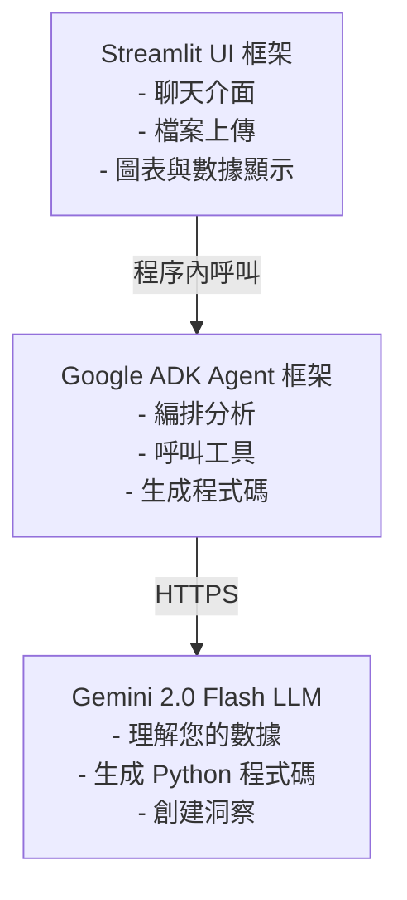
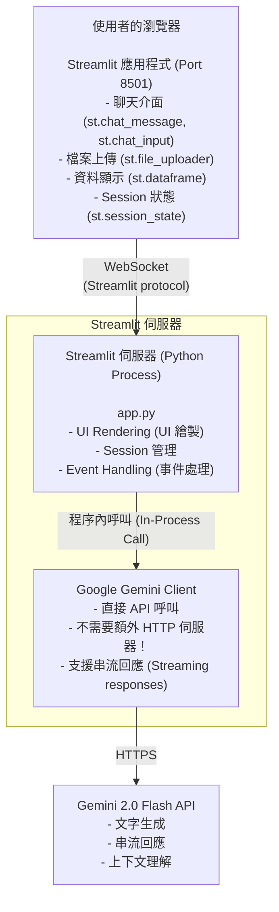
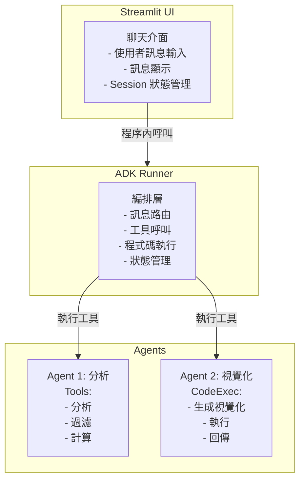
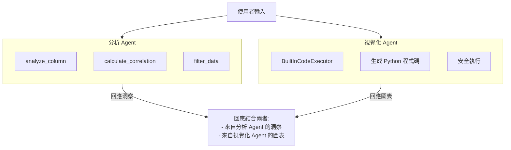

# 教學 32：Streamlit + ADK - 使用純 Python 構建數據分析應用程式 (Streamlit + ADK Integration - Python Data Apps)

**時間**：45 分鐘 | **級別**：中級 | **語言**：僅限 Python

---

## 為什麼這很重要 (Why This Matters)

構建數據應用程式不應該需要學習 JavaScript、React 或管理獨立的前端/後端服務。**Streamlit + ADK** 讓您能夠使用純 Python 構建生產級的數據分析應用程式。

### 您正在解決的問題 (The Problem You're Solving)
**沒有這種方法時：**
- 需要學習 React/Vue/Angular
- 設定 TypeScript
- 管理獨立的後端 API
- 部署兩個服務
- 處理 CORS、驗證等問題
- 需要數週時間才能完成 😫

**使用 Streamlit + ADK：**
- 僅需純 Python
- 程序內 AI Agent (無 HTTP 開銷)
- 單一檔案 = 完整應用程式
- 2 分鐘內部署
- 立即運作 🚀

---
### 您將構建什麼 (What You'll Build)

一個 **數據分析聊天機器人**，它可以：

- 接受 CSV 檔案上傳
- 與您的數據進行自然對話
- 使用 matplotlib/plotly 生成圖表
- 一個指令部署到雲端
- 完全在 Python 中運行

**視覺預覽：**

```
User: "我的前 5 大客戶是誰？"
      ↓
[🔍 處理中... 分析數據...]
      ↓
Bot: "根據您的數據：

      按營收排名的前 5 大客戶：
      1. Acme Corp - $125,000
      2. Tech Inc - $98,500
      ..."
```

## 運作原理 (How It Works)

### 技術堆疊 (The Tech Stack)

三個簡單的部分：



### 為什麼選擇這種方法？ (Why This Approach?)

| 需求 | 解決方案 | 優勢 |
| :--- | :--- | :--- |
| **UI** | Streamlit | 無 HTML/CSS，純 Python |
| **AI 邏輯** | ADK | 無 HTTP 開銷 |
| **LLM** | Gemini | 極快，智慧 |
| **部署** | 單一服務 | 簡單，可靠 |

---

## 開始使用 (5 分鐘) (Getting Started)

### 先決條件 (Prerequisites)

```bash
# 檢查 Python 版本
python --version  # 應為 3.9 或更高版本
```

需要 Google API 金鑰？

1. 訪問 [Google AI Studio](https://makersuite.google.com/app/apikey)
2. 點擊 "Get API key"
3. 複製它 (請妥善保管！)

### 執行範例 (Run the Demo)

```bash
cd tutorial_implementation/tutorial32

# 設定一次
make setup

# 建立設定檔
cp .env.example .env
# 編輯 .env 並貼上您的 API 金鑰

# 啟動
make dev
```

**打開 [http://localhost:8501](http://localhost:8501)** 就完成了！ 🚀

---

## 構建您的應用程式 (Building Your App)

### 最小範例 (The Minimal Example)

這是開始所需的最低限度程式碼 (`app.py`)：

```python
import os
import streamlit as st
import pandas as pd
from google import genai

# 設定
st.set_page_config(page_title="Data Analyzer", page_icon="📊", layout="wide")
client = genai.Client(api_key=os.getenv("GOOGLE_API_KEY"))

# 狀態
if "messages" not in st.session_state:
    st.session_state.messages = []
if "df" not in st.session_state:
    st.session_state.df = None

# UI
st.title("📊 數據分析器")

# 上傳
with st.sidebar:
    file = st.file_uploader("CSV 檔案", type=["csv"])
    if file:
        st.session_state.df = pd.read_csv(file)

# 顯示訊息
for msg in st.session_state.messages:
    with st.chat_message(msg["role"]):
        st.markdown(msg["content"])

# 聊天
if prompt := st.chat_input("詢問有關您的數據..."):
    st.session_state.messages.append({"role": "user", "content": prompt})

    with st.chat_message("user"):
        st.markdown(prompt)

    # 取得回應
    with st.chat_message("assistant"):
        with st.status("分析中...", expanded=False) as status:
            status.write("讀取數據...")

            # 加入數據上下文
            context = f"Dataset: {st.session_state.df.shape[0]} rows, "
            context += f"{st.session_state.df.shape[1]} columns"

            status.write("思考中...")

            response = client.models.generate_content_stream(
                model="gemini-2.0-flash",
                contents=[{"role": "user", "parts": [{"text": context}]}],
            )

            full_text = ""
            for chunk in response:
                if chunk.text:
                    full_text += chunk.text

            status.update(label="完成！", state="complete", expanded=False)

        st.markdown(full_text)
        st.session_state.messages.append({"role": "assistant", "content": full_text})
```

**就是這樣！** 執行 `streamlit run app.py`，您就有一個可運作的數據分析器了。 🎉

---

## 關鍵概念 (Key Concepts)

### 1. Streamlit 快取 (Streamlit Caching)

避免重新計算昂貴的操作：

```python
@st.cache_resource  # 計算一次，永久重複使用
def get_client():
    return genai.Client(api_key=os.getenv("GOOGLE_API_KEY"))

@st.cache_data  # 數據變更時重新計算
def load_csv(uploaded_file):
    return pd.read_csv(uploaded_file)
```

### 2. Session 狀態 (Session State)

儲存跨越重新執行的數據：

```python
# 首次執行時初始化
if "messages" not in st.session_state:
    st.session_state.messages = []

# 在整個應用程式中使用
st.session_state.messages.append({"role": "user", "content": prompt})
```

### 3. 狀態容器 (Status Container)

向使用者顯示進度 (Streamlit 最佳實踐)：

```python
with st.status("處理中...", expanded=False) as status:
    status.write("步驟 1：載入數據")
    # ... 執行工作 ...

    status.write("步驟 2：分析中")
    # ... 更多工作 ...

    status.update(label="完成！", state="complete")
```

---

## 理解架構 (Understanding the Architecture)

### 組件圖 (Component Diagram)



**與 Next.js/Vite 的主要區別：**

| 面向 | Streamlit | Next.js/Vite |
| :--- | :--- | :--- |
| **架構** | 單一 Python 程序 | 前端 + 後端 |
| **通訊** | 程序內函數呼叫 | HTTP/WebSocket |
| **延遲** | ~0ms (程序內) | ~50-100ms (網路) |
| **部署** | 單一服務 | 兩個服務 |
| **複雜度** | 簡單 (1 個檔案) | 中等 (多個檔案) |
| **使用案例** | 數據工具，內部應用程式 | 生產級 Web 應用程式 |

---

### 請求流程 (Request Flow)

#### 1. 使用者上傳 CSV 檔案

```python
# Streamlit 處理檔案上傳
uploaded_file = st.file_uploader("Upload CSV")

# 載入到 pandas
df = pd.read_csv(uploaded_file)

# 儲存在 session state (跨重新執行持久化)
st.session_state.dataframe = df
```

#### 2. 使用者發送訊息「按營收排名的前 5 大客戶是誰？」

#### 3. Streamlit 應用程式

```python
# 構建包含數據集資訊的上下文
context = f"""
Dataset available:
- Columns: {df.columns.tolist()}
- First rows: {df.head(3)}
"""

# 直接呼叫 Gemini (程序內！)
response = client.models.generate_content_stream(
    model="gemini-2.0-flash-exp",
    contents=[...],
    config=GenerateContentConfig(
        system_instruction=f"You are a data analyst. {context}"
    )
)
```

#### 4. Gemini API

```text
系統：你是一位數據分析師。資料集包含欄位：customer, revenue...
使用者：按營收排名的前 5 大客戶是誰？
模型：根據您的數據，前 5 大客戶是：
1. Acme Corp - $125,000
2. Tech Inc - $98,500
...
```

#### 5. 回應串流回傳

```python
# 串流區塊到達時處理
for chunk in response:
    full_response += chunk.text
    message_placeholder.markdown(full_response + "▌")
```

#### 6. 使用者即時看到回應打字效果！ ⚡

---

## 理解 ADK (Agent Development Kit)

這就是 Streamlit + ADK 發光發熱的地方。您可能會問：**「為什麼要使用 ADK 而不是直接呼叫 Gemini？」**

好問題！讓我們來探索架構。

### 直接 API vs ADK 架構

#### 直接 Gemini API (較簡單但受限)

```python
# 我們在上面的請求流程中展示的內容
client = genai.Client(api_key=...)
response = client.models.generate_content(
    model="gemini-2.0-flash",
    contents=[...]
)
```

**優點**：

- ✅ 簡單，直接，最少設定
- ✅ 非常適合基本聊天
- ✅ 完全控制提示

**缺點**：

- ❌ 沒有工具/函數呼叫編排
- ❌ 沒有程式碼執行能力
- ❌ 手動提示工程
- ❌ 沒有可重用的 Agent 模式

#### ADK 架構 (強大且功能更多)

```python
# 使用 ADK Agents
from google.adk.agents import Agent
from google.adk.runners import Runner

# 定義您的 agent 與工具
agent = Agent(
    name="data_analysis_agent",
    model="gemini-2.0-flash",
    tools=[analyze_column, calculate_correlation, filter_data]
)

# 創建 runner 來編排它
runner = Runner(agent=agent, app_name="my_app")

# 在 Streamlit 中執行
async for event in runner.run_async(
    user_id="streamlit_user",
    session_id=session_id,
    new_message=message
):
    # 處理 agent 回應
    process_event(event)
```

**優點**：

- ✅ 自動工具/函數編排
- ✅ 用於動態視覺化的程式碼執行
- ✅ 多 Agent 協作
- ✅ 跨 Session 的狀態管理
- ✅ 錯誤處理和重試
- ✅ 可重用的 Agent 組件

**缺點**：

- ❌ 設定稍多
- ❌ 需要正確結構化 Agents

### 何時使用哪種 (When to Use Each)

| 使用案例 | 方法 | 原因 |
| :--- | :--- | :--- |
| **關於數據的簡單聊天** | 直接 API | 快速，最少設定 |
| **需要工具呼叫** | ADK | 自動編排 |
| **帶工具的數據分析** | ADK | 更好的結構 |
| **動態程式碼執行** | ADK | 支援 BuiltInCodeExecutor |
| **多 Agent 工作流程** | ADK | 多 Agent 路由 |
| **生產級應用程式** | ADK | 更好的錯誤處理 |

**🎯 本教學兩者皆用**：Level 1-2 展示用於學習的直接 API，Level 3+ 展示用於生產模式的 ADK。

### ADK 核心概念 (ADK Core Concepts)

#### 1. Agents

一個 **Agent** 是一個 AI 實體，它可以：

- 理解使用者請求
- 呼叫工具 (您提供的函數)
- 推理結果
- 生成程式碼並執行它

```python
from google.adk.agents import Agent

agent = Agent(
    name="analyzer",
    model="gemini-2.0-flash",
    description="分析數據",
    instruction="你是一位數據分析師。幫助使用者理解他們的數據集。",
    tools=[tool1, tool2, tool3]  # Agent 可以呼叫的函數列表
)
```

#### 2. 工具 (Tools)

**工具** 是 Agents 可以呼叫的 Python 函數：

```python
def analyze_column(column_name: str, analysis_type: str) -> dict:
    """Analyze a specific column."""
    # 您的邏輯在這裡
    return {
        "status": "success",
        "report": "analysis results",
        "data": {...}
    }

# 註冊到 agent
agent = Agent(
    tools=[analyze_column, calculate_correlation, filter_data]
)
```

#### 3. Runners

一個 **Runner** 在 Streamlit 中編排 Agent 執行：

```python
from google.adk.runners import Runner
from google.adk.sessions import InMemorySessionService

session_service = InMemorySessionService()
runner = Runner(
    agent=agent,
    app_name="資料分析助理",
    session_service=session_service
)

# 在 Streamlit 中執行
async for event in runner.run_async(
    user_id="streamlit_user",
    session_id=session_id,
    new_message=message
):
    handle_event(event)
```

#### 4. 程式碼執行 (Code Execution)

ADK 支援 **BuiltInCodeExecutor** 進行動態視覺化：

```python
from google.adk.code_executors import BuiltInCodeExecutor

code_executor = BuiltInCodeExecutor()

visualization_agent = Agent(
    name="visualization_agent",
    model="gemini-2.0-flash",
    description="生成數據視覺化",
    instruction="""你是一位數據視覺化專家。
        你的角色是創建清晰、資訊豐富的視覺化來幫助使用者理解他們的數據。
        你必須生成 Python 程式碼來創建視覺化。""",
    code_executor=code_executor, # 啟用程式碼執行！
)
```

這讓 Agents 可以：

- 生成 Python 程式碼
- 在沙盒中安全執行
- 以內嵌圖片回傳視覺化結果
- 優雅地處理錯誤

### ADK 架構圖 (ADK Architecture Diagram)



### ADK 為您提供什麼 (What ADK Gives You)

**使用 ADK，您可以獲得：**

1. **自動工具呼叫**：Agent 判斷使用哪些工具
2. **串流回應**：事件在 Agent 思考時串流回傳
3. **程式碼執行**：Agents 可以編寫並執行 Python
4. **多 Agent**：協調多個專門的 Agents
5. **狀態管理**：無需額外程式碼的 Session 持久化
6. **錯誤處理**：自動重試和回退
7. **類型安全**：帶有驗證的工具參數

---

## 構建您的應用程式 - 漸進式範例 (Building Your App - Progressive Examples)

現在您已經了解了基礎知識和 ADK 架構，讓我們逐步增加複雜度。

### Level 1：基本聊天 (起點) ✓

您已經有了這個 - 一個 50 行的應用程式，可以談論您的數據。

---

### Level 2：加入錯誤處理與更好的上下文

讓我們改進最小範例，加入更好的錯誤處理和數據集上下文：

```python
import os
import streamlit as st
import pandas as pd
from google import genai

st.set_page_config(page_title="Data Analyzer", page_icon="📊", layout="wide")
client = genai.Client(api_key=os.getenv("GOOGLE_API_KEY"))

# 狀態初始化
if "messages" not in st.session_state:
    st.session_state.messages = []
if "df" not in st.session_state:
    st.session_state.df = None

# 側邊欄：檔案上傳
with st.sidebar:
    uploaded_file = st.file_uploader("Upload CSV", type=["csv"])
    if uploaded_file is not None:
        try:
            st.session_state.df = pd.read_csv(uploaded_file)
            st.success(f"✓ Loaded {len(st.session_state.df)} rows")
        except Exception as e:
            st.error(f"Error loading file: {e}")

# 主聊天介面
st.title("📊 數據分析器")

# 顯示對話
for msg in st.session_state.messages:
    with st.chat_message(msg["role"]):
        st.markdown(msg["content"])

# 聊天輸入
if prompt := st.chat_input("Ask about your data..."):
    st.session_state.messages.append({"role": "user", "content": prompt})

    with st.chat_message("user"):
        st.markdown(prompt)

    if st.session_state.df is None:
        with st.chat_message("assistant"):
            response = "請先上傳 CSV 檔案！"
            st.markdown(response)
            st.session_state.messages.append({"role": "assistant", "content": response})
    else:
        # 構建豐富上下文
        df = st.session_state.df
        context = f"""
        Dataset Summary:
        - {len(df)} rows × {len(df.columns)} columns
        - Columns: {', '.join(df.columns.tolist())}
        - Memory: {df.memory_usage(deep=True).sum() / 1024**2:.2f} MB

        Data Preview:
        {df.head(3).to_string()}
        """

        with st.chat_message("assistant"):
            try:
                with st.status("Analyzing...", expanded=False) as status:
                    status.write("Reading context...")

                    response = client.models.generate_content_stream(
                        model="gemini-2.0-flash",
                        contents=[{"role": "user", "parts": [{"text": f"{context}\n\nUser: {prompt}"}]}],
                    )

                    full_text = ""
                    for chunk in response:
                        if chunk.text:
                            full_text += chunk.text

                    status.update(label="Complete!", state="complete")

                st.markdown(full_text)
                st.session_state.messages.append({"role": "assistant", "content": full_text})

            except Exception as e:
                st.error(f"Error: {e}")
```

**改進之處**：

- ✓ 更好的上下文準備
- ✓ 側邊欄檔案上傳
- ✓ 缺少數據的錯誤處理
- ✓ 進度狀態容器
- ✓ 記憶體使用資訊

---

### Level 3：使用帶有 Runners 的 ADK

現在讓我們使用帶有工具和 runners 的實際 ADK agents。這是生產模式版本：

**步驟 1：創建您的 agents** (`data_analysis_agent/agent.py`)：

```python
"""
數據分析 Agent - 主要分析編排者
使用帶有工具呼叫的 ADK Agent 框架
"""

from typing import Any, Dict
from google.adk.agents import Agent


def analyze_column(column_name: str, analysis_type: str) -> Dict[str, Any]:
    """分析特定欄位（摘要、分佈、異常值）。"""
    try:
        if not column_name:
            return {"status": "error", "report": "Column name required"}

        return {
            "status": "success",
            "report": f"Analysis configured for {column_name}",
            "analysis_type": analysis_type,
            "column_name": column_name,
            "note": "Streamlit app will execute with real data"
        }
    except Exception as e:
        return {"status": "error", "report": str(e)}


def calculate_correlation(
    column1: str, column2: str
) -> Dict[str, Any]:
    """計算欄位之間的相關性。"""
    try:
        if not column1 or not column2:
            return {"status": "error", "report": "Two columns required"}

        return {
            "status": "success",
            "report": f"Correlation calculation configured",
            "column1": column1,
            "column2": column2
        }
    except Exception as e:
        return {"status": "error", "report": str(e)}


def filter_data(
    column_name: str, operator: str, value: str
) -> Dict[str, Any]:
    """根據條件過濾數據集。"""
    try:
        return {
            "status": "success",
            "report": f"Filter: {column_name} {operator} {value}",
            "column_name": column_name,
            "operator": operator,
            "value": value
        }
    except Exception as e:
        return {"status": "error", "report": str(e)}


# 創建 ADK Agent
root_agent = Agent(
    name="data_analysis_agent",
    model="gemini-2.0-flash",
    description="使用工具和洞察分析數據集",
    instruction="""你是一位專家數據分析師。你的角色：
    1. 幫助使用者理解他們的數據集
    2. 分析欄位和分佈
    3. 尋找相關性和模式
    4. 識別異常值和異常
    5. 提供可執行的洞察

    需要在需要時使用可用工具來分析數據。
    始終清晰地解釋結果並建議後續分析。""",
    tools=[analyze_column, calculate_correlation, filter_data]
)
```

**步驟 2：在 Streamlit 中使用 agent** (`app.py`)：

```python
"""
帶有 ADK Agents 的數據分析助手
多模式：ADK agents 用於分析，Streamlit 用於 UI
"""

import asyncio
import os
import streamlit as st
import pandas as pd
from dotenv import load_dotenv
from google import genai
from google.genai.types import Content, Part
from google.adk.runners import Runner
from google.adk.sessions import InMemorySessionService

# 匯入您的 agent
from data_analysis_agent import root_agent

load_dotenv()
st.set_page_config(
    page_title="Data Analysis",
    page_icon="📊",
    layout="wide"
)

# ===== AGENT 設定 =====

@st.cache_resource
def get_runner():
    """初始化用於 agent 執行的 ADK runner。"""
    session_service = InMemorySessionService()
    return Runner(
        agent=root_agent,
        app_name="data_analysis_assistant",
        session_service=session_service,
    ), session_service


runner, session_service = get_runner()

# ===== 初始化 ADK SESSION =====

if "adk_session_id" not in st.session_state:
    async def init_session():
        session = await session_service.create_session(
            app_name="data_analysis_assistant",
            user_id="streamlit_user"
        )
        return session.id

    st.session_state.adk_session_id = asyncio.run(init_session())

# ===== 狀態 =====

if "messages" not in st.session_state:
    st.session_state.messages = []
if "df" not in st.session_state:
    st.session_state.df = None

# ===== UI =====

st.title("📊 數據分析助手 (ADK)")

# 側邊欄
with st.sidebar:
    st.header("📁 上傳數據")
    uploaded_file = st.file_uploader(
        "選擇一個 CSV 檔案",
        type=["csv"]
    )

    if uploaded_file is not None:
        try:
            st.session_state.df = pd.read_csv(uploaded_file)
            st.success(f"✅ {len(st.session_state.df)} rows loaded")

            with st.expander("📋 預覽"):
                st.dataframe(
                    st.session_state.df.head(5),
                    use_container_width=True
                )
        except Exception as e:
            st.error(f"Error: {e}")

# 聊天顯示
for message in st.session_state.messages:
    with st.chat_message(message["role"]):
        st.markdown(message["content"])

# 聊天輸入
if prompt := st.chat_input(
    "詢問有關您的數據..." if st.session_state.df is not None
    else "請先上傳 CSV",
    disabled=st.session_state.df is None
):
    st.session_state.messages.append({"role": "user", "content": prompt})

    with st.chat_message("user"):
        st.markdown(prompt)

    # 準備上下文
    if st.session_state.df is not None:
        df = st.session_state.df
        context = f"""
        **Dataset**: {len(df)} rows × {len(df.columns)} columns
        **Columns**: {', '.join(df.columns.tolist())}

        **Preview**:
        {df.head(3).to_string()}

        **User Question**: {prompt}
        """
    else:
        context = f"User: {prompt}"

    with st.chat_message("assistant"):
        response_text = ""

        try:
            with st.status(
                "🔍 分析中...",
                expanded=False
            ) as status:
                # 創建 ADK 訊息
                message = Content(
                    role="user",
                    parts=[Part.from_text(text=context)]
                )

                # 執行 agent
                async def run_agent():
                    response = ""
                    async for event in runner.run_async(
                        user_id="streamlit_user",
                        session_id=st.session_state.adk_session_id,
                        new_message=message
                    ):
                        if (event.content and
                            event.content.parts):
                            for part in event.content.parts:
                                if part.text:
                                    response += part.text
                    return response

                response_text = asyncio.run(run_agent())
                status.update(
                    label="✅ 完成",
                    state="complete",
                    expanded=False
                )

        except Exception as e:
            response_text = f"❌ Error: {str(e)}"
            st.error(response_text)

        st.markdown(response_text)
        st.session_state.messages.append({
            "role": "assistant",
            "content": response_text
        })
```

**與 Level 2 的主要區別**：

- ✓ 使用 ADK Agent 而非直接 API
- ✓ ADK runner 編排工具呼叫
- ✓ 工具由 agent 自動呼叫
- ✓ 正確的 async/await 模式
- ✓ 生產就緒的錯誤處理
- ✓ 結構化的 Content 和 Part 物件

---

## 進階：使用 ADK 的多 Agent 系統 (Multi-Agent Systems with ADK)

ADK 的真正威力來自 **多 Agent 協作**。讓我們構建一個具有專門 agents 的系統：

### 架構：分析 Agent + 視覺化 Agent



### 步驟 1：創建視覺化 Agent

**檔案**：`data_analysis_agent/visualization_agent.py`

```python
"""
視覺化 Agent - 通過程式碼執行生成動態圖表
使用 ADK 的 BuiltInCodeExecutor 安全運行 Python
"""

from google.adk.agents import Agent
from google.adk.code_executors import BuiltInCodeExecutor


code_executor = BuiltInCodeExecutor()

visualization_agent = Agent(
    name="visualization_agent",
    model="gemini-2.0-flash",
    description="生成數據視覺化",
    instruction="""你是一位專家數據視覺化專家。
    你的角色：創建清晰、訊息豐富的視覺化，幫助使用者理解他們的數據。

    **關鍵**：你必須生成 Python 程式碼，該程式碼：
    1. 從提供的 CSV 數據載入 DataFrame
    2. 使用 matplotlib/plotly 創建視覺化
    3. 儲存或回傳圖表

**數據載入模式**：
```python
import pandas as pd
from io import StringIO
csv_data = '''[CSV data from context]'''
df = pd.read_csv(StringIO(csv_data))
```

**視覺化範例**：

```python
import matplotlib.pyplot as plt
plt.figure(figsize=(12, 6))
plt.hist(df['column_name'], bins=30)
plt.title('Distribution of column_name')
plt.show()
```

當被要求進行視覺化時：

1. 不要問澄清問題
2. 從 CSV 載入 DataFrame
3. 立即生成 Python 程式碼
4. 選擇適當的圖表類型
5. 回傳可發布的視覺化""",
   code_executor=code_executor, # 啟用程式碼執行！
   )

### 步驟 2：更新主 Agent 檔案
**檔案**：`data_analysis_agent/agent.py`
```python
"""
Root Agent - 在分析和視覺化 agents 之間路由
"""

from typing import Any, Dict
from google.adk.agents import Agent
from google.adk.tools.agent_tool import AgentTool

# 匯入專門 agents
from .visualization_agent import visualization_agent


def analyze_column(column_name: str, analysis_type: str) -> Dict[str, Any]:
    """分析一個欄位。"""
    return {
        "status": "success",
        "report": f"Analysis of {column_name}: {analysis_type}",
        "column_name": column_name,
        "analysis_type": analysis_type
    }


def calculate_correlation(column1: str, column2: str) -> Dict[str, Any]:
    """計算相關性。"""
    return {
        "status": "success",
        "report": f"Correlation between {column1} and {column2}",
        "column1": column1,
        "column2": column2
    }


def filter_data(column: str, operator: str, value: str) -> Dict[str, Any]:
    """過濾數據集。"""
    return {
        "status": "success",
        "report": f"Filter: {column} {operator} {value}",
        "column": column,
        "operator": operator,
        "value": value
    }


# Root analysis agent
root_agent = Agent(
    name="data_analysis_agent",
    model="gemini-2.0-flash",
    description="帶有工具的數據分析",
    instruction="""你是一位數據分析師。幫助使用者：
    1. 理解他們的數據
    2. 尋找模式和相關性
    3. 識別問題和異常
    4. 獲得可執行的洞察

    適當時使用工具來分析數據。""",
    tools=[analyze_column, calculate_correlation, filter_data]
)
```

### 步驟 3：更新 Streamlit 以支援視覺化

**檔案**：`app.py` (修改 agent 執行部分)

```python
# 在您的聊天輸入處理常式中，agent 執行後：

async def run_analysis():
    """執行分析 agent 並取得回應。"""
    message = Content(
        role="user",
        parts=[Part.from_text(text=context)]
    )

    response = ""
    async for event in runner.run_async(
        user_id="streamlit_user",
        session_id=st.session_state.adk_session_id,
        new_message=message
    ):
        if event.content and event.content.parts:
            for part in event.content.parts:
                if part.text:
                    response += part.text

    return response


async def run_visualization():
    """如果使用者要求圖表，執行視覺化 agent。"""
    message = Content(
        role="user",
        parts=[Part.from_text(
            text=f"Create a visualization for: {prompt}\n{context}"
        )]
    )

    response = ""
    inline_data = []

    async for event in viz_runner.run_async(
        user_id="streamlit_user",
        session_id=st.session_state.viz_session_id,
        new_message=message
    ):
        if event.content and event.content.parts:
            for part in event.content.parts:
                if part.text:
                    response += part.text
                # 處理 inline data (視覺化)
                if hasattr(part, 'inline_data') and part.inline_data:
                    inline_data.append(part.inline_data)

    return response, inline_data


# 偵測視覺化請求
if any(word in prompt.lower()
       for word in ['chart', 'plot', 'graph', 'visualiz', 'show']):
    response_text, viz_data = asyncio.run(run_visualization())

    # 顯示 inline 圖片
    for viz in viz_data:
        try:
            import base64
            from io import BytesIO
            from PIL import Image

            if hasattr(viz, 'data'):
                image_bytes = (
                    base64.b64decode(viz.data)
                    if isinstance(viz.data, str)
                    else viz.data
                )
                image = Image.open(BytesIO(image_bytes))
                st.image(image, use_column_width=True)
        except Exception as e:
            st.warning(f"Could not display viz: {str(e)}")
else:
    response_text = asyncio.run(run_analysis())
```

### 何時使用多 Agent 模式 (When to Use Multi-Agent Patterns)

| 場景 | 模式 | 好處 |
| :--- | :--- | :--- |
| **簡單問答** | 單一 agent | 快速，簡單 |
| **分析 + 圖表** | 多 agent | 更好的分離 |
| **程式碼生成** | Agent + 執行器 | 安全執行 |
| **複雜工作流程** | 管道 agents | 可擴展 |

**關鍵洞察**：多 Agent 系統讓您：

- ✅ 按功能專門化 agents
- ✅ 跨專案重用 agents
- ✅ 使用執行器安全執行程式碼
- ✅ 處理複雜工作流程
- ✅ 獨立於前端進行擴展

---

## 構建數據分析應用程式 (Building a Data Analysis App)

### 功能 1：互動式視覺化 (Interactive Visualizations)

使用 Plotly 加入圖表生成：

```python
import plotly.express as px

def create_chart(chart_type: str, column_x: str, column_y: str = None,
                 title: str = None) -> dict:
    """創建視覺化圖表。"""
    if st.session_state.df is None:
        return {"error": "No dataset loaded"}

    df = st.session_state.df

    try:
        if chart_type == "histogram":
            fig = px.histogram(
                df,
                x=column_x,
                title=title or f"Distribution of {column_x}"
            )

        elif chart_type == "scatter":
            fig = px.scatter(
                df,
                x=column_x,
                y=column_y,
                title=title or f"{column_y} vs {column_x}",
                trendline="ols"
            )

        elif chart_type == "bar":
            if column_y:
                data = df.groupby(column_x)[column_y].sum().reset_index()
                fig = px.bar(data, x=column_x, y=column_y,
                           title=title or f"{column_y} by {column_x}")
            else:
                fig = px.bar(df[column_x].value_counts().head(10),
                           title=title or f"Top 10 {column_x}")

        else:
            return {"error": "Unknown chart type"}

        st.session_state.last_chart = fig
        return {"success": True, "chart_type": chart_type}

    except Exception as e:
        return {"error": f"Chart error: {str(e)}"}
```

**用法**：

```python
# 在您的 assistant 回應處理常式中
if "show me a histogram" in prompt.lower():
    create_chart("histogram", "price")
    st.plotly_chart(st.session_state.last_chart)
```

---

### 功能 2：互動式視覺化 (Interactive Visualizations)

加入圖表生成：

```python
def create_chart(chart_type: str, column_x: str, column_y: str = None, title: str = None) -> dict:
    """
    創建視覺化圖表。

    Args:
        chart_type: 圖表類型 (bar, line, scatter, histogram, box)
        column_x: X 軸欄位
        column_y: Y 軸欄位 (某些直方圖可選)
        title: 圖表標題

    Returns:
        包含圖表數據或錯誤的字典
    """
    if st.session_state.dataframe is None:
        return {"error": "No dataset loaded"}

    df = st.session_state.dataframe

    # 如果有的話，使用過濾後的數據
    if st.session_state.filtered_dataframe is not None:
        df = st.session_state.filtered_dataframe

    try:
        if chart_type == "histogram":
            if column_x not in df.columns:
                return {"error": f"Column '{column_x}' not found"}

            fig = px.histogram(
                df,
                x=column_x,
                title=title or f"Distribution of {column_x}"
            )

        elif chart_type == "bar":
            if column_x not in df.columns:
                return {"error": f"Column '{column_x}' not found"}

            # 為長條圖聚合數據
            if column_y:
                chart_data = df.groupby(column_x)[column_y].sum().reset_index()
                fig = px.bar(
                    chart_data,
                    x=column_x,
                    y=column_y,
                    title=title or f"{column_y} by {column_x}"
                )
            else:
                value_counts = df[column_x].value_counts().head(10)
                fig = px.bar(
                    x=value_counts.index,
                    y=value_counts.values,
                    title=title or f"Top 10 {column_x}",
                    labels={"x": column_x, "y": "Count"}
                )

        elif chart_type == "scatter":
            if not column_y:
                return {"error": "Scatter plot requires both x and y columns"}

            if column_x not in df.columns or column_y not in df.columns:
                return {"error": "Column not found"}

            fig = px.scatter(
                df,
                x=column_x,
                y=column_y,
                title=title or f"{column_y} vs {column_x}",
                trendline="ols"
            )

        elif chart_type == "box":
            if column_x not in df.columns:
                return {"error": f"Column '{column_x}' not found"}

            fig = px.box(
                df,
                y=column_x,
                title=title or f"Distribution of {column_x}"
            )

        elif chart_type == "line":
            if not column_y:
                return {"error": "Line plot requires both x and y columns"}

            if column_x not in df.columns or column_y not in df.columns:
                return {"error": "Column not found"}

            fig = px.line(
                df,
                x=column_x,
                y=column_y,
                title=title or f"{column_y} over {column_x}"
            )

        else:
            return {"error": "Unknown chart type"}

        # 將圖表儲存在 session state 中以供顯示
        st.session_state.last_chart = fig

        return {
            "success": True,
            "chart_type": chart_type,
            "description": f"Created {chart_type} chart with {len(df)} data points"
        }

    except Exception as e:
        return {"error": f"Chart error: {str(e)}"}

# 加入到 agent 工具
FunctionDeclaration(
    name="create_chart",
    description="Create a visualization chart from the dataset",
    parameters={
        "type": "object",
        "properties": {
            "chart_type": {
                "type": "string",
                "description": "Type of chart to create",
                "enum": ["bar", "line", "scatter", "histogram", "box"]
            },
            "column_x": {
                "type": "string",
                "description": "Column for x-axis"
            },
            "column_y": {
                "type": "string",
                "description": "Column for y-axis (optional for some chart types)"
            },
            "title": {
                "type": "string",
                "description": "Chart title"
            }
        },
        "required": ["chart_type", "column_x"]
    }
)

# 更新工具對映
TOOLS = {
    "analyze_column": analyze_column,
    "calculate_correlation": calculate_correlation,
    "filter_data": filter_data,
    "create_chart": create_chart
}

# 在聊天中顯示圖表
for message in st.session_state.messages:
    with st.chat_message(message["role"]):
        st.markdown(message["content"])

        # 檢查是否應在此訊息後顯示圖表
        if message["role"] == "assistant" and "last_chart" in st.session_state:
            st.plotly_chart(st.session_state.last_chart, use_container_width=True)
            # 顯示後清除圖表
            del st.session_state.last_chart
```

**試試看：**
- `"創建 price 欄位的直方圖"`
- `"顯示 price 與 sales 的散佈圖"`
- `"製作各 category 的 revenue 長條圖"`

漂亮的圖表會內嵌顯示！ 📈

---

## ADK Runner 與 Streamlit 整合 (ADK Runner Integration with Streamlit)

現在讓我們深入了解如何將 ADK Runners 與 Streamlit 的執行模型正確整合。

### 理解 Session 管理 (Understanding Session Management)

ADK Runners 需要 Session 管理來進行有狀態的對話：

```python
from google.adk.runners import Runner
from google.adk.sessions import InMemorySessionService
import asyncio
import uuid

# ===== 設定 =====

# 選項 1：記憶體內 Sessions (開發用)
session_service = InMemorySessionService()

# 選項 2：持久化 Sessions (生產用)
# from google.cloud import firestore
# session_service = FirestoreSessionService(db)

runner = Runner(
    agent=root_agent,
    app_name="my_analysis_app",
    session_service=session_service
)

# ===== STREAMLIT 整合 =====

@st.cache_resource
def get_runner_and_service():
    """快取 runner 和 session service。"""
    session_service = InMemorySessionService()
    runner = Runner(
        agent=root_agent,
        app_name="data_analysis_assistant",
        session_service=session_service,
    )
    return runner, session_service


runner, session_service = get_runner_and_service()

# 首次載入時初始化 session
if "adk_session_id" not in st.session_state:
    async def create_session():
        session = await session_service.create_session(
            app_name="data_analysis_assistant",
            user_id="streamlit_user"
        )
        return session.id

    st.session_state.adk_session_id = asyncio.run(create_session())
```

### Async 執行模式 (Async Execution Pattern)

ADK agents 是 async 優先的。以下是如何在 Streamlit 中正確執行它們：

```python
from google.genai.types import Content, Part
import asyncio

async def run_agent_query(message_text: str) -> str:
    """執行 agent 查詢並回傳回應。"""

    # 創建結構化訊息
    message = Content(
        role="user",
        parts=[Part.from_text(text=message_text)]
    )

    # 收集回應
    response = ""

    # 執行 agent
    async for event in runner.run_async(
        user_id="streamlit_user",
        session_id=st.session_state.adk_session_id,
        new_message=message
    ):
        # 處理串流事件
        if event.content and event.content.parts:
            for part in event.content.parts:
                # 處理文字回應
                if part.text:
                    response += part.text

                # 處理 inline data (圖片/圖表)
                if hasattr(part, 'inline_data') and part.inline_data:
                    st.image(part.inline_data.data)

                # 處理程式碼執行結果
                if hasattr(part, 'code_execution_result'):
                    result = part.code_execution_result
                    if result.outcome == "SUCCESS":
                        st.success(f"Code executed: {result.output}")

    return response


# 在您的聊天處理常式中
if prompt := st.chat_input("Ask..."):
    with st.chat_message("assistant"):
        with st.status("Processing...", expanded=False) as status:
            try:
                # 執行 async agent
                response = asyncio.run(run_agent_query(prompt))
                status.update(label="✅ Done", state="complete")
            except Exception as e:
                status.update(label="❌ Error", state="error")
                st.error(str(e))
                response = f"Error: {str(e)}"

        st.markdown(response)
```

### 快取最佳實踐 (Caching Best Practices)

優化 Streamlit + ADK 效能：

```python
import hashlib

# 快取 agent 執行結果
@st.cache_data
def cached_agent_run(
    prompt: str,
    df_hash: str,
    _runner
) -> str:
    """根據輸入雜湊快取 agent 回應。"""
    return asyncio.run(run_agent_query(prompt))


# 在您的處理常式中
if st.session_state.df is not None:
    # 創建 dataframe 的雜湊 (快取鍵)
    df_hash = hashlib.md5(
        st.session_state.df.to_json().encode()
    ).hexdigest()

    # 使用快取執行
    response = cached_agent_run(
        prompt=prompt,
        df_hash=df_hash,
        _runner=runner  # 底線防止快取
    )
```

### 錯誤處理 (Error Handling)

ADK Runner 操作需要強大的錯誤處理：

```python
from google.adk.runners import TimeoutError
from google.genai import APIError

async def run_agent_safely(message_text: str) -> tuple[str, bool]:
    """安全地執行 agent 並處理錯誤。

    Returns:
        (response_text, success: bool)
    """
    try:
        message = Content(
            role="user",
            parts=[Part.from_text(text=message_text)]
        )

        response = ""

        async for event in runner.run_async(
            user_id="streamlit_user",
            session_id=st.session_state.adk_session_id,
            new_message=message,
            timeout=30  # 30 秒逾時
        ):
            if event.content and event.content.parts:
                for part in event.content.parts:
                    if part.text:
                        response += part.text

        return response, True

    except TimeoutError:
        return (
            "⏱️ Request timed out. Try a simpler query.",
            False
        )
    except APIError as e:
        return (
            f"❌ API Error: {str(e)}",
            False
        )
    except Exception as e:
        return (
            f"❌ Unexpected error: {type(e).__name__}: {str(e)}",
            False
        )


# 用法
response, success = asyncio.run(run_agent_safely(prompt))

if not success:
    st.error(response)
else:
    st.markdown(response)
```

### 狀態持久化模式 (State Persistence Patterns)

正確儲存對話歷史：

```python
# 選項 1：Streamlit Session State
# 在單一瀏覽器 session 內持久化
if "messages" not in st.session_state:
    st.session_state.messages = []

st.session_state.messages.append({
    "role": "user",
    "content": prompt
})

# 選項 2：資料庫持久化
# 跨 session 為使用者持久化
import json
from datetime import datetime

def save_to_database(message):
    """將訊息儲存到 Firestore 或類似服務。"""
    db.collection("conversations").add({
        "user_id": "streamlit_user",
        "session_id": st.session_state.adk_session_id,
        "timestamp": datetime.now(),
        "message": message
    })

# 選項 3：多 Session 狀態
# 每個分頁不同的對話
if "tab_sessions" not in st.session_state:
    st.session_state.tab_sessions = {}

active_tab = st.tabs(["Chat", "Analysis", "Visualizations"])[0]
if "current_tab" not in st.session_state:
    st.session_state.current_tab = "Chat"

# 每個分頁創建獨立 session
tab_key = f"session_{st.session_state.current_tab}"
if tab_key not in st.session_state:
    session = asyncio.run(session_service.create_session(
        app_name="multi_tab_app",
        user_id="streamlit_user"
    ))
    st.session_state[tab_key] = session.id
```

### 效能優化 (Performance Optimization)

關鍵優化模式：

```python
# 1. 對於長回應使用串流
async def stream_agent_response():
    """在區塊到達時串流回應。"""
    message_placeholder = st.empty()
    full_response = ""

    async for event in runner.run_async(...):
        if event.content and event.content.parts:
            for part in event.content.parts:
                if part.text:
                    full_response += part.text
                    # 即時更新 UI
                    message_placeholder.markdown(
                        full_response + " ▌"  # 閃爍游標
                    )

    return full_response


# 2. 批次處理多個查詢
async def batch_queries(queries: list[str]) -> list[str]:
    """有效率地執行多個 agent 查詢。"""
    tasks = [
        run_agent_query(q)
        for q in queries
    ]
    return await asyncio.gather(*tasks)


# 3. 實作指數回退 (Exponential Backoff)
async def run_with_retry(
    message: str,
    max_retries: int = 3
) -> str:
    """帶有自動重試地執行 agent。"""
    for attempt in range(max_retries):
        try:
            return asyncio.run(run_agent_query(message))
        except Exception as e:
            if attempt == max_retries - 1:
                raise

            wait_time = 2 ** attempt  # 指數回退
            st.warning(f"Retry in {wait_time}s...")
            await asyncio.sleep(wait_time)
```

---

## 進階功能 (Advanced Features)

### 功能 1：多數據集支援 (Multi-Dataset Support)

允許使用者使用多個數據集：

```python
# 增強的 session state
if "datasets" not in st.session_state:
    st.session_state.datasets = {}

if "active_dataset" not in st.session_state:
    st.session_state.active_dataset = None

# 側邊欄
with st.sidebar:
    st.header("📁 Datasets")

    # 檔案上傳器
    uploaded_file = st.file_uploader(
        "Upload CSV",
        type=["csv"],
        key="uploader"
    )

    if uploaded_file is not None:
        dataset_name = st.text_input(
            "Dataset name",
            value=uploaded_file.name.replace(".csv", "")
        )

        if st.button("Load Dataset"):
            try:
                df = pd.read_csv(uploaded_file)
                st.session_state.datasets[dataset_name] = df
                st.session_state.active_dataset = dataset_name
                st.success(f"✅ Loaded '{dataset_name}'")
                st.rerun()
            except Exception as e:
                st.error(f"Error: {e}")

    # 數據集選擇器
    if st.session_state.datasets:
        st.subheader("Active Dataset")
        active = st.selectbox(
            "Select dataset",
            options=list(st.session_state.datasets.keys()),
            index=list(st.session_state.datasets.keys()).index(
                st.session_state.active_dataset
            ) if st.session_state.active_dataset else 0
        )
        st.session_state.active_dataset = active

        # 顯示關於活動數據集的資訊
        df = st.session_state.datasets[active]
        st.write(f"**Rows:** {len(df)}")
        st.write(f"**Columns:** {len(df.columns)}")

        # 預覽
        with st.expander("Preview"):
            st.dataframe(df.head(), use_container_width=True)

# 更新工具以使用活動數據集
def get_active_dataframe():
    """取得當前活動的數據集。"""
    if st.session_state.active_dataset and st.session_state.active_dataset in st.session_state.datasets:
        return st.session_state.datasets[st.session_state.active_dataset]
    return None

# 更新工具函數以使用 get_active_dataframe()
```

---

### 功能 2：匯出分析結果 (Export Analysis Results)

讓使用者下載分析結果：

```python
import json
from datetime import datetime

# 在側邊欄加入匯出按鈕
if st.session_state.messages:
    st.sidebar.markdown("---")
    st.sidebar.subheader("💾 Export")

    if st.sidebar.button("Export Conversation"):
        # 創建匯出數據
        export_data = {
            "timestamp": datetime.now().isoformat(),
            "dataset": st.session_state.active_dataset,
            "conversation": st.session_state.messages
        }

        # 轉換為 JSON
        json_str = json.dumps(export_data, indent=2)

        # 下載按鈕
        st.sidebar.download_button(
            label="Download JSON",
            data=json_str,
            file_name=f"analysis_{datetime.now().strftime('%Y%m%d_%H%M%S')}.json",
            mime="application/json"
        )

    # 匯出過濾後的數據
    if st.session_state.filtered_dataframe is not None:
        if st.sidebar.button("Export Filtered Data"):
            csv = st.session_state.filtered_dataframe.to_csv(index=False)

            st.sidebar.download_button(
                label="Download CSV",
                data=csv,
                file_name=f"filtered_data_{datetime.now().strftime('%Y%m%d_%H%M%S')}.csv",
                mime="text/csv"
            )
```

---

### 功能 3：效能快取 (Caching for Performance)

使用 Streamlit 快取進行優化：

```python
# 快取昂貴計算
@st.cache_data
def load_dataset(file):
    """載入並快取數據集。"""
    return pd.read_csv(file)

@st.cache_data
def compute_statistics(df_hash, column_name):
    """快取欄位統計數據。"""
    # df_hash 用作快取鍵
    df = st.session_state.dataframe
    return df[column_name].describe().to_dict()

# 快取視覺化
@st.cache_data
def create_cached_chart(chart_type, column_x, column_y, data_hash):
    """快取圖表生成。"""
    df = st.session_state.dataframe
    # ... 創建圖表
    return fig

# 在工具中使用
def analyze_column(column_name, analysis_type):
    df = st.session_state.dataframe

    # 使用快取計算
    df_hash = hash(df.to_json())  # 簡單雜湊用於快取
    stats = compute_statistics(df_hash, column_name)

    return stats
```

這使得重複查詢變得極快！ ⚡

---

## 生產部署 (Production Deployment)

### 選項 1：Streamlit Cloud (最簡單)

#### 步驟 1：準備 Repository

```bash
# 創建 requirements.txt
cat > requirements.txt << EOF
streamlit==1.39.0
google-genai==1.41.0
pandas==2.2.0
plotly==5.24.0
EOF

# 創建 .streamlit/config.toml 以獲得更好的 UX
mkdir .streamlit
cat > .streamlit/config.toml << EOF
[theme]
primaryColor = "#FF4B4B"
backgroundColor = "#FFFFFF"
secondaryBackgroundColor = "#F0F2F6"
textColor = "#262730"
font = "sans serif"

[server]
maxUploadSize = 200
EOF

# 創建 .streamlit/secrets.toml 用於 API 金鑰
cat > .streamlit/secrets.toml << EOF
GOOGLE_API_KEY = "your_api_key_here"
EOF

# 加入到 .gitignore
echo ".streamlit/secrets.toml" >> .gitignore
```

**更新 `app.py` 以使用 secrets**：

#### 步驟 2：部署

```python
import os
import streamlit as st

# 從 secrets 或 environment 獲取 API 金鑰
api_key = st.secrets.get("GOOGLE_API_KEY") or os.getenv("GOOGLE_API_KEY")

if not api_key:
    st.error("Please configure GOOGLE_API_KEY in Streamlit secrets")
    st.stop()

client = genai.Client(
    api_key=api_key,
    http_options={'api_version': 'v1alpha'}
)
```

#### 步驟 2：部署 (Streamlit Cloud)

1. 推送程式碼到 GitHub
2. 前往 [share.streamlit.io](https://share.streamlit.io)
3. 點擊 "New app"
4. 選擇您的 repository
5. 設定主要檔案：`app.py`
6. 加入 secret：`GOOGLE_API_KEY = your_key`
7. 點擊 "Deploy"！

**您的應用程式已上線！** 🎉

URL: `https://your-app.streamlit.app`

---

### 選項 2：Google Cloud Run

獲得更多控制權和自定義網域：

#### 步驟 1：創建 Dockerfile

```dockerfile
FROM python:3.11-slim

WORKDIR /app

# 安裝依賴
COPY requirements.txt .
RUN pip install --no-cache-dir -r requirements.txt

# 複製應用程式
COPY app.py .
COPY .streamlit/ .streamlit/

# 暴露 Streamlit 埠
EXPOSE 8501

# 健康檢查
HEALTHCHECK CMD curl --fail http://localhost:8501/_stcore/health || exit 1

# 執行應用程式
CMD ["streamlit", "run", "app.py", "--server.port=8501", "--server.address=0.0.0.0"]
```

#### 步驟 2：部署 (Cloud Run)

```bash
# 建置並部署
gcloud run deploy data-analysis-agent \
  --source=. \
  --region=us-central1 \
  --allow-unauthenticated \
  --set-env-vars="GOOGLE_API_KEY=your_api_key" \
  --port=8501

# 輸出：
# Service URL: https://data-analysis-agent-abc123.run.app
```

#### 步驟 3：自定義網域 (可選)

```bash
# 對映自定義網域
gcloud run domain-mappings create \
  --service=data-analysis-agent \
  --domain=analyze.yourdomain.com \
  --region=us-central1
```

---

### 生產最佳實踐 (Production Best Practices)

#### 1. 速率限制 (Rate Limiting)

```python
import time
from collections import defaultdict

# 簡單速率限制器
class RateLimiter:
    def __init__(self, max_requests=10, window=60):
        self.max_requests = max_requests
        self.window = window
        self.requests = defaultdict(list)

    def is_allowed(self, user_id):
        now = time.time()
        # 清除舊請求
        self.requests[user_id] = [
            req_time for req_time in self.requests[user_id]
            if now - req_time < self.window
        ]

        if len(self.requests[user_id]) < self.max_requests:
            self.requests[user_id].append(now)
            return True
        return False

# 在應用程式中使用
rate_limiter = RateLimiter(max_requests=20, window=60)

if prompt := st.chat_input("Ask me..."):
    # 簡單使用者 ID (生產環境中使用實際驗證)
    user_id = st.session_state.get("session_id", "default")

    if not rate_limiter.is_allowed(user_id):
        st.error("Too many requests. Please wait a minute.")
        st.stop()

    # ... 處理請求
```

#### 2. 錯誤處理 (Error Handling)

```python
import logging

# 設定日誌
logging.basicConfig(
    level=logging.INFO,
    format='%(asctime)s - %(name)s - %(levelname)s - %(message)s'
)
logger = logging.getLogger(__name__)

# 包裝 agent 呼叫
try:
    # 帶有 InMemoryRunner 的正確 ADK 執行模式
    import asyncio
    from google.genai import types

    async def get_response(message: str):
        """在 async 上下文中執行 agent 的輔助函數。"""
        new_message = types.Content(role='user', parts=[types.Part(text=message)])

        response_text = ""
        async for event in runner.run_async(
            user_id=st.session_state.get("user_id", "streamlit_user"),
            session_id=st.session_state.session_id,
            new_message=new_message
        ):
            if event.content and event.content.parts:
                response_text += event.content.parts[0].text

        return response_text

    response = asyncio.run(get_response(message))
    # ... 處理回應
except Exception as e:
    logger.error(f"Agent error: {e}", exc_info=True)
    st.error("I encountered an error. Our team has been notified.")

    # 不要向使用者暴露內部錯誤
    if os.getenv("ENVIRONMENT") == "development":
        st.exception(e)
```

#### 3. 監控 (Monitoring)

```python
from google.cloud import monitoring_v3
import time

def log_metric(metric_name, value):
    """將指標記錄到 Cloud Monitoring。"""
    if os.getenv("ENVIRONMENT") != "production":
        return

    client = monitoring_v3.MetricServiceClient()
    project_name = f"projects/{os.getenv('GCP_PROJECT')}"

    series = monitoring_v3.TimeSeries()
    series.metric.type = f"custom.googleapis.com/{metric_name}"

    now = time.time()
    seconds = int(now)
    nanos = int((now - seconds) * 10 ** 9)
    interval = monitoring_v3.TimeInterval(
        {"end_time": {"seconds": seconds, "nanos": nanos}}
    )
    point = monitoring_v3.Point(
        {"interval": interval, "value": {"double_value": value}}
    )
    series.points = [point]

    client.create_time_series(name=project_name, time_series=[series])

# 在應用程式中使用
start_time = time.time()

# 正確 ADK 執行模式
import asyncio
from google.genai import types

async def get_response(message: str):
    """在 async 上下文中執行 agent 的輔助函數。"""
    new_message = types.Content(role='user', parts=[types.Part(text=message)])

    response_text = ""
    async for event in runner.run_async(
        user_id=st.session_state.get("user_id", "streamlit_user"),
        session_id=st.session_state.session_id,
        new_message=new_message
    ):
        if event.content and event.content.parts:
            response_text += event.content.parts[0].text

    return response_text

response = asyncio.run(get_response(message))

latency = time.time() - start_time

log_metric("agent_latency", latency)
log_metric("agent_requests", 1)
```

#### 4. Session 管理 (Session Management)

```python
import uuid

# 生成唯一 session ID
if "session_id" not in st.session_state:
    st.session_state.session_id = str(uuid.uuid4())

# 在資料庫中儲存 sessions (使用 Firestore 範例)
from google.cloud import firestore

db = firestore.Client()

def save_session():
    """將 session 儲存到 Firestore。"""
    doc_ref = db.collection("sessions").document(st.session_state.session_id)
    doc_ref.set({
        "messages": st.session_state.messages,
        "timestamp": firestore.SERVER_TIMESTAMP,
        "dataset": st.session_state.active_dataset
    })

def load_session(session_id):
    """從 Firestore 載入 session。"""
    doc_ref = db.collection("sessions").document(session_id)
    doc = doc_ref.get()

    if doc.exists:
        data = doc.to_dict()
        st.session_state.messages = data.get("messages", [])
        st.session_state.active_dataset = data.get("dataset")

# 變更時自動儲存
if st.session_state.messages:
    save_session()
```

---

## 疑難排解 (Troubleshooting)

### 常見問題 (Common Issues)

#### 問題 1："Please set GOOGLE_API_KEY"

**解決方案**：

```bash
# 本地開發
export GOOGLE_API_KEY="your_key"
streamlit run app.py

# 或創建 .streamlit/secrets.toml
echo 'GOOGLE_API_KEY = "your_key"' > .streamlit/secrets.toml
```

---

#### 問題 2：檔案上傳無效

**情境**：

- 上傳按鈕沒反應
- 顯示檔案但數據未載入

**解決方案**：

```python
# 檢查檔案編碼
uploaded_file = st.file_uploader("Upload CSV", type=["csv"])

if uploaded_file is not None:
    try:
        # 先嘗試 UTF-8
        df = pd.read_csv(uploaded_file, encoding='utf-8')
    except UnicodeDecodeError:
        # 回退到 latin-1
        df = pd.read_csv(uploaded_file, encoding='latin-1')
    except Exception as e:
        st.error(f"Error loading file: {e}")
        st.stop()
```

---

#### 問題 3：Agent 未使用工具

**情境**：

- Agent 回應籠統
- 未執行任何函數呼叫

**解決方案**：

```python
from google.adk.agents import Agent

# 驗證工具註冊
agent = Agent(
    model="gemini-2.0-flash-exp",
    name="data_analysis_agent",
    instruction="...",
    tools=[analyze_column, calculate_correlation, filter_data, get_dataset_summary]  # ✅ 直接傳遞函數
)

# ADK 自動處理函數呼叫設定
# 在 AUTO 模式下，工具預設啟用

# 檢查工具名稱是否與函數名稱匹配
TOOLS = {
    "analyze_column": analyze_column,  # ✅ 函數名稱匹配
    "analyzeColumn": analyze_column,   # ❌ 名稱錯誤
}
```

---

#### 問題 4：圖表生成緩慢

**情境**：

- 圖表載入需要 5 秒以上
- 應用程式感覺卡頓

**解決方案**：

```python
# 使用快取
@st.cache_data
def create_cached_chart(chart_type, x_col, y_col, data_hash):
    """快取昂貴的圖表操作。"""
    df = st.session_state.dataframe

    if chart_type == "scatter":
        # 取樣大型數據集
        if len(df) > 10000:
            df = df.sample(n=10000)

    fig = px.scatter(df, x=x_col, y=y_col)
    return fig

# 使用雜湊作為快取鍵
df_hash = hash(df.to_json())  # 或使用 df.shape + df.columns
fig = create_cached_chart("scatter", "x", "y", df_hash)
st.plotly_chart(fig)
```

---

#### 問題 5：重新整理後 Session State 遺失

**情境**：

- 頁面重新整理後對話消失
- 上傳的數據遺失

**解決方案**：

```python
# 選項 1：使用查詢參數作為 session ID
import streamlit as st

# 從 URL 獲取 session ID
query_params = st.query_params
session_id = query_params.get("session", str(uuid.uuid4()))

# 設定到 URL
st.query_params["session"] = session_id

# 從資料庫載入
load_session(session_id)

# 選項 2：使用 cookies (需要 streamlit-cookies)
# pip install streamlit-cookies-manager
from streamlit_cookies_manager import EncryptedCookieManager

cookies = EncryptedCookieManager(
    prefix="myapp",
    password=os.environ["COOKIE_PASSWORD"]
)

if not cookies.ready():
    st.stop()

# 將 session ID 儲存在 cookie 中
if "session_id" not in cookies:
    cookies["session_id"] = str(uuid.uuid4())
    cookies.save()

session_id = cookies["session_id"]
```
---

### 您已掌握 Streamlit + ADK！ 🎉

您現在知道如何：

✅ 使用 ADK 構建純 Python 數據應用程式
✅ 直接整合 agents (無 HTTP 開銷！)
✅ 使用 Streamlit 創建互動式聊天介面
✅ 加入數據分析工具和視覺化
✅ 部署到 Streamlit Cloud 和 Cloud Run
✅ 使用快取和錯誤處理進行優化

### 比較整合方法 (Compare Integration Approaches)

| 功能 | Streamlit | Next.js | React Vite |
| :--- | :--- | :--- | :--- |
| **語言** | 僅限 Python | TypeScript + Python | TypeScript + Python |
| **設定時間** | <5 分鐘 | ~15 分鐘 | ~10 分鐘 |
| **架構** | 程序內 | HTTP | HTTP |
| **延遲** | ~0ms | ~50ms | ~50ms |
| **自定義** | 中等 | 高 | 高 |
| **數據工具** | 優秀 | 良好 | 良好 |
| **最適合** | 數據應用程式 | Web 應用程式 | 輕量級應用程式 |

### 額外資源 (Additional Resources)

- [Streamlit 文件](https://docs.streamlit.io)
- [ADK 文件](https://google.github.io/adk-docs/)
- [Streamlit 畫廊](https://streamlit.io/gallery) - 靈感
- [Streamlit 組件](https://streamlit.io/components) - 擴充功能

---

## 程式碼實現 (Code Implementation)

- data-analysis-agent：[程式碼連結](../../../python/agents/data-analysis-agent/)