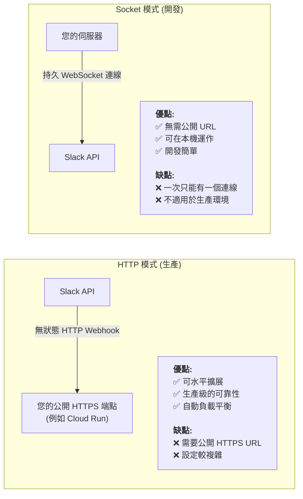
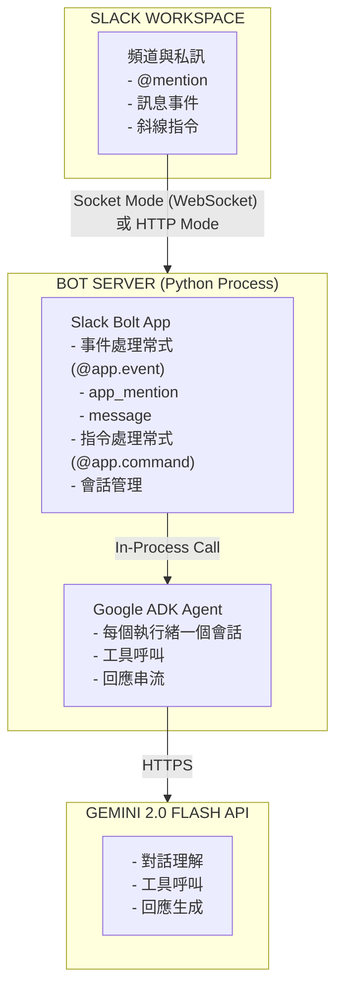

# 教學 33：Slack Bot 與 ADK 整合 (Tutorial 33: Slack Bot Integration with ADK)


**預計閱讀時間**：50-60 分鐘

**難易度**：中級到高級

---

## 目錄 (Table of Contents)

1. [為何選擇 Slack + ADK？ (真實世界價值)](#why-slack--adk-real-world-value)
2. [您將學到什麼 (What You'll Learn)](#what-youll-learn)
3. [快速入門 (15 分鐘)](#quick-start-15-minutes)
4. [關鍵心智模型 (Key Mental Models)](#key-mental-models)
5. [了解架構 (Understanding the Architecture)](#understanding-the-architecture)
6. [打造團隊支援機器人 (Building a Team Support Bot)](#building-a-team-support-bot)
7. [進階功能 (Advanced Features)](#advanced-features)
8. [生產部署 (Production Deployment)](#production-deployment)
9. [常見陷阱與避免方法 (Common Pitfalls & How to Avoid Them)](#common-pitfalls--how-to-avoid-them)
10. [疑難排解 (Troubleshooting)](#troubleshooting)
11. [後續步驟 (Next Steps)](#next-steps)

---

## 為何選擇 Slack + ADK？ (真實世界價值) (Why Slack + ADK? (Real-World Value))

### 您正在解決的問題 (The Problem You're Solving)

團隊每天浪費 **3-4 小時** 在不同工具之間切換以回答問題：

- 「我們的休假政策是什麼？」
- 「如何重設密碼？」
- 「我應該專注於哪個專案？」

開發人員浪費了上下文切換的時間。支援團隊處理重複的問題。知識分散在各處。

### ADK 解決方案 (The ADK Solution)

透過 Slack + ADK，您可以打造一個**生活在您團隊已經工作地方的智慧型機器人**：

```
沒有機器人：
使用者 → Google 文件 → Notion → Wiki → 電子郵件支援團隊 → 等待 4 小時

有 Slack 機器人：
使用者：@支援機器人 協助處理費用報告
機器人：（立即回應，提供確切的政策 + 建立票證選項）
```

### 真實世界的學習收穫 (Real-World Learning Gains)

完成本教學後，您將能夠：

- ✅ **打造智慧型 Slack 機器人**，了解上下文並即時回應
- ✅ **將 ADK 代理程式與 Slack Bolt 整合**，打造生產級機器人
- ✅ **管理跨執行緒和私訊的對話狀態**
- ✅ **安全地部署到 Cloud Run**，並包含密鑰和監控
- ✅ **無需手動擴展即可處理 100 多個並發使用者**
- ✅ **建立執行實際業務邏輯的工具**（建立票證、知識庫搜尋）

### 誰應該使用？ (Who Should Use This?)

| 角色 | 為何選擇 Slack + ADK？ |
|------|-----------------|
| **平台工程師** | 打造感覺像原生工作流程的內部開發人員工具 |
| **DevOps 團隊** | 建立在 Slack 中執行應變手冊的事件回應機器人 |
| **產品經理** | 部署分析儀表板和決策工具 |
| **支援團隊** | 自動化常見問題回應和票證分類 |
| **人資/人事團隊** | 打造新人引導機器人和政策查詢工具 |

### 為何不選擇 Web UI？ (Why Not Web UI?)

何時選擇 **Slack** 與 **Web UI**（教學 30）：

| 功能 | Slack 機器人 | Web UI |
|---------|-----------|--------|
| **設定** | 簡單（在團隊工作流程中） | 需要分享 URL |
| **採用率** | 原生（9/10 使用率） | 低摩擦（2/10 使用率） |
| **上下文** | 豐富（使用者、頻道、執行緒） | 有限（僅使用者） |
| **公開性** | 內部團隊工具 | 面向外部客戶 |
| **行動裝置** | 可在 Slack 行動版上運作 | 需要響應式設計 |

**內部團隊工具使用 Slack。面向客戶的應用程式使用 Web UI。**

---

## 您將學到什麼 (What You'll Learn)

完成本教學後，您將了解：

**概念：**
- Slack 機器人如何與 ADK 代理程式整合
- Socket 模式（開發）與 HTTP 模式（生產）
- 會話狀態和對話執行緒
- 工具整合和執行流程

**技能：**
- 設定 Slack 應用程式和 OAuth 範圍
- 為提及和私訊建立事件處理常式
- 建立代理程式可執行的可呼叫工具
- 使用密鑰部署到 Cloud Run
- 監控和疑難排解生產中的機器人

**程式碼：**
- 可運作的 Slack 機器人，包含 100 多行生產程式碼
- 兩個可呼叫的工具（知識庫搜尋、建立票證）
- 完整的測試套件（50 個測試）
- 可立即部署的 Docker 設定

---

## 總覽 (Overview)

### 您將打造什麼 (What You'll Build)

在本教學中，您將打造一個**團隊支援助理 Slack 機器人**：

```text
├─團隊支援機器人 (@support-bot)
  ├─ 智慧型回應
  ├─ 知識庫搜尋（工具）
  ├─ 支援票證建立（工具）
  ├─ 感知執行緒的對話
  └─ 可供生產部署
```

這個機器人將會：

1. **監聽** 提及，例如 `@支援機器人 如何重設密碼？`
2. **搜尋** 您的知識庫以尋找相關文件
3. 在需要人工審核時 **建立** 支援票證
4. 在 Slack 執行緒中以格式化訊息 **回應**

### 架構：三個層次 (Architecture: Three Layers)

```
層次 1：Slack 事件（提及、私訊、反應）
         ↓
層次 2：Slack Bolt（路由至處理常式、管理會話）
         ↓
層次 3：ADK 代理程式（LLM、工具呼叫、決策邏輯）
         ↓
層次 4：工具（知識庫、票證系統）
```

**在本教學中，您將專注於層次 2-4。** 我們提供可執行的 Slack 事件處理常式（層次 1）程式碼。

---

## 關鍵心智模型 (Key Mental Models)

### 心智模型 1：Socket 模式與 HTTP 模式 (Mental Model 1: Socket Mode vs HTTP Mode)

了解**連線模型(connection model)**至關重要：



**決策規則**：學習時使用 Socket 模式。部署到生產環境時切換到 HTTP 模式。

### 心智模型 2：代理程式工具執行 (Mental Model 2: Agent Tool Execution)

ADK 代理程式如何使用您的工具？

```
使用者：「休假政策是什麼？」
  ↓
機器人處理常式（接收到 @提及）
  ↓
將文字傳送給 ADK 代理程式
  ↓
代理程式（使用系統提示）：「我應該使用 search_knowledge_base」
  ↓
呼叫：search_knowledge_base("vacation policy")
  ↓
工具回傳：{"status": "success", "article": {...}}
  ↓
代理程式撰寫回應：「我們的 PTO 政策是每年 15 天...」
  ↓
機器人將回應傳回 Slack
```

**關鍵洞察**：工具回傳包含 `status`、`report` 和資料欄位的結構化字典。代理程式會讀取這些內容並決定下一步該做什麼。

### 心智模型 3：會話狀態管理 (Mental Model 3: Session State Management)

對話歷史記錄需要在訊息之間保持：

```
Slack 中的執行緒：
├─ 使用者：「我們的密碼政策是什麼？」
│  機器人：「這是密碼重設指南...」
│
├─ 使用者：「如何申請重設？」
│  機器人：「您需要透過 IT 申請...」
│（機器人記得先前的上下文！）
│
└─ 使用者：「幫我建立一個票證」
   機器人：「完成！已建立票證 TKT-ABC」
```

**實作**：使用 `channel_id + thread_ts` 作為唯一的會話金鑰。將會話狀態儲存在記憶體（開發）或資料庫（生產）中。

---

## 先決條件與設定 (Prerequisites & Setup)

### 系統需求 (System Requirements)

```bash
# Python 3.9 或更新版本
python --version  # 應為 >= 3.9

# pip（套件管理器）
pip --version
```

### 必要帳戶 (Required Accounts)

**1. Google AI API 金鑰**

從 [Google AI Studio](https://makersuite.google.com/app/apikey) 取得

**2. Slack 工作區**

- 具有建立應用程式的管理員權限
- 或在 [slack.com](https://slack.com/create) 建立測試工作區

---

## 快速入門 (15 分鐘) (Quick Start (15 Minutes))

💡 學習方法

我們在 `tutorial_implementation/tutorial33/` 中提供了一個**可運作的實作**，您可以立即執行，然後研究以了解其運作方式。

### 步驟 1：取得實作 (Step 1: Get the Implementation)

```bash
cd tutorial_implementation/tutorial33
pwd  # 您應該在 .../adk_training/tutorial_implementation/tutorial33
```

### 步驟 2：安裝與測試 (Step 2: Install and Test)

```bash
make setup   # 安裝依賴項和套件
make test    # 執行 50 個測試以驗證一切正常
```

### 步驟 3：設定 Slack 權杖 (Step 3: Configure Slack Tokens)

前往 [api.slack.com/apps](https://api.slack.com/apps) 並建立一個新應用程式：

1. **點擊「建立新應用程式」** → **「從頭開始」**
2. **OAuth 與權限**：新增以下範圍：
   - `app_mentions:read`（接收 @提及）
   - `chat:write`（傳送訊息）
   - `channels:history`、`groups:history`、`im:history`（讀取訊息）

3. **安裝到工作區**：取得您的**機器人權杖**（以 `xoxb-` 開頭）
4. **Socket 模式**：啟用它並建立應用程式級權杖（以 `xapp-` 開頭）

將這些權杖儲存到 `support_bot/.env`：

```bash
cp support_bot/.env.example support_bot/.env
# 使用您的權杖編輯 support_bot/.env
```

### 步驟 4：執行機器人 (Step 4: Run the Bot)

```bash
make slack-dev
```

您將會看到：`✅ Bot is running! Listening for mentions...`

### 步驟 5：在 Slack 中測試 (Step 5: Test in Slack)

在任何 Slack 頻道或私訊中嘗試以下指令：

- `@Support Bot 我們的休假政策是什麼？`
- `@Support Bot 如何重設密碼？`
- `@Support Bot 我需要提交費用報告`

**機器人將會：**
1. 搜尋知識庫 🔍
2. 尋找相符的文章 📚
3. 以格式化的答案回應 ✅

🎉 **您已完成快速入門！**

---

## 了解架構 (Understanding the Architecture)

### 元件圖 (Component Diagram)


### Socket 模式與 HTTP 模式 (Socket Mode vs HTTP Mode)

| 層面 | Socket 模式 | HTTP 模式 |
| --- | --- | --- |
| **連線** | WebSocket (持久) | HTTP Webhook |
| **設定** | 簡單 (無需公開 URL) | 需要公開端點 |
| **使用案例** | 開發 | 生產 |
| **延遲** | 低 (~50ms) | 中 (~100ms) |
| **可靠性** | 自動重新連線 | 必須處理重試 |
| **部署** | 本機或任何伺服器 | Cloud Run, Heroku 等 |

---

### 請求流程 (Request Flow)

**1. 使用者提及機器人**：`@支援機器人 如何重設密碼？`

**2. Slack 透過 Socket 模式/HTTP 傳送事件**給機器人：

```json
{
  "type": "app_mention",
  "user": "U12345",
  "text": "<@UBOT123> 如何重設密碼？",
  "channel": "C67890",
  "ts": "1234567890.123456",
  "thread_ts": "1234567890.123456"
}
```

**3. 機器人處理常式處理事件**：

```python
# 註解：處理提及事件
@app.event("app_mention")
def handle_mention(event, say):
    # 提取訊息
    text = remove_mention(event["text"])
    thread_ts = event.get("thread_ts", event["ts"])

    # 取得/建立此執行緒的會話
    session_id = f"{event['channel']}:{thread_ts}"
    session = get_or_create_session(session_id)

    # 傳送給 ADK 代理程式
    response = send_to_agent(session, text)

    # 在執行緒中回覆
    say(text=response, thread_ts=thread_ts)
```

**4. ADK 代理程式處理**：

```text
系統：您是一位支援助理...
使用者：如何重設密碼？
代理程式：若要重設您的密碼：
1. 前往 account.company.com
2. 點擊「忘記密碼」
3. 檢查您的電子郵件...
```

**5. 回應傳回** Slack 執行緒！

---

## 打造團隊支援機器人 (Building a Team Support Bot)

### 功能 1：知識庫搜尋 (Feature 1: Knowledge Base Search)

新增一個真實的知識庫工具：

```python
# 註解：使用知識庫搜尋強化的機器人
"""Enhanced bot with knowledge base search"""

from google.genai.types import Tool, FunctionDeclaration
import json

# 模擬知識庫（請替換為真實的資料庫/向量儲存）
KNOWLEDGE_BASE = {
    "password_reset": {
        "title": "如何重設您的密碼",
        "content": """若要重設您的密碼：
        1. 造訪 https://account.company.com
        2. 點擊「忘記密碼」
        3. 輸入您的工作電子郵件
        4. 檢查您的電子郵件以取得重設連結
        5. 建立一個新的高強度密碼（8 個以上字元，混合字母/數字/符號）

        如果您在 5 分鐘內未收到電子郵件，請檢查您的垃圾郵件資料夾或聯絡 IT 部門 it-help@company.com。""",
                "tags": ["password", "reset", "account", "login"]
            },
            "expense_report": {
                "title": "提交費用報告",
                "content": """若要提交費用報告：
        1. 登入 Expensify，網址為 https://expensify.company.com
        2. 點擊「新報告」
        3. 新增費用並附上收據
        4. 提交給主管審核
        5. 7 個工作天內報銷

        符合資格的費用：差旅、餐費（每天最高 50 美元）、軟體訂閱（需預先批准）。

        有問題嗎？請寄電子郵件至 finance@company.com""",
                "tags": ["expense", "reimbursement", "finance", "expensify"]
            },
            "vacation_policy": {
                "title": "休假與 PTO 政策",
                "content": """我們的 PTO 政策：
        • 每年 15 天 PTO（第一年按比例計算）
        • 每年 5 天病假
        • 10 天公司假日
        • 無限無薪假（需主管批准）

        若要申請休假：
        1. 在 BambooHR 中提交，網址為 https://bamboo.company.com
        2. 取得主管批准
        3. 更新您的 Slack 狀態
        4. 新增至團隊行事曆

        請為繁忙時期（第四季、產品發表）提前計畫。""",
                "tags": ["vacation", "pto", "time off", "leave", "holiday"]
            },
            "remote_work": {
                "title": "遠端工作政策",
                "content": """遠端工作選項：
        • 混合辦公：3 天在辦公室，2 天遠端（標準）
        • 完全遠端：適用於經批准的職位
        • 臨時遠端：適用於出差、緊急情況（通知主管）

        要求：
        • 可靠的網路（50+ Mbps）
        • 安靜的工作空間
        • 在核心時段（當地時間上午 10 點至下午 3 點）可聯繫
        • 在會議中定期開啟視訊

        設備津貼：每年 500 美元用於家庭辦公室設定。""",
                "tags": ["remote", "work from home", "hybrid", "wfh"]
            },
            "it_support": {
                "title": "IT 支援聯絡方式",
                "content": """IT 支援管道：
        • Slack: #it-support（最快，美國東部時間上午 9 點至下午 6 點）
        • 電子郵件：it-help@company.com（24 小時內回覆）
        • 電話：1-800-IT-HELPS（僅限緊急問題）
        • 入口網站：https://support.company.com

        常見問題：
        • VPN：使用 Cisco AnyConnect，憑證 = AD 登入
        • 印表機：透過「系統偏好設定」→「印表機」新增
        • 軟體安裝：在 #it-support 中申請

        緊急（P0）：系統中斷時請撥打電話號碼。""",
        "tags": ["IT", "support", "help", "technical", "vpn", "printer"]
    }
}

def search_knowledge_base(query: str) -> dict:
    """
    搜尋公司知識庫。

    Args:
        query: 搜尋查詢

    Returns:
        包含相符文章或錯誤的字典
    """
    query_lower = query.lower()

    # 依標籤和內容搜尋
    matches = []
    for key, article in KNOWLEDGE_BASE.items():
        score = 0

        # 檢查標籤
        for tag in article["tags"]:
            if tag in query_lower:
                score += 2

        # 檢查標題
        if any(word in article["title"].lower() for word in query_lower.split()):
            score += 1

        # 檢查內容
        if any(word in article["content"].lower() for word in query_lower.split()):
            score += 0.5

        if score > 0:
            matches.append((score, article))

    if matches:
        # 回傳最佳匹配
        matches.sort(key=lambda x: x[0], reverse=True)
        best_article = matches[0][1]
        return {
            "found": True,
            "title": best_article["title"],
            "content": best_article["content"]
        }
    else:
        return {
            "found": False,
            "message": "我找不到相符的文章。請嘗試換句話說或聯絡 support@company.com"
        }

# 使用知識庫工具建立代理程式
from google.adk.agents import Agent

agent = Agent(
    model="gemini-2.0-flash-exp",
    name="support_bot",
    instruction="""您是一位樂於助人的團隊支援助理。

    您的職責：
    - 使用知識庫回答問題
    - 協助處理公司政策和程序
    - 提供 IT 支援指導
    - 友善、簡潔且專業

    指南：
    - 當使用者詢問以下問題時，務必使用 search_knowledge_base 工具：
    * 公司政策（PTO、遠端工作、費用）
    * IT 支援（密碼、VPN、印表機、軟體）
    * 程序和流程
    - 使用項目符號清楚地格式化回應
    - 包含知識庫中的相關連結
    - 使用 Slack 格式（*粗體*、`程式碼`、> 引言）
    - 如果找不到資訊，請承認並建議聯絡正確的團隊

    記住：您正在幫助員工提高生產力！""",
    tools=[
        Tool(
            function_declarations=[
                FunctionDeclaration(
                    name="search_knowledge_base",
                    description="搜尋公司知識庫以取得政策、程序和 IT 支援資訊",
                    parameters={
                        "type": "object",
                        "properties": {
                            "query": {
                                "type": "string",
                                "description": "描述要尋找內容的搜尋查詢"
                            }
                        },
                        "required": ["query"]
                    }
                )
            ]
        )
    ],
    tool_config={
        "function_calling_config": {
            "mode": "AUTO"
        }
    }
)

# 工具執行對應
TOOLS = {
    "search_knowledge_base": search_knowledge_base
}

# 更新處理常式以執行工具
@app.event("app_mention")
def handle_mention(event, say, logger):
    """使用工具呼叫處理 @提及。"""
    try:
        user = event["user"]
        text = event["text"]
        channel = event["channel"]
        thread_ts = event.get("thread_ts", event["ts"])

        # 移除提及
        text = re.sub(r'<@[A-Z0-9]+>', '', text).strip()

        if not text:
            say(text="嗨！有什麼我能幫您的嗎？", thread_ts=thread_ts)
            return

        # 直接呼叫代理程式 - ADK 會自動處理工具執行
        # 代理程式會維護對話上下文並視需要執行工具
        full_response = agent(text)

        # 格式化並傳送
        formatted_response = format_slack_message(full_response)
        say(text=formatted_response, thread_ts=thread_ts)

    except Exception as e:
        logger.error(f"錯誤：{e}")
        say(text="抱歉，我遇到一個錯誤！", thread_ts=thread_ts)
```

**測試一下：**

`@支援機器人 如何重設密碼？`

機器人將會搜尋知識庫並提供完整的密碼重設指南！ 🔍

---

### 功能 2：豐富的 Slack 區塊 (Feature 2: Rich Slack Blocks)

使用 Slack 的 Block Kit 打造美觀的訊息：

```python
# 註解：建立知識庫文章的豐富 Slack 區塊
def create_article_blocks(title: str, content: str) -> list:
    """為知識庫文章建立豐富的 Slack 區塊。"""
    return [
        {
            "type": "header",
            "text": {
                "type": "plain_text",
                "text": f"📚 {title}",
                "emoji": True
            }
        },
        {
            "type": "divider"
        },
        {
            "type": "section",
            "text": {
                "type": "mrkdwn",
                "text": content
            }
        },
        {
            "type": "context",
            "elements": [
                {
                    "type": "mrkdwn",
                    "text": "💡 需要更多協助嗎？請聯絡 support@company.com"
                }
            ]
        }
    ]

# 註解：建立帶有操作按鈕的區塊
def create_action_blocks(message: str, actions: list) -> list:
    """建立帶有操作按鈕的區塊。"""
    blocks = [
        {
            "type": "section",
            "text": {
                "type": "mrkdwn",
                "text": message
            }
        }
    ]

    if actions:
        blocks.append({
            "type": "actions",
            "elements": [
                {
                    "type": "button",
                    "text": {
                        "type": "plain_text",
                        "text": action["label"],
                        "emoji": True
                    },
                    "value": action["value"],
                    "action_id": action["action_id"]
                }
                for action in actions
            ]
        })

    return blocks

# 註解：使用區塊強化的知識庫搜尋
def search_knowledge_base_with_blocks(query: str) -> dict:
    """搜尋並回傳格式化的 Slack 區塊。"""
    result = search_knowledge_base(query)

    if result["found"]:
        return {
            "found": True,
            "blocks": create_article_blocks(
                result["title"],
                result["content"]
            )
        }
    else:
        return {
            "found": False,
            "blocks": create_action_blocks(
                result["message"],
                actions=[
                    {
                        "label": "📧 電子郵件支援",
                        "value": "email_support",
                        "action_id": "email_support"
                    },
                    {
                        "label": "💬 開立票證",
                        "value": "open_ticket",
                        "action_id": "open_ticket"
                    }
                ]
            )
        }

# 註解：更新處理常式以使用區塊
@app.event("app_mention")
def handle_mention(event, say, client, logger):
    """使用豐富區塊處理提及。"""
    # ... (相同的提取邏輯)

    # 從代理程式取得回應後
    # 檢查是否使用了知識庫
    if "search_knowledge_base" in full_response:  # 簡化檢查
        # 從回應中提取查詢
        # 呼叫 search_knowledge_base_with_blocks
        # 傳送區塊而非純文字

        result = search_knowledge_base_with_blocks(text)

        if result["found"]:
            say(
                blocks=result["blocks"],
                thread_ts=thread_ts
            )
        else:
            say(
                blocks=result["blocks"],
                thread_ts=thread_ts
            )
    else:
        # 一般文字回應
        say(text=formatted_response, thread_ts=thread_ts)

# 註解：處理按鈕點擊
@app.action("email_support")
def handle_email_support(ack, body, say):
    """處理電子郵件支援按鈕點擊。"""
    ack()

    say(
        text="📧 您可以寄電子郵件至我們的支援團隊 support@company.com\n\n" +
             "我們通常會在工作日的 24 小時內回覆。",
        thread_ts=body["message"]["ts"]
    )

@app.action("open_ticket")
def handle_open_ticket(ack, body, say):
    """處理開立票證按鈕點擊。"""
    ack()

    # 顯示用於建立票證的強制回應視窗
    client.views_open(
        trigger_id=body["trigger_id"],
        view={
            "type": "modal",
            "callback_id": "ticket_modal",
            "title": {
                "type": "plain_text",
                "text": "建立支援票證"
            },
            "submit": {
                "type": "plain_text",
                "text": "提交"
            },
            "blocks": [
                {
                    "type": "input",
                    "block_id": "subject",
                    "label": {
                        "type": "plain_text",
                        "text": "主旨"
                    },
                    "element": {
                        "type": "plain_text_input",
                        "action_id": "subject_input"
                    }
                },
                {
                    "type": "input",
                    "block_id": "description",
                    "label": {
                        "type": "plain_text",
                        "text": "描述"
                    },
                    "element": {
                        "type": "plain_text_input",
                        "action_id": "description_input",
                        "multiline": True
                    }
                },
                {
                    "type": "input",
                    "block_id": "priority",
                    "label": {
                        "type": "plain_text",
                        "text": "優先順序"
                    },
                    "element": {
                        "type": "static_select",
                        "action_id": "priority_select",
                        "options": [
                            {
                                "text": {"type": "plain_text", "text": "低"},
                                "value": "low"
                            },
                            {
                                "text": {"type": "plain_text", "text": "一般"},
                                "value": "normal"
                            },
                            {
                                "text": {"type": "plain_text", "text": "高"},
                                "value": "high"
                            },
                            {
                                "text": {"type": "plain_text", "text": "緊急"},
                                "value": "urgent"
                            }
                        ]
                    }
                }
            ]
        }
    )
```

現在您的機器人可以傳送帶有按鈕的**美觀格式化訊息**了！ 🎨

---

### 功能 3：建立支援票證 (Feature 3: Create Support Tickets)

新增建立票證工具：

```python
# 註解：匯入 uuid 和 datetime 以建立票證
import uuid
from datetime import datetime

# 註解：建立支援票證
def create_support_ticket(subject: str, description: str, priority: str = "normal") -> dict:
    """
    建立支援票證。

    Args:
        subject: 票證主旨
        description: 詳細描述
        priority: 優先順序（低、一般、高、緊急）

    Returns:
        包含票證詳細資訊的字典
    """
    ticket_id = f"TKT-{uuid.uuid4().hex[:8].upper()}"

    # 模擬票證建立（請替換為真實的票證系統 API）
    ticket = {
        "id": ticket_id,
        "subject": subject,
        "description": description,
        "priority": priority,
        "status": "Open",
        "created_at": datetime.now().isoformat(),
        "url": f"https://support.company.com/tickets/{ticket_id}"
    }

    return ticket

# 註解：新增至代理程式工具
FunctionDeclaration(
    name="create_support_ticket",
    description="為需要人工處理的問題建立支援票證",
    parameters={
        "type": "object",
        "properties": {
            "subject": {
                "type": "string",
                "description": "票證的簡要主旨"
            },
            "description": {
                "type": "string",
                "description": "問題的詳細描述"
            },
            "priority": {
                "type": "string",
                "description": "優先順序",
                "enum": ["low", "normal", "high", "urgent"]
            }
        },
        "required": ["subject", "description"]
    }
)

# 註解：更新 TOOLS 對應
TOOLS = {
    "search_knowledge_base": search_knowledge_base,
    "create_support_ticket": create_support_ticket
}

# 註解：代理程式指令更新
instruction="""...

建立票證時：
- 對於複雜問題，使用 create_support_ticket
- 根據緊急程度設定優先順序
- 清楚地總結問題
- 向使用者確認票證已建立

..."""
```

**測試一下：**

`@支援機器人 我的筆記型電腦無法連線到 VPN，已經試過所有方法了`

機器人會建立一個票證並回應：

> 我已為您的 VPN 問題建立了票證 **TKT-A1B2C3D4**。我們的 IT 團隊將在 4 小時內與您聯繫。
>
> 在此追蹤：https://support.company.com/tickets/TKT-A1B2C3D4

🎫 票證已建立！

---

## 進階功能 (Advanced Features)

### 功能 1：來自 Slack 的上下文 (Feature 1: Context from Slack)

使用 Slack 上下文豐富代理程式：

```python
# 註解：從 Slack 取得使用者資訊
def get_user_info(user_id: str, client) -> dict:
    """從 Slack 取得使用者資訊。"""
    try:
        response = client.users_info(user=user_id)
        user = response["user"]

        return {
            "name": user["real_name"],
            "email": user["profile"].get("email"),
            "title": user["profile"].get("title"),
            "team": user["profile"].get("team")
        }
    except Exception:
        return {}

# 註解：取得頻道資訊
def get_channel_info(channel_id: str, client) -> dict:
    """取得頻道資訊。"""
    try:
        response = client.conversations_info(channel=channel_id)
        channel = response["channel"]

        return {
            "name": channel["name"],
            "topic": channel.get("topic", {}).get("value"),
            "purpose": channel.get("purpose", {}).get("value")
        }
    except Exception:
        return {}

# 註解：使用上下文強化的處理常式
@app.event("app_mention")
def handle_mention(event, say, client, logger):
    """使用豐富上下文處理提及。"""
    # 取得 Slack 上下文
    user_info = get_user_info(event["user"], client)
    channel_info = get_channel_info(event["channel"], client)

    # 將上下文新增至代理程式訊息
    context = f"""使用者上下文：
    - 姓名：{user_info.get('name', '未知')}
    - 電子郵件：{user_info.get('email', '未知')}
    - 職稱：{user_info.get('title', '未知')}

    頻道上下文：
    - 頻道：#{channel_info.get('name', '未知')}
    - 主題：{channel_info.get('topic', '無')}

    使用者問題：{text}"""

    # 將帶有上下文的訊息傳送給代理程式 - ADK 代理程式處理執行
    response = agent(context)

    # ... 處理回應
```

代理程式現在知道是誰在問以及在哪裡問了！ 🎯

---

### 功能 2：排程訊息 (Feature 2: Scheduled Messages)

傳送主動提醒：

```python
# 註解：匯入排程、時間和執行緒
import schedule
import time
from threading import Thread

# 註解：傳送每日提示
def send_daily_tip():
    """傳送每日生產力提示至 #general。"""
    tips = [
        "💡 提示：使用 /support 指令快速取得協助，無需 @提及我！",
        "📚 新知識庫文章：查看我們更新的遠端工作政策！",
        "⏰ 提醒：請在週五下班前提交您的工時表！",
        "🎉 功能更新：我現在可以直接從 Slack 建立支援票證了！"
    ]

    import random
    tip = random.choice(tips)

    app.client.chat_postMessage(
        channel="#general",
        text=tip
    )

# 註解：排程每日提示
schedule.every().day.at("10:00").do(send_daily_tip)

# 註解：在背景執行緒中執行排程任務
def run_schedule():
    """在背景執行緒中執行排程任務。"""
    while True:
        schedule.run_pending()
        time.sleep(60)

# 註解：啟動排程器
scheduler_thread = Thread(target=run_schedule, daemon=True)
scheduler_thread.start()
```

---

### 功能 3：分析與記錄 (Feature 3: Analytics & Logging)

追蹤機器人使用情況：

```python
# 註解：匯入記錄、defaultdict 和 datetime
import logging
from collections import defaultdict
from datetime import datetime

# 註解：設定記錄
logging.basicConfig(
    level=logging.INFO,
    format='%(asctime)s - %(name)s - %(levelname)s - %(message)s',
    handlers=[
        logging.FileHandler("bot.log"),
        logging.StreamHandler()
    ]
)
logger = logging.getLogger(__name__)

# 註解：使用情況統計
stats = defaultdict(int)

@app.event("app_mention")
def handle_mention(event, say, client, logger_obj):
    """使用分析處理提及。"""
    # 記錄事件
    logger.info(f"來自使用者 {event['user']} 在頻道 {event['channel']} 的提及")

    # 追蹤統計資料
    stats["mentions"] += 1
    stats[f"user_{event['user']}"] += 1
    stats[f"channel_{event['channel']}"] += 1

    # ... 處理提及

    # 記錄回應
    logger.info(f"以 {len(full_response)} 個字元回應")
    stats["responses"] += 1

# 註解：統計指令
@app.command("/support-stats")
def handle_stats_command(ack, say, command):
    """顯示機器人使用情況統計。"""
    ack()

    # 僅限管理員
    if command["user_id"] not in ADMIN_USERS:
        say("抱歉，此指令僅供管理員使用！")
        return

    message = f"""📊 *支援機器人統計*

    總提及次數：{stats['mentions']}
    總回應次數：{stats['responses']}
    活躍使用者數：{len([k for k in stats.keys() if k.startswith('user_')])}
    活躍頻道數：{len([k for k in stats.keys() if k.startswith('channel_')])}

    熱門使用者：
    {get_top_users(stats, 5)}

    熱門頻道：
    {get_top_channels(stats, 5)}
    """

    say(text=message)

def get_top_users(stats, n=5):
    """依互動次數取得前 N 位使用者。"""
    user_stats = {k: v for k, v in stats.items() if k.startswith("user_")}
    sorted_users = sorted(user_stats.items(), key=lambda x: x[1], reverse=True)[:n]

    return "\n".join([
        f"{i+1}. <@{user.replace('user_', '')}> - {count} 次互動"
        for i, (user, count) in enumerate(sorted_users)
    ])
```

---

## 生產部署 (Production Deployment)

### 選項 1：HTTP 模式（建議用於生產）(Option 1: HTTP Mode (Recommended for Production))

**步驟 1：更新機器人以使用 HTTP 模式 (Step 1: Update Bot for HTTP Mode)**

```python
# 註解：使用 HTTP 模式的生產機器人
"""Production bot with HTTP mode"""

import os
from slack_bolt import App
from slack_bolt.adapter.flask import SlackRequestHandler
from flask import Flask, request

# 註解：初始化 Slack 應用程式（無 Socket 模式）
app = App(
    token=os.environ.get("SLACK_BOT_TOKEN"),
    signing_secret=os.environ.get("SLACK_SIGNING_SECRET")
)

# ... (您所有的處理常式)

# 註解：用於 HTTP 端點的 Flask 應用程式
flask_app = Flask(__name__)
handler = SlackRequestHandler(app)

@flask_app.route("/slack/events", methods=["POST"])
def slack_events():
    """透過 HTTP 處理 Slack 事件。"""
    return handler.handle(request)

@flask_app.route("/health", methods=["GET"])
def health():
    """健康檢查端點。"""
    return {"status": "healthy"}, 200

# 註解：執行 Flask 伺服器
if __name__ == "__main__":
    port = int(os.environ.get("PORT", 8080))
    flask_app.run(host="0.0.0.0", port=port)
```

**步驟 2：更新 Slack 應用程式設定 (Step 2: Update Slack App Configuration)**

1. 前往 Slack 應用程式設定中的**事件訂閱**
2. 啟用事件
3. 設定請求 URL：`https://your-app.run.app/slack/events`
4. Slack 將驗證 URL（請確保機器人正在執行！）
5. 訂閱機器人事件（與之前相同）

**步驟 3：部署至 Cloud Run (Step 3: Deploy to Cloud Run)**

建立 `requirements.txt`：

```txt
slack-bolt==1.20.0
google-genai==1.41.0
python-dotenv==1.0.0
Flask==3.0.0
schedule==1.2.0
```

建立 `Dockerfile`：

```dockerfile
FROM python:3.11-slim

WORKDIR /app

# 安裝依賴項
COPY requirements.txt .
RUN pip install --no-cache-dir -r requirements.txt

# 複製機器人程式碼
COPY bot.py .

# 公開埠號
EXPOSE 8080

# 健康檢查
HEALTHCHECK CMD curl --fail http://localhost:8080/health || exit 1

# 執行機器人
CMD ["python", "bot.py"]
```

**部署**：

```bash
# 部署至 Cloud Run
gcloud run deploy support-bot \
  --source=. \
  --region=us-central1 \
  --allow-unauthenticated \
  --set-env-vars="SLACK_BOT_TOKEN=xoxb-...,SLACK_SIGNING_SECRET=...,GOOGLE_API_KEY=..."

# 輸出：
# Service URL: https://support-bot-abc123.run.app
```

**步驟 4：更新 Slack 事件 URL (Step 4: Update Slack Event URL)**

返回 Slack 應用程式設定 → 事件訂閱 → 更新 URL：

`https://support-bot-abc123.run.app/slack/events`

✅ **生產機器人已上線！**

---

### 生產最佳實踐 (Production Best Practices)

**1. 速率限制 (Rate Limiting)**

```python
# 註解：匯入 defaultdict 和 time
from collections import defaultdict
import time

class RateLimiter:
    def __init__(self, max_requests=20, window=60):
        self.max_requests = max_requests
        self.window = window
        self.requests = defaultdict(list)

    def is_allowed(self, user_id):
        now = time.time()
        self.requests[user_id] = [
            req_time for req_time in self.requests[user_id]
            if now - req_time < self.window
        ]

        if len(self.requests[user_id]) < self.max_requests:
            self.requests[user_id].append(now)
            return True
        return False

rate_limiter = RateLimiter()

@app.event("app_mention")
def handle_mention(event, say):
    user_id = event["user"]

    if not rate_limiter.is_allowed(user_id):
        say(
            text="⚠️ 您傳送的請求過多。請稍候一分鐘！",
            thread_ts=event.get("thread_ts", event["ts"])
        )
        return

    # ... 正常處理
```

**2. 錯誤復原 (Error Recovery)**

```python
# 註解：匯入 wraps 和 traceback
from functools import wraps
import traceback

def retry_on_error(max_retries=3):
    """Slack API 呼叫的重試裝飾器。"""
    def decorator(func):
        @wraps(func)
        def wrapper(*args, **kwargs):
            for attempt in range(max_retries):
                try:
                    return func(*args, **kwargs)
                except Exception as e:
                    logger.error(f"第 {attempt + 1} 次嘗試失敗：{e}")
                    if attempt == max_retries - 1:
                        raise
                    time.sleep(2 ** attempt)  # 指數退避
            return wrapper
        return decorator

@retry_on_error(max_retries=3)
def send_message_with_retry(channel, text, thread_ts):
    """使用自動重試傳送訊息。"""
    app.client.chat_postMessage(
        channel=channel,
        text=text,
        thread_ts=thread_ts
    )
```

**3. 監控 (Monitoring)**

```python
# 註解：匯入 Google Cloud Monitoring
from google.cloud import monitoring_v3

def log_metric(metric_name, value):
    """記錄至 Google Cloud Monitoring。"""
    if os.getenv("ENVIRONMENT") != "production":
        return

    client = monitoring_v3.MetricServiceClient()
    project_name = f"projects/{os.getenv('GCP_PROJECT')}"

    series = monitoring_v3.TimeSeries()
    series.metric.type = f"custom.googleapis.com/slack_bot/{metric_name}"

    # ... (與先前的教學相同)

    client.create_time_series(name=project_name, time_series=[series])

@app.event("app_mention")
def handle_mention(event, say):
    start_time = time.time()

    # ... 處理提及

    latency = time.time() - start_time
    log_metric("response_latency", latency)
    log_metric("mentions", 1)
```

**4. 會話清理 (Session Cleanup)**

```python
# 註解：匯入 datetime 和 timedelta
from datetime import datetime, timedelta

# 註解：定期清理舊會話
def cleanup_old_sessions():
    """移除超過 24 小時的會話。"""
    cutoff = datetime.now() - timedelta(hours=24)

    sessions_to_remove = []
    for session_id, session_data in sessions.items():
        if session_data.get("created_at", datetime.now()) < cutoff:
            sessions_to_remove.append(session_id)

    for session_id in sessions_to_remove:
        del sessions[session_id]
        logger.info(f"已清理會話：{session_id}")

# 註解：每小時執行一次清理
schedule.every().hour.do(cleanup_old_sessions)
```

---

## 疑難排解 (Troubleshooting)

### 常見問題 (Common Issues)

**問題 1：機器人沒有回應 (Issue 1: Bot Not Responding)**

**症狀**：

- 提及機器人，沒有回應
- 記錄中沒有錯誤

**解決方案**：

```bash
# 檢查機器人是否正在執行
curl https://your-bot.run.app/health

# 檢查 Slack 應用程式設定
# 事件訂閱 → 請求 URL 應已驗證 (✓)

# 檢查機器人權杖範圍
# OAuth 與權限 → 驗證所有範圍皆已新增

# 檢查事件訂閱
# 事件訂閱 → 驗證 app_mention, message.im 皆已訂閱
```

---

**問題 2：「驗證失敗」錯誤 (Issue 2: "Verification Failed" Error)**

**症狀**：

- Slack 表示請求 URL 驗證失敗
- 事件未送達機器人

**解決方案**：

```python
# 確保機器人處理挑戰請求
@flask_app.route("/slack/events", methods=["POST"])
def slack_events():
    # Slack 在初始設定時傳送挑戰
    if request.json and "challenge" in request.json:
        return {"challenge": request.json["challenge"]}

    # 正常事件處理
    return handler.handle(request)
```

---

**問題 3：速率限制錯誤 (Issue 3: Rate Limit Errors)**

**症狀**：

- 來自 Slack API 的 `ratelimited` 錯誤
- 機器人停止回應

**解決方案**：

```python
# 註解：匯入 SlackApiError 和 time
from slack_sdk.errors import SlackApiError
import time

def send_message_safely(channel, text, thread_ts=None):
    """使用速率限制處理安全地傳送訊息。"""
    max_retries = 5

    for attempt in range(max_retries):
        try:
            app.client.chat_postMessage(
                channel=channel,
                text=text,
                thread_ts=thread_ts
            )
            return
        except SlackApiError as e:
            if e.response["error"] == "ratelimited":
                # 取得 retry-after 標頭
                retry_after = int(e.response.headers.get("Retry-After", 1))
                logger.warning(f"已達速率限制，等待 {retry_after} 秒")
                time.sleep(retry_after)
            else:
                raise
```

---

**問題 4：工具未執行 (Issue 4: Tools Not Executing)**

**症狀**：

- 代理程式未呼叫函式
- 僅有一般性回應

**解決方案**：

```python
# 註解：匯入 Agent
from google.adk.agents import Agent

# 驗證工具註冊 - 直接傳遞函式
agent = Agent(
    model="gemini-2.0-flash-exp",
    name="support_bot",
    instruction="...",
    tools=[search_knowledge_base, create_ticket]  # ✅ 直接傳遞函式
)

# ADK 自動為函式呼叫啟用 AUTO 模式

# 驗證工具對應
TOOLS = {
    "search_knowledge_base": search_knowledge_base,  # ✅ 名稱與函式名稱相符
    "searchKnowledgeBase": search_knowledge_base,    # ❌ 名稱錯誤 (使用 snake_case)
}

# 檢查工具執行邏輯
for event in response_stream:
    if hasattr(event, 'function_calls'):  # ✅ 檢查屬性是否存在
        for fc in event.function_calls:
            # 執行工具...
```

---

**問題 5：會話狀態遺失 (Issue 5: Session State Lost)**

**症狀**：

- 機器人忘記對話上下文
- 每則訊息都被視為新的對話

**解決方案**：

```python
# 使用一致的會話 ID
def get_session_id(channel_id: str, thread_ts: str = None) -> str:
    """產生一致的會話 ID。"""
    # 對於執行緒中的對話，使用 thread_ts
    return f"{channel_id}:{thread_ts or 'main'}"

# 驗證會話是否正確擷取
session_id = get_session_id(event["channel"], event.get("thread_ts"))

if session_id in sessions:
    session = sessions[session_id]  # ✅ 重複使用會話
else:
    session = create_new_session()  # 建立新會話
    sessions[session_id] = session

# 記錄以進行偵錯
logger.info(f"正在使用會話：{session_id}")
```

---

## 常見陷阱與避免方法 (Common Pitfalls & How to Avoid Them)

### ❌ 陷阱 1：忘記啟用事件訂閱 (❌ Pitfall 1: Forgetting to Enable Event Subscriptions)

**問題：**
您建立了 Slack 應用程式並安裝了它，但機器人從未回應 @提及。

**根本原因：**
Slack 應用程式設定中未訂閱事件。

**解決方案：**
```
前往：OAuth 與權限 → 事件訂閱
□ 啟用事件
□ 訂閱機器人事件：
  ✓ app_mention
  ✓ message.channels
  ✓ message.im
```

### ❌ 陷阱 2：在 Socket 模式下使用錯誤的權杖 (❌ Pitfall 2: Using Wrong Token for Socket Mode)

**問題：**
```
錯誤："invalid_auth"
```

**根本原因：**
您在 Socket 模式下使用了 `SLACK_BOT_TOKEN` 而非 `SLACK_APP_TOKEN`。

**解決方案：**
- Socket 模式需要 `SLACK_APP_TOKEN`（以 `xapp-` 開頭）
- HTTP Webhook 需要 `SLACK_BOT_TOKEN`（以 `xoxb-` 開頭）
- 兩者都應放在 `.env` 檔案中

### ❌ 陷阱 3：工具函式與 ADK 格式不符 (❌ Pitfall 3: Tool Functions Don't Match ADK Format)

**問題：**
```
代理程式：「我應該呼叫 search_knowledge_base」
結果：錯誤 - 找不到工具
```

**根本原因：**
工具函式必須回傳 `{'status': 'success', 'report': '...'}` 格式。

**解決方案：**
```python
def my_tool(param: str) -> Dict[str, Any]:
    try:
        result = do_something(param)
        return {
            'status': 'success',
            'report': '人類可讀的訊息',
            'data': result  # 選用
        }
    except Exception as e:
        return {
            'status': 'error',
            'error': str(e),
            'report': '給使用者的錯誤訊息'
        }
```

### ❌ 陷阱 4：訊息之間遺失會話狀態 (❌ Pitfall 4: Session State Lost Between Messages)

**問題：**
```
使用者：「休假政策是什麼？」
機器人：「每年 15 天 PTO...」

使用者：「如何申請？」
機器人：「我不知道您在問什麼」😞
```

**根本原因：**
每則訊息都建立一個新會話，而不是重複使用執行緒會話。

**解決方案：**
```python
# ✅ 使用 thread_ts 作為會話金鑰的一部分
session_id = f"{channel_id}:{thread_ts}"

# 將對話儲存在持久儲存中
if session_id not in sessions:
    sessions[session_id] = []

sessions[session_id].append({
    "role": "user",
    "content": message_text
})
```

### ❌ 陷阱 5：代理程式從未呼叫工具 (❌ Pitfall 5: Agent Never Calls Tools)

**問題：**
```
使用者：「搜尋密碼政策」
代理程式：「我沒有關於密碼政策的資訊」
```

**根本原因：**
- 工具未正確註冊
- 系統提示未鼓勵使用工具
- 函式名稱與工具名稱不符

**解決方案：**
```python
# ✅ 正確註冊工具
root_agent = Agent(
    name="support_bot",
    model="gemini-2.5-flash",
    tools=[
        search_knowledge_base,  # ✅ 直接傳遞函式
        create_support_ticket
    ]
)

# ✅ 在指令中鼓勵使用工具
instruction="""
當使用者詢問政策時，請使用 search_knowledge_base。
當他們回報問題時，請使用 create_support_ticket。
在相關時務必使用工具！
"""
```

### ❌ 陷阱 6：程式碼中洩漏憑證 (❌ Pitfall 6: Credentials Leaked in Code)

**問題：**
```python
SLACK_BOT_TOKEN = "xoxb-secret123"  # ❌ 不要這樣做！
```

**根本原因：**
在原始碼中硬式編碼密鑰會將其暴露在 git 歷史記錄中。

**解決方案：**
```python
# ✅ 務必使用環境變數
import os
from dotenv import load_dotenv

load_dotenv()
token = os.environ.get("SLACK_BOT_TOKEN")

# 新增至 .gitignore
echo ".env" >> .gitignore
```

### ✅ 最佳實踐：部署前在本機測試 (✅ Best Practice: Test Locally Before Deploying)

```bash
# 1. 在本機以 Socket 模式測試
make slack-dev

# 2. 執行完整測試套件
make slack-test

# 3. 然後才部署到生產環境
make slack-deploy
```

---

## 後續步驟 (Next Steps)

### 您已精通 Slack + ADK！ 🎉 (You've Mastered Slack + ADK! 🎉)

您現在知道如何：

✅ 使用 Google ADK 打造 Slack 機器人
✅ 處理提及、私訊和斜線指令
✅ 建立豐富的 Slack 區塊和互動式按鈕
✅ 新增知識庫搜尋和票證建立功能
✅ 使用 HTTP 模式部署到生產環境
✅ 實作速率限制、監控和錯誤處理

### 其他資源 (Additional Resources)

- [Slack Bolt 文件](https://slack.dev/bolt-python/)
- [Slack Block Kit Builder](https://app.slack.com/block-kit-builder)
- [ADK 文件](https://google.github.io/adk-docs/)
- [Slack API 參考](https://api.slack.com/methods)

---
## 程式碼實現 (Code Implementation)

- support-bot：[程式碼連結](../../../python/agents/support-bot/)
