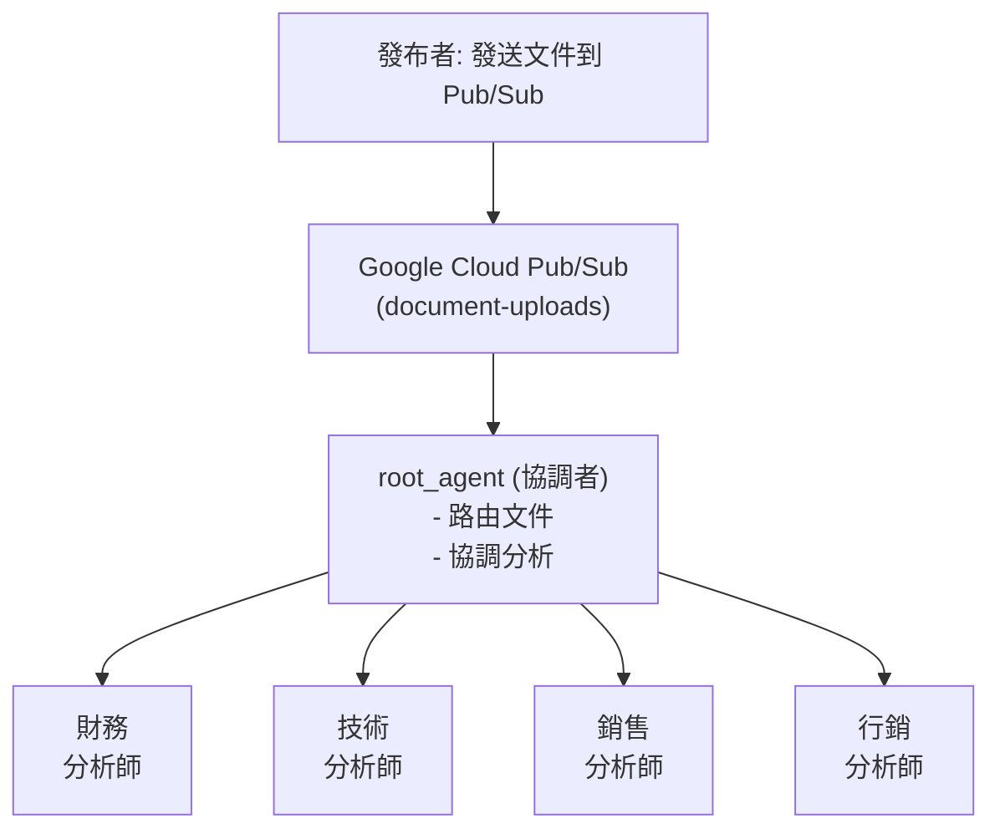
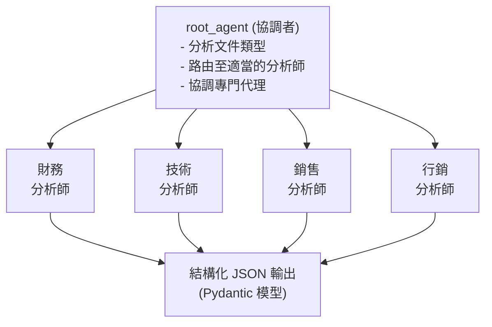

# 教學 34: Google Cloud Pub/Sub + 事件驅動代理 (Tutorial 34: Google Cloud Pub/Sub + Event-Driven Agents)

本教學使用 Google Cloud Pub/Sub 和 ADK 代理實作一個真實的事件驅動文件處理系統。它展示了使用 Pydantic 模型進行結構化 JSON 輸出的協調者 + 專家代理模式。
已於 2025 年 10 月使用最新的 ADK 和 Gemini 2.5 Flash 驗證。

**預估閱讀時間**: 50-60 分鐘
**難度等級**: 進階 (Advanced)
**先備知識**: 教學 01-03 (ADK 基礎), Google Cloud 專案

---

## 🚀 快速開始 - 實作範例 (Quick Start - Working Implementation)

最簡單的開始方式是使用我們**完整的實作範例**：

```bash
cd tutorial_implementation/tutorial34
make setup      # 安裝依賴項
make test       # 執行所有測試
```

**內容包含:**

- ✅ `root_agent`: 將文件路由給專家的協調者代理
- ✅ 4 個專家代理: 財務、技術、銷售、行銷分析師
- ✅ Pydantic 輸出架構: 結構化 JSON 結果
- ✅ 66 個綜合測試 (全部通過)
- ✅ 可直接執行的真實世界範例程式碼

---

## 目錄 (Table of Contents)

1. [概述 (Overview)](#概述-overview)
2. [先備知識與設定 (Prerequisites & Setup)](#先備知識與設定-prerequisites--setup)
3. [了解架構 (Understanding the Architecture)](#了解架構-understanding-the-architecture)
4. [核心組件 (Core Components)](#核心組件-core-components)
5. [本地執行 (Running Locally)](#本地執行-running-locally)
6. [Google Cloud 部署 (Google Cloud Deployment)](#google-cloud-部署-google-cloud-deployment)
7. [疑難排解 (Troubleshooting)](#疑難排解-troubleshooting)
8. [下一步 (Next Steps)](#下一步-next-steps)

---

## 概述 (Overview)

### 你將建構什麼 (What You'll Build)

在本教學中，你將使用以下技術建構一個 **事件驅動的文件處理系統**：

- **Google Cloud Pub/Sub** (事件訊息傳遞)
- **Google ADK** (多代理協調)
- **Gemini 2.5 Flash** (文件分析)
- **Pydantic Models** (結構化 JSON 輸出)

**架構 (Architecture)**:



### 為什麼選擇 Pub/Sub + ADK? (Why Pub/Sub + ADK?)

| 功能 (Feature) | 好處 (Benefit) |
| ---------------- | ------------------------------ |
| **非同步 (Asynchronous)** | 非阻塞處理 (Non-blocking processing) |
| **解耦 (Decoupled)** | 發布者和訂閱者相互獨立 |
| **可擴展 (Scalable)** | 自動擴展訊息量 |
| **結構化 (Structured)** | 用於 JSON 的 Pydantic 模型 |
| **可靠 (Reliable)** | 至少一次傳遞，重試機制 |

**何時使用 Pub/Sub + ADK:**

- ✅ 非同步文件處理
- ✅ 多步驟工作流程
- ✅ 事件驅動架構
- ✅ 具有嚴格輸出架構的系統
- ✅ Google Cloud 部署


- ❌ 即時聊天介面 → 使用 Next.js/WebSocket
- ❌ 簡單的同步呼叫 → 使用直接 API

---

## 先備知識與設定 (Prerequisites & Setup)

### 本地測試 (無需 GCP) (Local Testing (No GCP Required))

要在沒有 Google Cloud 的情況下開始：

```bash
# 安裝依賴項
cd tutorial_implementation/tutorial34
make setup

# 執行測試 - 驗證代理設定
make test

# 這完全在本地使用記憶體內處理運作
```

### Google Cloud 設定 (可選 - 用於真實 Pub/Sub) (Google Cloud Setup (Optional - For Real Pub/Sub))

要使用真實的 Google Cloud Pub/Sub 進行部署：

#### 1. 安裝 gcloud CLI

```bash
# macOS
brew install --cask google-cloud-sdk

# 然後初始化
gcloud init
```

#### 2. 驗證 (Authenticate)

```bash
# 登入到 Google Cloud
gcloud auth login

# 設定預設專案
gcloud config set project your-project-id

# 驗證身份驗證
gcloud auth list
```

#### 3. 建立 Pub/Sub 資源 (Create Pub/Sub Resources)

```bash
# 啟用 Pub/Sub API
gcloud services enable pubsub.googleapis.com

# 建立主題
gcloud pubsub topics create document-uploads

# 建立訂閱
gcloud pubsub subscriptions create document-processor \
  --topic=document-uploads \
  --ack-deadline=600
```

#### 4. 設定環境變數 (Set Environment Variables)

```bash
# 設定你的 GCP 專案
export GCP_PROJECT="your-project-id"

# 設定 Gemini API 金鑰
export GOOGLE_API_KEY="your_gemini_api_key"

# 設定應用程式憑證
gcloud auth application-default login
```

---

## 了解架構 (Understanding the Architecture)

### 協調者 + 專家模式 (The Coordinator + Specialist Pattern)

此實作使用一個 **協調者代理 (coordinator agent)** 智慧地將文件路由給專門的分析師：



### 關鍵組件 (Key Components)

1. **root_agent** (`pubsub_agent/agent.py`):
   - 路由文件給專家的協調者
   - 分析文件類型和內容
   - 呼叫適當的子代理工具
   - 回傳結構化分析

2. **子代理 (Sub-Agents)** (財務 financial、技術 technical、銷售 sales、行銷 marketing):
   - 用於文件類型的專門分析師
   - 透過 Pydantic `output_schema` 強制執行結構化 JSON
   - 提取特定類型的指標和見解

3. **Pydantic 輸出架構 (Pydantic Output Schemas)**:
   - `FinancialAnalysisOutput`: 營收、利潤、指標
   - `TechnicalAnalysisOutput`: 技術、組件
   - `SalesAnalysisOutput`: 交易、管道價值
   - `MarketingAnalysisOutput`: 行銷活動、參與度指標

### Pub/Sub 保證 (Pub/Sub Guarantees)

| 功能 (Feature) | 描述 (Description) |
| ---------------- | -------------------------------- |
| **至少一次 (At-least-once)**| 訊息傳遞 ≥1 次 |
| **非同步 (Asynchronous)** | 非阻塞處理 |
| **可擴展 (Scalable)** | 自動擴展訊息量 |
| **持久性 (Durable)** | 訊息儲存在主題中 |
| **可靠 (Reliable)** | 失敗時自動重試 |

---

## 核心組件 (Core Components)

### 代理設定 (Agent Configuration)

在 `pubsub_agent/agent.py` 查看代理：

```python
# 協調者代理
root_agent = LlmAgent(
    name="pubsub_processor",
    model="gemini-2.5-flash",
    description="Event-driven document processing coordinator", # 事件驅動文件處理協調者
    instruction="Routes documents to specialized analyzers", # 將文件路由至專門的分析師
    tools=[financial_tool, technical_tool, sales_tool, marketing_tool],
)

# 子代理 (財務、技術、銷售、行銷)
# 每個都設定了 output_schema 以用於結構化 JSON
```

### 輸出架構 (Output Schemas)

所有子代理都回傳結構化的 Pydantic 模型：

```python
# 財務文件回傳：
FinancialAnalysisOutput(
    summary: DocumentSummary,
    entities: EntityExtraction,
    financial_metrics: FinancialMetrics,
    fiscal_periods: list[str],
    recommendations: list[str]
)

# 技術文件回傳：
TechnicalAnalysisOutput(
    summary: DocumentSummary,
    entities: EntityExtraction,
    technologies: list[str],
    components: list[str],
    recommendations: list[str]
)

# 銷售和行銷分析師類似
```

### 使用範例 (Example Usage)

**本地無需 GCP (Locally without GCP)**:

```bash
cd tutorial_implementation/tutorial34
make test
```

**在程式碼中測試代理 (Test the agent in code)**:

```python
import asyncio
from google.adk import Runner
from google.adk.sessions import InMemorySessionService
from google.genai import types
from pubsub_agent.agent import root_agent

async def test_document_analysis():
    session_service = InMemorySessionService()
    runner = Runner(
        app_name="document_analyzer",
        agent=root_agent,
        session_service=session_service
    )

    session = await session_service.create_session(
        app_name="document_analyzer",
        user_id="test_user"
    )

    prompt = types.Content(
        role="user",
        parts=[types.Part(
            text="Analyze: Revenue $1.2M, Profit 33%, Q4 2024"
        )]
    )

    async for event in runner.run_async(
        user_id="test_user",
        session_id=session.id,
        new_message=prompt
    ):
        print("Response:", event)

asyncio.run(test_document_analysis())
```

**使用 ADK 網頁介面 (Using ADK Web Interface)**:

```bash
adk web
```

然後造訪 `http://localhost:8000` 並從代理下拉選單中選擇 `pubsub_processor`。

---

## 本地執行 (Running Locally)

### 無需 Pub/Sub (本地測試) (Without Pub/Sub (Local Testing))

```bash
cd tutorial_implementation/tutorial34

# 執行所有測試
make test

# 查看測試覆蓋率
make test-cov
```

測試驗證：
- 代理設定
- 子代理設定
- Pydantic 輸出架構
- 代理匯入和結構

### 使用 Pub/Sub (Google Cloud) (With Pub/Sub (Google Cloud))

設定 GCP (見先備知識) 後，執行發布者和訂閱者：

**終端機 1 - 啟動訂閱者**:

```bash
export GCP_PROJECT="your-project-id"
export GOOGLE_API_KEY="your_api_key"

python subscriber.py
```

**終端機 2 - 發布文件**:

```bash
export GCP_PROJECT="your-project-id"

python publisher.py
```

訂閱者將使用協調者代理處理每個文件。

---

## Google Cloud 部署 (Google Cloud Deployment)

### 步驟 1: 設定 Pub/Sub 資源 (Set Up Pub/Sub Resources)

```bash
gcloud pubsub topics create document-uploads
gcloud pubsub subscriptions create document-processor \
  --topic=document-uploads \
  --ack-deadline=600
```

### 步驟 2: 執行訂閱者 (Run Subscriber)

```bash
export GCP_PROJECT=$(gcloud config get-value project)
export GOOGLE_API_KEY="your_api_key"

python subscriber.py
```

### 步驟 3: 發布文件 (Publish Documents)

```bash
python publisher.py
```

訂閱者將使用協調者代理自動處理每個 Pub/Sub 訊息。

---

## 疑難排解 (Troubleshooting)

### 常見問題 (Common Issues)

#### 問題 1: 找不到 gcloud 指令 (Issue 1: gcloud command not found)

**原因**: 未安裝 Google Cloud CLI

**解決方案**:

```bash
# macOS
brew install --cask google-cloud-sdk

# 安裝後，驗證
gcloud --version
```

---

#### 問題 2: 本地執行時找不到代理 (Issue 2: Agent not found when running locally)

**原因**: 代理模組未正確安裝

**解決方案**:

```bash
cd tutorial_implementation/tutorial34

# 以開發模式安裝
pip install -e .

# 驗證代理匯入
python -c "from pubsub_agent.agent import root_agent; print(root_agent.name)"
```

---

#### 問題 3: 測試失敗並出現匯入錯誤 (Issue 3: Tests fail with import errors)

**原因**: 未安裝依賴項

**解決方案**:

```bash
cd tutorial_implementation/tutorial34

# 安裝依賴項
make setup

# 或手動安裝
pip install -r requirements.txt

# 執行測試
make test
```

---

#### 問題 4: Pub/Sub 上未傳遞訊息 (Issue 4: Messages Not Delivered on Pub/Sub)

**原因**: 訂閱未收到發布的訊息

**解決方案**:

```bash
# 驗證訂閱是否存在
gcloud pubsub subscriptions list

# 檢查訂閱詳細資訊
gcloud pubsub subscriptions describe document-processor

# 手動拉取一條訊息進行測試
gcloud pubsub subscriptions pull document-processor --limit=1

# 檢查 IAM 權限
gcloud pubsub subscriptions get-iam-policy document-processor
```

---

#### 問題 5: Pub/Sub 身份驗證錯誤 (Issue 5: Pub/Sub Authentication Error)

**錯誤**: `DefaultCredentialsError: Could not automatically determine credentials` (無法自動判斷憑證)

**解決方案**:

```bash
# 設定應用程式預設憑證
gcloud auth application-default login

# 或設定明確的憑證
export GOOGLE_APPLICATION_CREDENTIALS="/path/to/key.json"

# 驗證設定
gcloud auth list
```

---

#### 問題 6: 測試失敗並顯示 "GOOGLE_API_KEY not set" (Issue 6: Tests fail with "GOOGLE_API_KEY not set")

**原因**: 未設定 Gemini API 金鑰

**解決方案**:

```bash
# 設定你的 Gemini API 金鑰
export GOOGLE_API_KEY="your_actual_api_key"

# 驗證已設定
echo $GOOGLE_API_KEY

# 再次執行測試
make test
```

---

#### 問題 7: 代理處理文件但回傳空結果 (Issue 7: Agent processes documents but returns empty results)

**原因**: 模型未回傳預期的輸出格式

**解決方案**:

- 驗證 GOOGLE_API_KEY 已設定且有效
- 檢查文件內容是否清晰且有效
- 檢查 `pubsub_agent/agent.py` 中的代理指示
- 先使用簡單的文件進行測試

```python
# 直接測試代理
import asyncio
from google.adk import Runner
from google.adk.sessions import InMemorySessionService
from google.genai import types
from pubsub_agent.agent import root_agent

async def test():
    session_service = InMemorySessionService()
    runner = Runner(
        app_name="test",
        agent=root_agent,
        session_service=session_service
    )
    session = await session_service.create_session(
        app_name="test",
        user_id="test"
    )
    message = types.Content(
        role="user",
        parts=[types.Part(text="Revenue $1M, Profit 30%")]
    )
    async for event in runner.run_async(
        user_id="test",
        session_id=session.id,
        new_message=message
    ):
        print(event)

asyncio.run(test())
```

---

## 下一步 (Next Steps)

### 你已掌握 Pub/Sub 事件驅動代理！🎉 (You've Mastered Event-Driven Agents with Pub/Sub! 🎉)

你現在知道如何：

- ✅ 建構多代理協調系統
- ✅ 使用 Pydantic 進行結構化 JSON 輸出
- ✅ 實作非同步代理處理
- ✅ 將文件路由至專門的分析師
- ✅ 使用 Google Cloud Pub/Sub 進行事件驅動處理
- ✅ 在無 GCP 情況下本地測試代理
- ✅ 部署到整合 Pub/Sub 的生產環境

### 學到的關鍵模式 (Key Patterns Learned)

- **協調者 + 專家 (Coordinator + Specialist)**: 一個代理路由至多個專門代理
- **結構化輸出 (Structured Output)**: Pydantic 模型強制執行 JSON 架構
- **非同步處理 (Async Processing)**: 非阻塞文件分析
- **事件驅動 (Event-Driven)**: Pub/Sub 處理訊息緩衝與重試
- **工具組合 (Tool Composition)**: 子代理作為協調者中的工具

### 額外資源 (Additional Resources)

- [Google Cloud Pub/Sub 文件](https://cloud.google.com/pubsub/docs)
- [ADK 文件](https://google.github.io/adk-docs/)
- [Pydantic 文件](https://docs.pydantic.dev/)
- [Gemini API 參考](https://ai.google.dev/docs)

---

## 程式碼實現 (Code Implementation)

- pubsub-agent：[程式碼連結](../../../python/agents/pubsub-agent/)
