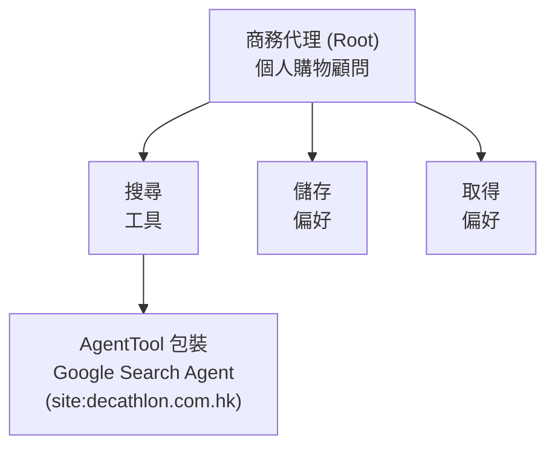
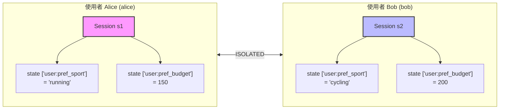
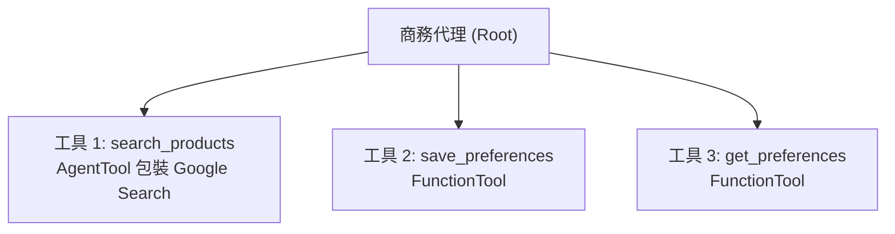
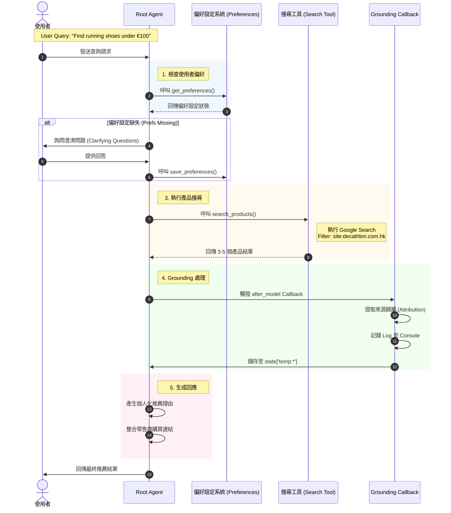

# 端對端實作 01：具備對話持久性的生產級商務代理 (End-to-End Implementation 01: Production Commerce Agent with Session Persistence)

這是一個 **生產就緒的端對端實作** 商務代理，展示了 ADK v1.17.0 在乾淨、可維護的架構中的基本功能。該代理處理真實的電子商務場景，包括：

- **Grounding Metadata 擷取**：從 Google 搜尋結果中擷取來源歸屬。
- **多用戶對話管理**：使用 ADK 狀態隔離 (`user:` 前綴)。
- **產品探索**：透過 Google 搜尋並進行特定網站過濾 (Decathlon)。
- **個人化推薦**：基於儲存的使用者偏好。
- **型別安全的工具介面**：使用 TypedDict 模式。
- **綜合測試**：涵蓋單元測試、整合測試和端對端測試。
- **可選的 SQLite 持久性**：用於在應用程式重啟後仍能保留的對話。

本教學將教您如何建構乾淨、可測試且遵循 ADK 最佳實踐的代理，並從開發擴展到生產部署。

**主要實作亮點：**
- ✅ **簡單架構**：一個 Root Agent 搭配 3 個工具 (非複雜的多代理系統)。
- ✅ **Grounding Callback**：擷取並監控 Google Search 來源歸屬。
- ✅ **兩種持久性模式**：ADK 狀態 (預設) 或 SQLite (可選)。
- ✅ **Vertex AI 就緒**：針對 Vertex AI 進行優化，並提供 Gemini API 作為備案。
- ✅ **TypedDict 安全性**：具備 IDE 自動完成功能的型別安全工具回傳。

## 先決條件 (Prerequisites)

- ✅ 完成教學 01-34 (特別是 #08 狀態記憶體、#11 內建工具、#19 Artifacts)。
- ✅ Python 3.9 或更高版本。
- ✅ 具備 Gemini 存取權限的 Google API Key。
- ✅ SQLite3 (通常在 macOS/Linux 上預裝)。
- ✅ 理解 async/await 模式。
- ✅ 熟悉 pytest 和測試。

## 核心概念 (Core Concepts)

### 1. 簡單代理架構 (Simple Agent Architecture)

此實作使用 **乾淨的單一代理設計**，搭配三個工具：



**為什麼採用這種方法？**

- ✅ 更易於理解和維護。
- ✅ 遵循官方範例中的 ADK 最佳實踐。
- ✅ 更易於測試和除錯。
- ✅ 生產就緒，無需過度設計。

### 2. 多用戶狀態隔離 (Multi-User State Isolation)

代理使用 ADK 內建的狀態管理與 `user:` 前綴來實現跨對話的持久性：



每個使用者擁有完全隔離的偏好設定。

**關鍵點**：ADK 狀態中的 `user:` 前綴自動提供多用戶隔離。基本使用案例不需要複雜的資料庫設定。

### 3. 狀態管理深入探討 (State Management Deep Dive)

代理針對不同的資料生命週期正確使用 ADK 狀態範圍：

| 範圍 (Scope) | 前綴 (Prefix) | 生命週期 (Lifetime) | 範例 (Example) |
|---|---|---|---|
| Session | none | 當前聊天 | `current_query` |
| User | `user:` | 跨對話 | `user:pref_sport` |
| App | `app:` | 全域共用 | `app:product_cache` |
| Temp | `temp:` | 當前調用 | `temp:grounding_sources` |

**運作方式：**

```python
# 在 save_preferences 工具中
def save_preferences(sport: str, budget_max: int, ..., tool_context: ToolContext):
    # 儲存至使用者範圍狀態 (跨對話持久化)
    tool_context.state["user:pref_sport"] = sport
    tool_context.state["user:pref_budget"] = budget_max
    # ✅ 此資料在使用者開始新的聊天對話時仍然存在

# 在 get_preferences 工具中
def get_preferences(tool_context: ToolContext):
    # 檢索使用者範圍狀態
    sport = tool_context.state.get("user:pref_sport")
    budget = tool_context.state.get("user:pref_budget")
    # ✅ 回傳先前對話儲存的偏好
```

**關鍵**：帶有 `user:` 前綴的使用者範圍資料提供多用戶隔離。使用者 "alice" 無法存取使用者 "bob" 的偏好。

### 4. 可選的 SQLite 持久性 (Optional SQLite Persistence)

雖然 ADK 狀態 (`user:` 前綴) 能處理大多數使用案例，但實作也支援 SQLite 以實現完整的對話持久性：

**可用兩種模式：**

1.  **ADK 狀態 (預設)**：`make dev`
    - 簡單，開箱即用。
    - 偏好設定跨調用持久化。
    - 應用程式重啟後對話遺失。

2.  **SQLite (進階)**：`make dev-sqlite`
    - 保留完整的對話歷史記錄。
    - 對話在應用程式重啟後仍然存在。
    - SQL 查詢能力。

```python
# SQLite 模式 (可選)
# SQLite mode (optional)
from google.adk.sessions import DatabaseSessionService

session_service = DatabaseSessionService(
    db_url="sqlite:///./commerce_sessions.db?mode=wal"
)

# 或使用 CLI：
# Or use CLI:
# adk web --session_service_uri "sqlite:///./sessions.db?mode=wal"
```

**何時使用 SQLite：**
- ✅ 需要跨重啟的對話歷史記錄。
- ✅ 想要 SQL 查詢能力。
- ✅ 生產部署需求。

**何時 ADK 狀態足夠：**
- ✅ 簡單的使用者偏好 (運動、預算、經驗)。
- ✅ 開發和測試。
- ✅ 單一伺服器部署。

### 5. Grounding Metadata 擷取 (Grounding Metadata Extraction) (v1.17.0 新增)

此實作的一個關鍵功能是 **grounding callback**，它從 Google 搜尋結果中擷取來源歸屬：

```python
from commerce_agent import create_grounding_callback
from google.adk.runners import Runner

runner = Runner(
    agent=root_agent,
    after_model_callbacks=[create_grounding_callback(verbose=True)]
)
```

**擷取內容：**

- ✅ 來自 grounding chunks 的來源 URL 和標題。
- ✅ 網域名稱 (例如 "decathlon.com.hk", "alltricks.com")。
- ✅ 片段層級歸屬 (哪些來源支援哪些聲明)。
- ✅ 基於多來源一致性的信心分數。

**控制台輸出範例：**

```text
====================================================================
✓ GROUNDING METADATA EXTRACTED
====================================================================
Total Sources: 5

Sources:
  1. [decathlon.com.hk] Brooks Divide 5 - Trail Running Shoes
  2. [alltricks.com] Brooks Divide 5 - €95 Free Shipping
  3. [runningwarehouse.com] Brooks Divide 5 Review

Grounding Supports: 8 segments
  1. [high] "Brooks Divide 5 costs €95" (3 sources)
  2. [medium] "ideal for beginner trail runners" (2 sources)
  ... and 6 more
====================================================================
```

**為什麼這很重要：**

- ✅ **透明度**：使用者可以看到哪些零售商/來源支援每個聲明。
- ✅ **信任**：多個來源 = 推薦的信心度更高。
- ✅ **除錯**：控制台日誌有助於在開發期間驗證搜尋品質。
- ✅ **防幻覺**：驗證 URL 是否來自真實的搜尋結果。

## 架構概覽 (Architecture Overview)

### 代理結構 (Agent Structure)

商務代理使用 **簡單、可維護的架構**：



**沒有複雜的子代理**。這種設計：

- ✅ 遵循官方範例中的 ADK 最佳實踐。
- ✅ 更易於測試 (移動部件更少)。
- ✅ 更清晰的除錯 (單一代理流程)。
- ✅ 生產就緒，無需過度設計。

### 資料流 (Data Flow)



## 資料庫架構 (Database Schema)

實作包含一個 **簡單的 SQLite 資料庫**，由偏好工具用於儲存歷史資料和最愛。這是 **可選的** 且與 ADK 的對話管理分開。

**資料庫檔案**：`commerce_agent_sessions.db` (自動建立)

```sql
-- 使用者偏好 (由 save_preferences/get_preferences 工具管理)
CREATE TABLE user_preferences (
    user_id TEXT PRIMARY KEY,
    preferences_json TEXT,  -- JSON: {sports, price_range, brands}
    updated_at TIMESTAMP DEFAULT CURRENT_TIMESTAMP
);

-- 互動歷史記錄用於分析 (可選)
CREATE TABLE interaction_history (
    id INTEGER PRIMARY KEY AUTOINCREMENT,
    user_id TEXT NOT NULL,
    session_id TEXT NOT NULL,
    query TEXT,
    result_count INTEGER,
    timestamp TIMESTAMP DEFAULT CURRENT_TIMESTAMP
);

-- 最愛產品 (可選)
CREATE TABLE user_favorites (
    id INTEGER PRIMARY KEY AUTOINCREMENT,
    user_id TEXT NOT NULL,
    product_id TEXT,
    product_name TEXT,
    url TEXT,
    added_at TIMESTAMP DEFAULT CURRENT_TIMESTAMP
);
```

**重要澄清：**

1.  **ADK 狀態 vs 資料庫**：代理主要使用 ADK 的 `user:` 狀態來儲存偏好。資料庫用於額外功能 (歷史記錄、最愛)。

2.  **不用於 ADK 對話**：此資料庫不儲存 ADK 對話資料。為此，請使用 `DatabaseSessionService` 搭配 `make dev-sqlite`。

3.  **初始化**：資料庫透過 `init_database()` 呼叫在第一次 `make setup` 時自動建立。

## 實作深入探討 (Implementation Deep Dive)

### 步驟 1：設定與執行 (Setup and Running)

```bash
# 導航至教學目錄
# Navigate to the tutorial
cd tutorial_implementation/commerce_agent_e2e

# 選項 1：僅安裝依賴項
# Option 1: Install dependencies only
make setup

# 選項 2：使用 Vertex AI 驗證進行設定 (建議)
# Option 2: Setup with Vertex AI authentication (recommended)
make setup-vertex-ai  # Interactive script to configure service account

make setup

# 執行所有測試
# Run all tests
make test

# 啟動開發 UI (ADK 狀態持久性)
# Start development UI (ADK state persistence)
make dev

# 或以 SQLite 持久性啟動 (重啟後仍存在)
# OR start with SQLite persistence (survives restarts)
make dev-sqlite
```

### 步驟 2：了解工具實作 (Understanding the Tool Implementations)

#### 工具 1：產品搜尋 (AgentTool 包裝 Google Search)

```python
from google.adk.agents import Agent
from google.adk.tools.agent_tool import AgentTool
from google.adk.tools.google_search_tool import google_search

# 具備 Google Search grounding 的搜尋代理
_search_agent = Agent(
    model="gemini-2.5-flash",
    name="sports_product_search",
    description="使用具備 grounding 功能的 Google Search 搜尋運動產品",
    instruction="""搜尋運動產品並提供詳細資訊。

    搜尋時：
    1. 使用全面的查詢，例如 "2025 年 100 歐元以下的最佳越野跑鞋"
    2. 提取關鍵產品資訊：名稱、品牌、價格、功能
    3. **關鍵**：顯示來自搜尋結果的 URL，並附上清晰的零售商歸屬
    4. 呈現 3-5 個帶有可點擊連結的產品

    回應格式：
    - 產品名稱和品牌
    - 價格 (歐元)
    - 主要功能 (2-3 個要點)
    - **購買連結**：顯示可見的零售商網域
    - 簡要說明為何它符合使用者需求
    """,
    tools=[google_search],
)

# 匯出為 AgentTool 以在主代理中使用
search_products = AgentTool(agent=_search_agent)
```

**關鍵點：**

- ✅ 使用 AgentTool 模式包裝 Google Search agent。
- ✅ 透過查詢參數 (例如 "site:decathlon.com.hk") 進行網站限制搜尋。
- ✅ Google Search 自動擷取 Grounding metadata。
- ✅ 搭配 Vertex AI (Gemini API 有 site: 運算子限制) 效果最佳。

#### 工具 2：儲存偏好 (FunctionTool)

```python
from typing import Dict, Any
from google.adk.tools import ToolContext

def save_preferences(
    sport: str,
    budget_max: int,
    experience_level: str,
    tool_context: ToolContext
) -> Dict[str, Any]:
    """儲存使用者偏好以用於個人化推薦。"""
    try:
        # 儲存至使用者狀態 (跨對話持久化)
        # Save to user state (persists across sessions)
        tool_context.state["user:pref_sport"] = sport
        tool_context.state["user:pref_budget"] = budget_max
        tool_context.state["user:pref_experience"] = experience_level

        return {
            "status": "success",
            "report": f"✓ Preferences saved: {sport}, max €{budget_max}, {experience_level} level",
            "data": {
                "sport": sport,
                "budget_max": budget_max,
                "experience_level": experience_level
            }
        }
    except Exception as e:
        return {
            "status": "error",
            "report": f"Failed to save preferences: {str(e)}",
            "error": str(e)
        }
```

**關鍵點：**

- ✅ 使用 `tool_context.state["user:*"]` 進行跨對話持久性。
- ✅ 回傳符合 ToolResult TypedDict 的結構化 dict (但不在簽名中)。
- ✅ 使用描述性訊息進行適當的錯誤處理。
- ✅ 簡單且可測試。

#### 工具 3：取得偏好 (FunctionTool)

```python
def get_preferences(tool_context: ToolContext) -> Dict[str, Any]:
    """檢索已儲存的使用者偏好。"""
    """Retrieve saved user preferences."""
    try:
        state = tool_context.state

        prefs = {
            "sport": state.get("user:pref_sport"),
            "budget_max": state.get("user:pref_budget"),
            "experience_level": state.get("user:pref_experience")
        }

        # 過濾掉 None 值
        # Filter out None values
        prefs = {k: v for k, v in prefs.items() if v is not None}

        if not prefs:
            return {
                "status": "success",
                "report": "No preferences saved yet",
                "data": {}
            }

        return {
            "status": "success",
            "report": f"Retrieved preferences: {', '.join(f'{k}={v}' for k, v in prefs.items())}",
            "data": prefs
        }
    except Exception as e:
        return {
            "status": "error",
            "report": f"Failed to retrieve preferences: {str(e)}",
            "error": str(e),
            "data": {}
        }
```

**關鍵點：**

- ✅ 從 `user:*` 狀態鍵讀取。
- ✅ 優雅地處理遺失的偏好。
- ✅ 回傳一致的格式。

### 步驟 3：Grounding Callback

```python
from commerce_agent.callbacks import create_grounding_callback

def create_grounding_callback(verbose: bool = True):
    """建立 grounding metadata 擷取 callback。

    回傳：
        用於 Runner 的非同步 callback 函式
    """

    Returns:
        Async callback function for use with Runner
    """

    async def extract_grounding_metadata(callback_context, llm_response):
        """從 LLM 回應中擷取 grounding metadata。"""
        if not hasattr(llm_response, 'candidates'):
            return None

        candidate = llm_response.candidates[0]
        if not hasattr(candidate, 'grounding_metadata'):
            return None

        metadata = candidate.grounding_metadata

        # 從 grounding_chunks 擷取來源
        # Extract sources from grounding_chunks
        sources = []
        if hasattr(metadata, 'grounding_chunks'):
            for chunk in metadata.grounding_chunks:
                if hasattr(chunk, 'web') and chunk.web:
                    sources.append({
                        "title": chunk.web.title,
                        "uri": chunk.web.uri,
                        "domain": extract_domain(chunk.web.uri)
                    })

        # 儲存在當前調用的暫存狀態中
        # Store in temp state for current invocation
        callback_context.state["temp:_grounding_sources"] = sources

        if verbose:
            print(f"\n{'='*60}")
            print("✓ GROUNDING METADATA EXTRACTED")
            print(f"Total Sources: {len(sources)}")
            for i, source in enumerate(sources, 1):
                print(f"  {i}. [{source['domain']}] {source['title']}")
            print(f"{'='*60}\n")

        return None  # ADK callbacks return None

    return extract_grounding_metadata
```

**與 Runner 一起使用：**

```python
from google.adk.runners import Runner
from commerce_agent import root_agent, create_grounding_callback

runner = Runner(
    agent=root_agent,
    after_model_callbacks=[create_grounding_callback(verbose=True)]
)
```

**關鍵點：**

- ✅ 基於函式的 callback (非基於類別)。
- ✅ 放在 Runner 的 `after_model_callbacks` 中，而非 Agent。
- ✅ 從 grounding_chunks 擷取來源 URL、標題、網域。
- ✅ 控制台日誌用於開發可見性。
- ✅ 儲存在 `temp:` 狀態 (僅當前調用)。

### 步驟 3：對話管理測試 (Session Management Testing)

本教學包含對話隔離的綜合測試：

```python
@pytest.mark.asyncio
async def test_multi_user_session_isolation():
    """驗證使用者無法存取彼此的狀態"""
    """Verify users cannot access each other's state"""
    service = DatabaseSessionService(db_url="sqlite:///:memory:")

    # Alice 設定運動偏好
    # Alice sets sport preference
    alice = await service.create_session(
        "commerce_agent", "alice", "session1",
        state={"user:sport": "running"}
    )

    # Bob 設定不同的偏好
    # Bob sets different preference
    bob = await service.create_session(
        "commerce_agent", "bob", "session1",
        state={"user:sport": "cycling"}
    )

    # 驗證隔離
    # Verify isolation
    alice_session = await service.get_session("commerce_agent", "alice", "session1")
    assert alice_session.state["user:sport"] == "running"

    bob_session = await service.get_session("commerce_agent", "bob", "session1")
    assert bob_session.state["user:sport"] == "cycling"

    # 跨用戶存取必須失敗
    # Cross-user access must fail
    with pytest.raises(Exception):
        await service.get_session("commerce_agent", "alice", "session1_bob_data")
```

### 步驟 4：使用 `adk web` 進行測試 (Testing with `adk web`)

一旦執行，進行互動式測試：

1. **測試偏好工作流程**：
   - 開啟 http://localhost:8000
   - 從下拉選單選擇 "commerce_agent"
   - 輸入："I want running shoes"
   - Agent 應呼叫 `get_preferences` → 詢問預算和經驗
   - 輸入："Under 150 euros, I'm a beginner"
   - Agent 應呼叫 `save_preferences` → 確認已儲存 ✅

2. **測試產品搜尋**：
   - 輸入："Find trail running shoes"
   - Agent 呼叫 `search_products`
   - 驗證結果包含 Decathlon 產品 ✅
   - 檢查終端機是否有 grounding metadata 擷取日誌

3. **測試偏好持久性**：
   - 重新整理瀏覽器 (新對話，相同使用者)
   - 輸入："What are my preferences?"
   - Agent 應從先前對話檢索已儲存的偏好 ✅

4. **測試個人化推薦**：
   - 輸入："Recommend something for me"
   - Agent 應參考已儲存的運動/預算/經驗 ✅
   - 推薦應針對初學者等級量身打造

**關於多用戶測試的注意事項**：`adk web` UI 沒有 User ID 輸入。要測試多用戶隔離，請直接使用 API 端點 (參閱 `docs/TESTING_WITH_USER_IDENTITIES.md` 或執行 `make test-guide`)。

## 完整測試工作流程 (Complete Testing Workflow)

### 測試組織 (Test Organization)

測試套件遵循清晰的結構：

```text
tests/
├── conftest.py                    # Test fixtures and configuration
├── test_tools.py                  # Unit tests for individual tools
├── test_integration.py            # Integration tests (agent + tools)
├── test_e2e.py                    # End-to-end user scenarios
├── test_agent_instructions.py     # Agent prompt/instruction tests
└── test_callback_and_types.py     # Callback and TypedDict tests
```

### 第 1 層：單元測試 (Tier 1: Unit Tests)

```bash
pytest tests/test_tools.py -v
```

**測試：**

- ✅ `save_preferences` 正確將資料儲存在 ADK 狀態中。
- ✅ `get_preferences` 從狀態中檢索資料。
- ✅ 工具回傳格式符合 ToolResult TypedDict 結構。
- ✅ 錯誤處理具有適當的 status/report 欄位。
- ✅ 優雅地處理遺失的偏好。

### 第 2 層：整合測試 (Tier 2: Integration Tests)

```bash
pytest tests/test_integration.py -v
```

**測試：**

- ✅ 代理設定有效 (模型、名稱、描述)。
- ✅ 代理正確附加了所有 3 個工具。
- ✅ 工具匯入正常 (search_products, save_preferences, get_preferences)。
- ✅ 套件結構正確。
- ✅ Grounding callback 成功匯入。

### 第 3 層：端對端測試 (Tier 3: End-to-End Tests)

```bash
pytest tests/test_e2e.py -v
```

**測試：**

- ✅ 完整的新使用者工作流程 (設定偏好 → 搜尋 → 取得推薦)。
- ✅ 回訪客戶場景 (偏好跨對話持久化)。
- ✅ 多用戶隔離 (Alice 的偏好不影響 Bob)。
- ✅ 資料庫操作 (若使用可選的 SQLite 功能)。
- ✅ 錯誤復原場景。

### 第 4 層：代理指令測試 (Tier 4: Agent Instruction Tests)

```bash
pytest tests/test_agent_instructions.py -v
```

**測試：**

- ✅ 代理指令包含偏好工作流程步驟。
- ✅ 指令提及所有 3 個工具。
- ✅ 顧問角色存在。
- ✅ 指定產品呈現格式。

### 第 5 層：Callback 和類型測試 (Tier 5: Callback and Type Tests)

```bash
pytest tests/test_callback_and_types.py -v
```

**測試：**

- ✅ Grounding callback 正確建立函式。
- ✅ TypedDict 結構可匯入。
- ✅ ToolResult 符合預期格式。
- ✅ Callback 可以附加到 Runner。

### 執行所有測試並包含覆蓋率 (Run All Tests with Coverage)

```bash
make test
# Runs: pytest tests/ -v --cov=commerce_agent --cov-report=html
# Generates: htmlcov/index.html (opens automatically in browser)
```

**預期結果：**

- ✅ 14+ 測試通過。
- ✅ 85%+ 程式碼覆蓋率。
- ✅ 無匯入錯誤。
- ✅ 所有測試層級為綠色。

## 展示的主要功能 (Key Features Demonstrated)

### 1. Grounding Metadata 擷取 (新功能)

Grounding callback 從 Google 搜尋中擷取來源歸屬：

```python
from commerce_agent import create_grounding_callback
from google.adk.runners import Runner

runner = Runner(
    agent=root_agent,
    after_model_callbacks=[create_grounding_callback(verbose=True)]
)
```

**提供的功能：**

- ✅ 來自 grounding_chunks 的來源 URL 和標題。
- ✅ 網域擷取 (例如 "decathlon.com.hk")。
- ✅ 片段層級歸屬 (哪些來源支援哪些聲明)。
- ✅ 用於除錯的控制台日誌。
- ✅ 防幻覺驗證。

### 2. ADK 狀態管理 (主要方法)

使用 `user:` 前綴進行跨對話持久性：

```python
def save_preferences(..., tool_context: ToolContext):
    tool_context.state["user:pref_sport"] = sport
    tool_context.state["user:pref_budget"] = budget
    # ✅ Persists across invocations, isolated by user
```

**優點：**

- ✅ 無需設定。
- ✅ 自動多用戶隔離。
- ✅ 適用於任何 ADK 部署 (web, CLI, API)。
- ✅ 非常適合簡單的鍵值偏好。

### 3. 可選的 SQLite 持久性 (進階)

透過 `make dev-sqlite` 提供完整的對話歷史記錄：

```python
from google.adk.sessions import DatabaseSessionService

session_service = DatabaseSessionService(
    db_url="sqlite:///./commerce_sessions.db?mode=wal"
)

# 或透過 CLI：
# Or via CLI:
# adk web --session_service_uri "sqlite:///./sessions.db?mode=wal"
```

**何時使用：**

- ✅ 需要跨重啟的對話歷史記錄。
- ✅ 想要 SQL 查詢能力。
- ✅ 審計追蹤的生產需求。

### 4. TypedDict 用於型別安全 (TypedDict for Type Safety)

所有工具回傳帶有 TypedDict 提示的結構化 dict：

```python
from commerce_agent.types import ToolResult

def my_tool(...) -> Dict[str, Any]:  # 在簽名中使用 Dict (ADK 需求)
    result: ToolResult = {           # 可以使用 TypedDict 進行提示
        "status": "success",
        "report": "Operation completed",
        "data": {"key": "value"}
    }
    return result  # ✅ IDE autocomplete + type checking
```

**優點：**

- ✅ 完整的 IDE 自動完成。
- ✅ 使用 mypy 進行型別檢查。
- ✅ 清晰的 API 合約。
- ✅ 保持 ADK 相容性。

### 5. 簡單代理協調 (Simple Agent Coordination)

搭配專用工具的乾淨單一代理設計：

```python
root_agent = Agent(
    model="gemini-2.5-flash",
    name="commerce_agent",
    tools=[
        search_products,              # AgentTool (包裝 Google Search)
        FunctionTool(func=save_preferences),
        FunctionTool(func=get_preferences),
    ]
)
```

**為什麼採用這種方法：**

- ✅ 比多代理協調更簡單。
- ✅ 更易於測試和除錯。
- ✅ 遵循官方 ADK 範例。
- ✅ 生產就緒，無需過度設計。

## 驗證與設定 (Authentication & Setup)

### ⚠️ 關鍵：Vertex AI vs Gemini API

該代理適用於兩種驗證方法，但有主要差異：

| 功能 (Feature) | Vertex AI | Gemini API |
|---|---|---|
| **Google Search** | ✅ 完整支援 | ⚠️ 有限 |
| **site: operator** | ✅ 可用 | ❌ 不可用 |
| **搜尋品質** | ✅ 優異 | ⚠️ 混合結果 |
| **Grounding** | ✅ 完整 metadata | ⚠️ 部分 |
| **生產環境** | ✅ 建議 | ❌ 僅限開發 |

**Gemini API 的問題**：`site:decathlon.com.hk` 搜尋運算子不起作用，導致代理回傳來自 Amazon、eBay、Adidas 和其他非 Decathlon 零售商的結果。這破壞了核心產品探索流程。

### 設定選項 1：Vertex AI (建議)

```bash
# 導航至教學
# Navigate to tutorial
cd tutorial_implementation/commerce_agent_e2e

# 執行互動式設定腳本
# Run interactive setup script
make setup-vertex-ai

# 依照提示進行：
# 1. 在 ./credentials/commerce-agent-key.json 驗證服務帳戶
# 2. 取消設定任何衝突的 API keys
# 3. 設定 GOOGLE_CLOUD_PROJECT 和 GOOGLE_APPLICATION_CREDENTIALS
# 4. 測試驗證

# 然後安裝依賴項
# Then install dependencies
make setup
```

`setup-vertex-ai` 腳本處理：

- ✅ 服務帳戶驗證。
- ✅ 環境變數設定。
- ✅ 憑證測試。
- ✅ 衝突解決 (若設定了 GOOGLE_API_KEY 則移除)。

### 設定選項 2：Gemini API (有限)

```bash
# 從 https://aistudio.google.com/app/apikey 取得 API key
export GOOGLE_API_KEY=your_key_here

# 安裝依賴項
# Install dependencies
cd tutorial_implementation/commerce_agent_e2e
make setup
```

**已知限制**：搜尋將回傳非 Decathlon 的結果。

### 驗證驗證 (Verifying Authentication)

```bash
# 檢查哪些憑證處於活動狀態
echo $GOOGLE_API_KEY
echo $GOOGLE_APPLICATION_CREDENTIALS

# 若兩者皆設定，Vertex AI 優先
# 若需要，手動取消設定 API key：
unset GOOGLE_API_KEY

# 重啟代理
make dev
```

## 部署場景 (Deployment Scenarios)

### 本地開發 (Local Development)

```bash
# 選項 1：ADK 狀態 (簡單，偏好跨調用持久化)
make dev

# 選項 2：SQLite (完整歷史記錄，重啟後仍存在)
make dev-sqlite

# Access at http://localhost:8000
```

### 生產環境 (Cloud Run)

```bash
# 使用 Vertex AI
export GOOGLE_APPLICATION_CREDENTIALS=/path/to/service-account.json

# 選項 1：ADK 狀態 (簡單)
adk deploy cloud_run --name commerce-agent

# 選項 2：SQLite 持久性
adk deploy cloud_run \
  --name commerce-agent \
  --session_service_uri "sqlite:///./sessions.db?mode=wal"
```

### 企業規模 (Agent Engine + Cloud Spanner)

```bash
# 部署至 Agent Engine 搭配 Cloud Spanner 持久性
adk deploy agent_engine \
  --name commerce-agent \
  --session_service_uri "spanner://projects/MY_PROJECT/instances/MY_INSTANCE/databases/commerce"
```

**Cloud Spanner 的優點：**

- ✅ 多區域部署。
- ✅ 自動擴展。
- ✅ 高可用性 (99.999% SLA)。
- ✅ ACID 事務。
- ✅ SQL 查詢能力。

## 成功標準 (Success Criteria)

當發生以下情況時，您就知道一切正常：

- ✅ 所有 14+ 測試通過 (`make test`)
- ✅ Agent 啟動無錯誤 (`make dev`)
- ✅ Agent 出現在 [http://localhost:8000](http://localhost:8000) 的下拉選單中
- ✅ Agent 在對話開始時呼叫 `get_preferences`
- ✅ 當使用者提供資訊時，Agent 呼叫 `save_preferences`
- ✅ Agent 使用 Google Search 搜尋產品
- ✅ 偏好在瀏覽器重新整理後仍然存在
- ✅ Grounding metadata 出現在伺服器日誌 (終端機) 中
- ✅ 產品推薦包含 Decathlon 連結
- ✅ 無 "site: operator" 問題 (若使用 Vertex AI)

## 常見問題與解決方案 (Common Issues & Solutions)

| 問題 | 解決方案 |
|---|---|
| Agent 不在下拉選單中 | 在教學根目錄執行 `pip install -e .` |
| 搜尋回傳非 Decathlon 結果 | 使用 Gemini API - 切換至 Vertex AI |
| "site: operator 不起作用" | 執行 `make setup-vertex-ai` |
| 測試因 auth 錯誤失敗 | 設定憑證 (參閱驗證章節) |
| Grounding metadata 不可見 | 檢查終端機日誌 (不在 UI 中) |
| 偏好未持久化 | 驗證狀態鍵中的 `user:` 前綴 |
| 同時設定了 API key 和 SA | 取消設定 GOOGLE_API_KEY (Vertex AI 優先) |
| 資料庫鎖定錯誤 | 僅在使用 SQLite 模式時發生，重啟 dev |

### 詳細故障排除 (Detailed Troubleshooting)

#### 問題：搜尋回傳錯誤的零售商

**症狀**：代理推薦來自 Amazon、eBay、Adidas 的產品，而非 Decathlon。

**原因**：使用 Gemini API 而非 Vertex AI。`site:decathlon.com.hk` 運算子不適用於 Gemini API。

**解決方案**：

```bash
# 1. 檢查哪個 auth 處於活動狀態
echo $GOOGLE_API_KEY
echo $GOOGLE_APPLICATION_CREDENTIALS

# 2. 若設定了 GOOGLE_API_KEY，取消設定
unset GOOGLE_API_KEY

# 3. 執行 Vertex AI 設定
make setup-vertex-ai

# 4. 重啟代理
make dev
```

#### 問題：Grounding Metadata 未顯示

**預期行為**：Grounding metadata 出現在 **終端機日誌** 中，而非 Web UI。

**查看位置**：

```bash
# 呼叫 search_products 後的終端機輸出：
====================================================================
✓ GROUNDING METADATA EXTRACTED
====================================================================
Total Sources: 5
  1. [decathlon.com.hk] Brooks Divide 5...
  2. [alltricks.com] Brooks Divide 5...
====================================================================
```

**注意**：要在 UI 中顯示 grounding，您需要自定義前端整合 (CopilotKit 或 React 元件)。

#### 問題：偏好未持久化

**檢查**：

1. 驗證工具使用 `user:` 前綴：

```python
tool_context.state["user:pref_sport"] = sport  # ✅ Correct
tool_context.state["pref_sport"] = sport       # ❌ Wrong (session only)
```

2. 檢查代理指令是否提及偏好工作流程。
3. 驗證使用者未在對話之間更改 User ID。

## 您將學到什麼 (What You'll Learn)

完成此實作後，您將掌握：

1. **簡單代理設計**：搭配專用工具的乾淨單一代理。
2. **ADK 狀態管理**：用於多用戶隔離的使用者範圍狀態。
3. **Grounding Metadata**：擷取和監控 Google Search 來源。
4. **TypedDict 安全性**：具備 IDE 支援的型別安全工具回傳。
5. **Function Tools**：簡單、可測試的工具實作。
6. **測試模式**：單元、整合和端對端測試組織。
7. **驗證**：Vertex AI vs Gemini API 的權衡。
8. **生產部署**：Cloud Run、Agent Engine 和 Spanner 選項。

**主要收穫**：

- ✅ 從簡單開始 (單一代理)，然後再變複雜 (多代理)。
- ✅ 使用 ADK 狀態儲存偏好 (除非您需要 SQL 查詢)。
- ✅ 網站限制搜尋需要 Vertex AI。
- ✅ Grounding callback 提供透明度和防幻覺。
- ✅ TypedDict 有幫助，但無法在工具簽名中使用 (ADK 限制)。

## 下一步 (Next Steps)

完成本教學後：

1. **自定義提示**：編輯 `commerce_agent/prompt.py` 以獲得不同的個性。
2. **新增更多工具**：建立用於購物車管理、訂單追蹤、評論的工具。
3. **整合前端**：使用 CopilotKit 建立具備 grounding 顯示的自定義 UI。
4. **切換至 SQLite**：嘗試 `make dev-sqlite` 以獲得持久的對話歷史記錄。
5. **部署至生產環境**：使用 `adk deploy cloud_run` 搭配 Vertex AI。
6. **新增分析**：追蹤使用者行為、熱門產品、搜尋模式。
7. **實作 ML 推薦**：使用 Vertex AI 預測進行個人化。

## 參考資料 (References)

### 官方資源 (Official Resources)

- [ADK Documentation](https://google.github.io/adk-docs/)
- [State Management Guide](https://google.github.io/adk-docs/state/)
- [Google Search Tool](https://google.github.io/adk-docs/tools/google-search/)
- [Session Service](https://google.github.io/adk-docs/sessions/)
- [Testing Guide](https://google.github.io/adk-docs/get-started/testing/)
- [Deployment Options](https://google.github.io/adk-docs/deployment/)

### 官方實作檔案 (Implementation Files)

- [Source Code](https://github.com/raphaelmansuy/adk_training/tree/main/tutorial_implementation/commerce_agent_e2e)
- [Agent Definition](https://github.com/raphaelmansuy/adk_training/tree/main/tutorial_implementation/commerce_agent_e2e/commerce_agent/agent.py)
- [Tools](https://github.com/raphaelmansuy/adk_training/tree/main/tutorial_implementation/commerce_agent_e2e/commerce_agent/tools/)
- [Callback](https://github.com/raphaelmansuy/adk_training/tree/main/tutorial_implementation/commerce_agent_e2e/commerce_agent/callbacks.py)
- [Test Suite](https://github.com/raphaelmansuy/adk_training/tree/main/tutorial_implementation/commerce_agent_e2e/tests)
- [README](https://github.com/raphaelmansuy/adk_training/tree/main/tutorial_implementation/commerce_agent_e2e/README.md)

### 額外文件 (Additional Documentation)

- `docs/GROUNDING_CALLBACK_GUIDE.md` - 完整 grounding metadata 使用方式
- `docs/SQLITE_SESSION_PERSISTENCE_GUIDE.md` - SQLite 持久性深入探討
- `docs/TESTING_WITH_USER_IDENTITIES.md` - 透過 API 進行多用戶測試
- `TESTING_GUIDE.md` - 測試說明與除錯

## 程式碼實現 (Code Implementation)

- Commerce Agent E2E：[程式碼連結](../../../python/agents/commerce-agent-e2e/)
