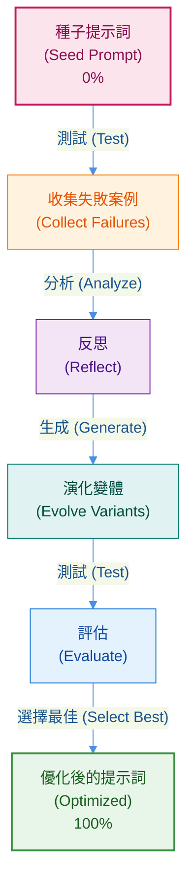

# 進階教學：基於 GEPA 的客戶支援代理人提示詞優化 (Advanced Tutorial: GEPA-Based Prompt Optimization for Customer Support Agents)"

## 為什麼：手動提示工程的問題 (Why: The Problem with Manual Prompt Engineering)

您花了數小時調整代理人的提示詞：

```python
# 版本 1：太模糊
"幫助客戶處理退款"
→ 代理人未經身份驗證就處理退款 ❌

# 版本 2：新增一條規則
"幫助客戶處理退款。請先驗證身份。"
→ 代理人忘記檢查 30 天退貨政策 ❌

# 版本 3：又新增一條規則...
# 版本 4：修正了邊界案例...
# 版本 5：仍然失敗... 😤
```

**這個循環永無止境。** 每次修正都會破壞其他部分。您只能猜測什麼才有效。

## 什麼是：GEPA 孕育出更好的提示詞 (What: GEPA Breeds Better Prompts)

將 GEPA 想像成培育犬隻。您不是手動設計每個特徵，而是讓演化來完成工作：

1.  從一個基本的提示詞開始（像一隻混種狗）
2.  在真實場景中測試它（像犬隻競賽）
3.  找出失敗之處（無法取回物品、吠叫過多）
4.  針對失敗創建變體（為特定特徵進行培育）
5.  再次測試，保留最好的，然後重複

**結果：** 您的提示詞自動從 0% 演化到 100% 的成功率。



### 親身體驗 (Choose Your Path)

**快速展示（2 分鐘 - 模擬）：**

```bash
# 進入教學實作目錄
cd tutorial_implementation/tutorial_gepa_optimization
# 設定環境並執行展示
make setup && make demo
```

**真實 GEPA（5-10 分鐘 - 實際 LLM 呼叫）：**

```bash
# 進入教學實作目錄
cd tutorial_implementation/tutorial_gepa_optimization
# 設定環境
make setup
# 設定您的 Google API 金鑰
export GOOGLE_API_KEY="your-api-key"  # 從 https://aistudio.google.com/app/apikey 獲取免費金鑰
# 執行真實展示
make real-demo
```

**您將會看到：**

模擬展示顯示了概念（即時，免費）：

```text
疊代 1: 收集 → 種子提示詞 0/5 通過
疊代 2: 反思 → LLM 識別出缺少安全規則
疊代 3: 演化 → 生成改進的提示詞
疊代 4: 評估 → 演化後的提示詞 5/5 通過
結果: 0% → 100% 改進 ✅
```

真實 GEPA 展示顯示了實際的演化過程（使用 LLM，成本約為 0.05-0.10 美元）：

```text
疊代 1: 收集 → 代理人使用種子提示詞運行，收集實際結果
           反思 → Gemini LLM 分析失敗案例
           演化 → Gemini 根據洞察生成改進的提示詞
           評估 → 測試改進的提示詞
           選擇 → 比較並選擇更好的版本

疊代 2: 使用新的基準重複 - 進一步改進

結果: 透過實際的 LLM 反思實現真正的優化！
```

## 如何運作：5 步驟演化循環 (How: The 5-Step Evolution Loop)

GEPA 很簡單——只需重複 5 個步驟：

### 步驟 1：收集（蒐集證據）(Collect (Gather Evidence))

使用目前的提示詞運行您的代理人。追蹤失敗之處：

```python
測試 1: 客戶使用錯誤的電子郵件 → 代理人仍然批准 ❌
測試 2: 購買日期在 45 天前 → 代理人忽略政策 ❌
測試 3: 有效請求 → 代理人提出不必要的問題 ❌
```

**就像：** 記錄哪些幼犬無法取回球。

### 步驟 2：反思（理解原因）(Reflect (Understand Why))

一個 LLM 分析失敗的原因：

```python
"提示詞沒有說明在批准退款前要驗證電子郵件。
 提示詞沒有提到 30 天政策。
 提示詞對於何時該提問過於模糊。"
```

**就像：** 了解獵犬需要強壯的下顎肌肉和游泳能力。

### 步驟 3：演化（創建變體）(Evolve (Create Variations))

生成新的提示詞以修正問題：

```python
變體 A: 新增 "務必先驗證身份"
變體 B: 新增 "檢查 30 天退貨期限"
變體 C: 結合以上兩項改進
```

**就像：** 培育下顎更強壯且游泳能力更好的幼犬。

### 步驟 4：評估（測試性能）(Evaluate (Test Performance))

針對您的測試場景運行所有變體：

```python
種子提示詞:  0/10 通過 (0%)
變體 A:    4/10 通過 (40%)
變體 B:    6/10 通過 (60%)
變體 C:    9/10 通過 (90%) ← 獲勝者！
```

**就像：** 犬隻競賽的結果 - 變體 C 獲勝。

### 步驟 5：選擇（保留最佳）(Select (Keep the Best))

變體 C 成為您新的基準。從步驟 1 開始，使用更嚴格的測試重複此過程。

```python
疊代 1: 0% → 90%
疊代 2: 90% → 95%
疊代 3: 95% → 98%
...收斂於 99%
```

**就像：** 每一代幼犬在特定任務上的表現都越來越好。

## 快速入門 (5 分鐘) (Quick Start (5 Minutes))

```bash
# 1. 設定
cd tutorial_implementation/tutorial_gepa_optimization
make setup

# 2. 觀察演化過程
make demo

# 3. (可選) 親自嘗試
export GOOGLE_API_KEY="your-key"
make dev  # 開啟 localhost:8000
```

就是這麼簡單！您已經看到 GEPA 的運作方式，現在可以開始實驗了。

ℹ️ 本教學包含模擬和真實的 GEPA (Tutorial Includes Both Simulated and Real GEPA)

**模擬展示** (`make demo` - 2 分鐘):
-   不需 LLM 呼叫，展示 GEPA 概念
-   即時結果，無 API 成本
-   非常適合理解演算法
-   使用模式匹配模擬代理人行為

**真實 GEPA** (`make real-demo` - 5-10 分鐘):
-   ✨ **新功能**: 使用 google-genai 進行實際的 LLM 反思
-   Gemini LLM 分析真實的失敗案例
-   生成真正優化的提示詞
-   每次運行成本約為 0.05-0.10 美元
-   可直接用於生產環境的實作

**本教學提供：**
-   ✅ 完整的 GEPA 實作（模擬與真實）
-   ✅ 可運作的基於 LLM 優化的程式碼
-   ✅ 帶有真實評估的可測試範例
-   ✅ 清晰的學習進程

**用於生產環境的 GEPA 優化：**
-   請參閱 [google/adk-python](https://github.com/google/adk-python/tree/main/contributing/samples/gepa) 中的**完整研究實作**
-   閱讀 `research/gepa/` 目錄中的綜合指南
-   安裝 DSPy：`pip install dspy-ai`
-   參考 [GEPA 論文](https://arxiv.org/abs/2507.19457) 以了解其方法論

引用的性能指標（10-20% 的改進，35 倍更少的推出次數）來自原始研究論文，代表完整研究實作的結果，而非此簡化教學。

💡 從教學到生產 (From Tutorial to Production)

**學習路徑：**
1.  ✅ 完成本教學（2 分鐘）- 理解概念
2.  📚 閱讀 `research/gepa/README.md`（10 分鐘）- 全面概覽
3.  🔬 運行研究實作（30-90 分鐘）- 真正的優化
4.  🚀 將優化的提示詞部署到生產環境

該研究實作包含 640 多行生產程式碼，整合了 tau-bench、基於 LLM 的反思、帕雷托前沿選擇以及並行執行。請參閱 [google/adk-python](https://github.com/google/adk-python/tree/main/contributing/samples/gepa) 以獲取完整實作。

## 深入探究（給好奇的你）(Under the Hood (For the Curious))

此展示使用一個客戶支援代理人，配備 3 個簡單的工具：

1.  **verify_customer_identity** - 檢查訂單 ID + 電子郵件是否匹配
2.  **check_return_policy** - 驗證 30 天退貨期限
3.  **process_refund** - 生成交易 ID

**種子提示詞**（故意設計得很弱）：

```python
"你是一位樂於助人的客戶支援代理人。
 幫助客戶處理他們的請求。
 保持專業和高效率。"
```

**演化後的提示詞**（經過 GEPA）：

```python
"你是一位專業的客戶支援代理人。

關鍵：務必遵守此安全協議：
1. 務必先驗證客戶身份（訂單 ID + 電子郵件）
2. 未經身份驗證，絕不處理任何退款
3. 僅處理 30 天退貨期限內的訂單退款

[...詳細程序和政策...]"
```

**為何有效：** 演化後的提示詞具有種子提示詞所缺乏的明確規則。

### 運行測試 (Run the Tests)

```bash
make test  # 34 個測試驗證一切正常運作
```

## 親自動手 (Try It Yourself)

```bash
cd tutorial_implementation/tutorial_gepa_optimization
make setup && make demo
```

**您將會看到：**

6 個階段展示了完整的演化週期：
-   階段 1：弱的種子提示詞
-   階段 2：測試失敗（0/5 場景通過）
-   階段 3：LLM 對失敗進行反思
-   階段 4：生成演化後的提示詞
-   階段 5：測試通過（5/5 場景通過）
-   階段 6：結果顯示 0% → 100% 的改進

**想要互動模式嗎？**

```bash
make dev  # 在 http://localhost:8000 上開啟 ADK 網站介面
```

親自測試這些場景：
-   "我買了一台筆記型電腦但它壞了，我想要退款"（有效請求）
-   "給我訂單 ORD-12345 的退款"（缺少身份驗證）
-   "我想要退回我 45 天前買的手機的錢"（超出期限）

## 常見問題 (Common Issues)

**匯入錯誤？**
```bash
pip install --upgrade google-genai>=1.15.0
```

**GOOGLE_API_KEY 未設定？**
```bash
export GOOGLE_API_KEY=your_actual_api_key_here
```

**測試失敗？**
```bash
make clean && make setup && make test
```

## 關鍵要點 (Key Takeaways)

**1. GEPA 有效的原因：**
-   系統性地探索多種提示詞變體
-   使用真實的性能數據來引導演化
-   結合來自不同變體的成功元素
-   迭代直到收斂

**2. 種子提示詞很重要：**
-   過於具體 → 限制演化空間
-   過於通用 → 收斂緩慢
-   從一個合理的基準開始

**3. 評估資料集的品質：**
-   具代表性的場景 = 穩健的改進
-   邊界案例很重要
-   在新數據上進行測試以驗證

**4. 避免這些錯誤：**
-   ❌ 過度擬合測試場景
-   ❌ 過早停止
-   ❌ 忽略邊界案例
-   ❌ 未在全新數據上進行驗證

## 後續步驟 (Next Steps)

### 將 GEPA 應用於您自己的代理人 (Apply GEPA to Your Own Agents)

使用本教學中的相同模式：
1.  定義您的評估場景（真實世界的測試案例）
2.  創建一個弱的種子提示詞
3.  運行 GEPA 演化
4.  衡量改進

### 使用標準基準進行驗證 (Validate with Standard Benchmarks)

除了自訂的測試場景外，還可以根據已建立的基準來驗證您經過 GEPA 優化的提示詞：

**[HELM (語言模型整體評估)](https://github.com/stanford-crfm/helm)**
-   史丹佛大學的綜合評估框架
-   衡量準確性、效率、偏見、毒性
-   涵蓋不同領域的 100 多個場景
-   安裝：`pip install crfm-helm`

```bash
# 使用 HELM 評估您的代理人
helm-run --run-entries mmlu:subject=customer_service,model=your-agent \
  --suite gepa-validation --max-eval-instances 100
helm-summarize --suite gepa-validation
```

**[DSPy 評估套件](https://github.com/stanfordnlp/dspy)**
-   內建的提示詞優化指標
-   將 GEPA 結果與 DSPy 優化器進行比較
-   GEPA 是 DSPy 生態系統的一部分

**為什麼標準化基準很重要：**
-   與基準進行客觀比較
-   跨團隊的可重現結果
-   追蹤長期的改進
-   在行業標準任務上驗證 GEPA 的效益

### 長期追蹤指標 (Track Metrics Over Time)

-   對您演化後的提示詞進行版本控制
-   在生產環境中進行 A/B 測試（種子 vs 演化後）
-   監控真實世界的性能
-   當指標下降時重新運行 GEPA

### 部署到生產環境 (Deploy to Production)

驗證後：

-   使用演化後的提示詞作為您的生產基準
-   設定監控儀表板
-   安排定期的 GEPA 優化
-   根據真實用戶數據持續改進

## 額外資源 (Additional Resources)

### 官方研究與文件 (Official Research & Documentation)

-   **[GEPA 研究論文](https://arxiv.org/abs/2507.19457)** - Lakshya A Agrawal 等人，史丹佛 NLP（2025 年 7 月）
    -   完整論文："GEPA: Reflective Prompt Evolution Can Outperform Reinforcement Learning"
    -   證明比 GRPO 提高 10-20%，推出次數減少 35 倍
    -   全面的方法論和評估結果

-   **[DSPy 框架](https://github.com/stanfordnlp/dspy)** - 史丹佛 NLP（29.9k+ 星）
    -   GEPA 是 DSPy 生態系統的一部分
    -   文件：[dspy.ai](https://dspy.ai/)
    -   安裝：`pip install dspy-ai`
    -   社群：[Discord 伺服器](https://discord.gg/XCGy2WDCQB)

### 評估基準 (Evaluation Benchmarks)

-   **[HELM](https://github.com/stanford-crfm/helm)** - 語言模型整體評估
    -   史丹佛 CRFM 的綜合評估框架
    -   涵蓋不同領域的 100 多個場景
    -   排行榜：[crfm.stanford.edu/helm](https://crfm.stanford.edu/helm/)

-   **[BIG-bench](https://github.com/google/BIG-bench)** - 超越模仿遊戲
    -   Google 的多樣化任務評估套件
    -   包含 200 多個任務的協作基準

## 程式碼實現 (Code Implementation)
- gepa-optimization-agent  ：[程式碼連結](../../../python/agents/gepa-optimization-agent/)