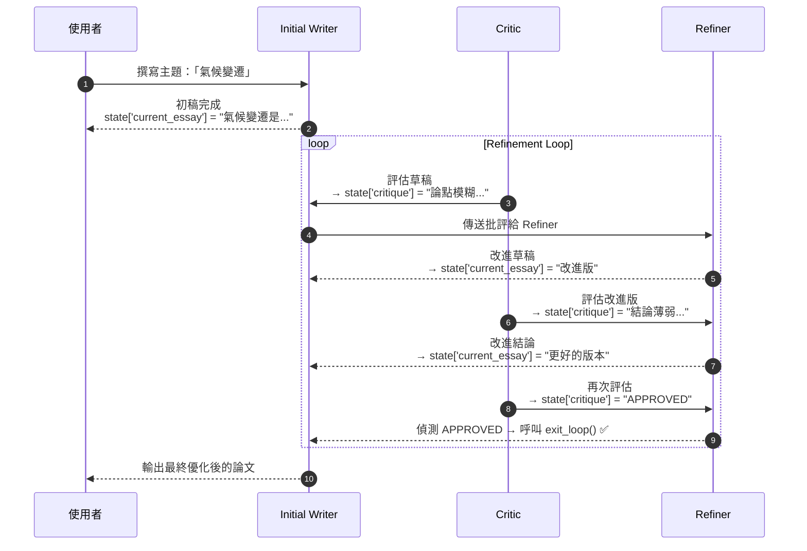

# 教學 07: 循環代理 (Loop Agents) - 迭代優化

## 總覽

本教學將引導您如何使用 **`LoopAgent`** 來建構能夠自我改進的代理系統。您將學習迭代優化的模式，這在對品質要求高於速度的場景中特別有用。透過本教學，您將能建立出能夠批判並持續改進自身工作的代理，直到成果臻於完美。

- **🎯 工作實現範例**: 一個完整且經過測試的文章優化系統可在 [`tutorial_implementation/tutorial07/`](https://github.com/raphaelmansuy/adk_training/tree/main/tutorial_implementation/tutorial07) 中找到。該實現包含全面的測試、文件和易於使用的設定流程。
- **🚀 快速入門**: 若想立即看到實際效果，請直接跳至下方的 [完整工作程式碼](#完整工作程式碼) 部分。

## 先決條件

- **完成教學 01-06** - 理解代理、工作流程和多代理系統。
- **已安裝 ADK** - `pip install google-adk`
- **已設定 API 金鑰** - 來自教學 01。

## 核心概念

### LoopAgent

**`LoopAgent`** 會**迭代地**（在一個循環中）執行子代理，以進行優化和品質提升。與循序（僅運行一次）或平行（同時運行）代理不同，循環代理會**多次**運行相同的代理，直到品質達標或達到限制次數。

**主要特性:**

-   重複在循環中執行子代理。
-   確定性的（非由大型語言模型驅動，僅是循環邏輯）。
-   **必須**有終止條件（以防止無限循環！）。
-   非常適合迭代優化和自我改進。

### 批評者 → 優化者模式 (The Critic → Refiner Pattern)

這是最常見且強大的循環模式：

1.  **批評者 (Critic)**: 評估當前品質。
2.  **優化者 (Refiner)**: 根據批評進行改進。
3.  **重複**直到品質足夠或達到最大迭代次數。

**為何此模式有效:**

-   批評者提供客觀的回饋。
-   優化者專注於應用改進。
-   關注點分離（評估 vs. 改進）。
-   迭代方法隨時間提升品質。

### 終止策略

**您必須防止無限循環！** 以下是三種策略：

**策略 1: 最大迭代次數 (安全網)**

```python
loop = LoopAgent(
    sub_agents=[critic, refiner],
    max_iterations=5  # 最多 5 次迭代後停止
)
```

務必將此作為安全限制！

**策略 2: 退出工具 (智慧終止)**

```python
def exit_loop(tool_context: ToolContext):
    """發出優化完成的信號。"""
    tool_context.actions.end_of_agent = True
    return {"text": "循環成功退出。代理已確定任務完成。"}

refiner = Agent(
    tools=[exit_loop],
    instruction="如果批評者說 'APPROVED'，則呼叫 exit_loop"
)
```

當品質達標時，允許提前退出！

**策略 3: 組合使用 (最佳實踐)**

同時使用兩種策略——退出工具用於提前終止，`max_iterations` 作為安全保障：

```python
loop = LoopAgent(
    sub_agents=[critic_with_approval, refiner_with_exit_tool],
    max_iterations=5  # 安全限制
)
# 循環在以下情況退出:
# - exit_loop 被呼叫 (品質達標!) 或
# - 達到 5 次迭代 (安全限制)
```

### 何時使用循環代理

當您需要以下功能時，請使用 `LoopAgent`：

-   ✅ 透過迭代提升品質。
-   ✅ 自我修正系統（撰寫 → 審查 → 修復 → 重複）。
-   ✅ 帶有驗證的重試邏輯。
-   ✅ 逐步優化（每次迭代都有所改進）。

不適用於以下情況：

-   ❌ 單次處理已足夠。
-   ❌ 沒有明確的改進指標。
-   ❌ 速度比品質更重要。

## 使用案例

我們將建立一個**文章優化系統**，其功能如下：

1.  **初始撰寫者 (Initial Writer)** - 建立初稿（僅運行一次）。
2.  **優化循環 (Refinement Loop)** - 重複直到文章品質優良：
    -   _批評者 (Critic)_: 評估文章品質，提供具體回饋。
    -   _優化者 (Refiner)_: 應用改進或發出完成信號。

這展示了經典的「批評者 → 優化者」循環模式！

## 步驟 1: 建立專案結構

```bash
mkdir essay_refiner
cd essay_refiner
touch __init__.py agent.py .env
```

從先前的教學中複製您的 `.env` 檔案。

## 步驟 2: 設定套件導入

**essay_refiner/__init__.py**

```python
from . import agent
```

## 步驟 3: 建立基於循環的優化器

**essay_refiner/agent.py**

```python
from __future__ import annotations
from google.adk.agents import Agent, LoopAgent, SequentialAgent
from google.adk.tools.tool_context import ToolContext

# ===== 用於循環終止的退出工具 =====
def exit_loop(tool_context: ToolContext):
    """
    發出文章優化完成的信號。
    當批評者批准文章時，由優化者呼叫。
    """
    print(f"  [Exit Loop] 由 {tool_context.agent_name} 呼叫 - 文章已批准!")
    tool_context.actions.end_of_agent = True  # 發出停止循環的信號
    # 返回一個最小的有效內容部分，以確保後端總是產生一個有效的 LlmResponse
    return {"text": "循環成功退出。代理已確定任務完成。"}

# =====================================================
# 階段 1: 初始撰寫者 (僅在循環前運行一次)
# =====================================================
initial_writer = Agent(
    name="InitialWriter",
    model="gemini-2.0-flash",
    description="撰寫文章的初稿",
    instruction=(
        "您是一位有創意的作家。根據使用者請求的主題撰寫一篇初稿文章。\n"
        "\n"
        "撰寫 3-4 個段落:\n"
        "- 開頭段落，包含論點\n"
        "- 1-2 個正文段落，包含支持論點\n"
        "- 結論段落\n"
        "\n"
        "不用擔心完美 - 這只是初稿。\n"
        "\n"
        "僅輸出文章文本，不含任何元評論。"
    ),
    output_key="current_essay"  # 儲存到狀態
)

# =====================================================
# 階段 2: 優化循環 (重複運行)
# =====================================================
# ===== 循環代理 1: 批評者 =====
critic = Agent(
    name="Critic",
    model="gemini-2.0-flash",
    description="評估文章品質並提供回饋",
    instruction=(
        "您是一位經驗豐富的文章評論家和教師。請審查以下文章並評估其品質。\n"
        "\n"
        "**待審查文章:**\n"
        "{current_essay}\n"
        "\n"
        "**評估標準:**\n"
        "- 清晰的論點和組織\n"
        "- 強而有力的支持論點\n"
        "- 良好的文法和風格\n"
        "- 引人入勝且連貫的寫作\n"
        "\n"
        "**您的任務:**\n"
        "如果文章很好地滿足所有標準（不必完美，只需紮實）:\n"
        "  輸出確切的短語: 'APPROVED - Essay is complete.'\n"
        "\n"
        "否則，如果文章需要改進:\n"
        "  提供 2-3 個具體、可行的改進建議。請具建設性且清晰。\n"
        "  例如: '論點模糊 - 請使其更具體地說明 X。'\n"
        "\n"
        "僅輸出批准短語或具體回饋。"
    ),
    output_key="critique"  # 將回饋儲存到狀態
)

# ===== 循環代理 2: 優化者 =====
refiner = Agent(
    name="Refiner",
    model="gemini-2.0-flash",
    tools=[exit_loop],  # 提供退出工具!
    description="根據批評改進文章或發出完成信號",
    instruction=(
        "您是一位文章編輯。請閱讀以下批評並採取適當行動。\n"
        "\n"
        "**當前文章:**\n"
        "{current_essay}\n"
        "\n"
        "**批評:**\n"
        "{critique}\n"
        "\n"
        "**您的任務:**\n"
        "如果批評說 'APPROVED - Essay is complete.':\n"
        "  立即呼叫 'exit_loop' 函數。不要輸出任何文本。\n"
        "  這意味著您的回應應僅包含函數呼叫，沒有其他內容。\n"
        "\n"
        "否則 (批評包含改進建議):\n"
        "  應用建議的改進，以創建一個更好版本的文章。\n"
        "  僅輸出改進後的文章文本，不含任何解釋或元評論。\n"
        "  改進文章時不要呼叫任何函數。\n"
        "\n"
        "重要提示: 您必須要麼呼叫 exit_loop，要麼輸出改進後的文章文本。\n"
        "絕不要在同一個回應中同時做這兩件事。"
    ),
    output_key="current_essay"  # 用改進後的版本覆蓋文章!
)

# ===== 建立優化循環 =====
refinement_loop = LoopAgent(
    name="RefinementLoop",
    sub_agents=[
        critic,   # 步驟 1: 評估
        refiner   # 步驟 2: 改進或退出
    ],
    max_iterations=5  # 安全限制 - 最多 5 次循環後停止
)

# =====================================================
# 完整系統: 初始草稿 + 優化循環
# =====================================================
essay_refinement_system = SequentialAgent(
    name="EssayRefinementSystem",
    sub_agents=[
        initial_writer,    # 階段 1: 撰寫初稿 (一次)
        refinement_loop    # 階段 2: 迭代優化 (循環)
    ],
    description="完整的文章撰寫和優化系統"
)

# 必須命名為 root_agent 以供 ADK 使用
root_agent = essay_refinement_system
```

### 程式碼分析

**執行流程:**



**關鍵模式:**

1.  **狀態覆寫**: `refiner` 使用與 `initial_writer` 相同的 `output_key`。
    -   每次迭代都會用改進後的版本覆寫文章。
    -   批評者總是評估**最新**版本。
2.  **退出工具模式**:
    -   批評者輸出特殊短語 "APPROVED..."。
    -   優化者偵測到該短語並呼叫 `exit_loop()`。
    -   `tool_context.actions.end_of_agent = True` 發出停止信號。
3.  **安全網**: `max_iterations=5` 防止在永遠無法獲得批准時發生無限循環。

## 步驟 4: 運行文章優化器

導航到父目錄並啟動：

```bash
cd ..  # 回到 essay_refiner/ 的父目錄
adk web
```

打開 `http://localhost:8000` 並選擇 "essay_refiner"。

### 嘗試這些提示

-   **基礎文章:** `Write an essay about the importance of education`
-   **技術主題:** `Write an essay explaining how artificial intelligence works`
-   **論證性:** `Write an essay arguing for renewable energy adoption`
-   **創意性:** `Write an essay about the future of space exploration`

## 了解循環執行

打開 **Events** 標籤頁，觀察迭代優化的過程：

1.  **事件**: InitialWriter 啟動
2.  **事件**: InitialWriter 完成 → 初稿建立
3.  **事件**: RefinementLoop 啟動
4.  **迭代 1**:
    -   事件: Critic 啟動
    -   事件: Critic 完成 → 產生回饋
    -   事件: Refiner 啟動
    -   事件: Refiner 完成 → 文章改進
5.  **迭代 2**:
    -   事件: Critic 啟動 (評估改進後的版本)
    -   事件: Critic 完成
    -   事件: Refiner 啟動
    -   事件: Refiner 完成
6.  **迭代 3**:
    -   事件: Critic 啟動
    -   事件: Critic 完成 → 輸出 "APPROVED"
    -   事件: Refiner 啟動
    -   事件: Refiner 呼叫 exit_loop ✅
7.  **事件**: RefinementLoop 完成 (提前退出!)

**注意**: 循環可以提前退出（3 次迭代）或達到安全限制（5 次迭代）。

## 預期行為

**範例: "寫一篇關於氣候變遷的文章"**

```
使用者: 寫一篇關於氣候變遷的文章

[Initial Writer 建立初稿]
初稿:
氣候變遷是一個問題。它影響環境。我們應該對此採取行動。許多科學家都同意。

[優化循環 - 迭代 1]
批評者: "論點過於模糊。請增加氣候變遷影響的具體例子。用具體行動來加強結論。"
優化者: [改進文章]
改進後的草稿 (v2):
氣候變遷是人類面臨的最緊迫挑戰之一，全球氣溫上升導致前所未有的天氣模式和生態系統破壞...

[優化循環 - 迭代 2]
批評者: "好多了！考慮在段落之間增加過渡句。結論可以更強而有力。"
優化者: [改進過渡和結論]
改進後的草稿 (v3):
氣候變遷是人類面臨的最緊迫挑戰之一...[增加了更好的過渡]...因此，結合政策變革、技術創新和個人責任的立即行動至關重要...

[優化循環 - 迭代 3]
批評者: "APPROVED - Essay is complete."
優化者: [呼叫 exit_loop]

最終輸出: [顯示優化後的版本 3]
```

**結果**: 3 次迭代產生了一篇高品質的文章！

## 運作原理 (幕後)

**循環機制:**

1.  **LoopAgent.sub_agents** = `[critic, refiner]`
2.  **第一次迭代**:
    -   運行 `critic` → 儲存到 `state['critique']`
    -   運行 `refiner` → 讀取批評，儲存到 `state['current_essay']`
3.  **下一次迭代**:
    -   **再次**運行 `critic` → 評估**新的** `state['current_essay']`
    -   **再次**運行 `refiner` → 改進或呼叫 `exit_loop`
4.  **繼續**直到:
    -   `exit_loop()` 被呼叫 → `tool_context.actions.end_of_agent = True`
    -   或達到 `max_iterations`

**工具上下文操作:**

```python
def exit_loop(tool_context: ToolContext):
    tool_context.actions.end_of_agent = True  # 這會停止循環！
    return {"text": "循環成功退出。代理已確定任務完成。"}
```

當 `end_of_agent=True` 時，ADK 會立即停止 `LoopAgent`。

**狀態覆寫模式:**

-   初始撰寫者: `output_key="current_essay"` → 建立
-   優化者: `output_key="current_essay"` → 每次迭代覆寫
-   批評者: 讀取 `{current_essay}` → 總是獲取最新版本

## 關鍵要點

✅ **LoopAgent 實現迭代優化** - 品質隨迭代次數提升。
✅ **批評者 → 優化者是核心模式** - 將評估與改進分開。
✅ **必須有終止條件** - `exit_loop` 工具 + `max_iterations`。
✅ **狀態覆寫** - 相同的 `output_key` 建立版本控制。
✅ **提前退出節省時間** - 如果品質達標，不要浪費迭代。
✅ **安全網至關重要** - `max_iterations` 防止無限循環。
✅ **工具升級** - `tool_context.actions.end_of_agent = True` 停止循環。

## 最佳實踐

**應做:**

-   始終設定 `max_iterations` 作為安全網。
-   使用退出工具進行智慧的提前終止。
-   保持循環簡單（最多 2-3 個代理）。
-   徹底測試終止條件。
-   使用描述性的批准短語（不僅僅是 "yes"）。
-   在 Events 標籤頁中監控迭代次數。

**不應做:**

-   忘記 `max_iterations`（有無限循環的風險！）。
-   在循環中放置太多代理（增加複雜性！）。
-   假設循環總會提前退出。
-   當單次處理已足夠時使用循環。
-   使終止條件過於嚴格（可能永遠無法提前退出）。

## 常見問題

-   **問題**: "即使品質很好，循環仍然運行完所有 5 次迭代"
    -   **解決方案**: 檢查優化者是否正確偵測到批准短語。
    -   **解決方案**: 驗證 `exit_loop` 工具是否被正確呼叫。
    -   **解決方案**: 檢查批准短語匹配中是否有錯字。
-   **問題**: "循環在第一次迭代時立即退出"
    -   **解決方案**: 批評者可能過於寬鬆（總是批准）。
    -   **解決方案**: 檢查批評指令是否正確評估。
-   **問題**: "循環從不提前退出，總是達到最大次數"
    -   **解決方案**: 批評者可能過於嚴苛（從不批准）。
    -   **解決方案**: 優化者可能未正確呼叫 `exit_loop`。
    -   **解決方案**: 降低 `max_iterations` 以便更快地測試。
-   **問題**: "迭代之間狀態未更新"
    -   **解決方案**: 檢查優化者是否設定了 `output_key="current_essay"`。
    -   **解決方案**: 驗證是否一致地使用了相同的鍵名。

## 我們建立了什麼

您現在擁有一個自我改進的文章系統，它能夠：

-   快速撰寫初稿。
-   透過批評和改進進行迭代優化。
-   在品質達標時提前退出。
-   具有安全限制以防止無限循環。

並且您已了解如何建立迭代優化系統！

## 真實世界應用

**循環代理非常適合:**

-   **內容優化**: 文章、代碼、文件。
-   **品質保證**: 測試生成、錯誤修復、驗證。
-   **創意迭代**: 圖像生成、音樂創作、設計。
-   **自我修正**: 數學問題、邏輯推理、規劃。
-   **重試邏輯**: 帶有驗證的 API 呼叫、帶有錯誤檢查的數據處理。
-   **建立共識**: 多位審查者的批准系統。

## 下一步

🚀 **教學 08: 狀態與記憶體** - 學習會話管理和長期記憶。

## 練習 (自己動手試試!)

1.  **不同的品質指標** - 增加文法分數、可讀性分數。
2.  **多個批評者** - 針對不同方面的平行批評者。
3.  **適應性 max_iterations** - 根據主題複雜性調整。
4.  **修訂歷史** - 儲存每次迭代以查看進展。
5.  **使用者批准** - 增加人在迴路中的批准工具。

## 完整程式碼參考

**工作實現**: 請參閱 [`tutorial_implementation/tutorial07/`](https://github.com/raphaelmansuy/adk_training/tree/main/tutorial_implementation/tutorial07) 以獲取一個完整、經過測試並附有全面文件的版本。
