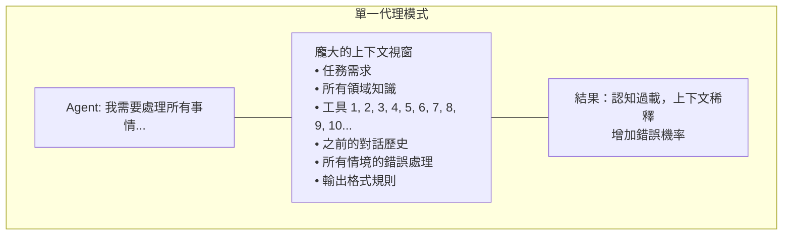
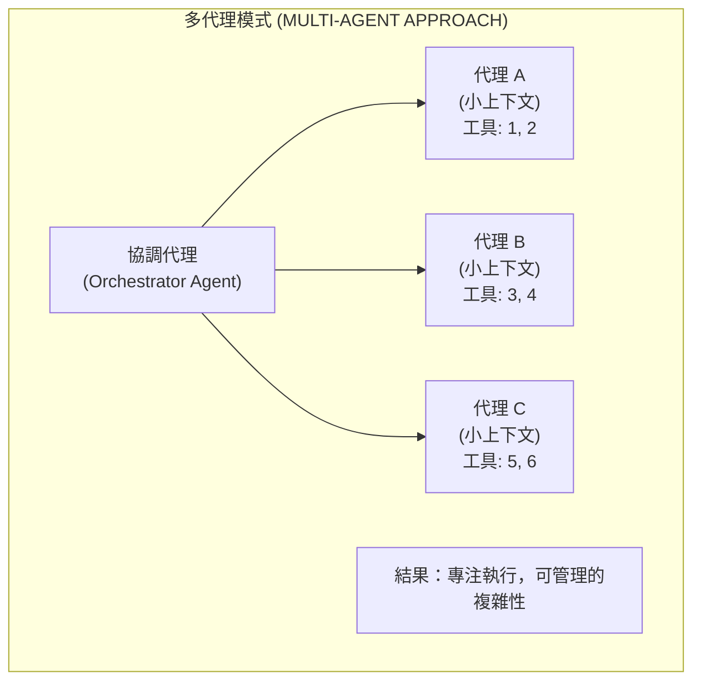
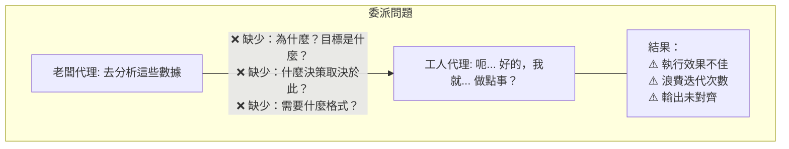
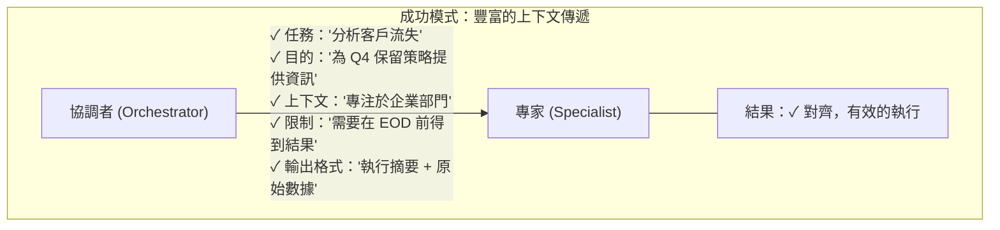
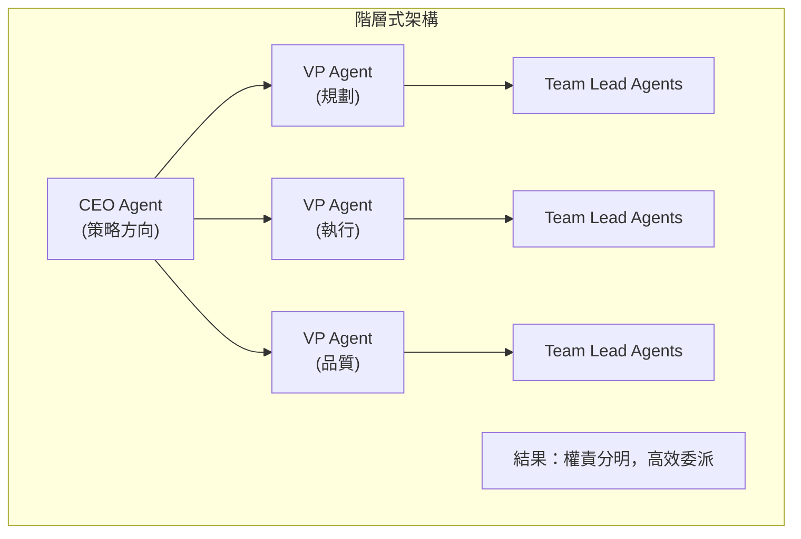
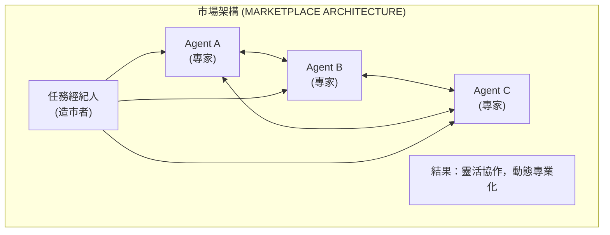
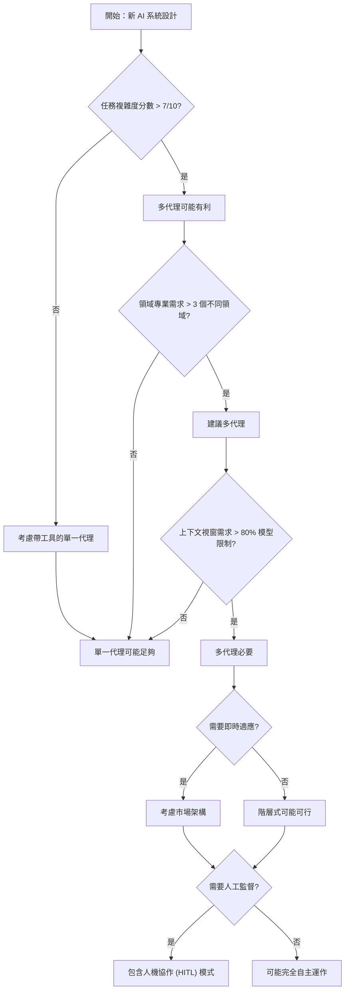

# 多代理模式：透過分而治之管理複雜性 (The Multi-Agent Pattern: Managing Complexity Through Divide and Conquer)

> 📝 **原文翻譯自 Raphaël MANSUY 的 Blog**：[The Multi-Agent Pattern: Managing Complexity Through Divide and Conquer](https://raphaelmansuy.github.io/adk_training/blog/multi-agent-pattern-complexity-management)

## 簡介 (Introduction)

使用專門代理作為工具的多代理模式，其主要目的並非單純為了提升效能，而是為了管理複雜性與認知工作負載。這就是為什麼這一點至關重要：

<!-- truncate -->

## 減少認知負載 (Reducing Cognitive Load)

每個代理都在最小化的上下文視窗中運作，僅專注於其專門任務所需的內容。我們不是讓單一代理處理龐大的上下文和眾多工具，而是分散認知負擔：





## 關鍵陷阱：委派中的上下文遺失 (The Critical Pitfall: Context Loss in Delegation)

然而，這種模式有一個根本的弱點——就像老闆在沒有適當上下文的情況下委派任務一樣：



## 關鍵見解 (The Key Insight)

多代理模式是一種複雜性管理策略，而不一定是效能優化。它在以下情況下表現出色：

- 任務可以真正分離且有清晰的邊界
- 每個專門代理可以針對其領域進行深度優化
- 協調層可以有效地傳遞豐富的上下文
- 委派的開銷小於認知過載的成本

它在以下情況下會遇到困難：

- 上下文無法清晰分離
- 關鍵資訊在代理之間的轉換中遺失
- 協調開銷超過了專業化的好處



## 進階多代理架構 (Advanced Multi-Agent Architectures)

除了基本的協調之外，還可以考慮這些複雜的模式：

### 階層式架構 (Hierarchical Architectures)



### 點對點架構 (Peer-to-Peer Architectures)



### 湧現行為與自組織 (Emergent Behaviors & Self-Organization)

多代理系統通常會展現湧現行為——這是由簡單的代理互動所產生的模式：

**有益的湧現 (Beneficial Emergence)：**

- **群體智慧 (Swarm Intelligence)**：代理透過局部互動集體解決問題
- **負載平衡 (Load Balancing)**：代理根據能力自動重新分配工作
- **自適應路由 (Adaptive Routing)**：通訊路徑透過使用模式自我優化

**有問題的湧現 (Problematic Emergence)：**

- **震盪 (Oscillations)**：代理過度修正彼此的行動
- **連鎖故障 (Cascading Failures)**：一個代理的故障引發全系統崩潰
- **資源爭奪 (Resource Contention)**：代理無效率地競爭共享資源

**管理湧現 (Managing Emergence)：**

```python
# 注意：InvocationContext 並非直接從 ADK 模組匯入。
# 它是由 ADK 執行環境自動傳遞給代理調用和工具函式的。

def resilient_processor(task: str, context, failure_threshold: int = 3) -> Dict[str, Any]:
    """
    使用斷路器韌性模式處理任務。

    Args:
        task: 要處理的任務
        context: 用於狀態管理的 ADK InvocationContext
        failure_threshold: 斷路器開啟前的最大失敗次數

    Returns:
        包含狀態、報告和資料欄位的字典
    """
    # 透過 ADK 的 InvocationContext 存取狀態
    failure_count = context.state.get('failure_count', 0)

    if failure_count >= failure_threshold:
        return {
            'status': 'error',
            'error': 'Circuit breaker open', # 斷路器開啟
            'report': f'Task rejected due to {failure_count} recent failures' # 由於近期多次失敗，任務被拒絕
        }

    try:
        result = process_task(task)
        # 透過 context 更新狀態
        context.state['failure_count'] = 0
        return {
            'status': 'success',
            'report': f'Successfully processed: {task}', # 成功處理
            'data': result
        }
    except Exception as e:
        # 增加失敗計數
        context.state['failure_count'] = failure_count + 1
        return {
            'status': 'error',
            'error': str(e),
            'report': f'Failed to process: {task}. Count: {failure_count + 1}' # 處理失敗
        }

# 任務處理的輔助函式（實作取決於使用案例）
def process_task(task: str) -> Dict[str, Any]:
    """
    範例任務處理函式。
    替換為您的實際任務處理邏輯。

    Args:
        task: 要處理的任務描述

    Returns:
        包含處理結果的字典
    """
    # 模擬任務處理 - 替換為實際實作
    if "error" in task.lower():
        raise ValueError("Simulated processing error") # 模擬處理錯誤

    return {
        'task': task,
        'processed_at': '2025-10-14T10:00:00Z',
        'result': f'Processed: {task}'
    }

# 註冊為 ADK 工具
resilient_tool = FunctionTool(resilient_processor)
```

## 進階上下文工程 (Advanced Context Engineering)

除了基本的狀態傳遞之外，複雜的上下文管理對於多代理的成功至關重要。**注意：以下類別為展示設計模式的概念性實作。ADK 不提供內建的上下文管理工具 - 這些必須手動實作或透過代理指令實作。**

**⚠️ 這些僅為設計模式。以下的實作是簡化的範例。在生產環境中，您需要處理持久性、錯誤情況和效能優化。**

### 上下文壓縮與摘要 (Context Compression & Summarization)

隨著上下文增長，壓縮變得至關重要：

```python
class ContextCompressor:
    """概念性上下文壓縮工具。"""

    @staticmethod
    def compress_context(full_context: Dict, max_tokens: int = 2000) -> Dict:
        """在保留關鍵資訊的同時壓縮上下文。"""

        # 提取關鍵元素
        essentials = {
            'task': full_context.get('task', ''),
            'constraints': full_context.get('constraints', []), # 限制
            'stakeholders': full_context.get('stakeholders', []), # 利害關係人
            'timeline': full_context.get('timeline', ''), # 時間表
            'success_criteria': full_context.get('success_criteria', []) # 成功標準
        }

        # 摘要冗長的部分
        if 'background' in full_context:
            essentials['background_summary'] = ContextCompressor._summarize(
                full_context['background'], max_tokens // 4
            )

        # 優先保留最近的歷史記錄
        if 'conversation_history' in full_context:
            essentials['recent_history'] = ContextCompressor._extract_recent(
                full_context['conversation_history'], max_tokens // 3
            )

        return essentials

    @staticmethod
    def _summarize(text: str, max_tokens: int) -> str:
        """使用代理簡潔地摘要文字。"""
        # 實作將使用 LLM 進行摘要
        return f"Summary: {text[:max_tokens]}..."

    @staticmethod
    def _extract_recent(history: List, max_items: int) -> List:
        """保留最近的對話項目。"""
        return history[-max_items:] if len(history) > max_items else history
```

### 上下文感知的代理選擇 (Context-Aware Agent Selection)

根據上下文特徵進行動態路由：

```python
class ContextRouter:
    """概念性代理路由工具。"""

    def __init__(self, agents: Dict[str, Agent]):
        self.agents = agents
        self.routing_rules = self._build_routing_rules()

    def route_task(self, task: Dict, context: Dict) -> Agent:
        """根據上下文將任務路由至最適當的代理。"""

        # 分析上下文複雜度
        complexity_score = self._assess_complexity(context)

        # 檢查領域專業知識需求
        required_expertise = self._extract_expertise_needs(task)

        # 尋找最佳代理匹配
        best_agent = None
        best_score = 0

        for agent_name, agent in self.agents.items():
            score = self._calculate_match_score(
                agent, complexity_score, required_expertise, context
            )
            if score > best_score:
                best_score = score
                best_agent = agent

        return best_agent

    def _assess_complexity(self, context: Dict) -> float:
        """評估上下文複雜度，範圍從 0.0 到 1.0。"""
        if not context or not isinstance(context, dict):
            return 0.0  # 對於無效上下文預設為最小複雜度

        factors = {
            'stakeholder_count': min(len(context.get('stakeholders', [])),
                                    10) / 10,
            'constraint_count': min(len(context.get('constraints', [])),
                                   20) / 20,
            'domain_count': min(len(context.get('domains', [])), 5) / 5,
            'urgency': 1.0 if context.get('urgent', False) else 0.0
        }
        return sum(factors.values()) / len(factors)

    def _build_routing_rules(self) -> Dict:
        """建立路由規則 - 根據您的需求實作。"""
        # 概念性實作
        return {
            'complexity_threshold': 0.7,
            'expertise_matching': True,
            'load_balancing': False
        }

    def _extract_expertise_needs(self, task: Dict) -> List[str]:
        """從任務中提取所需的專業知識 - 根據您的領域實作。"""
        # 概念性實作
        return task.get('required_skills', [])

    def _calculate_match_score(self, agent: Agent, complexity_score: float,
                              required_expertise: List[str], context: Dict) -> float:
        """計算代理與任務的匹配程度 - 實作您的評分邏輯。"""
        # 概念性實作 - 替換為實際評分
        base_score = 0.5  # 中性起始分數

        # 複雜度匹配
        if complexity_score > 0.7 and hasattr(agent, 'handles_complex_tasks'):
            base_score += 0.2

        # 專業知識匹配 (簡化版)
        agent_expertise = getattr(agent, 'expertise', [])
        expertise_matches = len(set(required_expertise) & set(agent_expertise))
        base_score += min(expertise_matches * 0.1, 0.3)

        return min(base_score, 1.0)  # 上限為 1.0
```

### 上下文繼承與階層式管理 (Context Inheritance & Hierarchical Management)

跨代理階層管理上下文：

```python
class HierarchicalContextManager:
    """概念性階層式上下文管理工具。"""

    def __init__(self):
        self.context_layers = {
            'global': {},      # 全系統上下文
            'session': {},     # 對話範圍上下文
            'task': {},        # 任務特定上下文
            'agent': {}        # 代理特定上下文
        }
        self.inheritance_rules = self._define_inheritance_rules()

    def get_effective_context(self, agent_id: str, task_id: str) -> Dict:
        """建立具有適當繼承的完整上下文。"""

        context = {}

        # 具有繼承的層級上下文
        for layer in ['global', 'session', 'task', 'agent']:
            layer_context = self.context_layers[layer].copy()

            # 應用繼承轉換
            if layer in self.inheritance_rules:
                layer_context = self._apply_inheritance_rules(
                    layer_context, layer, agent_id, task_id
                )

            # 合併並解決衝突
            context = self._merge_contexts(context, layer_context)

        return context

    def _apply_inheritance_rules(self, context: Dict, layer: str,
                                agent_id: str, task_id: str) -> Dict:
        """根據繼承規則轉換上下文。"""

        transformed = context.copy()

        # 代理特定過濾
        if layer == 'task' and agent_id:
            # 移除此代理不相關的任務細節
            transformed = self._filter_agent_relevant(transformed, agent_id)

        # 任務特定豐富化
        if layer == 'agent' and task_id:
            # 新增任務特定的代理能力
            transformed.update(self._get_task_capabilities(agent_id, task_id))

        return transformed

    def _define_inheritance_rules(self) -> Dict:
        """定義繼承規則 - 根據您的階層實作。"""
        # 概念性實作
        return {
            'task': {'filter_agent_relevant': True},
            'agent': {'add_task_capabilities': True}
        }

    def _filter_agent_relevant(self, context: Dict, agent_id: str) -> Dict:
        """過濾上下文以僅包含代理相關資訊。"""
        # 概念性實作 - 替換為實際過濾邏輯
        filtered = context.copy()
        # 範例：移除特定代理的敏感資料
        if agent_id == 'external_agent':
            filtered.pop('internal_notes', None)
        return filtered

    def _get_task_capabilities(self, agent_id: str, task_id: str) -> Dict:
        """取得代理的任務特定能力。"""
        # 概念性實作 - 替換為實際能力映射
        return {
            'task_capabilities': ['analyze', 'summarize'],
            'task_priority': 'high'
        }

    def _merge_contexts(self, base: Dict, overlay: Dict) -> Dict:
        """合併上下文並解決衝突。"""
        # 概念性實作 - 深度合併，overlay 優先
        merged = base.copy()
        for key, value in overlay.items():
            if isinstance(value, dict) and key in merged and isinstance(merged[key], dict):
                merged[key] = self._merge_contexts(merged[key], value)
            else:
                merged[key] = value
        return merged
```

### 上下文品質指標與驗證 (Context Quality Metrics & Validation)

測量並確保上下文品質：

```python
class ContextValidator:
    @staticmethod
    def validate_context_quality(context: Dict) -> Dict[str, float]:
        """傳回不同方面的品質分數。"""

        return {
            'completeness': ContextValidator._check_completeness(context), # 完整性
            'consistency': ContextValidator._check_consistency(context),   # 一致性
            'relevance': ContextValidator._check_relevance(context),       # 相關性
            'freshness': ContextValidator._check_freshness(context),       # 新鮮度
            'clarity': ContextValidator._check_clarity(context)            # 清晰度
        }

    @staticmethod
    def _check_completeness(context: Dict) -> float:
        """評分完整性，範圍從 0.0 到 1.0。"""
        required_fields = ['task', 'constraints', 'timeline', 'stakeholders']
        present_fields = sum(1 for field in required_fields if field in context)
        return present_fields / len(required_fields)

    @staticmethod
    def _check_consistency(context: Dict) -> float:
        """檢查內部一致性。"""
        # 尋找衝突的資訊
        conflicts = 0
        total_checks = 0

        # 時間表一致性
        if 'start_date' in context and 'end_date' in context:
            total_checks += 1
            if context['start_date'] > context['end_date']:
                conflicts += 1

        # 優先順序 vs 時間表檢查
        if context.get('priority') == 'high' and context.get('timeline') == 'flexible':
            total_checks += 1
            conflicts += 1  # 高優先順序不應有靈活的時間表

        return 1.0 - (conflicts / max(total_checks, 1))
```

## ADK 中的實際實作 (Practical Implementation in ADK)

使用 `output_key` 和狀態插值 (`{key_name}`) 在代理之間傳遞詳細的上下文：

```python
from google.adk.agents import Agent, SequentialAgent
from google.adk.tools import FunctionTool, google_search

# 協調者代理 (Orchestrator agent)
orchestrator = Agent(
    name="orchestrator",
    model="gemini-2.5-flash",
    description="客戶支援請求分析與委派代理",
    instruction="""
    分析客戶支援請求並委派給適當的專家。
    提供豐富的上下文，包括：
    - 具體的任務需求
    - 業務目標
    - 預期的輸出格式
    - 時間軸限制
    """,
    tools=[google_search],  # 內建 ADK 工具
    output_key="delegation_context"
)

# 專家代理 (Specialist agent)
specialist = Agent(
    name="specialist",
    model="gemini-2.5-flash",
    description="具有深厚產品知識的客戶支援專家",
    instruction="""
    您是一位客戶支援專家。
    上下文：{delegation_context}

    專注於提供詳細、可行的解決方案。
    """,
    tools=[support_tool]
)

# 範例支援資料庫工具 (您將實作此工具)
def support_database_tool(query: str) -> Dict[str, Any]:
    """
    搜尋支援資料庫以取得相關資訊。

    Args:
        query: 搜尋查詢

    Returns:
        包含狀態、報告和資料欄位的字典
    """
    # 實作將搜尋您的支援資料庫
    return {
        'status': 'success',
        'report': f'搜尋結果：{query}',
        'data': {'results': []}  # 替換為實際搜尋結果
    }

support_tool = FunctionTool(support_database_tool)
```

### 2. 清晰的邊界 (Clear Boundaries)

設計具有最小重疊的代理。每個代理應該有一個單一、定義明確的責任：

````python
# 具有清晰分離的循序工作流程
```python
support_workflow = SequentialAgent(
    name="customer_support",
    description="端到端客戶支援解決方案工作流程",
    sub_agents=[
        triage_agent,      # 分類與優先順序
        research_agent,    # 收集相關資訊
        response_agent,    # 撰寫最終回應
    ]
)
````

### 3. 每個層級的錯誤處理 (Error Handling at Each Level)

在每個代理中實作強大的錯誤處理，以防止連鎖故障：

```python
def specialist_tool(query: str) -> Dict[str, Any]:
    """
    專門的客戶支援工具。

    Args:
        query: 要處理的客戶支援查詢

    Returns:
        包含狀態、報告和資料欄位的字典
    """
    try:
        result = perform_specialized_task(query)
        return {
            'status': 'success',
            'report': f'Successfully completed: {query}',
            'data': result
        }
    except Exception as e:
        return {
            'status': 'error',
            'error': str(e),
            'report': f'Failed to process: {query}. Error: {str(e)}'
        }

# 註冊為 ADK 工具
support_tool = FunctionTool(specialist_tool)
```

## ADK 的內建協調功能 (ADK's Built-in Coordination Features)

雖然 ADK 不提供高階上下文管理工具，但它提供了多種內建協調功能，使多代理系統更加強大：

### 事件記錄與可觀察性 (Event Logging & Observability)

ADK 會自動記錄執行事件，以便除錯多代理互動。事件可透過代理調用回應取得，而非直接透過上下文方法：

```python
# 代理調用後，事件可在回應中取得
result = agent.invoke(query, context)

# 從結果中存取執行事件
execution_events = result.get('events', [])  # 檢視執行時間軸
state_snapshots = result.get('state_history', [])  # 除錯狀態流
error_traces = result.get('error_chain', [])  # 追蹤跨代理的故障

# 範例：記錄事件以進行除錯
for event in execution_events:
    print(f"Event: {event['type']} at {event['timestamp']}: {event['message']}")
```

### 自動錯誤傳播 (Automatic Error Propagation)

ADK 處理工作流程中代理之間的錯誤傳播：

- <div style='text-align: left;'> `SequentialAgent` 中的錯誤會停止執行並向上傳播</div>
- <div style='text-align: left;'> `ParallelAgent` 會在其他分支失敗時繼續執行成功的分支</div>
- <div style='text-align: left;'> `RemoteA2aAgent` 自動處理網路錯誤和逾時</div>

### 工具結果快取 (Tool Result Caching)

ADK 可能會在調用上下文中快取工具結果以提升效能。雖然並非所有工具類型都保證快取行為，但在同一調用中使用相同參數的相同工具呼叫可能會傳回快取結果，這可能會減少 API 呼叫並在迭代工作流程中提升效能。

### 狀態隔離與範圍 (State Isolation & Scoping)

ADK 提供自動狀態管理：

- <div style='text-align: left;'> 每個代理透過 `InvocationContext` 獲得自己的狀態範圍</div>
- <div style='text-align: left;'> 狀態透過 `output_key` 和插值在代理之間流動</div>
- <div style='text-align: left;'> 自動清理可防止調用之間的狀態污染</div>

## 決策框架：單一 vs 多代理 (Decision Framework: Single vs Multi-Agent)

使用此框架來判斷何時適合使用多代理架構：

### 快速評估問題 (Quick Assessment Questions)

1. **任務複雜度**：問題可以清晰地分解為獨立的子任務嗎？
2. **領域多樣性**：任務是否需要來自多個專門領域的專業知識？
3. **上下文大小**：單一代理是否會被所需的總上下文壓垮？
4. **故障隔離**：一個區域的部分故障是否會破壞整個系統？
5. **可擴展性需求**：您是否需要獨立新增/修改能力？

### 決策樹 (Decision Tree)



### ADK 特定決策因素 (ADK-Specific Decision Factors)

在評估 ADK 中的多代理架構時，請考慮這些平台特定的限制：

**API 速率限制與成本：**

- 每個代理調用都會消耗 API 配額
- 平行代理會成倍增加成本 (3 個代理 = 3 倍 API 呼叫)
- 考慮代幣成本：每 1K 代幣約 $0.001-0.005
- 速率限制可能會限制平行執行

**開發複雜度：**

- 代理狀態管理需要仔細設計
- 測試多代理互動並非易事
- 除錯需要了解 ADK 事件日誌
- 讓團隊成員熟悉 ADK 模式需要時間

**營運開銷：**

- 監控多個代理的健康端點
- 管理代理版本控制與部署
- 處理 A2A 通訊可靠性
- 獨立擴展代理 vs 單體式擴展

**損益平衡分析 (ADK 特定)：**
多代理在以下情況下變得具成本效益：

- 每日 API 使用量 > 10K 代幣 (攤銷協調開銷)
- 系統複雜度阻礙單一代理解決方案
- 團隊擁有 ADK 專業知識與測試基礎設施
- 預期維護期間 > 6 個月

### 定量決策因素 (Quantitative Decision Factors)

| 因素           | 單一代理   | 多代理       | 決策權重 |
| :------------- | :--------- | :----------- | :------- |
| **任務複雜度** | 簡單任務   | 複雜工作流程 | 高       |
| **上下文管理** | 單一視窗   | 分散式狀態   | 高       |
| **故障韌性**   | 全有或全無 | 優雅降級     | 中       |
| **開發速度**   | 初期較快   | 初期較慢     | 低       |
| **維護成本**   | 較低       | 較高 (協調)  | 中       |
| **可擴展性**   | 有限       | 高           | 高       |
| **專業化**     | 通用目的   | 領域專家     | 高       |

### 實作成本分析 (Implementation Cost Analysis)

**單一代理方法：**

- 開發時間：1-2 週
- 上下文管理：簡單狀態傳遞
- 測試：單元測試 + 整合測試
- 維護：單一程式碼庫
- 擴展：垂直 (更大的模型)

**多代理方法：**

- 開發時間：3-8 週
- 上下文管理：複雜路由 + 繼承
- 測試：單元 + 整合 + 系統測試
- 維護：多個程式碼庫 + 協調
- 擴展：水平 (更多代理)

**損益平衡分析：**
多代理在以下情況下變得具成本效益：

- 任務複雜度 > 8/10
- 團隊規模 > 3 位開發人員
- 預期系統壽命 > 12 個月
- 修改頻率 > 每季

## 多代理大放異彩的時機 (When Multi-Agent Shines)

### 複雜領域問題 (Complex Domain Problems)

- **財務分析**：用於資料收集、風險評估和建議生成的分離代理
- **軟體開發**：用於需求分析、程式碼生成和測試的獨特代理
- **內容創作**：用於研究、寫作和編輯的專門代理

### 高風險決策 (High-Stakes Decisions)

- **醫療診斷**：用於症狀分析、鑑別診斷和治療計劃的分離代理
- **法律分析**：用於案例研究、先例分析和策略開發的獨特代理
- **投資決策**：用於市場分析、風險建模和投資組合優化的專門代理

## 測量成功 (Measuring Success)

追蹤這些指標以評估您的多代理實作：

- **上下文品質**：資訊在代理之間的流動情況如何？
- **迭代效率**：需要多少輪的改進？
- **錯誤率**：個別代理與系統的失敗率為何？
- **回應時間**：協調開銷是否可接受？
- **輸出品質**：最終結果是否符合需求？

## 應避免的常見陷阱 (Common Pitfalls to Avoid)

### 1. 薄弱的上下文傳遞 (Thin Context Passing)

不要只說「分析這個」——提供目的、限制和預期結果。

### 2. 代理增生 (Agent Proliferation)

更多代理 ≠ 更好。每個代理都會增加協調開銷。

### 3. 狀態管理複雜性 (State Management Complexity)

確保代理之間的狀態邊界清晰，以防止干擾。

### 4. 測試挑戰 (Testing Challenges)

多代理系統更難測試。規劃全面的整合測試。

## 進階模式與人機協作 (Advanced Patterns & Human Collaboration)

### 代理市場與動態組合 (Agent Marketplaces & Dynamic Composition)

除了靜態階層之外，考慮使用 ADK 的代理探索功能的動態代理市場：

```python
from google.adk.agents import RemoteA2aAgent
from google.adk.a2a.utils.agent_to_a2a import to_a2a
import uvicorn

class AgentMarketplace:
    def __init__(self):
        self.available_agents = {}
        self.task_registry = {}
        self.performance_history = {}

    def register_remote_agent(self, agent_card_url: str, capabilities: List[str]):
        """透過 A2A 協定註冊遠端代理。"""
        remote_agent = RemoteA2aAgent(
            name=f"remote_agent_{len(self.available_agents)}",
            description="Dynamically discovered remote agent",
            agent_card_url=agent_card_url
        )

        self.available_agents[remote_agent.name] = {
            'agent': remote_agent,
            'capabilities': capabilities,
            'performance_score': 1.0,
            'task_count': 0
        }

    def find_best_agent(self, task_requirements: Dict) -> RemoteA2aAgent:
        """動態選擇任務的最佳代理。"""
        candidates = []

        for agent_info in self.available_agents.values():
            if self._matches_requirements(agent_info, task_requirements):
                score = self._calculate_agent_score(agent_info, task_requirements)
                candidates.append((agent_info['agent'], score))

        # 傳回最高分的代理
        return max(candidates, key=lambda x: x[1])[0] if candidates else None

    def _matches_requirements(self, agent_info: Dict, requirements: Dict) -> bool:
        """檢查代理能力是否符合任務需求。"""
        agent_caps = set(agent_info['capabilities'])
        required_caps = set(requirements.get('capabilities', []))
        return required_caps.issubset(agent_caps)

    def _calculate_agent_score(self, agent_info: Dict, task_requirements: Dict) -> float:
        """計算代理對任務的適用性分數。"""
        # 概念性評分實作
        base_score = 0.5

        # 效能歷史因素
        performance = agent_info.get('performance_score', 0.5)
        base_score += (performance - 0.5) * 0.3

        # 任務計數因素 (偏好有經驗的代理，但不過度負載)
        task_count = agent_info.get('task_count', 0)
        if task_count < 10:
            base_score += 0.1  # 新代理獎勵
        elif task_count > 100:
            base_score -= 0.1  # 過度工作代理懲罰

        # 能力匹配
        agent_caps = set(agent_info['capabilities'])
        required_caps = set(task_requirements.get('capabilities', []))
        match_ratio = len(required_caps & agent_caps) / len(required_caps) if required_caps else 1.0
        base_score += match_ratio * 0.2

        return min(max(base_score, 0.0), 1.0)  # 限制在 [0.0, 1.0]

# 為市場建立 A2A 伺服器
marketplace_app = to_a2a(root_agent)
if __name__ == "__main__":
    uvicorn.run(marketplace_app, host="0.0.0.0", port=8000)
```

### 人機協作模式 (Human-Agent Collaboration Patterns)

使用 ADK 的 HITL 模式將人工監督整合到多代理系統中：

**模式：**

1. **人機迴圈 (Human-in-the-Loop, HITL)**：關鍵決策需要人工批准
2. **人機監督 (Human-on-the-Loop, HOTL)**：人類監控但不干預，除非需要
3. **具委派的人機迴圈 (Human-in-the-Loop with Delegation)**：人類將複雜任務委派給代理團隊

**實作：**

```python
from google.adk.agents import Agent

class HumanOversightManager:
    def __init__(self):
        self.decision_thresholds = {
            'financial_impact': 10000,  # 超過 $10k 的決策需要批准
            'risk_level': 'high',       # 高風險行動需要批准
            'uncertainty_score': 0.8    # 信心 < 80% 時需要批准
        }
        self.pending_decisions = []

    def evaluate_decision_need(self, agent_decision: Dict) -> str:
        """判斷是否需要人工批准。"""

        # 檢查財務影響
        if agent_decision.get('financial_impact', 0) > self.decision_thresholds['financial_impact']:
            return 'human_approval_required'

        # 檢查風險等級
        if agent_decision.get('risk_assessment') == self.decision_thresholds['risk_level']:
            return 'human_approval_required'

        # 檢查代理信心
        if agent_decision.get('confidence', 1.0) < self.decision_thresholds['uncertainty_score']:
            return 'human_review_suggested'

        return 'autonomous_execution'

    def queue_for_human_review(self, decision: Dict, agent_name: str):
        """將決策排入人工審查佇列。"""
        self.pending_decisions.append({
            'decision': decision,
            'agent': agent_name,
            'timestamp': datetime.now(),
            'priority': self._calculate_priority(decision)
        })

# 具備人工監督的 HITL 代理

hitl_agent = Agent(
    name="hitl_financial_analyzer",
    model="gemini-2.5-flash",
    description="具備人工監督的財務分析代理",
    instruction="""
    分析財務數據並提出建議。
    對於高影響力的決策，標記以供人工審查。

    決策標準：
    - 財務影響 > $10,000：需要人工批准
    - 風險等級 = 高：需要人工批准
    - 信心 < 80%：建議人工審查
    """,
    tools=[financial_analysis_tool],
    output_key="financial_analysis"
)
```

### 效能優化技術 (Performance Optimization Techniques)

**上下文優化：**

1. **漸進式上下文載入 (Progressive Context Loading)**：按需載入上下文層
2. **上下文快取 (Context Caching)**：快取頻繁存取的上下文片段
3. **上下文預取 (Context Prefetching)**：預測並預先載入可能需要的上下文

**通訊優化：**

1. **訊息批次處理 (Message Batching)**：將相關通訊分組
2. **非同步通訊 (Async Communication)**：使用非阻塞訊息傳遞
3. **協定壓縮 (Protocol Compression)**：壓縮訊息以提升效率

**代理優化：**

1. **專業化調整 (Specialization Tuning)**：針對其特定領域優化每個代理
2. **負載平衡 (Load Balancing)**：根據代理能力分配工作
3. **資源共用 (Resource Pooling)**：跨代理共用昂貴資源

## ADK 限制與權衡 (ADK Limitations & Trade-offs)

雖然 ADK 提供強大的多代理能力，但請注意這些平台限制：

### 狀態大小與效能限制 (State Size & Performance Limits)

- **狀態物件**應保持合理大小以避免效能降低
- **大型狀態**會增加代理之間的序列化時間
- **記憶體使用量**隨並行調用數量增加

### API 限制 (API Constraints)

- **速率限制**影響平行代理執行 (通常為 60 請求/分鐘)
- **代幣成本**隨每個代理倍增 (考慮批次策略)
- **網路延遲**增加 RemoteA2aAgent 呼叫的開銷

### 除錯複雜性 (Debugging Complexity)

- **事件日誌**是您除錯多代理流程的主要工具
- **狀態檢查**需要了解 ADK 的 InvocationContext
- **錯誤傳播**可能使根本原因分析變得具挑戰性

### 擴展考量 (Scaling Considerations)

- **水平擴展**需要仔細的代理部署管理
- **A2A 通訊**增加網路可靠性考量
- **協調開銷**隨代理數量增加

## 在 ADK 中測試多代理系統 (Testing Multi-Agent Systems in ADK)

多代理系統需要全面的測試策略：

### 單元測試個別代理 (Unit Testing Individual Agents)

```python
def test_research_agent():
    """測試個別代理行為。"""
    agent = ResearchAgent()
    context = InvocationContext()

    result = agent.invoke("test query", context)

    assert result['status'] == 'success'
    assert 'research_findings' in context.state


### 整合測試代理通訊 (Integration Testing Agent Communication)

def test_sequential_workflow():
    """測試代理對代理狀態傳遞。"""
    workflow = SequentialAgent(sub_agents=[agent1, agent2])
    context = InvocationContext()

    result = workflow.invoke("test task", context)

    # 驗證代理之間的狀態流
    assert context.state.get('agent1_output') is not None
    assert context.state.get('agent2_input') == context.state.get('agent1_output')
```

### 端對端測試 (End-to-End Testing)

```python
def test_complete_system():
    """測試完整多代理協調。"""
    system = ContentPublishingSystem()

    result = system.invoke("Publish article about AI", InvocationContext())

    assert result['status'] == 'success'
    assert 'final_article' in result
```

### 測試的 Mock 策略 (Mocking Strategies for Testing)

```python
class MockRemoteAgent:
    """用於測試的 Mock 遠端代理。"""
    def invoke(self, query: str, context: InvocationContext) -> Dict:
        return {
            'status': 'success',
            'report': f'Mocked response for: {query}',
            'data': {'mocked': True}
        }
```

## 生產部署考量 (Production Deployment Considerations)

### 代理健康監控 (Agent Health Monitoring)

```python
def monitor_agent_health(agent_url: str) -> bool:
    """監控遠端代理可用性。"""
    try:
        response = requests.get(f"{agent_url}/.well-known/agent-card.json",
                              timeout=5)
        return response.status_code == 200
    except:
        return False
```

### 版本管理 (Version Management)

- **語意化版本控制 (Semantic versioning)** 用於代理 API
- **向後相容性 (Backward compatibility)** 測試
- **漸進式推出 (Gradual rollout)** 策略

### 擴展策略 (Scaling Strategies)

- **負載平衡 (Load balancing)** 跨多個代理實例
- **斷路器 (Circuit breakers)** 用於故障代理
- **自動擴展 (Auto-scaling)** 根據佇列深度

### 成本優化 (Cost Optimization)

- **快取層 (Caching layers)** 用於昂貴操作
- **批次處理 (Batch processing)** 以減少 API 呼叫
- **資源共用 (Resource Pooling)** 用於共享昂貴資源

## 結論 (Conclusion)

多代理模式並非透過分工讓代理「更聰明」——而是透過專業化讓複雜系統變得可管理。當實作良好並具有豐富的上下文傳遞和清晰邊界時，它使我們能夠處理會壓垮單一代理的問題。

關鍵見解：**透過專業化進行複雜性管理通常勝過協調成本**，特別是隨著任務複雜度增加。但成功完全取決於您如何處理委派問題。

在 ADK 中，這意味著設計具有最小、專注上下文的代理，以及在專門組件之間傳遞豐富、結構化資訊的協調層。當做法正確時，您將獲得更可靠、可維護且能夠處理複雜工作流程的系統。

因此，雖然我們可能沒有明確的基準顯示多代理系統在所有任務中都優於單一代理，但我們有強大的架構理由說明何時以及為何它們是正確的選擇：在專業化和上下文最小化勝過協調成本的系統中管理複雜性。

## 程式碼實現 (Code Implementation)

- 部落格流程 (循序工作流程)：[blog-pipeline](../../../python/agents/blog-pipeline/)
- 旅遊規劃 (平行處理)：[travel-planner](../../../python/agents/travel-planner/)
- 內容發布 (多代理協調)：[content-publisher](../../../python/agents/content-publisher/)
- 代理對代理協調器：[a2a-orchestrator](../../../python/agents/a2a-orchestrator/)
- MCP 多代理系統：[mcp-a2a-master](../../../python/agents/mcp-a2a-master/)

---

## 參閱 (See Also)

### 快速參考 (Quick Reference)

**實作相關 TIL：** (未完成)

- **[TIL: 暫停與恢復調用 (TIL: Pause & Resume Invocations)](../../../python/agents/pause-resume-agent/)** - 在多代理移交中實作狀態管理
- **[TIL: 上下文壓縮 (TIL: Context Compaction)](../../../python/agents/context-compaction-agent/)** - 管理協調者 + 子代理通訊的代幣成本

**相關教學：**

- [教學 06：多代理系統 (Tutorial 06: Multi-Agent Systems)](../../google-adk-training-hub/adk_training/06-multi_agent_systems.md)
- [教學 04：循序工作流程 (Tutorial 04: Sequential Workflows)](../../google-adk-training-hub/adk_training/04-sequential_workflows.md)
- [教學 05：平行處理 (Tutorial 05: Parallel Processing)](../../google-adk-training-hub/adk_training/05-parallel_processing.md)
