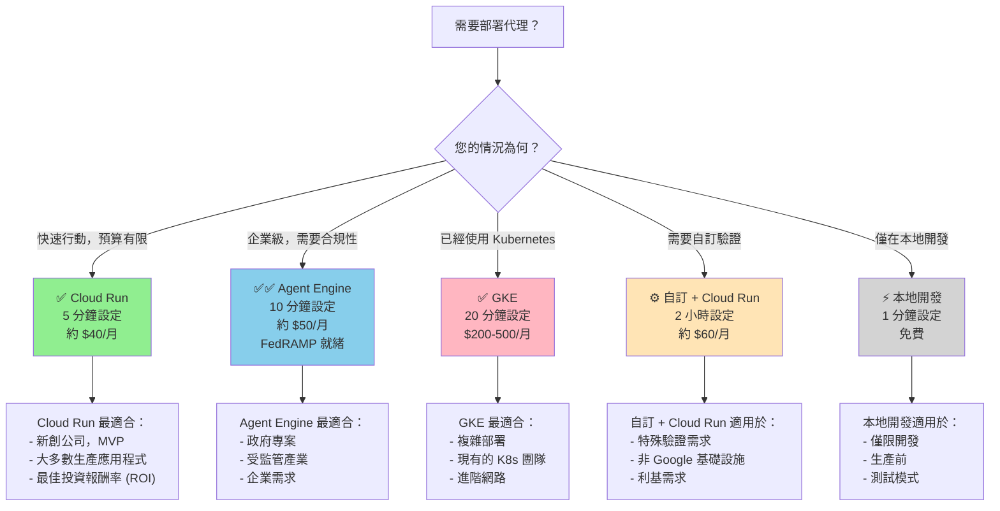
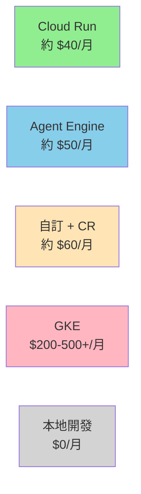

# 5 分鐘內部署您的 AI (Deploy Your AI Agent in 5 Minutes (Seriously))

> 📝 **原文翻譯自 Raphaël MANSUY 的 Blog**：[Deploy Your AI Agent in 5 Minutes (Seriously)](https://raphaelmansuy.github.io/adk_training/blog/deploy-ai-agents-5-minutes)

## 簡介 (Overview)

您剛剛建立了一個令人驚豔的 AI 代理。它在本地端運作完美。您已經與團隊一起測試過它。現在，讓您徹夜難眠的問題來了：

**「我到底該如何將這東西部署到生產環境？」**

您 Google 搜尋了一下。您發現了 47 種不同的意見。有人說「使用 Kubernetes」。其他人說「只要用 serverless 就好」。有個人提到「你絕對需要自訂的 FastAPI 伺服器」。另一個人說你絕對不需要。

您需要的是清晰，而不是複雜。這正是本指南所提供的。

---

## 部署為何重要（為何想太多） (Why Deployment Matters (And Why You're Overthinking It))

關於 AI 代理部署的一件事是：**它並不像網路上看起來的那麼複雜。**

原因為何？**平台在安全性方面已經變得非常出色。**

### 舊的方法（仍在發生） (The Old Way (Still Happening))

您必須擔心：
- ❌ 管理憑證 (HTTPS/TLS)
- ❌ DDoS 保護
- ❌ 伺服器強化 (Server hardening)
- ❌ 負載平衡 (Load balancing)
- ❌ 自動擴展基礎設施
- ❌ 加密金鑰
- ❌ 合規性認證

這令人筋疲力竭。您需要一位 DevOps 工程師才能生存。

### 新的方法（我們現在的位置） (The New Way (Where We Are Now))

選擇一個平台。部署。完成。

- ✅ 憑證？自動化。
- ✅ DDoS 保護？包含在內。
- ✅ 自動擴展？內建。
- ✅ 合規性？可用。
- ✅ DevOps？由 Google 管理。

**見解**：Google Cloud 的平台提供 **平台優先的安全性 (platform-first security)**。這意味著安全性是基礎，而不是您額外添加的東西。您的工作只是部署您的代理程式碼。其他一切都已處理妥當。

所以，如果您對部署感到不知所措，請深呼吸。您可能比您想像的準備得更充分。

---

## 關於代理部署的簡單真相 (The Simple Truth About Agent Deployment)

在我們深入探討平台之前，您需要知道一件事：

**您可能不需要自訂伺服器。**

說真的。大約 80% 的團隊都不需要。原因如下：

### ADK 的內建伺服器刻意極簡 (ADK's Built-In Server is Intentionally Minimal)

當您使用 ADK 部署代理時，您會獲得：
- ✅ 基本的 `/health` 端點
- ✅ 用於查詢的 `/invoke` 端點
- ✅ 會話管理 (Session management)
- ✅ 錯誤處理
- ✅ 就是這樣。

**為何如此極簡？** 因為平台正在處理其他所有事情。HTTPS、驗證、DDoS、加密—這些全都是平台提供的。您的程式碼不需要擔心這些。

### 當您「確實」需要自訂伺服器時 (When You DO Need a Custom Server)

如果您屬於以下類別之一：
- 您需要自訂驗證（LDAP、Kerberos、自訂 OAuth）
- 您有額外的業務邏輯端點
- 您沒有使用 Google Cloud 基礎設施
- 您需要超越平台預設值的進階可觀測性

那麼，是的，建立一個自訂 FastAPI 伺服器。但僅限於這種情況。

**實際上多少人需要這個？** 大約 20%。如果您正在閱讀這篇文章並想著「那可能是我」，那可能並不是。

---

## 決策框架：哪個平台適合您？ (The Decision Framework: Which Platform for You?)

這是一個能在 60 秒內回答您問題的流程圖：



**閱讀流程圖**：
1. 找到您的情況
2. 那個方塊就是您的答案
3. 完成。

---

## 真實世界場景：實際發生了什麼 (Real-World Scenarios: What Actually Happens)

讓我們具體一點。以下是 5 個部署代理的真實團隊：

### 場景 1：新創公司（快速行動） (Scenario 1: The Startup (Moving Fast))

**您的情況**：
- 小型創始團隊
- 想要在本週發布
- 預算吃緊
- 需要快速迭代

**您的平台**：✅ **Cloud Run**

**原因**：
- 5 分鐘內部署
- 成本約 $40/月（按請求付費）
- 內建安全性（無需考慮）
- 自動從 0 擴展到 1000 個請求
- 可以迭代而無需維運負擔

**指令**：
```bash
adk deploy cloud_run \
  --project your-project-id \
  --region us-central1
```

**1 年後的實際成本**：約 $500-600，包含資料儲存。對新創公司來說負擔得起。

---

### 場景 2：企業（需要合規性） (Scenario 2: The Enterprise (Need Compliance))

**您的情況**：
- 為受監管產業建構
- 客戶詢問關於合規性的問題
- 需要 FedRAMP 或 HIPAA 認證
- 不能在安全性上妥協

**您的平台**：✅✅ **Agent Engine (唯一具備 FedRAMP 的平台)**

**原因**：
- 唯一內建 FedRAMP 合規性的 Google Cloud 平台
- 合規性已完成（說真的，無需填寫表格）
- SOC 2 Type II 認證
- 不可變的稽核日誌 (Immutable audit logs)
- 沙盒化執行

**指令**：
```bash
adk deploy agent_engine \
  --project your-project-id \
  --region us-central1 \
  --agent-name my-agent
```

**真實價值**：安心。您的客戶安全團隊將停止問問題。

---

### 場景 3：Kubernetes 商店 (The Kubernetes Shop)

**您的情況**：
- 公司已經運行 Kubernetes
- 想要在相同的基礎設施中部署代理
- DevOps 團隊非常了解 K8s
- 需要進階網路

**您的平台**：✅ **GKE (Google Kubernetes Engine)**

**原因**：
- 利用現有的基礎設施
- 完全控制網路
- 可以使用進階功能（NetworkPolicy, RBAC 等）
- 維運團隊已經知道這點

**指令**：
```bash
kubectl apply -f deployment.yaml
```

**真實成本**：$200-500+/月。昂貴，但您是為控制和整合付費。

---

### 場景 4：特殊案例（自訂驗證） (Scenario 4: The Special Case (Custom Authentication))

**您的情況**：
- 公司使用內部 Kerberos 驗證
- 無法使用標準 OAuth
- 需要特殊的業務邏輯端點
- 客戶需要 API 金鑰，而不是 IAM

**您的平台**：⚙️ **自訂 FastAPI + Cloud Run**

**原因**：
- Cloud Run 提供平台安全性
- 您的自訂伺服器新增驗證邏輯
- 兩全其美
- 但是... 如果您實際上不需要它，絕對是大材小用

**工作量**：2 小時以上來建立生產伺服器

**開始前的問題**：「我們確定我們的客戶不能使用 Cloud Run IAM 嗎？」通常答案是「我們沒試過」。

---

### 場景 5：開發者（本地測試） (Scenario 5: The Developer (Local Testing))

**您的情況**：
- 在本地端建構
- 想要在生產前測試代理
- 尚無基礎設施
- 學習代理如何運作

**您的平台**：⚡ **本地開發 (Local Dev)**

**原因**：
- 零設定
- 即時回饋
- 免費
- 適合迭代

**指令**：
```bash
adk api_server --port 8000
```

**下一步**：一旦您喜歡它，就移動到 Cloud Run（相同的程式碼，只是部署了）。

---

## 成本現實查核 (The Cost Reality Check)

讓我們談談錢。這是實際成本：



**重要注意事項**：
- 基於 100 萬次請求/月（典型新創公司數量）
- 包含運算 + 儲存
- 不包含模型 API 成本（這些是分開的，取決於模型，每次請求約 $0.30-2.00）
- 實際成本因區域而異（顯示的價格為美國）

**模型成本呢？**
這與部署是分開的。無論您使用 Cloud Run 還是 GKE，使用 `gemini-2.0-flash` 的成本都是一樣的。部署平台不會影響模型定價。

**投資報酬率 (ROI) 分析**：
- **Cloud Run**：從這裡開始。$40/月。如果您成功了，稍後升級到 Agent Engine。
- **Agent Engine**：僅當合規性是強制性時。為了安心每月多付 $10。
- **GKE**：僅當您已經擁有 K8s 時。整合節省的費用證明了成本的合理性。
- **自訂伺服器**：僅當您嘗試過標準驗證並失敗時。

---

## 安全性：曾經很困難的部分 (Security: The Part That Used to Be Hard)

這是現代平台美麗的地方：

### Cloud Run 處理什麼（自動） (What Cloud Run Handles (Automatically))

- ✅ HTTPS/TLS 憑證（由 Google 管理）
- ✅ DDoS 保護（始終開啟）
- ✅ 傳輸中加密 (Encryption in transit)
- ✅ 靜態加密 (Encryption at rest)
- ✅ 非 root 容器執行（強制）
- ✅ 二進制漏洞掃描
- ✅ 網路隔離

**您不須做什麼**：什麼都不用。它是自動的。

### 您必須做什麼 (What You Must Do)

```
Agent Code (代理程式碼)
├── ✅ Validate inputs (驗證輸入) (don't trust user data) (不要信任使用者資料)
├── ✅ Use Secret Manager for API keys (使用 Secret Manager 管理 API 金鑰)
├── ✅ Set resource limits (設定資源限制) (memory, CPU) (記憶體，CPU)
├── ✅ Log important events (記錄重要事件)
└── ✅ Monitor error rates (監控錯誤率)
```

就是這樣。五件事。如果您做了這五件事，您就是安全的。

### 秘密管理（人們弄錯的一件事） (Secret Management (The One Thing People Get Wrong))

**❌ 不要這樣做：**
```python
API_KEY = "sk-12345"  # Hardcoded, bad! # 硬編碼，不好！
```

**✅ 改為這樣做：**
```python
from google.cloud import secretmanager
import os

secret = secretmanager.SecretManagerServiceClient()
project = os.environ['GOOGLE_CLOUD_PROJECT']
name = f"projects/{project}/secrets/api-key/versions/latest"
response = secret.access_secret_version(request={"name": name})
API_KEY = response.payload.data.decode('UTF-8')
```

Google Cloud 的 Secret Manager 對您的前 6 個秘密是免費的。使用它。

---

## 開始使用：快速路徑 (Getting Started: The Fast Path)

### 您想現在就部署嗎？

```bash
# 1. 準備好您的代理程式碼
cd your-agent-directory

# 2. 部署到 Cloud Run（選一個）
adk deploy cloud_run \
  --project your-project-id \
  --region us-central1

# 3. 完成！您有一個公開的 HTTPS URL
```

**幕後發生了什麼：**
1. ADK 建立一個 Docker 容器
2. 推送到 Google Container Registry
3. 部署到 Cloud Run
4. 給您一個公開 URL
5. 設定自動擴展

**總時間**：5 分鐘

### 需要更多細節？

**部署前**：
- [ ] 設定 `GOOGLE_CLOUD_PROJECT` 環境變數
- [ ] 確保您已安裝 gcloud CLI
- [ ] 準備好您的 `GOOGLE_API_KEY`（在 Secret Manager 中，不是硬編碼！）

**部署後**：
- [ ] 測試 `/health` 端點
- [ ] 測試呼叫您的代理
- [ ] 設定監控 (Cloud Logging + Cloud Monitoring)
- [ ] 如果需要，設定驗證

---

## 決策樹（如果您仍然無法決定） (The Decision Tree (If You Still Can't Decide))

```
Do you need compliance (FedRAMP/HIPAA)? (您需要合規性嗎 (FedRAMP/HIPAA)?)
├─ Yes (是) → Agent Engine ✅✅
└─ No (否) → Continue... (繼續...)

Do you already use Kubernetes? (您已經使用 Kubernetes 嗎？)
├─ Yes (是) → GKE ✅
└─ No (否) → Continue... (繼續...)

Do you need custom authentication? (您需要自訂驗證嗎？)
├─ Yes (是) → Custom + Cloud Run (自訂 + Cloud Run) ⚙️
└─ No (否) → Cloud Run ✅

Cloud Run. You're done. Deploy now. (Cloud Run。您完成了。現在部署。)
```

---

## 資源：您需要的一切 (Resources: Everything You Need)

### 主要教學 (Main Tutorial)
- 📖 [**教學 23：生產部署策略**](../adk_training/23-production_deployment.md)
  - 所有部署選項的完整指南
  - 真實世界場景和範例
  - 最佳實踐和模式

### 指南與檢查清單 (Guides & Checklists)
- 🔐 [**安全性驗證指南**](../../../python/agents/production-agent/SECURITY_VERIFICATION.md) - 針對每個平台的逐步操作
- 🚀 [**遷移指南**](../../../python/agents/production-agent/MIGRATION_GUIDE.md) - 如何在平台之間安全移動
- 💰 [**成本細分分析**](../../../python/agents/production-agent/COST_BREAKDOWN.md) - 詳細的定價細分
- ✅ [**部署檢查清單**](../../../python/agents/production-agent/DEPLOYMENT_CHECKLIST.md) - 部署前/中/後的驗證
- 📖 [**FastAPI 最佳實踐**](../../../python/agents/production-agent/FASTAPI_BEST_PRACTICES.md) - 7 個生產模式

### 安全性研究 (Security Research)
- 📋 [**安全性研究摘要**](../../../python/agents/production-agent/SECURITY_RESEARCH_SUMMARY.md) - 執行摘要（5 分鐘閱讀）- ADK 提供什麼，平台提供什麼
- 🔍 [**詳細安全性分析**](../../../python/agents/production-agent/SECURITY_ANALYSIS_ALL_DEPLOYMENT_OPTIONS.md) - 每個平台的細分 - 深入探討每個部署選項

### 平台文件 (Platform Documentation)
- 🌐 [Cloud Run 文件](https://cloud.google.com/run/docs) - 官方 Google 文件
- 🤖 [Agent Engine 文件](https://cloud.google.com/vertex-ai/docs/agent-engine) - 託管代理基礎設施
- ⚙️ [GKE 文件](https://cloud.google.com/kubernetes-engine/docs) - Kubernetes 引擎
- 🔐 [Secret Manager](https://cloud.google.com/secret-manager/docs) - 安全的秘密儲存

### 程式碼範例 (Code Examples)
- 🔧 [**完整實作 (GitHub)**](../../../python/agents/production-agent/)
  - 完整的 FastAPI 伺服器範例（488 行）
  - 40 個綜合測試（93% 覆蓋率）
  - 生產模式和範例

---
## 結論 (The Bottom Line)

**將 AI 代理部署到生產環境比您想像的更容易。**

選擇您的平台：
- **新創公司/MVP** → Cloud Run（5 分鐘，約 $40/月）
- **企業/合規性** → Agent Engine（10 分鐘，約 $50/月，FedRAMP）
- **Kubernetes 商店** → GKE（20 分鐘，$200-500+/月）
- **特殊需求** → 自訂 + Cloud Run（2 小時，約 $60/月）
- **只是學習** → 本地開發（1 分鐘，免費）

部署。監控。擴展。完成。

您已經建立了困難的部分（代理本身）。基礎設施現在已經商品化。讓平台處理安全性、擴展和合規性。專注於您的代理。

---

## 下一步 (Next Steps)

**準備好部署了嗎？**

1. 閱讀 [教學 23：生產部署策略](../adk_training/23-production_deployment.md)
2. 檢查 [部署檢查清單](../../../python/agents/production-agent/DEPLOYMENT_CHECKLIST.md)
3. 從決策框架中選擇您的平台
4. 使用 `adk deploy <platform>` 進行部署
5. 使用 Cloud Logging 進行監控

**有問題嗎？** 檢查 [實作指南中的常見問題 (FAQ)](../../../python/agents/production-agent/)。

---

## 您做得到的 🚀 (You've Got This 🚀)

代理部署不是魔法。它只是：
1. 寫程式碼 ✅（您已經做了）
2. 選擇平台 ✅（本指南有幫助）
3. 部署 ✅（一個指令）
4. 監控 ✅（平台讓這變得容易）

就是這樣。您的代理即將為真實使用者提供服務。恭喜。

現在去部署那個代理。世界正在等待。

---

## 參閱 (See Also)

### 快速參考 (Quick Reference)

**使用 TIL 優化您的部署：**

- **[TIL: 暫停與恢復呼叫](/blog/til-pause-resume)** -
  建立彈性、容錯的工作流程
- **[TIL: 上下文壓縮](/blog/til-context-compaction)** -
  降低長時間運行的生產代理成本

**相關教學：**

- [教學 23：生產部署策略](../adk_training/23-production_deployment.md)
- [教學 22：進階可觀測性](../adk_training/24-advanced_observability.md)

---

**Psst**：卡在 Cloud Run 和 Agent Engine 之間？從 Cloud Run 開始。它部署更快且更便宜。如果您需要合規性，您可以隨時遷移到 Agent Engine。升級路徑很順暢。
