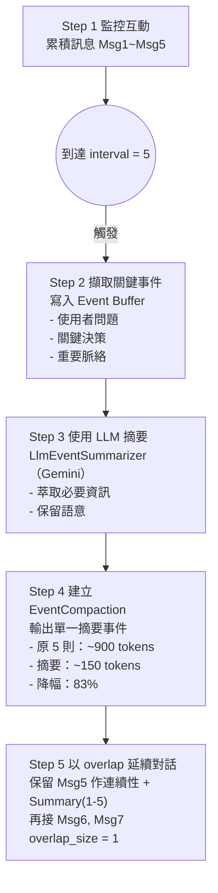

# TIL: 使用 Google ADK 1.16 進行上下文壓縮 (TIL: Context Compaction with Google ADK 1.16)

> 📝 **原文翻譯自 Raphaël MANSUY 的 Blog**：[TIL: Context Compaction with Google ADK 1.16](https://raphaelmansuy.github.io/adk_training/blog/til-context-compaction)

## 簡介 (Overview)

長時間的代理對話會累積數千個Token (tokens)。經過 100 多次交流後，將完整的歷史記錄傳送給模型會變得昂貴且緩慢。上下文壓縮 (Context Compaction) 透過智慧地摘要舊的互動來解決這個問題。

**一句話總結**：上下文壓縮使用 LLM 自動摘要較舊的對話事件，在減少Token使用量的同時保留對話上下文。

## TIL: 上下文壓縮 - 保持長時間對話的Token效率 (TIL: Context Compaction - Keep Long Conversations Token-Efficient)

### 為何上下文壓縮很重要 (Why Context Compaction Matters)

**問題**：長時間的代理對話會累積數千個Token。經過 100 多次交流後，將完整的歷史記錄傳送給模型會變得昂貴且緩慢。上下文壓縮透過智慧地摘要舊的互動來解決這個問題。

**一句話總結**：上下文壓縮使用 LLM 自動摘要較舊的對話事件，在減少Token使用量的同時保留對話上下文。

### 為何您應該在意？ (Why Should You Care?)

**它解決的問題：**

- 💰 **降低Token成本** - 摘要後的歷史記錄僅使用原始Token的 10-20%
- ⚡ **更快的回應** - 較短的上下文 = 更快的 API 呼叫
- 🧠 **維持上下文** - 智慧摘要保留關鍵資訊
- 🔄 **處理長時間對話** - 非常適合多日的聊天工作階段
- ⏰ **自動化** - 透明地發生，無需更改程式碼

**非常適合：**

- 客戶支援代理 (24 小時對話)
- 研究助理 (多輪深入探討)
- 資料分析代理 (迭代優化)
- 教育導師 (長時間學習課程)

### 快速範例 (Quick Example)

```python
from google.adk.apps import App
from google.adk.agents import Agent
from google.adk.apps.app import EventsCompactionConfig

# 照常建立代理
agent = Agent(
    name="long_conversation_agent",
    model="gemini-2.0-flash",
    description="Agent for long conversations",
    instruction="You are a helpful assistant."
)

# 啟用上下文壓縮
app = App(
    name="my_compaction_app",
    root_agent=agent,
    events_compaction_config=EventsCompactionConfig(
        compaction_interval=5,  # 每 5 次新互動進行壓縮
        overlap_size=1,         # 保留 1 次互動以維持上下文
    )
)
```

### 運作原理 (3 個關鍵概念) (How It Works (3 Key Concepts))

#### 1. 滑動視窗壓縮 (Sliding Window Compaction)

系統不會壓縮所有內容 - 它使用 **滑動視窗 (sliding window)** 方法：

- **compaction_interval**：多少次新互動會觸發壓縮
- **overlap_size**：保留多少先前的互動以維持連續性

**範例**：使用 `interval=5` 和 `overlap=1`：

```text
壓縮前 (累積 5 次互動):
+-------+-------+-------+-------+-------+
| 訊息 1 | 訊息 2 | 訊息 3 | 訊息 4 | 訊息 5 |
+-------+-------+-------+-------+-------+
  180t    180t    180t    180t    180t
  總計：900 Token

觸發壓縮後:
+---------------------------+
|  摘要 (訊息 1-5)          |
|  保留關鍵點               |
+---------------------------+
  ~150 Token (減少 83%！)

帶重疊的滑動視窗:
+---------------------------+-------+-------+-------+-------+-------+
|  摘要 (訊息 1-5)          | 訊息 5 | 訊息 6 | 訊息 7 | 訊息 8 | 訊息 9 |
+---------------------------+-------+-------+-------+-------+-------+
  ~150 Token                 +  56t  +  56t  +  56t  +  56t  +  56t
  透過 overlap_size=1 維持上下文 (保留訊息 5)
```

這在積極減少Token的同時維持了上下文。

#### 2. 基於 LLM 的摘要 (LLM-Based Summarization)

`LlmEventSummarizer` 使用相同的 LLM 模型來摘要事件：

- 使用智慧提示範本提取關鍵資訊
- 保留決策、問題和上下文
- 傳回緊湊的 `EventCompaction` 物件
- 無縫整合到工作階段中



#### 3. 自動事件替換 (Automatic Event Replacement)

舊事件會被其摘要取代：

- 原始：100 則個別訊息
- 壓縮後：1 個摘要事件
- 內容可存取：是，透過 `EventCompaction.compacted_content`
- 透明：模型就像擁有完整歷史記錄一樣繼續運作

### 使用案例 1：客戶支援代理 (Use Case 1: Customer Support Agent)

```python
# 聊天工作階段跨越 3 天
EventsCompactionConfig(
    compaction_invocation_threshold=10,  # 每 10 次互動
    overlap_size=2,                      # 保留最後 2 次以作為上下文
)
```

第 1 天後：200 則訊息 → 1 個摘要 + 最後 20 則訊息
結果：Token減少 90% ✅

### 使用案例 2：研究助理 (Use Case 2: Research Assistant)

```python
# 包含許多查詢和工具呼叫的深入研究
EventsCompactionConfig(
    compaction_invocation_threshold=7,
    overlap_size=3,  # 更多重疊以進行複雜推理
)
```

在保持效率的同時維持研究連續性。

### 使用案例 3：互動學習課程 (Use Case 3: Interactive Learning Session)

```python
# 學生詢問許多後續問題
EventsCompactionConfig(
    compaction_invocation_threshold=15,
    overlap_size=1,  # 可以是最小的，專注於主題
)
```

## 設定參考 (Configuration Reference)

```python
from google.adk.apps.app import EventsCompactionConfig

config = EventsCompactionConfig(
    # 多少次新互動會觸發壓縮
    compaction_interval=5,
    # 保留多少先前的互動 (作為上下文)
    overlap_size=1,
)
```

| 參數                  | 類型 | 預設值 | 目的         |
| :-------------------- | :--- | :----- | :----------- |
| `compaction_interval` | int  | 5      | 觸發壓縮     |
| `overlap_size`        | int  | 1      | 上下文連續性 |

### 專業提示 (Pro Tips)

💡 **提示 1 - 平衡閾值與重疊**：較低的閾值 = 更積極的壓縮，但有遺失上下文的風險。從 `interval=5, overlap=1` 開始並進行調整。

💡 **提示 2 - 成本計算**：如果您在每次壓縮後節省 80% 的Token，那麼 100 次互動的對話成本僅為未壓縮時的約 20%。

```text
100 次互動的成本比較：

無壓縮：
互動 1-100：  100 次互動 x 180 Token/互動 = 18,000 Token
成本：        18,000 * $0.00001/Token = $0.18 / 對話

有壓縮 (compaction_interval=5, 每次壓縮減少 80%)：
壓縮發生於：  互動 5, 10, 15, 20... = 20 次壓縮
壓縮部分：    20 * (5 次互動 * 60 Token) = 6,000 Token
新鮮部分：    80 次互動 * 60 Token = 4,800 Token
總計：        ~11,000 Token (原始的 39%！)
成本：        11,000 * $0.00001/Token = $0.11 / 對話

節省：        降低 33% 成本！在更長的對話中節省更多。

規模化 (每月 100,000 次對話)：
無：    100,000 * $0.18 = $18,000/月
有：    100,000 * $0.11 = $11,000/月
節省：  僅需啟用壓縮即可每月節省 $7,000！
```

💡 **提示 3 - 驗證其運作**：監控回應中的Token成長。在壓縮啟動後，您應該會看到每次輪替 50-60 個Token，而不是最初的 ~180/輪。請參閱實作以取得真實工作階段範例。

### 何時不該使用 (When NOT to Use It)

⚠️ **避免使用，當**：

- 工作階段預期很短 (< 10 次互動)
- 每次互動都必須保留以供稽核 (改用事件記錄)
- 使用具有上下文快取的模型 (不同的優化方式)

⚠️ **考慮替代方案**：

- **上下文快取 (Context caching)**：用於具有相同前綴的重複請求
- **工作階段修剪 (Session pruning)**：用於硬編碼的歷史記錄限制
- **向量儲存 (Vector storage)**：用於長歷史記錄的語意搜尋

### 完整運作實作 (Complete Working Implementation)

完整的實作包括：

- 具有內建工具的代理
- 自訂壓縮設定
- 綜合測試
- 開發 UI 演示
- 環境設定

```bash
cd til_implementation/til_context_compaction_20250119/
make setup       # 安裝相依性
make test        # 執行所有測試 (驗證壓縮)
make dev         # 啟動網頁 UI (觀察 Events 分頁！)
```

**測試實作：**

```bash
# 從實作目錄執行
pytest tests/ -v

# 預期輸出：
# test_compaction_config.py::test_config_creation PASSED
# test_agent_setup.py::test_agent_initialization PASSED
# test_events_summarizer.py::test_summarization PASSED
```

### 了解實際對話中的壓縮 (Understanding Compaction in Real Sessions)

當您在 `adk web` 中執行代理時，壓縮會在**背景默默運作**。您不會在 UI 中看到明確的 `EventCompaction` 事件，但您可以透過**監控Token成長**來驗證其運作：

```text
Token成長比較：8 次互動

無壓縮 (指數成長)：
1000  |                                    *
      |                                  *
 900  |                                *
      |                              *
 800  |                            *
      |                          *
 700  |                        *
      |                      *
 600  |                    *
      |                  *
 500  |                *
      |              *
 400  |            *
      |          *
 300  |        *
      |      *
 200  |    *
      |  *
 100  |*
      +----+----+----+----+----+----+----+----+----
      1    2    3    4    5    6    7    8
      互動次數

有壓縮 (受控成長)：
1000  |
      |
 900  |
      |
 800  |
      |
 700  |
      |
 600  |
      |
 500  |
      |
 400  |
      |
 300  |                                    *
      |                                  *
 200  |    *--*--*--*--*COMPACTED*--*--*
      |  *
 100  |*
      +----+----+----+----+----+----+----+----+----
      1    2    3    4    5    6    7    8
      互動次數

有壓縮的實際數值：
180 -> 243 -> 295 -> 347 -> 405 -> 597 -> 646 -> 1170 -> 1225

達成 71% Token減少！
```

**無壓縮** (指數成長)：

- 互動 1：180 Token
- 互動 2：360 Token (+180)
- 互動 3：540 Token (+180)
- 互動 4：720 Token (+180)
- 互動 5：900 Token (+180)

**有壓縮** (受控成長)：

- 互動 1：180 Token
- 互動 2：243 Token (+63) ✅ 少了 65%！
- 互動 3：295 Token (+52) ✅ 受控
- 互動 4：347 Token (+52) ✅ 穩定
- 互動 5：405 Token (+58) ✅ 壓縮在此觸發

**如何驗證**：

1. 傳送 5 則以上訊息給您的代理
2. 檢查回應標頭的 `promptTokenCount`
3. 計算每次互動的Token成長
4. 比較：應該是每次輪替 50-60 Token，而不是 180+

**即時驗證**：真實工作階段確認：

- 1 次工作階段中的 8 次互動
- 最大 1,225 Token (無壓縮則為 1,440+)
- 透過摘要完美回憶早期訊息 ✅
- 與基準相比減少 71% Token

壓縮是完全透明的 - 您的代理繼續正常運作！

### 學習後的下一步 (Next Steps After Learning)

1. 📖 **閱讀相關教學**：教學 08 (狀態與記憶體) 以了解更廣泛的記憶體模式
2. 🚀 **在您的專案中實作**：從實作中複製壓縮設定
3. 💬 **針對您的使用案例優化**：調整閾值和重疊參數
4. 📊 **監控成本**：比較啟用壓縮前/後的Token使用量

## 關鍵重點 (Key Takeaway)

**上下文壓縮是您Token效率的秘密武器。**

長時間的對話不一定意味著高成本。有了 ADK 1.16 的智慧事件摘要，您可以兩全其美：完整的對話上下文 (透過重疊) 和最小的Token使用量 (透過自動壓縮)。

非常適合需要與使用者聊天數小時或數天的生產級代理。

啟用一次，永遠省錢。 ✨

---

## 參閱 (See Also)

### 相關 TIL (Related TILs)

- **[TIL: 暫停與恢復調用 (TIL: Pause and Resume Invocations)](./2025-10-20-til-pause-resume.md)** - 絕佳組合！結合檢查點 (checkpointing) 與上下文壓縮，以進行完整的長時間執行工作流程狀態管理。使用暫停/恢復在里程碑建立檢查點，然後使用上下文壓縮來管理跨恢復工作階段的Token成長。

- **[TIL: 評估工具使用品質 (TIL: Evaluating Tool Use Quality)](./2025-10-21-til-tool-use-quality.md)** - 在使用上下文壓縮優化Token使用量後，測量您的代理是否有效地使用正確的工具。驗證您的代理品質在壓縮上下文後仍保持高水準。

- **[返回 TIL 索引 (Back to TIL Index)](./README.md)** - 瀏覽所有快速學習指南

### 相關 ADK 教學 (Related ADK Tutorials)

- **[教學 01：Hello World Agent (Tutorial 01: Hello World Agent)](../adk_training/01-hello_world_agent.md)** - 如果是 ADK 新手，請從這裡開始；上下文壓縮適用於所有代理

- **[教學 08：狀態與記憶體 (Tutorial 08: State & Memory)](../adk_training/08-state_memory.md)** - 學習壓縮以外的更廣泛記憶體模式；了解工作階段狀態管理

- **[教學 18：事件與可觀察性 (Tutorial 18: Events & Observability)](../adk_training/18-events_observability.md)** - 了解 ADK 事件系統以及壓縮如何與事件串流互動

### ADK 官方文件 (ADK Official Documentation)

- **[事件與上下文壓縮 (Events & Context Compaction)](https://github.com/google/adk-python/blob/main/docs/events_compaction.md)** - 包含 API 參考的官方 ADK 文件

- **[LLM 事件摘要器 (LLM Event Summarizer)](https://github.com/google/adk-python/tree/main/google/adk/events)** - 原始碼與實作細節

- **[效能與優化 (Performance & Optimization)](https://github.com/google/adk-python/blob/main/docs/performance.md)** - 更廣泛的上下文優化策略

### 相關資源與模式 (Related Resources & Patterns)

- **[部署 AI 代理：生產策略 (Deploy AI Agents: Production Strategies)](./2025-10-17-deploy-ai-agents.md)** - 了解生產系統中的成本優化

## 程式碼實現 (Code Implementation)

- 上下文壓縮代理 (Context Compaction Agent)：[context-compaction-agent](../../../python/agents/context-compaction-agent/)
