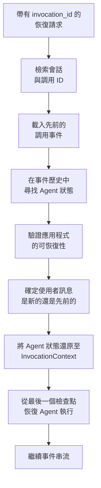
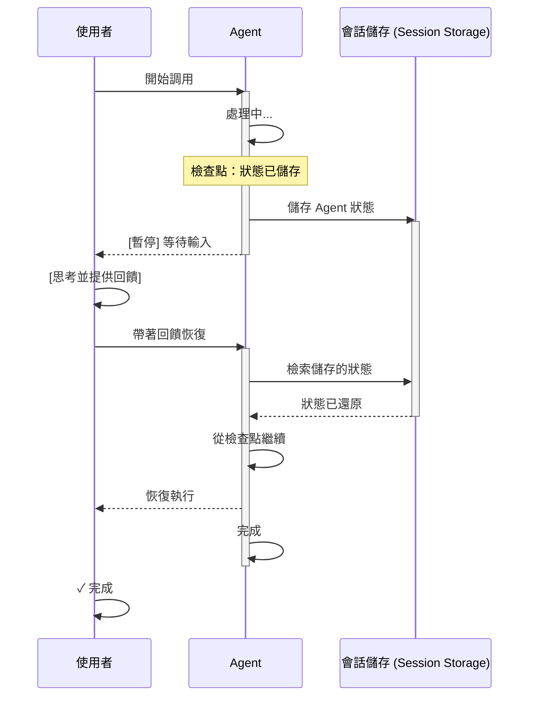
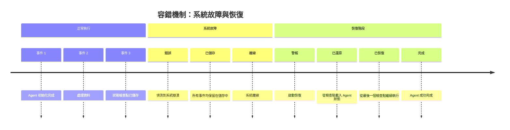
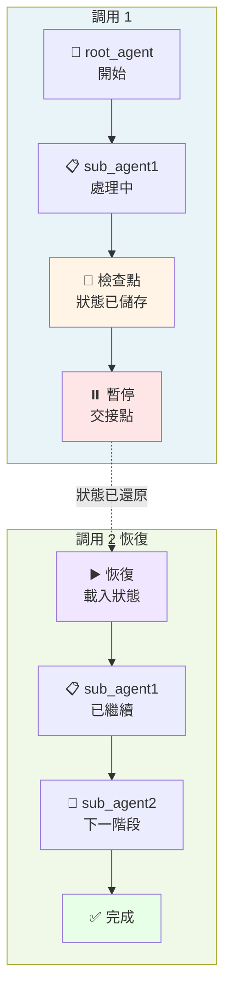
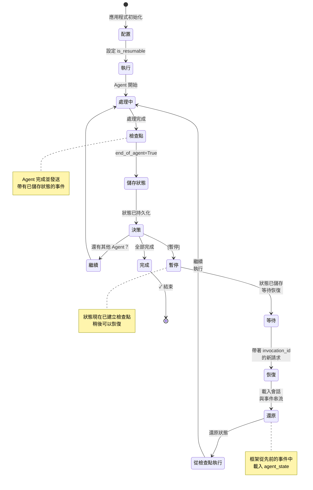

# TIL: 使用 Google ADK 1.16 進行上下文壓縮 (TIL: Context Compaction with Google ADK 1.16)

> 📝 **原文翻譯自 Raphaël MANSUY 的 Blog**：[TIL: Context Compaction with Google ADK 1.16](https://raphaelmansuy.github.io/adk_training/blog/til-pause-resume)

## 簡介 (Overview)

使用 Google ADK 1.16.0 暫停與恢復調用 (TIL: Pause and Resume Invocations with Google ADK 1.16.0)"
description: "暫停與恢復調用快速指南：針對長時間運行的工作流、人機互動（human-in-the-loop）和容錯機制，對 Agent 狀態進行檢查點（checkpoint）備份並在稍後恢復執行"

長時間運行的 Agent 任務需要能夠優雅地中斷，或為了等待人工回饋而暫停，且不丟失進度。系統故障可能會在任務執行途中中斷，導致工作成果丟失。

## 今日學習：暫停與恢復調用 - 具備韌性的 Agent 工作流 (TIL: Pause and Resume Invocations - Resilient Agent Workflows)

### 為什麼暫停/恢復調用很重要 (Why Pause/Resume Invocations Matter)

**問題 (The Problem)**：長時間運行的 Agent 任務需要能夠優雅地中斷，或為了等待人工回饋而暫停，且不丟失進度。系統故障可能會在任務執行途中中斷，導致工作成果丟失。

**一句話總結 (In one sentence)**：暫停與恢復調用讓 Agent 能夠在關鍵點建立狀態檢查點（checkpoint），並在稍後恢復執行而不丟失上下文。

### 為什麼你應該關注？ (Why Should You Care?)

**解決的問題：**

- 🛡️ **容錯機制 (Fault tolerance)** - 系統故障不會導致工作丟失；可從檢查點恢復。
- 👤 **人機互動 (Human-in-the-loop)** - Agent 暫停以請求回饋，然後繼續。
- ⏱️ **長時間運行任務 (Long-running tasks)** - 複雜的工作流可以在自然的停頓點暫停。
- 🔄 **多 Agent 交接 (Multi-agent handoff)** - 在 Agent 之間交接時保留狀態。
- 💾 **狀態持久化 (State persistence)** - 自動儲存完整的執行上下文。

**非常適合：**

- 資料處理流水線（具備檢查點的批次作業）
- 客戶支援升級（暫停以待主管審核）
- 研究工作流（在分析步驟之間儲存進度）
- 審批工作流（暫停以待人工決策）
- 具備韌性的生產系統（從故障中自動恢復）

### 快速範例 (Quick Example)

```python
from google.adk.apps import App, ResumabilityConfig
from google.adk.agents import Agent

# 像往常一樣建立 Agent
agent = Agent(
    name="long_task_agent",
    model="gemini-2.0-flash",
    description="用於長時間運行任務的 Agent",
    instruction="完成帶有檢查點的任務。"
)

# 啟用暫停/恢復支援
app = App(
    name="resumable_app",
    root_agent=agent,
    resumability_config=ResumabilityConfig(is_resumable=True)
)

# 初始調用 - 在 Agent 完成時建立檢查點
async for event in runner.run_async(session=session, new_message=user_input):
    last_invocation_id = event.invocation_id
    # 事件包含：end_of_agent=True, agent_state={...}

# [稍後] 從檢查點恢復並提供新輸入
async for event in runner.run_async(
    session=session,
    new_message=new_input,
    invocation_id=last_invocation_id  # 從這裡恢復！
):
    # 執行從儲存的檢查點繼續
    pass
```

### 運作原理 (3 個核心概念) (How It Works (3 Key Concepts))

#### 1. 狀態檢查點 (State Checkpointing)

當 Agent 完成時，它會發送一個包含其狀態的事件：

```python
event = Event(
    invocation_id='inv_1',
    author='agent_name',
    actions=EventActions(
        end_of_agent=True,           # 標記完成
        agent_state={'data': '...'}  # 持久化狀態
    ),
    content=response
)
```

該狀態是：

- **自動的**：框架透明地處理。
- **序列化的**：轉換為 JSON 以供儲存。
- **完整的**：包含所有 Agent 執行上下文。

#### 2. 狀態恢復 (State Restoration)

恢復時，框架會還原先前的狀態：



恢復流程：

1. **尋找** 會話中先前的調用事件。
2. 從檢查點事件中 **提取** `agent_state`。
3. **還原** 至 `InvocationContext`。
4. 使用儲存的狀態 **繼續** Agent 執行。

#### 3. 配置 (Configuration)

三個簡單的設定即可啟用暫停/恢復：

```python
from google.adk.apps import ResumabilityConfig, App

# 1. 建立配置
config = ResumabilityConfig(is_resumable=True)

# 2. 附加至應用程式
app = App(root_agent=agent, resumability_config=config)

# 3. 就這樣！框架會自動處理檢查點
```

### 使用案例 (Use Cases)

#### 1. 長時間運行的資料處理 (Long-Running Data Processing)

**場景**：分多個階段處理大型資料集

```
階段 1: 驗證輸入     [檢查點 1]
          ↓
階段 2: 處理資料     [檢查點 2]
          ↓
階段 3: 分析結果     [檢查點 3]
          ↓
階段 4: 產出報告     [檢查點 4]
          ↓
         完成
```

如果系統在階段 2 之後崩潰，只需使用階段 2 的檢查點 `invocation_id` 恢復即可。

#### 2. 人機互動審批 (Human-in-the-Loop Approval)

**場景**：Agent 準備決策，等待人工批准



#### 3. 容錯機制 (Fault Tolerance)

**場景**：生產系統發生故障



#### 4. 多 Agent 工作流 (Multi-Agent Workflows)

**場景**：帶有狀態保留的順序 Agent 交接



每個 Agent 檢查點都包含用於潛在恢復的完整狀態。

### 關鍵特性 (Key Features)

#### ResumabilityConfig

```python
config = ResumabilityConfig(
    is_resumable=True  # 啟用暫停/恢復支援
)
```

**就這樣！** 框架會處理：

- 狀態序列化
- 檢查點建立
- 恢復時的狀態還原
- 事件歷史管理

#### Agent 狀態類型 (Agent State Types)

不同的 Agent 類型具有專門的狀態：

- **LoopAgent**：`current_sub_agent`, `times_looped`
- **SequentialAgent**：`completed_agents`, `current_index`
- **ParallelAgent**：`agent_states`, `completion_status`

自定義 Agent 可以透過以下方式實現自己的狀態：

```python
class MyAgent(BaseAgent):
    def get_current_state(self) -> dict:
        return {
            'progress': self.progress,
            'data': self.accumulated_data,
            'timestamp': datetime.now()
        }
```

#### 使用選填的新輸入進行恢復 (Resumption with Optional New Input)

使用新的使用者輸入恢復：

```python
await runner.run_async(
    session=session,
    new_message="新回饋",           # 選填
    invocation_id=previous_invocation_id  # 必填
)
```

或使用先前的輸入恢復：

```python
await runner.run_async(
    session=session,
    new_message=None,                     # None = 重用
    invocation_id=previous_invocation_id
)
```

### 事件流範例 (Event Flow Example)

事件流經會話，並標記檢查點以供潛在恢復：

```mermaid
graph LR
    A["👤 使用者訊息<br/>作者: user<br/>內容: 輸入"] --> B["🤖 Agent 處理中<br/>作者: agent<br/>內容: ..."]
    B --> C["✅ 檢查點 1<br/>end_of_agent: True<br/>agent_state: {...}"]
    C --> D["⏸️ 暫停<br/>狀態已儲存"]
    D --> E["💾 會話儲存<br/>事件已持久化"]

    E --> F["⏳ 稍後...<br/>恢復請求<br/>+ invocation_id"]

    F --> G["📥 還原狀態<br/>從事件 3 載入<br/>agent_state"]

    G --> H["🔄 恢復 Agent<br/>從檢查點執行"]

    H --> I["✅ 檢查點 2<br/>end_of_agent: True<br/>agent_state: {...}"]

    I --> J["✓ 完成"]

    style C fill:#fff4e6
    style D fill:#ffe6e6
    style E fill:#e8f4f8
    style F fill:#f0e6ff
    style G fill:#f0e6ff
    style I fill:#e6ffe6
    style J fill:#e6ffe6
```



時間軸視覺化：

```
Session.events = [
  事件 1: 使用者訊息 (author: 'user')
    內容: { text: "處理此資料" }
    agent_state: None
    |
    |
  事件 2: Agent 處理中
    |    作者: 'agent'
    |    內容: { text: "處理中..." }
    |
    v
  事件 3: Agent 完成 [檢查點]
    作者: 'agent'
    動作: { end_of_agent: True }
    agent_state: { "state_key": "state_value" }
    ---> 儲存在會話儲存中 <---
    |
    | [暫停 - 可在此恢復]
    |
    v
  事件 4: 恢復點
    [稍後] 帶著 invocation_id 恢復
    |
    v
  事件 5: Agent 繼續
    作者: 'agent'
    agent_state: 從事件 3 還原 (RESTORED)
    |
    v
  事件 6: Agent 完成 [檢查點]
    作者: 'agent'
    動作: { end_of_agent: True }
    agent_state: { "agent2_state": "..." }
    ---> 儲存在會話儲存中 <---
]
```

### 架構概覽 (Architecture Overview)

**新組件：**

- `ResumabilityConfig`：配置類別
- `BaseAgentState`：抽象狀態基類
- `LoopAgentState`, `SequentialAgentState`, `ParallelAgentState`：專門的狀態
- `Runner._setup_context_for_resumed_invocation()`：恢復邏輯

**增強組件：**

- `App`：現在接受 `resumability_config`
- `InvocationContext`：從事件中填充 Agent 狀態
- `EventActions`：包含 `agent_state` 欄位
- `Event`：可以攜帶 Agent 狀態資訊

### 測試您的實現 (Testing Your Implementation)

該實現在測試中包含全面的測試：

```bash
# 執行所有測試
pytest tests/ -v

# 執行特定測試
pytest tests/test_agent.py::TestAgentConfiguration -v

# 包含覆蓋率
pytest tests/ --cov=pause_resume_agent
```

預期的測試模式：

```python
# 測試可恢復與不可恢復模式
@pytest.mark.parametrize('resumable', [True, False])
async def test_pause_resume(resumable: bool):
    config = ResumabilityConfig(is_resumable=resumable)
    app = App(root_agent=agent, resumability_config=config)
    # 測試執行與檢查點處理
```

### 最佳實踐 (Best Practices)

1. **如果您需要暫停/恢復，請務必啟用 ResumabilityConfig**

   ```python
   config = ResumabilityConfig(is_resumable=True)
   ```

2. **了解您的檢查點** - 知道您的 Agent 在何處自然完成並儲存狀態。

3. **測試恢復場景** - 測試兩者：

   - 從頭開始的正常執行
   - 從檢查點恢復

4. **優雅地處理狀態錯誤**

   ```python
   try:
       await runner.run_async(session, invocation_id=prev_id)
   except StateRestorationError:
       # 備案：重新開始
       await runner.run_async(session, new_message=original_input)
   ```

5. **清理舊會話** - 封存會話以避免長時間積累。

### 狀態生命週期 (State Lifecycle)

了解狀態轉移流程對於建立可靠的暫停/恢復工作流至關重要：



### 常見模式 (Common Patterns)

#### 模式 1：簡單的暫停/恢復 (Simple Pause/Resume)

```python
# 初始執行
async for event in runner.run_async(session, new_message=user_input):
    invocation_id = event.invocation_id

# 稍後：恢復
async for event in runner.run_async(
    session=session,
    new_message=new_input,
    invocation_id=invocation_id
):
    pass
```

#### 模式 2：人機互動 (Human-in-the-Loop)

```python
# Agent 暫停以等待回饋
await runner.run_async(session, new_message="開始流程")

# 人工審核並提供輸入
human_feedback = request_human_input()

# 帶著回饋恢復
await runner.run_async(
    session=session,
    new_message=human_feedback,
    invocation_id=paused_invocation_id
)
```

#### 模式 3：容錯處理 (Fault-Tolerant Processing)

```python
try:
    invocation_id = None
    async for event in runner.run_async(session, new_message=data):
        invocation_id = event.invocation_id
except Exception as e:
    logger.error(f"失敗，正在從 {invocation_id} 恢復")
    # 修復後從檢查點恢復
    async for event in runner.run_async(
        session=session,
        invocation_id=invocation_id
    ):
        pass
```

### 限制與考量 (Limitations & Considerations)

1. **需要應用程式配置** - 必須明確設定 `is_resumable=True`。

2. **JSON 序列化** - Agent 狀態必須是可 JSON 序列化的。

3. **會話儲存** - 恢復需要原始調用的會話事件。

4. **子 Agent 恢復** - 目前恢復子 Agent 執行途中的限制（詳見 ADK 文件）。

### 相關特性 (Related Features)

- **上下文壓縮 (Context Caching)** (v1.15.0)：與上下文保留相輔相成。
- **會話管理 (Session Management)**：VertexAiSessionService, DatabaseSessionService。
- **事件串流 (Event Streaming)**：即時觀察檢查點事件。

### 程式碼實現 (Code Implementation)

- pause-resume-agent：[程式碼連結](../../../python/agents/pause-resume-agent/)

**特性：**

- ✅ 具備檢查點感知工具的完整 Agent 實現
- ✅ 19 個全面測試
- ✅ 用於設定、測試、開發、展示的 Make 命令
- ✅ 範例工具：資料處理、檢查點驗證、恢復提示
- ✅ README 中的完整文件

### 使用範例快速開始 (Quick Start with Example)

```bash
# 進入範例目錄
cd workspace/python/agents/pause-resume-agent

# 設定
make setup

# 新增 API 金鑰
echo "GOOGLE_API_KEY=your_key" >> pause_resume_agent/.env

# 執行測試
make test

# 啟動網頁介面
make dev
```

### 參考資料 (References)

- **ADK GitHub**: https://github.com/google/adk-python
- **v1.16.0 版本說明**: https://github.com/google/adk-python/compare/v1.15.1...v1.16.0
- **相關提交**: ce9c39f, 2f1040f, 1ee01cc, f005414, fbf7576

---

## 總結 (Summary)

ADK v1.16.0 中的暫停與恢復調用透過以下方式實現了 **具備韌性且可互動的 Agent 系統**：

- ✅ 在完成點自動建立 Agent 狀態檢查點。
- ✅ 為人工回饋或系統恢復提供優雅的暫停。
- ✅ 在恢復時還原完整的執行上下文。
- ✅ 支援長時間運行的工作流而不丟失狀態。
- ✅ 透過狀態持久化提供容錯能力。

對於需要可靠性、人工監督或多步驟處理工作流的生產級 Agent 來說，這項特性至關重要。

---

## 延伸閱讀 (See Also)

### 相關今日學習 (Related TILs)

- **[TIL：內容壓縮 (Context Compaction)](./2025-10-19-til-context-compaction.md)** -
  完美組合！使用暫停/恢復在里程碑處建立檢查點，然後套用內容壓縮以減少跨恢復會話的 Token 增長。對於跨越多次調用的長時間運行工作流至關重要。

- (未完成) **[TIL：評估工具使用品質 (Evaluating Tool Use Quality)](/blog/til-tool-use-quality)** -
  在實現暫停/恢復工作流後，測量暫停的 Agent 在恢復後是否保持工具使用品質。驗證狀態還原不會降低 Agent 行為。

- **[返回 TIL 索引](./README.md)** - 瀏覽所有快速學習指南

### 相關 ADK 教學 (Related ADK Tutorials)

- **[教學 01：Hello World Agent](../adk_training/01-hello_world_agent.md)** -
  所有 Agent 模式的基礎；可恢復性適用於所有 Agent 類型。

- **[教學 08：狀態與記憶 (State & Memory)](../adk_training/08-state_memory.md)** -
  全面的狀態管理模式，包括可恢復狀態模式。

- **[教學 18：事件與可觀察性 (Events & Observability)](../adk_training/18-events_observability.md)** -
  了解事件如何持久化檢查點並啟用恢復。

### ADK 官方文件 (ADK Official Documentation)

- **[暫停與恢復調用 (Pause & Resume Invocations)](./2025-10-20-til-pause-resume.md)** -
  包含 API 參考的 ADK 官方文件。

- **[狀態管理 (State Management)](../../google-adk-training-hub/agent-architecture.md)** -
  完整的狀態管理模式與最佳實踐。

- **[ResumabilityConfig](../../../python/agents/pause-resume-agent/app.py)** -
  原始碼與實現細節。

### 相關資源與模式 (Related Resources & Patterns)

- **[部署 AI Agent：生產策略 (Deploy AI Agents: Production Strategies)](./2025-10-17-deploy-ai-agents.md)** -
  了解生產系統中的韌性與容錯機制。

- **[多 Agent 模式：管理複雜性 (The Multi-Agent Pattern: Managing Complexity)](./2025-10-14-multi-agent-pattern.md)** -
  了解複雜工作流與 Agent 交接中的狀態管理。
