# Gemini Enterprise：為何您的 AI 代理需要企業級功能 (Gemini Enterprise: Why Your AI Agents Need Enterprise-Grade Capabilities)

> 📝 **內容參考 Raphaël MANSUY 的 Blog**：[Gemini Enterprise: Why Your AI Agents Need Enterprise-Grade Capabilities](http://github.com/raphaelmansuy/adk_training/blob/main/docs/blog/2025-10-21-gemini-enterprise.md)

## 簡介 (Introduction)
### 重大問題：為何您應該在意？ (The BIG Question: Why Should You Care?)

您的 AI 代理在開發環境中運作良好。它們能夠處理複雜的工作流程、推理問題，並與您的工具整合。但在生產環境中，您將面臨規模、安全性、合規性和可靠性的需求，這些是標準設定無法保證的。

**Gemini Enterprise 改變了這一點。**

當您為有資料隱私疑慮的企業或受監管的產業建構 AI 代理時，您需要了解標準 AI 模型與企業級解決方案之間的差距。

<!-- truncate -->

## 為何 Gemini Enterprise 很重要：從「為什麼」開始 (Why Gemini Enterprise Matters: Starting with WHY)

### 核心問題 (The Core Problem)

大多數建構 AI 代理的團隊都會面臨這樣的進程：

1. **開發階段 (Development Phase)**：使用標準 API 一切運作良好
2. **試點階段 (Pilot Phase)**：客戶詢問「我的資料儲存在哪裡？」
3. **生產階段 (Production Phase)**：出現您未預料到的合規要求
4. **危機階段 (Crisis Phase)**：您正忙於滿足 SOC 2、HIPAA 或 GDPR 的要求

Gemini Enterprise 的存在就是為了消除這種危機。

### 企業現實檢核 (The Enterprise Reality Check)

當您在企業環境中部署 AI 代理時，您不再只是提供功能。您還需要負責：

- **資料主權 (Data sovereignty)**：資料實際存放的位置以及誰可以存取
- **合規性 (Compliance)**：滿足特定產業的法規 (HIPAA, FINRA, SOC 2, GDPR)
- **安全性 (Security)**：進階威脅防護、資料加密、稽核軌跡
- **效能 (Performance)**：可預測的延遲、保證的可用性、SLA 承諾
- **控制 (Control)**：細緻的存取管理、資料保留政策

標準 API 並未考量這些限制。

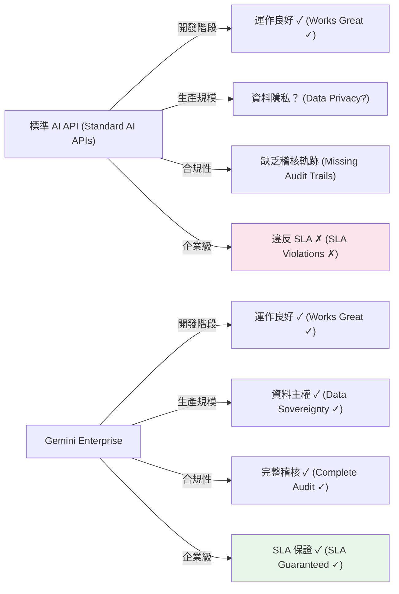

## 快速釐清：Agentspace → Gemini Enterprise (Quick Clarification: Agentspace → Gemini Enterprise)

**給熟悉 Google 代理平台的人的說明**：Google Agentspace 已被 **Gemini Enterprise** 取代。如果您之前在評估 Agentspace，Gemini Enterprise 就是其現代化、可立即投入生產的演進版本，具有增強的合規性、安全性和治理能力 [²]。

## 了解 Google 的 AI 代理生態系統 (Understanding Google's AI Agent Ecosystem)

如果您探索過 Google 的代理產品，您可能遇到過這些術語：Vertex AI Agent Builder、Vertex AI Agent Engine、Agent Development Kit (ADK)、Agent Garden、Gemini Enterprise 和 Agent2Agent Protocol。讓我們釐清它們如何搭配運作 [⁶]。

### 產品版圖 (The Product Landscape)

Google 的 AI 代理生態系統由互補的產品組成，它們協同工作：

**1. Vertex AI Agent Builder** [⁶]

用於在企業規模下發現、建構和部署 AI 代理的綜合平台。這是代理開發的端對端解決方案。

**2. Vertex AI Agent Engine** [⁶]

Agent Builder 中的 **託管執行環境 (managed runtime)**，負責處理部署、擴展和基礎架構管理。這是您將代理部署到生產環境的地方。Agent Engine 功能包括：

- 自動擴展與基礎架構管理
- 支援多種框架 (ADK, LangChain, LangGraph, Crew.ai)
- 用於有狀態對話的記憶體與上下文管理
- 支援 VPC-SC 和 CMEK 以實現企業級安全

**3. Agent Development Kit (ADK)** [⁶]

一個用於以程式碼優先開發建構代理的 **開源 Python 框架**。ADK 強調：

- 精確控制代理的推理與行為
- 支援雙向音訊與視訊串流
- 整合模型內容協議 (MCP) 以獲取多樣化資料來源
- 與 LangChain 和 LangGraph 等框架完全相容
- 部署到 Vertex AI Agent Engine 或地端基礎架構

**4. Agent Garden** [⁶]

可在 Vertex AI Agent Builder 中存取的現成範例、範本和模式的集合。使用這些來快速啟動您的代理開發。

**5. Agent2Agent (A2A) Protocol** [⁶]

一個開放協議 (由 Google 共同創立但由社群管理)，使不同框架和不同供應商建構的代理能夠進行通訊與協作。與 Google 產品 ADK 和 Agent Builder 不同，A2A 是由開源社群管理的 Apache 2.0 許可下的開放標準。這意味著您可以建構可互通的多代理系統，而無需被供應商鎖定。

### Gemini Enterprise 整合 (Gemini Enterprise Integration)

與代理整合的企業級 AI 平台層。它為生產部署提供合規控制、資料主權和治理。

### 它們如何協同工作：開發到部署的管線 (How They Work Together: The Development-to-Deployment Pipeline)

以下是典型的工作流程：

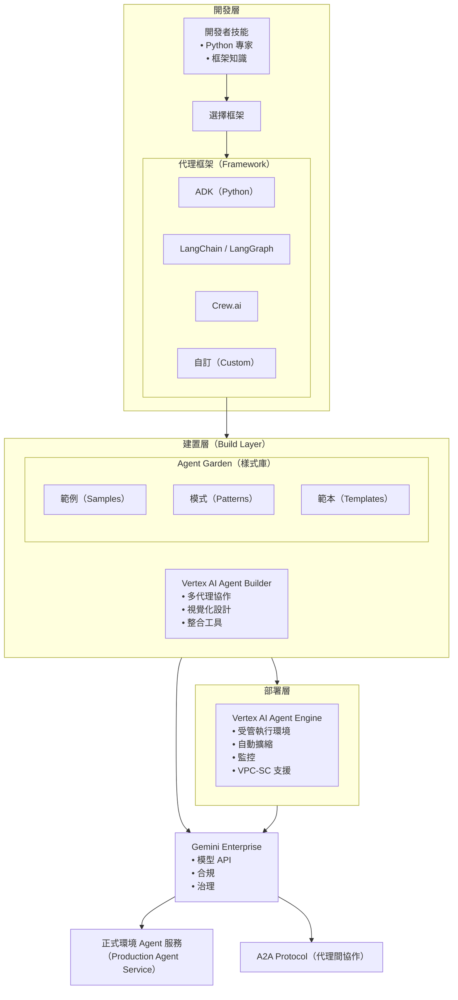

### 代理工作流程解說 (The Agent Workflow Explained)

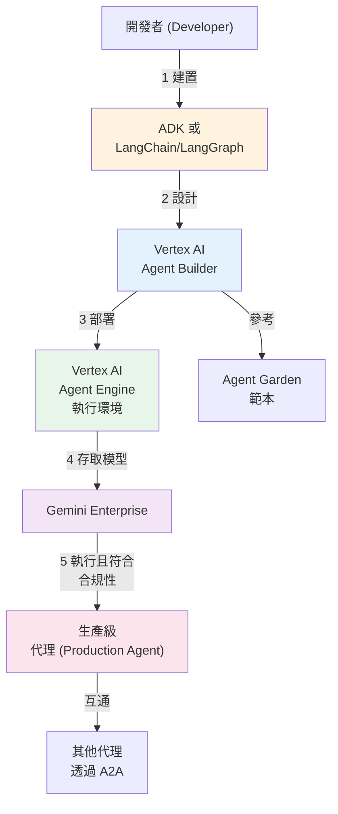

### 何時需要各個元件 (When You Need Each Component)

| 您的情況                               | 您需要的元件                        |
| -------------------------------------- | ----------------------------------- |
| 建構具有完全控制權的簡單代理           | Agent Development Kit (ADK)         |
| 設計企業代理工作流程                   | Vertex AI Agent Builder             |
| 大規模部署代理到生產環境               | Vertex AI Agent Engine              |
| 使用您的企業資料為代理奠基 (Grounding) | Agent Garden 範本 + ADK             |
| 管理合規性與稽核要求                   | Gemini Enterprise 整合              |
| 啟用代理對代理通訊                     | Agent Engine 中的 A2A Protocol 支援 |
| 從範本開始                             | Agent Garden 範例                   |

### 關鍵洞察：框架靈活性 (The Key Insight: Framework Flexibility)

Google 生態系統的一個強大特點是 **框架靈活性**。您可以：

- **選擇性開發**：使用 ADK (Python 或 Java) 建構代理，或使用 LangChain、LangGraph、Crew.ai 和自訂實作
- **整合第三方工具**：ADK 透過包裝器工具原生支援 LangChain 和 CrewAI 生態系統的工具
- **部署任何框架**：將使用任何支援框架建構的代理部署到 Vertex AI Agent Engine 進行生產擴展
- **跨系統連接代理**：使用 A2A Protocol 混合框架進行代理對代理通訊
- **避免供應商鎖定**：永遠不會被鎖定在單一供應商或框架中

這是革命性的，因為這意味著您的團隊可以使用他們最有效率的工具，同時仍能獲得企業級部署、擴展和治理。

## 企業入口網站：代理交付平台 (The Enterprise Portal: Agent Delivery Platform)

Gemini Enterprise 與純模型 API 的一個關鍵區別在於 **企業入口網站 (enterprise portal)** - 一個託管的使用者介面，終端使用者可在此發現、存取並與已部署的代理互動。

### 什麼是 Gemini Enterprise 入口網站？ (What Is Gemini Enterprise's Portal?)

**Gemini Enterprise Portal** (位於 `business.gemini.google`) 是一個統一的介面，讓企業員工無需技術設定或開發知識即可發現和使用 AI 代理。

#### 入口網站功能 (Portal Capabilities)

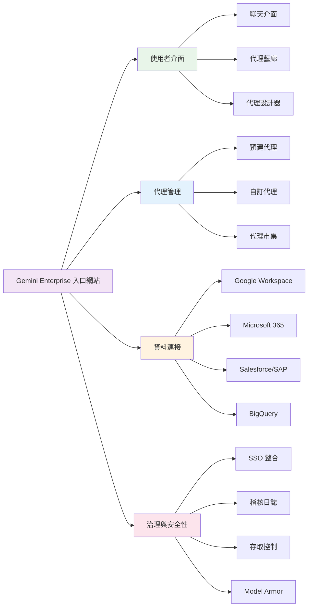

**入口網站關鍵功能：**

| 功能               | 優點                         |
| ------------------ | ---------------------------- |
| **聊天介面**       | 適用於所有 AI 代理的單一工具 |
| **代理藝廊**       | 發現預建和自訂代理           |
| **代理設計器**     | 非技術使用者也能建構代理     |
| **資料 Grounding** | 連接真實企業資料             |
| **權限搜尋**       | 結果尊重使用者的存取層級     |
| **SSO 整合**       | 公司身分整合                 |
| **稽核軌跡**       | 合規記錄 (HIPAA 等)          |
| **管理控制**       | 集中式代理管理               |
| **Model Armor**    | 互動安全篩選                 |

### 這個入口網站是獨一無二的嗎？ (Is This Portal Unique?)

**技術上來說，不是** - 類似的解決方案已經存在：

- **CopilotKit**：用於代理入口網站的開源框架
- **ADK Web**：內建的代理開發 UI
- **自訂入口網站**：任何團隊都可以使用現代框架建構


**Gemini Enterprise 的獨特之處：**

- ✅ 與 Google 基礎架構的專有整合
- ✅ 可立即使用的預建代理
- ✅ 超過 100 種企業系統的預建連接器
- ✅ 託管基礎架構 (無部署負擔)
- ✅ 內建企業合規性
- ✅ 終端使用者零設定
- ❌ 非開源

### 為何入口網站很重要：它解決的問題 (Why the Portal Matters: Problems It Solves)

#### 問題 1：代理蔓延與影子 AI (Problem 1: Agent Sprawl & Shadow AI)

**沒有入口網站：**

```
員工 1 → ChatGPT
員工 2 → Claude
員工 3 → 自訂 LLM 應用程式
員工 4 → 手動工作

結果：無治理、資料外洩
```

**有了入口網站：**

```
所有員工 → Gemini Enterprise 入口網站
             ├─ 深度研究代理
             ├─ 程式碼助理
             ├─ 自訂 HR 代理
             └─ 自訂銷售代理

結果：集中化、受治理、可稽核
```

#### 問題 2：資料合規性與 Grounding (Problem 2: Data Compliance & Grounding)

**標準 API：**
- 模型在公共網際網路資料上訓練
- 無法查看模型訓練資料
- 無法保證資料留在組織內
- 員工可能會分享敏感資料
- 違反資料落地要求

**入口網站：**
- 代理只能查看明確連接的資料
- 權限感知 (尊重列級存取)
- 資料落地在您指定的區域
- 完整的存取稽核軌跡
- Model Armor 篩選敏感資料

#### 問題 3：無需訓練的使用者賦能 (Problem 3: User Enablement Without Training)

**入口網站之前：**
- 使用者需要接受複雜工具的訓練
- 非技術員工無法有效使用
- 需要開發者建構介面

**有了入口網站：**
- 適合商務使用者的無程式碼代理設計器
- 預建代理無需設定即可運作
- 熟悉的聊天介面
- 用於發現的代理市集

#### 問題 4：企業控制與可見性 (Problem 4: Enterprise Control & Visibility)

**沒有入口網站：**
- 無法查看代理使用情況
- 無法強制執行合規政策
- 受監管行業無稽核軌跡
- 無法防止惡意代理
- 無成本追蹤


**有了入口網站：**
- 集中式管理儀表板
- 使用分析與成本追蹤
- 精細的存取控制
- 完整稽核日誌
- Model Armor 安全性
- 合規性報告

### 入口網站與 Google 代理堆疊的整合 (Portal Integration with Google's Agent Stack)

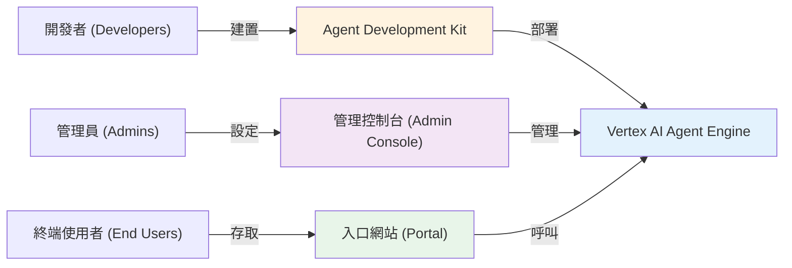

**完整管線：**

<div style='text-align: left;'>
1. 開發者使用 ADK 建構代理
2. 開發者部署到 Vertex AI Agent Engine
3. 管理員在 Gemini Enterprise 中設定：
   - 設定存取控制
   - 連接企業資料
   - 設定合規政策
4. 終端使用者在入口網站中發現代理
5. 終端使用者使用具有企業資料的代理
6. 系統記錄每次互動以符合合規性
</div>

### 入口網站 vs. 替代方案 (Portal vs. Alternatives)

```
          代理交付：選項比較 (AGENT DELIVERY OPTIONS)
───────────────────────────────────────────────────────

GEMINI ENTERPRISE 入口網站 (專有)
─────────────────────────────────────────────────
建置：         ✗ 非開源
成本：         $$$$ (託管基礎架構)
部署：         部署到 Agent Engine，管理員設定
整合：         預建 100+ 系統連接器
合規性：       內建 HIPAA, FedRAMP, SOC 2
價值時間：     1-2 週
控制：         中等 (有限的自訂)
最適合：       想要一站式解決方案的企業


使用 ADK/COPILOTKIT 的自訂入口網站 (開源)
─────────────────────────────────────────────────
建置：         ✓ 完全控制
成本：         $$ (僅基礎架構)
部署：         部署代理 + 自訂 UI
整合：         使用 ADK 工具建構連接器
合規性：       您的責任
價值時間：     4-8 週
控制：         ✓ 完全控制
最適合：       擁有開發資源的團隊


ADK WEB UI (僅開發用)
─────────────────────────────────────────────────
建置：         ✓ 內建，無需編碼
成本：         $$ (僅基礎架構)
部署：         本地執行 adk web 或部署
整合：         有限 (專注於開發)
合規性：       您的責任
價值時間：     < 1 週
控制：         中等 (可設定)
最適合：       開發者本地測試
```

**比較矩陣：**

| 功能               | Enterprise | 自訂 ADK | ADK Web  |
| ------------------ | ---------- | -------- | -------- |
| 預建代理           | ✓ 是       | ✗ 否     | ✗ 否     |
| 預建連接器         | ✓ 100+     | ✗ DIY    | ✗ DIY    |
| 企業合規性         | ✓ 內建     | ✗ DIY    | ✗ DIY    |
| 終端使用者體驗     | ✓ 託管     | ✓ 自訂   | ✓ 基本   |
| 無程式碼代理建構器 | ✓ 是       | ✗ 程式碼 | ✗ 程式碼 |
| 稽核日誌           | ✓ 完整     | ✗ DIY    | ✗ DIY    |
| SSO 支援           | ✓ 是       | ✓ 是     | ✓ 是     |
| 資料落地           | ✓ 是       | ✓ 是     | ✓ 是     |
| 開源               | ✗ 否       | ✓ 是     | ✓ 是     |
| 完全自訂           | ✗ 有限     | ✓ 是     | ✓ 是     |
| 設定時間           | 1-2 週     | 4-8 週   | <1 週    |
| 維運負擔           | 極小       | 高       | 低       |

## Gemini Enterprise vs. Vertex AI Agents：真正的區別 (The Real Difference)

這是許多團隊感到困惑的地方。這兩項服務解決不同的問題。

讓我清楚地分解這一點：

### 什麼是 Vertex AI Agents？

**Vertex AI Agents** 提供用於執行代理工作流程的託管基礎架構：
- **目的**：大規模協調多步驟代理任務
- **重點**：代理組合、工具路由、狀態管理
- **基礎架構**：完全託管、自動擴展的 Google Cloud 基礎架構
- **成本模型**：基於使用量的定價
- **最適合**：建構需要可靠執行的複雜代理工作流程的團隊

### 什麼是 Gemini Enterprise？

**Gemini Enterprise** 是具有合規控制和治理功能的 Gemini 模型企業級存取 [¹]：
- **目的**：提供符合法規的生產級 AI 功能
- **重點**：資料隱私、安全性、合規性、效能保證
- **基礎架構**：具有 VPC-SC 和 CMEK 支援的隔離 Google Cloud 資源
- **成本模型**：具有企業支援的基於容量的定價
- **最適合**：需要資料主權和法規合規性的企業
- **合規性**：支援 HIPAA 和 FedRAMP High [¹]

### 它們是互補的，而非競爭 (They're Complementary, Not Competing)

這是關鍵洞察：**您同時使用 Vertex AI Agents 和 Gemini Enterprise 來運作生產級代理。**

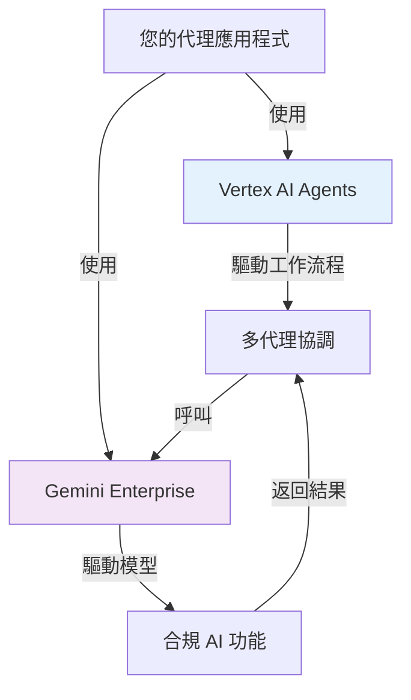

## 功能比較：Gemini Enterprise vs. 標準 Gemini (Feature Comparison)

| 功能         | 標準 Gemini         | Gemini Enterprise       |
| ------------ | ------------------- | ----------------------- |
| **資料儲存** | 多租戶 Google Cloud | 可設定區域 [¹]          |
| **資料保留** | Google 的保留政策   | 自訂政策 [¹]            |
| **加密**     | 標準 TLS            | TLS + 客戶管理金鑰 [¹]  |
| **稽核日誌** | 有限                | 全面稽核軌跡 [¹]        |
| **合規性**   | 一般                | HIPAA, FedRAMP High [¹] |
| **存取控制** | 標準 IAM            | 進階角色存取控制 [¹]    |
| **VPC 整合** | 不可用              | VPC-SC 支援 [¹]         |
| **支援**     | 社群                | 企業支援                |

注意：[¹] 功能適用於 Gemini Enterprise Standard 和 Plus 版本

## 真實場景：Gemini Enterprise 勝出的地方 (Real-World Scenarios)

### 場景 1：醫療保健 AI 代理 (Healthcare AI Agent)

您正在建構一個處理病患記錄並協助治療建議的 AI 代理。

#### 醫療保健：標準 Gemini 問題
- 病患資料經過 Google 的多租戶基礎架構
- 無法保證資料儲存在哪裡
- 稽核軌跡不足以符合 HIPAA 合規性
- 客戶不會批准

#### 醫療保健：Gemini Enterprise 解決方案
- 資料保留在客戶的 VPC 內
- 每個 API 呼叫都有完整的稽核軌跡
- 通過 HIPAA 合規認證
- 客戶立即批准

### 場景 2：金融服務交易代理 (Financial Services Trading Agent)

您正在部署一個分析市場資料並建議交易策略的代理。

#### 交易：標準 Gemini 問題
- FINRA 要求詳細的稽核日誌
- 無法強制執行資料保留要求
- 市場交易時間延遲不可預測
- 經紀客戶要求效能保證

#### 交易：Gemini Enterprise 解決方案
- 每個決策的詳細稽核日誌 [¹]
- 強制執行資料保留和刪除政策
- 專用容量確保一致的效能
- 合規要求的合約支援

### 場景 3：企業資料分析代理 (Enterprise Data Analysis Agent)

您正在建構一個分析敏感公司資料的內部 AI 代理。

#### 分析：標準 Gemini 問題
- 多租戶基礎架構的資料隔離疑慮
- 資料處理實務的透明度有限
- 合規團隊阻止部署
- 資訊安全團隊提出疑慮

#### 分析：Gemini Enterprise 解決方案
- 使用 VPC-SC 的可設定基礎架構隔離 [¹]
- 全面的稽核軌跡和透明度 [¹]
- 合規團隊在適當控制下可以批准 [¹]
- 資訊安全團隊獲得所需的可見性

## 架構：Gemini Enterprise 如何與 Vertex AI Agents 整合 (Architecture Integration)

這就是您架構生產級代理系統的方式：

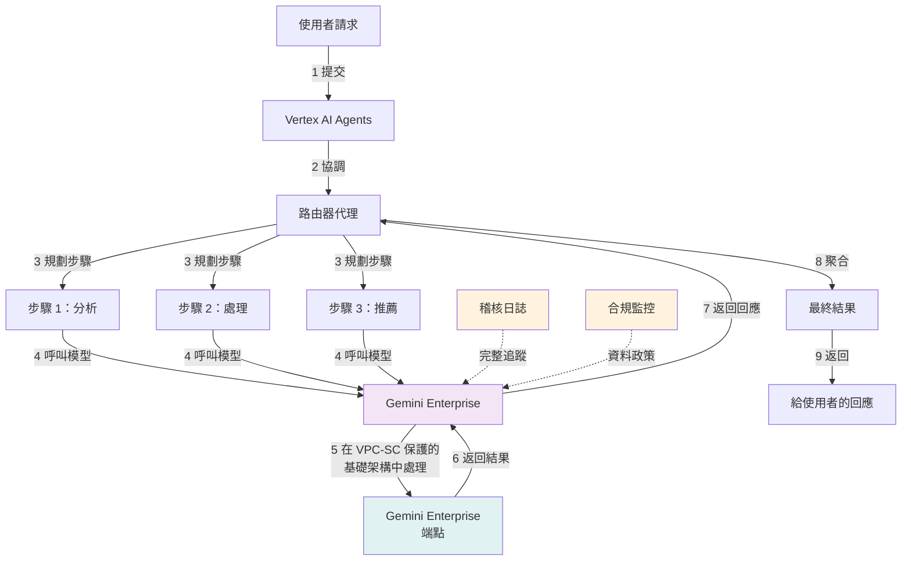

## 何時 Gemini Enterprise 有意義 (The Economics)

### 定價模型比較 (Pricing Model Comparison)

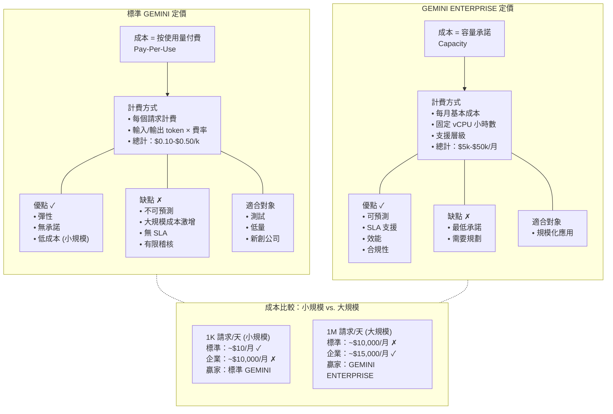

## 決策矩陣：您應該使用 Gemini Enterprise 嗎？ (Decision Matrix)

在決定之前，視覺化您的決策路徑：

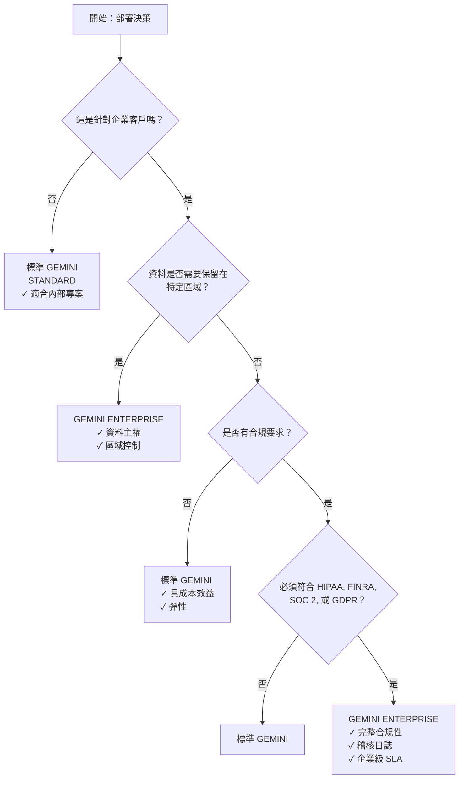

## 遷移路徑：從標準到企業 (Migration Path)

以下是如何策略性地處理這個問題：

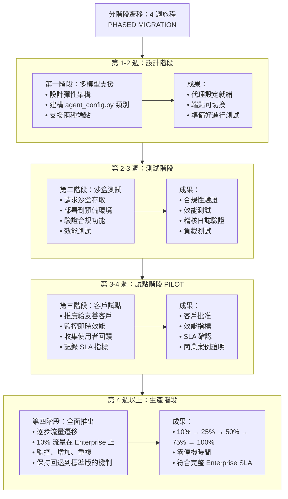

### 第一階段：設計與準備 (Design & Prepare) (第 1-2 週)

建構您的代理程式碼以支援不同的模型端點：

```python
# agent_config.py - 多模型支援 (Multi-model support)
class AgentConfig:
    def __init__(self, environment: str):
        if environment == "production":
            self.model_endpoint = "gemini-enterprise.googleapis.com"
        else:
            self.model_endpoint = "gemini-api.googleapis.com"

    def get_client(self):
        return gemini.Client(endpoint=self.model_endpoint)
```

### 第二階段：沙盒測試 (Test in Sandbox) (第 2-3 週)

請求 Gemini Enterprise 沙盒存取權限進行測試：
- 將代理部署到預備環境 (staging)
- 連接到 Gemini Enterprise 端點
- 驗證合規性和稽核日誌
- 在生產負載下進行效能測試


### 第三階段：單一客戶試點 (Pilot with One Customer) (第 3-4 週)

向一個友善的企業客戶推出：
- 部署具有 Gemini Enterprise 後端的代理
- 監控效能與合規性
- 收集關於稽核軌跡和控制的回饋
- 記錄 SLA 指標


### 第四階段：全面生產遷移 (Full Production Migration) (第 4 週以上)

逐步遷移生產流量：
- 從 10% 流量開始
- 監控效能和成本
- 逐步增加到 100%
- 如果需要，保持回退到標準 Gemini 的能力

## 使用 Google 核心代理技術建構同等產品 (Building Equivalent with Google's Core Agent Technologies)

您可以使用開源 Google 技術建構類似 Gemini Enterprise 的入口網站。以下是您需要的內容：

### 架構堆疊 (The Architecture Stack)

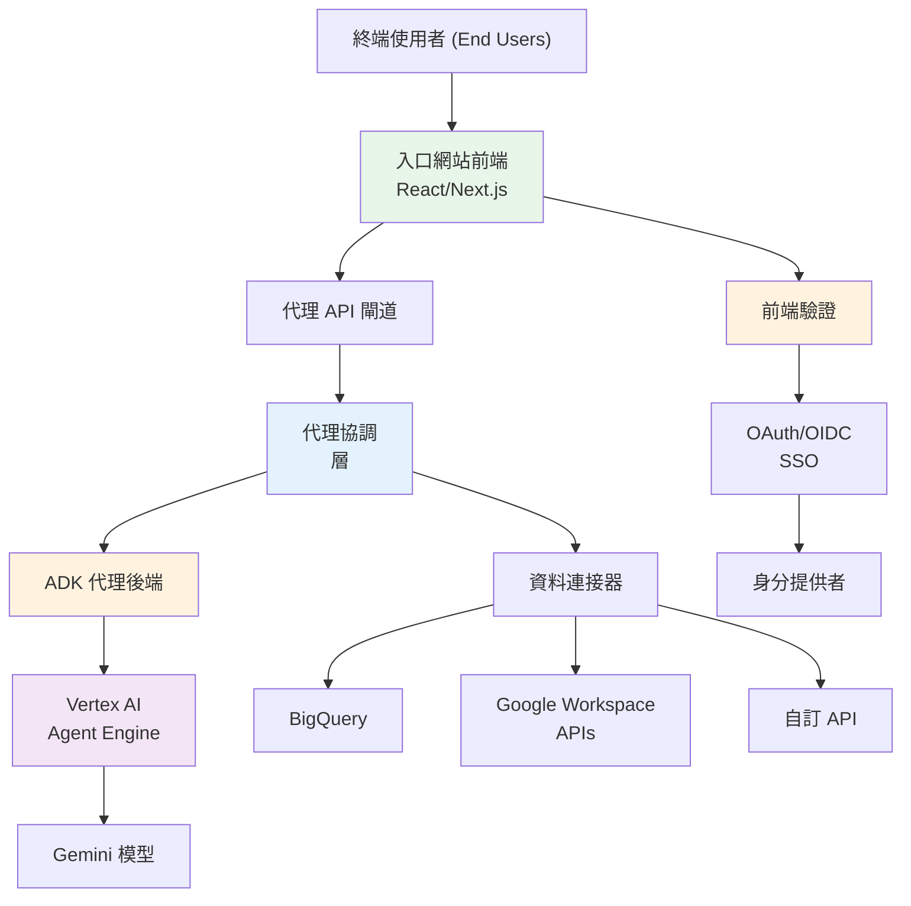

### 技術選擇 (Technology Choices)

**後端代理執行環境 (Backend Agent Runtime)：**
- **主要**：Vertex AI Agent Engine (託管、可立即投入生產)
- **替代**：Cloud Run (更多控制權，自行管理擴展)
- **開發**：使用 `adk web` 開發 UI 進行本地開發

**前端入口網站 (Frontend Portal)：**
- **推薦**：React + Next.js 搭配 CopilotKit
- **預建**：使用 ADK Web UI 作為起點
- **替代**：Angular, Vue, 或自訂框架

**驗證與授權 (Authentication & Authorization)：**
- **SSO**：Google Cloud Identity, Okta, 或 OIDC 提供者
- **權限**：實作基於角色的存取控制 (RBAC)
- **稽核**：Cloud Logging 和 Audit Logging 以符合合規性

**資料連接 (Data Connectivity)：**
- **Google Workspace**：使用 ADK 內建的 Google Workspace 工具
- **BigQuery**：使用 Vertex AI Search 或 BigQuery 連接器
- **自訂 API**：建構 ADK 函式工具或 OpenAPI 工具
- **整合**：使用 Google Cloud Application Integration

### 逐步實作 (Step-by-Step Implementation)

#### 第一階段：建構核心入口網站 (2-3 週)

```bash
# 1. 設定 Next.js + CopilotKit
npx create-next-app@latest agent-portal
cd agent-portal
npm install copilotkit

# 2. 使用 ADK 建立代理後端
pip install google-adk
# 遵循 ADK 模式建構您的代理

# 3. 將後端部署到 Vertex AI Agent Engine 或 Cloud Run
gcloud run deploy agent-service \
  --source . \
  --platform managed \
  --region us-central1

# 4. 設定驗證
# 新增 OAuth2/OIDC 整合到入口網站
# 實作使用者身分驗證
```

#### 第二階段：新增資料連接 (1-2 週)

```python
# 在您的 ADK 代理中，新增資料連接器

from google.adk.agents import Agent
from google.adk.tools import google_search
from google.genai.tools import GoogleWorkspaceTools, BigQueryTools

# 新增企業資料連接器
workspace_tools = GoogleWorkspaceTools()
bq_tools = BigQueryTools()

root_agent = Agent(
    name="enterprise_agent",
    model="gemini-2.5-flash",
    instruction="Help users with enterprise data...", # 協助使用者處理企業資料...
    tools=[
        google_search,
        workspace_tools.docs_search,
        workspace_tools.drive_search,
        bq_tools.query,
        # 在此新增自訂工具
    ]
)
```

#### 第三階段：實作存取控制 (1 週)

```python
# 在代理工具中實作權限檢查

from functools import wraps

def permission_gate(required_permission: str):
    """Decorator to check user permissions before tool execution.
    (裝飾器：在工具執行前檢查使用者權限)"""
    def decorator(func):
        @wraps(func)
        def wrapper(*args, session=None, **kwargs):
            # 從 session 檢查使用者權限
            user_permissions = session.get('user:permissions', [])
            if required_permission not in user_permissions:
                return {
                    'status': 'error',
                    'error': 'Insufficient permissions',
                    'report': f'User lacks {required_permission}'
                }
            return func(*args, session=session, **kwargs)
        return wrapper
    return decorator

@permission_gate('read_bigquery')
def query_data(dataset: str, query: str) -> dict:
    """Query BigQuery with permission checking.
    (進行權限檢查的 BigQuery 查詢)"""
    # 實作內容
    pass
```

#### 第四階段：新增稽核日誌 (1 週)

```python
# 實作全面的稽核日誌

from google.cloud import logging as cloud_logging
import json

client = cloud_logging.Client()
logger = client.logger('agent-audit')

def log_agent_interaction(session_id: str,
                         user_id: str,
                         agent_name: str,
                         action: str,
                         status: str):
    """Log agent interactions for audit compliance.
    (記錄代理互動以符合稽核合規性)"""
    log_entry = {
        'timestamp': datetime.now().isoformat(),
        'session_id': session_id,
        'user_id': user_id,
        'agent_name': agent_name,
        'action': action,
        'status': status,
    }
    logger.log_struct(log_entry, severity='INFO')

# 掛鉤 (Hook) 到代理執行
@root_agent.on_execution_start
def log_start(session, invocation):
    log_agent_interaction(
        session.id,
        session.get('user:id'),
        root_agent.name,
        'execution_start',
        'started'
    )
```

### 完整範例：AI 研究入口網站 (Complete Example: AI Research Portal)

以下是建構研究助理入口網站的實務範例：

```python
# agent.py - 後端代理 (Backend agent)
from google.adk.agents import Agent
from google.adk.tools import google_search, code_execution

def search_research_topic(topic: str, depth: str) -> dict:
    """Search and synthesize research on a topic.
    (搜尋並綜合關於主題的研究)"""
    # 使用 Google Search grounding 的實作
    pass

def generate_report(research: dict, format: str) -> dict:
    """Generate formatted research report.
    (生成格式化的研究報告)"""
    # 實作
    pass

root_agent = Agent(
    name="research_assistant",
    model="gemini-2.5-flash",
    instruction="""您是一位研究助理。透過線上搜尋、綜合資訊並生成綜合報告來協助使用者研究主題。
    """,
    tools=[
        google_search,
        search_research_topic,
        generate_report,
        code_execution  # 用於資料分析
    ]
)
```

```typescript
// portal.tsx - 前端入口網站 (Frontend portal)
import { CopilotKit } from 'copilotkit/react';
import { CopilotSidebar } from 'copilotkit/react-ui';

export default function ResearchPortal() {
  return (
    <CopilotKit runtimeUrl='/api/copilotkit' agent='research_assistant'>
      <div className='flex h-screen'>
        <main className='flex-1'>
          <h1>AI Research Assistant</h1>
          <p>Explore topics with AI-powered research</p>
        </main>
        <CopilotSidebar
          defaultOpen={true}
          labels={{
            title: 'Research Assistant',
            initial: 'What would you like to research?',
          }}
        />
      </div>
    </CopilotKit>
  );
}
```

### 自行建構的優點 (Advantages of Building Your Own)

- ✅ **完全控制** UI/UX 和使用者體驗
- ✅ 針對您業務的 **自訂整合**
- ✅ **開源** - 您擁有程式碼庫
- ✅ **資料屬於您** - 無供應商鎖定
- ✅ **可擴充** - 根據需要新增功能
- ✅ **具成本效益** - 適合中小型規模

### 與 Gemini Enterprise 相比的缺點 (Disadvantages vs. Gemini Enterprise)

- ❌ **開發工作** - 需要工程資源 (4-8 週)
- ❌ **維運負擔** - 您需自行管理擴展、安全性、更新
- ❌ **無預建代理** - 必須自行建構所有內容
- ❌ **無預建連接器** - 必須自行建構整合
- ❌ **合規責任** - 您需實作稽核日誌等
- ❌ **較小的連接器生態系統** - 相較於 Gemini 的 100+ 預建連接器


### 何時自行建構 vs. 購買 (When to Build vs. Buy)

| 場景                     | 建議                     |
| ------------------------ | ------------------------ |
| 需要快速部署的企業       | 購買 (Gemini Enterprise) |
| 需要完全自訂 + 開發團隊  | 建構 (ADK + CopilotKit)  |
| 具有特定需求的受監管產業 | 建構 (完全控制)          |
| 快速原型/MVP             | 建構 (快速迭代)          |
| 需要生產 SLA 保證        | 購買 (Gemini Enterprise) |
| 需要非標準資料來源       | 建構 (自訂連接器)        |
| 預算有限的新創公司       | 建構 (較低的持續成本)    |
| 擁有合規團隊的大型組織   | 購買 (讓 Google 處理)    |

## 關鍵要點 (Key Takeaways)
1. **Gemini Enterprise Portal** 是一個完整的終端使用者介面，用於在整個企業中消費 AI 代理。

2. **它在功能上並非獨一無二** - 您可以使用 ADK、CopilotKit 或其他框架建構類似的入口網站。

3. **價值來自於整合** - 預建代理、100+ 連接器、企業合規性和託管基礎架構。

4. **您可以建構同等產品** - 如果您有開發資源，可以使用開源技術。

5. **權衡很明顯**：

   - **Gemini Enterprise**：快速部署、最少維運、預建功能
   - **使用 ADK DIY**：完全控制、較低成本、更多開發工作

6. **根據您的限制選擇**：

   - 時間：選擇 Gemini Enterprise
   - 預算：使用 ADK + CopilotKit 建構
   - 控制：建構自訂入口網站
   - 合規性：考慮 Gemini Enterprise 的認證

7. **兩種方法都可行** - 正確的選擇取決於您的具體情況和限制。

## 下一步是什麼？ (What's Next?)

如果您正在建構代理並考慮企業部署：
- 稽核您的資料流以了解主權需求
- 儘早規劃您的多模型架構
- 請求 Gemini Enterprise 沙盒存取進行測試

考慮企業準備的最佳時機是在您的代理進入生產環境之前。第二好的時機就是現在。

---

**您是否使用 Gemini Enterprise 部署過代理？歡迎在評論中分享您的經驗！**

## 來源與參考 (Sources & References)

**[1] Gemini Enterprise 官方文件**

- 產品：[cloud.google.com/gemini-enterprise](https://cloud.google.com/gemini-enterprise)
- VPC-SC、客戶管理加密金鑰、合規功能 (HIPAA, FedRAMP High)
- 適用於 Gemini Enterprise Standard 和 Plus 版本

**[2] Google Agentspace 停用 (Google Agentspace Deprecation)**

- Agentspace 已被 Gemini Enterprise 取代
- Gemini Enterprise 是具有增強合規性和治理功能的演進平台
- 參考：Gemini Enterprise 常見問題 - "What happened to Google Agentspace?"

**[3] Google Cloud 安全性與治理**

- 對所有代理、權限和政策的集中可見性和控制
- 使用 Model Armor 主動篩選惡意和不安全的互動
- 使用進階功能對資料存取和主權進行精細控制

**[4] Google Cloud 合規性支援**

- Gemini Enterprise Standard 和 Plus 版本支援 HIPAA 和 FedRAMP High 工作負載
- 用於主權要求的資料落地控制
- 全面的稽核日誌和透明度控制


**[5] Vertex AI Agents**

- Google 用於建構和部署代理應用程式的平台
- 與 Google Cloud 基礎架構整合以實現可靠執行

**[6] Google 的 AI 代理生態系統**

- Vertex AI Agent Builder：用於建構和部署代理的端對端平台
- Vertex AI Agent Engine：用於生產代理部署的託管執行環境
- Agent Development Kit (ADK)：用於代理開發的開源 Python 框架
- Agent Garden：用於代理建構的範本和範例集合
- Agent2Agent Protocol：用於代理互通性的開放標準
- 參考：[Vertex AI Agent Builder 概覽](https://cloud.google.com/vertex-ai/generative-ai/docs/agent-builder/overview)
- 參考：[GitHub 上的 Agent Development Kit](https://github.com/google/adk-python)

## 免責聲明 (Disclaimer)

本文基於 2025 年 10 月的 Google Cloud 公開文件。有關 Gemini Enterprise 功能、合規性支援和 SLA 條款的最新資訊，請參閱 Google Cloud 官方文件並聯繫 Google Cloud 銷售人員以了解具體需求。
