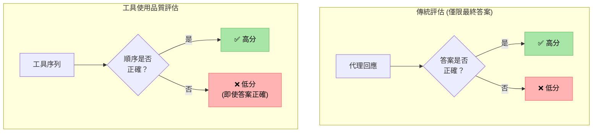
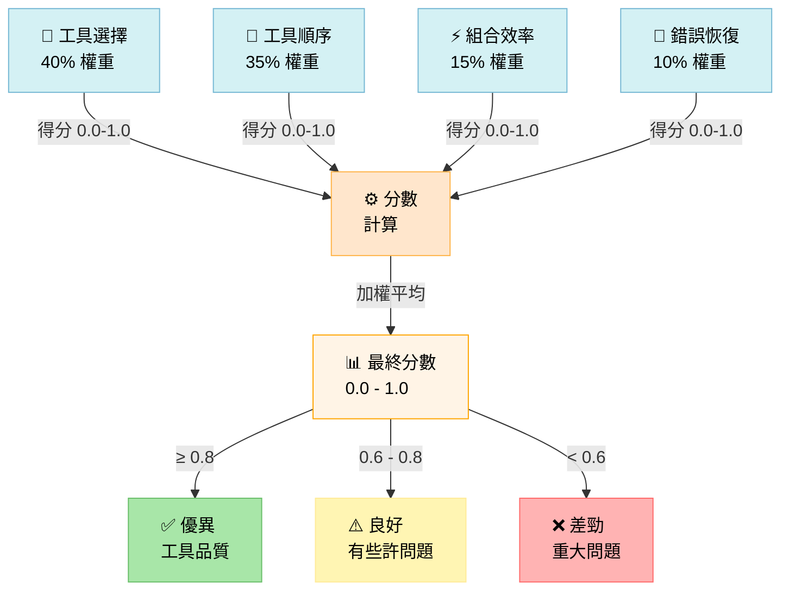
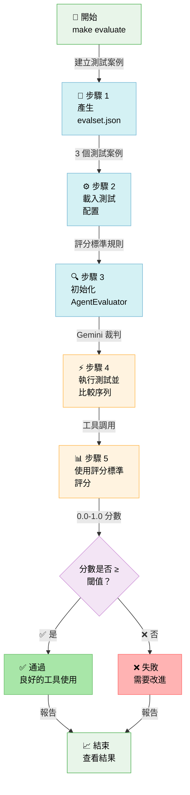

# TIL: 使用 Google ADK 1.16 評估工具使用品質 (Evaluating Tool Use Quality with Google ADK 1.16)

> 📝 **原文翻譯自 Raphaël MANSUY 的 Blog**：[TIL: Evaluating Tool Use Quality with Google ADK 1.16](https://raphaelmansuy.github.io/adk_training/blog/til-tool-use-quality)

## 簡介 (Overview)

您的代理雖然得到了正確的最終答案，但它達成的方式正確嗎？了解如何使用 ADK 1.16 基於評分標準的評估框架來評估工具選擇和使用的品質。

## TIL：評估工具使用品質 - 您的代理是否選擇了正確的工具？ (Evaluating Tool Use Quality - Does Your Agent Pick the Right Tools?)

### 問題 (The Problem)

**情境**：您的代理得到了正確的最終答案，但它達成的方式正確嗎？

想像您有一個數據分析代理：

- ✅ 產生了正確的報告（最終答案很好）
- ❌ 但使用了錯誤的數據查詢工具（低效率）
- ❌ 以錯誤的順序調用工具（浪費資源）
- ❌ 遺漏了更好的工具組合（非最佳化）

**差距**：僅評估最終答案會忽略這些關鍵問題。您需要評估代理使用工具的效果。

**一句話總結**：工具使用品質指標 (Tool Use Quality Metric) 用於評估代理是否選擇了正確的工具並適當地使用它們來解決問題，這與最終答案的品質是分開的。

### 為什麼您應該關注？ (Why Should You Care?)

**解決的問題：**

- 🎯 **捕捉工具選擇錯誤** - 儘管存在正確的工具，代理卻選擇了錯誤的工具。
- 🔄 **防止工具誤用** - 確保工具按邏輯順序調用。
- ⚡ **識別效率低下** - 發現不必要的工具調用或遺漏的組合。
- 📊 **關注點分離** - 工具品質與答案品質使用不同的指標。
- 🔍 **改善代理訓練** - 提供關於工具相關失敗的精確回饋。

**實際影響：**

一個客戶支援代理：

- 在 `process_refund()` 之後才調用 `get_customer_info()`（順序錯誤）。
- 退款處理正確（最終答案看起來很好）。
- 但違反了業務邏輯（應先驗證客戶）。

**如果沒有工具使用品質指標**：您會錯過這個錯誤。最終答案是「正確」的。

**有了工具使用品質指標**：您可以立即發現它。工具順序評估將會失敗。

### 快速範例：運行實際評估 (Quick Example: Running Real Evaluation)

ADK 提供 `AgentEvaluator.evaluate()` 來運行實際的 `RUBRIC_BASED_TOOL_USE_QUALITY_V1` 評估：

```python
import asyncio
from google.adk.evaluation.agent_evaluator import AgentEvaluator

async def run_evaluation():
    # 自動評估步驟：
    # 1. 載入您的代理模組
    # 2. 針對 evalset.json 中的測試案例執行
    # 3. LLM 裁判根據評分標準評估工具序列
    # 4. 報告通過/失敗及得分

    results = await AgentEvaluator.evaluate(
        agent_module="tool_use_evaluator",
        eval_dataset_file_path_or_dir="tool_use_quality.evalset.json",
    )

    # 結果包含：
    # - 整體分數 (0.0-1.0)
    # - 各項評分標準的分數
    # - 預期與實際工具調用的對照
    # - 相對於閾值的通過/失敗狀態
    print(results)

asyncio.run(run_evaluation())
```

**這項操作的作用：**

1. ✅ 載入 `tool_use_evaluator` 代理。
2. ✅ 從 evalset 讀取測試案例（好/壞的工具序列）。
3. ✅ 使用 4 個評分標準執行評估配置。
4. ✅ 調用 Gemini 模型作為裁判（每個標準 3 個樣本）。
5. ✅ 返回分數和詳細對照。

**預期輸出：**

```
Summary: `EvalStatus.FAILED` for Metric: `rubric_based_tool_use_quality_v1`.
Expected threshold: `0.7`, actual value: `0.25`.

[詳細表格顯示：]
- eval_status: FAILED/PASSED (失敗/通過)
- score: 0.25 (未達到 0.7 的閾值)
- prompt: "分析並準備數據集..."
- expected_response: "數據集已分析..."
- actual_response: "好的，我將分析數據集..."
- expected_tool_calls: analyze_data → extract_features → validate_quality
- actual_tool_calls: [若未調用則為空，或顯示實際調用列表]
```

**關鍵洞察：** 評估精確顯示了代理偏離預期工具序列的地方，使其易於識別和修復工具使用問題。

### 運作原理（3 個核心概念） (How It Works (3 Key Concepts))

#### 1. 將工具品質與答案品質分離 (Separating Tool Quality from Answer Quality)

與最終回應評估不同，工具使用品質專門關注與工具相關的決策：



**關鍵洞察**：來自錯誤工具序列的正確答案 = 較低的工具使用品質，即使最終答案品質很高。

#### 2. 基於評分標準的評估框架 (Rubric-Based Evaluation Framework)

該指標使用以下評分標準進行檢查：

```
工具使用品質評分標準：

1. 工具選擇適當性 (40%)
   ✓ 選擇的工具是否適合該任務？
   ✗ 在有更好選擇時，代理是否使用了錯誤的工具？
   ✗ 代理是否使用了已棄用/低效率的工具？

2. 工具順序邏輯 (35%)
   ✓ 工具是否按邏輯順序調用？
   ✗ 工具 3 是否依賴於工具 2 的輸出（但順序反了）？
   ✗ 工具之間是否有不必要的上下文切換？

3. 工具組合效率 (15%)
   ✓ 代理是否有效地組合了工具？
   ✗ 是否遺漏了明顯的工具組合？
   ✗ 當一個工具就足夠時，是否過度使用工具？

4. 錯誤恢復 (10%)
   ✓ 如果工具失敗，代理是否重試/更換方案？
   ✗ 在第一次工具失敗後就放棄了？
   ✗ 重複同樣失敗的工具調用？

總體品質分數 = 以上各項的加權平均值
```

**評分標準如何組合成最終分數的可視化分解：**



#### 3. 與其他指標的區別 (Distinction from Other Metrics)

| 指標 | 評估內容 | 範例 |
| :--- | :--- | :--- |
| **最終回應品質 (Final Response Quality)** | 答案是否正確？ | 「報告是否準確？」 |
| **工具使用品質 (Tool Use Quality)** | 代理是否良好地使用工具？ | 「代理是否查詢了正確的資料庫？」 |
| **安全性評估器 (Safety Evaluator)** | 是否安全/合規？ | 「代理是否違反了護欄規則？」 |
| **軌跡評估 (Trajectory)** | 完整執行路徑 | 「整個推理過程是否穩健？」 |

**關鍵區別**：工具使用關注的是**過程**，而非結果。

```
範例查詢："獲取客戶最近 3 筆訂單並計算退款"

代理 A：
1. 調用：get_customer() → 返回客戶資訊
2. 調用：get_orders() → 返回最近 3 筆訂單
3. 調用：calculate_refund() → 正確答案！

代理 B：
1. 調用：calculate_refund() → 錯誤（沒有客戶上下文）
2. 調用：get_customer() → 返回客戶資訊
3. 調用：get_orders() → 終於得到正確答案！

最終回應品質：
  代理 A：✅ 高（正確答案）
  代理 B：✅ 高（正確答案）

工具使用品質：
  代理 A：✅ 高（邏輯順序，正確工具）
  代理 B：❌ 低（順序錯誤，浪費調用）
```

### 使用案例 1：數據分析代理 (Use Case 1: Data Analytics Agent)

```python
# 評估數據分析代理的工具使用情況
criterion = Criterion(
    name="data_pipeline_quality",
    description="代理以最佳順序使用正確的數據工具",
    metric=PrebuiltMetrics.RUBRIC_BASED_TOOL_USE_QUALITY_V1,
    threshold=0.8,
)

# 好的工具序列：提取 (Extract) → 轉換 (Transform) → 聚合 (Aggregate)
# 壞的工具序列：聚合 → 轉換 → 提取（順序錯誤！）
# 或者：提取 → 提取 → 提取（遺漏轉換步驟）
```

**它能捕捉到什麼：**

- ✅ 正確的工具順序（轉換前先提取）。
- ❌ 跳過必要的轉換步驟。
- ❌ 使用錯誤的數據源工具。
- ❌ 資料集之間缺少關聯 (Join)。

### 使用案例 2：客戶支援代理 (Use Case 2: Customer Support Agent)

```python
# 評估支援代理的工具使用情況
criterion = Criterion(
    name="support_workflow_quality",
    description="代理遵循正確的支援工作流程",
    metric=PrebuiltMetrics.RUBRIC_BASED_TOOL_USE_QUALITY_V1,
    threshold=0.75,
)

# 正確的工作流程：驗證 (Verify) → 評估 (Assess) → 解決 (Resolve)
# 壞的工作流程：解決 → 驗證（順序反了！）
# 或者：驗證 → 驗證 → 評估（重複冗餘）
```

**它能捕捉到什麼：**

- ✅ 退款處理前的驗證。
- ❌ 在不檢查客戶狀態的情況下處理退款。
- ❌ 兩次檢查相同的條件。
- ❌ 遺漏授權步驟。

### 使用案例 3：研究代理 (Use Case 3: Research Agent)

```python
# 評估研究代理的工具使用情況
criterion = Criterion(
    name="research_methodology",
    description="代理有條理地使用研究工具",
    metric=PrebuiltMetrics.RUBRIC_BASED_TOOL_USE_QUALITY_V1,
    threshold=0.85,
)

# 好的序列：搜尋 (Search) → 檢索 (Retrieve) → 交叉引用 (Cross-reference) → 綜合 (Synthesize)
# 壞的序列：搜尋 → 綜合（遺漏驗證步驟）
# 或者：搜尋 → 交叉引用 → 檢索（順序錯誤）
```

**它能捕捉到什麼：**

- ✅ 正確的研究流程。
- ❌ 在驗證來源前進行綜合。
- ❌ 遺漏對比分析步驟。
- ❌ 未交叉檢查資訊。

### 配置參考 (Configuration Reference)

```python
from google.adk.evaluation import (
    Criterion,
    PrebuiltMetrics,
    LlmAsJudge,
)

# 使用工具使用指標定義評估標準
criterion = Criterion(
    name="tool_use_quality",
    description="評估工具選擇和使用的品質",
    metric=PrebuiltMetrics.RUBRIC_BASED_TOOL_USE_QUALITY_V1,
    threshold=0.7,  # 要求 70% 的工具使用品質
)

# 建立評估器
evaluator = LlmAsJudge(
    model="gemini-2.0-flash",  # 用於評估的 LLM
    criteria=[criterion],
)

# 評估代理執行情況
result = evaluator.evaluate(
    invocation=agent_result,
)
```

| 參數 | 類型 | 用途 |
| :--- | :--- | :--- |
| `metric` | Enum | 設置為 `PrebuiltMetrics.RUBRIC_BASED_TOOL_USE_QUALITY_V1` |
| `threshold` | float | 通過/失敗的最低分數 (0-1) |
| `name` | str | 易於閱讀的標準名稱 |
| `description` | str | 您正在評估的內容 |

### 專業技巧 (Pro Tips)

💡 **技巧 1 - 組合指標**：結合工具使用品質與最終回應品質進行全面評估。

```python
criteria = [
    Criterion(
        name="final_answer_quality",
        metric=PrebuiltMetrics.RUBRIC_BASED_FINAL_RESPONSE_QUALITY_V1,
        threshold=0.8,
    ),
    Criterion(
        name="tool_use_quality",
        metric=PrebuiltMetrics.RUBRIC_BASED_TOOL_USE_QUALITY_V1,
        threshold=0.7,
    ),
]

# 現在您可以捕捉到這兩種情況：
# - 幸運得到正確答案但方法錯誤的代理
# - 工具使用完美但答案錯誤的代理
```

💡 **技巧 2 - 設置現實的閾值**：工具使用很複雜；初期設置閾值時可以寬容一些。

```python
# 太嚴苛 - 很少能通過
threshold=0.95  # ❌ 不切實際

# 現實的基準
threshold=0.7   # ✅ 允許一些低效率

# 專注於改進後
threshold=0.8   # ✅ 在優化後使用
```

💡 **技巧 3 - 記錄工具序列以便除錯**：當工具使用品質較低時，檢查實際的序列。

```python
# 在您的代理回調/日誌中
print("使用的工具序列:", [
    tool_call.name for tool_call in invocation.tool_calls
])

# 與最佳序列對照：
print("最佳序列:", expected_tools)

# 可視化差異以識別模式
```

### 何時不要使用它 (When NOT to Use It)

⚠️ **在以下情況應避免使用：**

- 只有一個工具的簡單代理（沒有序列可供評估）。
- 無工具的工作流程（例如，純推理代理）。
- 工具使用是非確定性的（確實沒有「正確」的順序）。
- 僅測試最終答案的正確性（請改用回應品質指標）。

⚠️ **應結合以下指標：**

- **最終回應品質 (Final Response Quality)**：獨立檢查答案正確性。
- **安全性評估器 (Safety Evaluator)**：確保工具使用符合規範。
- **軌跡評估器 (Trajectory Evaluator)**：完整執行路徑分析。

### 完整的工作實作 (Complete Working Implementation)

完整的實作包含：

- 展示不同使用模式的多工具代理。
- 帶有標準的評估框架設置。
- 驗證評估的綜合測試套件。
- 可供評估的真實調用範例。
- 開發與測試工具。

```bash
cd til_implementation/til_rubric_based_tool_use_quality_20250121/
make setup       # 安裝依賴項
make test        # 執行評估測試
make evaluate    # ⭐ 執行真實評估 (新功能！)
make dev         # 啟動互動式評估 UI
make demo        # 快速驗證
```

**`make evaluate` 命令（真實評估）：**

```bash
$ make evaluate

📝 測試案例摘要
測試案例 1: good_sequence_complete_pipeline
  描述：完整的 4 步管道（分析 → 提取 → 驗證 → 應用）
  預期分數：0.95-1.0（優異）

測試案例 2: bad_sequence_skipped_validation
  描述：缺少步驟（提取 → 應用，沒有分析或驗證）
  預期分數：0.25-0.4（差勁）

測試案例 3: good_sequence_proper_analysis
  描述：良好的分析管道（分析 → 提取 → 驗證）
  預期分數：0.8-0.9（良好）

🔍 正在執行評估
📋 評估配置
閾值：0.7
裁判模型：gemini-2.5-flash
評分標準：4 項
  • proper_tool_order: 代理在 extract_features 之前調用 analyze_data...
  • complete_pipeline: 所有 4 個工具按順序調用...
  • validation_before_model: 在建模前驗證品質...
  • no_tool_failures: 所有工具調用均以正確參數成功執行...

[LLM 裁判根據評分標準評估每個測試案例...]

⚠️ 評估已執行，但測試案例未達到評分閾值：
   預期閾值：0.7，實際值：0.25

這意味著評估框架運作正常！
測試代理不符合預期的工具序列。

在真實場景中，您應該：
1. 審視上方預期與實際工具調用的對照。
2. 調整代理指令以符合預期行為。
3. 重新執行評估以查看分數是否提高。
```

**底層運作機制：**

```python
# evaluate_tool_use.py 建立：
evalset = {
    "eval_cases": [
        {
            "eval_id": "good_sequence_complete_pipeline",
            "intermediate_data": {
                "tool_uses": [
                    {"name": "analyze_data", ...},
                    {"name": "extract_features", ...},
                    {"name": "validate_quality", ...},
                    {"name": "apply_model", ...}
                ]
            }
        },
        # ... 以及損壞和部分的序列
    ]
}

# 然後調用：
results = await AgentEvaluator.evaluate(
    agent_module="tool_use_evaluator",
    eval_dataset_file_path_or_dir="tool_use_quality.evalset.json",
)

# 內部步驟：
# 1. 載入您的代理
# 2. 比較實際工具調用與預期調用
# 3. 使用 Gemini 作為裁判根據評分標準進行評估
# 4. 返回分數 (0.0-1.0)
# 5. 顯示相對於閾值的通過/失敗情況
```

**完整評估工作流可視化：**



**測試實作：**

```bash
# 從實作目錄執行
pytest tests/ -v

# 預期輸出：
# test_agent.py::TestAgentConfiguration::test_agent_name PASSED
# test_agent.py::TestAgentConfiguration::test_agent_has_tools PASSED
# test_agent.py::TestToolFunctionality::test_analyze_data_success PASSED
# test_tool_use_evaluator.py::test_evaluation_framework PASSED
#
# 23 passed in 0.42s
```

### 真實世界範例：多步驟查詢 (Real-World Example: Multi-Step Query)

以下是工具使用品質如何揭示隱藏問題：

```python
# 情境：客戶請求退款分析

# 代理執行：
def agent_workflow():
    # 步驟 1：驗證客戶是否存在
    result1 = get_customer(customer_id="12345")

    # 步驟 2：檢查訂單歷史
    result2 = get_orders(customer_id="12345")

    # 步驟 3：計算符合條件的退款
    result3 = calculate_refund(orders=result2.data)

    # 步驟 4：處理退款
    result4 = process_refund(customer_id="12345", amount=result3.amount)

    return result4

# 評估結果：

最終回應品質：✅ 通過 (0.9)
  - 退款金額正確
  - 客戶 ID 正確
  - 文件齊備

工具使用品質：❌ 失敗 (0.45)
  - ❌ 調用了 get_customer() 但從未使用其結果
  - ✅ 正確順序：驗證 → 檢查訂單 → 計算 → 處理
  - ❌ 原本可以將驗證 + 訂單檢查合併為單次調用
  - ❌ get_customer() 返回了不需要的敏感數據（安全問題）

需要改進：優化工具使用，而非答案正確性
```

**可視化對比：好與壞的工具順序：**

```mermaid
graph TD
    subgraph Good["✅ 良好的工具序列 (得分: 0.9)"]
        G1["<div style='text-align: left;'>1️⃣ get_customer<br/>客戶 ID</div>"]
        G2["<div style='text-align: left;'>2️⃣ get_orders<br/>客戶 ID</div>"]
        G3["<div style='text-align: left;'>3️⃣ calculate_refund<br/>訂單數據</div>"]
        G4["<div style='text-align: left;'>4️⃣ process_refund<br/>金額</div>"]

        G1 -->|結果| G2
        G2 -->|訂單| G3
        G3 -->|金額| G4
        G4 -->|退款已處理| G_Result["<div style='text-align: left;'>✅ 成功<br/>流程正確</div>"]
    end

    subgraph Bad["❌ 錯誤的工具序列 (得分: 0.35)"]
        B1["<div style='text-align: left;'>1️⃣ calculate_refund<br/>❌ 尚無數據！</div>"]
        B2["<div style='text-align: left;'>2️⃣ get_customer<br/>客戶 ID</div>"]
        B3["<div style='text-align: left;'>3️⃣ get_orders<br/>客戶 ID</div>"]
        B4["<div style='text-align: left;'>4️⃣ process_refund<br/>錯誤金額</div>"]

        B1 -->|錯誤| B2
        B2 -->|重試| B3
        B3 -->|訂單| B4
        B4 -->|退款失敗| B_Result["<div style='text-align: left;'>❌ 順序錯誤<br/>額外調用</div>"]
    end

    style Good fill:#f0f9f0,stroke:#a8e6a8,color:#000
    style Bad fill:#fef5f5,stroke:#ffb3b3,color:#000
    style G_Result fill:#a8e6a8,stroke:#6bbf6b,color:#000
    style B_Result fill:#ffb3b3,stroke:#ff6b6b,color:#000
    style G1 fill:#d4f1f4,stroke:#76b8d4,color:#000
    style G2 fill:#d4f1f4,stroke:#76b8d4,color:#000
    style G3 fill:#d4f1f4,stroke:#76b8d4,color:#000
    style G4 fill:#d4f1f4,stroke:#76b8d4,color:#000
    style B1 fill:#ffe6e6,stroke:#ff9999,color:#000
    style B2 fill:#ffe6e6,stroke:#ff9999,color:#000
    style B3 fill:#ffe6e6,stroke:#ff9999,color:#000
    style B4 fill:#ffe6e6,stroke:#ff9999,color:#000
```



### 理解評分標準計分 (Understanding Rubric Scoring)

工具使用品質會產生一個 **0.0-1.0 的單一分數**：

```
1.0 = 完美的工具使用
  - 任務所需的工具正確
  - 最佳序列
  - 無浪費或錯誤
  - 完美的恢復能力

0.8 = 非常好
  - 工具正確，有輕微低效率
  - 一次不必要的調用
  - 良好的錯誤處理

0.5 = 尚可
  - 答案正確但工具選擇不佳
  - 某些工具使用錯誤
  - 順序顛倒

0.0 = 失敗
  - 完全錯誤的工具
  - 工具調用順序錯誤
  - 不必要的工具組合
```

### 學習後的後續步驟 (Next Steps After Learning)

1. 📖 **閱讀相關評估教學**：關於 ADK 評估框架的教學，以獲得全面了解。
2. 🚀 **在您的代理中實作**：在您的評估管道中使用工具使用品質標準。
3. 🔧 **結合其他指標**：建立結合多個標準的綜合評估。
4. 📊 **隨時間追蹤指標**：在改進代理時監控工具使用品質。

## 關鍵結語 (Key Takeaway)

**工具使用品質評估能發現最終答案指標所遺漏的隱藏問題。**

您的代理可能透過錯誤的過程得到了正確的答案。工具使用品質指標迫使您關注代理如何解決問題，而不僅僅是它們是否解決了問題。

這對於效率、合規性和正確工作流與正確性同樣重要的生產環境代理來說非常完美。

在進入生產環境前捕捉工具誤用。 ✨

---

## 程式碼實現 (Code Implementation)

- [til-rubric-based-tool-use-quality](../../../python/agents/til-rubric-based-tool-use-quality/)

---

## 延伸閱讀 (See Also)

### 相關 TIL

- **[TIL: 暫停與恢復調用 (Pause and Resume Invocations)](./2025-10-20-til-pause-resume.md)** -
  使用暫停/恢復來實作「人機協作」工作流，在繼續執行前驗證工具品質。非常適合在檢查點評估代理決策。

- **[TIL: 上下文壓縮 (Context Compaction)](./2025-10-19-til-context-compaction.md)** -
  確保上下文壓縮不會降低工具選擇品質。在上下文變得更壓縮時監控工具使用品質指標。

- **[返回 TIL 索引](./README.md)** - 瀏覽所有快速學習指南

### 相關 ADK 教學 (Related ADK Tutorials)

- **[教學 01：Hello World 代理 (Hello World Agent)](../adk_training/01-hello_world_agent.md)** -
  了解將被評估工具品質的代理基礎。

- **[教學 02：函數工具 (Function Tools)](../adk_training/02-function_tools.md)** -
  學習如何設計代理將使用的工具；這對於工具使用品質指標至關重要。

- **[教學 06：多代理系統 (Multi-Agent Systems)](../adk_training/06-multi_agent_systems.md)** -
  學習如何有效組合代理；與大型系統中的工具使用品質相關。

- **[教學 10：評估與測試 (Evaluation & Testing)](../adk_training/10-evaluation_testing.md)** -
  所有評估指標和框架的綜合指南。

### ADK 文件 (ADK Official Documentation)

- **[評估框架 (Evaluation Framework)](https://google.github.io/adk-docs/evaluate/)** -
  官方 ADK 評估文件。

- **[工具使用品質指標 (Tool Use Quality Metric)](https://github.com/google/adk-python/blob/main/src/google/adk/evaluation/evaluator.py)** -
  原始碼與實作細節。

- **[代理評估器 API (Agent Evaluator API)](https://github.com/google/adk-python/blob/main/src/google/adk/evaluation/agent_evaluator.py)** -
  執行評估的完整 API 參考。

### 相關資源與模式 (Related Resources & Patterns)

- **[部署 AI 代理：生產策略 (Deploy AI Agents: Production Strategies)](./2025-10-17-deploy-ai-agents.md)** -
  了解生產系統中的品質保證與評估。
