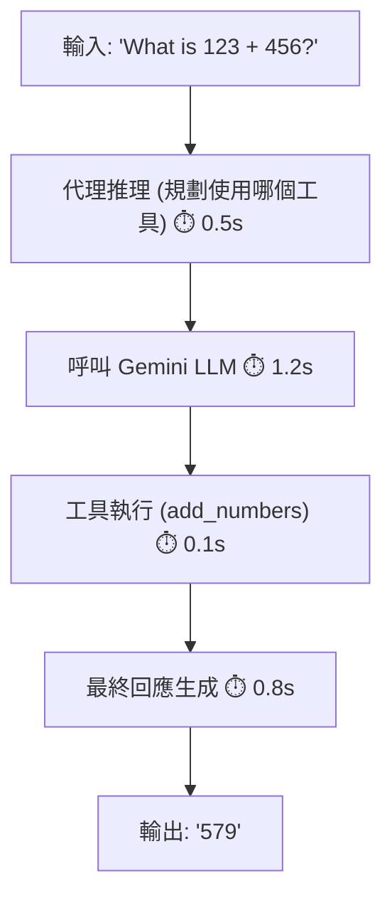

# 觀察 ADK 代理：使用 OpenTelemetry 與 Jaeger 進行追蹤 (Observing ADK Agents: OpenTelemetry Tracing with Jaeger)
---

你使用 Google ADK 建立了一個 AI 代理。它運作正常。但是當你問 **「為什麼代理選擇那個工具？」** 或 **「哪個 LLM 呼叫花了 5 秒鐘？」** 時——你就像在盲目飛行。

進入 **分散式追蹤 (distributed tracing)**：Jaeger 視覺化了你的代理採取的每一個步驟，從推理到工具執行再到 LLM 呼叫。ADK 擁有 **內建的 OpenTelemetry 支援**，讓這一切變得輕而易舉……一旦你理解了一個關鍵的陷阱。

這篇文章向你展示了完整的畫面：要做什麼，為什麼它很重要，以及讓大多數開發者跌倒的那一件事。


## 我們正在解決的問題 (The Problem We're Solving)

你的代理正在運行。但時間都花去哪了？



如果沒有追蹤，你永遠看不到這種細分。有了 Jaeger，你會得到一個顯示每一毫秒的火焰圖。

## 快速開始：5 分鐘 (Quick Start: 5 Minutes)

### 1. 啟動 Jaeger (Docker)

```bash
docker run -d --name jaeger \
  -e COLLECTOR_OTLP_ENABLED=true \
  -p 16686:16686 -p 4318:4318 \
  jaegertracing/all-in-one:latest
```

### 2. 安裝相依套件

```bash
pip install google-adk opentelemetry-sdk \
  opentelemetry-exporter-otlp-proto-http
```

### 3. 複製教學範例

```bash
cd til_opentelemetry_jaeger_20251118
make setup
cp .env.example .env  # 新增 GOOGLE_GENAI_API_KEY
```

### 4. 執行並觀察

```bash
make demo                # 自動查看匯出的追蹤
```

### 5. 在 Jaeger 中檢視

開啟 [http://localhost:16686](http://localhost:16686) → 選擇 `google-adk-math-agent` → 點擊「Find Traces」

**你現在擁有了完整的可觀測性。** 就是這樣。

## 真正的挑戰：TracerProvider 衝突 (The Real Challenge: TracerProvider Conflicts)

這是大多數開發者卡住的地方：

### ❌ 這不起作用 (使用 `adk web`)

```python
from opentelemetry.sdk.trace import TracerProvider
from opentelemetry import trace

# 您手動建立一個 provider
provider = TracerProvider()
# ... 新增您的 exporter ...
trace.set_tracer_provider(provider)

# 同時，adk web 已經啟動並且：
# 1. 啟動了 FastAPI 伺服器
# 2. 初始化了它自己的 TracerProvider
# 3. 現在您的 set_tracer_provider() 呼叫會無聲無息地失敗

# 結果：您的自訂 exporter 從未被使用 ❌
```

**為什麼？** OpenTelemetry 強制規定：*「每個程序一個全域 TracerProvider。」* ADK 會先初始化 (在 `adk web` 模式下)，所以你不能覆蓋它。你的 exporter 會被忽略，追蹤永遠不會到達 Jaeger。

### ✅ 解決方案：環境變數 (The Solution: Environment Variables)

與其爭奪控制權，不如 **讓 ADK 初始化一切**：

```bash
# 設定這些環境變數
export OTEL_SERVICE_NAME=google-adk-math-agent
export OTEL_EXPORTER_OTLP_ENDPOINT=http://localhost:4318
export OTEL_EXPORTER_OTLP_PROTOCOL=http/protobuf

# 現在啟動 adk web - 它會讀取環境變數並自動設定 OTel
adk web .
```

**在你的代理程式碼中**，只需在設定中設定相同的環境變數：

```python
import os

os.environ.setdefault("OTEL_SERVICE_NAME", "google-adk-math-agent")
os.environ.setdefault("OTEL_EXPORTER_OTLP_ENDPOINT", "http://localhost:4318")
os.environ.setdefault("OTEL_EXPORTER_OTLP_PROTOCOL", "http/protobuf")

# ADK (v1.17.0+) 讀取這些設定並配置所有內容
# 您的程式碼運行在 ADK 已經初始化的 provider 之上
# 沒有衝突！ ✓
```

這是 ADK v1.17.0+ 中的 **建議做法**。

## 替代方案：手動設定 (適用於獨立腳本) (Alternative: Manual Setup (For Standalone Scripts))

如果你 **不** 使用 `adk web`，你就擁有完全的控制權：

```python
from opentelemetry.sdk.trace import TracerProvider
from opentelemetry.sdk.trace.export import BatchSpanProcessor
from opentelemetry.exporter.otlp.proto.http.trace_exporter import OTLPSpanExporter
from opentelemetry import trace

# 首先初始化 (在任何 ADK 匯入之前)
provider = TracerProvider()
processor = BatchSpanProcessor(
    OTLPSpanExporter(endpoint="http://localhost:4318/v1/traces")
)
provider.add_span_processor(processor)
trace.set_tracer_provider(provider)

# 現在匯入 ADK (使用您的 provider)
from google.adk.agents import Agent
# ... 您的代理程式碼其餘部分 ...
```

**為什麼這有效**：你控制初始化順序。Provider 在 ADK 執行之前就設定好了。

**何時使用**：獨立腳本、自訂取樣 (sampling)，或對 span processors 進行詳細控制。

## 您在 Jaeger 中看到了什麼 (What You Get in Jaeger)

當你在 Jaeger 中查詢 `google-adk-math-agent` 時，你會看到：

```
呼叫 (根節點)
├─ invoke_agent
│  ├─ call_llm (使用者問題)
│  │  └─ 🕐 1.2s ← Gemini API 延遲
│  ├─ execute_tool (add_numbers)
│  │  └─ 結果: 579
│  └─ call_llm (最終回應)
│     └─ 🕐 0.8s
└─ 成功 ✓
```

每個 span 包含：

- 精確計時 (微秒精度)
- 工具輸入/輸出 (傳遞了什麼參數)
- LLM 提示詞和回應 (如果未被編輯)
- 錯誤追蹤 (如果發生了失敗)

這對於除錯非常有價值：

- 「為什麼代理選擇了錯誤的工具？」 → 查看 LLM 推理
- 「為什麼我的系統很慢？」 → 火焰圖顯示瓶頸
- 「工具真的執行了嗎？」 → 查看 span 執行時間

## 生產環境：Google Cloud Trace (Production: Google Cloud Trace)

當在 **Google Cloud** 上執行 ADK 時，你可以直接將追蹤匯出到 **Google Cloud Trace** (Google Cloud Observability 的一部分)。這是生產部署的建議做法。

### 為什麼選擇 Google Cloud Trace？

- 原生整合：無需第三方基礎設施
- 相同的 OpenTelemetry：使用與 Jaeger 相同的 OTLP 協定
- 整合儀表板：在 Cloud Console 中與日誌和指標一起查看追蹤
- 具成本效益：只為你使用的部分付費，並提供免費層級
- 企業就緒：IAM 控制、稽核日誌記錄、合規性功能

### 設定 Google Cloud Trace

首先，啟用所需的 API：

```bash
gcloud services enable \
  aiplatform.googleapis.com \
  telemetry.googleapis.com \
  cloudtrace.googleapis.com \
  logging.googleapis.com \
  monitoring.googleapis.com
```

安裝 Google Cloud exporters：

```bash
pip install google-adk \
  opentelemetry-sdk \
  opentelemetry-exporter-otlp-proto-grpc \
  opentelemetry-exporter-gcp-logging \
  opentelemetry-exporter-gcp-monitoring \
  opentelemetry-instrumentation-google-genai \
  opentelemetry-instrumentation-vertexai
```

在你的代理初始化中進行設定 (使用 `adk web` 或獨立執行)：

```python
import os
from google.auth import default
from opentelemetry.sdk.trace import TracerProvider
from opentelemetry.sdk.trace.export import BatchSpanProcessor
from opentelemetry.exporter.otlp.proto.grpc.trace_exporter import OTLPSpanExporter
from opentelemetry.sdk.resources import Resource
from opentelemetry import trace

# 取得您的 Google Cloud 專案 ID
credentials, project_id = default()

# 建立帶有專案 metadata 的 resource
resource = Resource.create(
    attributes={
        "service.name": "adk-agent",
        "gcp.project_id": project_id,
    }
)

# 為 Google Cloud Trace 設定 OTLP exporter
provider = TracerProvider(resource=resource)
otlp_exporter = OTLPSpanExporter(
    endpoint="telemetry.googleapis.com:443",
    credentials=credentials,
)
provider.add_span_processor(BatchSpanProcessor(otlp_exporter))
trace.set_tracer_provider(provider)

# 現在初始化您的 ADK 代理
from google.adk.agents import Agent
# ... 您的代理程式碼其餘部分 ...
```

或者在使用 `adk web` 時使用環境變數：

```bash
export OTEL_SERVICE_NAME=adk-agent
export OTEL_EXPORTER_OTLP_ENDPOINT=https://telemetry.googleapis.com:443
export OTEL_EXPORTER_OTLP_PROTOCOL=grpc
export GOOGLE_CLOUD_PROJECT=$PROJECT_ID

adk web .
```

### 在 Google Cloud Console 中檢視追蹤

```bash
# 直接開啟 Cloud Trace UI
gcloud compute ssh --zone=us-central1-a instance-name -- \
  'curl http://localhost:8080' &

# 或導航至 Cloud Console:
# https://console.cloud.google.com/traces/
```

在 Cloud Trace Explorer 中：

<div style='text-align: left;'> 1. 選擇你的服務名稱 (`adk-agent`)</div>
<div style='text-align: left;'> 2. 依 span 名稱篩選：`call_llm`、`execute_tool` 等</div>
<div style='text-align: left;'> 3. 以微秒精度檢視追蹤</div>
<div style='text-align: left;'> 4. 點擊「GenAI」標籤以查看 LLM 事件、工具呼叫和推理</div>

### 存取控制 (Access Control)

授權這些 IAM 角色給需要檢視追蹤的使用者：

```bash
# 用於檢視追蹤
gcloud projects add-iam-policy-binding $PROJECT_ID \
  --member=user:EMAIL \
  --role=roles/cloudtrace.user

# 用於寫入追蹤 (服務帳戶)
gcloud projects add-iam-policy-binding $PROJECT_ID \
  --member=serviceAccount:SA_EMAIL \
  --role=roles/telemetry.tracesWriter
```

如需完整詳細資訊，請參閱官方 [ADK OpenTelemetry Instrumentation Guide](https://docs.cloud.google.com/stackdriver/docs/instrumentation/ai-agent-adk)。

## 部署選項：本地與雲端 (Deployment Options: Local vs Cloud)

| 情境 | 後端 | 設定 |
| :--- | :--- | :--- |
| 使用 `adk web` 進行本地開發 | Jaeger | 環境變數 |
| 獨立腳本 | Jaeger | 手動設定 |
| 生產環境 (Google Cloud) | Cloud Trace | 環境變數 |
| 自訂取樣 | Jaeger | 手動 |

## 常見問題 (Common Issues)

**Q: 追蹤沒有出現在 Jaeger 中？**
A: 檢查 Jaeger 是否正在執行 (`docker ps`)，並驗證 `OTEL_EXPORTER_OTLP_ENDPOINT=http://localhost:4318`

**Q: 我看到關於「Overriding TracerProvider」的警告？**
A: 你在使用 `adk web` 時使用了手動設定。請改用環境變數。

**Q: 追蹤沒有出現在 Google Cloud Trace 中？**
A: 驗證你的服務帳戶是否具有 `roles/telemetry.tracesWriter`。檢查 `GOOGLE_APPLICATION_CREDENTIALS` 環境變數是否指向有效的服務帳戶 JSON 檔案。

**Q: Google Cloud Trace 出現「Permission denied」錯誤？**
A: 確保 Telemetry API 已啟用：`gcloud services enable telemetry.googleapis.com`。並驗證服務帳戶具有正確的 IAM 角色。

**Q: 我可以在生產環境中使用這個嗎？**
A: 可以。透過更改 endpoint，匯出到 Google Cloud Trace (GCP 推薦)、Honeycomb、Datadog 或任何與 OTLP 相容的後端。

## 真正的教學 (The Real Tutorial)

這篇部落格文章是高層次的「為什麼」。如需包含測試的完整工作範例，請參閱：

📚 **[OpenTelemetry + ADK + Jaeger Tutorial](https://github.com/raphaelmansuy/adk_training/tree/main/til_implementation/til_opentelemetry_jaeger_20251118)**

- 42 個單元測試
- 展示了兩種方法
- 生產就緒的設定
- Makefile 自動化
- 故障排除指南

## 總結 (Summary)

✓ ADK 開箱即用即支援出色的 OTel
✓ 針對 `adk web` 模式使用環境變數 (無衝突)
✓ 針對獨立腳本使用手動設定 (完全控制)
✓ Jaeger 視覺化一切：推理、LLM 呼叫、工具執行
✓ 適用於本地和生產環境 (更改 endpoint)

AI 代理的「黑盒子」變得完全可觀測。充滿信心地進行除錯。

祝追蹤愉快！ 🔍

## 程式碼實現 (Code Implementation)

 - math-agent-otel：[程式碼連結](../../../python/agents/math-agent-otel/)
