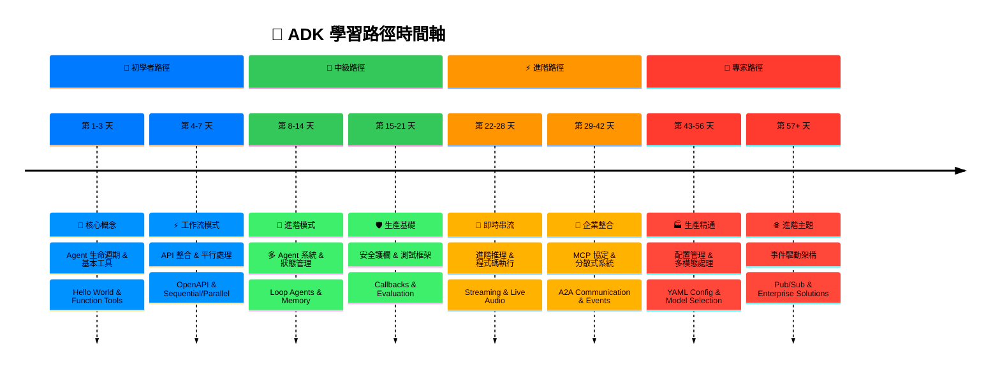

# Learning Paths (學習路徑)

**🎯 Purpose (目的)**: 提供從 ADK 基礎到生產環境掌握的結構化學習進程。

**📚 Source of Truth (資料來源)**:
- [do](https://github.com/raphaelmansuy/adk_training/tree/main/do)
- [tutorial_implementation/](https://github.com/raphaelmansuy/adk_training/tree/main/tutorial_implementation/)
- [research/](https://github.com/raphaelmansuy/adk_training/tree/main/research/) (ADK 1.15)

---

## 學習路徑時間軸

---

## 🏁 Beginner Path (初學者路徑) (1-2 週)

### Phase 1: Core Concepts (核心概念) (第 1-3 天)

**📖 Tutorials (教學)**:
- [x] [01-hello_world_agent.md](./adk_training/01-hello_world_agent.md)
- [x] [02-function_tools.md](./adk_training/02-function_tools.md)

**🎯 Goals (目標)**:
- 了解 Agent 的生命週期
- 建立基本的 LLM Agent
- 實作函式工具
- 在本地端運行 Agent

**💡 Key Concepts (關鍵概念)**:
- Agent 類別結構
- 工具函式模式
- 狀態管理基礎
- 本地開發環境設定

### Phase 2: Workflow Patterns (工作流模式) (第 4-7 天)

**📖 Tutorials (教學)**:
- [x] [03-openapi_tools.md](./adk_training/03-openapi_tools.md)
- [x] [04-sequential_workflows.md](./adk_training/04-sequential_workflows.md)
- [x] [05-parallel_processing.md](./adk_training/05-parallel_processing.md)

**🎯 Goals (目標)**:
- 整合外部 API
- 建立循序執行的 Pipeline
- 實作平行處理
- 處理複雜的工作流程

**💡 Key Concepts (關鍵概念)**:
- OpenAPI 工具生成
- `SequentialAgent` 的組合
- `ParallelAgent` 的優化
- 錯誤處理模式

---

## 🚀 Intermediate Path (中級路徑) (2-4 週)

### Phase 3: Advanced Patterns (進階模式) (第 8-14 天)

**📖 Tutorials (教學)**:
- [x] [06-multi_agent_systems.md](./adk_training/06-multi_agent_systems.md)
- [x] [07-loop_agents.md](./adk_training/07-loop_agents.md)
- [x] [08-state_memory.md](./adk_training/08-state_memory.md)

**🎯 Goals (目標)**:
- 設計多 Agent 系統
- 實作迭代優化
- 掌握狀態管理
- 建立複雜的 Agent 層級結構

**💡 Key Concepts (關鍵概念)**:
- Agent 通訊模式
- `LoopAgent` 的收斂條件
- 狀態範疇 (session/user/app/temp)
- 記憶體持久化策略

### Phase 4: Production Foundations (生產基礎) (第 15-21 天)

**📖 Tutorials (教學)**:
- [x] [09-callbacks_guardrails.md](./adk_training/09-callbacks_guardrails.md)
- [x] [10-evaluation_testing.md](./adk_training/10-evaluation_testing.md)
- [x] [11-built_in_tools_grounding.md](./adk_training/11-built_in_tools_grounding.md)

**🎯 Goals (目標)**:
- 實作安全護欄
- 建立全面的測試
- 使用內建的 Grounding 工具
- 為生產部署做準備

**💡 Key Concepts (關鍵概念)**:
- 回呼 (Callback) 整合
- 自動化測試框架
- 使用 Web/Data/Location 進行 Grounding
- 品質保證模式

---

## 🎯 Advanced Path (進階路徑) (4-8 週)

### Phase 5: Real-Time & Streaming (即時與串流) (第 22-28 天)

**📖 Tutorials (教學)**:
- [x] [12-planners_thinking.md](./adk_training/12-planners_thinking.md)
- [ ] [13-code_execution.md](./adk_training/code_execution)
- [ ] [14-streaming_sse.md](./adk_training/streaming_sse)
- [ ] [15-live_api_audio.md](./adk_training/live_api_audio)

**🎯 Goals (目標)**:
- 掌握進階推理
- 啟用程式碼執行
- 實作即時串流
- 處理多模態輸入

**💡 Key Concepts (關鍵概念)**:
- 自訂 Planner 策略
- 程式碼執行環境
- SSE 與 BIDI 串流
- 音訊/視訊處理

### Phase 6: Enterprise Integration (企業整合) (第 29-42 天)

**📖 Tutorials (教學)**:
- [x] [16-mcp_integration.md](./adk_training/16-mcp_integration.md)
- [ ] [17-agent_to_agent.md](./adk_training/agent_to_agent)
- [ ] [18-events_observability.md](./adk_training/events_observability)
- [ ] [19-artifacts_files.md](./adk_training/artifacts_files)

**🎯 Goals (目標)**:
- 整合 MCP 協定
- 建立分散式 Agent 系統
- 實作全面的可觀測性
- 處理檔案產出物

**💡 Key Concepts (關鍵概念)**:
- MCP 工具標準化
- A2A (Agent-to-Agent) 通訊協定
- 事件驅動架構
- 檔案系統整合

---

## 🏭 Expert Path (專家路徑) (8+ 週)

### Phase 7: Production Mastery (生產精通) (第 43-56 天)

**📖 Tutorials (教學)**:
- [ ] [20-yaml_configuration.md](./adk_training/yaml_configuration)
- [ ] [21-multimodal_image.md](./adk_training/multimodal_image)
- [ ] [22-model_selection.md](./adk_training/model_selection)
- [ ] [23-production_deployment.md](./adk_training/production_deployment)

**🎯 Goals (目標)**:
- 掌握配置管理
- 處理多模態內容
- 優化模型選擇
- 部署生產系統

**💡 Key Concepts (關鍵概念)**:
- 基於 YAML 的配置
- 圖片/影片/文件處理
- 模型性能優化
- 雲端部署策略

### Phase 8: Advanced Topics (進階主題) (第 57+ 天)

**📖 Tutorials (教學)**:
- [ ] [24-advanced_observability.md](./adk_training/advanced_observability)
- [ ] [34-pubsub_adk_integration.md](./adk_training/pubsub_adk_integration)

**🎯 Goals (目標)**:
- 掌握 Pub/Sub 模式
- 建立事件驅動系統
- 實作進階整合
- 建立企業級解決方案

**💡 Key Concepts (關鍵概念)**:
- 事件驅動的 Agent 通訊
- 可擴展的系統架構
- 進階整合模式
- 企業部署策略

---

## 🎯 Specialization Tracks (專業領域)

### API Integration Specialist (API 整合專家)

- **Focus (焦點)**: 外部服務整合、API 設計、身份驗證
- **Key Tutorials (關鍵教學)**:
  - `03-openapi_tools.md`
  - `16-mcp_integration.md`
  - `24~34_pubsub_integration.md`
- **Skills (技能)**: REST API 設計、OAuth 流程、Webhook 處理

### Performance Optimization Expert (性能優化專家)

- **Focus (焦點)**: 速度、成本與品質優化
- **Key Tutorials (關鍵教學)**:
  - `05-parallel_processing.md`
  - `12-planners_thinking.md`
  - `22-model_selection.md`
- **Skills (技能)**: 平行處理、模型調校、成本管理

### Enterprise Architect (企業架構師)

- **Focus (焦點)**: 大規模系統、可觀測性、安全性
- **Key Tutorials (關鍵教學)**:
  - `17-agent_to_agent.md`
  - `18-events_observability.md`
  - `23-production_deployment.md`
- **Skills (技能)**: 分散式系統、監控、合規性

### AI Product Builder (AI 產品建構者)

- **Focus (焦點)**: 使用者體驗、多模態、即時互動
- **Key Tutorials (關鍵教學)**:
  - `14-streaming_sse.md`
  - `15-live_api_audio.md`
  - `21-multimodal_image.md`
- **Skills (技能)**: UX 設計、即時系統、多模態 AI

---

## 📚 Learning Resources (學習資源)

### Documentation (文件)

- **Mental Models**: 核心概念與架構模式
- **Tutorial Series**: 34 篇全面的實作指南
- **Research**: ADK 原始碼分析與範例
- **ADK Cheat Sheet**: [快速參考指南](./adk-cheat-sheet.md)，用於指令、模式與故障排除

### Practice Projects (實作專案)

- **Beginner Projects (初學者專案)**:
  - 帶有函式工具的問答聊天機器人
  - 資料處理 Pipeline
  - 簡單的 API 整合
- **Intermediate Projects (中級專案)**:
  - 多 Agent 內容創作系統
  - 即時資料分析儀表板
  - 電子商務推薦引擎
- **Advanced Projects (進階專案)**:
  - 企業文件處理系統
  - 即時協作編碼助理
  - 多模態內容分析平台

### Community & Support (社群與支援)

- **GitHub Issues**: 錯誤回報與功能請求
- **Stack Overflow**: 使用 `google-adk` 標籤進行技術問答
- **Discord/Slack**: 社群討論與協助
- **Official Docs**: 全面的 API 參考

---

## 🎯 Progress Tracking (進度追蹤)

### Skill Assessment Checklist (技能評估清單)

- **Core Fundamentals (核心基礎)**
  - Agent 生命週期理解
  - 基本工具實作
  - 本地開發環境設定
  - 簡單工作流模式
- **Intermediate Skills (中級技能)**
  - 多 Agent 系統設計
  - 狀態管理掌握
  - 生產測試模式
  - API 整合專業知識
- **Advanced Capabilities (進階能力)**
  - 即時串流實作
  - 企業可觀測性
  - 性能優化
  - 分散式系統架構
- **Expert Level (專家級)**
  - 自訂 Planner 開發
  - 多模態處理
  - 生產部署掌握
  - 企業整合模式

---

## 🎯 Key Takeaways (重點摘要)

1.  **Structured Progression (結構化進程)**: 遵循 8 階段學習路徑以全面掌握。
2.  **Hands-on Practice (動手實作)**: 結合理論學習完成教學實作。
3.  **Specialization Options (專業選項)**: 根據職業目標與興趣選擇專注領域。
4.  **Continuous Learning (持續學習)**: ADK 發展迅速，隨時了解最新模式。
5.  **Community Engagement (社群參與)**: 加入討論、貢獻開源、分享知識。
