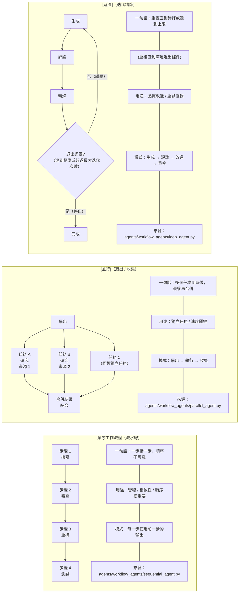
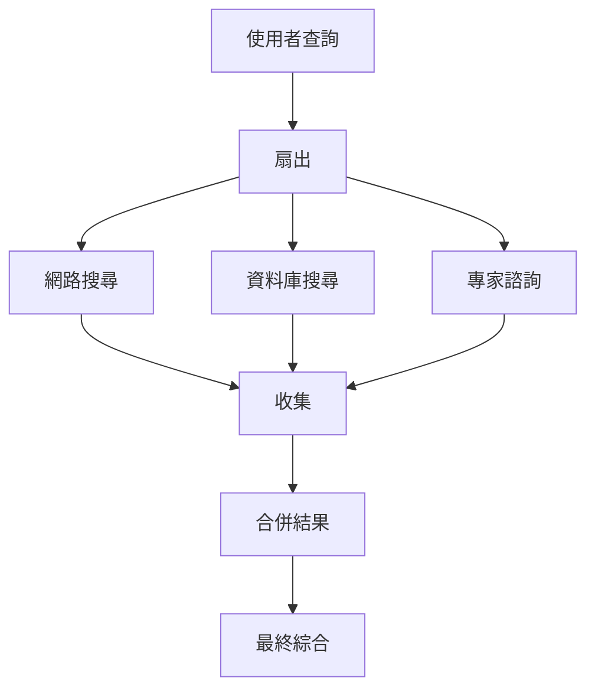
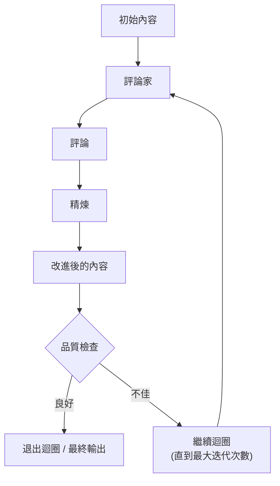

# Workflows & Orchestration (工作流程與編排)

**🎯 目的**: 掌握工作流程模式，以編排複雜的代理行為和多步驟流程。

## [FLOW] 工作流程模式概述[​](#flow-workflow-patterns-overview 'Direct link to [FLOW] 工作流程模式概述')

**心智模型**: 工作流程就像代理編排的**流水線策略**:



---

## 順序工作流程 (流水線)

### 基本順序模式

**心智模型**: 步驟按順序執行，每個步驟使用前一個步驟的輸出:

```python
from google.adk.agents import SequentialAgent

# 定義個別代理
research_agent = Agent(
  name="researcher",
  model="gemini-2.5-flash",
  instruction="徹底研究給定的主題",
  output_key="research_results"
)

writer_agent = Agent(
  name="writer",
  model="gemini-2.5-flash",
  instruction="根據研究結果撰寫綜合文章: {research_results}",
  output_key="article_draft"
)

editor_agent = Agent(
  name="editor",
  model="gemini-2.5-flash",
  instruction="編輯並改善文章: {article_draft}",
  output_key="final_article"
)

# 建立順序工作流程
content_pipeline = SequentialAgent(
  name="content_creation_pipeline",
  sub_agents=[research_agent, writer_agent, editor_agent],
  description="從研究到發布的完整內容創建流程"
)
```

### 順序工作流程執行

**執行流程**:

```
使用者查詢 → 研究代理 → 撰寫代理 → 編輯代理 → 最終結果

1. 研究代理獲得使用者查詢
2. 研究代理將結果保存到 state['research_results']
3. 撰寫代理從指令中讀取 {research_results}
4. 撰寫代理將草稿保存到 state['article_draft']
5. 編輯代理從指令中讀取 {article_draft}
6. 編輯代理產生最終輸出
```

### 進階順序模式

**條件分支**:

```python
# 根據內容類型動態路由
def route_by_topic(context, result):
  topic = result.get('topic', '').lower()

  if 'technical' in topic:
    return 'tech_writer'
  elif 'business' in topic:
    return 'business_writer'
  else:
    return 'general_writer'

routing_agent = Agent(
  name="router",
  model="gemini-2.5-flash",
  instruction="分析主題並確定內容類型",
  output_key="topic_analysis"
)

tech_writer = Agent(name="tech_writer", ...)
business_writer = Agent(name="business_writer", ...)
general_writer = Agent(name="general_writer", ...)

# 具有動態代理選擇的順序流程
content_workflow = SequentialAgent(
  sub_agents=[routing_agent], # 從路由器開始
  dynamic_agents={
    'tech_writer': tech_writer,
    'business_writer': business_writer,
    'general_writer': general_writer
  },
  routing_function=route_by_topic
)
```

---

## ⚡ 並行工作流程 (扇出/收集)

### 基本並行模式

**心智模型**: 獨立任務同時執行，然後結果被合併:

```python
from google.adk.agents import ParallelAgent

# 並行研究不同方面
web_research_agent = Agent(
  name="web_researcher",
  model="gemini-2.5-flash",
  tools=[google_search],
  instruction="使用網路搜尋研究主題",
  output_key="web_findings"
)

database_research_agent = Agent(
  name="db_researcher",
  model="gemini-2.5-flash",
  tools=[database_tool],
  instruction="搜尋內部資料庫以獲取相關資料",
  output_key="db_findings"
)

expert_opinion_agent = Agent(
  name="expert_consultant",
  model="gemini-2.5-flash",
  tools=[expert_tool],
  instruction="就該主題諮詢領域專家",
  output_key="expert_insights"
)

# 並行執行所有研究
parallel_research = ParallelAgent(
  name="comprehensive_research",
  sub_agents=[web_research_agent, database_research_agent, expert_opinion_agent],
  description="同時從多個來源研究主題"
)
```

### 並行執行流程[​](#parallel-execution-flow 'Direct link to 並行執行流程')

**扇出 → 執行 → 收集**:



### 並行配合順序合併[​](#parallel-with-sequential-merger 'Direct link to 並行配合順序合併')

**完整研究管道**:

```python
# 並行研究階段
parallel_research = ParallelAgent(
  sub_agents=[web_agent, db_agent, expert_agent]
)

# 順序綜合階段
synthesis_agent = Agent(
  name="synthesizer",
  model="gemini-2.5-flash",
  instruction="""
  綜合來自多個來源的發現:
  網路: {web_findings}
  資料庫: {db_findings}
  專家: {expert_insights}

  建立綜合報告。
  """,
  output_key="final_report"
)

# 完整工作流程: 並行 → 順序
research_pipeline = SequentialAgent(
  sub_agents=[parallel_research, synthesis_agent]
)
```

---

## 🔁 迴圈工作流程 (迭代精進)

### 基本迴圈模式

**心智模型**: 重複直到符合品質標準或達到最大迭代次數:

```python
from google.adk.agents import LoopAgent

# 內容生成器
writer_agent = Agent(
  name="content_writer",
  model="gemini-2.5-flash",
  instruction="撰寫關於主題的內容: {topic}",
  output_key="content_draft"
)

# 品質評論家
critic_agent = Agent(
name="content_critic",
model="gemini-2.5-flash",
instruction="""
  評估內容品質: {content_draft}

  以 1-10 分評分:
  - 準確性
  - 完整性
  - 清晰度
  - 吸引力

  如果分數 < 8，提供具體的改進建議。
  """,
  output_key="critique"
)

# 改進精煉器
refiner_agent = Agent(
  name="content_refiner",
  model="gemini-2.5-flash",
  instruction="""
  根據評論改進內容: {critique}
  原始內容: {content_draft}

  解決評論家的所有建議。
  """,
  output_key="improved_content"
)

# 迭代精煉迴圈
quality_loop = LoopAgent(
  sub_agents=[critic_agent, refiner_agent],
  max_iterations=5,
  description="迭代改進內容直到符合品質標準"
)

```

### 迴圈執行流程

**生成 → 評論 → 精煉 → 重複**:



### 進階迴圈模式

**條件退出**:

```python
def should_continue_loop(context, result):
  """自訂退出條件"""
  critique = result.get('critique', '')
  score = extract_score_from_critique(critique)
  return score < 8 # 如果品質 < 8/10 就繼續

quality_loop = LoopAgent(
  sub_agents=[critic_agent, refiner_agent],
  max_iterations=5,
  exit_condition=should_continue_loop,
  description="具有品質門檻的迭代精煉"
)
```

**多代理迴圈**:

```python
# 複雜迭代流程
brainstorm_agent = Agent(name="brainstormer", ...)
designer_agent = Agent(name="designer", ...)
developer_agent = Agent(name="developer", ...)
tester_agent = Agent(name="tester", ...)

# 開發循環
development_loop = LoopAgent(
  sub_agents=[designer_agent, developer_agent, tester_agent],
  max_iterations=10,
  description="迭代產品開發循環"
)
```

## [FLOW] 複雜工作流程組合

### 巢狀工作流程

**心智模型**: 工作流程可以包含其他工作流程以進行階層組織:

```python
# 第 1 層: 個別研究任務
web_agent = Agent(name="web_researcher", ...)
api_agent = Agent(name="api_researcher", ...)
file_agent = Agent(name="file_analyzer", ...)

# 第 2 層: 並行研究
research_team = ParallelAgent(
  sub_agents=[web_agent, api_agent, file_agent]
)

# 第 3 層: 順序處理
processing_pipeline = SequentialAgent(
  sub_agents=[
    research_team, # 並行研究
    data_cleaner, # 順序處理
    analyzer, # 順序處理
    reporter # 順序處理
  ]
)

# 第 4 層: 品質迴圈
quality_assurance = LoopAgent(
  sub_agents=[processing_pipeline, quality_checker, improver],
  max_iterations=3
)
```

### 真實世界範例: 內容創建管道

```python
# 1. 研究階段 (並行)
research_sources = ParallelAgent(
  sub_agents=[
    web_research_agent,
    academic_search_agent,
    social_media_monitor
  ]
)

# 2. 內容生成 (順序)
content_creation = SequentialAgent(
  sub_agents=[
    outline_writer,
    draft_writer,
    fact_checker
  ]
)

# 3. 審核與編輯 (迴圈)
editing_cycle = LoopAgent(
  sub_agents=[
    editor_agent,
    proofreader_agent,
    final_reviewer
  ],
  max_iterations=3
)

# 4. 發布 (順序)
publication_pipeline = SequentialAgent(
  sub_agents=[
    seo_optimizer,
    formatter_agent,
    publisher_agent
  ]
)

# 完整內容管道
content_workflow = SequentialAgent(
  sub_agents=[
    research_sources, # 並行
    content_creation, # 順序
    editing_cycle, # 迴圈
    publication_pipeline # 順序
  ]
)

```

---

## 🎯 工作流程決策框架

### 何時使用各種模式

| 情境        | 順序  | 並行  | 迴圈    |
| ----------- | ----- | ----- | ------- |
| 順序很重要  | ✅ 是 | ❌ 否 | ❌ 否   |
| 獨立任務    | ❌ 否 | ✅ 是 | ❌ 否   |
| 需要速度    | ❌ 否 | ✅ 是 | ❌ 否   |
| 迭代精煉    | ❌ 否 | ❌ 否 | ✅ 是   |
| 品質 > 速度 | ❌ 否 | ❌ 否 | ✅ 是   |
| 相依性      | ✅ 是 | ❌ 否 | 🤔 或許 |

### 工作流程選擇指南

```
需要編排多個代理？
│
├─ 步驟彼此相依？
│ ├─ 簡單相依鏈？
│ │ └─ SequentialAgent
│ └─ 複雜相依性？
│ └─ SequentialAgent + 狀態路由
│
├─ 步驟是獨立的？
│ ├─ 需要合併結果？
│ │ └─ ParallelAgent + Sequential 合併器
│ └─ 可以分別處理？
│ └─ ParallelAgent (啟動即用)
│
├─ 需要迭代改進？
│ ├─ 品質精煉？
│ │ └─ LoopAgent (評論家 + 精煉器)
│ └─ 漸進式增強？
│ └─ LoopAgent (多階段改進)
│
└─ 複雜組合？
└─ 巢狀工作流程 (並行 + 順序 + 迴圈)
```

---

## ⚡ 效能最佳化

### 並行執行優勢

**速度改進**:

- **獨立任務**: 使用 3 個並行代理可快 3 倍
- **I/O 限制**: 網路請求、API 呼叫、檔案操作
- **CPU 限制**: 分散到具有不同模型的代理

**成本考量**:

- **Token 效率**: 相同總 token 數，更快執行
- **模型選擇**: 為並行任務使用較小的模型
- **快取**: 快取中間結果以避免重新計算

### 最佳化策略[​](#optimization-strategies 'Direct link to 最佳化策略')

**批次處理**:

```python
# 並行處理多個項目
batch_processor = ParallelAgent(
  sub_agents=[
    Agent(name="item_1_processor", ...),
    Agent(name="item_2_processor", ...),
    Agent(name="item_3_processor", ...)
  ]
)

# 比順序處理更有效率
sequential_processor = SequentialAgent(
  sub_agents=[item_1_processor, item_2_processor, item_3_processor]
)
```

**提早退出最佳化**:

```python
# 當品質足夠好時就停止
quality_loop = LoopAgent(
  sub_agents=[generator, critic, improver],
  max_iterations=10,
  exit_condition=lambda ctx, res: res.get('quality_score', 0) >= 9
)
```

---

## 🔍 除錯工作流程

### 狀態檢查

**追蹤資料流**:

```python
# 啟用狀態記錄
import logging
logging.getLogger('google.adk.agents').setLevel(logging.DEBUG)

# 檢查每個步驟的狀態
result = await runner.run_async(query)

for event in result.events:
  if 'state' in event:
    print(f"步驟: {event.step}")
    print(f"狀態: {event.state}")

```

### 工作流程視覺化

**執行圖表**:

```python
# 生成工作流程圖表
workflow_graph = content_pipeline.get_execution_graph()
print(workflow_graph) # Mermaid 圖表

# 分析瓶頸
performance_report = content_pipeline.analyze_performance()
print(performance_report) # 時間、瓶頸、最佳化建議
```

### 常見問題與解決方案

| 問題         | 症狀                   | 解決方案                            |
| ------------ | ---------------------- | ----------------------------------- |
| 狀態未傳遞   | 代理無法存取前一個結果 | 檢查 `output_key` 和狀態插值        |
| 並行速度變慢 | 順序執行而非並行執行   | 驗證代理確實是獨立的                |
| 迴圈永不退出 | 無限精煉循環           | 設定 `max_iterations`，加入退出條件 |
| 記憶體膨脹   | 狀態增長過大           | 使用 `temp:` 範圍，清理中間資料     |
| 競爭條件     | 非確定性結果           | 確保適當的狀態同步                  |

---

## 🎯 重點摘要

1. **順序**: 用於有序、相依的步驟（流水線）
2. **並行**: 用於獨立任務（扇出/收集）
3. **迴圈**: 用於迭代精煉（評論家/精煉器模式）
4. **組合**: 為複雜階層巢狀工作流程
5. **效能**: 並行執行求速度，順序求相依性
6. **狀態流**: 使用 `output_key` 和插值進行資料傳遞
