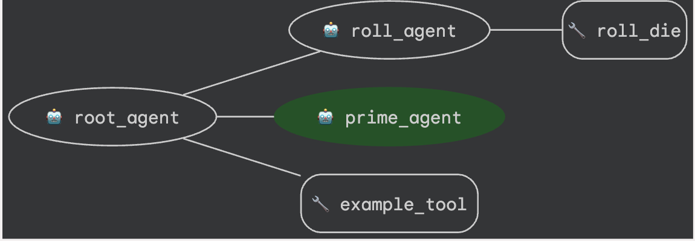
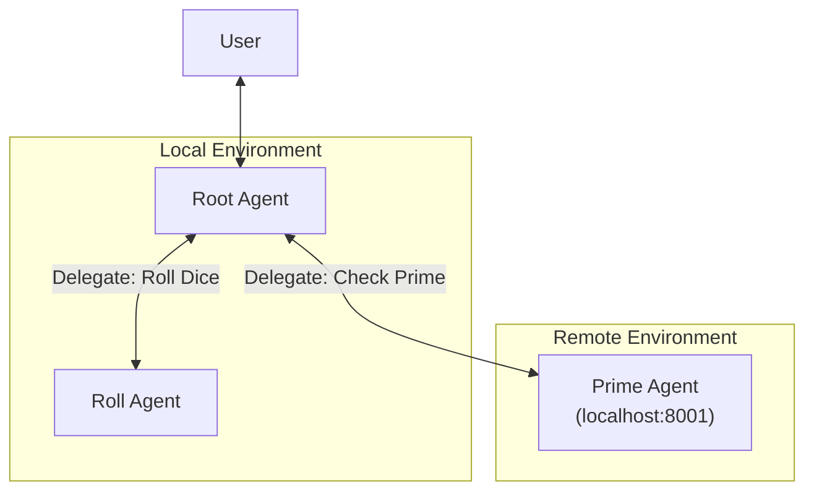
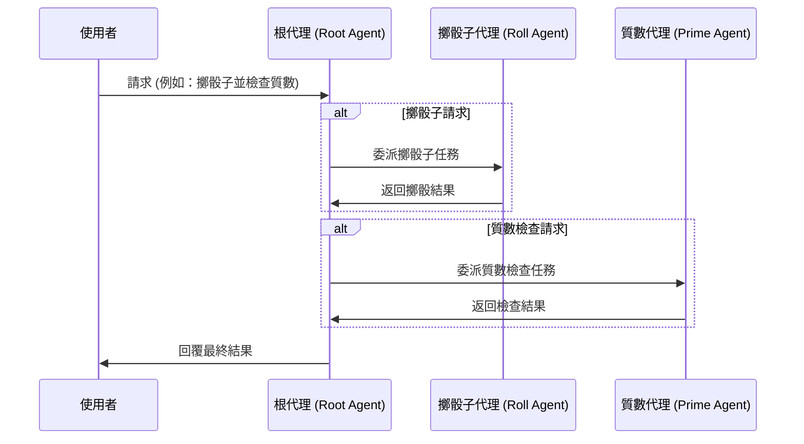
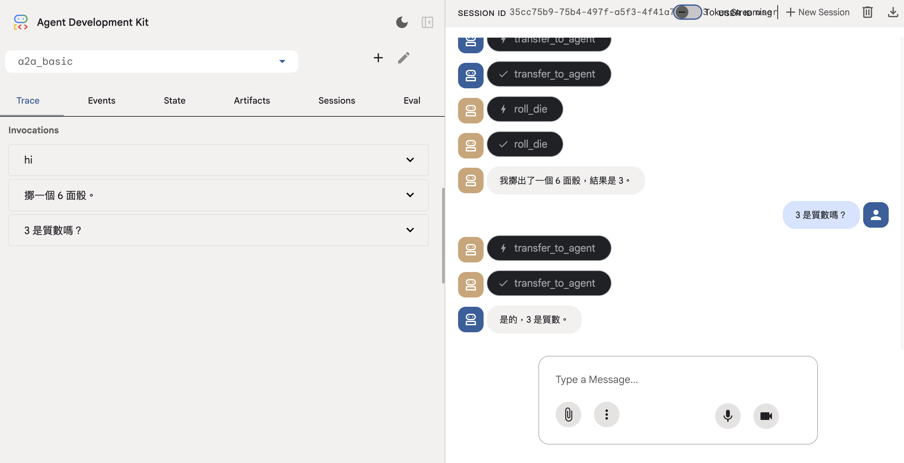

# A2A Basic 範例代理

本範例展示了 Agent Development Kit (ADK) 中的 **Agent-to-Agent (A2A)** 架構，說明多個代理如何協作以處理複雜任務。此範例實作了一個能擲骰子並檢查質數的代理。

## 概述

A2A Basic 範例包含：

- **Root Agent** (`root_agent`)：主要的協調者，負責將任務委派給專門的子代理
- **Roll Agent** (`roll_agent`)：本地子代理，負責擲骰子操作
- **Prime Agent** (`prime_agent`)：遠端 A2A 代理，負責檢查質數，運行於獨立的 A2A 伺服器

## 架構



### 代理關係圖

---
### 互動流程


### 重點說明
- **核心概念**：建立一個多代理系統 (Multi-Agent System)，包含一個編排用的根代理與兩個功能性子代理。
- **關鍵技術**：
  - 使用 `google.adk` 框架定義代理。
  - `RemoteA2aAgent`：透過 A2A (Agent-to-Agent) 協定連接遠端代理。
  - `Agent Delegation`：任務委派機制。
- **重要結論**：Gemini 2.0 Flash 可有效作為中樞代理，根據指令將任務分發給不同專業代理處理。
- **行動項目**：請確保遠端質數檢查代理服務 (localhost:8001) 已啟動，以便 `prime_agent` 正常運作。

---
## 主要特點

### 1. **本地子代理整合**
- `roll_agent` 展示如何建立並整合本地子代理
- 處理可自訂面數的擲骰功能
- 使用簡單的函式工具 (`roll_die`) 進行隨機數產生

### 2. **遠端 A2A 代理整合**
- `prime_agent` 展示如何連接遠端代理服務
- 透過 HTTP 與 `http://localhost:8001/a2a/check_prime_agent` 進行通訊
- 展現跨服務代理溝通

### 3. **代理協調**
- 根代理會根據使用者請求智能委派任務
- 可串接多步操作（如「擲骰並檢查是否為質數」）
- 提供多代理間清晰的工作流程協調

### 4. **範例工具整合**
- 包含 `ExampleTool`，提供範例互動以供參考
- 協助代理理解預期行為模式

## 安裝與使用

### 安裝 ADK

#### 1. 步驟一：建立並啟用虛擬環境
```bash
uv init
source venv/bin/activate  # Linux/Mac
```

#### 2. 步驟二：安裝 ADK 套件
```bash
uv pip install "google-adk[a2a]"
```

### 啟動代理服務

1. **啟動遠端質數代理伺服器**：
   ```bash
   # 啟動遠端 a2a 伺服器，於 8001 埠提供 check prime agent
   adk api_server --a2a --port 8001 a2a_basic/remote_a2a
   ```

2. **執行主代理**：
   ```bash
   # 於另一終端機執行 adk web 伺服器
   adk web
   ```

3. **開啟瀏覽器並訪問**：
   ```
   http://localhost:8000
   ```

   

### 範例互動

當兩個服務都啟動後，可與 root agent 互動：

**單純擲骰：**
```
User: 擲一顆六面骰
Bot: 我幫你擲出了 4。
```

**質數檢查：**
```
User: 7 是質數嗎？
Bot: 是的，7 是質數。
```

**組合操作：**
```
User: 擲一顆十面骰並檢查是否為質數
Bot: 我幫你擲出了 8。
Bot: 8 不是質數。
```

## 程式結構

### 主代理 (`agent.py`)

- **`roll_die(sides: int)`**：擲骰函式工具
- **`roll_agent`**：專責擲骰的本地代理
- **`prime_agent`**：遠端 A2A 代理設定
- **`root_agent`**：具委派邏輯的主協調代理

### 遠端質數代理 (`remote_a2a/check_prime_agent/`)

- **`agent.py`**：質數檢查服務實作
- **`agent.json`**：A2A 代理卡
- **`check_prime(nums: list[int])`**：質數檢查演算法

## 擴充範例

你可以這樣擴充本範例：

- 增加更多數學運算（如因數分解、開根號等）
- 建立更多遠端代理
- 實作更複雜的委派邏輯
- 增加持久化狀態管理
- 整合外部 API 或資料庫

## 部署到其他環境

將遠端 A2A 代理部署到不同環境（如 Cloud Run、不同主機/埠）時，**必須**更新代理卡 JSON 檔的 `url` 欄位：

### 本地開發
```json
{
  "url": "http://localhost:8001/a2a/check_prime_agent",
  ...
}
```

### Cloud Run 範例
```json
{
  "url": "https://your-service-abc123-uc.a.run.app/a2a/check_prime_agent",
  ...
}
```

### 自訂主機/埠範例
```json
{
  "url": "https://your-domain.com:9000/a2a/check_prime_agent",
  ...
}
```

**重要：** `remote_a2a/check_prime_agent/agent.json` 的 `url` 欄位必須指向實際部署且可存取的遠端 A2A 代理 RPC 端點。

## 疑難排解

**連線問題：**
- 確認本地 ADK web 伺服器已於 8000 埠運行
- 確認遠端 A2A 伺服器已於 8001 埠運行
- 檢查防火牆是否阻擋 localhost 連線
- **確認 `remote_a2a/check_prime_agent/agent.json` 的 `url` 欄位與實際遠端 A2A 伺服器位置一致**
- 確認 RemoteA2AAgent 建構時傳入的代理卡 URL 與執行中的 A2A 伺服器一致

**代理無回應：**
- 檢查本地 ADK web 伺服器（8000 埠）及遠端 A2A 伺服器（8001 埠）日誌
- 確認代理指令明確且無歧義
- **再次確認 agent.json 檔案中的 RPC URL 正確且可存取**

## 參考資源

- [[adk-python] a2a_basic](hhttps://github.com/google/adk-python/tree/main/contributing/samples/a2a_basic)

## 更多補充

ExampleTool 的內容可參考 [Example Tool README](EXAMPLE_TOOL.md)。
