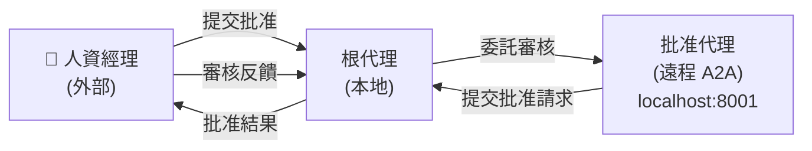
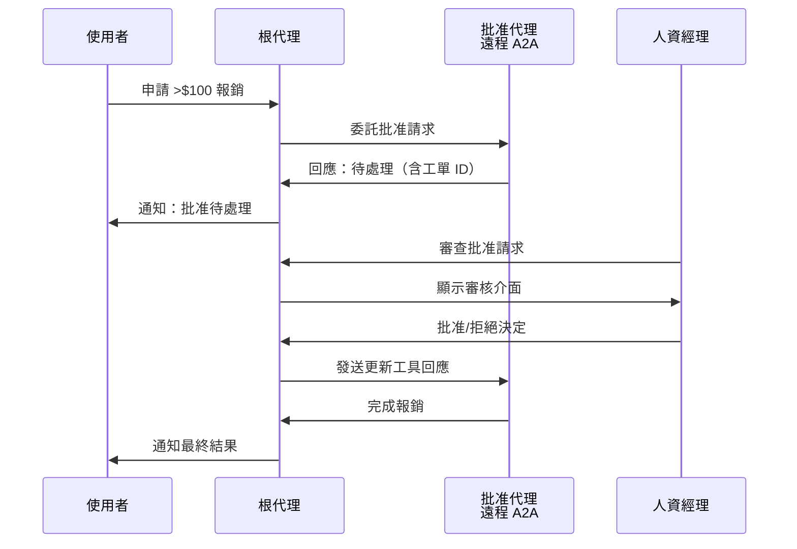

# A2A 人工審核示例代理

此示例展示了 Agent Development Kit (ADK) 中的 **Agent-to-Agent (A2A)** 架構與 **人工審核** 工作流。該示例實作了一個報銷處理代理，自動處理小額開支，同時要求遠程代理處理大額開支。遠程代理需要獲得人工批准才能處理大額開支，因此會將此請求提交給本地代理，與本地代理互動的人員可以批准該請求。

## 概述

A2A 人工審核示例由以下部分組成：

- **根代理** (`root_agent`)：主要的報銷代理，處理報銷請求並將大額批准委託給遠程批准代理
- **批准代理** (`approval_agent`)：遠程 A2A 代理，通過長時間運行的工具（實作非同步批准工作流，可暫停執行並等待人工輸入）處理人工批准流程，此代理在單獨的 A2A 伺服器上運行

## 架構



## 主要功能

### 1. **自動決策**
- 自動批准 $100 以下的報銷
- 使用業務邏輯判斷何時需要人工干預
- 為簡單情況提供即時回應

### 2. **人工審核工作流**
- 無縫將高額請求（>$100）升級至遠程批准代理
- 遠程批准代理使用長時間運行的工具將批准請求提交回根代理
- 人資經理直接與根代理互動以批准/拒絕請求

### 3. **長時間運行工具集成**
- 展示 `LongRunningFunctionTool` 的非同步操作
- 說明如何處理待處理狀態和外部更新
- 實作延遲批准的適當工具回應處理

### 4. **遠程 A2A 代理通信**
- 批准代理作為單獨服務運行，處理批准工作流
- 通過 `http://localhost:8001/a2a/human_in_loop` 進行 HTTP 通信
- 將批准請求提交回根代理以供人工互動

## 設置與使用

### 前置條件

1. **啟動遠程批准代理伺服器**：
   ```bash
   # 啟動遠程 a2a 伺服器，在端口 8001 上運行人工審核批准代理
   adk api_server --a2a --port 8001 contributing/samples/a2a_human_in_loop/remote_a2a
   ```

2. **運行主代理**：
   ```bash
   # 在另一個終端中運行 adk web 伺服器
   adk web contributing/samples/
   ```

### 互動示例

兩項服務都運行後，您可以透過批准工作流與根代理互動：

**自動批准（低於 $100）**：
```
使用者：請報銷 $50 的餐飲費
代理：我將處理您的 $50 餐飲報銷請求。由於此金額低於 $100，我可以自動批准。
代理：✅ 報銷已批准並處理：$50 餐飲費
```

**需要人工批准（超過 $100）**：
```
使用者：請報銷 $200 的會議差旅費
代理：我將處理您的 $200 會議差旅報銷請求。由於此金額超過 $100，我需要獲得經理批准。
代理：🔄 請求已提交審核（工單：reimbursement-ticket-001）。請等待經理審查。
[人資經理與根代理互動以批准請求]
代理：✅ 好消息！您的報銷已獲得經理批准。正在處理 $200 的會議差旅費。
```

## 代碼結構

### 主代理（`agent.py`）

- **`reimburse(purpose: str, amount: float)`**：用於處理報銷的函式工具
- **`approval_agent`**：用於人工批准工作流的遠程 A2A 代理配置
- **`root_agent`**：具有自動/手動批准邏輯的主報銷代理

### 遠程批准代理（`remote_a2a/human_in_loop/`）

- **`agent.py`**：具有長時間運行工具的批准代理實作
- **`agent.json`**：A2A 代理卡

- **`ask_for_approval()`**：處理批准請求的長時間運行工具

## 長時間運行工具工作流

人工審核流程遵循此模式：



## 擴展示例

您可以通過以下方式擴展此示例：

- 新增更複雜的批准層級結構（多級批准）
- 基於開支類別實作不同的批准規則
- 為預算檢查或政策驗證建立額外的遠程代理
- 新增批准狀態更新通知系統
- 與外部批准系統或資料庫集成
- 實作批准超時和升級流程

## 部署到其他環境

將遠程批准 A2A 代理部署到不同環境（例如 Cloud Run、不同的主機/埠）時，**必須**更新代理卡 JSON 檔案中的 `url` 欄位：

### 本地開發
```json
{
  "url": "http://localhost:8001/a2a/human_in_loop",
  ...
}
```

### Cloud Run 示例
```json
{
  "url": "https://your-approval-service-abc123-uc.a.run.app/a2a/human_in_loop",
  ...
}
```

### 自訂主機/埠示例
```json
{
  "url": "https://your-domain.com:9000/a2a/human_in_loop",
  ...
}
```

**重要提示**：`remote_a2a/human_in_loop/agent.json` 中的 `url` 欄位必須指向遠程批准 A2A 代理的實際部署位置和可訪問的 RPC 端點。

## 故障排查

**連接問題**：
- 確保本地 ADK web 伺服器在埠 8000 上運行
- 確保遠程 A2A 伺服器在埠 8001 上運行
- 檢查防火牆是否阻止本地主機連接
- **驗證 `remote_a2a/human_in_loop/agent.json` 中的 `url` 欄位與遠程 A2A 伺服器的實際部署位置相符**
- 驗證傳遞給 RemoteA2AAgent 構造函式的代理卡 URL 與運行中的 A2A 伺服器相符

**代理無回應**：
- 檢查本地 ADK web 伺服器（埠 8000）和遠程 A2A 伺服器（埠 8001）的日誌
- 驗證代理指令清晰明確
- 確保長時間運行工具回應的格式正確，ID 相符
- **確認代理 JSON 檔案中的 RPC URL 正確且可訪問**

**批准工作流問題**：
- 驗證更新的工具回應使用與原始函式調用相同的 `id` 和 `name`
- 檢查批准狀態是否在工具回應中正確更新
- 確保人工批准流程已正確模擬或集成
