### 重點摘要
- **核心概念**：本教學示範如何使用 Google ADK 官方的 `RemoteA2aAgent` 類別來實現真實的代理（Agent）對代理（A2A）通訊。協調器（Orchestrator）會協調多個作為獨立 ADK A2A 伺服器運行的遠端特化代理，以建構分散式 AI 系統。
- **關鍵技術**：
    - 使用官方 `to_a2a()` 函式設定 A2A 伺服器。
    - 使用 `RemoteA2aAgent` 與遠端代理進行通訊。
    - 透過 `.well-known/agent-card.json` 自動進行代理探索。
    - 將多個代理作為獨立的 `uvicorn` 服務運行。
    - 使用官方 ADK 模式來協調分散式代理工作流程。
- **重要結論**：透過本教學，您將學會如何使用官方 ADK A2A 通訊來建構分散式多代理系統。
- **行動項目**：
    1. 設定環境：安裝所有依賴套件並設定您的 Google API 金鑰。
    2. 啟動遠端 A2A 代理：在一個終端機中啟動所有遠端 A2A 代理。
    3. 啟動協調器：在另一個終端機中啟動 ADK 開發伺服器。
    4. 嘗試範例查詢。

---

# 教學 17：代理對代理（Agent-to-Agent）通訊 - 官方 ADK 實作

本教學示範如何使用 Google ADK 官方的 `RemoteA2aAgent` 類別來實現**真實的代理對代理（A2A）通訊**。協調器會協調多個作為獨立 ADK A2A 伺服器運行的遠端特化代理，以建構分散式 AI 系統。

## 總覽

**您將學到什麼：**
- 使用官方 `to_a2a()` 函式設定真實的 A2A 伺服器
- 使用 `RemoteA2aAgent` 與遠端代理進行通訊
- 透過 `.well-known/agent-card.json` 自動進行代理探索
- 將多個代理作為獨立的 `uvicorn` 服務運行
- 使用官方 ADK 模式來協調分散式代理工作流程

**關鍵概念：**
- **RemoteA2aAgent**：用於消費遠端 A2A 代理的官方 ADK 類別
- **to_a2a() 函式**：用於透過 A2A 公開代理的官方 ADK 工具
- **自動產生的代理卡片（Agent Cards）**：由 ADK 自動建立的 JSON 元數據
- **uvicorn A2A 伺服器**：使用 `uvicorn + to_a2a()` 部署的特化代理
- **子代理模式（Sub-Agent Pattern）**：用於代理委派的官方 ADK 模式

## 架構

```mermaid
graph TD
    subgraph A["A2A 協調器 (ADK 代理)"]
        C[RemoteA2a 代理類別]
    end
    C -->|RemoteA2aAgent localhost:8001| B[研究代理 ADK 伺服器]
    C -->|RemoteA2aAgent localhost:8002| D[分析代理 ADK 伺服器]
    C -->|RemoteA2aAgent localhost:8003| E[內容代理 ADK 伺服器]
```



## 快速入門

### 1. 設定環境

```bash
# 安裝所有依賴套件（協調器 + 遠端代理）
make setup

# 複製環境範本
cp a2a_orchestrator/.env.example a2a_orchestrator/.env

# 編輯 .env 並加入您的 Google API 金鑰
# GOOGLE_API_KEY=your_actual_api_key_here
```

### 2. 啟動遠端 A2A 代理

在一個終端機中，使用官方 ADK 指令啟動所有遠端 A2A 代理：

```bash
./start_a2a_servers.sh
```

這將會啟動：

- 研究代理於 <http://localhost:8001>
- 分析代理於 <http://localhost:8002>
- 內容代理於 <http://localhost:8003>

### 3. 啟動協調器

在另一個終端機中，啟動 ADK 開發伺服器：

```bash
make dev
```

在您的瀏覽器中開啟 <http://localhost:8000> 並從代理下拉選單中選擇 `a2a_orchestrator`。

### 4. 嘗試範例查詢

```text
研究最新的量子計算發展並建立一份技術摘要
```

```text
分析電動車的市場趨勢並產生一份高階主管報告
```

## 專案結構

```text
tutorial17/
├── a2a_orchestrator/          # 主要 ADK 代理套件
│   ├── __init__.py           # 套件初始化
│   ├── agent.py              # 官方 ADK RemoteA2aAgent 實作
│   └── .env.example          # 環境範本
├── research_agent/           # 遠端研究代理 (ADK A2A 伺服器)
│   ├── __init__.py
│   ├── agent.py              # 使用 ADK 模式的研究代理
│   └── agent-card.json       # 代理探索卡片
├── analysis_agent/           # 遠端分析代理 (ADK A2A 伺服器)
│   ├── __init__.py
│   ├── agent.py              # 使用 ADK 模式的分析代理
│   └── agent-card.json       # 代理探索卡片
├── content_agent/            # 遠端內容代理 (ADK A2A 伺服器)
│   ├── __init__.py
│   ├── agent.py              # 使用 ADK 模式的內容代理
│   └── agent-card.json       # 代理探索卡片
├── tests/                    # 測試套件
│   ├── __init__.py
│   ├── test_agent.py         # 代理設定測試
│   ├── test_imports.py       # 匯入驗證測試
│   └── test_structure.py     # 專案結構測試
├── start_a2a_servers.sh      # 啟動所有 A2A 伺服器的腳本
├── stop_a2a_servers.sh       # 停止所有 A2A 伺服器的腳本
├── pyproject.toml            # 主要套件設定
├── requirements.txt          # 依賴套件
├── Makefile                 # 開發指令
└── README.md                # 本檔案
```

## 代理實作

### 官方 ADK RemoteA2aAgent 設定

協調器使用 Google ADK 官方的 `RemoteA2aAgent` 類別來連接遠端的特化代理：

```python
from google.adk.agents import Agent
from google.adk.agents.remote_a2a_agent import RemoteA2aAgent

# 官方 ADK 子代理模式
root_agent = Agent(
    name="a2a_orchestrator",
    model="gemini-2.0-flash-exp",
    description="協調與遠端代理的 A2A 通訊",
    instruction="""您與特化的遠端代理協調...""",
    sub_agents=[
        RemoteA2aAgent(
            name="research_agent",
            base_url="http://localhost:8001"
        ),
        RemoteA2aAgent(
            name="analysis_agent",
            base_url="http://localhost:8002"
        ),
        RemoteA2aAgent(
            name="content_agent",
            base_url="http://localhost:8003"
        ),
    ]
)
```

### 官方 ADK A2A 通訊流程

1. **代理探索**：協調器使用帶有基礎 URL 的 `RemoteA2aAgent`
2. **子代理模式**：`RemoteA2aAgent` 自動處理通訊
3. **訊息委派**：協調器將任務委派給適當的子代理
4. **回應處理**：ADK 自動處理所有協定細節
5. **連線管理**：ADK 管理 HTTP 客戶端與連線

### 啟動遠端 A2A 伺服器

每個遠端代理都使用官方 ADK 的 `to_a2a()` 函式與 `uvicorn` 來運行：

```bash
# 啟動所有伺服器
./start_a2a_servers.sh

# 單獨啟動伺服器（腳本所做的事情）：
uvicorn research_agent.agent:a2a_app --host localhost --port 8001
uvicorn analysis_agent.agent:a2a_app --host localhost --port 8002
uvicorn content_agent.agent:a2a_app --host localhost --port 8003
```

遠端代理會自動公開：

- 位於 `http://localhost:{port}/.well-known/agent-card.json` 的自動產生代理卡片
- 用於任務執行的 A2A 端點
- 健康檢查與服務探索

## 官方 ADK A2A 協定細節

### 代理探索

遠端代理使用官方 `to_a2a()` 函式在 `/.well-known/agent-card.json` 公開**自動產生的代理卡片**：

```json
{
  "name": "research_specialist",
  "description": "進行網路研究與事實查核",
  "capabilities": {},
  "skills": [
    {
      "name": "research_topic",
      "description": "研究特定主題並提供詳細的發現"
    }
  ],
  "url": "http://localhost:8001"
}
```

### to_a2a() 函式的好處

- **自動產生的卡片**：從代理程式碼自動建立代理卡片
- **協定處理**：所有 A2A 協定細節由 ADK 處理
- **簡易部署**：簡單的 `uvicorn + to_a2a()` 模式
- **類型安全**：完整的 TypeScript/Python 類型定義

## 測試

執行全面的測試套件：

```bash
make test
```

測試涵蓋：

- 代理設定與初始化
- 工具功能
- 匯入驗證
- 專案結構合規性

## 展示模式

查看範例用法與功能：

```bash
make demo
```

## 環境變數

| 變數 | 描述 | 必要 |
|----------|-------------|----------|
| `GOOGLE_API_KEY` | Google AI Studio API 金鑰 | 是 |

## 疑難排解

### 常見問題

#### 找不到代理卡片

- 遠端代理未部署或未公開 `/.well-known/agent-card.json`
- 檢查網路連線與代理 URL

#### 驗證失敗

- 缺少或無效的驗證權杖
- 驗證權杖格式與權限

#### 連線逾時

- 網路問題或遠端代理不可用
- 檢查代理狀態並重試

### 開發提示

- 使用 `./start_a2a_servers.sh` 啟動所有代理並進行適當的健康檢查
- 在 `http://localhost:800x/.well-known/agent-card.json` 檢查代理卡片
- 監控日誌以進行協調除錯

## 生產環境部署

使用官方 ADK 部署指令與 `to_a2a()` 模式：

```bash
# 部署協調器
adk deploy cloud_run a2a_orchestrator/

# 使用 uvicorn + to_a2a() 部署遠端代理
# (用於生產 A2A 伺服器的自訂部署)
```

## 後續步驟

- **教學 18**：事件與可觀察性
- **教學 19**：產物與檔案管理
- **教學 20**：YAML 設定

## 資源

- [Google ADK 文件](https://google.github.io/adk-docs/)
- [RemoteA2aAgent API](https://google.github.io/adk-docs/api/remote-a2a-agent/)
- [A2A 協定指南](https://google.github.io/adk-docs/a2a/)

---

**🎉 教學 17 完成！** 您現在了解如何使用官方 ADK A2A 通訊來建構分散式多代理系統。
