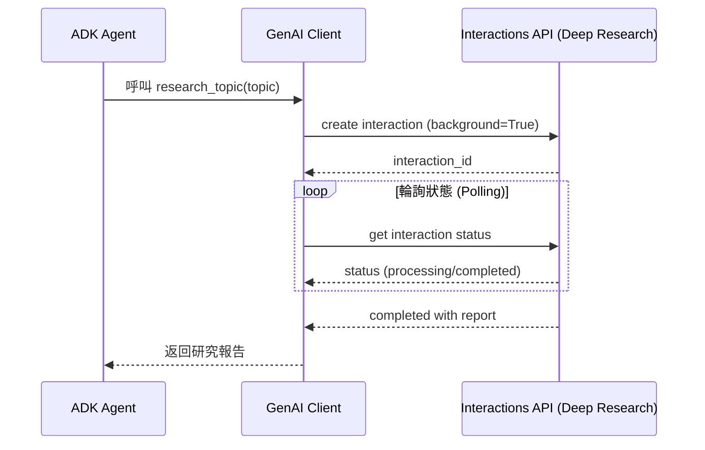

# ADK 與 Interactions API 整合

本範例展示如何將 Google 的 Interactions API 與 Agent Development Kit (ADK) 整合，以實現增強的代理工作流程 (agentic workflows)。

## 功能特性

- 由 Interactions API 後端驅動的 ADK 代理
- 伺服器端狀態管理 (Server-side state management)
- 支援背景執行 (Background execution)
- 使用 ADK 模式進行工具協調 (Tool orchestration)
- Deep Research (深度研究) 委派

## 先決條件 (Prerequisites)

```bash
# 安裝依賴套件
make setup

# 設定您的 API Key
export GOOGLE_API_KEY="your-api-key-here"
```

## 快速開始 (Quick Start)

```bash
# 執行測試
make test

# 啟動 ADK 網頁介面
make dev

# 執行演示
make demo
```

## 關鍵整合模式 (Key Integration Patterns)

### 模式 1：具備 Interactions 後端的 ADK 代理

為您的 ADK 代理啟用 Interactions API：

```python
from google.adk.agents import Agent
from google.adk.models.google_llm import Gemini

root_agent = Agent(
    model=Gemini(
        model="gemini-2.5-flash",
        use_interactions_api=True  # 啟用 Interactions API！
    ),
    name="interactions_agent",
    description="由 Interactions API 驅動的代理",
    instruction="你是一個有用的助手。",
    tools=[my_tool],
)
```

### 模式 2：委派給 Deep Research

建立一個可以委派複雜研究任務的代理：

```python
def research_topic(topic: str) -> dict:
    """委派研究任務給 Deep Research Agent。"""
    from google import genai

    client = genai.Client()
    interaction = client.interactions.create(
        input=f"Research: {topic}",
        agent="deep-research-pro-preview-12-2025",
        background=True
    )

    # 輪詢直到完成
    while interaction.status != "completed":
        interaction = client.interactions.get(interaction.id)
        time.sleep(10)

    return {
        "status": "success",
        "report": interaction.outputs[-1].text
    }

# 具備研究能力的 ADK 代理
agent = Agent(
    model="gemini-2.5-flash",
    tools=[research_topic],
    instruction="使用 research_topic 進行複雜的研究問題。"
)
```

### 優勢 (Benefits)

1. **自動狀態管理**：ADK 處理 `previous_interaction_id`
2. **背景任務**：長時間執行的代理不會逾時
3. **原生思維處理 (Native Thought Handling)**：存取模型推論過程
4. **統一工具 (Unified Tools)**：跨模型與代理使用相同的工具

## 專案結構 (Project Structure)

```
adk-interactions-integration/
├── Makefile                    # 建置與執行指令
├── README.md                   # 本文件
├── pyproject.toml             # 專案設定
├── requirements.txt           # 依賴套件
├── adk_interactions_agent/    # 主要代理模組
│   ├── __init__.py
│   ├── agent.py               # ADK 代理實作
│   ├── tools.py               # 工具定義
│   └── .env.example           # 環境變數範本
└── tests/                     # 測試套件
    └── test_agent.py          # 代理測試
```

### Deep Research 委派流程



## use_interactions_api 開啟比較表 (Comparison Table for Enabling use_interactions_api)

| 功能特性                            | `use_interactions_api = True` (使用 Interactions API)                                                                                                                                                   | `use_interactions_api = False` (使用傳統 `generate_content` API)                                                                                                                                                       |
| :---------------------------------- | :------------------------------------------------------------------------------------------------------------------------------------------------------------------------------------------------------ | :--------------------------------------------------------------------------------------------------------------------------------------------------------------------------------------------------------------------- |
| **對話狀態 (Conversation State)**   | **有狀態 (Stateful):** 使用 `previous_interaction_id` 在多輪對話中維護上下文。<br>**重點說明：** 這是 Interactions API 的核心優勢，由伺服器端管理對話狀態，客戶端無需傳遞完整的歷史紀錄，大幅簡化開發。 | **無狀態 (Stateless):** 每個請求都是獨立的，除非明確使用上下文快取。每次請求都需要發送完整的對話歷史以維持上下文。<br>**重點說明：** 傳統 API 的作法，客戶端需自行管理並傳送對話歷史，可能導致請求體積龐大且效率較低。 |
| **請求處理 (Request Handling)**     | 當存在 `previous_interaction_id` 時，僅將最新的連續使用者訊息發送給 LLM。對函式結果有特殊的處理邏輯。<br>**重點說明：** API 會自動處理對話的接續，開發者只需關注最新的互動內容。                        | 每次請求都會發送所有相關的對話歷史以維持上下文。<br>**重點說明：** 需要手動管理傳送的內容，確保模型能理解完整的對話脈絡。                                                                                              |
| **API 呼叫 (API Calls)**            | 透過 `_generate_content_via_interactions` 路由，最終使用 `api_client.aio.interactions.create()` 進行呼叫。<br>**重點說明：** ADK 內部封裝了對 Interactions API 的呼叫流程。                             | 直接使用 `generate_content_async`，其內部根據是否為串流模式，分別呼叫 `generate_content_stream` 或 `generate_content`。<br>**重點說明：** 這是與 Gemini 模型進行基礎互動的標準方法。                                   |
| **內容過濾 (Content Filtering)**    | 根據 `previous_interaction_id` 執行內容過濾，僅保留最新的使用者訊息。<br>**重點說明：** 確保只將必要的增量資訊傳送至後端，提升效率。                                                                    | 不會在相同層級應用基於 `previous_interaction_id` 的內容過濾。<br>**重點說明：** 內容的管理與過濾責任主要在客戶端。                                                                                                     |
| **上下文快取 (Context Caching)**    | 不使用上下文快取，因為對話狀態是透過 `previous_interaction_id` 維護的。<br>**重點說明：** 狀態管理已由後端處理，因此不需要客戶端的快取機制來減少 token 消耗。                                           | 可以利用 `GeminiContextCacheManager` 來優化 LLM 互動並有效管理上下文。<br>**重點說明：** 透過快取重複的對話前綴，可以節省成本並加快回應速度。                                                                          |
| **轉換工具 (Conversion Utilities)** | 依賴 `interactions_utils.py` 中的各種轉換函式，將 ADK 資料類型與 Interactions API 格式進行雙向映射。<br>**重點說明：** ADK 提供了一層抽象，讓開發者無需手動處理複雜的資料格式轉換。                     | 不需要針對 Interactions API 格式的特定轉換工具。原始 API 回應會被轉換為 `LlmResponse` 物件。<br>**重點說明：** 資料處理流程相對直接，但缺乏針對特定 API 的優化。                                                       |
| **處理器角色 (Processor Role)**     | `InteractionsRequestProcessor` 是關鍵，用於提取 `previous_interaction_id` 並實現對話鏈接。<br>**重點說明：** 這是啟用 Interactions API 模式後，ADK 內部處理流程的核心組件。                             | 其他請求處理器 (如 `_ContentLlmRequestProcessor`) 負責建構對話事件，並可能應用壓縮摘要來管理上下文大小。<br>**重點說明：** 傳統模式下，ADK 透過不同的處理器來管理和優化傳送給模型的內容。                              |

## 實務上啟動情境建議 (Practical Recommendations)

> 在 ADK 中， Gemini 類別中的 use_interactions_api 屬性的預設值為 False 。

當您需要管理與 Gemini 模型的有狀態對話，而不想在每個請求中發送完整的對話歷史時，您應該啟用 `use_interactions_api`。這在以下情境中特別有用：

- **您需要有狀態的對話 (Stateful conversations):** 啟用 `use_interactions_api` 的主要好處是利用 Interactions API 的能力，透過 `previous_interaction_id` 在多輪對話中維護上下文。這避免了在每個 `LlmRequest` 中傳遞整個對話歷史的需要，從而實現更高效的上下文管理。

  - **重點說明：** 這是 Interactions API 的核心價值，由伺服器端負責狀態管理，客戶端只需傳遞一個 ID，大幅簡化了多輪對話的開發複雜度。

- **您希望減少對話歷史的負載大小 (Reduced payload size):** 當存在 `previous_interaction_id` 時，系統僅會將最新的連續使用者訊息發送給 LLM。這顯著減少了每個請求的資料負載，特別是在長時間運行的對話中。

  - **重點說明：** 對於冗長的對話，這可以有效降低網路傳輸量與成本，並可能加快 API 的回應速度。

- **您正在處理需要關聯函式結果的工具使用 (Tool use correlation):** 如果您的對話輪次涉及函式呼叫與回應，啟用 `use_interactions_api` 的 Interactions API 會進行特殊處理，以確保模型的函式呼叫與使用者的函式結果正確關聯。

  - **重點說明：** 這對於確保工具執行的邏輯正確性至關重要，API 會自動匹配 `call_ids`，維持對話流程的連貫性。

- **未使用或不相容上下文快取 (Context caching incompatibility):** Interactions API 透過 `previous_interaction_id` 在內部處理對話狀態，這使得明確的上下文快取機制 (如 `GeminiContextCacheManager` 管理的機制) 變得多餘且不必要。
  - **重點說明：** 由於狀態已由後端維護，因此不需要客戶端的快取機制來減少 token 消耗。兩者是解決相同問題的不同途徑。

總而言之，當您的應用程式需要與 Gemini 模型進行高效、有狀態且流暢的對話互動時，請啟用 `use_interactions_api`，特別是對於傳輸完整歷史記錄效率低下的多輪對話場景。

## 了解更多 (Learn More)

- [ADK Integrations Integration Tools 文件](./adk_interactions_agent/TOOLS.md)
- [adk-python 實作 `google_llm.py`](https://github.com/google/adk-python/blob/main/src/google/adk/models/google_llm.py)
- [ADK 文件](https://google.github.io/adk-docs/)
- [Interactions API 文件](https://ai.google.dev/gemini-api/docs/interactions)
- [部落格文章：精通 Interactions API](../../../notes/google-adk-training-hub/blog/2025-12-12-interactions-api-deep-research.md)

## 重點摘要

- **核心概念**：透過 Google Interactions API 增強 ADK 代理的能力，特別是在狀態管理與長期任務執行方面。
- **關鍵技術**：ADK, Google Interactions API, Gemini 2.5 Flash, Deep Research Agent。
- **重要結論**：啟用 `use_interactions_api=True` 即可讓 ADK 代理獲得伺服器端狀態管理與背景執行能力，無需大幅修改程式碼。
- **行動項目**：設定 API Key 並參考模式 1 與模式 2 進行開發。
