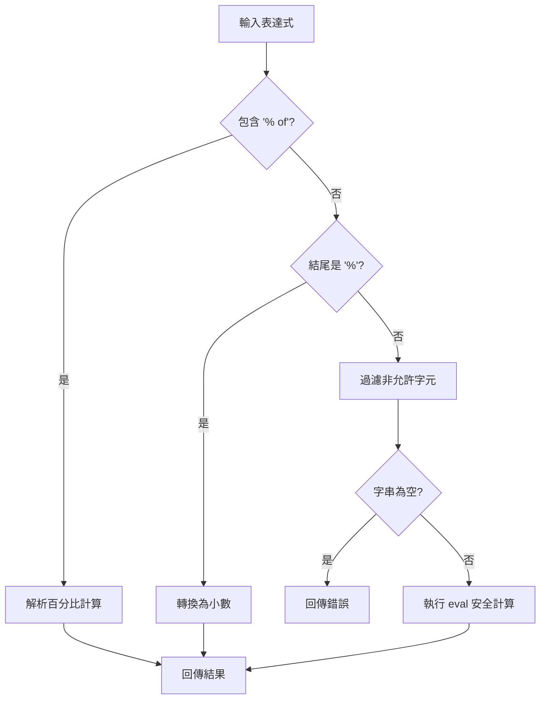
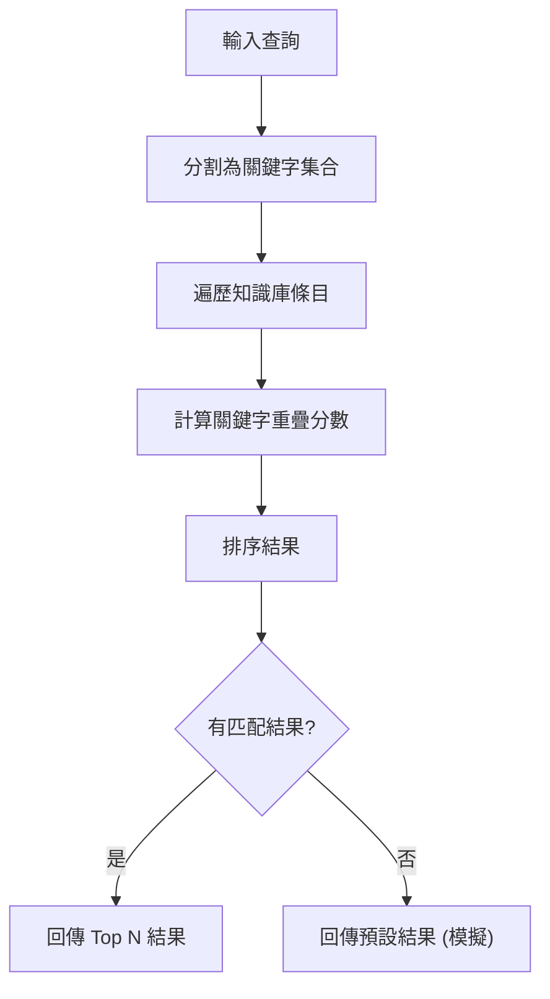

# TOOLS 應用說明文件

## 重點摘要
- **核心概念**：定義代理可使用的功能模組 (Tools)。
- **關鍵技術**：Python Functions, Error Handling, Mock Data Generation。
- **重要結論**：工具必須回傳結構化的字典 (status, report, data)，以便 Agent 統一處理。
- **行動項目**：將 `get_current_weather` 與 `search_knowledge_base` 內的模擬邏輯替換為真實 API 呼叫。

### 計算流程圖 (Calculate Expression)

---
### 搜尋流程圖 (Search Knowledge Base)
