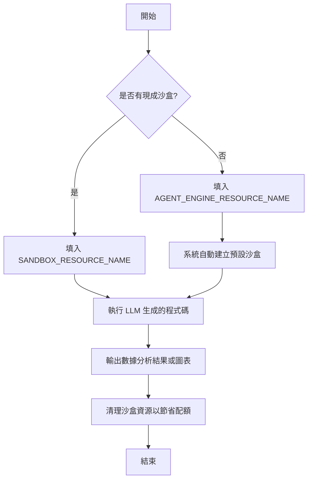
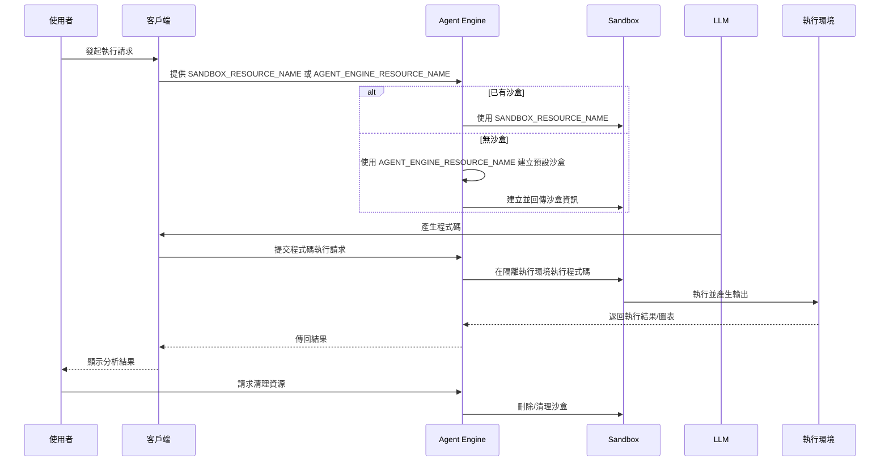

# OAuth 範例 (OAuth Sample)

## 簡介 (Introduction)

此資料科學代理 (Data Science Agent) 範例使用 Agent Engine 程式碼執行沙盒 (Agent Engine Code Execution Sandbox) 來執行由大型語言模型 (LLM) 生成的程式碼。

## 架構流程圖

### 流程圖


### 時序圖 (Sequence Diagram)



## 安裝與執行 (Installation and Execution)

### 1. 安裝環境 (Installation)

本專案建議使用 [uv](https://docs.astral.sh/uv/) 進行管理。請執行以下指令同步環境並安裝依賴：

```bash
uv init
```

接著，安裝 Google ADK：

```bash
uv add google-adk
```

### 2. 執行程式 (Execution)

在執行之前，請確保您已完成「如何使用」章節中的沙盒環境設定。

使用以下指令執行範例：

```bash
adk web
```

## 如何使用 (How to use)

* 1. 請參考 [Vertex AI 文件](https://cloud.google.com/vertex-ai/generative-ai/docs/agent-engine/code-execution/overview) 建立程式碼執行沙盒環境。

* 2. 將 `SANDBOX_RESOURCE_NAME` 替換為您剛建立的沙盒名稱。如果您不想直接建立新的沙盒環境，Agent Engine 程式碼執行沙盒會根據您指定的 `AGENT_ENGINE_RESOURCE_NAME` 預設為您建立一個。但是，請務必在完成後清理沙盒，否則會消耗配額。

## 範例提示詞 (Sample prompt)

* 你能寫一個計算 1 到 100 總和的函式嗎？
* 給定以下數據集：Store,Date,Weekly_Sales,Holiday_Flag,Temperature,Fuel_Price,CPI,Unemployment Store 1,2023-06-01,1000,0,70,3.0,200,5 Store 2,2023-06-02,1200,1,80,3.5,210,6 Store 3,2023-06-03,1400,0,90,4.0,220,7 Store 4,2023-06-04,1600,1,70,4.5,230,8 Store 5,2023-06-05,1800,0,80,5.0,240,9 Store 6,2023-06-06,2000,1,90,5.5,250,10 Store 7,2023-06-07,2200,0,90,6.0,260,11
  請繪製一張散佈圖，展示每家商店的每週銷售額 (Weekly Sales) 與溫度 (Temperature) 之間的關係，並區分是否有假日標記 (Holiday Flag)。

---

## 重點摘要

- **核心概念**：展示如何利用 Google Cloud 的 Agent Engine 程式碼執行沙盒，讓 AI 代理能夠安全地執行生成的 Python 程式碼，進行數據分析與視覺化。
- **關鍵技術**：[Agent Engine](https://cloud.google.com/vertex-ai/generative-ai/docs/agent-engine/overview)（代理引擎）、[Code Execution Sandbox](https://cloud.google.com/vertex-ai/generative-ai/docs/agent-engine/code-execution/overview)（程式碼執行沙盒）、[LLM Generated Code](https://docs.cloud.google.com/vertex-ai/generative-ai/docs/multimodal/code-execution)（模型生成的程式碼）。
- **重要結論**：該範例簡化了數據科學任務的自動化流程，透過沙盒環境確保程式碼執行的安全性和隔離性。
- **行動項目**：
  1. 依據官方文件建立沙盒環境。
  2. 在 `agent.py` 中更新資源名稱配置。
  3. 測試提供的資料科學提示詞以驗證功能。