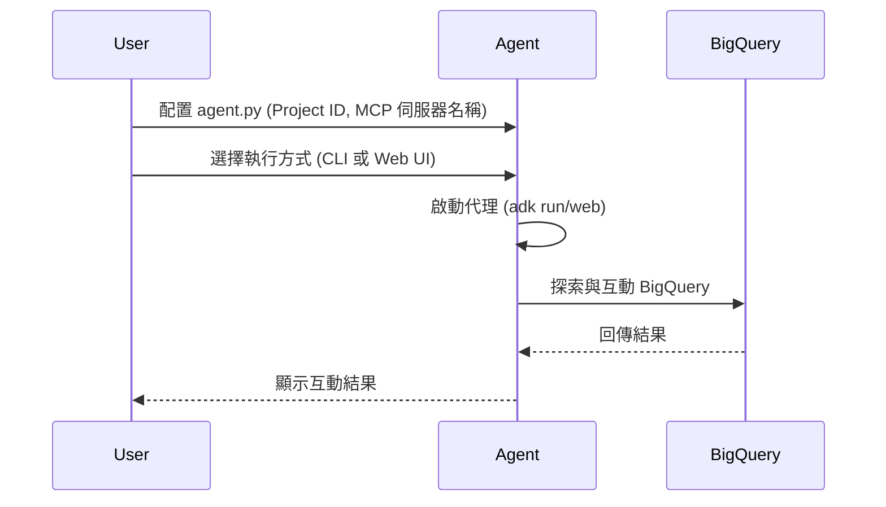

# BigQuery API 註冊代理 (BigQuery API Registry Agent)

此代理（Agent）展示了如何使用 `ApiRegistry` 來探索並與 Google Cloud 服務（如 BigQuery）互動。這是透過註冊在 API 註冊表（API Registry）中的 MCP 伺服器所公開的工具來實現的。

## 前提條件 (Prerequisites)

-   已啟用 API Registry API 的 Google Cloud 專案。
-   一個在 API Registry 中註冊且公開 BigQuery 工具的 MCP 伺服器。

## 配置與執行 (Configuration & Running)

1.  **配置：** 編輯 `agent.py`，將 `your-google-cloud-project-id` 和 `your-mcp-server-name` 替換為您的 Google Cloud 專案 ID 以及已註冊的 MCP 伺服器名稱。
2.  **在 CLI 中執行：**
    ```bash
    adk run contributing/samples/api_registry_agent -- --log-level DEBUG
    ```
3.  **在 Web UI 中執行：**
    ```bash
    adk web contributing/samples/
    ```
    導航至 `http://127.0.0.1:8080` 並選擇 `api_registry_agent` 代理。

## 執行流程圖



## 重點摘要

- **核心概念**：展示如何整合 `ApiRegistry` 與 MCP 伺服器來自動探索 Google Cloud 資源工具。
- **關鍵技術**：
    - **API Registry**：Google Cloud 的 API 註冊服務，用於管理與探索 API。
    - **MCP (Model Context Protocol)**：模型上下文協議，用於連結 LLM 與外部工具。
    - **ADK (Agent Development Kit)**：代理開發工具包，用於構建與執行代理。
- **重要結論**：透過 API Registry，代理可以動態發現並使用雲端服務工具，無需手動硬編碼所有工具定義。
- **行動項目**：
    - 確保 Google Cloud 專案已正確設定。
    - 修改 `agent.py` 中的必要參數。
    - 根據需求選擇 CLI 或網頁介面執行測試。
