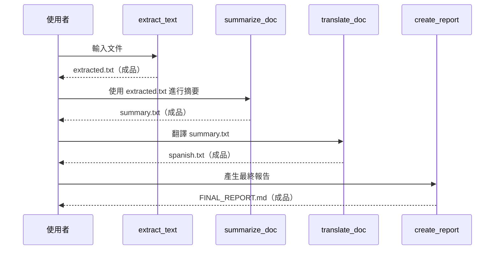

# 教學 19：成品與檔案管理

此實作展示了使用 Google ADK 進行文件處理工作流程的全面成品儲存、版本控制和檢索功能。

## 總覽

**artifact_agent** 展示了如何建構文件處理流程，利用 ADK 的成品系統在不同會話（Session）之間進行持久性檔案儲存。主要功能包括：

- **文件文字提取**：提取文件內容並將其儲存為成品。
- **智慧摘要**：生成摘要並自動進行版本控制。
- **多語言翻譯**：翻譯內容並將翻譯結果儲存為成品。
- **最終報告生成**：結合所有成品，創建綜合報告。
- **成品管理**：列出、載入和管理已儲存的成品。
- **內建成品工具**：使用 ADK 內建的 `load_artifacts_tool` 進行對話式存取。

## 架構



## 關鍵元件

### 代理程式設定

`root_agent` 的設定如下：
- **模型**：`gemini-1.5-flash` 以獲得最佳效能。
- **工具**：7 個用於文件處理和成品管理的專用工具。
- **指令**：針對基於成品的工作流程提供全面的指引。

### 工具函式

1.  **`extract_text_tool`**：提取並儲存文件文字。
2.  **`summarize_document_tool`**：生成摘要並進行版本控制。
3.  **`translate_document_tool`**：將內容翻譯成目標語言。
4.  **`create_final_report_tool`**：將所有成品結合成最終報告。
5.  **`list_artifacts_tool`**：列出所有可用的成品。
6.  **`load_artifact_tool`**：按檔名/版本載入特定的成品。
7.  **`load_artifacts_tool`**：ADK 內建工具，用於對話式成品存取。

### 成品儲存

- **記憶體內服務 (In-Memory Service)**：用於開發和測試。
- **版本控制**：每次儲存時自動進行版本控制（0, 1, 2, ...）。
- **會話範圍 (Session Scoping)**：成品的作用範圍限定於使用者會話。
- **元資料追蹤**：自動追蹤時間戳和上下文。

## 快速入門

### 先決條件

1.  已安裝 **Python 3.9+**。
2.  從 [AI Studio](https://aistudio.google.com/app/apikey) 取得 **Google AI API 金鑰**。

### 設定

```bash
# 複製並進入教學目錄
cd tutorial_implementation/tutorial19

# 安裝依賴套件
make setup

# 設定您的 API 金鑰
export GOOGLE_API_KEY=your_api_key_here

# 啟動代理程式
make dev
```

### 示範工作流程

1.  在瀏覽器中 **開啟** http://localhost:8000。
2.  從下拉選單中 **選擇** "artifact_agent"。
3.  **嘗試以下提示**：

```
處理此文件：The quick brown fox jumps over the lazy dog. This is a sample document for testing artifact storage and retrieval capabilities.

顯示所有已儲存的成品

總結我剛處理的文件

將摘要翻譯成西班牙文

創建一份結合所有成品的最終報告
```

## 工具詳情

### 文件處理工具

#### `extract_text_tool(document_content: str)`

從文件中提取文字並另存為 `document_extracted.txt`：

```python
result = extract_text_tool("範例文件文字...")
# 返回: {'status': 'success', 'report': '...', 'data': {...}}
```

#### `summarize_document_tool(document_text: str)`

生成摘要並另存為 `document_summary.txt`：

```python
result = summarize_document_tool("長篇文件文字...")
# 創建帶有摘要的版本化成品
```

#### `translate_document_tool(text: str, target_language: str)`

翻譯文字並另存為 `document_{language}.txt`：

```python
result = translate_document_tool("Hello world", "Spanish")
# 儲存: document_spanish.txt
```

### 成品管理工具

#### `list_artifacts_tool()`

列出當前會話中的所有成品：

```python
result = list_artifacts_tool()
# 返回: ['document_extracted.txt', 'document_summary.txt', ...]
```

#### `load_artifact_tool(filename: str, version: Optional[int])`

載入特定的成品：

```python
result = load_artifact_tool('document_summary.txt', version=0)
# 載入摘要的第一個版本
```

#### `load_artifacts_tool` (內建)

ADK 的內建工具，用於對話式成品存取。當使用者詢問時，會自動載入成品。

## 設定

### 環境變數

創建一個 `.env` 檔案（切勿提交此檔案）：

```bash
cp .env.example .env
# 編輯 .env 並填入您的 GOOGLE_API_KEY
```

### 成品服務

此代理程式在開發時使用 `InMemoryArtifactService`。對於生產環境：

```python
from google.adk.artifacts import GcsArtifactService

# 生產環境設定
artifact_service = GcsArtifactService(bucket_name='your-gcs-bucket')
```

## 測試

執行全面的測試套件：

```bash
# 執行所有測試
make test

# 執行並產生覆蓋率報告
pytest tests/ -v --cov=artifact_agent --cov-report=html
```

### 測試覆蓋範圍

- **代理程式設定**：驗證代理程式的設定和工具。
- **導入驗證**：確保所有依賴套件都可用。
- **專案結構**：驗證正確的檔案組織。
- **工具函式**：測試所有文件處理工具。
- **錯誤處理**：驗證正確的錯誤回應。

## API 參考

### 代理程式方法

- `save_artifact(filename, artifact)`：儲存成品，返回版本號。
- `load_artifact(filename, version=None)`：載入成品（若無指定版本，則為最新版）。
- `list_artifacts()`：列出所有成品檔名。

### 工具返回格式

所有工具均返回結構化的字典：

```python
{
    'status': 'success' | 'error',
    'report': '人類可讀的訊息',
    'data': {  # 僅在成功時出現
        'filename': 'artifact_name.txt',
        'content': '成品內容',
        # ... 其他元資料
    }
}
```

## 進階用法

### 自訂成品工作流程

```python
# 範例：多步驟文件處理
async def process_document(context, document):
    # 提取文字
    extracted = await context.save_artifact('doc.txt', types.Part.from_text(document))

    # 生成摘要
    summary = await context.save_artifact('summary.txt', types.Part.from_text("摘要..."))

    # 創建報告
    report = await context.save_artifact('report.md', types.Part.from_text("最終報告..."))

    return [extracted, summary, report]
```

### 版本管理

```python
# 儲存多個版本
v1 = await context.save_artifact('report.txt', part1)  # v0
v2 = await context.save_artifact('report.txt', part2)  # v1
v3 = await context.save_artifact('report.txt', part3)  # v2

# 載入特定版本
latest = await context.load_artifact('report.txt')      # v2
version1 = await context.load_artifact('report.txt', 1)  # v1
```

## 疑難排解

### 常見問題

1.  **"成品分頁是空的" (UI 顯示問題)**
    -   **這是 `InMemoryArtifactService` 的預期行為**。
    -   成品 **有** 被正確儲存（請檢查伺服器日誌中的 HTTP 200 回應）。
    -   成品可透過聊天中的藍色按鈕存取（點擊 "display document_xxx.txt"）。
    -   **解決方法**：使用聊天回應中出現的藍色成品按鈕。
    -   **替代方案**：詢問代理程式 "顯示所有已儲存的成品" 以在聊天中列出它們。
    -   **根本原因**：ADK Web UI 的側邊欄需要 `InMemoryArtifactService` 未提供的元資料。
    -   **生產環境**：在生產環境中使用 `GcsArtifactService` 不存在此限制。

2.  **"成品服務未初始化"**
    -   確保在 Runner 中已設定成品服務。
    -   檢查 `artifact_service` 參數是否已傳遞。

3.  **"找不到成品"**
    -   確認成品是在同一個會話中儲存的。
    -   檢查檔名拼寫和大小寫。

4.  **導入錯誤**
    -   執行 `make setup` 安裝依賴套件。
    -   檢查 Python 版本（需要 3.9+）。

### 除錯模式

啟用除錯日誌：

```bash
export PYTHONPATH=/path/to/adk-python/src:$PYTHONPATH
# 執行並啟用詳細日誌
```

### 驗證成品是否正常運作

即使成品側邊欄是空的，您仍可透過以下方式驗證成品是否正常運作：

1.  **檢查伺服器日誌** 中儲存/載入成品時的 `HTTP/1.1" 200 OK` 回應。
2.  **點擊聊天中** 的藍色按鈕 "display document_xxx.txt"。
3.  **詢問代理程式**："顯示所有已儲存的成品" - 它會在聊天中列出它們。
4.  **詢問代理程式**："載入 document_extracted.txt" - 它會顯示內容。

## 檔案結構

```
tutorial19/
├── artifact_agent/
│   ├── __init__.py          # 套件標記
│   └── agent.py             # 主要代理程式實作
├── tests/
│   ├── __init__.py
│   ├── test_agent.py        # 代理程式設定測試
│   ├── test_imports.py      # 導入驗證測試
│   ├── test_structure.py    # 專案結構測試
│   └── test_tools.py        # 工具函式測試
├── pyproject.toml           # 現代化的 Python 套件管理
├── requirements.txt         # 依賴套件
├── Makefile                 # 建構與執行指令
├── .env.example             # 環境變數範本
└── README.md               # 本文件
```

## 貢獻

擴充此實作時：

1.  遵循返回格式模式，新增工具。
2.  為新功能更新測試。
3.  維持成品命名慣例。
4.  在此 README 中記錄新功能。

## 授權

此實作遵循與 ADK 專案相同的授權。

---

### 重點摘要
- **核心概念**：此專案 (`artifact_agent`) 展示如何使用 Google ADK 建立一個具備成品（Artifact）儲存、版本控制與檢索功能的文件處理代理程式。它能在不同會話間持久化儲存檔案，實現如文字提取、摘要、翻譯和報告生成等功能。
- **關鍵技術**：
    - **ADK 成品系統**：利用 `InMemoryArtifactService` (開發用) 或 `GcsArtifactService` (生產用) 進行檔案的儲存與管理。
    - **版本控制**：系統會自動為每次儲存的成品進行版本編號 (v0, v1, ...)。
    - **專用工具集**：提供了 7 個工具，涵蓋文件處理（提取、摘要、翻譯）與成品管理（列出、載入）。
    - **對話式存取**：透過 ADK 內建的 `load_artifacts_tool`，使用者能以自然語言查詢並載入成品。
- **重要結論**：
    - ADK 的成品系統為需要處理和保存多版本檔案的 AI 代理程式提供了強大的後端支援。
    - 雖然開發時使用的 `InMemoryArtifactService` 在 UI 上有顯示限制（成品分頁為空），但功能本身是正常的，可透過聊天介面或直接查詢來驗證。
    - 專案結構清晰，包含代理程式邏輯、測試、設定檔和說明文件，是學習 ADK 進階功能的良好範例。
