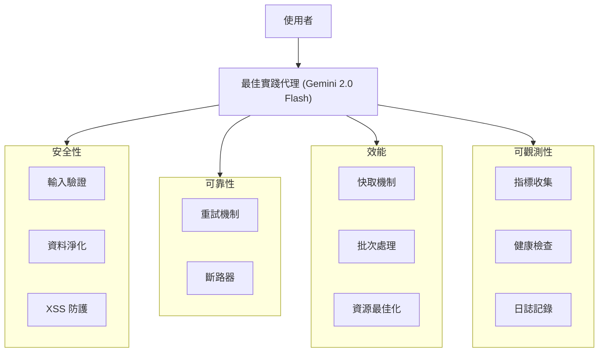

# 教學 25：最佳實踐 - 生產就緒代理開發 (Production-Ready Agent Development)

本實作展示了使用 Google Agent Development Kit (ADK) 建置生產就緒代理 (Production-Ready Agent) 的完整最佳實踐，包括安全性、效能最佳化、可靠性模式和可觀測性。

## 概述

**best_practices_agent** 展示了代理開發的企業級模式：

- **安全性最佳實踐 (Security Best Practices)**：輸入驗證、XSS/SQL 注入防護、安全錯誤處理
- **可靠性模式 (Reliability Patterns)**：指數退避 (Exponential Backoff) 的重試邏輯、外部服務的斷路器 (Circuit Breaker)
- **效能最佳化 (Performance Optimization)**：具 TTL 的快取機制、批次處理、高效資源使用
- **可觀測性 (Observability)**：健康檢查、指標收集、系統監控
- **錯誤處理 (Error Handling)**：具有優雅降級 (Graceful Degradation) 的完整錯誤處理

## 架構



## 關鍵組件

### 安全性與驗證 (Security & Validation)

**輸入驗證工具** (`validate_input_tool`)
- 基於 Pydantic 的型別檢查驗證
- 電子郵件格式驗證
- SQL 注入模式偵測
- XSS 防護
- 文字長度限制
- 優先順序層級驗證

### 可靠性與韌性 (Reliability & Resilience)

**具退避機制的重試** (`retry_with_backoff_tool`)
- 發生暫時性故障時自動重試
- 指數退避策略 (1秒, 2秒, 4秒)
- 可設定最大重試次數
- 詳細嘗試追蹤

**斷路器** (`circuit_breaker_call_tool`)
- 防止連鎖故障
- 自動狀態管理 (關閉 CLOSED → 開啟 OPEN → 半開啟 HALF_OPEN)
- 可設定故障閾值
- 基於超時的復原機制

### 效能最佳化 (Performance Optimization)

**快取系統** (`cache_operation_tool`)
- 具 TTL (存活時間) 的時間基礎快取
- 命中/未命中 (Hit/Miss) 追蹤
- 效能統計
- 自動過期

**批次處理** (`batch_process_tool`)
- 高效處理多個項目
- 效率增益計算
- 節省時間報告
- 資源最佳化

### 可觀測性與監控 (Observability & Monitoring)

**健康檢查** (`health_check_tool`)
- 系統健康狀態 (健康 healthy/降級 degraded/不健康 unhealthy)
- 斷路器狀態監控
- 快取統計
- 綜合指標

**指標收集** (`get_metrics_tool`)
- 請求計數
- 錯誤率追蹤
- 平均延遲計算
- 正常運行時間 (Uptime) 監控
- 每秒請求數 (RPS)

## 快速開始

### 前置需求

1. 已安裝 **Python 3.9+**
2. 從 [AI Studio](https://aistudio.google.com/app/apikey) 取得 **Google AI API Key**

### 設定

```bash
# 複製並導航至教學目錄
cd tutorial_implementation/tutorial25

# 安裝依賴項目
make setup

# 設定您的 API 金鑰
export GOOGLE_API_KEY=your_api_key_here

# 啟動代理
make dev
```

### 示範工作流程

1. **開啟** 瀏覽器並前往 http://localhost:8000
2. 從下拉選單中 **選擇** "best_practices_agent"
3. **嘗試這些生產情境**：

#### 安全性驗證
```
Validate this email: user@example.com
Validate this email: invalid-email
Try to validate text with SQL injection: DROP TABLE users
```

#### 可靠性模式
```
Process order with retry logic: ORD-123
Call external service with circuit breaker
Demonstrate failure handling and recovery
```

#### 效能最佳化
```
Cache user preferences: theme=dark, language=en
Retrieve cached preferences
Show cache statistics
Batch process these orders: ORD-001, ORD-002, ORD-003
```

#### 監控與可觀測性
```
Show me the system health status
Display performance metrics
What's the current error rate?
Check circuit breaker status
```

## 範例提示詞 (Prompts)

### 輸入驗證範例

**有效電子郵件驗證：**
```
Validate this email address: john.doe@example.com with text "Hello World" and high priority
```

預期結果：✅ 成功並顯示驗證後的資料

**無效電子郵件偵測：**
```
Validate this email: not-an-email
```

預期結果：❌ 錯誤並顯示驗證訊息

**XSS 防護：**
```
Validate text containing: <script>alert('xss')</script>
```

預期結果：❌ 因安全警告而被封鎖

### 可靠性範例

**重試邏輯：**
```
Process this order with retry: ORD-12345
```

預期結果：多次嘗試並採用指數退避

**斷路器：**
```
Call the payment service
```

預期結果：受保護的呼叫並報告電路狀態

### 效能範例

**快取：**
```
Cache this data: user_123 = premium_subscriber
Then retrieve it: get user_123
Show me cache statistics
```

預期結果：快取命中/未命中追蹤與效能統計

**批次處理：**
```
Batch process these items: Apple, Banana, Orange, Grape, Melon
```

預期結果：高效處理並顯示時間比較

### 監控範例

**健康檢查：**
```
What's the system health status?
```

預期結果：包含指標的綜合健康報告

**效能指標：**
```
Show me the performance statistics
```

預期結果：請求數、延遲、錯誤率、正常運行時間

## 實作細節

### 安全性實作

```python
# Pydantic 驗證模型
from pydantic import BaseModel, Field, EmailStr, field_validator
from typing import Optional

class InputRequest(BaseModel):
    email: Optional[EmailStr] = Field(None)
    text: str = Field(..., min_length=1, max_length=10000)
    priority: str = Field("normal")

    @classmethod
    @field_validator('text')
    def validate_text(cls, v):
        dangerous = ['DROP TABLE', 'DELETE FROM', '; --', '<script>']
        # 檢查危險模式
```

### 斷路器模式 (Circuit Breaker Pattern)

```python
class CircuitBreaker:
    def __init__(self, failure_threshold=3, timeout_seconds=30):
        self.state = CircuitState.CLOSED
        self.failures = 0

    def call(self, func, *args, **kwargs):
        if self.state == CircuitState.OPEN:
            # 檢查超時並可能轉換至 HALF_OPEN 狀態

        try:
            result = func(*args, **kwargs)
            # 成功時重置
        except Exception:
            self.failures += 1
            if self.failures >= self.failure_threshold:
                self.state = CircuitState.OPEN
```

### 快取策略 (Caching Strategy)

```python
class CachedDataStore:
    def __init__(self, ttl_seconds=300):
        self.cache = {}  # {key: (value, timestamp)}
        self.ttl = ttl_seconds

    def get(self, key):
        if key in self.cache:
            value, timestamp = self.cache[key]
            if time.time() - timestamp < self.ttl:
                return value  # 快取命中 (Cache hit)
            del self.cache[key]  # 過期
        return None  # 快取未命中 (Cache miss)
```

### 指標收集 (Metrics Collection)

```python
class MetricsCollector:
    def record_request(self, latency, error=False):
        self.request_count += 1
        self.total_latency += latency
        if error:
            self.error_count += 1

    def get_metrics(self):
        return {
            'total_requests': self.request_count,
            'error_rate': self.error_count / self.request_count,
            'avg_latency_ms': self.total_latency / self.request_count
        }
```

## 測試

本實作包含完整的測試覆蓋：

### 執行所有測試

```bash
# 基本測試執行
make test

# 含覆蓋率報告
make test-cov
```

### 測試類別

**匯入測試 (Import Tests)** (`test_imports.py`)
- ✅ 代理模組匯入
- ✅ 工具函數匯入
- ✅ 類別匯入
- ✅ 依賴項目匯入

**結構測試 (Structure Tests)** (`test_structure.py`)
- ✅ 專案結構驗證
- ✅ 必要檔案存在性
- ✅ 設定正確性

**代理測試 (Agent Tests)** (`test_agent.py`)
- ✅ 代理設定 (85+ 測試)
- ✅ 具安全性檢查的輸入驗證
- ✅ 重試邏輯與指數退避
- ✅ 斷路器狀態管理
- ✅ 快取操作與 TTL
- ✅ 批次處理效率
- ✅ 健康檢查與指標
- ✅ 錯誤處理情境
- ✅ 整合工作流程
- ✅ 效能特性

### 測試覆蓋率

```bash
# 產生 HTML 覆蓋率報告
make test-cov

# 開啟覆蓋率報告
open htmlcov/index.html
```

## 生產部署模式

### 部署前檢查清單

- [x] 已實作輸入驗證
- [x] 錯誤處理完整
- [x] 已設定重試邏輯
- [x] 斷路器就位
- [x] 已啟用快取
- [x] 已設定監控
- [x] 健康檢查運作中
- [x] 測試通過 (85+ 測試)
- [x] 文件完整

### 環境設定

```bash
# 開發環境
export GOOGLE_API_KEY=your_dev_key

# 生產環境
export GOOGLE_CLOUD_PROJECT=your-project
export GOOGLE_APPLICATION_CREDENTIALS=/path/to/service-account.json
```

### 部署選項

**選項 1：Cloud Run (推薦)**
```bash
adk deploy cloud_run
```

**選項 2：Vertex AI Agent Engine**
```bash
adk deploy agent_engine
```

**選項 3：GKE**
```bash
adk deploy gke
```

## 展示的最佳實踐

### 1. 安全性 (Security)

✅ **輸入驗證**：具驗證器的 Pydantic 模型
✅ **資料淨化**：移除危險模式
✅ **錯誤訊息**：資訊豐富但不洩漏內部細節
✅ **日誌記錄**：不含敏感資料的結構化日誌

### 2. 可靠性 (Reliability)

✅ **重試邏輯**：暫時性故障的指數退避
✅ **斷路器**：防止連鎖故障
✅ **優雅降級**：備援策略
✅ **超時管理**：防止請求懸置

### 3. 效能 (Performance)

✅ **快取**：減少重複運算
✅ **批次處理**：最佳化大量操作
✅ **連線池**：高效資源使用
✅ **延遲載入 (Lazy Loading)**：按需載入資源

### 4. 可觀測性 (Observability)

✅ **指標收集**：追蹤關鍵效能指標 (KPIs)
✅ **健康檢查**：監控系統狀態
✅ **結構化日誌**：一致的日誌格式
✅ **追蹤 (Tracing)**：請求流程可視化

### 5. 程式碼品質 (Code Quality)

✅ **型別提示 (Type Hints)**：完整的型別註釋
✅ **文件字串 (Docstrings)**：綜合文件
✅ **錯誤處理**：具特定異常的 Try-except
✅ **測試**：85+ 單元與整合測試

## 學習成果

完成本實作後，您將理解：

1. **安全性模式**
   - 如何驗證與淨化輸入
   - 防範常見漏洞
   - 安全錯誤處理

2. **可靠性模式**
   - 實作具指數退避的重試邏輯
   - 外部依賴的斷路器模式
   - 優雅降級策略

3. **效能最佳化**
   - 具 TTL 的快取策略
   - 提升效率的批次處理
   - 資源最佳化技術

4. **可觀測性**
   - 指標收集與報告
   - 健康檢查實作
   - 系統監控模式

5. **生產就緒度**
   - 綜合錯誤處理
   - 測試策略
   - 部署最佳實踐

## 真實世界應用

### 電子商務平台
- 使用者訂單的輸入驗證
- 支付閘道的斷路器
- 產品目錄的快取
- 訂單處理的指標

### 客戶支援系統
- 建立工單的重試邏輯
- 批次更新的批次處理
- 正常運行時間的健康監控
- 效能追蹤

### 資料處理管線
- 輸入資料的驗證
- 外部 API 的斷路器
- 參考資料的快取
- 管線健康的可觀測性

### API 閘道
- 請求驗證
- 具斷路器的速率限制 (Rate limiting)
- 回應快取
- 綜合指標

## 疑難排解

### 常見問題

**問題**：有效輸入驗證失敗
```bash
# 檢查驗證邏輯
python -c "from best_practices_agent.agent import InputRequest; print(InputRequest(text='test', priority='normal'))"
```

**問題**：斷路器卡在 OPEN 狀態
```bash
# 斷路器會在超時後重置 (預設 30秒)
# 使用健康檢查工具檢查當前狀態
```

**問題**：快取未傳回值
```bash
# 檢查 TTL 設定 (預設 300秒)
# 使用統計工具驗證快取操作
```

**問題**：測試失敗
```bash
# 確保依賴項目已安裝
make setup

# 執行具詳細輸出的測試
pytest tests/ -v --tb=long
```

### 效能提示

1. **調整快取 TTL**：穩定資料可使用較長 TTL
2. **設定重試次數**：在速度與韌性間取得平衡
3. **微調斷路器**：根據服務穩定性調整閾值
4. **批次大小**：針對使用案例最佳化批次大小

## 進階用法

### 自訂驗證規則

```python
# 新增自訂驗證器至 InputRequest
@validator('text')
def custom_validation(cls, v):
    # 您的驗證邏輯
    return v
```

### 調整斷路器

```python
# 建立自訂斷路器
custom_breaker = CircuitBreaker(
    failure_threshold=5,  # 較寬鬆
    timeout_seconds=60    # 較長復原時間
)
```

### 快取設定

```python
# 調整快取 TTL
data_cache = CachedDataStore(ttl_seconds=600)  # 10 分鐘
```

---


## 重點摘要
- **核心概念**：生產就緒代理開發的最佳實踐，包括安全性、可靠性、效能和可觀測性。
- **關鍵技術**：Pydantic 驗證, Circuit Breaker 模式, 快取機制, 批次處理, 系統健康檢查。
- **重要結論**：透過模組化設計整合多種生產級模式，可顯著提升代理的穩健性與效率。
- **行動項目**：嘗試使用 `make dev` 運行代理並測試各種生產情境，如輸入驗證、錯誤重試等。
