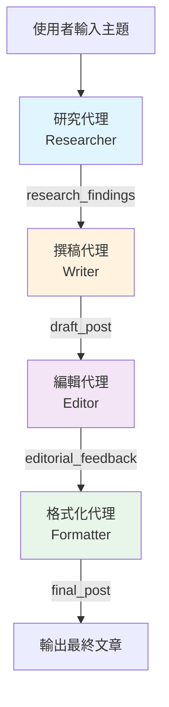
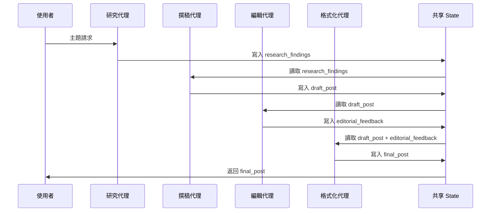

# 部落格創建流水線 (Blog Creation Pipeline)

## 概述

這是一個基於 Google ADK 的循序工作流程範例,展示如何將多個 AI 代理串連成嚴格的序列,協同完成複雜的部落格文章創建任務。

## 流程架構



## 代理組成

### 1. 研究代理 (Researcher)
- **職責**: 收集關於主題的關鍵事實和資訊
- **輸出**: `research_findings` - 5-7 個關鍵事實的項目列表
- **模型**: gemini-2.0-flash

### 2. 撰稿代理 (Writer)
- **職責**: 根據研究結果撰寫部落格文章草稿
- **輸入**: `{research_findings}` - 從研究代理獲取
- **輸出**: `draft_post` - 3-4 段的部落格文章草稿
- **模型**: gemini-2.0-flash

### 3. 編輯代理 (Editor)
- **職責**: 審閱草稿並提供改進建議
- **輸入**: `{draft_post}` - 從撰稿代理獲取
- **輸出**: `editorial_feedback` - 編輯建議列表
- **模型**: gemini-2.0-flash

### 4. 格式化代理 (Formatter)
- **職責**: 應用編輯建議並格式化為 Markdown
- **輸入**:
  - `{draft_post}` - 原始草稿
  - `{editorial_feedback}` - 編輯建議
- **輸出**: `final_post` - 最終 Markdown 格式的部落格文章
- **模型**: gemini-2.0-flash

## 資料傳遞機制

### State 共享機制

所有代理共享一個 `state` 字典,用於在流水線中傳遞資料:

```python
state = {
    'research_findings': '...',     # 研究代理輸出
    'draft_post': '...',            # 撰稿代理輸出
    'editorial_feedback': '...',    # 編輯代理輸出
    'final_post': '...'             # 格式化代理輸出
}
```

### 資料流向圖



### 資料傳遞說明

1. **研究階段**
   - 輸入: 使用者提供的主題
   - 處理: 研究代理收集關鍵資訊
   - 輸出: `research_findings` 儲存至 state

2. **撰稿階段**
   - 輸入: 從 state 讀取 `{research_findings}`
   - 處理: 撰稿代理根據研究結果撰寫草稿
   - 輸出: `draft_post` 儲存至 state

3. **編輯階段**
   - 輸入: 從 state 讀取 `{draft_post}`
   - 處理: 編輯代理審閱並提供改進建議
   - 輸出: `editorial_feedback` 儲存至 state

4. **格式化階段**
   - 輸入: 從 state 讀取 `{draft_post}` 和 `{editorial_feedback}`
   - 處理: 格式化代理應用建議並格式化為 Markdown
   - 輸出: `final_post` 儲存至 state 並返回給使用者

## 關鍵技術特點

### SequentialAgent
- 確保代理按照定義的順序**嚴格依序**執行
- 每個代理完成後,下一個代理才會開始

### output_key
- 每個代理透過 `output_key` 參數指定其輸出在 state 中的鍵名
- 例如: `output_key="research_findings"` 會將輸出儲存至 `state['research_findings']`

### 模板變數替換
- 在代理的 `instruction` 中使用 `{key_name}` 語法
- 執行時會自動從 state 中讀取對應的值
- 例如: `{research_findings}` 會被替換為 `state['research_findings']` 的內容

## 使用方式

```python
# 呼叫流水線
result = blog_creation_pipeline.run("請寫一篇關於人工智慧的部落格文章")

# 最終文章在 result['final_post']
print(result['final_post'])
```

## 優勢

1. **模組化**: 每個代理專注於單一職責
2. **可維護性**: 容易修改或替換個別代理
3. **可追蹤性**: 可以檢視每個階段的中間輸出
4. **可擴展性**: 容易添加新的處理階段
5. **可靠性**: 嚴格的執行順序確保資料一致性

## 相關檔案

- `agent.py` - 主要代理定義和流水線配置
- `main.py` - 執行入口
