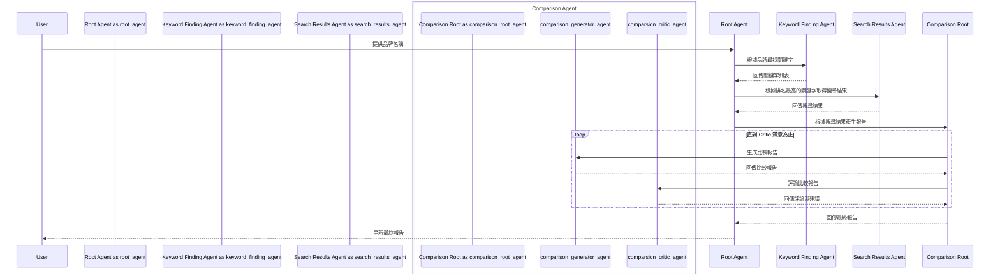

# 品牌搜尋優化 Agent：您的智慧商品文案助理

## 這是什麼？

這是一個旨在協助零售網站**強化商品資料**的智慧 Agent。

想像一下，您網站上的某些商品，顧客怎麼搜都找不到，或是搜尋結果很少。這通常是因為商品標題、描述，沒有包含顧客真正會用的關鍵字。

這個 Agent 能扮演一位虛擬的「市場研究員」，它會：

1.  **分析您的商品**：根據您提供的品牌，從資料庫（BigQuery）中讀取商品資料。
2.  **模擬顧客搜尋**：自動產生相關的搜尋關鍵字。
3.  **逛您的網站**：實際到網站上用這些關鍵字進行搜尋。
4.  **提供優化建議**：分析搜尋結果名列前茅的商品，回過頭來建議您「如何豐富商品標題」，以提高曝光率。

簡單來說，它的核心流程是：**用「您的商品資料」產生查詢詞，再用「真實的搜尋結果」回推應補強的商品內容。**

| Attribute      | Detail                            |
| -------------- | --------------------------------- |
| **互動類型**   | 工作流程 (Workflow)               |
| **複雜度**     | 進階 (Advanced)                   |
| **Agent 類型** | 多代理 (Multi Agent)              |
| **設計模式**   | 路由代理 (Router Agent)           |
| **主要元件**   | BigQuery, 瀏覽器操作, Tools, 評估 |
| **應用領域**   | 零售 (Retail)                     |

---

## 快速上手指南 (5 分鐘內啟動)

本專案提供了 `Makefile` 來簡化所有繁瑣的步驟。跟著以下流程，即可快速啟動並與 Agent 互動。

### 1. 環境準備

請先確保您的電腦已安裝以下工具：

- Python 3.11+
- [Poetry](https://python-poetry.org/docs/) (用於管理 Python 套件)
- [Google Cloud SDK](https://cloud.google.com/sdk/docs/install) (用於帳號驗證)
- Git

### 2. 專案設定

只需幾個指令，就能完成專案的初始設定。

```bash
# 1. 複製專案原始碼
git clone https://github.com/google/adk-samples.git
cd adk-samples/python/agents/brand-search-optimization

# 2. 複製環境設定檔範本
cp env.example .env

# 3. 編輯 .env 檔案，填入您的 Google Cloud 專案資訊
#    - GOOGLE_CLOUD_PROJECT=<YOUR_PROJECT_ID>
#    - GOOGLE_CLOUD_LOCATION=<YOUR_GCP_LOCATION> (例如：us-central1)
#    - GOOGLE_API_KEY=<YOUR_API_KEY> (從 aistudio.google.com 取得)
#    - DATASET_ID=products_data_agent (可使用預設值)
#    - TABLE_ID=products (可使用預設值)

# 4. 進行 Google Cloud 帳號驗證
gcloud auth application-default login
```

### 3. 一鍵安裝與啟動

設定完成後，執行以下指令，它會自動幫您**安裝所有套件**並**建立/填入 BigQuery 樣本資料**。

```bash
make setup
```

> **提示**：此命令等同於執行 `sh deployment/run.sh`，是整個專案最關鍵的安裝步驟。

### 4. 執行 Agent

安裝成功後，有兩種方式可以啟動 Agent：

**方式一：在終端機中執行 (推薦)**

```bash
# 啟動 Web UI 服務
adk web
```

`adk web` 會在本機啟動一個網頁伺服器。打開它提供的網址（通常是 `http://127.0.0.1:8080`），你將看到一個聊天介面。

**方式二：直接在終端機互動**

```bash
adk run brand_search_optimization
```

### 5. 與 Agent 互動

1.  在 Web UI 的下拉選單中，選擇 **"brand-search-optimization"**。
2.  Agent 會詢問品牌名稱，請輸入 `BSOAgentTestBrand` (這是 `make setup` 建立的預設品牌)。
3.  Agent 會開始執行，並自動開啟一個新的 Chrome 瀏覽器視窗進行網頁操作。**請勿關閉此視窗**。
4.  當 Agent 產生關鍵字列表後，它可能會停下來等待指示。此時，請明確地告訴它去搜尋，例如：
    - `"Can you search the website?"`
    - `"Help me search for keywords on the website"`

> **重點註解**：
>
> - 執行 Agent 前，請確保 `.env` 檔案中的 `DISABLE_WEB_DRIVER=0`。這樣瀏覽器才能被自動控制。
> - 第一次執行時，目標網站（如 Google Shopping）可能需要手動完成 CAPTCHA 驗證。
> - 如果流程在「產生關鍵字」後卡住，直接請它搜尋通常就能繼續。

---

## 它是如何運作的？

這個 Agent 之所以強大，是因為它由多個「子 Agent」協同工作，每個子 Agent 都有明確分工。

### Agent 流程圖



### 核心流程拆解

1.  **啟動 (User -> Root Agent)**：您提供一個品牌名稱，啟動整個流程。
2.  **關鍵字尋找 (Root Agent -> Keyword Finding Agent)**：`Root Agent` 指派 `Keyword Finding Agent` 去根據品牌尋找相關的搜尋關鍵字。
3.  **搜尋結果擷取 (Root Agent -> Search Results Agent)**：`Root Agent` 挑選最重要的關鍵字，交給 `Search Results Agent` 去網站上實際搜尋，並抓取結果頁面的資料。
4.  **比較與分析 (Root Agent -> Comparison Agent)**：這是最核心的部分。
    - `Comparison Agent` 內部有一個「生成-評論」的循環機制。
    - **生成 (Generator)**：比較搜尋結果的標題和您自家產品的標題，產生一份包含改進建議的報告。
    - **評論 (Critic)**：審查這份報告，若覺得不夠好，會提出修改建議。
    - 這個循環會一直持續，直到 `Critic` 對報告滿意為止。
5.  **產出最終報告 (Comparison Agent -> Root Agent -> User)**：`Root Agent` 收到最終報告後，呈現給您。

---

## 進階指南

當您已經成功執行過 Agent，並想進一步探索其內部細節時，可以參考以下內容。

### Makefile 常用命令

`Makefile` 提供了許多便利的指令，以下是常用範例：

| 命令           | 說明                                      |
| -------------- | ----------------------------------------- |
| `make help`    | 顯示所有可用命令的說明。                  |
| `make install` | 僅安裝專案依賴的 Python 套件。            |
| `make setup`   | 完整設定：安裝套件 + 填入 BigQuery 資料。 |
| `make test`    | 執行單元測試。                            |
| `make eval`    | 執行評估測試。                            |
| `make clean`   | 清理專案中產生的快取和編譯檔案。          |

### 測試與評估

**單元測試 (Unit Tests)**

單元測試用於驗證工具（如 BigQuery 連線）的邏輯是否正確，且不依賴真實的瀏覽器。

```bash
# 1. 在 .env 中設定 DISABLE_WEB_DRIVER=1
# 2. 執行測試
make test
```

**評估 (Evaluation)**

評估測試會根據 `eval/data/` 中的設定，對 Agent 的完整流程進行打分。

```bash
make eval
```

### 部署 (Deploying the Agent)

您可以將此 Agent 部署到 Vertex AI Agent Engine。

```bash
# 1. 在 .env 中設定 DISABLE_WEB_DRIVER=1
# 2. 執行部署指令
make deploy-create PROJECT=<your-project> LOCATION=<location> BUCKET=<bucket-name>

# 若要刪除已部署的代理
make deploy-delete PROJECT=<your-project> LOCATION=<location> RESOURCE_ID=<resource-id>
```

### 客製化 (Customization)

您可以根據自己的需求調整 Agent 的行為：

- **調整分析目標**：預設是比較「標題」，若想改為比較「描述」，可以修改 `brand_search_optimization/sub_agents/search_results/prompt.py` 中的 `SEARCH_RESULT_AGENT_PROMPT`。
- **更換資料來源**：在 `.env` 中修改 `DATASET_ID` 和 `TABLE_ID`，指向您自己的 BigQuery 表格。
- **更換目標網站**：範例使用 Google Shopping。若要更換，需同步調整 `search_results` 子 Agent 中與網頁互動相關的程式碼。

詳細的 BigQuery 權限設定，請參考 [customization.md](./customization.md)。

---

## 疑難排解與常見問題

### 1. BigQuery 資料不存在

- **錯誤訊息**：`google.api_core.exceptions.NotFound: 404 Not found: Dataset ... was not found in location ...`
- **原因**：Dataset 不存在、GCP 地區設定錯誤、或帳號權限不足。
- **解決方法**：
  1.  確認 `.env` 中的 `GOOGLE_CLOUD_PROJECT` 和 `GOOGLE_CLOUD_LOCATION` 設定正確。
  2.  重新執行 `make setup`，確保資料已成功建立。
  3.  確認您的 GCP 帳號擁有對該 BigQuery Dataset 的存取權限。

### 2. Selenium 瀏覽器問題

- **錯誤訊息**：`selenium.common.exceptions.SessionNotCreatedException: Message: session not created...`
- **原因**：上次執行的瀏覽器暫存檔案未被正常關閉。
- **解決方法**：手動刪除暫存目錄。
  ```bash
  rm -rf /tmp/selenium
  ```

### 3. Agent 流程中斷

- **問題**：Agent 產生關鍵字後，沒有下一步動作。
- **解決方法**：這是已知情況。直接在對話框中提示它繼續，例如 `"can you search for the keyword?"`。

- **問題**：Agent 反過來問你關鍵字是什麼。
- **解決方法**：再次提供關鍵字給它即可。

---

## 免責聲明 (Disclaimer)

此 Agent 範例僅供示範與學習用途，並非為正式生產環境設計。它提供了一個開發 Agent 的基礎起點，但缺少生產環境所需的完整錯誤處理、安全性措施與效能優化。在任何正式場景使用前，請務必自行進行充分的測試、審查與強化。
