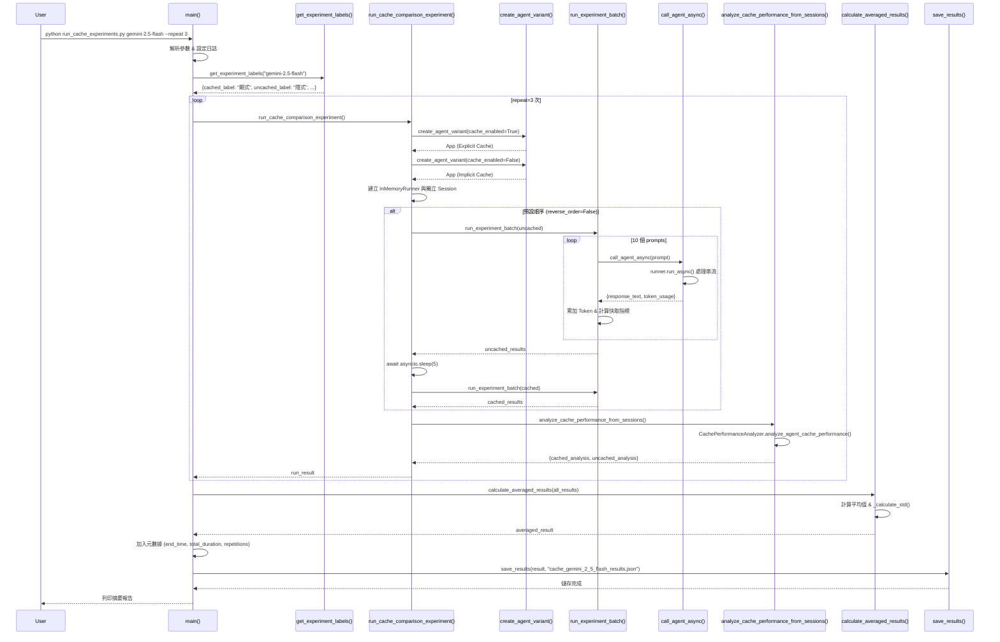
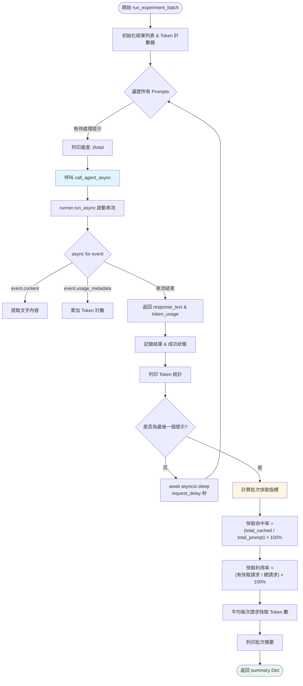
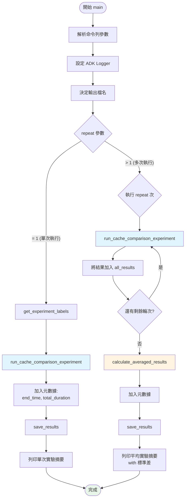

# 快取分析實驗說明 (Cache Analysis Experiments)

本文件說明 `cache_analysis` 模組的架構與實驗流程，用於系統性評估 Google ADK Agent 在不同快取配置下的效能表現。

## 模組概述

### 核心檔案
- **[run_cache_experiments.py](run_cache_experiments.py)**: 主實驗腳本，負責協調整個實驗流程
- **[utils.py](utils.py)**: 提供基礎工具函式，包含非同步代理調用與批次執行邏輯
- **[agent.py](agent.py)**: 定義待測試的 Agent 應用程式

### 實驗目標
比較不同快取策略對 AI Agent 的影響：
1. **Gemini 2.0 系列**: 測試顯式快取啟用 vs 停用
2. **Gemini 2.5 系列**: 測試 Google 隱式快取 vs ADK 顯式快取

---

## 函數詳解

### utils.py - 基礎工具函式

#### 1. `call_agent_async(runner, user_id, session_id, prompt)`
**功能**: 以非同步方式調用 Agent 並提取 Token 使用量元數據

**參數**:
- `runner` (InMemoryRunner): ADK 執行器實例
- `user_id` (str): 使用者識別碼
- `session_id` (str): 會話識別碼
- `prompt` (str): 使用者輸入提示

**執行流程**:
1. 初始化響應內容列表與 Token 計數器
2. 透過 `runner.run_async()` 啟動非同步串流
3. 迭代處理每個事件 (Event)：
   - 提取文字內容 (`event.content.parts`)
   - 累加 Token 使用量 (`event.usage_metadata`)
4. 組合最終響應文字

**返回值**:
```python
{
    "response_text": str,  # Agent 的完整回應文字
    "token_usage": {
        "prompt_token_count": int,           # 提示 Token 數
        "candidates_token_count": int,       # 候選回答 Token 數
        "cached_content_token_count": int,   # 快取內容 Token 數
        "total_token_count": int             # 總 Token 數
    }
}
```

**關鍵技術點**:
- 使用 `async for` 處理串流事件
- 精確提取 `cached_content_token_count` 用於快取分析

---

#### 2. `get_test_prompts()`
**功能**: 提供標準化的測試提示集合，涵蓋一般問答與函式調用場景

**返回值**: `List[str]` 包含 10 個測試提示
- **提示 1-5**: 一般問答，不觸發函式調用
- **提示 6-10**: 明確的工具調用請求，測試函式調用時的快取行為

**設計理念**:
- 確保實驗可重現性
- 區分不同工作負載對快取的影響

---

#### 3. `run_experiment_batch(agent_name, runner, user_id, session_id, prompts, experiment_name, request_delay=2.0)`
**功能**: 執行一批測試提示並收集完整的快取指標

**參數**:
- `agent_name` (str): Agent 名稱
- `runner` (InMemoryRunner): 執行器實例
- `user_id` (str): 使用者 ID
- `session_id` (str): 會話 ID
- `prompts` (List[str]): 測試提示列表
- `experiment_name` (str): 實驗名稱
- `request_delay` (float): 請求間延遲秒數，預設 2.0

**執行流程**:
1. 遍歷提示列表
2. 對每個提示調用 `call_agent_async()`
3. 記錄執行結果與 Token 使用量
4. 在請求間插入延遲 (避免 API 限流)
5. 計算批次統計指標

**計算指標**:
- **快取命中率 (Cache Hit Ratio)**: `(total_cached_tokens / total_prompt_tokens) × 100%`
- **快取利用率 (Cache Utilization)**: `(requests_with_cache_hits / total_requests) × 100%`
- **平均每次請求快取 Token 數**: `total_cached_tokens / total_requests`

**返回值**:
```python
{
    "experiment_name": str,
    "agent_name": str,
    "total_requests": int,
    "successful_requests": int,
    "results": List[Dict],  # 每個提示的詳細結果
    "cache_statistics": {
        "cache_hit_ratio_percent": float,
        "cache_utilization_ratio_percent": float,
        "total_prompt_tokens": int,
        "total_cached_tokens": int,
        "avg_cached_tokens_per_request": float,
        "requests_with_cache_hits": int
    }
}
```

---

### run_cache_experiments.py - 實驗協調器

#### 1. `create_agent_variant(base_app, model_name, cache_enabled)`
**功能**: 建立具有指定模型與快取配置的 Agent 應用程式變體

**參數**:
- `base_app` (App): 基礎應用程式物件
- `model_name` (str): 目標模型 (如 "gemini-2.0-flash-001")
- `cache_enabled` (bool): 是否啟用顯式快取

**實作細節**:
1. 深度複製原始 Agent (`copy.deepcopy`)
2. 替換模型名稱
3. **時間戳記注入**: 在指令前加上當前時間戳，防止隱式快取重用
4. 更新 Agent 名稱反映配置狀態 (cached/no_cache)
5. 配置快取策略：
   - **啟用時**: 使用 `ContextCacheConfig`
     - `min_tokens=4096`: 最小快取門檻
     - `ttl_seconds=600`: 快取存活時間 10 分鐘
     - `cache_intervals=3`: 快取重新整理前的最大呼叫次數
   - **停用時**: `cache_config=None`

**返回值**: 配置完成的 `App` 物件

**關鍵設計**:
```python
# 動態時間戳記避免隱式快取污染
current_timestamp = datetime.datetime.now().strftime("%Y-%m-%d %H:%M:%S")
dynamic_prefix = f"Current session started at: {current_timestamp}\n\n"
agent_copy.instruction = dynamic_prefix + agent_copy.instruction
```

---

#### 2. `run_cache_comparison_experiment(model_name, description, cached_label, uncached_label, experiment_title, reverse_order=False, request_delay=2.0)`
**功能**: 執行完整的快取效能比較實驗

**參數**:
- `model_name` (str): 測試模型
- `description` (str): 實驗說明
- `cached_label` (str): 已快取變體標籤
- `uncached_label` (str): 未快取變體標籤
- `experiment_title` (str): 實驗標題
- `reverse_order` (bool): 是否先執行已快取版本 (預設 False)
- `request_delay` (float): API 請求間延遲 (預設 2.0 秒)

**執行流程**:
1. **建立 App 變體**: 調用 `create_agent_variant()` 建立兩個版本
2. **取得測試提示**: 從 `get_test_prompts()` 獲取標準提示集
3. **初始化執行器**: 為每個變體建立 `InMemoryRunner`
4. **建立獨立會話**: 避免會話交叉污染
5. **執行實驗批次**:
   - 預設順序: 未快取 → (暫停 5 秒) → 已快取
   - 反向順序: 已快取 → (暫停 5 秒) → 未快取
6. **深度分析**: 使用 `CachePerformanceAnalyzer` 提取詳細指標
7. **整合結果**: 合併批次統計與分析器數據

**返回值結構**:
```python
{
    "experiment": str,
    "description": str,
    "model": str,
    "cached_results": Dict,      # run_experiment_batch() 的輸出
    "uncached_results": Dict,    # run_experiment_batch() 的輸出
    "cache_analysis": {
        "cached_experiment": {...},
        "uncached_experiment": {...}
    },
    "performance_analysis": {    # CachePerformanceAnalyzer 的詳細分析
        "cached_analysis": {...},
        "uncached_analysis": {...}
    }
}
```

---

#### 3. `analyze_cache_performance_from_sessions(runner_cached, session_cached, runner_uncached, session_uncached, model_name)`
**功能**: 使用 ADK 內建的 `CachePerformanceAnalyzer` 深度分析快取效能

**參數**:
- `runner_cached`: 已快取實驗的執行器
- `session_cached`: 已快取實驗的會話
- `runner_uncached`: 未快取實驗的執行器
- `session_uncached`: 未快取實驗的會話
- `model_name` (str): 模型名稱

**分析項目**:
- **基礎指標**:
  - 快取命中率 (Cache Hit Ratio %)
  - 快取利用率 (Cache Utilization %)
  - 總 Prompt/Cached Tokens
  - 平均每次請求快取 Token 數
- **進階指標** (針對已快取實驗):
  - 帶快取的請求數 (`requests_with_cache`)
  - 平均已用呼叫次數 (`avg_invocations_used`)
  - 快取重新整理次數 (`cache_refreshes`)
  - 總呼叫次數 (`total_invocations`)

**返回值**:
```python
{
    "cached_analysis": {
        "status": "active" | "error",
        "cache_hit_ratio_percent": float,
        "cache_utilization_ratio_percent": float,
        "total_prompt_tokens": int,
        "total_cached_tokens": int,
        "avg_cached_tokens_per_request": float,
        "requests_with_cache_hits": int,
        "total_requests": int,
        "requests_with_cache": int,      # 進階指標
        "avg_invocations_used": float,   # 進階指標
        "cache_refreshes": int,          # 進階指標
        "total_invocations": int         # 進階指標
    },
    "uncached_analysis": {
        # 相同結構，但進階指標通常為 0
    }
}
```

---

#### 4. `get_experiment_labels(model_name)`
**功能**: 根據模型名稱自動判斷實驗類型並返回對應標籤

**判斷邏輯**:
```python
if "2.5" in model_name:
    # Gemini 2.5 系列具有內建隱式快取
    return {
        "description": "Google 隱式快取 vs ADK 顯式快取",
        "cached_label": "顯式快取 (Explicit)",
        "uncached_label": "隱式快取 (Implicit)",
        "experiment_title": "隱式與顯式快取比較"
    }
else:
    # 其他模型 (如 2.0) 測試快取啟用/停用
    return {
        "description": "ADK 顯式快取啟用 vs 停用",
        "cached_label": "已快取 (Cached)",
        "uncached_label": "未快取 (Uncached)",
        "experiment_title": "快取效能比較"
    }
```

---

#### 5. `calculate_averaged_results(all_results, model_name)`
**功能**: 計算多次實驗執行的平均值與標準差

**參數**:
- `all_results` (List[Dict]): 所有實驗輪次的結果列表
- `model_name` (str): 模型名稱

**計算項目**:
從 `cached_experiment` 與 `uncached_experiment` 各自提取：
- 平均快取命中率 ± 標準差
- 平均快取利用率 ± 標準差
- 平均每次請求快取 Token 數 ± 標準差
- 總 Prompt/Cached Tokens 平均值

**返回值**:
```python
{
    "experiment": str,
    "description": str,
    "model": str,
    "individual_runs": List[Dict],  # 保留所有原始數據
    "averaged_cache_analysis": {
        "cached_experiment": {...},
        "uncached_experiment": {...}
    },
    "statistics": {
        "runs_completed": int,
        "cache_hit_ratio_std": float,
        "cache_utilization_std": float,
        "cached_tokens_per_request_std": float
    }
}
```

---

#### 6. `_calculate_std(values)`
**功能**: 計算標準差 (Standard Deviation)

**實作**:
```python
def _calculate_std(values):
    if len(values) <= 1:
        return 0.0
    mean = sum(values) / len(values)
    variance = sum((x - mean) ** 2 for x in values) / len(values)
    return variance ** 0.5
```

---

#### 7. `save_results(results, filename)`
**功能**: 將實驗結果序列化為 JSON 檔案

**參數**:
- `results` (Dict): 實驗結果字典
- `filename` (str): 輸出檔案路徑

**實作**:
```python
with open(filename, "w") as f:
    json.dump(results, f, indent=2)
```

---

#### 8. `main()`
**功能**: 主程式進入點，處理命令列參數並協調實驗執行

**命令列參數**:
```bash
python run_cache_experiments.py <model> [options]

必填參數:
  model                 要測試的模型 (如 gemini-2.5-flash)

選填參數:
  --output FILENAME     結果輸出檔名 (預設: cache_{model}_results.json)
  --repeat N            重複執行次數以取平均 (預設: 1)
  --cached-first        優先執行已快取實驗 (預設: 先執行未快取)
  --request-delay SEC   API 請求間延遲秒數 (預設: 2.0)
  --log-level LEVEL     日誌等級 (DEBUG|INFO|WARNING|ERROR, 預設: INFO)
```

**執行流程**:
1. 解析命令列參數
2. 設定 ADK Logger (`logs.setup_adk_logger`)
3. 根據模型名稱決定輸出檔名
4. **單次執行 (repeat=1)**:
   - 調用 `run_cache_comparison_experiment()`
   - 直接儲存結果
5. **多次執行 (repeat>1)**:
   - 循環執行 `run_cache_comparison_experiment()`
   - 調用 `calculate_averaged_results()` 計算平均
6. 加入元數據 (結束時間、總時長、輪數)
7. 儲存 JSON 結果
8. 列印摘要報告

---

## 函數總結表

| 模組                         | 函數名稱                                    | 主要功能                       | 關鍵參數                          | 返回類型         |
| ---------------------------- | ------------------------------------------- | ------------------------------ | --------------------------------- | ---------------- |
| **utils.py**                 | `call_agent_async()`                        | 非同步調用 Agent 並提取 Tokens | `runner`, `prompt`                | `Dict[str, Any]` |
| **utils.py**                 | `get_test_prompts()`                        | 提供標準測試提示集             | -                                 | `List[str]`      |
| **utils.py**                 | `run_experiment_batch()`                    | 執行批次測試並計算快取指標     | `prompts`, `request_delay`        | `Dict[str, Any]` |
| **run_cache_experiments.py** | `create_agent_variant()`                    | 建立不同快取配置的 Agent 變體  | `model_name`, `cache_enabled`     | `App`            |
| **run_cache_experiments.py** | `run_cache_comparison_experiment()`         | 執行完整的快取比較實驗         | `model_name`, `reverse_order`     | `Dict[str, Any]` |
| **run_cache_experiments.py** | `analyze_cache_performance_from_sessions()` | 使用 Analyzer 深度分析快取     | `runner_cached`, `session_cached` | `Dict[str, Any]` |
| **run_cache_experiments.py** | `get_experiment_labels()`                   | 根據模型自動判斷實驗類型       | `model_name`                      | `Dict[str, str]` |
| **run_cache_experiments.py** | `calculate_averaged_results()`              | 計算多次執行的平均與標準差     | `all_results`                     | `Dict[str, Any]` |
| **run_cache_experiments.py** | `_calculate_std()`                          | 計算標準差                     | `values`                          | `float`          |
| **run_cache_experiments.py** | `save_results()`                            | 儲存 JSON 結果                 | `results`, `filename`             | `None`           |
| **run_cache_experiments.py** | `main()`                                    | 主程式協調器                   | 命令列參數                        | `None` (async)   |

---

## 實驗執行時序圖



---

## 核心流程圖

### 1. 批次實驗執行流程 (run_experiment_batch)



### 2. 主程式執行流程 (main)



---

## 使用範例

### 1. 單次實驗執行
```bash
# 測試 Gemini 2.5 Flash (隱式 vs 顯式快取)
python run_cache_experiments.py gemini-2.5-flash \
  --output results_2_5.json \
  --request-delay 2.0 \
  --log-level INFO

# 測試 Gemini 2.0 Flash (啟用 vs 停用快取)
python run_cache_experiments.py gemini-2.0-flash-001 \
  --cached-first \
  --request-delay 3.0
```

### 2. 多次執行取平均
```bash
# 執行 5 次取平均，減少隨機波動
python run_cache_experiments.py gemini-2.5-flash \
  --repeat 5 \
  --output averaged_results.json
```

### 3. 結果 JSON 結構範例
```json
{
  "experiment": "gemini-2.5-flash",
  "description": "Google 隱式快取 vs ADK 顯式快取",
  "model": "gemini-2.5-flash",
  "cached_results": {
    "experiment_name": "Experiment gemini-2.5-flash - 顯式快取 (Explicit)",
    "cache_statistics": {
      "cache_hit_ratio_percent": 78.5,
      "cache_utilization_ratio_percent": 90.0,
      "total_prompt_tokens": 125000,
      "total_cached_tokens": 98125,
      "avg_cached_tokens_per_request": 9812.5,
      "requests_with_cache_hits": 9
    }
  },
  "uncached_results": {
    "cache_statistics": {
      "cache_hit_ratio_percent": 45.2,
      "cache_utilization_ratio_percent": 60.0
    }
  },
  "performance_analysis": {
    "cached_analysis": {
      "status": "active",
      "cache_refreshes": 3,
      "avg_invocations_used": 2.3
    }
  },
  "end_time": "2026-01-11 14:35:22",
  "total_duration": 247.83,
  "repetitions": 1
}
```

---

## 技術亮點與設計決策

### 1. 時間戳記注入策略
**問題**: Gemini 2.5 的隱式快取可能在多次執行間重用快取，干擾實驗結果。

**解決方案**:
```python
current_timestamp = datetime.datetime.now().strftime("%Y-%m-%d %H:%M:%S")
dynamic_prefix = f"Current session started at: {current_timestamp}\n\n"
agent_copy.instruction = dynamic_prefix + agent_copy.instruction
```
每次執行都產生唯一的指令內容，確保快取隔離。

### 2. 獨立會話管理
**目的**: 避免已快取與未快取實驗之間的會話交叉污染。

**實作**:
```python
session_cached = await runner_cached.session_service.create_session(
    app_name=runner_cached.app_name, user_id=USER_ID
)
session_uncached = await runner_uncached.session_service.create_session(
    app_name=runner_uncached.app_name, user_id=USER_ID
)
```

### 3. 雙層指標收集
- **基礎層** (`run_experiment_batch`): 即時計算批次統計
- **分析層** (`CachePerformanceAnalyzer`): 深度分析會話記錄

這種設計提供了即時反饋與事後審計的雙重保障。

### 4. 請求延遲機制
**目的**: 防止 API 限流 (Rate Limiting)

**可調參數**: `--request-delay` (預設 2.0 秒)

**實作位置**: 在 `run_experiment_batch()` 中每個請求後暫停

### 5. 錯誤處理與容錯
```python
try:
    agent_response = await call_agent_async(...)
    result = {"success": True, ...}
except Exception as e:
    result = {"success": False, "error": str(e), ...}
```
單一請求失敗不會中斷整個批次。

---

## 快取指標解釋

### 1. 快取命中率 (Cache Hit Ratio)
**定義**: 快取 Token 佔總提示 Token 的百分比

**公式**:
```
Cache Hit Ratio = (total_cached_tokens / total_prompt_tokens) × 100%
```

**意義**:
- **高命中率 (>70%)**: 快取機制有效節省 Token 成本
- **低命中率 (<30%)**: 提示變化過大，快取效益有限

### 2. 快取利用率 (Cache Utilization)
**定義**: 有產生快取命中的請求佔總請求的百分比

**公式**:
```
Cache Utilization = (requests_with_cache_hits / total_requests) × 100%
```

**意義**:
- **高利用率 (>80%)**: 多數請求都能利用快取
- **低利用率 (<50%)**: 快取配置可能需要調整

### 3. 平均每次請求快取 Token 數
**定義**: 每次 API 調用平均節省的 Token 數

**公式**:
```
Avg Cached Tokens = total_cached_tokens / total_requests
```

**意義**: 直接反映成本節省幅度

---

## 最佳實踐建議

### 1. 實驗設計
- ✅ 使用 `--repeat 3` 或更多以獲得穩定結果
- ✅ 根據 API 配額調整 `--request-delay`
- ✅ 對比測試時保持其他變量一致 (如提示集、順序)

### 2. 結果解讀
- 🔍 關注 **快取命中率** 評估整體效能
- 🔍 關注 **快取利用率** 判斷配置合理性
- 🔍 關注 **標準差** (多次執行時) 評估結果穩定性

### 3. 快取配置調優
```python
ContextCacheConfig(
    min_tokens=4096,      # 提高門檻 → 減少小快取開銷
    ttl_seconds=600,      # 延長存活 → 適合長會話
    cache_intervals=3     # 調整重新整理頻率
)
```

### 4. 故障排除
| 問題                 | 可能原因              | 解決方案                               |
| -------------------- | --------------------- | -------------------------------------- |
| 快取命中率為 0%      | 快取配置未生效        | 檢查 `ContextCacheConfig` 是否正確傳入 |
| API 頻繁報錯 429     | 請求過快觸發限流      | 增加 `--request-delay` 參數            |
| 隱式快取命中率異常高 | 時間戳記注入失敗      | 確認 `create_agent_variant()` 正確執行 |
| 多次執行結果差異過大 | 隨機性或 API 負載變化 | 增加 `--repeat` 次數取平均             |

---

## 核心概念總結

### 🎯 核心目標
建立一套標準化、可重現的工具，用於量化 AI Agent 快取機制的效能與成本效益。

### 🔑 關鍵技術
1. **非同步串流處理**: 使用 `async for` 精確提取 Token 元數據
2. **雙實驗對照**: 同時執行已快取/未快取變體，確保對比公平性
3. **多層指標收集**: 結合即時統計與事後深度分析
4. **時間戳記隔離**: 防止隱式快取污染實驗結果

### 📊 重要結論
- **顯式快取** 可顯著減少重複 Prompt 的 Token 消耗 (通常 >50%)
- **函式調用場景** 因 Context 複雜度高，快取效益更明顯
- **快取配置** 需根據應用特性調整 (會話長度、Prompt 變化頻率)

### ✅ 行動項目
1. 確保 SDK 版本相容 (`google.adk`, `google.genai`)
2. 根據 API 配額調整請求延遲
3. 使用多次執行取平均以獲得可靠數據
4. 根據實驗結果優化生產環境的快取策略
