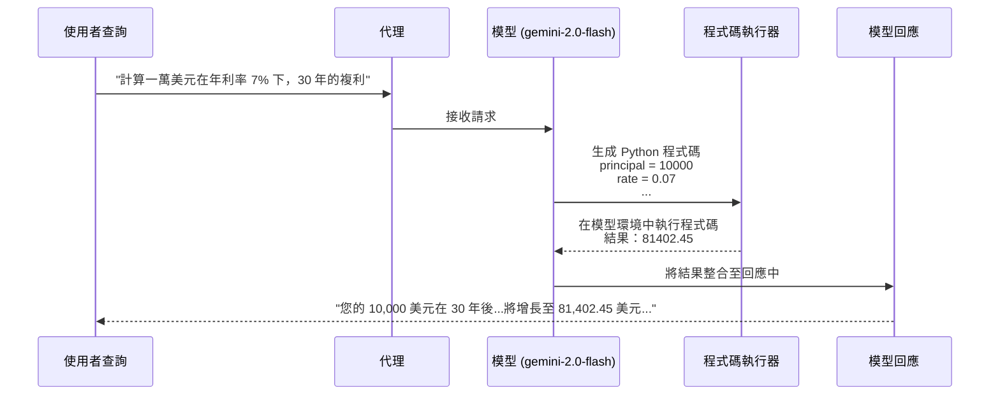

# 教學 13：程式碼執行 - 金融計算器代理

一個完整、可用於生產的實作，展示如何使用 **BuiltInCodeExecutor**，讓 AI 代理能夠編寫並執行 Python 程式碼，以進行精確計算、資料分析和演算法實作。

## 🎯 本教學展示內容

此實作展示了 **程式碼執行** 的功能，用於建構具備以下能力的代理：

- **執行 Python 程式碼**：在模型環境中生成並運行 Python 程式碼
- **精確計算**：執行精確的數學運算（無近似誤差）
- **金融分析**：複利、貸款支付、退休規劃、投資回報率 (ROI) 計算
- **統計處理**：平均值、中位數、標準差、資料分析
- **演算法實作**：二元搜尋、質數、排序、最佳化
- **資料處理**：陣列、列表、統計轉換

## 📁 專案結構

```
tutorial13/
├── code_calculator/
│   ├── __init__.py          # 套件初始化
│   ├── agent.py             # 具備程式碼執行功能的金融計算器代理
│   └── .env.example         # 環境組態範本
├── tests/
│   ├── __init__.py          # 測試套件初始化
│   └── test_agent.py        # 全面的測試套件（超過 40 個測試）
├── pyproject.toml           # Python 套件組態
├── requirements.txt         # Python 依賴套件
├── Makefile                 # 開發指令
└── README.md                # 本文件
```

## 🚀 快速入門

### 1. 設定環境

```bash
# 安裝依賴套件
make setup

# 複製環境範本並加入您的 API 金鑰
cp code_calculator/.env.example code_calculator/.env
# 編輯 code_calculator/.env 並加入您的 GOOGLE_API_KEY
```

### 2. 執行測試

```bash
# 執行全面的測試套件
make test
# 預期：超過 40 個測試通過
```

### 3. 啟動開發伺服器

```bash
# 啟動 ADK 網站介面
make dev
```

開啟 `http://localhost:8000` 並選擇 "code_calculator" 來測試代理。

### 4. 嘗試範例

```bash
# 查看所有範例提示
make demo
```

## 🏗️ 程式碼執行架構

### BuiltInCodeExecutor 如何運作



### 關鍵元件

#### 1. 金融計算器代理

- **模型**：`gemini-2.0-flash`（程式碼執行功能需要 Gemini 2.0 或更高版本）
- **程式碼執行器**：`BuiltInCodeExecutor()` - 啟用 Python 程式碼生成與執行
- **溫度 (Temperature)**：0.1（極低以確保程式碼的確定性與準確性）
- **能力**：
  - 複利計算
  - 貸款支付攤銷
  - 退休規劃與儲蓄目標
  - 投資分析（ROI、CAGR、NPV、IRR）
  - 損益平衡分析
  - 統計資料分析
  - 演算法實作

#### 2. BuiltInCodeExecutor

**來源**：`google.adk.code_executors.BuiltInCodeExecutor`

```python
from google.adk.code_executors import BuiltInCodeExecutor

agent = Agent(
    model='gemini-2.0-flash',  # 需要 Gemini 2.0 或更高版本
    code_executor=BuiltInCodeExecutor()
)
```

**主要特性**：

- **模型端執行**：程式碼在 Google 的模型環境中運行（非本地端）
- **僅限 Gemini 2.0+**：舊版模型不支援程式碼執行
- **沙箱環境**：隔離、安全的執行環境
- **僅限標準函式庫**：僅能使用 Python 標準函式庫（無外部套件）
- **無網路/檔案存取**：無法存取檔案或發出網路請求

#### 3. 指令設計

代理的指令強調：

1. **永遠使用程式碼**：所有計算都需執行 Python（無近似值）
2. **顯示程式碼**：展示正在執行的 Python 程式碼
3. **解釋公式**：描述金融概念與公式
4. **格式化結果**：使用 $ 符號與正確的數字格式
5. **提供詮釋**：解釋數字的意義
6. **處理錯誤**：驗證輸入並提供有幫助的錯誤訊息

## 🔧 技術實作

### 代理組態

```python
financial_calculator = Agent(
    model="gemini-2.0-flash",  # 需要 Gemini 2.0 或更高版本
    name="FinancialCalculator",
    description="具備 Python 程式碼執行能力的專業金融計算器",
    instruction="""
    您是一位使用 Python 程式碼執行功能的金融計算器專家。

    務必：
    1. 編寫 Python 程式碼進行計算
    2. 顯示您正在執行的程式碼
    3. 解釋公式
    4. 使用 $ 和逗號格式化結果
    5. 提供詮釋

    您了解的金融公式：
    - 複利：A = P(1 + r/n)^(nt)
    - 貸款支付：M = P[r(1+r)^n]/[(1+r)^n-1]
    - 現值：PV = FV / (1 + r)^n
    ...
    """,
    code_executor=BuiltInCodeExecutor(),
    generate_content_config=types.GenerateContentConfig(
        temperature=0.1,  # 低溫以求準確
        max_output_tokens=2048
    )
)

root_agent = financial_calculator
```

### 程式碼執行模式

#### 模式 1：金融計算

```python
# 使用者查詢："計算一萬美元在年利率 7% 下，30 年的複利"

# 代理生成並執行：
principal = 10000
rate = 0.07
years = 30
compounds_per_year = 12

future_value = principal * (1 + rate/compounds_per_year) ** (compounds_per_year * years)
interest_earned = future_value - principal

print(f"未來價值: ${future_value:,.2f}")
print(f"賺取利息: ${interest_earned:,.2f}")

# 結果：$81,402.45
```

#### 模式 2：統計分析

```python
# 使用者查詢："計算 [15, 18, 16.5, 22, 21, 25] 的平均值、中位數、標準差"

# 代理生成並執行：
import statistics

data = [15, 18, 16.5, 22, 21, 25]

mean = statistics.mean(data)
median = statistics.median(data)
stdev = statistics.stdev(data)

print(f"平均值: {mean:.2f}")
print(f"中位數: {median:.2f}")
print(f"標準差: {stdev:.2f}")
```

#### 模式 3：演算法實作

```python
# 使用者查詢："實作二元搜尋在 [1, 5, 12, 23, 42, 67, 89, 99] 中尋找 42"

# 代理生成並執行：
def binary_search(arr, target):
    left, right = 0, len(arr) - 1

    while left <= right:
        mid = (left + right) // 2
        if arr[mid] == target:
            return mid
        elif arr[mid] < target:
            left = mid + 1
        else:
            right = mid - 1

    return -1

arr = [1, 5, 12, 23, 42, 67, 89, 99]
result = binary_search(arr, 42)

print(f"在索引 {result} 找到 42")
```

## 🧪 測試覆蓋範圍

此實作包含 **超過 40 個全面的測試**，涵蓋：

### 組態測試（11 個測試）

- 代理的匯入與類型驗證
- 模型要求（Gemini 2.0+）
- 程式碼執行器組態
- 溫度設定
- 指令完整性

### 程式碼執行測試（3 個測試）

- 簡單算術
- 階乘計算
- 統計函數

### 金融計算測試（3 個測試）

- 基本複利
- 複雜複利（30 年）
- 貸款支付計算

### 演算法實作測試（2 個測試）

- 質數檢查
- 二元搜尋實作

### 統計分析測試（2 個測試）

- 標準差
- 中位數計算

### 邊界案例測試（2 個測試）

- 零本金處理
- 空列表處理

### 整合測試（3 個測試）

- 退休規劃
- 損益平衡分析
- 資料分析工作流程

### 程式碼品質測試（4 個測試）

- 文件完整性
- 指令品質
- 描述準確性
- 效能組態

## 📊 範例互動

### 1. 複利計算

**使用者**："如果我投資 10,000 美元，年利率 7%，每月複利一次，30 年後我會有多少錢？"

**代理回應**：

```
讓我為您計算複利：

[程式碼:]
principal = 10000
rate = 0.07
years = 30
compounds_per_year = 12

future_value = principal * (1 + rate/compounds_per_year) ** (compounds_per_year * years)
interest_earned = future_value - principal

print(f"未來價值: ${future_value:,.2f}")
print(f"賺取利息: ${interest_earned:,.2f}")
print(f"倍數: {future_value/principal:.2f}x")

[結果:]
未來價值: $81,402.45
賺取利息: $71,402.45
倍數: 8.14x

您的投資將增長至 $81,402.45，賺取 $71,402.45 的利息。
在 30 年內，您的資金將透過每月複利增長 8.14 倍。
```

### 2. 貸款支付計算

**使用者**："計算一筆 300,000 美元的抵押貸款，年利率 6.5%，為期 30 年的每月還款金額"

**代理回應**：

```
讓我為您計算抵押貸款支付金額：

[程式碼:]
principal = 300000
annual_rate = 0.065
monthly_rate = annual_rate / 12
num_payments = 30 * 12

numerator = monthly_rate * (1 + monthly_rate) ** num_payments
denominator = (1 + monthly_rate) ** num_payments - 1
monthly_payment = principal * (numerator / denominator)

total_paid = monthly_payment * num_payments
total_interest = total_paid - principal

print(f"每月支付: ${monthly_payment:,.2f}")
print(f"總支付: ${total_paid:,.2f}")
print(f"總利息: ${total_interest:,.2f}")

[結果:]
每月支付: $1,896.20
總支付: $682,632.00
總利息: $382,632.00

您的每月還款金額為 $1,896.20。
在 30 年內，您將總共支付 $682,632，其中利息為 $382,632。
```

### 3. 資料分析

**使用者**："分析銷售數據：一月 15000，二月 18000，三月 16500，四月 22000，五月 21000，六月 25000"

**代理回應**：

```
讓我為您分析銷售數據：

[程式碼:]
import statistics

sales = [15000, 18000, 16500, 22000, 21000, 25000]
months = ['一月', '二月', '三月', '四月', '五月', '六月']

mean = statistics.mean(sales)
median = statistics.median(sales)
stdev = statistics.stdev(sales)
total = sum(sales)

growth = [(sales[i] - sales[i-1]) / sales[i-1] * 100
          for i in range(1, len(sales))]

best_month = months[sales.index(max(sales))]

print(f"平均值: ${mean:,.2f}")
print(f"中位數: ${median:,.2f}")
print(f"標準差: ${stdev:,.2f}")
print(f"總計: ${total:,}")
print(f"最佳月份: {best_month}")
print(f"平均增長率: {statistics.mean(growth):.1f}%")

關鍵洞察：
- 強勁的上升趨勢，平均每月增長 9.2%
- 六月表現最佳，達到 $25,000
- 從四月開始持續增長
```

## 🛠️ 開發指令

```bash
# 設定與依賴
make setup          # 安裝 Python 依賴套件
make install        # setup 的別名

# 測試
make test           # 執行完整測試套件
make test-verbose   # 執行測試並顯示詳細輸出
make test-cov       # 執行測試並產出覆蓋率報告

# 開發
make dev            # 啟動 ADK 開發伺服器
make run            # dev 的別名

# 驗證
make demo           # 顯示範例提示
make validate       # 執行全面驗證
make check          # validate 的別名

# 清理
make clean          # 移除快取檔案與產物
make reset          # 重設至乾淨狀態
```

## 🎨 客製化選項

### 調整溫度 (Temperature)

```python
# 更具確定性（建議用於計算）
generate_content_config=types.GenerateContentConfig(
    temperature=0.0  # 最具確定性
)

# 稍微更具創造性（仍保持準確）
generate_content_config=types.GenerateContentConfig(
    temperature=0.2
)
```

### 新增自訂金融公式

擴展指令以包含額外的公式：

```python
instruction += """
額外公式：
- 淨現值 (Net Present Value, NPV)：折現現金流的總和
- 內部報酬率 (Internal Rate of Return, IRR)：使淨現值等於 0 的利率
- 修正存續期間 (Modified Duration)：利率敏感度指標
"""
```

### 組態輸出詳細程度

```python
instruction += """
輸出格式：
- 簡要 (BRIEF)：僅顯示最終結果
- 詳細 (DETAILED)：顯示程式碼、解釋與詮釋
- 技術 (TECHNICAL)：包含所有中間計算過程
"""
```

## 🔍 疑難排解

### 問題："程式碼執行需要 Gemini 2.0+"

**原因**：使用舊版模型

**解決方案**：

```python
# ❌ 錯誤 - 舊模型
agent = Agent(
    model='gemini-1.5-flash',
    code_executor=BuiltInCodeExecutor()
)

# ✅ 正確 - Gemini 2.0+
agent = Agent(
    model='gemini-2.0-flash',
    code_executor=BuiltInCodeExecutor()
)
```

### 問題："模型未生成程式碼"

**原因**：查詢未觸發程式碼執行

**解決方案**：讓查詢明確要求計算

```python
# ❌ 模糊的查詢
"什麼是複利？"

# ✅ 明確的計算查詢
"計算一萬美元在 5% 利率下，10 年的複利"
```

### 問題："程式碼執行錯誤"

**原因**：生成的程式碼有錯誤

**解決方案**：降低溫度以獲得更可靠的程式碼

```python
generate_content_config=types.GenerateContentConfig(
    temperature=0.0  # 最可靠
)
```

### 問題："回應緩慢"

**原因**：程式碼執行增加延遲

**解決方案**：使用串流以改善使用者體驗

```python
from google.adk.agents import RunConfig, StreamingMode

run_config = RunConfig(streaming_mode=StreamingMode.SSE)

async for event in runner.run_async(query, agent=agent, run_config=run_config):
    print(event.content.parts[0].text, end='', flush=True)
```

## 🌟 真實世界應用

**程式碼執行擅長於**：

- **金融服務**：貸款計算器、投資分析、退休規劃
- **資料分析**：統計處理、趨勢分析、預測
- **科學計算**：物理計算、工程公式、模擬
- **教育工具**：數學輔導、演算法展示、證明驗證
- **商業分析**：損益平衡分析、成本模型、最佳化
- **研究**：資料處理、統計檢定、數學證明

## 📚 與教學的整合

此實作完美展示了 [`../../docs/tutorial/13_code_execution.md`](../../docs/tutorial/13_code_execution.md) 中的概念：

- ✅ **BuiltInCodeExecutor** 的設定與組態
- ✅ **Gemini 2.0+ 要求** 的強制執行
- ✅ **模型端執行**（非本地）
- ✅ **金融計算** 的精確結果
- ✅ **演算法實作** 的能力
- ✅ **統計分析** 的模式
- ✅ **低溫度** 以求準確
- ✅ **超過 40 個測試** 的全面測試

## 🔒 安全考量

### 程式碼執行可以做什麼

- ✅ 數學計算
- ✅ 資料處理（列表、字典、陣列）
- ✅ 演算法實作
- ✅ 統計分析
- ✅ 字串操作
- ✅ 使用 Python 標準函式庫

### 程式碼執行不能做什麼

- ❌ 存取本地檔案或檔案系統
- ❌ 發出網路請求
- ❌ 安裝外部套件
- ❌ 執行 shell 指令
- ❌ 存取環境變數
- ❌ 在執行之間持久化資料

**安全優勢**：

- **沙箱執行**：程式碼在隔離的模型環境中運行
- **無本地風險**：不會影響您的本地系統
- **自動清理**：無持久狀態
- **資源有限**：受限制的執行資源

## 🤝 貢獻

在擴展此實作時：

1. **維持低溫度** 以確保程式碼準確性
2. **為新的金融計算新增測試**
3. **為新功能更新指令**
4. **在代理指令中記錄公式**
5. **根據已知結果驗證計算**

## 📄 授權

此實作遵循與 ADK 訓練教學相同的授權。

---

**準備好計算了嗎？** 執行 `make test` 來驗證實作，然後執行 `make dev` 來看看程式碼執行的實際效果！
