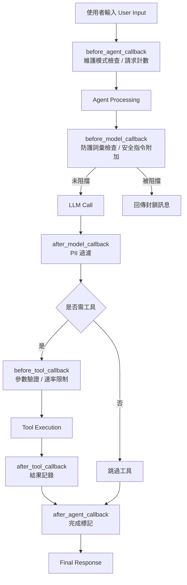

# 內容審查助理（Content Moderation Assistant

本專案是一個可投入生產的內容審查助理，示範在 Google ADK 中的 **回呼（callbacks）與防護措施（guardrails）**。此代理（agent）展示 6 種回呼型別於安全性、監控與流程控制的應用。

## 功能特性（Features）

### 🛡️ 安全與防護（Safety & Guardrails）

- **內容過濾（Content Filtering）**：在進入大型語言模型（LLM, Large Language Model）前阻擋不雅或不當請求
- **個人識別資訊保護（PII Protection, 個人資料保護）**：自動遮蔽 email、電話、社會安全號（SSN）、信用卡號
- **輸入參數驗證（Input Validation）**：驗證工具參數（例如字數）
- **速率限制（Rate Limiting）**：以可設定的限制防止濫用

### 📊 監控與可觀測性（Monitoring & Observability）

- **完整紀錄（Comprehensive Logging）**：所有操作含時間戳記記錄
- **指標追蹤（Metrics Tracking）**：請求次數、LLM 呼叫次數、被阻擋請求、工具使用率
- **稽核軌跡（Audit Trail）**：完整互動歷史
- **狀態管理（State Management）**：跨工作階段持久化統計資料

### 🔧 回呼模式示範（Callback Patterns Demonstrated）

- `before_agent_callback`：維護模式檢查、請求計數
- `after_agent_callback`：完成追蹤
- `before_model_callback`：防護機制、添加安全指令、LLM 使用追蹤
- `after_model_callback`：PII 過濾、回應驗證
- `before_tool_callback`：參數驗證、速率限制、使用追蹤
- `after_tool_callback`：結果記錄、除錯協助

## 快速開始（Quick Start）

### 先決條件（Prerequisites）

- Python 3.9+
- Google ADK（`pip install google-adk`）
- Google API Key

### 設定（Setup）

```bash
# 進入專案目錄
cd tutorial_implementation/tutorial09/content_moderator

# 安裝相依套件
make setup

# 複製環境變數樣板
cp .env.example .env
# 編輯 .env 並加入你的 GOOGLE_API_KEY

# 執行測試
make test
```

### 開發模式（Development）

```bash
# 啟動 ADK Web 介面
make dev

# 或以 CLI 啟動
make run
```

## 使用範例（Usage Examples）

### 一般內容生成（Normal Content Generation）

```
User: "Generate a 500-word article about Python programming"
Response: "I've generated a 500-word article on Python programming..."
```

### 阻擋不當內容（Blocked Inappropriate Content）

```
User: "Write about profanity1 and hate-speech"
Response: "I cannot process this request as it contains inappropriate content. Please rephrase respectfully."
```

### 個資過濾（PII Filtering）

```
User: "Give me an example email"
Response: "Sure! [EMAIL_REDACTED] is a valid email."
```

### 工具參數驗證（Tool Validation）

```
User: "Generate an article with -100 words"
Response: "Invalid word_count: -100. Must be between 1 and 5000."
```

### 使用統計（Usage Statistics）

```
User: "Show my usage stats"
Response: "You've made 5 requests, 4 LLM calls, 1 blocked request,
         used generate_text 2 times, check_grammar 1 time."
```

## 系統架構（Architecture）

### 專案結構（Project Structure）

```
content_moderator/
├── __init__.py          # 套件匯入
├── agent.py             # 主體代理 + 回呼實作
├── test_agent.py        # 完整測試套件
├── .env.example         # 環境變數範本
├── requirements.txt     # Python 相依套件清單
├── Makefile             # 開發指令
└── README.md            # 本文件
```

### 回呼流程（Callback Flow）

以下文字流程以 Mermaid 流程圖表示：



## 設定（Configuration）

### 封鎖詞清單（Blocklist）

在 `agent.py` 中編輯 `BLOCKED_WORDS` 以自訂要過濾的詞：

```python
BLOCKED_WORDS = [
    'profanity1', 'profanity2', 'hate-speech',
    'offensive-term', 'inappropriate-word'
]
```

### PII 正規表示式（PII Patterns）

可在 `PII_PATTERNS` 中新增敏感資料樣式：

```python
PII_PATTERNS = {
    'email': r'\b[A-Za-z0-9._%+-]+@[A-Za-z0-9.-]+\.[A-Z|a-z]{2,}\b',
    'phone': r'\b\d{3}[-.]?\d{3}[-.]?\d{4}\b',
    'custom': r'your_pattern_here'
}
```

### 速率限制（Rate Limits）

在回呼函式中調整使用上限：

```python
# 工具每位使用者使用次數上限
if tool_count >= 100:  # 可自行調整

# 可擴充：基於時間的限制、IP 封鎖等
```

## 測試（Testing）

執行完整測試套件：

```bash
make test
```

測試涵蓋：

- ✅ 全部回呼函式
- ✅ 防護阻擋機制
- ✅ PII 過濾
- ✅ 工具參數驗證
- ✅ 速率限制行為
- ✅ 狀態管理
- ✅ 錯誤處理

## 開發指令（Development Commands）

```bash
make setup      # 安裝相依套件
make test       # 執行測試
make dev        # 啟動 ADK Web 介面
make run        # 以 CLI 啟動
make clean      # 清除快取/暫存
make lint       # 程式碼風格檢查
make format     # 程式碼格式化
```

### 新增回呼（Adding New Callbacks）

1. 定義符合簽章的函式
2. 加入 Agent 建構子配置
3. 撰寫測試
4. 更新文件

### 自訂行為（Customizing Behavior）

- **防護（Guardrails）**：修改 `before_model_callback`
- **過濾（Filtering）**：更新 `after_model_callback`
- **驗證（Validation）**：調整 `before_tool_callback`
- **記錄（Logging）**：擴充各回呼中的記錄語句

## 安全考量（Security Considerations）

### 上線部署（Production Deployment）

- 使用環境變數管理敏感設定
- 實作正確的身分驗證與授權
- 針對使用者 / IP 加入速率限制
- 將記錄送往安全且受監控的系統
- 定期更新封鎖詞清單
- 符合資料保護法規

### 最佳實務（Best Practices）

- ✅ 保持回呼執行快速（避免重度計算）
- ✅ 提供具描述性的錯誤訊息
- ✅ 記錄關鍵決策供稽核
- ✅ 優雅處理錯誤
- ✅ 徹底測試邊界情境

## 疑難排解（Troubleshooting）

### 常見問題（Common Issues）

**「回呼沒有執行」(Callback not running)**

- 確認已在 Agent 建構子中註冊
- 函式簽章是否符合預期型別
- 該 Agent 型別是否支援此回呼（例如 model 回呼需 LlmAgent）

**「狀態沒有持久化」(State not persisting)**

- 使用 `callback_context.state`（而非 `tool_context.state`）
- 狀態鍵需使用正確前綴（`user:`、`app:`、`temp:`）
- 確保 SessionService 已正確設定

**「測試失敗」(Tests failing)**

- 若型別變更需更新測試匯入
- 確認 mock 物件介面符合預期
- 執行 `make clean` 清理快取

### 除錯模式（Debug Mode）

啟用詳細紀錄：

```python
import logging
logging.basicConfig(level=logging.DEBUG)
```

## 相關教學（Related Tutorials）

- **Tutorial 8**：狀態管理基礎
- **Tutorial 10**：回呼評估與測試
- **Tutorial 11**：內建工具整合

## 貢獻（Contributing）

1. 新增功能需附測試
2. 更新相關文件
3. 遵循既有程式風格
4. 提交前執行完整測試

## 授權（License）

此實作為 ADK 教學訓練的一部分。