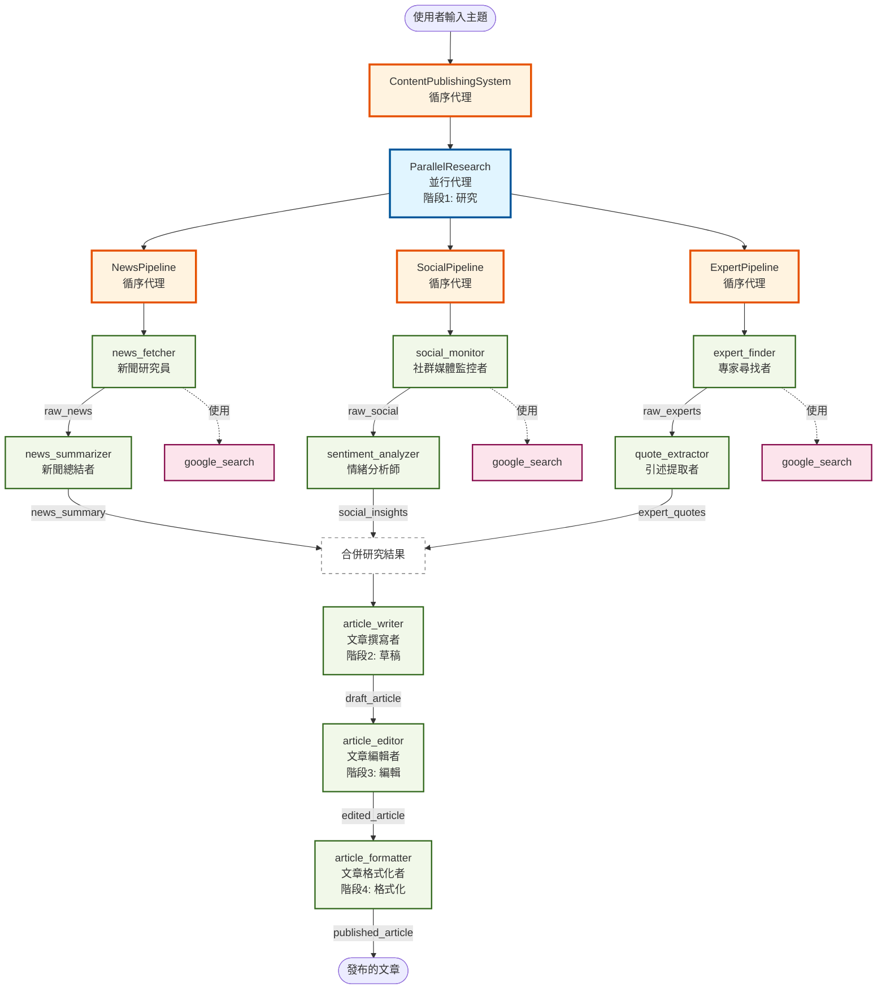
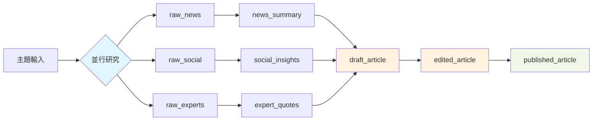

# 內容發布系統 - Agent 架構圖

## 系統概覽

這個多代理系統結合了並行研究和循序內容創作，展示了進階的代理編排模式。

## Agent 關聯圖

## 架構說明

### 🔵 階段 1: 並行研究 (ParallelResearch)

三條研究管線同時執行，每條管線內部是循序處理：

#### 📰 新聞研究管線 (NewsPipeline)

1. **news_fetcher**: 使用 Google 搜尋取得最新新聞文章
   - 輸出: `raw_news`
2. **news_summarizer**: 總結關鍵新聞要點
   - 輸出: `news_summary`

#### 📱 社群媒體研究管線 (SocialPipeline)

1. **social_monitor**: 監控社群媒體趨勢和討論
   - 輸出: `raw_social`
2. **sentiment_analyzer**: 分析社群情緒和洞察
   - 輸出: `social_insights`

#### 👨‍🏫 專家意見管線 (ExpertPipeline)

1. **expert_finder**: 尋找產業專家和意見領袖
   - 輸出: `raw_experts`
2. **quote_extractor**: 提取可引用的專家見解
   - 輸出: `expert_quotes`

### 🟠 階段 2-4: 循序內容創作

研究完成後，依序執行內容創作：

1. **article_writer** (階段 2): 整合所有研究撰寫文章草稿

   - 輸入: `news_summary`, `social_insights`, `expert_quotes`
   - 輸出: `draft_article`

2. **article_editor** (階段 3): 編輯文章提升品質

   - 輸入: `draft_article`
   - 輸出: `edited_article`

3. **article_formatter** (階段 4): 格式化文章以供發布
   - 輸入: `edited_article`
   - 輸出: `published_article`

## 資料流程

## 關鍵特性

### ⚡ 並行執行

- 3 條研究管線同時執行，大幅縮短研究時間
- 每條管線內部仍保持循序邏輯（先取得資料 → 再處理）

### 🔄 循序精煉

- 內容創作階段循序執行，確保品質層層把關
- 草稿 → 編輯 → 格式化的漸進式改進

### 🔧 工具使用

- 只有初始的研究 agent 使用 `google_search` 工具
- 後續 agent 專注於處理和精煉資料

### 📊 資料傳遞

- 使用 `output_key` 機制在 agent 之間傳遞資料
- 每個階段的輸出成為下個階段的輸入

## Agent 類型圖例

- 🔵 **藍色**: 並行代理 (ParallelAgent)
- 🟠 **橙色**: 循序代理 (SequentialAgent)
- 🟢 **綠色**: 葉節點代理 (Leaf Agent)
- 🔴 **粉色**: 外部工具 (Tools)
