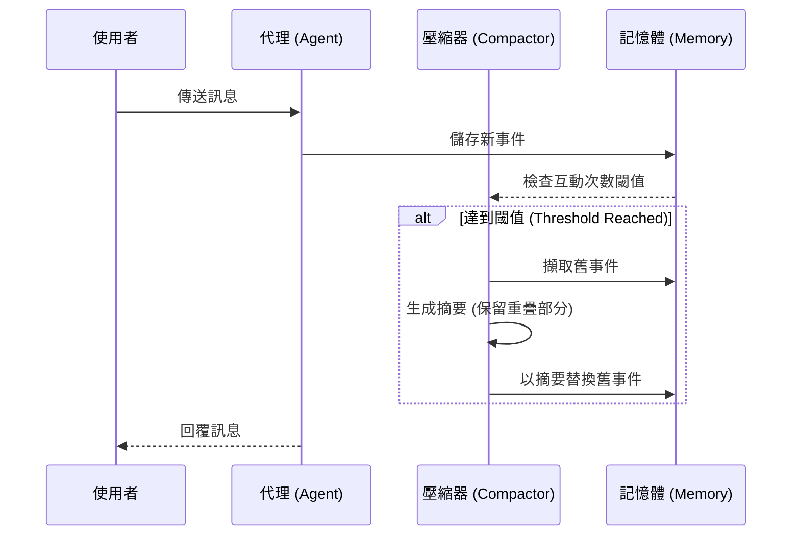

# TIL：使用 Google ADK 1.16 進行上下文壓縮 (Context Compaction)

展示 ADK 1.16 新增的 **上下文壓縮 (Context Compaction)** 功能，可自動摘要對話歷史記錄，以減少長篇代理對話中的 token 使用量。

## 快速入門

```bash
# 1. 安裝依賴
make setup

# 2. 新增您的 API 金鑰
# 編輯 context_compaction_agent/.env 並加入 GOOGLE_API_KEY

# 3. 試用代理
make dev
# 開啟 http://localhost:8000 - 選擇 'context_compaction_agent'

# 4. 執行測試
make test
```

## 包含內容

- **`context_compaction_agent/`** - 主要代理實作
  - `agent.py` - 具備文字摘要和複雜度分析工具的代理
  - `.env.example` - 環境配置範本
- **`app.py`** - 啟用 EventsCompactionConfig 的 ADK 應用程式配置
- **`tests/`** - 綜合測試套件 (單元測試)
- **`Makefile`** - 標準開發指令
- **`requirements.txt`** - 相依套件

## 檔案結構

```text
til_context_compaction_20250119/
├── context_compaction_agent/
│   ├── __init__.py        # 套件初始化
│   ├── agent.py           # 定義代理與匯出 root_agent
│   └── .env.example       # 環境範本
├── tests/
│   ├── __init__.py
│   └── test_agent.py      # 16 個綜合測試
├── app.py                 # 包含 EventsCompactionConfig 的應用程式配置
├── pyproject.toml         # 專案詮釋資料 (Metadata)
├── Makefile              # 開發指令
├── requirements.txt      # 相依套件
└── README.md             # 本檔案
```

## 上下文壓縮運作方式

上下文壓縮會自動執行以下操作：

1.  **偵測長對話** - 在 N 次互動後 (可配置)
2.  **摘要舊事件** - 使用 LLM 建立智慧摘要
3.  **維持上下文** - 保留摘要之間的重疊部分以保持連續性
4.  **減少 Tokens** - 舊事件被替換為精簡摘要



### 配置範例

```python
from google.adk.apps.compaction import EventsCompactionConfig

config = EventsCompactionConfig(
    # 每 5 次新的使用者互動進行一次壓縮
    compaction_invocation_threshold=5,
    # 保留 1 個先前的互動以作為上下文重疊
    overlap_size=1,
)

app = App(root_agent=agent, events_compaction_config=config)
```

## 關於代理

此實作包含一個具有兩個工具的代理：

### 1. `summarize_text(text: str)`

展示用於壓縮的文字摘要功能：

```python
result = summarize_text("Long text...")
# 回傳: {"status": "success", "report": "...", "summary": "..."}
```

### 2. `calculate_complexity(question: str)`

分析問題複雜度以了解對話深度：

```python
result = calculate_complexity("What is context compaction?")
# 回傳: {
#     "status": "success",
#     "complexity_level": "medium",
#     "word_count": 4
# }
```

## 測試

執行所有測試：

```bash
make test
```

或執行特定測試類別：

```bash
pytest tests/test_agent.py::TestAgentConfiguration -v
```

**測試覆蓋率：**

- ✅ 代理配置 (名稱、模型、描述、指示)
- ✅ 工具可用性與功能
- ✅ 匯入驗證
- ✅ 應用程式配置
- ✅ EventsCompactionConfig 設定

## 開發中使用

### 觀察 Events 分頁

執行 `make dev` 時，開啟 Events 分頁以查看壓縮運作情形：

1. 進行多輪對話 (5 次以上交換)
2. 觀察 `EventCompaction` 事件
3. 查看舊事件如何被摘要

### 嘗試這些提示詞 (Prompts)

```
1. "Explain context compaction in simple terms"
   (觸發複雜度分析工具)

2. "Tell me about long conversations in AI agents"
   (測試對話處理)

3. 繼續進行後續追問以觸發壓縮
```

## 關鍵參數

| `compaction_invocation_threshold` | int | 5 | 觸發壓縮的閾值 |
| `overlap_size` | int | 1 | 上下文連續性保留 |
| `compactor` | optional | Auto | 自訂摘要器 |

## 調整參數

**積極壓縮模式** (成本較低，上下文較少)：

```python
EventsCompactionConfig(
    compaction_invocation_threshold=3,  # 更頻繁地壓縮
    overlap_size=0,                     # 無重疊
)
```

**保守壓縮模式** (成本較高，上下文較多)：

```python
EventsCompactionConfig(
    compaction_invocation_threshold=10,  # 較不頻繁地壓縮
    overlap_size=3,                      # 更多重疊
)
```

## 故障排除

### 代理無法在 Web UI 載入

```bash
# 重新安裝為可編輯套件
pip install -e .
adk web
```

### 測試因匯入錯誤而失敗

```bash
# 重新安裝需求
make setup
```

### 環境檔案遺失

```bash
# 複製範本檔案
cp context_compaction_agent/.env.example context_compaction_agent/.env
# 將您的 GOOGLE_API_KEY 新增至 context_compaction_agent/.env
```

## 相關學習

- **[TIL 文章](../../../notes/google-adk-training-hub/blog/2025-10-19-til-context-compaction.md)** - 完整說明與最佳實務
- **[教學 08](../../../notes/google-adk-training-hub/adk_training/08-state_memory.md)** - 更廣泛的記憶體管理模式
- **[ADK 文件](https://google.github.io/adk-docs/)** - 官方文件

## 延伸此範例

嘗試這些修改：

1. **自訂摘要器** - 實作自訂的 `LlmEventSummarizer`
2. **不同閾值** - 測試不同的 `compaction_invocation_threshold`
3. **Token 追蹤** - 記錄壓縮前後的 token 使用量
4. **多工具代理** - 新增更多會觸發不同壓縮行為的工具

## 注意事項

- 上下文壓縮需要 ADK 1.16+
- 壓縮是自動發生的 - 對代理邏輯透明
- 摘要在保留關鍵資訊的同時減少 tokens
- 非常適合需要長時間對話的生產環境代理

## 下一步

1. ✅ 執行 `make setup` 準備環境
2. ✅ 將您的 API 金鑰新增至 `.env`
3. ✅ 執行 `make test` 驗證設定
4. ✅ 執行 `make dev` 試用代理
5. ✅ 修改參數並觀察行為
6. ✅ 整合至您自己的專案中

---

**有問題嗎？** 請參閱完整的 [Context Compaction TIL 文章](../../../notes/google-adk-training-hub/blog/2025-10-19-til-context-compaction.md)！

## 重點摘要

- **核心概念**：Context Compaction (上下文壓縮) 是 ADK 1.16 的新功能，用於管理長對話中的 Token 使用量。
- **關鍵技術**：
  - 自動偵測對話長度 (`compaction_invocation_threshold`)。
  - 使用 LLM 進行舊事件摘要。
  - 透過保留重疊部分 (`overlap_size`) 維持上下文連續性。
- **重要結論**：
  - 透過自動摘要，可以顯著減少 Token 消耗 (範例中從 ~180 降至 ~50-60)。
  - 壓縮過程對代理邏輯是透明的，開發者只需進行配置。
  - 適合生產環境中的長時運行代理 (Long-running agents)。
- **行動項目**：
  - 設定 `compaction_invocation_threshold` 和 `overlap_size` 以平衡成本與上下文完整性。
  - 參考 `app.py` 中的配置範例進行實作。
