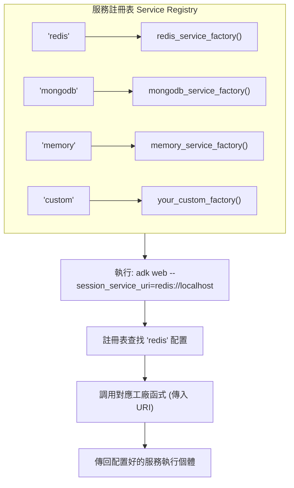

# 自訂 Session 服務 - TIL 實作

這是針對 TIL (Today I Learned) 主題 **「在 Google ADK 1.17+ 中註冊自訂 Session 服務」** 的實作專案。

## 總覽

本專案展示如何透過 Google ADK 的服務註冊模式 (service registry pattern)，註冊並使用自訂的 session 儲存後端 (例如：Redis, MongoDB, PostgreSQL, DynamoDB)。

## ⚠️ 關鍵重點：進入點模式 (Entry Point Pattern)

**服務註冊必須在 ADK 初始化之前完成！**

### 為什麼這很重要？
- 如果在 agent 模組匯入時才註冊服務 → 就太遲了 ❌
- 因為那時 ADK 早已決定要使用哪個 session 後端。
- 你的自訂服務將不會被採用。

### 正確的模式 (本專案採用的方式)
1.  建立一個 `__main__.py` 作為程式進入點。
2.  **優先**進行服務註冊。
3.  然後才呼叫 `cli_tools_click.main()` 啟動 ADK。
4.  這樣 ADK 就能成功識別你註冊的服務了 ✅

> **重點說明**: 這是整個實作的核心觀念。ADK 在啟動初期就會鎖定 Session 服務。若沒有透過 `__main__.py` 搶先註冊，自訂的服務將完全無效。

### 使用方式
```bash
# 正確 - 使用進入點模式
python -m custom_session_agent web --session_service_uri=redis://localhost:6379
make dev  # 同樣使用進入點模式 (內部呼叫上述指令)

# 錯誤 - 繞過了進入點，無法使用自訂服務
adk web
```

## 快速入門

### 1. 設定環境

```bash
# 安裝依賴套件
make setup

# 複製環境變數檔案
cp .env.example .env
```

### 2. 啟動服務

```bash
# 啟動 Redis 和 MongoDB 的 Docker 容器
make docker-up

# 驗證服務是否正在運行
docker ps
```

### 3. 執行 Agent

```bash
# 使用 Redis session 啟動 ADK 網頁介面
make dev

# 開啟瀏覽器： http://localhost:8000
```

### 4. 測試 Session 持久化

1.  向 agent 發送一則訊息。
2.  重新整理瀏覽器頁面 (F5)。
3.  你會發現你的 session 資料仍然存在於 Redis 中！ ✅

## 專案結構

```
.
├── Makefile                          # 用於設定、開發、測試的指令集
├── docker-compose.yml                # Redis 和 MongoDB 的容器設定
├── requirements.txt                  # Python 依賴套件
├── .env.example                      # 環境變數範本
├── custom_session_agent/
│   ├── __init__.py                   # 套件初始化
│   └── agent.py                      # 主要的 Agent 程式與服務註冊邏輯
└── tests/
    ├── __init__.py
    ├── test_imports.py               # 匯入與組態測試
    ├── test_tools.py                 # 工具函式測試
    └── test_agent.py                 # Agent 組態測試
```

## 架構說明

### 服務註冊模式 (Service Registry Pattern)

ADK 使用一個**全域的服務註冊表 (global service registry)**，它會將 URI 的協定 (scheme) 對應到一個工廠函式 (factory function)：


> **架構核心**: 這個模式讓 ADK 核心與具體的儲存實作解耦。ADK 只需知道要呼叫哪個工廠，而不需要知道該工廠內部如何建立服務。

### 工廠函式模式 (Factory Function Pattern)

```python
def redis_service_factory(uri: str, **kwargs):
    """此工廠函式根據 URI 建立服務實例。"""
    kwargs_copy = kwargs.copy()
    kwargs_copy.pop("agents_dir", None)  # ADK 會傳入此參數，但我們不需要它

    return redis_session_service.RedisSessionService(
        uri=uri,
        **kwargs_copy
    )

# 向服務註冊表註冊
registry = get_service_registry()
registry.register_session_service("redis", redis_service_factory)
```
> **重點說明**: 工廠函式是連接 URI 和服務實例的橋樑。它負責解析 URI、處理參數，並回傳一個符合 `BaseSessionStorage` 介面的物件。

## 可用的 Session 後端

### Redis

**適用情境:** 生產環境的 agent、高頻次的 session 操作、快取。

```bash
# 啟動 Redis
make docker-up

# 搭配 ADK 使用
python custom_session_agent/agent.py web custom_session_agent/ \
  --session_service_uri=redis://localhost:6379/0

# 在 Redis CLI 中驗證
docker-compose exec redis redis-cli
> KEYS *
> GET <session_key>
```

**特性:**
- ⚡ 非常快速 (in-memory)
- 💾 具持久性 (RDB 快照)
- 📊 可分散式 (可在多個伺服器間共享)
- 🔄 社群支援良好

### MongoDB

**適用情境:** Session 資料為複雜文件、需要複雜查詢、技術棧以 MongoDB 為主。

```bash
# 啟動 MongoDB (已包含在 docker-compose.yml 中)
make docker-up

# 搭配 ADK 使用
python custom_session_agent/agent.py web custom_session_agent/ \
  --session_service_uri=mongodb://localhost:27017/adk_sessions

# 在 MongoDB shell 中驗證
docker-compose exec mongodb mongosh
> use adk_sessions
> db.sessions.find()
```

**特性:**
- 📄 彈性的文件儲存
- 🔍 支援複雜查詢
- 📏 文件大小無限制
- 🔐 內建身份驗證

### Memory (預設)

**適用情境:** 開發、測試、無狀態部署。

```python
# 無需任何設定！
# Memory session 是預設選項

adk web agents/
```

**特性:**
- ⚡ 最快的選項
- 🎯 簡單 (無外部依賴)
- ❌ 伺服器重啟後資料會遺失
- ❌ 僅適用於單一伺服器

### 自訂後端 (DIY)

若要實作你自己的後端：

1.  繼承 `BaseSessionStorage`:

```python
from google.adk.sessions import BaseSessionStorage

class PostgresSessionService(BaseSessionStorage):
    """自訂的 PostgreSQL session 儲存服務。"""

    async def get_session(self, session_id: str):
        # 實作 'get' 邏輯
        pass

    async def set_session(self, session_id: str, data: dict):
        # 實作 'set' 邏輯
        pass

    async def delete_session(self, session_id: str):
        # 實作 'delete' 邏輯
        pass
```

2.  建立一個工廠函式：

```python
def postgres_factory(uri: str, **kwargs):
    kwargs_copy = kwargs.copy()
    kwargs_copy.pop("agents_dir", None)
    return PostgresSessionService(uri=uri, **kwargs_copy)
```

3.  註冊它：

```python
registry = get_service_registry()
registry.register_session_service("postgres", postgres_factory)
```

## 工具 (Tools)

此 agent 包含 4 個示範工具：

### 1. `describe_session_info`

顯示當前 session 的相關資訊。

```python
describe_session_info(session_id="my_session")
```

**回傳:**
```json
{
  "status": "success",
  "report": "Session my_session is active",
  "data": {
    "session_id": "my_session",
    "backend": "Session storage is configured via service registry",
    "persistence": "Supported (depends on backend)"
  }
}
```

### 2. `test_session_persistence`

測試在 session 中儲存和讀取資料。

```python
test_session_persistence(key="user_name", value="Alice")
```

**回傳:**
```json
{
  "status": "success",
  "report": "Stored user_name=Alice in session",
  "data": {
    "key": "user_name",
    "value": "Alice",
    "redis_command": "redis-cli GET session:user_name"
  }
}
```

### 3. `show_service_registry_info`

展示服務註冊模式及其運作原理。

```python
show_service_registry_info()
```

**回傳:** 關於工廠模式和註冊流程的資訊。

### 4. `get_session_backend_guide`

提供不同 session 後端的比較指南。

```python
get_session_backend_guide()
```

**回傳:** Redis, MongoDB, Memory 和自訂後端的詳細比較。

## 測試

### 執行所有測試

```bash
make test
```

### 執行特定測試檔案

```bash
pytest tests/test_imports.py -v
pytest tests/test_tools.py -v
pytest tests/test_agent.py -v
```

### 以監控模式執行測試 (Watch Mode)

```bash
make test-watch
```

### 測試覆蓋率

```bash
make test
# 覆蓋率報告會顯示哪些程式碼路徑已被測試
```

## Docker 服務

### 啟動服務

```bash
make docker-up
```

這會啟動：
- **Redis**: `redis://localhost:6379` (資料位於 `/data`)
- **MongoDB**: `mongodb://localhost:27017` (資料位於 `/data/db`)

### 停止服務

```bash
make docker-down
```

### 查看日誌

```bash
make docker-logs

# 或特定服務
docker-compose logs redis
docker-compose logs mongodb
```

### 完全清除 (包含儲存卷)

```bash
make clean-all
```

## 環境變數

請參考 `.env.example`:

```bash
# Google ADK
GOOGLE_API_KEY=your_key_here

# Redis 組態
REDIS_HOST=localhost
REDIS_PORT=6379
REDIS_DB=0

# MongoDB 組態
MONGODB_HOST=localhost
MONGODB_PORT=27017
MONGODB_DATABASE=adk_sessions

# Session 服務選擇
SESSION_SERVICE_TYPE=redis
SESSION_SERVICE_URI=redis://localhost:6379/0
```

## 關鍵學習點

### 1. 服務註冊模式 (Service Registry Pattern)

服務註冊表是一個**工廠註冊表**，它將 URI 協定對應到建立函式：

- 📍 **單一職責**: 註冊表只關心協定 (scheme)。
- 🏭 **工廠模式**: 由工廠負責建立服務實例。
- 🔗 **鬆散耦合**: 新增後端不需修改 ADK 核心程式碼。
- 🔄 **可擴展性**: 可隨時新增後端支援。

### 2. 工廠函式 (Factory Functions)

每個工廠函式都：

1.  接收一個 **URI 字串**。
2.  接收 **kwargs** (記得要 pop `agents_dir`)。
3.  回傳一個**session 服務實例**。

```python
def my_factory(uri: str, **kwargs):
    kwargs_copy = kwargs.copy()
    kwargs_copy.pop("agents_dir", None)  # ← 非常重要！

    # 如果需要，解析 URI
    # 設定服務
    # 回傳實例
    return MySessionService(**kwargs_copy)
```

### 3. BaseSessionStorage 介面

所有 session 服務都必須實作以下這些方法：

```python
class MySessionService(BaseSessionStorage):
    async def get_session(self, session_id: str) -> dict:
        """讀取 session 資料。"""

    async def set_session(self, session_id: str, data: dict) -> None:
        """儲存 session 資料。"""

    async def delete_session(self, session_id: str) -> None:
        """刪除 session 資料。"""
```
> **介面規範**: 這是 ADK 與所有 Session 服務溝通的統一契約 (contract)。只要遵循此介面，任何儲存技術都可以被整合進來。

### 4. 生產環境考量

- **持久性**: 使用 Redis 或 MongoDB (而非 memory)。
- **擴展性**: Redis/MongoDB 可在多伺服器環境下運作。
- **監控**: 監控你的儲存後端 (CPU, memory, 連線數)。
- **備份**: 為持久層實作備份策略。
- **安全性**: 將敏感憑證儲存在環境變數中。

## 指令參考

```bash
# 設定與安裝
make setup              # 安裝依賴套件與打包
make clean             # 移除快取檔案

# Docker 服務
make docker-up         # 啟動 Redis 和 MongoDB
make docker-down       # 停止服務
make docker-logs       # 查看服務日誌

# 開發
make dev               # 使用 Redis session 啟動 ADK 網頁
make demo              # 展示範例與使用方式

# 測試
make test              # 執行所有測試並產出覆蓋率報告
make test-watch        # 以監控模式執行測試
make test-verbose      # 執行測試並顯示詳細資訊

# 清除
make clean             # 移除 Python 快取
make clean-all         # 停止 Docker 並移除儲存卷
```

## 常見問題

### Redis Connection Refused (連線被拒)

```
Error: ConnectionError: Unable to connect to redis://localhost:6379
```

**解決方案:**

```bash
# 啟動 Docker 服務
make docker-up

# 或檢查 Redis 是否正在運行
docker ps | grep redis
```

### MongoDB Authentication Failed (驗證失敗)

```
Error: ServerSelectionTimeoutError: Error connecting to MongoDB
```

**解決方案:**

```bash
# 檢查 MongoDB 是否正在運行
docker-compose logs mongodb

# 確認 .env 中的憑證與 docker-compose.yml 相符
MONGODB_USERNAME=admin
MONGODB_PASSWORD=password
```

### 測試因 Import Errors 而失敗

```
ImportError: No module named google.adk
```

**解決方案:**

```bash
# 安裝依賴套件
pip install -r requirements.txt

# 確保 google-genai 已安裝
pip install google-genai>=1.15.0
```

## 整合到你的專案

要在你自己的 agent 中使用自訂 session 服務：

1.  **複製此模式**:

```python
from google.adk.cli.service_registry import get_service_registry
from google.adk_community.sessions import redis_session_service

def redis_factory(uri: str, **kwargs):
    kwargs_copy = kwargs.copy()
    kwargs_copy.pop("agents_dir", None)
    return redis_session_service.RedisSessionService(**kwargs_copy)

registry = get_service_registry()
registry.register_session_service("redis", redis_factory)
```

2.  **在你的主程式檔案中使用**:

```python
if __name__ == "__main__":
    cli_tools_click.main()
```

3.  **使用 Redis 執行**:

```bash
python your_agent.py web agents/ \
  --session_service_uri=redis://localhost:6379
```

## 參考資料

- **TIL 文件**: [2025-10-23-til-custom-session-services.md](../../../notes/google-adk-training-hub/blog/2025-10-23-til-custom-session-services.md)
- **Google ADK**: https://github.com/google/adk-python
- **Redis 文件**: https://redis.io/documentation
- **MongoDB 文件**: https://docs.mongodb.com
- **服務註冊模式**: https://refactoring.guru/design-patterns/factory-method
