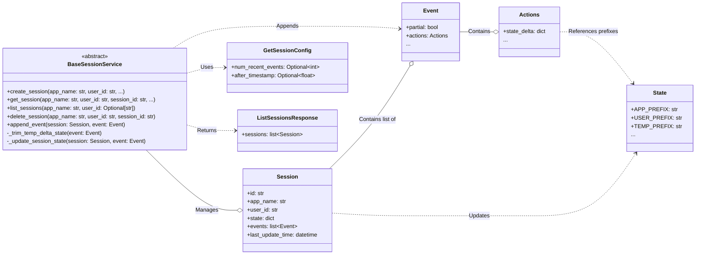

## 重點程式碼說明

### BaseSessionService 類別圖

```mermaid
classDiagram
    direction LR
    class BaseSessionService {
        <<abstract>>
        +create_session(app_name: str, user_id: str, ...)
        +get_session(app_name: str, user_id: str, session_id: str, ...)
        +list_sessions(app_name: str, user_id: Optional[str])
        +delete_session(app_name: str, user_id: str, session_id: str)
        +append_event(session: Session, event: Event)
        -_trim_temp_delta_state(event: Event)
        -_update_session_state(session: Session, event: Event)
    }
    class Session {
        +id: str
        +app_name: str
        +user_id: str
        +state: dict
        +events: list~Event~
        +last_update_time: datetime
    }
    class Event {
        +partial: bool
        +actions: Actions
        ...
    }
    class Actions {
        +state_delta: dict
        ...
    }
    class State {
        +APP_PREFIX: str
        +USER_PREFIX: str
        +TEMP_PREFIX: str
        ...
    }
    class GetSessionConfig {
        +num_recent_events: Optional~int~
        +after_timestamp: Optional~float~
    }
    class ListSessionsResponse {
        +sessions: list~Session~
    }

    BaseSessionService --o Session : Manages
    BaseSessionService ..> Event : Appends
    BaseSessionService ..> GetSessionConfig : Uses
    BaseSessionService ..> ListSessionsResponse : Returns
    Event --o Actions : Contains
    Actions ..> State : References prefixes
    Session --o Event : Contains list of
    Session ..> State : Updates
```