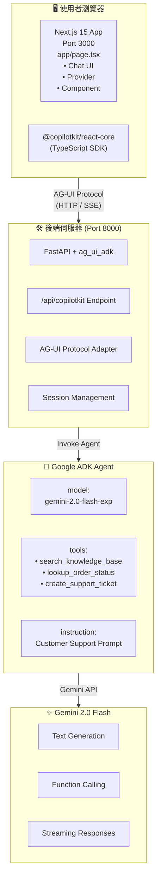

# 教學 30：Next.js ADK 整合

這是使用 Next.js 15、CopilotKit 和 Google ADK 與 AG-UI 協定，實作客戶支援聊天機器人的完整範例。

## 🚀 快速入門

```bash
# 1. 安裝相依套件
make setup

# 2. 設定 API 金鑰
cp agent/.env.example agent/.env
# 編輯 agent/.env 並加入您的 GOOGLE_API_KEY

# 3. 啟動後端和前端
make dev

# 4. 在瀏覽器中開啟 http://localhost:3000
```

## 📋 包含內容

此實作展示了：

- ✅ **Python ADK Agent**：具備自訂工具
- ✅ **FastAPI 後端**：整合 AG-UI
- ✅ **Next.js 15 前端**：整合 CopilotKit
- ✅ **即時聊天介面**：支援串流回應
- ✅ **工具增強回應**：(知識庫、訂單查詢、建立工單)
- ✅ **完整的測試套件**：(30+ 個測試)
- ✅ **可上線的架構**

## 🏗️ 架構



## 📁 專案結構

```
customer-support-agent/
├── agent/                      # Python 後端
│   ├── __init__.py
│   ├── agent.py               # ADK agent + FastAPI 應用程式
│   └── .env.example           # 環境變數範本
├── nextjs_frontend/           # Next.js 前端
│   ├── app/
│   │   ├── layout.tsx         # 根佈局
│   │   ├── page.tsx           # 具備 CopilotKit 和進階功能的聊天頁面
│   │   ├── advanced/
│   │   │   └── page.tsx       # 進階功能示範頁面
│   │   └── globals.css        # Tailwind 樣式
│   ├── components/
│   │   ├── ThemeToggle.tsx    # 深色/淺色模式切換
│   │   └── ProductCard.tsx    # 生成式 UI 產品卡片
│   ├── package.json
│   ├── tsconfig.json
│   ├── next.config.js
│   └── tailwind.config.ts
├── tests/                     # 測試套件
│   ├── test_agent.py          # Agent 設定測試
│   ├── test_imports.py        # 匯入驗證
│   ├── test_structure.py      # 專案結構測試
│   └── test_tools.py          # 工具函式測試 (包含進階功能)
├── Makefile                   # 建置指令
├── README.md                  # 本檔案
├── requirements.txt           # Python 相依套件
└── pyproject.toml            # Python 套件設定
```

## ⚡ 進階功能

此實作包含了教學 30 (customer-support-agent) 中的三個強大進階功能：

### 1. 🎨 生成式 UI (Generative UI)

Agent 可以在聊天中直接渲染豐富的互動式 React 元件：

- **產品卡片**：顯示產品圖片、價格、評分和庫存狀態
- **動態元件**：Agent 決定何時使用視覺元件而非純文字
- **實作方式**：`create_product_card()` 工具回傳結構化資料，由 `ProductCard` 元件進行渲染

**試試看**："Show me product PROD-001" (顯示產品 PROD-001)

### 2. 🔐 人機協作 (Human-in-the-Loop, HITL)

敏感操作需要明確的使用者批准：

- **退款批准**：處理退款前須經使用者確認
- **確認對話框**：批准前清楚顯示操作詳情
- **取消**：使用者可以拒絕請求，Agent 會繼續提供替代方案

**試試看**："I want a refund for order ORD-12345" (我想為訂單 ORD-12345 退款)

### 3. 👤 共享狀態 (Shared State)

Agent 無需詢問即可即時存取使用者情境：

- **使用者資料**：自動取得姓名、電子郵件、帳戶類型
- **訂單歷史**：Agent 知道您的訂單 (ORD-12345, ORD-67890)
- **會員資訊**：可存取加入日期和帳戶狀態

**試試看**："What's my account status?" (我的帳戶狀態是什麼？)

**了解更多**：請造訪執行中應用程式的 `/advanced` 頁面以獲取詳細實作文件。

## 🏠 首頁結構

主頁面 (`http://localhost:3000`) 包含：

1. **頁首區塊**
   - 客戶支援助理品牌標示
   - 使用者帳戶顯示 (已登入為 John Doe)
   - 進階功能導覽連結
   - 深色/淺色模式切換

2. **聊天介面** (固定高度：600px)
   - 使用 CopilotKit 的即時 AI 聊天
   - 初始訊息中的範例提示
   - 串流回應
   - 工具執行回饋

3. **功能展示** (聊天視窗下方，可捲動)
   - **分頁介面**：在三個功能間切換
   - **生成式 UI 分頁**：即時 ProductCard 範例
   - **HITL 分頁**：模擬退款批准對話框
   - **共享狀態 分頁**：使用者帳戶資訊顯示
   - 直接顯示在首頁，方便立即探索

**使用者流程**：
- 進入頁面 → 看到帶有範例提示的聊天視窗
- 向下捲動 → 透過即時示範探索進階功能
- 點擊分頁 → 互動式體驗各項功能
- 造訪 `/advanced` → 閱讀實作細節

## 🛠️ 可用指令

### 設定

```bash
make setup              # 安裝所有相依套件 (後端 + 前端)
make setup-backend      # 僅安裝後端相依套件
make setup-frontend     # 僅安裝前端相依套件
```

### 開發

```bash
make dev                # 啟動後端和前端
make dev-backend        # 僅啟動後端 (埠號 8000)
make dev-frontend       # 僅啟動前端 (埠號 3000)
```

### 測試

```bash
make test               # 執行所有測試
make demo               # 顯示示範提示
```

### 清理

```bash
make clean              # 移除產生的檔案
```

## 💬 嘗試這些提示

### 知識庫查詢

- "What is your refund policy?" (你的退款政策是什麼？)
- "How long does shipping take?" (運送需要多久？)
- "Tell me about your warranty" (告訴我關於保固的資訊)
- "How do I reset my password?" (我要如何重設密碼？)

### 訂單狀態查詢

- "Check order status for ORD-12345" (檢查訂單 ORD-12345 的狀態)
- "What's the status of order ORD-67890?" (訂單 ORD-67890 的狀態如何？)
- "Track my order ORD-11111" (追蹤我的訂單 ORD-11111)

### 建立支援工單

- "My product stopped working after 2 months" (我的產品在 2 個月後停止運作)
- "I need help with a billing issue" (我需要協助解決帳單問題)
- "Create a ticket for account access problems" (為帳戶存取問題建立工單)

### 進階功能

#### 生成式 UI (功能 1)
- "Show me product PROD-001" (顯示產品 PROD-001)
- "What products do you have available?" (你們有哪些產品？)
- "Tell me about the Widget Pro" (告訴我關於 Widget Pro 的資訊) (顯示產品卡片)
- "Display product PROD-002" (顯示產品 PROD-002) (顯示 Gadget Plus)

#### 人機協作 (功能 2)
- "I want a refund for order ORD-12345" (我想為訂單 ORD-12345 退款)
- "Process a refund of $99.99 for my order" (為我的訂單處理 $99.99 的退款)
- "Can you refund my purchase?" (你能為我的購買退款嗎？) (需要批准對話框)

#### 共享狀態 (功能 3)
- "What's my account status?" (我的帳戶狀態是什麼？) (Agent 知道您的名字)
- "Show me my recent orders" (顯示我最近的訂單) (Agent 擁有訂單歷史)
- "When did I join?" (我什麼時候加入的？) (Agent 知道會員加入日期)

## 🔧 設定

### 後端設定

編輯 `agent/.env`：

```bash
# 必填
GOOGLE_API_KEY=your_api_key_here

# 選填
PORT=8000
HOST=0.0.0.0
ENVIRONMENT=development
LOG_LEVEL=INFO
```

### 前端設定

編輯 `nextjs_frontend/.env`：

```bash
NEXT_PUBLIC_AGENT_URL=http://localhost:8000
```

## 🧪 測試

本實作包含完整的測試：

```bash
# 執行所有測試
make test

# 執行特定測試檔案
pytest tests/test_agent.py -v
pytest tests/test_tools.py -v
```

**測試覆蓋範圍：**

- ✅ Agent 設定驗證
- ✅ 工具函式行為
- ✅ 專案結構驗證
- ✅ 匯入驗證
- ✅ FastAPI 端點設定
- ✅ 錯誤處理

## 🚢 部署

### 選項 1：開發環境 (本機)

```bash
make dev
# 後端：http://localhost:8000
# 前端：http://localhost:3000
```

### 選項 2：正式環境 (Cloud Run + Vercel)

**後端 (Google Cloud Run)：**

```bash
cd agent
gcloud run deploy customer-support-agent \
  --source . \
  --region us-central1 \
  --allow-unauthenticated \
  --set-env-vars="GOOGLE_API_KEY=your_key"
```

**前端 (Vercel)：**

```bash
cd nextjs_frontend
vercel

# 設定環境變數
vercel env add NEXT_PUBLIC_AGENT_URL production
# 輸入：https://customer-support-agent-xyz.run.app
```

## 🔑 驗證

本實作支援兩種驗證方式：

### 方法 1：API 金鑰 (Gemini API)

```bash
export GOOGLE_API_KEY=your_api_key_here
# 在以下網址取得免費金鑰：https://aistudio.google.com/app/apikey
```

### 方法 2：服務帳戶 (VertexAI)

```bash
export GOOGLE_APPLICATION_CREDENTIALS=/path/to/service-account.json
export GOOGLE_CLOUD_PROJECT=your_project_id
# 在以下網址建立：https://console.cloud.google.com/iam-admin/serviceaccounts
```

## 🐛 疑難排解

### 後端問題

**問題：** `ImportError: No module named 'ag_ui_adk'`

```bash
# 解決方案：安裝相依套件
make setup-backend
```

**問題：** `Authentication failed` (驗證失敗)

```bash
# 解決方案：檢查 API 金鑰
echo $GOOGLE_API_KEY  # 應顯示您的金鑰
# 或設定它：
export GOOGLE_API_KEY=your_key
```

### 前端問題

**問題：** 前端無法連接到後端

```bash
# 解決方案：檢查後端是否正在執行
curl http://localhost:8000/health
# 應回傳：{"status": "healthy"}
```

**問題：** 瀏覽器控制台出現 CORS 錯誤

```bash
# 解決方案：檢查 agent/agent.py 中的 CORS 設定
# 確保您的前端 URL 在 allow_origins 清單中
```

### 連線問題

**問題：** 聊天沒有回應

## 🐛 疑難排解

### 常見問題

#### 1. 422 Unprocessable Entity Errors ✅ 正常現象

**情境**：瀏覽器控制台顯示：
```
Failed to load resource: the server responded with a status of 422 (Unprocessable Entity)
POST http://localhost:8000/api/copilotkit 422
```

**這是預期且無害的！**

CopilotKit 在頁面載入期間發送的初始握手請求與 AG-UI 協定架構不符。FastAPI 的驗證回傳 422，CopilotKit 會自動重試，當您發送第一條訊息時，連線將會成功建立。

**行動**：✅ 無需採取任何行動 - 這是設計使然

**想了解完整解釋？** 請參閱 [TROUBLESHOOTING_422.md](./TROUBLESHOOTING_422.md) 以獲得完整的技術分析和驗證步驟。

#### 1b. "Agent Not Found" (找不到 Agent) 錯誤 ⚠️ 已修復

**情境**：聊天介面底部出現紅色橫幅：
```
The requested agent was not found. Please set up at least one agent before proceeding.
```

**已套用的修正**：從 `<CopilotKit>` 元件移除了 `agent="customer_support_agent"` 屬性。AG-UI 協定會自動從後端發現 Agent。

**如果您仍然看到此錯誤**：
1. 確保後端正在執行：`curl http://localhost:8000/health`
2. 檢查瀏覽器控制台是否有連線錯誤
3. 驗證 `/api/copilotkit` 端點是否存在：`curl http://localhost:8000/docs`

#### 1c. EmptyAdapter 需要 Agent 鎖定模式 ✅ 已修復

**情境**：瀏覽器控制台出現錯誤：
```
Invalid adapter configuration: EmptyAdapter is only meant to be used with agent lock mode.
For non-agent components like useCopilotChatSuggestions, CopilotTextarea, or CopilotTask,
please use an LLM adapter instead.
```

**根本原因**：使用 `ExperimentalEmptyAdapter` (將所有 LLM 呼叫委派給您的 AG-UI Agent) 時，CopilotKit 要求啟用 "agent lock mode" (Agent 鎖定模式)。這確保所有請求都通過您的特定 Agent，而不是嘗試使用不存在的 LLM 轉接器。

**已套用的修正**：

1. **前端 (`page.tsx`)**：在 CopilotKit 元件加入 `agent` 屬性：
```tsx
<CopilotKit runtimeUrl="/api/copilotkit" agent="customer_support_agent">
  <ChatInterface />
</CopilotKit>
```

2. **後端路由 (`route.ts`)**：確保 Agent 名稱相符：
```typescript
const runtime = new CopilotRuntime({
  agents: {
    customer_support_agent: new HttpAgent({ url: `${backendUrl}/api/copilotkit` }),
  },
});
```

**為什麼需要這樣做**：
- `ExperimentalEmptyAdapter` 沒有 LLM - 它只代理給您的 Agent
- CopilotKit 功能如 `useCopilotChatSuggestions` 需要 LLM
- Agent 鎖定模式告訴 CopilotKit："所有事情都使用這個特定的 Agent"
- 如果沒有它，CopilotKit 嘗試使用 EmptyAdapter 不存在的 LLM → 錯誤

**驗證**：
1. 檢查瀏覽器控制台 - 錯誤應已消失
2. `page.tsx` 中的 Agent 名稱與 `route.ts` 中的 Agent 名稱相符
3. `route.ts` 中的 Agent 名稱與後端 Agent 名稱 (`customer_support_agent`) 相符

#### 1d. [Network] Unknown Error Occurred (網路未知錯誤) ⚠️ 已知問題

**情境**：聊天介面底部出現紅色橫幅：
```
[Network] Unknown error occurred
```

**根本原因**：CopilotKit 1.10.6+ 發送的訊息缺少 AG-UI 協定所需的 `id` 欄位。後端驗證拒絕這些訊息，導致無法建立連線。

**為什麼會發生**：
- AG-UI 協定要求 UserMessage 必須有：`{id, role, content}`
- CopilotKit 1.10.6 只發送：`{role, content}`
- FastAPI 驗證因缺少 `id` 欄位回傳 422
- CopilotKit 顯示通用的 "Unknown error" 而非具體的驗證錯誤

**驗證**：
1. 開啟瀏覽器開發者工具 (F12) → Console 分頁
2. 尋找：`{"detail":[{"type":"missing","loc":["body","messages",0,"user","id"],"msg":"Field required"...}]}`
3. 這確認了缺少 `id` 欄位

**解決方案選項**：

1. **嘗試發送訊息**：有時在輸入並發送後錯誤會解決
2. **等待 ag_ui_adk 更新**：套件維護者已注意到此相容性問題
3. **使用替代 UI 框架**：教學 32 (Streamlit) 沒有此問題
4. **檢查更新**：執行 `pip install --upgrade ag-ui-adk` 並重新啟動後端

**狀態**：🔴 CopilotKit 1.10.6 與 ag_ui_adk 0.1.0 之間的已知相容性問題

#### 2. Hydration Mismatch Warnings (Hydration 不符警告)

**想了解完整解釋？** 請參閱 [TROUBLESHOOTING_422.md](./TROUBLESHOOTING_422.md) 以獲得完整的技術分析和驗證步驟。

#### 2. Hydration Mismatch Warnings (Hydration 不符警告)

**情境**：
```
Warning: Prop `className` did not match. Server: "..." Client: "..."
```

**原因**：瀏覽器擴充功能 (密碼管理器、Grammarly) 在 React 載入前修改了 HTML

**解決方案**：
- 忽略警告 (不影響功能)
- 在無痕模式下測試
- 暫時停用瀏覽器擴充功能

#### 3. Backend Won't Start (後端無法啟動)

**情境**：`Error: GOOGLE_API_KEY not configured`

**解決方案**：
1. 建立 `agent/.env` 檔案：
   ```bash
   cp agent/.env.example agent/.env
   ```
2. 加入您的 API 金鑰：
   ```
   GOOGLE_API_KEY=your_key_here
   ```
3. 重新啟動後端：`make dev`

#### 4. Frontend Build Errors (前端建置錯誤)

**情境**：`Cannot find module '@copilotkit/react-core'`

**解決方案**：
1. 安裝相依套件：
   ```bash
   cd nextjs_frontend && npm install
   ```
2. 或使用 Makefile：
   ```bash
   make setup
   ```

#### 5. Port Already in Use (埠號已被使用)

**情境**：`Error: Address already in use`

**解決方案**：
1. 停止現有程序：
   ```bash
   # 尋找程序
   lsof -i :8000  # 後端
   lsof -i :3000  # 前端

   # 終止程序
   kill -9 <PID>
   ```
2. 或在 `.env` 檔案中使用不同埠號

### 偵錯步驟

1. **檢查後端健康狀態**：
   ```bash
   curl http://localhost:8000/health
   ```
   應回傳：`{"status": "healthy", ...}`

2. **檢查 API 文件**：
   開啟 http://localhost:8000/docs

3. **直接測試後端**：
   ```bash
   cd agent && python agent.py
   ```
   查看啟動訊息和錯誤

4. **檢查前端建置**：
   ```bash
   cd nextjs_frontend && npm run build
   ```
   應完成且無錯誤

5. **檢視網路請求**：
   - 開啟瀏覽器開發者工具 (F12)
   - 前往 Network (網路) 分頁
   - 發送聊天訊息
   - 檢查請求/回應詳細資訊

### 仍有問題？

1. 檢查後端日誌中的錯誤
2. 驗證 API 金鑰設定正確
3. 確保所有相依套件已安裝
4. 嘗試 `make clean && make setup`
5. 查看 [implementation log](../../log/20251012_224000_tutorial30_implementation_complete.md) 獲取詳細疑難排解資訊

## 📚 了解更多

- [Google ADK 文件](https://google.github.io/adk-docs/)
- [CopilotKit 文件](https://docs.copilotkit.ai/adk)
- [Next.js 15 文件](https://nextjs.org/docs)
- [FastAPI 文件](https://fastapi.tiangolo.com/)

## 🎯 關鍵功能

### 客戶支援工具

1. **知識庫搜尋** (`search_knowledge_base`)
   - 搜尋常見問題和文件
   - 回傳格式化的文章
   - 優雅地處理未知查詢

2. **訂單狀態查詢** (`lookup_order_status`)
   - 檢索訂單詳情
   - 顯示追蹤資訊
   - 預估送達日期

3. **建立支援工單** (`create_support_ticket`)
   - 產生唯一的工單 ID
   - 基於優先級的回應時間
   - 詳細的問題追蹤

### 前端功能

- 即時串流回應
- 美觀的 Tailwind CSS 樣式
- 響應式設計
- CopilotKit 預建聊天 UI
- 基於環境的設定

### 後端功能

- 具備自動產生文件的 FastAPI
- AG-UI 協定整合
- 開發環境的 CORS 設定
- 健康檢查端點
- 結構化日誌

## 🔐 安全注意事項

- ⚠️ 切勿將 `.env` 檔案提交到版本控制
- ✅ 始終使用 `.env.example` 作為範本
- ✅ 將 API 金鑰儲存在環境變數中
- ✅ 在正式環境使用服務帳戶
- ✅ 在正式環境啟用 HTTPS
- ✅ 為正式環境部署實作速率限制


## 重點摘要
- **核心概念**：使用 Next.js 15、CopilotKit 和 Google ADK (AG-UI 協定) 構建完整的客戶支援聊天機器人。
- **關鍵技術**：Google ADK, FastAPI, Next.js 15, CopilotKit, AG-UI Protocol, Gemini API。
- **重要結論**：本專案展示了如何整合前後端技術，實現具備生成式 UI、人機協作 (HITL) 和共享狀態等進階功能的 AI 代理人。
- **行動項目**：
    - 依循快速入門步驟設定環境。
    - 設定 API 金鑰。
    - 執行 `make dev` 啟動服務。
    - 參考疑難排解章節解決常見問題。
