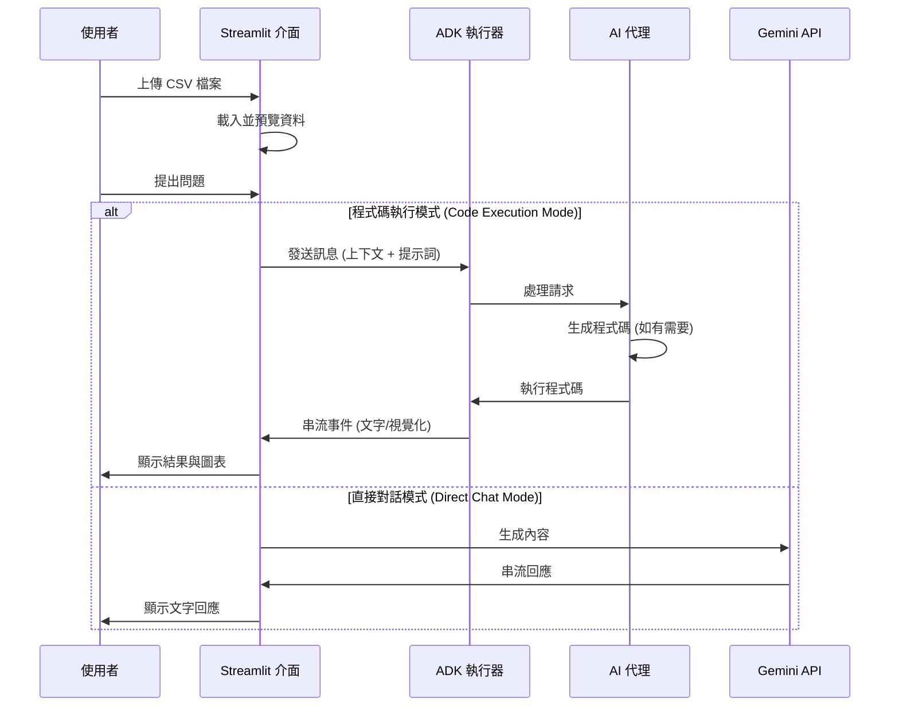

# 📊 資料分析代理：Streamlit + ADK

使用純 Python 與您的 CSV 資料進行 AI 對話，無需後端。上傳檔案，提出問題，即時獲得見解與精美圖表。

**您將獲得**：
- 💬 自然語言資料探索
- 📈 自動圖表生成
- ⚡ 即時串流回應
- 🚀 數分鐘內完成部署
- 🔒 安全（API 金鑰僅存在於 `.env` 中）

## 🚀 2 分鐘快速入門

### 前置需求
- Python 3.9+
- Google API 金鑰（免費），可從 [Google AI Studio](https://makersuite.google.com/app/apikey) 取得

### 設定
```bash
cd tutorial_implementation/tutorial32
make setup              # 安裝依賴項
cp .env.example .env    # 建立設定檔
# 將您的 API 金鑰新增至 .env
make dev                # 在 localhost:8501 啟動應用程式
```

**就這樣！** 開啟瀏覽器並開始分析。 📊

## 💡 運作原理

### 1. 上傳您的資料
```
┌─ 側邊欄 ─────────────────────┐
│ 📁 上傳 CSV               │
│                           │
│ [選擇檔案...]              │
│                           │
│ ✅ 已載入: sales.csv      │
│    📊 500 列 × 8 欄       │
└──────────────────────────────┘
```

### 2. 與您的資料對話
```
您:   "顯示各地區的銷售額"
      ↓
🤖 AI 分析上下文與資料
      ↓
Bot:  "根據您的資料...

       📊 圖表: 各地區銷售額

       最高地區: 西部 ($50k),
       北部 ($45k), 南部 ($38k)"
```

### 流程圖：


### 3. 兩種可用模式

**程式碼執行模式** (推薦用於圖表)
- 使用 matplotlib/plotly 自動視覺化
- AI 生成並執行 Python 程式碼
- 專業圖表直接顯示於對話中

**對話模式** (用於分析)
- 直接 AI 回應
- 適合提問與獲取見解
- 回饋更快速

## 🎯 立即嘗試

**範例 CSV** 測試用：
```csv
date,product,sales,region
2024-01-01,Widget A,1200,North
2024-01-01,Widget B,980,West
2024-01-02,Widget A,1450,South
```

**範例問題**：
- "銷售額最高的產品是什麼？"
- "建立隨時間變化的銷售額圖表"
- "比較各地區 - 哪一個成長最快？"
- "您有注意到任何趨勢或模式嗎？"

## 📁 專案結構

```
data-analysis-agent/
├── app.py                    主 Streamlit 應用程式
├── data_analysis_agent/      AI 代理程式碼
│   ├── __init__.py
│   └── agent.py
├── tests/                    測試
├── Makefile                  快速指令
├── requirements.txt          依賴項
├── pyproject.toml           Python 設定
├── .env.example             API 金鑰範本
└── README.md                README檔案
```

**關鍵檔案**：
- `app.py` - 使用者介面與對話邏輯
- `data_analysis_agent/agent.py` - AI 代理設定
- `Makefile` - 執行 `make help` 查看所有指令

## ⚙️ 指令

```bash
make setup       # 安裝依賴項
make dev         # 啟動應用程式 (localhost:8501)
make demo        # 顯示使用範例
make test        # 執行測試
make clean       # 清除快取
make help        # 顯示所有指令
```

## 🧪 測試

測試驗證代理設定與工具是否正常運作：

```bash
make test                  # 執行所有測試
pytest tests/ -v           # 詳細輸出
pytest tests/ --cov        # 覆蓋率報告
```

測試涵蓋：
- 代理設定 ✓
- 工具功能 ✓
- 匯入系統 ✓
- 專案結構 ✓

## 🔧 設定

### Streamlit 設定

在 `app.py` 中自訂：

```python
st.set_page_config(
    page_title="資料分析助理",
    page_icon="📊",
    layout="wide",
)
```

### 代理設定

在 `data_analysis_agent/agent.py` 中修改：

```python
root_agent = Agent(
    name="data_analysis_agent",
    model="gemini-2.0-flash",
    description="...",
    instruction="...",
    tools=[...],
)
```

## 📚 關鍵元件

### 1. Streamlit 應用程式 (`app.py`)

- 包含對話與檔案上傳的使用者介面
- Session 狀態管理
- 即時回應串流
- 資料預覽與統計顯示

### 2. ADK 代理 (`data_analysis_agent/agent.py`)

- **root_agent**: 匯出用於 ADK 探索的主代理
- **工具**:
  - `analyze_column`: 統計分析
  - `calculate_correlation`: 尋找關聯性
  - `filter_data`: 子集探索
  - `get_dataset_summary`: 概覽資訊

### 3. 工具

每個工具回傳一致的格式：

```python
{
    "status": "success" | "error",
    "report": "人類可讀訊息",
    "data": {...},  # 工具特定資料
}
```

## 🏛️ 建構方式

```
您的瀏覽器
     ↓
  Streamlit 應用程式 (localhost:8501)
     │
     ├─ 檔案上傳 → 使用 pandas 載入 CSV
     ├─ 對話 UI → 顯示訊息
     └─ 代理呼叫 → 直接程序內執行
                     (無 HTTP 開銷！)
     ↓
  Google Gemini API
     └─ 分析資料，生成程式碼
```

**兩條執行路徑**：

1. **程式碼執行模式** (智慧型)
   - 您要求圖表
   - AI 生成 Python 程式碼
   - 程式碼執行，matplotlib/plotly 建立圖片
   - 圖表顯示於對話中

2. **對話模式** (快速)
   - 您提出問題
   - AI 直接回應
   - 無程式碼執行，僅提供見解

**架構優勢**：
- 純 Python (無需 JavaScript)
- 直接程序內執行 (快速！)
- 單一服務部署
- 適合資料工具

## 🚀 分享您的應用程式

### Streamlit Cloud (最簡單)

1. 推送程式碼至 GitHub
2. 前往 [share.streamlit.io](https://share.streamlit.io)
3. 點擊 "New app" → 選擇 repo → `app.py`
4. 新增密鑰：`GOOGLE_API_KEY = your_key`
5. 完成！您的應用程式已上線 🎉

### Google Cloud Run

```bash
# 部署 (需 1-2 分鐘)
gcloud run deploy data-analysis-agent \
  --source=. \
  --allow-unauthenticated

# 查看日誌
gcloud run logs read data-analysis-agent
```

## 🐛 遇到問題？

### 請設定 GOOGLE_API_KEY

```bash
cp .env.example .env
# 編輯 .env 並新增您的金鑰
```

### 應用程式無法啟動

```bash
make clean
make setup
streamlit run app.py --logger.level=debug
```

### 測試失敗

```bash
pytest tests/ -vv
```

## 🔗 了解更多

**理解程式碼**：
1. 閱讀 `app.py` - Streamlit UI 如何運作
2. 查看 `data_analysis_agent/agent.py` - AI 設定
3. 執行測試 - 驗證一切正常運作

**自訂它**：
- 針對不同分析風格更改代理指令
- 新增更多工具（統計測試、機器學習預測）
- 修改圖表與視覺化
- 新增使用者驗證

## 📚 資源

- [Streamlit 文件](https://docs.streamlit.io)
- [Google ADK](https://google.github.io/adk-docs/)
- [Gemini API](https://ai.google.dev/)
- [Pandas 指南](https://pandas.pydata.org/docs/)

---

## 重點摘要

- **核心概念**：提供一個基於 Streamlit 和 Google ADK 的資料分析代理，允許使用者透過自然語言與 CSV 資料互動，進行分析與視覺化。
- **關鍵技術**：
    - **Streamlit**：用於建構互動式前端 UI。
    - **Google ADK (Agent Development Kit)**：用於建構與管理 AI 代理。
    - **Google Gemini API**：提供強大的語言模型支援。
    - **Pandas**：進行資料處理與分析。
    - **Matplotlib/Plotly**：用於動態生成視覺化圖表。
    - **程式碼執行 (Code Execution)**：AI 生成並執行 Python 程式碼以產生精確的圖表。
- **重要結論**：本專案展示了如何整合前端 UI 與後端 AI 代理，實現無縫的資料分析體驗。透過「程式碼執行模式」與「對話模式」的雙軌設計，兼顧了深度分析與快速互動的需求。
- **行動項目**：
    1. 安裝依賴項 (`make setup`)。
    2. 設定 API 金鑰 (`.env`)。
    3. 啟動應用程式 (`make dev`)。
    4. 上傳 CSV 檔案並開始測試分析功能。
