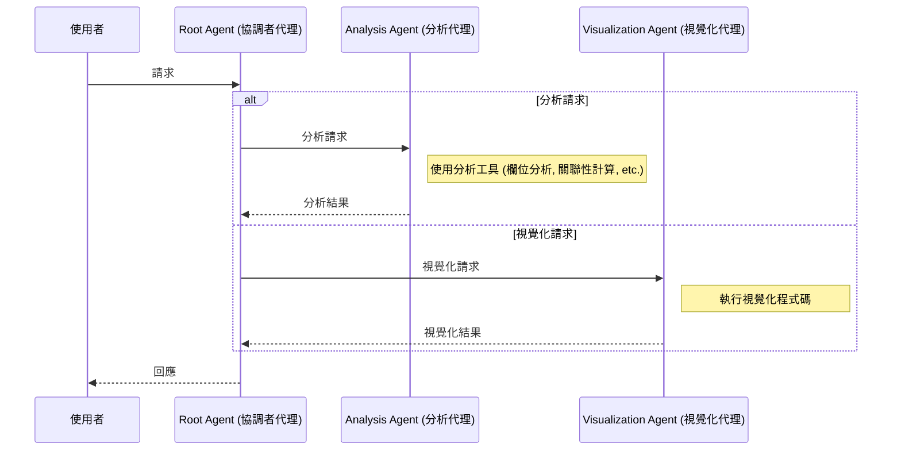
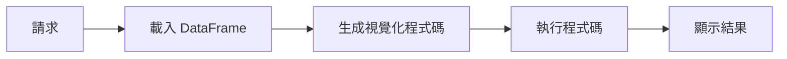

## Agent 設計說明

### 說明：搭配 ADK 的資料分析代理
多代理系統：分析工具 + 視覺化程式碼執行

### 重點摘要
- 核心概念：定義了資料分析代理系統，包含分析代理與協調者代理。
- 關鍵技術：Google ADK Agent, Multi-agent Coordination, Function Calling Tools.
- 重要結論：採用多代理模式（協調者 + 專門代理）來分離分析與視覺化職責。
- 行動項目：
    1. 定義資料分析工具（欄位分析、關聯性計算、過濾、摘要）。
    2. 建立 analysis_agent 處理統計分析。
    3. 建立 root_agent 協調分析與視覺化任務。

### 流程圖：

## 視覺化代理說明

### 說明：
具備程式碼執行的視覺化代理
使用 Python 程式碼執行生成互動式視覺化

### 重點摘要
- 核心概念：專門負責資料視覺化的代理，利用程式碼執行能力。
- 關鍵技術：BuiltInCodeExecutor, Python (Pandas/Matplotlib/Plotly).
- 重要結論：通過生成並執行 Python 程式碼，確保視覺化的靈活性與準確性。
- 行動項目：
    1. 初始化 CodeExecutor。
    2. 定義 visualization_agent，並配置程式碼執行器。
    3. 設定指令以引導代理正確載入資料並生成圖表。

### 流程圖：

