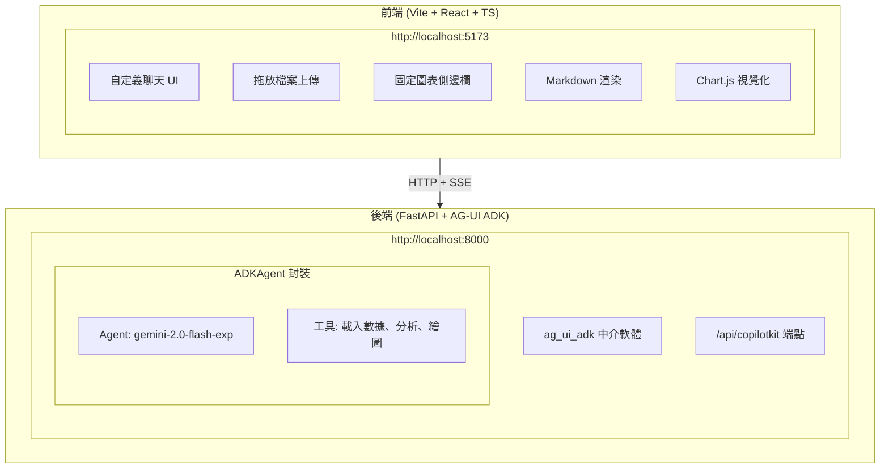

# 教學 31：整合 React Vite 與 ADK 和 AG-UI

一個現代化、快速的數據分析儀表板，使用 Vite、React、TypeScript、AG-UI 和 Google ADK 構建。透過使用 AG-UI 協議的自定義 UI 實現，上傳 CSV 檔案並透過自然語言對話獲得即時洞察。

## 功能特點

- 📊 **CSV 數據分析**：使用 pandas 載入和分析 CSV 檔案
- 📈 **互動式圖表**：使用 Chart.js 生成折線圖、長條圖和散佈圖
- 🤖 **AI 驅動**：由 Gemini 2.0 Flash 驅動的自然語言查詢
- ⚡ **極速體驗**：使用 Vite 構建，支援即時 HMR 和快速構建
- 🎨 **現代化 UI**：精美的漸層設計與響應式佈局
- 📌 **固定側邊欄**：滾動對話時圖表保持可見
- 🎯 **AG-UI 協議**：使用 `TOOL_CALL_RESULT` 事件進行即時串流
- 💬 **Markdown 渲染**：對話訊息中的富文字格式
- ♿ **無障礙設計**：符合 WCAG AA 標準並具備 ARIA 屬性

## 架構



**關鍵架構特點：**
- **AG-UI 協議**：使用 `ag-ui-adk` 進行標準化的 Agent-UI 通訊
- **無 CopilotKit**：自定義 React 前端，無 CopilotKit 依賴
- **事件串流**：即時 SSE (Server-Sent Events) 進行即時更新
- **TOOL_CALL_RESULT 事件**：透過 AG-UI 協議事件傳輸圖表
- **固定側邊欄**：圖表保持可見且獨立滾動
- **直接 Fetch API**：簡單的 HTTP 請求，無需代理配置

## 快速開始

### 1. 安裝相依套件

```bash
make setup
```

這將會：
- 建立 Python 虛擬環境
- 安裝 Agent 相依套件
- 安裝前端 npm 套件
- 以可編輯模式安裝套件

### 2. 設定環境

```bash
cp agent/.env.example agent/.env
# 編輯 agent/.env 並加入您的 GOOGLE_API_KEY
```

從這裡獲取您的 API 金鑰：https://makersuite.google.com/app/apikey

### 3. 執行後端（終端機 1）

```bash
make dev-agent
```

後端將在 http://localhost:8000 可用

### 4. 執行前端（終端機 2）

```bash
make dev-frontend
```

前端將在 http://localhost:5173 可用

### 5. 在瀏覽器中開啟

瀏覽 http://localhost:5173 並開始分析數據！

## 測試應用程式

### 自動化測試

執行測試套件以驗證功能：

```bash
make test
```

這將執行：
- **匯入測試**：驗證所有相依套件是否已安裝
- **Agent 設定測試**：驗證 Agent 設定和工具
- **結構測試**：檢查專案檔案組織

### 手動測試指南

#### 1. 後端健康檢查

```bash
# 檢查後端是否正在執行
curl http://localhost:8000/health

# 預期回應：
# {
#   "status": "healthy",
#   "agent": "data_analyst",
#   "datasets_loaded": [],
#   "num_datasets": 0
# }
```

#### 2. 上傳 CSV 數據

1. 在瀏覽器中開啟 http://localhost:5173
2. 點擊 "Drop CSV files here or browse"（拖放 CSV 檔案至此或瀏覽）
3. 上傳 `sample_sales_data.csv`（專案根目錄提供）
4. 驗證成功訊息出現

#### 3. 測試圖表生成

**建立長條圖：**
- 輸入："Create a bar chart of Product vs Revenue"（建立產品對營收的長條圖）
- 預期：長條圖出現在右側固定側邊欄
- 驗證：滾動主聊天區域時圖表保持可見

**建立折線圖：**
- 輸入："Create a line chart of Revenue over Date"（建立營收隨日期的折線圖）
- 預期：帶有趨勢視覺化的折線圖
- 驗證：圖表元數據顯示（類型、X 軸、Y 軸、數據點）

**建立多個圖表：**
- 生成 2-3 個不同的圖表
- 上下滾動聊天區域
- 驗證：側邊欄保持固定且可見
- 點擊 ✕ 按鈕關閉側邊欄
- 生成新圖表以重新開啟側邊欄

#### 4. 測試數據分析

**摘要統計：**
```
詢問："What are the summary statistics for this dataset?"（這個數據集的摘要統計是什麼？）
預期：Markdown 格式的統計數據，帶有粗體標題
```

**相關性分析：**
```
詢問："Show me correlations between Sales and Revenue"（顯示銷售額與營收之間的相關性）
預期：相關係數和解釋
```

**趨勢分析：**
```
詢問："What's the trend in revenue over time?"（營收隨時間的趨勢是什麼？）
預期：帶有洞察的上升/下降趨勢分析
```

#### 5. 測試 UI 功能

**固定側邊欄：**
1. 生成一個圖表
2. 發送 10+ 條聊天訊息以建立長對話
3. 滾動主聊天區域
4. **預期**：側邊欄保持固定在右側
5. **預期**：側邊欄內容獨立滾動

**關閉按鈕：**
1. 點擊側邊欄標題中的 ✕
2. **預期**：側邊欄平滑消失
3. 生成新圖表
4. **預期**：側邊欄從右側滑入

**Markdown 渲染：**
- Agent 回應應該渲染：
  - **粗體文字**
  - *斜體文字*
  - `程式碼區塊`
  - 項目符號列表
  - 編號列表

#### 6. 測試錯誤處理

**遺失檔案：**
```
詢問："Analyze the file data.csv"（分析檔案 data.csv）
預期：錯誤訊息 "Dataset data.csv not found"（找不到數據集 data.csv）
```

**無效圖表請求：**
```
詢問："Create a chart of ProductXYZ vs Revenue"（建立 ProductXYZ 對 Revenue 的圖表）
預期：關於無效欄位的錯誤訊息
```

**網路問題：**
1. 停止後端（在 Agent 終端機按 Ctrl+C）
2. 嘗試發送訊息
3. **預期**："Error: Could not get response from server"（錯誤：無法從伺服器獲得回應）
4. 重啟後端
5. **預期**：聊天恢復工作

### 效能測試

**載入時間：**
- 前端冷啟動：< 2 秒
- 後端冷啟動：< 3 秒
- HMR 更新：< 50ms

**圖表渲染：**
- 第一個圖表：< 500ms
- 後續圖表：< 200ms
- 平滑的動畫和過渡

**檔案上傳：**
- 小檔案 (< 1MB)：< 1 秒
- 中型檔案 (1-5MB)：< 3 秒
- 大檔案 (5-10MB)：< 10 秒

### 瀏覽器相容性

測試並運作於：
- ✅ Chrome/Edge 120+
- ✅ Firefox 120+
- ✅ Safari 17+

### 無障礙測試

**鍵盤導航：**
1. Tab 鍵遍歷所有互動元素
2. 在按鈕上按 Space/Enter
3. **預期**：所有控制項皆可透過鍵盤存取

**螢幕閱讀器：**
1. 啟用 VoiceOver (Mac) 或 NVDA (Windows)
2. 導航介面
3. **預期**：所有元素皆被正確朗讀

**顏色對比：**
- 所有文字符合 WCAG AA 標準（4.5:1 比例）
- 按鈕在所有狀態下皆有足夠對比度

## 使用範例

### 上傳 CSV 數據

1. 點擊 "📁 Drop CSV files here or browse"
2. 從您的電腦選擇 CSV 檔案（或使用提供的 `sample_sales_data.csv`）
3. 等待聊天中的成功確認

### 範例 CSV 數據

專案包含 `sample_sales_data.csv`，有 15 行數據：

```csv
Date,Product,Sales,Revenue,Region
2024-01-01,Widget A,5,2400,North
2024-01-02,Widget B,3,1800,South
2024-01-03,Widget A,4,1920,East
...
```

### 範例查詢

**數據摘要：**
- "Summarize the data for me"（幫我總結數據）
- "What are the key statistics?"（關鍵統計數據是什麼？）
- "Show me missing values"（顯示遺失值）

**視覺化：**
- "Create a line chart of sales over time"（建立銷售隨時間變化的折線圖）
- "Show me a bar chart comparing expenses"（顯示比較支出的長條圖）
- "Make a scatter plot of sales vs expenses"（製作銷售對支出的散佈圖）

**分析：**
- "What correlations exist in the data?"（數據中存在什麼相關性？）
- "Analyze trends in sales"（分析銷售趨勢）
- "What's the relationship between sales and expenses?"（銷售與支出之間的關係是什麼？）

## 可用工具

### 1. `load_csv_data(file_name, csv_content)`

將 CSV 數據載入記憶體進行分析。

**回傳：**
```python
{
    "status": "success",
    "file_name": "data.csv",
    "rows": 100,
    "columns": ["col1", "col2"],
    "preview": [...],
    "dtypes": {...}
}
```

### 2. `analyze_data(file_name, analysis_type, columns=None)`

對載入的數據集執行統計分析。

**分析類型：**
- `"summary"`：描述性統計、遺失值、唯一計數
- `"correlation"`：數值欄位的相關性矩陣
- `"trend"`：時間序列趨勢分析

**回傳：**
```python
{
    "status": "success",
    "analysis_type": "summary",
    "data": {...}
}
```

### 3. `create_chart(file_name, chart_type, x_column, y_column)`

生成視覺化圖表數據。

**圖表類型：**
- `"line"`：趨勢折線圖
- `"bar"`：比較長條圖
- `"scatter"`：關係散佈圖

**回傳：**
```python
{
    "status": "success",
    "chart_type": "line",
    "data": {
        "labels": [...],
        "values": [...]
    },
    "options": {
        "x_label": "column",
        "y_label": "column",
        "title": "Chart Title"
    }
}
```

## 開發

### 執行測試

```bash
make test
```

執行帶有覆蓋率報告的 pytest。

### 查看演示

```bash
make demo
```

顯示使用範例和範例提示。

### 清理

```bash
make clean
```

移除快取檔案、建置產物和 node_modules。

## 專案結構

```
tutorial31/
├── agent/                  # 後端 Agent
│   ├── __init__.py
│   ├── agent.py           # 使用 pandas 工具的主 Agent
│   ├── requirements.txt
│   └── .env.example
├── frontend/              # Vite + React 前端
│   ├── src/
│   │   ├── App.tsx       # 主應用程式
│   │   ├── components/
│   │   │   ├── ChartRenderer.tsx
│   │   │   └── DataTable.tsx
│   │   ├── App.css
│   │   └── main.tsx
│   ├── package.json
│   └── vite.config.ts
├── tests/                 # 測試套件
│   ├── test_agent.py
│   ├── test_imports.py
│   └── test_structure.py
├── Makefile              # 建置和執行指令
├── pyproject.toml        # Python 套件設定
└── README.md
```

## 技術

### 後端
- **Google ADK** (`google-genai`)：Agent 框架
- **Gemini 2.0 Flash**：LLM 模型 (`gemini-2.0-flash-exp`)
- **FastAPI**：帶有 CORS 中介軟體的 Web 框架
- **ag_ui_adk**：AG-UI 協議整合 (ADKAgent 封裝)
- **pandas**：數據分析與操作
- **uvicorn**：ASGI 伺服器

### 前端
- **Vite** 6.x：次世代建置工具
- **React** 18.x：UI 框架（自定義實現，無 CopilotKit）
- **TypeScript** 5.x：型別安全 JavaScript
- **Tailwind CSS** 3.x：Utility-first CSS 框架
- **Chart.js** 4.x + **react-chartjs-2** 5.x：互動式數據視覺化
- **react-markdown** 10.x：支援 GitHub Flavored Markdown 的 Markdown 渲染
- **remark-gfm** 4.x：GFM 支援（表格、任務列表、刪除線）
- **rehype-highlight** 7.x：程式碼區塊語法高亮
- **rehype-raw** 7.x：Markdown 中的 HTML 支援
- **highlight.js** 11.x：語法高亮樣式

## 疑難排解

### SSE 連線問題

**症狀**：Agent 無回應，訊息未發送

**原因與解決方案**：

1. **後端未執行**

   ```bash
   # 檢查後端是否正在執行
   curl http://localhost:8000/api/copilotkit

   # 如果未執行，啟動它
   make dev-agent
   ```

2. **請求主體中無效的 JSON**
   - 檢查瀏覽器控制台是否有 `JSON.parse` 錯誤
   - 確保訊息格式符合 AG-UI 協議規範

3. **Agent 名稱不符**
   - 驗證 `agent/agent.py` 中的 Agent 名稱是否與請求主體相符

   ```python
   adk_agent = Agent(
       name="data_analyst",  # ← Agent 名稱
       # ...
   )
   ```

### `/api/copilotkit` 404 錯誤

**症狀**：瀏覽器顯示 `/api/copilotkit` 為 404 (Not Found)

**原因與解決方案**：

1. **後端未執行**

   ```bash
   # 檢查後端是否正在執行
   curl http://localhost:8000/api/copilotkit

   # 如果未執行，啟動它
   make dev-agent
   ```

2. **通訊埠衝突**

   ```bash
   # 檢查 port 8000 是否被使用
   lsof -i :8000

   # 如果需要，刪除程序
   kill -9 <PID>
   ```

3. **前端 URL 不符**
   - 驗證前端是否連線至正確的後端 URL
   - 檢查 `App.tsx` fetch URL：`http://localhost:8000/api/copilotkit`
   - 不需要 Vite proxy（直接連線）

### CORS 錯誤

**症狀**：控制台顯示 CORS 政策錯誤

**解決方案**：

1. **開發環境**：更新 `agent/agent.py` CORS 中介軟體
   ```python
   app.add_middleware(
       CORSMiddleware,
       allow_origins=[
           "http://localhost:5173",  # 您的 Vite port
           "http://localhost:3000",
       ],
       allow_credentials=True,
       allow_methods=["*"],
       allow_headers=["*"],
   )
   ```

2. **生產環境**：將生產網域加入 `allow_origins`
   ```python
   allow_origins=[
       "https://your-app.netlify.app",
       "https://your-domain.com",
   ]
   ```

### 圖表未顯示

**症狀**：圖表不顯示或側邊欄為空

**解決方案**：

1. **圖表被捲動到視線外**
   - 檢查側邊欄是否在右側可見
   - 嘗試向上滾動主聊天區域
   - 圖表保持固定但初始時可能在螢幕外

2. **未從 TOOL_CALL_RESULT 提取圖表數據**
   - 檢查瀏覽器控制台是否有事件解析錯誤
   - 驗證 `create_chart` 工具回傳正確格式：

   ```python
   {
     "status": "success",
     "chart_type": "line",  # 必須符合 Line, Bar, 或 Scatter
     "data": {
       "labels": [...],  # 字串陣列
       "values": [...]   # 數字陣列
     },
     "options": {...}
   }
   ```

3. **Chart.js 未註冊** 於 `App.tsx`：
   - 驗證所有 Chart.js 元件已匯入並註冊
   - 檢查瀏覽器控制台是否有 Chart.js 註冊錯誤

4. **意外點擊關閉按鈕**
   - 當您點擊 ✕ 按鈕時，圖表側邊欄會自動隱藏
   - 生成新圖表以再次顯示側邊欄

### 檔案上傳問題

**症狀**：CSV 檔案未載入或顯示錯誤

**解決方案**：

1. **檢查檔案大小**：大檔案可能會超時
   - 限制 < 10MB 以獲得最佳效能
   - 對於較大的檔案，使用 `pandas.read_csv()` 分塊處理

2. **檢查 CSV 格式**：
   - 必須有標題列
   - 使用標準分隔符（`,` 或 `;`）
   - 避免欄位名稱中有特殊字元

3. **檢查編碼**：
   ```python
   # 在 load_csv_data 函式中
   df = pd.read_csv(io.StringIO(csv_content), encoding='utf-8')
   ```

### Agent 無回應

**症狀**：聊天訊息已發送但無回應

**解決方案**：

1. **檢查 API 金鑰**：
   ```bash
   # 驗證 GOOGLE_API_KEY 已設定
   cd agent
   source venv/bin/activate
   python -c "from dotenv import load_dotenv; load_dotenv(); import os; print('API Key:', os.getenv('GOOGLE_API_KEY')[:10] + '...')"
   ```

2. **檢查後端日誌**：
   - 查看執行 `make dev-agent` 的終端機中的錯誤
   - 檢查是否有速率限制或配額錯誤

3. **直接測試 Agent**：
   ```bash
   # 測試健康端點
   curl http://localhost:8000/health

   # 測試數據集端點
   curl http://localhost:8000/datasets
   ```

### Vite 建置錯誤

**症狀**：`npm run build` 或 `make setup-frontend` 失敗

**解決方案**：

1. **清除 node_modules**：
   ```bash
   cd frontend
   rm -rf node_modules package-lock.json
   npm install
   ```

2. **檢查 Node 版本**：
   ```bash
   node --version  # 應 >= 18.x
   npm --version   # 應 >= 9.x
   ```

3. **修復 TypeScript 錯誤**：
   - 執行 `npm run build` 查看特定錯誤
   - 檢查 `tsconfig.json` 是否有正確設定

### 常見錯誤

1. **忘記啟用 venv**：
   ```bash
   # 執行 agent 前請務必啟用
   cd agent
   source venv/bin/activate
   python agent.py
   ```

2. **錯誤的工作目錄**：
   ```bash
   # 指令應從 tutorial31 根目錄執行
   cd /path/to/tutorial_implementation/tutorial31
   make dev-agent
   ```

3. **遺失環境變數**：
   ```bash
   # 複製範例並加入您的金鑰
   cp agent/.env.example agent/.env
   # 編輯 agent/.env 並加入 GOOGLE_API_KEY
   ```

### 獲得幫助

如果您仍然卡住：

1. 查看 [完整教學文件](../../docs/tutorial/31_react_vite_adk_integration.md)
2. 檢閱 [tutorial30](../tutorial30) 中的工作範例
3. 在 `agent/agent.py` 中啟用除錯日誌：
   ```python
   uvicorn.run("agent:app", host="0.0.0.0", port=8000, log_level="debug")
   ```

## 部署

### 後端 (Cloud Run)

```bash
cd agent
gcloud run deploy data-analysis-agent \
  --source=. \
  --region=us-central1 \
  --allow-unauthenticated \
  --set-env-vars="GOOGLE_API_KEY=your_key"
```

### 前端 (Netlify)

```bash
cd frontend
npm run build
netlify deploy --prod --dir=dist
```

更新 `frontend/src/config.ts` 中的生產後端 URL。

## 了解更多

- [Google ADK 文件](https://github.com/google/adk-python)
- [AG-UI ADK 文件](https://github.com/google/adk-python/tree/main/ag_ui_adk)
- [Vite 文件](https://vitejs.dev/)
- [React 文件](https://react.dev/)
- [Chart.js 文件](https://www.chartjs.org/)

---

## 重點摘要
- **核心概念**：建立一個整合 React Vite 前端與 Google ADK 後端的數據分析儀表板，支援 CSV 上傳、自然語言查詢與圖表視覺化。
- **關鍵技術**：Vite, React, TypeScript, Google ADK (Gemini 2.0 Flash), FastAPI, pandas, Chart.js, AG-UI 協議。
- **重要結論**：本專案展示了如何使用 AG-UI 協議實現即時串流和工具調用結果（如圖表）的傳輸，並提供了一個無需 CopilotKit 的自定義 UI 實現。
- **行動項目**：使用者需安裝相依套件、設定 API 金鑰，並分別啟動前後端伺服器以開始使用。
