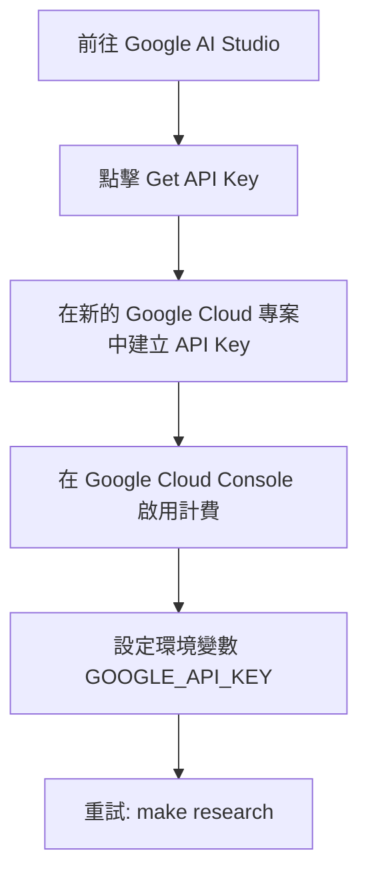
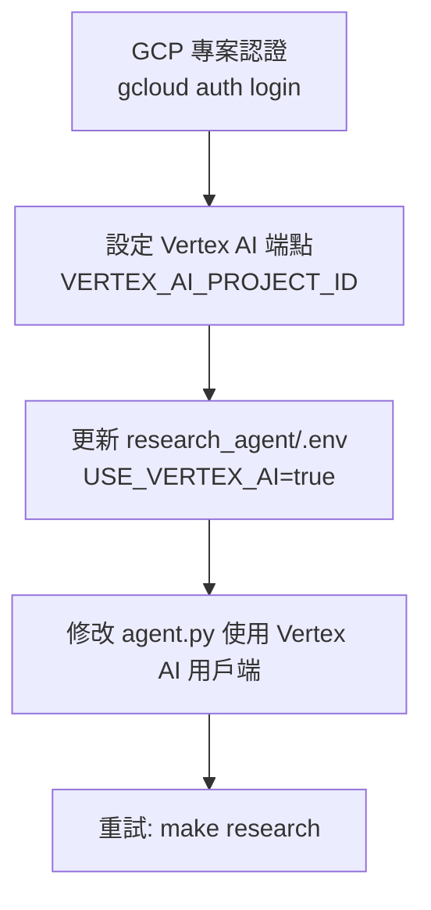
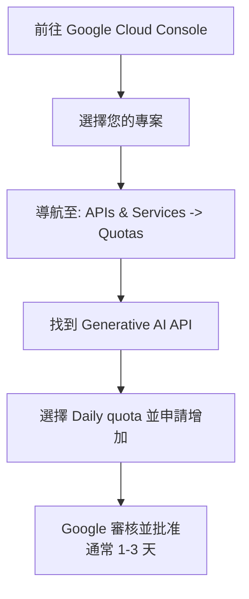

# 深度研究代理 (Deep Research Agent) 範例

本範例展示如何透過 Interactions API 使用 Google 的深度研究代理 (Deep Research Agent) 進行自主、多步驟的研究任務。

## 功能特色

- **背景執行**：適用於長時間運行的研究任務
- **串流傳輸**：提供進度更新 (思考摘要)
- **自定義格式**：可引導的輸出格式
- **後續對話**：研究完成後可進行追問
- **錯誤處理**：包含重試模式

## 先決條件

```bash
# 安裝依賴
make setup

# 設定您的 API 金鑰
export GOOGLE_API_KEY="your-api-key-here"
```

## 快速開始

```bash
# 執行測試以驗證設定
make test

# 執行研究演示
make demo

# 查看所有可用指令
make help
```

## 核心概念

### 背景執行

深度研究需要設定 `background=True`，因為研究任務可能需要數分鐘才能完成：

```python
from google import genai

client = genai.Client()

# 開始研究 (立即返回)
interaction = client.interactions.create(
    input="Research the future of quantum computing.",
    agent="deep-research-pro-preview-12-2025",
    background=True
)

# 輪詢完成狀態
while interaction.status != "completed":
    interaction = client.interactions.get(interaction.id)
    time.sleep(10)

print(interaction.outputs[-1].text)
```

### 帶有思考過程的串流傳輸

獲取即時進度更新：

```python
stream = client.interactions.create(
    input="Research AI trends in 2025.",
    agent="deep-research-pro-preview-12-2025",
    background=True,
    stream=True,
    agent_config={
        "type": "deep-research",
        "thinking_summaries": "auto"
    }
)

for chunk in stream:
    if chunk.event_type == "content.delta":
        if chunk.delta.type == "thought_summary":
            print(f"💭 {chunk.delta.content.text}")
        elif chunk.delta.type == "text":
            print(chunk.delta.text, end="")
```

### 自定義格式

透過提示詞 (Prompt) 引導輸出格式：

```python
prompt = """
研究電動車的普及率。

將輸出格式化為：
1. 執行摘要 (3句話)
2. 關鍵統計數據 (表格格式)
3. 區域分析
4. 未來展望
"""

interaction = client.interactions.create(
    input=prompt,
    agent="deep-research-pro-preview-12-2025",
    background=True
)
```

## 成本分析 💰

Gemini 深度研究代理使用 **Gemini 3 Pro Preview** 模型，收費基於 Token 消耗量和工具使用量。

### 模型定價 (批次模式)

| 項目                            | 成本                   | 備註                        |
| ------------------------------- | ---------------------- | --------------------------- |
| **輸入 Token**                  | 每 100 萬 Token $2.00  | 文字、圖片、影片輸入        |
| **輸出 Token**                  | 每 100 萬 Token $12.00 | 文字回應和推理              |
| **上下文快取**                  | 每 100 萬 Token $0.20  | 適用於 Prompt ≤ 20 萬 Token |
| **Google 搜尋接地 (Grounding)** | 每 1,000 次查詢 $35\*  | 每月 5,000 次免費額度後     |

\*定價於 2026 年 1 月 5 日開始生效。目前免費但受限於可用層級。

### 典型研究成本估算

基於典型的深度研究查詢 (20 分鐘的研究工作階段)：

| 指標                       | 數值                 | 計算方式              |
| -------------------------- | -------------------- | --------------------- |
| **每次查詢平均輸入 Token** | ~2,000 Token         | 初始研究提示 + 上下文 |
| **平均搜尋查詢次數**       | 5-8 次查詢           | 規劃 + 迭代搜尋       |
| **預估輸出 Token**         | ~8,000-12,000 Token  | 綜合研究報告          |
| **工作階段總 Token**       | ~50,000-80,000 Token | 輸入 + 處理 + 輸出    |
| **每次研究預估成本**       | **$0.70-$1.20**      | 依標準批次費率計算    |

### 成本優化技巧

1. **使用批次模式**：成本降低 50% (不適用於免費層級)
2. **具體明確**：詳細的查詢可減少迭代搜尋次數
3. **監控用量**：檢查回應中的 Token 計數
4. **免費層級限制**：
   - 每月 5,000 次免費搜尋查詢 (Grounding)
   - 充裕的免費 Token 額度供測試使用

### 生產環境成本情境

| 情境                           | 每月預估  | 詳細資訊       |
| ------------------------------ | --------- | -------------- |
| **輕量使用** (每月 10 次查詢)  | ~$8-12    | 開發/測試      |
| **標準使用** (每月 100 次查詢) | ~$70-120  | 常規研究任務   |
| **重度使用** (每月 500 次查詢) | ~$350-600 | 企業級研究流程 |

### 參考資料

- [Gemini API 定價](https://ai.google.dev/gemini-api/docs/pricing) - 最新官方定價
- [Vertex AI 定價](https://cloud.google.com/vertex-ai/generative-ai/pricing) - 企業選項
- 定價截至 2025 年 12 月有效

## 疑難排解

### 錯誤 429：配額已滿 (Quota Exceeded)

**症狀**：`Error code: 429 - You do not have enough quota to make this request`

**原因**：

- 免費層級速率限制 (通常為每天 100-200 次請求)
- 超出每月配額分配
- 過多併發請求

**解決方案**：

#### 1. **等待配額重置** (立即)

```bash
# 免費層級配額每 24 小時重置一次
# 明天再試
make demo  # 使用模擬模式 (無需配額)
```

#### 2. **切換至免費模擬模式** (立即)

```bash
make demo  # 展示無需 API 呼叫的深度研究
```

#### 3. **升級至付費層級** (建議用於測試)



**優點**：

- 更高的速率限制 (每天數千次請求)
- 依使用量付費
- 更好的配額管理

#### 3b. **使用 Vertex AI** (適用於已有專案的 GCP 使用者)

如果您已經有啟用 Vertex AI 的 Google Cloud 專案：



**優點**：

- 使用現有 GCP 專案配額
- 企業級配額 (通常較高)
- Cloud Logging 中的稽核軌跡
- 與其他 GCP 服務整合
- 潛在的用量折扣

**定價**：

- 與 Google AI Studio 相同 (輸入 $2.00/1M，輸出 $12.00/1M Token)
- 帳單計入您的 GCP 專案
- 免費層級配額可能依專案設定而定

#### 4. **申請更高配額** (用於生產環境)

如果您有現有的 Google Cloud 專案：



#### 5. **聯繫 Google Cloud 銷售團隊** (用於企業)

針對大規模生產部署：

- [Google Cloud 聯繫頁面](https://cloud.google.com/contact)
- 討論：專用配額、SLA、支援
- 獲取：用量折扣、自定義速率限制

### 其他常見問題

| 錯誤                                               | 原因         | 解決方案                                |
| -------------------------------------------------- | ------------ | --------------------------------------- |
| `ImportError: cannot import name 'ResearchStatus'` | 缺少依賴     | 執行：`make setup`                      |
| `GOOGLE_API_KEY not set`                           | 缺少環境變數 | 設定金鑰：`export GOOGLE_API_KEY='...'` |
| 研究耗時 >60 分鐘                                  | 複雜查詢過大 | 簡化查詢，拆分為較小的部分              |
| `connection timeout`                               | 網路問題     | 檢查網路，使用 `--max-wait 300` 重試    |

## 使用案例

| 使用案例 | 查詢範例                          |
| -------- | --------------------------------- |
| 市場研究 | "分析 AI 程式碼助理的競爭格局"    |
| 盡職調查 | "研究 X 公司的財務表現和市場地位" |
| 文獻回顧 | "調查 Transformer 架構的最新進展" |
| 競爭分析 | "比較雲端供應商的定價和功能"      |

## 專案結構

```
deep-research-agent/
├── Makefile                    # 建置和執行指令
├── README.md                   # 本檔案
├── pyproject.toml             # 專案設定
├── requirements.txt           # 依賴項目
├── research_agent/            # 主要代理模組
│   ├── __init__.py
│   ├── agent.py               # 深度研究實作
│   ├── streaming.py           # 串流工具
│   └── .env.example           # 環境範本
└── tests/                     # 測試套件
    └── test_research.py       # 研究代理測試
```

## 限制

- 最大研究時間：60 分鐘 (大多數在 ~20 分鐘內完成)
- 無自定義函式呼叫工具 (Function Calling)
- 不支援音訊輸入
- 尚未支援結構化輸出

## 了解更多

- [深度研究文件](https://ai.google.dev/gemini-api/docs/deep-research)
- [部落格文章：精通 Interactions API](../../../notes/google-adk-training-hub/blog/2025-12-12-interactions-api-deep-research.md)
- [Google AI Studio](https://aistudio.google.com/apikey)
- [Vertex AI 文件](https://cloud.google.com/vertex-ai/docs)
- [Vertex AI 生成式模型](https://cloud.google.com/vertex-ai/docs/generative-ai/learn/models)
- [Google Cloud SDK](https://cloud.google.com/sdk/docs)

## 重點摘要 (非程式碼)

- **核心概念**：

  - 展示如何使用 Google 的 Deep Research Agent 和 Interactions API 來執行長時間運行的自主研究任務。
  - 支援從背景執行到即時串流思考過程 (Thought process) 的多種互動模式。

- **關鍵技術**：

  - **Interactions API**：用於管理與 AI 代理的互動。
  - **背景執行 (Background Execution)**：處理需要數分鐘的研究任務，並透過輪詢檢查狀態。
  - **串流思考摘要 (Streaming Thought Summaries)**：即時顯示 AI 的思考與規劃過程。
  - **Gemini 3 Pro Preview**：底層使用的模型。

- **重要結論**：

  - 深度研究成本較高，建議使用批次模式 (Batch Mode) 節省 50% 成本。
  - 遇到 429 配額錯誤時，可切換至 Vertex AI 或付費層級以獲得更高配額。
  - 目前每次研究成本約為 $0.70 - $1.20。

- **行動項目**：
  - 執行 `make setup` 安裝環境。
  - 設置 `GOOGLE_API_KEY`。
  - 透過 `make demo` 先行體驗模擬模式，確認無誤後再執行 `make research` 進行實際調用。
