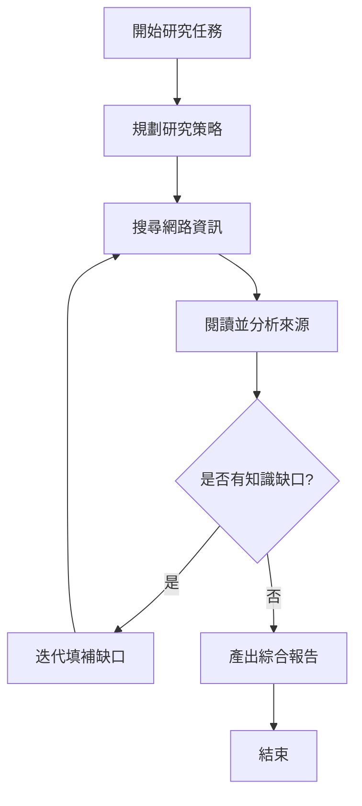
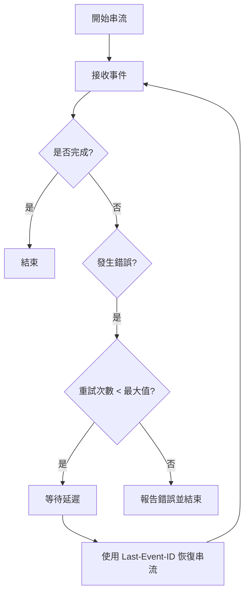

## 深度研究代理 (Deep Research Agent) 實作

### 本模組提供 Google 深度研究代理 (Deep Research Agent) 的高階介面，
該代理能自主規劃、執行並整合多步驟的研究任務。

深度研究代理 (Deep Research Agent) 的工作流程：
- 規劃研究策略
- 在網路上搜尋資訊
- 閱讀並分析來源
- 迭代以填補知識缺口
- 產出包含引用的綜合報告

### 工作流程圖：

## Streaming

### 深度研究代理 (Deep Research Agent) 串流工具

本模組提供即時串流功能，用於研究任務期間的進度更新。

串流與重連流程：
