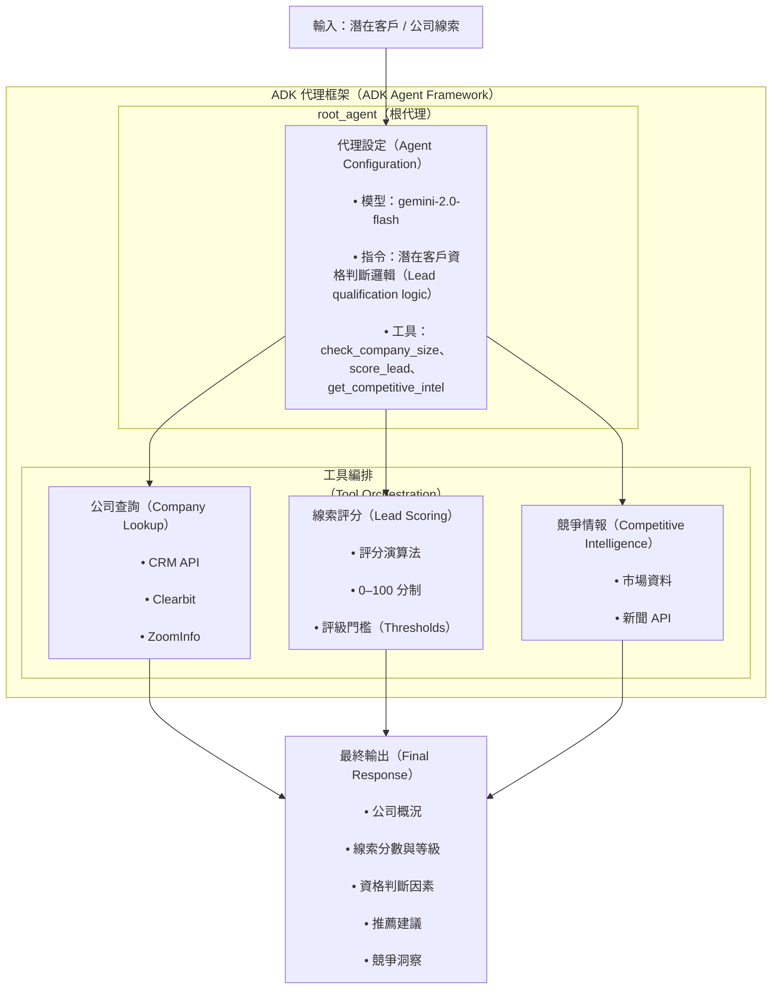
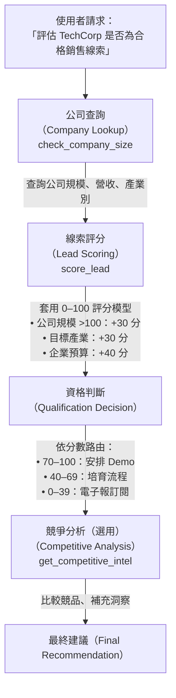
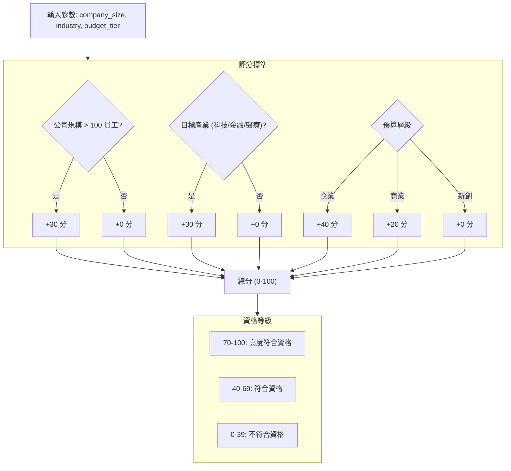

# 教學 26: Gemini Enterprise - 企業級 Agent 平台

**使用 Gemini Enterprise (前身為 Google AgentSpace) 在企業規模部署和管理 ADK Agent**

## 概述

本教學演示如何建立適合部署到 **Gemini Enterprise** 的生產級 ADK Agent，Gemini Enterprise 是 Google Cloud 的企業級 Agent 編排、治理和協作平台。

**您將學到：**
- 使用 ADK 建立企業級 Agent
- 設計用於企業整合的工具
- 潛在客戶資格審查和評分模式
- 透過 Vertex AI Agent Builder 將 Agent 部署到 Gemini Enterprise
- 企業治理和安全模式

**關鍵概念：**
- 企業級 Agent 架構
- CRM 整合工具設計
- 潛在客戶評分演算法
- 競爭情報收集
- 生產部署工作流程

## 快速入門

```bash
# 1. 設定
make setup

# 2. 設定身份驗證
export GOOGLE_API_KEY=your_api_key_here

# 3. 執行演示
make demo

# 4. 啟動開發伺服器
make dev
```

## 專案結構

```
enterprise-agent/
├── enterprise_agent/           # Agent 實作
│   ├── __init__.py            # 套件初始化
│   ├── agent.py               # 企業潛在客戶資格審查 Agent
│   └── .env.example           # 環境變數範本
├── tests/                     # 完整的測試套件
│   ├── __init__.py
│   ├── test_agent.py          # Agent 設定測試
│   ├── test_tools.py          # 工具函數測試 (28 個測試)
│   ├── test_imports.py        # 匯入驗證測試
│   └── test_structure.py      # 專案結構測試
├── pyproject.toml             # 現代 Python 打包設定
├── requirements.txt           # Python 依賴
├── Makefile                   # 開發指令
└── README.md                  # 本文件
```

### Agent 架構



**資料流程：**
1. **使用者查詢** → Agent 接收資格審查請求
2. **工具選擇** → Agent 根據查詢選擇適當的工具
3. **資料收集** → 工具獲取公司資料、計算分數、收集情報
4. **綜合** → Agent 將工具輸出結合成全面的建議
5. **回應** → 包含可執行洞察的結構化資格報告

## 本教學實作內容

### 企業潛在客戶資格審查 Agent

一個展示企業部署模式的生產級 Agent：

**Agent 能力：**
- **公司情報**：查詢公司規模、營收和產業
- **潛在客戶評分**：根據客觀標準將潛在客戶評分 0-100
- **競爭分析**：提供銷售定位的情報

**評分標準：**
- 公司規模 > 100 名員工：**+30 分**
- 目標產業 (科技、金融、醫療保健)：**+30 分**
- 企業預算層級：**+40 分**

**資格閾值：**
- **70-100**：高度符合資格 (HIGHLY QUALIFIED) → 立即安排演示
- **40-69**：符合資格 (QUALIFIED) → 提供針對性內容進行培育
- **0-39**：不符合資格 (UNQUALIFIED) → 加入電子報以供後續追蹤

### 潛在客戶資格審查工作流程



### 工具函數

#### 1. `check_company_size(company_name: str)`
從企業資料庫查詢公司資訊。

**生產環境中：** 將整合：
- CRM 系統 (Salesforce, HubSpot)
- 公司情報 API (Clearbit, ZoomInfo)
- 內部資料庫

**回傳值：**
```python
{
    "status": "success",
    "company_name": "TechCorp",
    "data": {
        "employees": 250,
        "revenue": "50M",
        "industry": "technology"
    },
    "report": "Found company data: 250 employees, $50M revenue"
}
```

#### 2. `score_lead(company_size: int, industry: str, budget: str)`
根據資格標準將銷售潛在客戶評分 0-100。

**評分邏輯：**
- 大型公司 (>100 員工)：+30 分
- 目標產業 (科技/金融/醫療保健)：+30 分
- 企業預算：+40 分 (商業預算：+20 分)

**回傳值：**
```python
{
    "status": "success",
    "score": 100,
    "qualification": "HIGHLY QUALIFIED",
    "factors": [
        "✅ Company size > 100 employees (+30 points)",
        "✅ Target industry: technology (+30 points)",
        "✅ Enterprise budget tier (+40 points)"
    ],
    "recommendation": "Schedule demo immediately",
    "report": "Lead scored 100/100 - HIGHLY QUALIFIED. Schedule demo immediately"
}
```

#### 3. `get_competitive_intel(company_name: str, competitor: str)`
提供銷售定位的競爭情報。

**生產環境中：** 將整合：
- 市場情報平台
- 新聞聚合 API
- 社群聆聽工具
- 財務數據提供商

**回傳值：**
```python
{
    "status": "success",
    "data": {
        "company": "TechCorp",
        "competitor": "CompetitorX",
        "differentiators": [...],
        "competitor_weaknesses": [...],
        "recent_news": [...]
    },
    "report": "Competitive Analysis: TechCorp vs CompetitorX\n..."
}
```

## 使用範例

### 範例 1：評估潛在客戶

```python
from enterprise_agent import root_agent
from google.adk.agents import Runner

runner = Runner()
result = await runner.run_async(
    "Qualify TechCorp as a sales lead with enterprise budget",
    agent=root_agent
)
print(result.content.parts[0].text)
```

**範例輸出：**
```
TechCorp Lead Qualification:

Company Profile:
- Size: 250 employees
- Revenue: $50M
- Industry: Technology

Lead Score: 100/100 - HIGHLY QUALIFIED

Qualification Factors:
✅ Company size > 100 employees (+30 points)
✅ Target industry: technology (+30 points)
✅ Enterprise budget tier (+40 points)

Recommendation: Schedule demo immediately

This is an ideal prospect matching all our qualification criteria.
Priority: High - Contact within 24 hours.
```

### 範例 2：與競爭對手比較

```python
result = await runner.run_async(
    "Compare us to CompetitorX for the TechCorp opportunity",
    agent=root_agent
)
```

### 範例 3：評估多個潛在客戶

```python
result = await runner.run_async(
    "Score these leads: FinanceGlobal (business budget), RetailMart (startup budget)",
    agent=root_agent
)
```

## 測試

執行完整的測試套件：

```bash
make test
```

**測試覆蓋率：**
- ✅ Agent 設定與建立 (8 個測試)
- ✅ 工具函數邏輯 (28 個測試)
  - 公司查詢功能
  - 潛在客戶評分演算法
  - 競爭情報收集
  - 完整資格審查工作流程
- ✅ 匯入驗證 (9 個測試)
- ✅ 專案結構驗證 (14 個測試)
- **總計：59+ 個完整測試**

## 部署到 Gemini Enterprise

### 選項 1：透過 ADK CLI 部署

```bash
# 部署到 Vertex AI Agent Engine
adk deploy agent_engine \
  --project your-gcp-project \
  --region us-central1 \
  --staging_bucket gs://your-staging-bucket \
  --display_name "Enterprise Lead Qualifier" \
  ./enterprise_agent
```

### 選項 2：透過 Python API 部署

```python
from vertexai import agent_engines

# 將 Agent 包裝在 AdkApp 物件中
app = agent_engines.AdkApp(
    agent=root_agent,
    enable_tracing=True
)

# 部署到 Agent Engine
remote_app = agent_engines.create(
    app=app,
    project='your-gcp-project',
    region='us-central1',
    display_name='Enterprise Lead Qualifier'
)
```

### 選項 3：手動打包並部署

```bash
# 建立部署套件
adk package \
  --agent agent.py:root_agent \
  --requirements requirements.txt \
  --output lead-qualifier-v1.zip

# 透過 gcloud 部署
gcloud ai agent-builder agents create \
  --project=your-project \
  --region=us-central1 \
  --display-name="Lead Qualifier" \
  --description="Enterprise sales lead qualification"
```

## 企業設定

### 生產環境設定

對於生產部署，請透過 Gemini Enterprise 控制台設定您的 Agent，或使用 ADK 部署 API 進行自動化設定。

### 資料連接器

在 Gemini Enterprise 控制台中設定企業資料來源：

**Salesforce 整合：**
- CRM 資料存取 (潛在客戶、機會、帳戶)
- OAuth2 身份驗證
- 即時同步

**公司情報 API：**
- Clearbit 或 ZoomInfo 整合
- 公司基本資料
- 產業和規模資訊

**分析平台：**
- BigQuery 用於歷史分析
- 潛在客戶評分模型訓練資料
- 效能指標

## Gemini Enterprise 功能

### 您將獲得

**Agent 管理：**
- 網頁版 Agent 控制台
- 用於發現和分享的 Agent Gallery
- 用於無程式碼 Agent 建立的 Agent Designer
- 版本控制和 rollback

**治理：**
- 基於角色的存取控制 (RBAC)
- 資料駐留控制
- 合規性 (SOC2, GDPR, HIPAA, FedRAMP)
- 稽核日誌
- PII 保護

**協作：**
- 多 Agent 編排
- 跨團隊 Agent 分享
- 使用量監控和成本追蹤
- 效能分析

**資料連接器：**
- Google Workspace (Drive, Docs, Sheets)
- Microsoft 365 (SharePoint, OneDrive)
- Salesforce CRM
- BigQuery 和 Cloud Storage
- GitHub 儲存庫

### 定價 (2025 年 10 月)

**Gemini Business** - $21/席位/月
- 預建 Google Agent
- Agent Designer (無程式碼建構器)
- 基本資料連接器
- 每個席位 25 GiB 儲存空間 (共用池)
- 最多 300 個席位

**Gemini Enterprise Standard** - $30/席位/月
- 包含 Business 版所有功能
- 自帶 ADK Agent
- 進階安全性 (VPC-SC, CMEK)
- 增強合規性 (HIPAA, FedRAMP)
- 每個席位 75 GiB 儲存空間 (共用池)
- 無限席位

**使用成本** (所有版本)：
- 模型推論：標準 Vertex AI 定價
  - gemini-2.0-flash: ~$0.075/1M 輸入 token
  - gemini-2.5-flash: ~$0.075/1M 輸入 token
  - gemini-2.5-pro: ~$1.25/1M 輸入 token
- 儲存：$0.023/GB/月 (超過配額部分)

## 開發

### 本地執行

```bash
# 啟動 ADK 網頁介面
make dev

# 開啟 http://localhost:8000
# 從 agent 下拉選單中選擇 'lead_qualifier'
```

### 執行測試

```bash
# 執行所有測試
make test

# 執行特定測試檔案
pytest tests/test_tools.py -v

# 執行包含覆蓋率的測試
pytest tests/ --cov=enterprise_agent --cov-report=html
```

### 進行修改

1. 編輯 `enterprise_agent/agent.py`
2. 執行測試：`make test`
3. 本地測試：`make dev`
4. 部署到暫存環境
5. 監控與驗證
6. 推廣到生產環境

## 生產考量

### 安全性

- 在生產環境使用服務帳戶身份驗證
- 啟用 VPC Service Controls 進行資料隔離
- 實作客戶管理加密金鑰 (CMEK)
- 定期安全稽核和滲透測試
- API 速率限制和濫用預防

### 效能

- 模型選擇：常規查詢使用 gemini-2.0-flash
- 實作公司資料查詢快取
- 批次處理大量潛在客戶評分
- 根據需求自動擴展
- 資料庫存取連接池

### 監控

- Cloud Monitoring 儀表板
- 錯誤率警報 (>5% 閾值)
- 延遲監控 (P95 < 2s)
- 成本追蹤和預算警報
- 使用者滿意度指標

### 合規性

- 啟用所有 Agent 互動的稽核日誌
- 設定資料駐留需求
- 實作 PII 遮蔽策略
- 定期合規性審查 (SOC2, GDPR, HIPAA)
- 資料保留和刪除策略

## 疑難排解

### 常見問題

**問題：** Agent 未出現在 ADK 網頁介面中
```bash
# 解決方案：以可編輯模式安裝套件
pip install -e .
```

**問題：** 身份驗證錯誤
```bash
# 解決方案：設定 API 金鑰
export GOOGLE_API_KEY=your_key_here

# 或針對 Vertex AI：
export GOOGLE_APPLICATION_CREDENTIALS=/path/to/key.json
export GOOGLE_CLOUD_PROJECT=your-project
```

**問題：** 匯入錯誤
```bash
# 解決方案：安裝依賴
make setup
```

## 連結

- **實作**：[企業潛在客戶資格審查 Agent](./enterprise_agent/agent.py)
- **Gemini Enterprise**：[cloud.google.com/gemini-enterprise](https://cloud.google.com/gemini-enterprise)
- **ADK 文件**：[google.github.io/adk-docs/](https://google.github.io/adk-docs/)
- **Vertex AI Agent Builder**：[cloud.google.com/agent-builder](https://cloud.google.com/agent-builder)

## 貢獻

本實作遵循既定的教學模式：

1. **程式碼優先**：在文件之前完成實作
2. **全面測試**：59+ 個測試涵蓋所有功能
3. **友善設定**：簡單的 `make setup && make dev` 工作流程
4. **清晰文件**：逐步指南和架構說明
5. **生產就緒**：企業部署的真實世界模式

---

_為 ADK 社群用 ❤️ 打造_

### 潛在客戶評分演算法



**範例計算：**
- TechCorp: 250 名員工 (科技) + 企業預算
- 分數：30 (規模) + 30 (產業) + 40 (預算) = **100/100**
- 結果：**高度符合資格** → 立即安排演示

## 重點摘要 (程式碼除外)
- **核心概念**：Gemini Enterprise 平台上的企業級 Agent 開發與部署。
- **關鍵技術**：Google ADK, Gemini Enterprise, Vertex AI Agent Builder, Python, Mermaid 圖表。
- **重要結論**：本專案展示了如何建立一個生產就緒的潛在客戶資格審查 Agent，包含完整的測試、文件和部署流程。它強調了企業整合、潛在客戶評分邏輯和競爭分析的重要性。
- **行動項目**：
    1. 設定開發環境 (`make setup`)。
    2. 設定身份驗證。
    3. 執行演示 (`make demo`) 驗證功能。
    4. 參考部署選項將 Agent 部署到 Gemini Enterprise。
