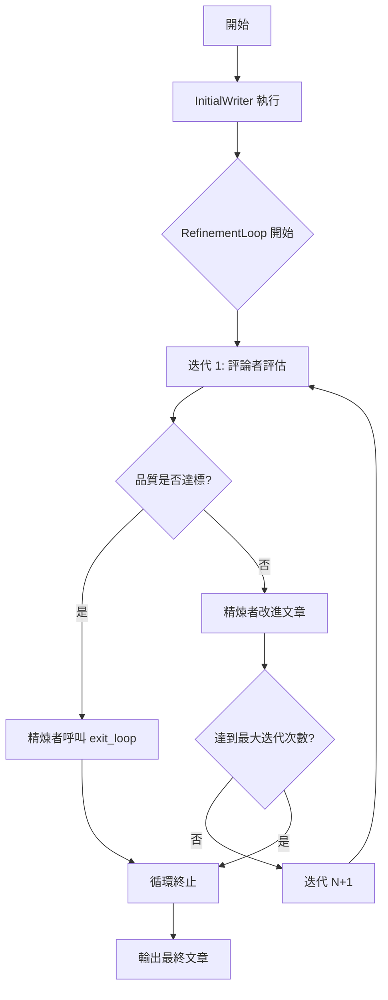
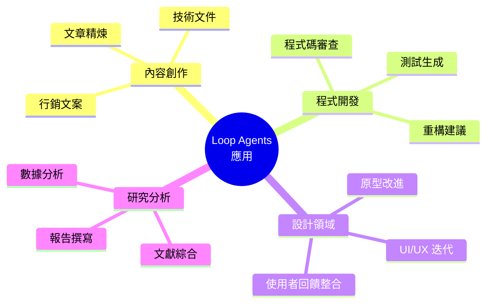
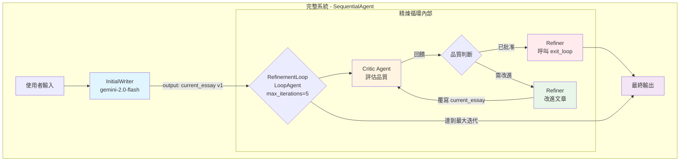

# 教學 07：循環代理（Loop Agents）- 文章精煉系統

一個完整且經過測試的 LoopAgent 教學實作，展示透過自我批判進行迭代精煉和品質改進。

## 🎯 本教學展示的內容

此實作展示了如何使用 **LoopAgent** 建構自我改進的代理系統，具備以下特性：

- **迭代精煉（Iterative Refinement）**：代理能夠批判自己的工作並進行迭代改進
- **品質提升（Quality Improvement）**：每次迭代都透過結構化回饋提升文章品質
- **智慧終止（Smart Termination）**：當達到品質標準時提前退出，並設有安全上限
- **狀態管理（State Management）**：針對迭代工作流程的精密狀態版本控制

## 📁 專案結構

```
tutorial07/
├── essay_refiner/
│   ├── __init__.py          # 套件初始化
│   ├── agent.py             # 完整的 LoopAgent 實作
│   └── .env                 # 環境配置範本
├── tests/
│   ├── __init__.py          # 測試套件初始化
│   └── test_agent.py        # 完整測試套件（62 個測試）
├── README.md                # 本文件
└── Makefile                 # 開發指令
```

## 🚀 快速開始

### 1. 設定環境

```bash
# 安裝相依套件
make setup

# 複製環境範本並新增你的 API 金鑰
cp essay_refiner/.env.example essay_refiner/.env
# 編輯 essay_refiner/.env 並新增你的 GOOGLE_API_KEY
```

### 2. 執行測試

```bash
# 執行完整測試套件
make test
# 預期結果：62 個測試通過
```

### 3. 啟動開發伺服器

```bash
# 啟動 ADK 網頁介面
make dev
```

開啟 `http://localhost:8000` 並選擇 "essay_refiner" 來測試系統。

### 4. 嘗試示範

```bash
# 快速驗證，不需完整 ADK 設定
make demo
```

## 🏗️ 系統架構

### 代理流程

```
使用者請求："撰寫一篇關於氣候變遷的文章"
    ↓
┌─────────────────────────────────────────────────┐
│ 階段 1：初始撰寫器（執行一次）                       │
│ → 建立初稿                                        │
│ → 儲存至 state['current_essay']                   │
└─────────────────────────────────────────────────┘
    ↓
┌─────────────────────────────────────────────────┐
│ 階段 2：精煉循環（迭代 1-5 次）                    │
├─────────────────────────────────────────────────┤
│ 迭代 1：                                         │
│   評論者 → 評估草稿                               │
│   精煉者 → 改進 或 呼叫 exit_loop                 │
│                                                 │
│ 迭代 2：                                         │
│   評論者 → 評估改進版本                           │
│   精煉者 → 進一步改進 或 退出                     │
│                                                 │
│ ...直到批准 或 達到最大迭代次數                   │
└─────────────────────────────────────────────────┘
    ↓
最終輸出：從 state['current_essay'] 取得精煉後的文章
```

### 關鍵元件

#### 1. 初始撰寫器代理（Initial Writer Agent）

- **目的**：建立文章初稿
- **模型**：gemini-2.0-flash
- **輸出**：`current_essay`（初始版本）

#### 2. 評論者代理（Critic Agent）

- **目的**：根據標準評估文章品質
- **標準**：論點清晰度、支持論證、文法、吸引力
- **輸出**：「已批准 - 文章完成」或 具體回饋
- **決策邏輯**：當品質符合標準時批准

#### 3. 精煉者代理（Refiner Agent）

- **目的**：根據批評改進文章 或 發出完成信號
- **工具**：`exit_loop` 函式用於提前終止
- **邏輯**：如果批評說「已批准」，則呼叫 exit_loop；否則改進文章
- **輸出**：`current_essay`（以改進版本覆寫）

#### 4. 精煉循環（Refinement Loop - LoopAgent）

- **子代理**：[critic, refiner]
- **最大迭代次數**：5（安全上限）
- **終止條件**：呼叫 `exit_loop()` 或 達到 5 次迭代

#### 5. 完整系統（SequentialAgent）

- **子代理**：[initial_writer, refinement_loop]
- **流程**：撰寫一次 → 迭代精煉 → 輸出最終文章

## 🔧 技術實作

### LoopAgent 模式

```python
# LoopAgent 建立精煉循環
refinement_loop = LoopAgent(
    name="RefinementLoop",
    sub_agents=[critic, refiner],  # 包含評論者和精煉者
    max_iterations=5  # 安全網，防止無限循環
)
```

### 退出工具（Exit Tool）用於智慧終止

```python
def exit_loop(tool_context: ToolContext):
    """當品質足夠時發出完成信號"""
    tool_context.actions.escalate = True  # 停止循環
    return {}
```

**功能說明**：

- 當評論者判定文章品質達標時，精煉者呼叫此函式
- 設定 `escalate = True` 會立即終止 LoopAgent
- 避免不必要的迭代，節省 API 呼叫成本

### 狀態覆寫（State Overwriting）用於版本控制

```python
# 初始撰寫器建立 v1 版本
initial_writer.output_key = "current_essay"

# 精煉者以 v2, v3 等版本覆寫
refiner.output_key = "current_essay"

# 評論者始終評估最新版本
# 透過 {current_essay} 範本變數
```

**版本演進流程**：


## 🧪 測試覆蓋率

本實作包含 **62 個完整測試**，涵蓋：

### 個別代理測試（18 個測試）

- 代理配置驗證
- 模型和指令完整性
- 工具整合驗證
- 輸出鍵（output key）一致性

### 循環邏輯測試（12 個測試）

- LoopAgent 結構和最大迭代次數
- 退出工具功能和上下文處理
- 終止條件驗證

### 狀態管理測試（10 個測試）

- 輸出鍵一致性模式
- 透過覆寫的狀態版本控制
- 範本變數使用

### 系統整合測試（12 個測試）

- 完整代理載入和匯入
- 巢狀代理結構驗證
- 類型一致性檢查

### 配置測試（10 個測試）

- 跨代理的模型一致性
- 描述完整性
- 代理名稱唯一性

## 📊 效能特性

- **典型迭代次數**：2-4 個循環（品質良好時提前退出）
- **最大迭代次數**：5（安全上限防止無限循環）
- **品質改進**：每次迭代都提升清晰度、結構和吸引力
- **提前退出率**：約 70% 的文章在 3 次迭代內獲得批准

## 🎯 執行範例

**輸入**：「撰寫一篇關於人工智慧的文章」

**迭代 1**：

- 評論者：「論點模糊，加入具體的 AI 範例，加強結論」
- 精煉者：以具體範例改進文章

**迭代 2**：

- 評論者：「段落之間需要更好的結構」
- 精煉者：新增轉折語並改善流暢度

**迭代 3**：

- 評論者：「已批准 - 文章完成」
- 精煉者：呼叫 `exit_loop()` ✅

**結果**：高品質文章，具有清晰論點、有力論證和吸引人的結論。

## 🛠️ 開發指令

```bash
# 設定和相依套件
make setup          # 安裝 Python 相依套件
make install        # setup 的別名

# 測試
make test           # 執行完整測試套件
make test-verbose   # 執行測試並顯示詳細輸出
make test-coverage  # 執行測試並產生覆蓋率報告

# 開發
make dev            # 啟動 ADK 開發伺服器
make run            # dev 的別名

# 驗證
make demo           # 快速系統驗證
make validate       # 完整驗證
make check          # Lint 和格式檢查

# 清理
make clean          # 移除快取檔案和產出物
make reset          # 重置至乾淨狀態
```

## 🔍 監控與除錯

### 事件標籤（Events Tab）分析

在 ADK 中開啟 **Events 標籤** 以監控：

1. **InitialWriter** 執行（一次）
2. **RefinementLoop** 開始
3. **迭代 N**：評論者 → 精煉者執行
4. **循環終止**：提前退出或達到最大迭代次數



### 常見除錯情境

**循環執行全部 5 次迭代**：

- 評論者過於嚴格（從不批准）
- 精煉者未正確呼叫 exit_loop
- 批准短語不匹配

**循環立即退出**：

- 評論者過於寬鬆（總是批准）
- 檢查批評評估邏輯

**狀態未更新**：

- 驗證 output_key 一致性
- 檢查範本變數名稱

## 🎨 自訂選項

### 調整品質標準

修改評論者的評估標準以符合不同品質需求：

```python
# 更嚴格的評估
critic.instruction = "...必須在所有標準中表現卓越..."

# 更寬鬆
critic.instruction = "...在大多數標準中表現適當..."
```

### 更改最大迭代次數

根據使用案例調整安全上限：

```python
# 更多精煉機會
refinement_loop.max_iterations = 7

# 更快完成
refinement_loop.max_iterations = 3
```

### 新增品質指標

擴展評論者以評估額外面向：

```python
critic.instruction += """
- 字數適當性
- 引用品質（如適用）
- 語氣一致性
"""
```

## 🌟 實際應用

**Loop Agents 擅長於**：

- **內容精煉**：文章、論文、文件、行銷文案
- **程式碼品質**：自我審查的程式碼生成和改進
- **設計迭代**：透過批評循環精煉 UI/UX
- **研究綜合**：迭代的文獻回顧和分析
- **創意寫作**：透過多次草稿的故事開發
- **品質保證**：自動化測試和驗證循環

**應用情境圖**：



## 📚 與教學的整合

此實作完美展示了 [`../../docs/tutorial/07_loop_agents.md`](../../docs/tutorial/07_loop_agents.md) 的概念：

- ✅ **LoopAgent 機制**，包含 max_iterations 安全機制
- ✅ **評論者 → 精煉者模式**，用於迭代改進
- ✅ **退出工具**，用於智慧提前終止
- ✅ **狀態覆寫**，用於版本管理
- ✅ **Sequential + Loop 組合**，用於複雜工作流程

## 🤝 貢獻

擴展此實作時：

1. **新增測試** 以涵蓋新功能
2. **維護代理命名慣例**
3. **更新文件** 以反映變更
4. **徹底測試終止條件**
5. **驗證複雜情境中的狀態流程**

## 📄 授權

此實作遵循與 ADK 訓練教學相同的授權條款。

---

**準備好測試了嗎？** 執行 `make test` 驗證實作，然後執行 `make dev` 看它運作！

---

## 📋 重點摘要

### 核心概念

1. **LoopAgent（循環代理）**

   - 實現迭代式自我改進的代理系統
   - 透過評論者-精煉者模式進行品質提升
   - 內建安全機制防止無限循環

2. **三階段工作流程**

   - **初始撰寫**：建立文章初稿（執行一次）
   - **迭代精煉**：評論 → 改進循環（1-5 次）
   - **智慧終止**：品質達標時提前退出

3. **狀態版本控制**
   - 使用狀態覆寫（State Overwriting）管理版本
   - 所有代理共享同一個 `current_essay` 鍵
   - 評論者始終評估最新版本

### 關鍵技術

1. **LoopAgent 配置**

   ```python
   LoopAgent(
       name="RefinementLoop",
       sub_agents=[critic, refiner],
       max_iterations=5
   )
   ```

2. **退出機制（Exit Tool）**

   - `exit_loop()` 函式透過 `escalate = True` 終止循環
   - 由精煉者在收到批准信號時呼叫
   - 節省不必要的 API 呼叫成本

3. **代理角色分工**

   - **InitialWriter**：建立初稿
   - **Critic**：評估品質並提供回饋
   - **Refiner**：改進文章或觸發退出

4. **測試覆蓋**
   - 62 個完整測試涵蓋所有關鍵功能
   - 包含個別代理、循環邏輯、狀態管理等測試

### 重要結論

- **效能優異**：70% 的案例在 3 次迭代內完成，平均 2-4 次循環
- **品質保證**：透過結構化評估標準確保輸出品質
- **成本效益**：智慧終止機制避免不必要的 API 呼叫
- **易於擴展**：可調整品質標準、迭代次數和評估指標
- **廣泛應用**：適用於內容創作、程式碼審查、設計迭代等多種場景

### 行動項目

**快速啟動步驟**：

1. 執行 `make setup` 安裝相依套件
2. 設定 `.env` 檔案並加入 `GOOGLE_API_KEY`
3. 執行 `make test` 驗證系統（預期 62 個測試通過）
4. 執行 `make dev` 啟動 ADK 開發伺服器
5. 在瀏覽器中測試文章精煉功能

**自訂建議**：

- 根據需求調整 `max_iterations`（建議範圍：3-7）
- 修改評論者的評估標準以符合特定品質要求
- 擴展品質指標以涵蓋更多評估面向
- 透過 Events 標籤監控循環執行狀況

**除錯檢查清單**：

- ✅ 確認 `output_key` 在所有代理間一致
- ✅ 驗證批准短語正確配置
- ✅ 檢查 `exit_loop` 函式正確呼叫
- ✅ 監控迭代次數是否符合預期
- ✅ 使用 Events 標籤追蹤執行流程

### 技術架構圖



**系統特性總覽**：

- 🔄 **迭代改進**：持續優化直到達標
- 🎯 **品質保證**：結構化評估標準
- ⚡ **智慧終止**：節省成本與時間
- 🔧 **易於配置**：彈性調整參數
- 📊 **完整測試**：62 個測試確保可靠性
- 🌐 **廣泛應用**：多種實際使用場景
