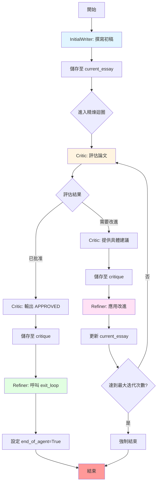

# =====================================================
# 系統架構說明
# =====================================================
"""
論文精煉系統 (Essay Refinement System) - 架構與流程

## 系統概述
這是一個使用 Google ADK 建立的自動化論文撰寫與精煉系統，採用雙階段架構：
1. 初始撰寫階段：產生論文初稿
2. 迭代精煉階段：透過評論-改進循環持續優化論文品質

## 核心組件

### 1. 退出工具 (exit_loop)
- **用途**：作為迴圈終止的信號機制
- **觸發時機**：當評論者批准論文時，由精煉者呼叫
- **實作機制**：設定 tool_context.actions.end_of_agent = True

### 2. 初始寫作者 (InitialWriter)
- **角色**：創作論文的第一版草稿
- **執行時機**：系統啟動時執行一次
- **輸出格式**：3-4 段落結構（開頭、主體、結論）
- **狀態管理**：將草稿儲存至 current_essay 狀態鍵

### 3. 評論者 (Critic)
- **角色**：評估論文品質並提供改進建議
- **評估標準**：
  - 論點清晰度與組織結構
  - 論據強度
  - 文法與風格
  - 連貫性與吸引力
- **輸出邏輯**：
  - 符合標準 → 輸出 "APPROVED - Essay is complete."
  - 需要改進 → 提供 2-3 個具體建議
- **狀態管理**：將評論儲存至 critique 狀態鍵

### 4. 精煉者 (Refiner)
- **角色**：根據評論改進論文或終止迴圈
- **決策邏輯**：
  - 收到批准 → 呼叫 exit_loop 工具
  - 收到建議 → 應用改進並更新論文
- **工具配備**：配置 exit_loop 工具用於迴圈控制
- **狀態管理**：更新後的論文覆寫 current_essay 狀態鍵

### 5. 精煉迴圈 (RefinementLoop)
- **類型**：LoopAgent（迴圈代理）
- **子代理**：[Critic, Refiner] 依序執行
- **安全機制**：max_iterations=5 防止無限迴圈

### 6. 論文精煉系統 (EssayRefinementSystem)
- **類型**：SequentialAgent（序列代理）
- **執行順序**：InitialWriter → RefinementLoop
- **系統入口**：透過 root_agent 暴露給 ADK

## 工作流程

## 狀態管理機制

系統使用共享狀態在代理間傳遞資料：

1. **current_essay**：論文內容
   - InitialWriter 初始化
   - Refiner 不斷更新
   - Critic 讀取以進行評估

2. **critique**：評論內容
   - Critic 產生
   - Refiner 讀取以決定動作

## 迴圈終止條件

1. **正常終止**：Refiner 呼叫 exit_loop 工具
2. **安全終止**：達到 max_iterations (5次)

## 設計模式

### 1. 迭代精煉模式 (Iterative Refinement Pattern)
透過重複的評估-改進循環逐步提升品質

### 2. 狀態共享模式 (Shared State Pattern)
使用 output_key 在代理間傳遞和更新狀態

### 3. 工具控制流程模式 (Tool-Controlled Flow Pattern)
使用自定義工具 (exit_loop) 控制執行流程

### 4. 雙階段處理模式 (Two-Phase Processing Pattern)
分離初始創作和迭代精煉邏輯

## 關鍵技術要點

1. **LoopAgent**：實現迭代執行邏輯
2. **SequentialAgent**：實現線性流程編排
3. **ToolContext**：提供執行上下文和流程控制能力
4. **output_key**：實現代理間的狀態共享
5. **end_of_agent**：作為迴圈終止的信號旗標

## 最佳實踐

1. **明確的終止條件**：同時使用主動終止和被動安全限制
2. **清晰的角色分工**：每個代理職責單一且明確
3. **狀態不可變性**：每次改進創建新版本而非修改原版
4. **錯誤預防**：max_iterations 防止無限迴圈
5. **可觀察性**：exit_loop 函數包含日誌輸出
"""