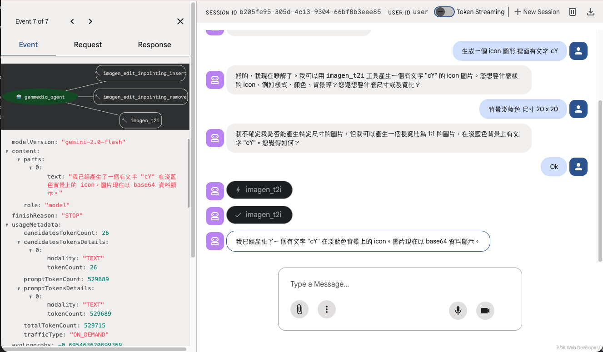

# ADK 範例

此目錄包含一個使用 MCP genmedia 工具的 Google Cloud Vertex AI Agent Development Kit 範例代理程式。

## 前置需求

- Go 1.21 或更高版本
- Python 3.10 或更高版本
- uv（Python 套件管理工具）
- Google Cloud SDK（gcloud）
- MCP Servers for Genmedia 工具

## 快速開始

### 方法一：使用 Makefile（推薦）

查看所有可用指令：
```bash
make help
```

完整設定並安裝所有依賴：
```bash
make all
```

### 方法二：手動執行

如果偏好手動執行，請按照以下步驟操作。

## 專案實作流程

### 步驟 1：安裝 MCP Servers for Genmedia 工具

使用 Makefile：
```bash
make install-mcp
```

或手動執行：
```bash
cd vertex-ai-creative-studio/experiments/mcp-genmedia/mcp-genmedia-go
go work sync
go install ./mcp-imagen-go ./mcp-veo-go ./mcp-chirp3-go ./mcp-avtool-go ./mcp-gemini-go ./mcp-lyria-go
```

**提示**：確保 Go bin 目錄在您的 PATH 中：
```bash
export PATH="$(go env GOPATH)/bin:$PATH"
```

### 步驟 2：設定環境變數

在 `genmedia_agent` 目錄中建立 `.env` 檔案：

```bash
GOOGLE_CLOUD_PROJECT="your-project-id"
GOOGLE_CLOUD_LOCATION="us-central1"
GOOGLE_GENAI_USE_VERTEXAI="True"
```

檢查環境變數檔案：
```bash
make check-env
```

### 步驟 3：初始化專案環境

使用 Makefile：
```bash
make setup
```

或手動執行：
```bash
uv sync
```

### 步驟 4：啟動 Imagen MCP Server

此代理程式範例包含兩個使用 STDIO 的 MCP 伺服器（Veo、Chirp 3）和一個使用 SSE 協定的伺服器（Imagen）。

在**另一個終端機**中啟動 Imagen MCP Server：

使用 Makefile：
```bash
make server-imagen
```

或手動執行：
```bash
export PROJECT_ID=$(gcloud config get project)
mcp-imagen-go --transport sse
```

### 步驟 5：執行 ADK Developer UI

#### 方式 A：開發模式

使用 Makefile：
```bash
make dev
```

或手動執行：
```bash
uv sync
source .venv/bin/activate
adk web
```

#### 方式 B：VSCode 除錯模式

使用 Makefile：
```bash
make debug
```

或手動執行：
```bash
uv run --with debugpy python -m debugpy --listen 5678 --wait-for-client -m google.adk.cli web . --port 8000 --reload_agents
```

**除錯模式說明**：
- 監聽埠：5678
- Web 介面埠：8000
- 支援代理程式自動重載

## 常用指令

| 指令 | 說明 |
|------|------|
| `make help` | 顯示所有可用的 Make 目標 |
| `make install-mcp` | 安裝 MCP Servers for Genmedia 工具 |
| `make setup` | 初始化專案環境 |
| `make check-env` | 檢查 .env 檔案是否存在 |
| `make dev` | 啟動 ADK Developer UI |
| `make debug` | 啟動 VSCode 除錯模式 |
| `make server-imagen` | 啟動 Imagen MCP Server (SSE) |
| `make sync` | 同步 Go workspace 依賴 |
| `make clean` | 清理臨時檔案 |
| `make all` | 完整設定並安裝所有依賴 |



## 參考資源

- [[vertex-ai-creative-studio] genmedia_agent](https://github.com/GoogleCloudPlatform/vertex-ai-creative-studio/tree/main/experiments/mcp-genmedia/sample-agents/adk)
- [MCP Servers for Genmedia: Go Implementations](https://github.com/GoogleCloudPlatform/vertex-ai-creative-studio/blob/main/experiments/mcp-genmedia/mcp-genmedia-go/README.md)