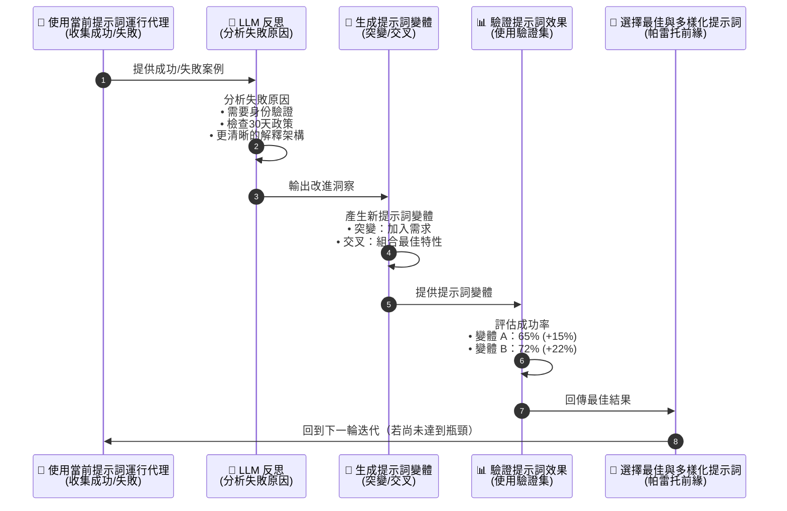

# 教學：GEPA (遺傳演算法-帕雷托提示最佳化)

了解 GEPA 如何利用 AI 引導的演化過程，自動最佳化大型語言模型 (LLM) 代理的提示 (Prompt)。

## 🚀 快速入門

```bash
# 1. 安裝依賴套件
make setup

# 2. 觀看 GEPA 實際操作 (展示)
make demo

# 3. 設定 API 金鑰 (用於互動式測試)
export GOOGLE_API_KEY=your_api_key_here

# 4. 啟動 ADK 網站介面
make dev

# 5. 開啟 http://localhost:8000 並選擇 'gepa_agent'
```

## 📚 您將學到什麼

本教學透過一個處理退款與退貨的 **模擬客服代理**，來教導 GEPA 的概念。此代理存在一些已知的缺陷，可由 GEPA 進行最佳化：

### 問題所在

初始的代理提示刻意設計得非常簡單：

```
您是一位樂於助人的客服代理。
請保持禮貌與專業。
使用可用的工具來協助客戶。
```

這個基本提示存在以下問題：
- ❌ 未明確要求身份驗證
- ❌ 未提及 30 天退貨政策
- ❌ 缺乏工具使用的順序結構
- ❌ 可能在未經適當檢查的情況下就進行退款

### GEPA 的解決方案

GEPA 透過一個 5 步驟的循環，自動地演化提示：



### 預期結果

```
初始提示：    40-50% 任務成功率
GEPA 迭代 1 後： 65% 成功率 (+15 個百分點)
GEPA 迭代 2 後： 72% 成功率 (+7 個百分點)
GEPA 迭代 3 後： 85% 成功率 (+13 個百分點)
...持續進行直到改進停滯
最終結果：      85-95% 成功率 (+35-45 個百分點！)

最佳化後的提示：
  您是一位專業的客服代理。

  關鍵要求：
  1. 務必先驗證客戶身份
     - 未經驗證絕不處理退款
     - 使用 verify_customer_identity 工具

  2. 務必檢查退貨政策
     - 驗證 30 天退貨期限
     - 若拒絕，請清楚解釋政策

  3. 提供清楚的解釋
     - 解釋所有決定
     - 引用具體的訂單細節

  工具使用順序：
  - 第一步：verify_customer_identity
  - 第二步：check_return_policy
  - 第三步：process_refund (如果符合資格)
```

## 🏗️ 架構

### 代理結構

```
客服代理
├── 工具 1：verify_customer_identity
│   └─ 檢查訂單 ID + 電子郵件
│   └─ 回傳成功/失敗
│
├── 工具 2：check_return_policy
│   └─ 驗證 30 天退貨期限
│   └─ 回傳是否符合資格
│
└── 工具 3：process_refund
    └─ 驗證後執行退款
    └─ 回傳交易詳情
```

### 評估流程

此教學代理會根據客戶情境進行評估：

**成功情境：**
- ✓ 客戶提供訂單 ID 和電子郵件
- ✓ 代理驗證身份
- ✓ 訂單在 30 天期限內
- ✓ 代理處理退款
- ✓ 結果：客戶滿意，退款已處理

**失敗情境：**
- ✗ 代理未經驗證即處理退款
- ✗ 代理忽略違反 30 天政策的情況
- ✗ 代理提供不清楚的解釋
- 結果：違反政策，客戶不滿

GEPA 會識別這些失敗模式，並演化提示以防止其發生。

## 📁 專案結構

```
gepa-optimization-agent/
├── gepa_agent/                 # 代理實作
│   ├── __init__.py            # 套件標記
│   ├── agent.py               # ADK 代理 + 工具
│   └── .env.example           # API 金鑰範本
│
├── tests/                     # 測試套件
│   ├── test_agent.py          # 代理測試
│   ├── test_imports.py        # 匯入測試
│
├── Makefile                   # 建置指令
├── README.md                  # 本檔案
├── requirements.txt           # Python 依賴套件
└── pyproject.toml            # 套件設定
```

## 🔧 設定

### 設定步驟

1. **安裝依賴套件：**
   ```bash
   make setup
   ```

2. **建立環境變數檔案：**
   ```bash
   cp gepa_agent/.env.example gepa_agent/.env
   ```

3. **加入您的 API 金鑰：**
   編輯 `gepa_agent/.env` 並加入：
   ```
   GOOGLE_API_KEY=your_api_key_here
   ```

4. **啟動代理：**
   ```bash
   make dev
   ```

### 取得 API 金鑰

- **免費 (Gemini API)**：https://aistudio.google.com/app/apikey
- **付費 (VertexAI)**：https://console.cloud.google.com/iam-admin/serviceaccounts

## 💬 使用代理

### 透過 ADK 網站介面 (建議)

```bash
make dev
# 開啟 http://localhost:8000
# 點擊 'gepa_agent' 以選擇代理
# 在聊天室中輸入訊息
```

### 試試這些提示

**測試 1：身份驗證**
```
使用者：「我想為訂單 ORD-12345 辦理退款」
預期：代理會要求驗證電子郵件
提示檢查：代理在繼續之前是否進行了驗證？
```

**測試 2：遵守政策**
```
使用者：「我可以退回 90 天前的訂單 ORD-12345 嗎？」
預期：代理會檢查政策並解釋為何不符合資格
提示檢查：代理是否知道 30 天的限制？
```

**測試 3：清楚的解釋**
```
使用者：「為什麼我的退款被拒絕了？」
預期：代理會提供詳細、清楚的解釋
提示檢查：代理是否清楚地解釋了決定？
```

## 🧪 測試

### 執行所有測試

```bash
make test
```

### 測試覆蓋率

```bash
make test-coverage
# 在 htmlcov/index.html 中產生覆蓋率報告
```

### 測試結構

測試涵蓋：
- ✓ 代理設定與初始化
- ✓ 工具宣告與非同步執行
- ✓ GEPA 最佳化概念
- ✓ 專案結構驗證
- ✓ 匯入正確性

## 🎓 學習目標

完成此教學後，您將了解：

1. **什麼是 GEPA？**
   - 用於提示演化的遺傳演算法
   - 用於解決方案多樣性的帕雷托前緣
   - 用於引導式改進的 LLM 反思

2. **為何 GEPA 有效**
   - 從失敗中學習，而不僅僅是獎勵
   - 高效率地測試多種變體
   - 維持多樣性以避免陷入局部最佳解

3. **何時使用 GEPA**
   - 代理有明確的成功/失敗指標
   - 評估是自動化/快速的
   - 需要 20-40% 的效能提升
   - 有 1-3 小時可用於最佳化

4. **如何應用 GEPA**
   - 定義評估指標
   - 建立評估資料集
   - 執行 GEPA 最佳化
   - 部署最佳化後的提示

## 🎬 GEPA 即時演化展示，參考 [GEPA.md](./GEPA.md)

在深入研究程式碼之前，先來看看 GEPA 的實際操作：

```bash
make demo
```

這會執行一個互動式展示，顯示：
1. **種子提示 (Seed Prompt)** - 一個薄弱、通用的基準
2. **評估 (Evaluation)** - 針對 5 種情境進行測試 (0% 成功率)
3. **分析 (Analysis)** - 種子提示失敗的原因
4. **演化 (Evolution)** - 一個解決了這些問題的改進版提示
5. **驗證 (Validation)** - 重新測試相同的情境 (100% 成功率！)
6. **結果 (Results)** - 顯示從 0% → 100% 改進的指標

**展示情境：**
- ✅ 有效的退款請求 (快速批准)
- ❌ 無效的電子郵件 (安全性阻擋)
- ❌ 超過 30 天期限 (違反政策)
- ✅ 剛好在 30 天的邊界 (邊界案例)
- ❌ 緊急請求 (需要先進行驗證)

**您將會看到：**
- 清晰的「之前/之後」比較
- 已識別的具體失敗
- 已進行的確切改進
- 可衡量的效能增益

此展示驗證了 GEPA 的確有效！

## 📖 理解程式碼

### 根代理 (Root Agent)

```python
from gepa_agent import root_agent

# 這是 ADK 的進入點
# 它是在網站介面中運行的代理
# 最初使用 INITIAL_PROMPT
# 可以使用 GEPA 進行演化
```

### 建立自訂代理 (Create Custom Agent)

```python
from gepa_agent.agent import create_support_agent

# 使用初始提示
agent = create_support_agent()

# 或使用自訂提示 (如同在 GEPA 最佳化期間所做)
optimized_prompt = """..."""
agent = create_support_agent(prompt=optimized_prompt)
```

### 工具 (Tools)

三個工具展示了不同的情境：

1. **verify_customer_identity**
   - 模擬身份驗證
   - 接收 order_id 和 email
   - 回傳成功/失敗

2. **check_return_policy**
   - 模擬政策驗證
   - 檢查 30 天退貨期限
   - 回傳資格狀態

3. **process_refund**
   - 模擬退款處理
   - 要求所有檢查都先通過
   - 回傳交易詳情

## 🔬 GEPA 最佳化工作流程

### 步驟 1：評估初始提示

```bash
# 基準效能測量
python -c "
from gepa_agent import root_agent
# 在 10 個測試情境上執行代理
# 測量成功率 (例如, 40-50%)
"
```

### 步驟 2：收集失敗案例

識別失敗情境：
- 缺少身份驗證
- 違反政策
- 解釋不清楚

### 步驟 3：LLM 反思

使用 gemini-2.5-pro 進行分析：
- 為什麼在未經驗證的情況下處理了退款？
- 為什麼政策被忽略了？
- 為什麼解釋不清楚？

### 步驟 4：產生變體

建立改進的提示：
- 突變：增加明確的要求
- 交配：結合最佳特點
- 優化：使用洞察

### 步驟 5：評估變體

在驗證集上進行測試：
- 變體 A：65% 成功率
- 變體 B：72% 成功率
- 變體 C：68% 成功率

### 步驟 6：選擇前緣

保留最佳且多樣化的提示：
- B (72%) - 整體最佳
- A (65%) - 替代方法
- 也許 C (68%) - 不同的策略

### 步驟 7：迭代

使用前緣提示進行下一次迭代：
- 收集 B, A, C 的新失敗案例
- 反思新的模式
- 產生下一批變體
- 評估與選擇

重複直到改進停滯。

## 📊 預期演化

```
迭代  | 最佳分數 | 改進幅度 | 工具/提示
-----------|-----------|-------------|---------------
0 (種子)   | 50%       | 基準線      | 初始簡單提示
1          | 65%       | +15%        | 4 個變體
2          | 72%       | +7%         | 5 個變體
3          | 85%       | +13%        | 5 個變體
4          | 88%       | +3%         | 4 個變體
5          | 90%       | +2%         | 達到停滯期
```

## 🐛 疑難排解

### 問題：匯入 gepa_agent 時發生 ImportError

```bash
# 解決方案：確保套件已安裝
pip install -e .
# 若需要，請重新安裝
pip install -e . --force-reinstall
```

### 問題：未設定 GOOGLE_API_KEY

```bash
# 解決方案：設定驗證
export GOOGLE_API_KEY=your_key_here

# 或使用 .env 檔案
cp gepa_agent/.env.example gepa_agent/.env
# 編輯 .env 並加入您的金鑰
```

### 問題：測試因非同步錯誤而失敗

```bash
# 解決方案：安裝 pytest-asyncio
pip install pytest-asyncio

# 然後執行測試
make test
```

### 問題：ADK 網站介面無法使用

```bash
# 解決方案：安裝 ADK CLI
pip install google-adk>=0.1.4

# 然後再試一次
make dev
```

## 🚀 後續步驟

### 深入了解 GEPA

**官方資源：**

- **[GEPA 研究論文](https://arxiv.org/abs/2507.19457)** - 史丹佛大學自然語言處理 (Stanford NLP) 的原始研究
  - "GEPA: Reflective Prompt Evolution Can Outperform Reinforcement Learning"
  - 作者：Lakshya A Agrawal 等人
  - 發表日期：2025 年 7 月

- **[DSPy 框架](https://github.com/stanfordnlp/dspy)** - GEPA 是 DSPy 的一部分
  - 完整文件：[dspy.ai](https://dspy.ai/)
  - GEPA 實作與最佳化器
  - 社群支援：[Discord](https://discord.gg/XCGy2WDCQB)

- **[教學實作](../tutorial_gepa_optimization/)** - 此可運作的範例
  - `gepa_demo.py` - 完整註解的演化展示
  - `gepa_agent/agent.py` - 帶有註解的代理實作
  - `tests/` - 全面的測試套件，展示 GEPA 概念

### 實作真正的 GEPA 最佳化

要執行實際的 GEPA 最佳化 (不僅是此概念展示)：

1. 安裝支援 GEPA 的 DSPy：
   ```bash
   pip install dspy-ai
   ```

2. 建立使用此代理的評估函數

3. 執行 GEPA 最佳化循環

4. 部署最佳化後的提示

## 📝 關鍵概念

### 帕雷托前緣 (Pareto Frontier)

不要只保留「最好」的提示，而是保留多個多樣化的提示：
- 效能最佳的
- 替代方法的
- 不同優勢的

這種多樣性使 GEPA 能在未來的迭代中進行更好的探索。

### LLM 反思 (LLM Reflection)

GEPA 的關鍵創新：
- 分析失敗的「原因」
- 提取可行的洞察
- 引導提示的演化
- 不僅是隨機突變

### 遺傳演算法 (Genetic Algorithms)

應用於提示的成熟技術：
- 突變 (Mutation)：根據洞察進行修改
- 交配 (Crossover)：結合多個提示的特點
- 選擇 (Selection)：保留最佳且多樣化的
- 演化 (Evolution)：世代改進

---

## 重點摘要
- **核心概念**：GEPA (遺傳演算法-帕雷托提示最佳化) 是一種利用 AI 引導的演化過程，自動最佳化大型語言模型 (LLM) 代理提示的方法。
- **關鍵技術**：
    - **遺傳演算法**：透過突變、交配和選擇等操作，逐步改進提示。
    - **LLM 反思**：利用 LLM 分析代理失敗的原因，並提供改進建議。
    - **帕雷托前緣**：在選擇過程中保留一組多樣化的高效能提示，以避免陷入局部最佳解。
- **重要結論**：GEPA 能夠系統性地從失敗中學習，自動演化出更強健、更符合特定需求的提示，顯著提升代理的任務成功率 (可從 40-50% 提升至 85-95%)。
- **行動項目**：
    - 依照「快速入門」指南安裝依賴、設定 API 金鑰並啟動展示。
    - 透過 `make demo` 觀看模擬的 GEPA 演化過程。
    - 理解 GEPA 的 5 步驟循環：執行、反思、產生、評估、選擇。
    - 學習如何將 GEPA 應用於自己的代理以進行最佳化。
